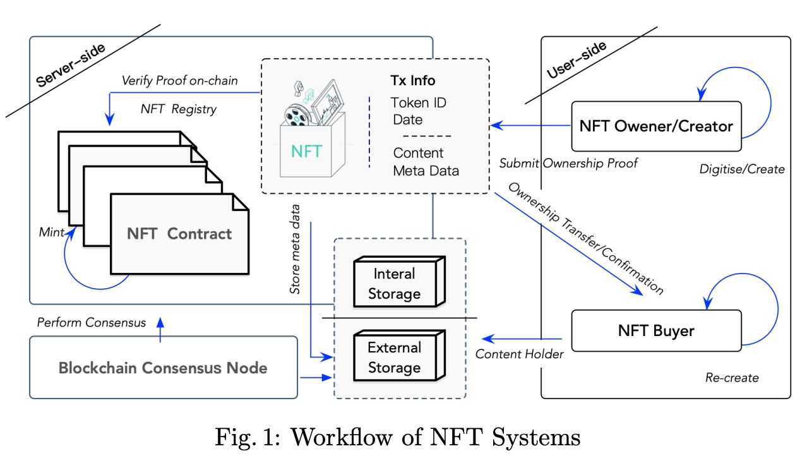
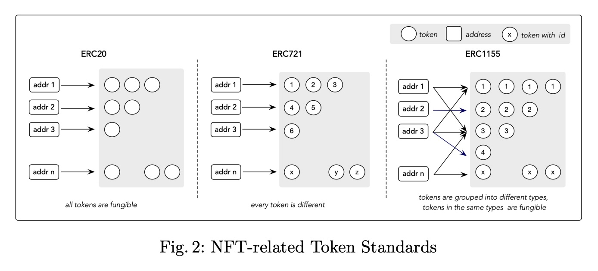
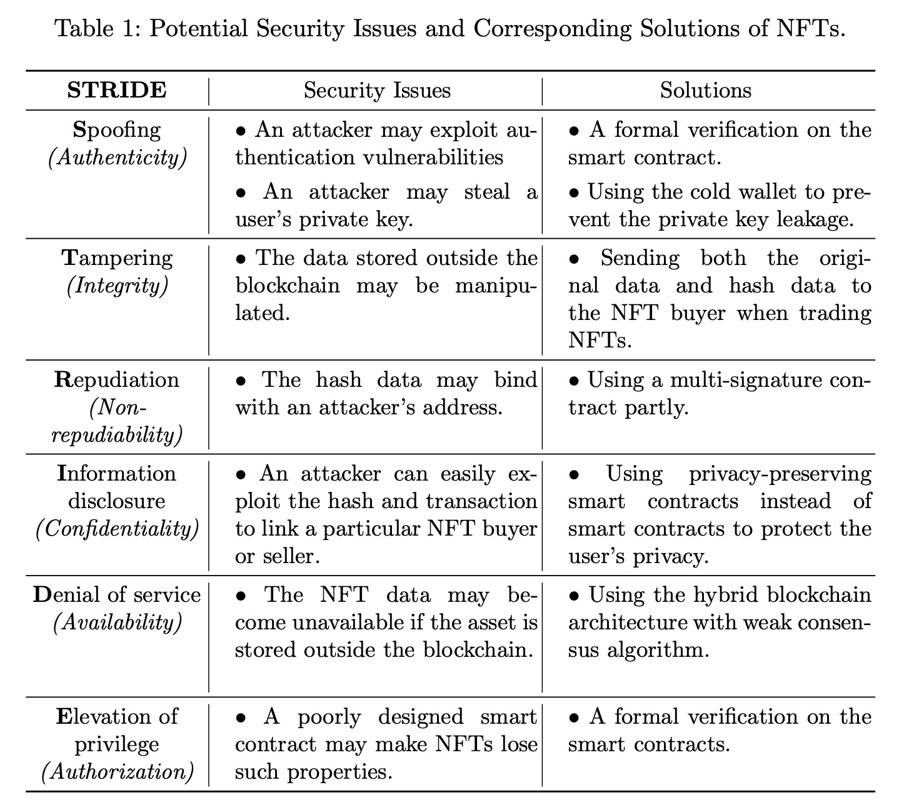
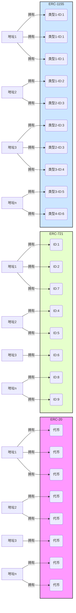

## AI论文解读 | Non-Fungible Token (NFT): Overview, Evaluation, Opportunities and Challenges
        
### 作者        
digoal        
        
### 日期        
2025-08-24    
        
### 标签        
PostgreSQL , PolarDB , DuckDB , AI , 论文解读        
        
----        
        
## 背景  
      
https://arxiv.org/pdf/2105.07447        
  
提示:          
```          
读懂《Non-Fungible Token (NFT): Overview, Evaluation, Opportunities and Challenges》这篇论文需要提前掌握哪些基础知识, 请使用中文通熟易懂的讲解这些基础知识, 可以引用论文中的图、表或使用Markdown支持的图形(text,mermaid等)增加解释性. 
  
使用中文通熟易懂的解读《Non-Fungible Token (NFT): Overview, Evaluation, Opportunities and Challenges》这篇论文, 其中的关键内容请着重讲解, 可以引用论文中的图、表或使用Markdown支持的图形(text,mermaid等)增加解释性. 
  
提取《Non-Fungible Token (NFT): Overview, Evaluation, Opportunities and Challenges》这篇论文中的重要术语, 使用中文对这些术语进行通熟易懂的讲解, 可以引用论文中的图、表或使用Markdown支持的图形(text,mermaid等)增加解释性. 
```     
  
## 1 前置知识 
  
好的，为了帮助您更好地理解《Non-Fungible Token (NFT): Overview, Evaluation, Opportunities and Challenges》这篇论文，我将为您梳理阅读前需要掌握的核心基础知识。这些知识就像是搭建一座高楼的地基，掌握了它们，您会发现论文中的概念和逻辑都将变得清晰易懂。

我们将主要围绕以下四个核心概念展开，并会引用论文中的图表来辅助说明：

1.  **区块链 (Blockchain)**：NFT存在的基石。
2.  **智能合约 (Smart Contract)**：NFT运行的规则引擎。
3.  **地址和交易 (Address and Transaction)**：拥有和转移NFT的方式。
4.  **代币标准 (Token Standards)**：定义NFT“是什么”的规范。

-----

### 1\. 区块链 (Blockchain)：一个不可篡改的公开账本

您可以将区块链想象成一个**分布在全球各地、由无数人共同维护的、只能添加不能删除或修改的公开数字账本** 。

  * **去中心化 (Distributed)**: 这个账本不存放在任何一个中心服务器上（比如银行或政府），而是有成千上万个副本分散在世界各地的电脑上 。这使得它非常难以被攻击或关闭。
  * **不可篡改 (Immutable)**: 一旦一笔交易（比如“A把一个NFT卖给了B”）被记录到这个账本上，并被大多数人确认，它就会被永久地保存下来。任何试图修改这条记录的行为都会导致后续所有记录失效，并被网络拒绝 。
  * **透明性 (Transparent)**: 在大多数公有区块链（如以太坊）上，任何人都可以查看这个账本上的所有交易记录。

**和NFT的关系**:
NFT的**所有权**和**交易历史**就是记录在这个公开、不可篡改的账本上的。您拥有的不是数字艺术品文件本身，而是这个账本上的一条记录，明确写着“某个特定NFT的所有者是您”。这篇论文提到，目前最主流的、用于NFT的区块链平台是**以太坊 (Ethereum)** 。

我们可以用一个简单的流程图来理解这种“链式”结构：

```mermaid
graph LR
    A[区块1<br/>(记录了交易A, B, C)] --> B[区块2<br/>(记录了交易D, E, F)];
    B --> C[区块3<br/>(记录了交易G, H, I)];
    C --> D[...];
```

每个新的区块都包含了前一个区块的信息摘要，环环相扣，形成了一条不可逆转的链条。

-----

### 2\. 智能合约 (Smart Contract)：自动执行的数字合同

如果说区块链是账本，那么智能合约就是**写在区块链上、能够自动执行合同条款的计算机程序** 。

您可以把它想象成一个高度智能的自动售货机：

> 你投入特定数量的钱（满足合同条件），它就一定会吐出你想要的商品（执行合同结果），整个过程无需任何人工干预，也无法反悔。

**和NFT的关系**:
NFT的几乎所有行为都是由智能合约来管理的 。

  * **铸造 (Minting)**: 一个艺术家想把自己的画变成NFT，就是通过一个智能合约，将这幅画的信息（或其哈希值）和生成的唯一代币ID绑定，并记录在区块链上。
  * **交易 (Trading)**: 当您购买一个NFT时，您是在与它的智能合约进行交互。您支付加密货币，智能合约验证收款后，自动将NFT的所有权转移到您的名下。
  * **版税 (Royalties)**: 智能合约可以被编程为：该NFT未来每一次转售，都自动将一定比例的销售额（例如5%）打给原始创作者 。

论文中的**图1**非常清晰地展示了这个流程：

  

*图1：NFT系统工作流程* 

在这个图中，核心就是中间的 **NFT Contract (NFT合约)**。无论是**所有者/创造者 (Owner/Creator)** 想要`Mint`（铸造）一个新的NFT，还是想把所有权`Transfer`（转移）给**买家 (Buyer)**，都需要通过这个智能合约来执行，并最终由**区块链共识节点 (Blockchain Consensus Node)** 确认并记录下来。

-----

### 3\. 地址和交易 (Address and Transaction)：数字世界的身份和行为

  * **地址 (Address)**: 这是一个由一长串字母和数字组成的唯一标识符，类似于您的**银行账号**或**电子邮箱地址** 。您用它来接收和发送数字资产（包括加密货币和NFT）。
  * **交易 (Transaction)**: 指的是在区块链上发生的一次操作，比如从一个地址向另一个地址发送资产 。每一笔交易都需要由发送方用其**私钥**（一个只有您知道的密码）进行数字签名，以证明您对该地址下的资产拥有控制权 。

**和NFT的关系**:
您的NFT就存放在您的个人**地址**下。当您购买NFT时，会发生一笔**交易**：您地址中的加密货币（如ETH）被发送出去，而卖家的NFT则通过另一笔交易被发送到您的地址。这个过程证明了所有权的转移。

-----

### 4\. 代币标准 (Token Standards)：让所有NFT都能“说同一种语言”

代币标准是一套公开的规则和接口，定义了某种类型的代币应该具备哪些基本功能（如如何转移、如何查询所有者等）。遵循统一标准可以确保由不同项目创建的代币能在各种应用（如钱包、交易市场）中相互兼容。

论文重点介绍了三个以太坊上的重要标准，并用**图2**进行了非常直观的对比：

  

*图2：NFT相关代币标准* 

#### **ERC-20: 可互换/同质化代币 (Fungible Token)**

  * **特点**: 每一个代币都是完全相同、可以相互替换的。就像人民币一样，我的一张100元和你的一张100元没有任何区别，价值也完全一样 。
  * **图解**: 在图2左侧，您可以看到一个地址（addr）可以拥有多个完全一样的圆形代币。
  * **应用**: 主要用于发行加密货币，比如各种项目的平台币。

#### **ERC-721: 不可互换/非同质化代币 (Non-Fungible Token)**

  * **特点**: 这是NFT的核心标准。**每一个代币都是独一无二的**，拥有一个唯一的ID (`tokenId`)，因此它们不能相互替换 。就像一张特定座位、特定场次的演唱会门票，它和任何其他门票都不同。
  * **图解**: 在图2中间，每个代币都有一个独特的编号（1, 2, 3...），表明它们各不相同。
  * **应用**: 数字艺术品、收藏品、游戏道具、域名等。

#### **ERC-1155: 多代币标准 (Multi Token Standard)**

  * **特点**: 这是一个更高级、更灵活的标准，它**允许在同一个智能合约中同时管理多种类型的代币**，既可以包含可互换的代币（ERC-20），也可以包含非同质化的代币（ERC-721）。
  * **图解**: 在图2右侧，您可以看到一个地址可以同时拥有：多个编号为`1`的相同代币（可互换），多个编号为`2`的相同代币（可互换），以及其他不同类型的代币。
  * **应用**: 非常适合复杂的游戏场景。例如，一个游戏角色可以拥有100个“金币”（可互换）和一把“传说之剑”（独一无二的非同质化道具），这些都可以通过一个ERC-1155合约来高效管理。

### 总结

掌握了以上四个基础知识后，您就有了阅读和理解这篇NFT论文的坚实基础。现在当您在论文中看到以下术语时，就能明白其背后的含义了：

  * **Verifiability (可验证性)**  -\> 因为所有权记录在公开透明的**区块链**上。
  * **Minting (铸造)**  -\> 通过**智能合约**创建一个新的、独一无二的ERC-721代币。
  * **Tamper-resistance (抗篡改性)**  -\> **区块链**的特性保证了交易记录一旦确认就无法修改。
  * **Gas Prices (燃料费)**  -\> 在以太坊上执行**交易**或**智能合约**操作所需支付的费用。

希望这份讲解能对您有所帮助！
  
## 2 解读论文 
  
好的，很乐意为您用中文通俗易懂地解读这篇关于非同质化代币（NFT）的重要研究论文——《Non-Fungible Token (NFT): Overview, Evaluation, Opportunities and Challenges》。

这篇论文发表于2021年，是早期对NFT生态系统进行全面、系统性梳理的学术报告之一。它详细介绍了NFT是什么、如何运作、有何风险、能做什么以及未来面临的挑战。

-----

### **核心摘要：一句话看懂NFT**

简单来说，NFT（Non-Fungible Token）是一种记录在区块链上的“数字证书” 。它与比特币这种“你的一块钱和我的一块钱可以互换”的同质化代币不同，每一个NFT都是独一无二、不可替代的 。这使得它可以用来代表对某个特定数字或实体资产（如一张图片、一段视频、一首歌甚至一栋虚拟房屋）的所有权 。

-----

### **1. NFT的技术基石：它如何运作？**

论文指出，一个功能完整的NFT体系由以下四个核心技术组件构成 ：

1.  **区块链 (Blockchain)**: 这是NFT的信任根基。它是一个去中心化、不可篡改的公共账本 。论文提到，以太坊（Ethereum）是当时承载NFT最主流的区块链平台 。
2.  **智能合约 (Smart Contract)**: 这是一段自动执行的程序代码，部署在区块链上 。NFT的创建（铸造）、转让、交易规则等都由智能合约来定义和执行，无需第三方介入 。
3.  **地址和交易 (Address and Transaction)**: 每个用户都有一个独一无二的区块链地址（类似银行账号），用来接收和发送NFT 。所有的操作都以交易的形式记录在区块链上。
4.  **数据编码 (Data Encoding)**: NFT本身通常不直接存储庞大的数字文件（如高清图片），而是将文件的**元数据（Metadata）**，尤其是其内容的**哈希值（Hash，一串独特的数字指纹）**，编码后记录在链上 。你拥有的NFT，本质上是拥有了由创作者签名的、指向这个数字资产的独一无二的链上凭证 。

-----

### **2. 关键内容：NFT的两种设计模式与核心标准**

这是理解NFT运作方式的核心，论文对此进行了重点阐述。

#### **2.1 两种NFT协议设计模式**

论文总结了当时市场上主流的两种NFT创建和分发模式，并用下图（Fig. 1）展示了其通用工作流程。

  

```mermaid
graph TD
    subgraph 用户侧 (User-side)
        A[NFT所有者/创建者] -->|1. 数字化/创建| B(元数据)
        B -->|2. 提交所有权证明| C{NFT合约}
        A -->|4. 所有权转移| D[NFT购买者]
    end
    subgraph 服务端 (Server-side)
        C -- Mint(铸造) --> E[NFT Registry]
        E -- 验证 --> C
        C -->|3. 存储元数据| F[(外部/内部存储)]
        G[区块链共识节点] <-->|执行共识| C
    end
    style A fill:#cde4ff
    style D fill:#cde4ff
```

  * **图解**: 上述流程图简化展示了论文中 **Fig. 1**  的核心逻辑：创建者发起，通过智能合约在区块链上“铸造”NFT，并将元数据存储起来，最终将所有权转移给购买者。

**模式一：自上而下 (Top to Bottom)** 
这是最经典、最常见的模式。

  * **流程**: 创作者（如艺术家）先**完成**一个具体的作品（如一幅画）。然后，他将作品数字化，通过智能合约将其“铸造”（Mint）成一个NFT，最后放到市场上卖给买家。
  * **例子**: CryptoPunks , NBA Top Shot  等项目，都是官方先设计好一系列形象或视频片段，然后供用户购买。

**模式二：自下而上 (Bottom to Top)** 
这是一种更具社区参与和随机性的创新模式。

  * **流程**: 项目方先通过智能合约定义一套“规则模板”和“素材库”（比如不同的武器、装备、角色特征） 。用户（买家）在支付费用“铸造”NFT时，智能合约会根据随机算法从素材库中抽取元素，为该用户生成一个独一无二的NFT 。
  * **例子**: 论文以 **Loot** 项目为例 。Loot NFT只是一张包含8行文字的“装备清单”，没有任何图像 。但正是这种极简和开放的设计，激发了社区在此基础上进行二次创作的热情。

#### **2.2 NFT的核心代币标准**

代币标准就像是产品的“行业规范”，确保了不同项目发行的NFT可以在同一个生态系统（如以太坊）中被识别和交易。论文重点对比了以下几个标准，并用 **Fig. 2**  进行了可视化区分。

  

| 标准 | 类型 | 特点 | 图示 (简化自Fig. 2 ) |
| :--- | :--- | :--- | :--- |
| **ERC-20** | **同质化** | 所有代币完全相同，可互换，可分割。类似日常生活中的货币 。 | `地址A -> [币, 币, 币]` |
| **ERC-721** | **非同质化** | NFT的“鼻祖”标准 。每个代币都有一个唯一的`tokenId`，不可互换，不可分割，代表一个独立的资产 。 | `地址A -> [Token#1, Token#7, Token#8]` |
| **ERC-1155** | **多代币标准** | 更先进、更高效的标准 。它允许一个智能合约同时管理**多种**代币，既可以是非同质化的（如一件传奇装备，`tokenId`唯一），也可以是同质化的（如1000个游戏金币，属于同一种`id`）。这大大降低了游戏等复杂场景的开发和交易成本。 | `地址A -> [类型1: 100个, 类型2: 1个, 类型5: 1个]` |

-----

### **3. 安全性评估：NFT的潜在风险**

论文采用 **STRIDE 威胁模型**，系统性地分析了NFT生态面临的六大安全风险，并总结在 **Table 1**  中。

  

| 威胁 (STRIDE) | 风险描述 | 论文建议的解决方案 |
| :--- | :--- | :--- |
| **欺骗 (Spoofing)** | 攻击者盗取用户私钥，冒充身份转移NFT 。 | 对智能合约进行形式化验证；使用冷钱包（离线钱包）存储私钥 。 |
| **篡改 (Tampering)** | 链上数据安全，但存储在链下的原始文件（如图片）可能被修改或删除 。 | 交易时同时提供原始数据和其哈希值供买家验证 。 |
| **抵赖 (Repudiation)** | 交易本身有数字签名不可抵赖 。但哈希可能被恶意绑定到攻击者地址 。 | 使用多签合约，需要多个参与方确认 。 |
| **信息泄露 (Info. Disclosure)** | 区块链的公开透明性意味着所有交易记录、持有者地址都可被追踪，存在隐私风险 。 | 使用隐私保护智能合约技术（当时尚不成熟） 。 |
| **拒绝服务 (DoS)** | 如果存储NFT元数据的中心化服务器或IPFS节点下线，NFT可能变得无法访问，变成“空壳” 。 | 采用混合区块链架构，或确保数据在IPFS网络中有足够多的备份 。 |
| **权限提升 (Elevation of Privilege)** | 设计糟糕的智能合约可能存在漏洞，让攻击者获得不该有的权限（如随意铸造或转移NFT） 。 | 对智能合约进行严格的形式化验证和代码审计 。 |

-----

### **4. 机遇：NFT能改变什么？**

论文展望了NFT在多个领域的巨大潜力：

  * **游戏产业**: 催生“Play-to-Earn”模式。玩家真正拥有游戏内的资产（道具、角色），并可以在二级市场自由交易，开发者也能从中获得版税收入 。
  * **数字收藏品与艺术**: 为数字艺术家提供了全新的盈利模式，解决了数字艺术品易被复制、所有权不明的问题 。智能合约还能确保艺术家在作品每次转售时都能自动获得版税 。
  * **虚拟活动**: NFT门票独一无二，可以有效防止伪造和黄牛，并为活动方提供更丰富的互动可能 。
  * **元宇宙 (Metaverse)**: NFT是构成元宇宙经济体系的基石，用于代表虚拟土地、虚拟化身、穿戴设备等一切数字资产的所有权 。

-----

### **5. 挑战：NFT走向主流的障碍**

尽管前景广阔，论文也明确指出了NFT在当时（2021年）面临的严峻挑战：

1.  **可用性挑战 (Usability)**

      * **交易速度慢**: 底层区块链（如以太坊）性能有限，导致交易确认需要很长时间 。
      * **Gas费高昂**: 在以太坊上铸造和交易NFT的成本极高，有时一笔交易的手续费就高达数十甚至上百美元，劝退了大量普通用户 。

2.  **安全与隐私问题 (Security & Privacy)**

      * **数据不可访问性**: 这是NFT最大的风险之一。如果存储元数据的链下服务器或IPFS节点失效，NFT就可能丢失其指向的内容，变成一个无意义的代币 。
      * **隐私保护不足**: 链上地址和交易的公开性使用户的金融活动和收藏偏好暴露无遗 。

3.  **治理与合规 (Governance)**

      * **法律风险**: 全球各国对NFT的法律定义和监管政策尚处于空白或模糊状态 。
      * **税务问题**: NFT交易产生的收益如何定性、如何征税，是一个亟待解决的复杂问题 。

4.  **扩展性问题 (Extensibility)**

      * **跨链互操作性**: 不同区块链上的NFT生态系统是相互隔离的“孤岛”，资产难以自由流通 。

### **结论**

这篇论文系统地为我们描绘了NFT技术在兴起之初的全貌。它既肯定了NFT作为一种革命性技术，在重塑数字所有权和价值交换方面的巨大潜力 ，也冷静地指出了其在技术、安全、法律和可用性方面亟待解决的诸多挑战 。对于任何想要了解NFT基本原理、机遇和风险的人来说，这篇论文都提供了一个极佳的学术起点。
  
## 3 术语 
  
好的，根据您提供的论文《Non-Fungible Token (NFT): Overview, Evaluation, Opportunities and Challenges》，我为您提取并解释了其中的重要术语。

-----

### 重要术语解析 (Important Terminology)

#### 非同质化代币（NFT）

NFT是一种独特的加密货币，它的每个代币都拥有独特的标识，因此彼此不可互换。这与比特币等所有代币都相同、可互换的传统加密货币不同 。

由于其独一无二的特性，NFT非常适合作为数字或虚拟资产的独特身份证明，例如视频、图片、艺术品和活动门票等 。

以下是NFT与同质化代币（如比特币）的主要区别，它们依赖不同的代币标准来运行：

| 特性 | **非同质化代币 (NFT)** | **同质化代币** |
| :--- | :--- | :--- |
| **可互换性** | 不可互换。每个代币都是独一无二的，拥有自己的价值和属性 。 | 可互换。每个代币都与其他代币完全相同，可以等价交换 。 |
| **应用场景** | 艺术品、收藏品、游戏道具、门票等，用于证明数字资产的所有权 。 | 货币、通用代币，如比特币或以太坊，主要用于支付和价值存储 。 |

-----

#### 智能合约（Smart Contract）

智能合约是部署在区块链上的可编程代码 。它能自动执行预设的规则和协议，无需信任任何第三方 。

在NFT生态系统中，智能合约起着核心作用。NFT的铸造、交易和所有权转移等所有操作都通过智能合约来完成 。这确保了交易的透明性、可验证性和安全性 。

#### 区块链（Blockchain）

区块链是一种去中心化的、只可追加的分布式数据库 。它使用加密协议将数据记录连接并保护起来 。一旦数据被网络中的大多数节点确认，就变得不可篡改 。

在NFT系统中，区块链为NFT提供了一个安全可靠的环境来执行智能合约 。它记录了所有NFT交易的历史和所有权信息，确保这些记录永久且无法被修改 。

#### 代币标准（Token Standards）

代币标准是一套规范和接口，用于管理区块链上的代币。论文中讨论了以下三种重要的以太坊代币标准，它们决定了不同类型代币的特性和行为：

  * **ERC-20:** 它是最常见的代币标准，用于创建**同质化代币** 。ERC-20代币彼此完全相同，可以互换，就像普通货币一样 。
  * **ERC-721:** 这是 **非同质化代币（NFT）** 的标准 。每个ERC-721代币都独一无二，拥有一个唯一的`tokenId` 。
  * **ERC-1155:** 这种标准扩展了ERC-721，允许在一个合约中同时管理**同质化和非同质化代币** 。这使得开发者能够更灵活地创建不同类型的资产。

下面是论文中图2的简化说明，展示了这三种代币标准的结构差异：

  



  * **ERC-20**: 所有的代币都是相同的。
  * **ERC-721**: 每个代币都带有唯一的ID，彼此不同。
  * **ERC-1155**: 代币被分为不同的类型，同一类型中的代币是可互换的。

#### 铸造（Minting）

铸造是NFT的创建过程 。当所有者对NFT数据（通常是哈希值）进行签名，并将交易发送到智能合约后，铸造过程就开始了 。一旦交易被确认，NFT就会永久地与一个唯一的区块链地址关联起来，作为其所有权存在的持久性证明 。

#### 区块链地址与交易（Blockchain Address & Transaction）

  * **区块链地址**是用户发送和接收资产的唯一标识符，类似于银行账户 。
  * **交易**是转移资产的操作 。在NFT系统中，每当铸造或出售一个NFT时，都需要发送一笔交易来调用智能合约 。交易被确认后，NFT的元数据和所有权细节就会被添加到区块链的新区块中，从而确保所有权的历史记录无法更改 。
  
## 参考        
         
https://arxiv.org/pdf/2105.07447    
        
<b> 以上内容基于DeepSeek、Qwen、Gemini及诸多AI生成, 轻微人工调整, 感谢杭州深度求索人工智能、阿里云、Google等公司. </b>        
        
<b> AI 生成的内容请自行辨别正确性, 当然也多了些许踩坑的乐趣, 毕竟冒险是每个男人的天性.  </b>        
  
