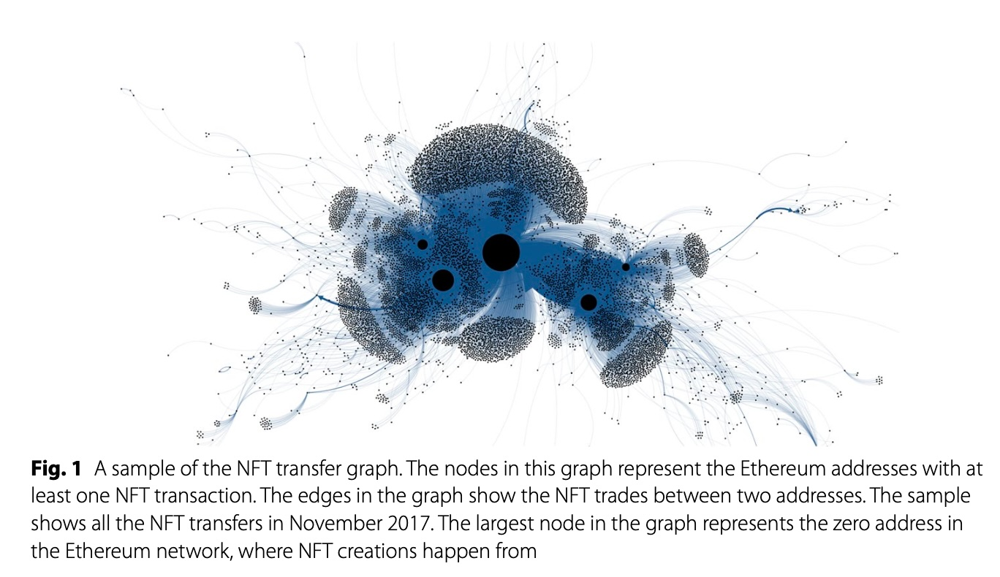
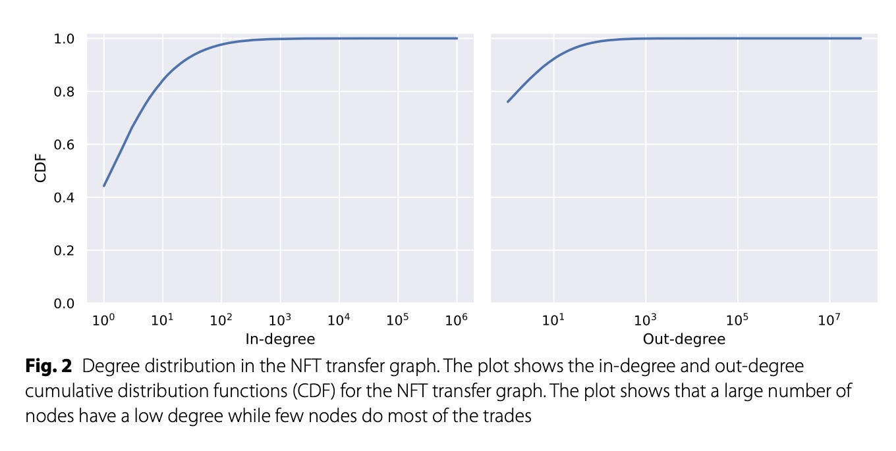
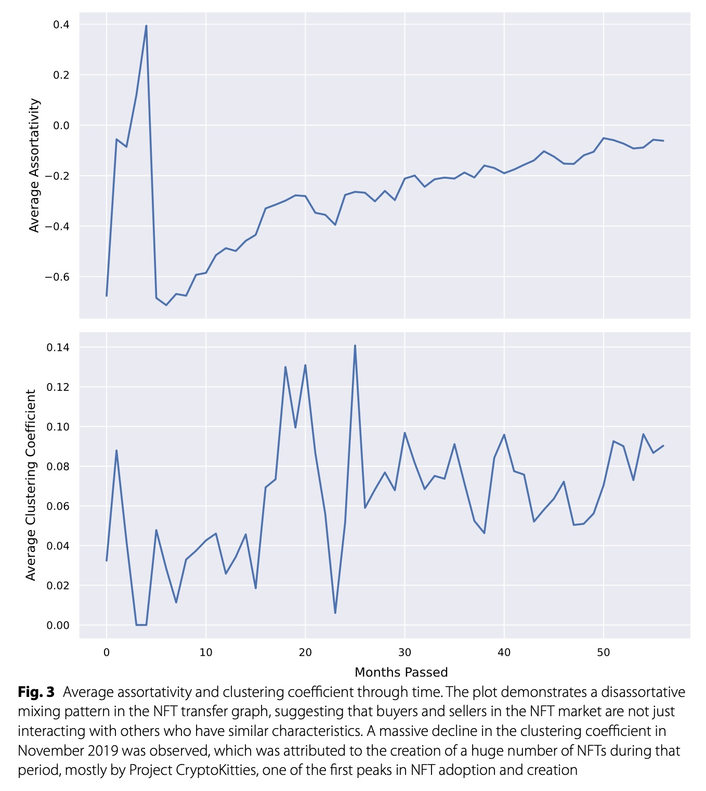
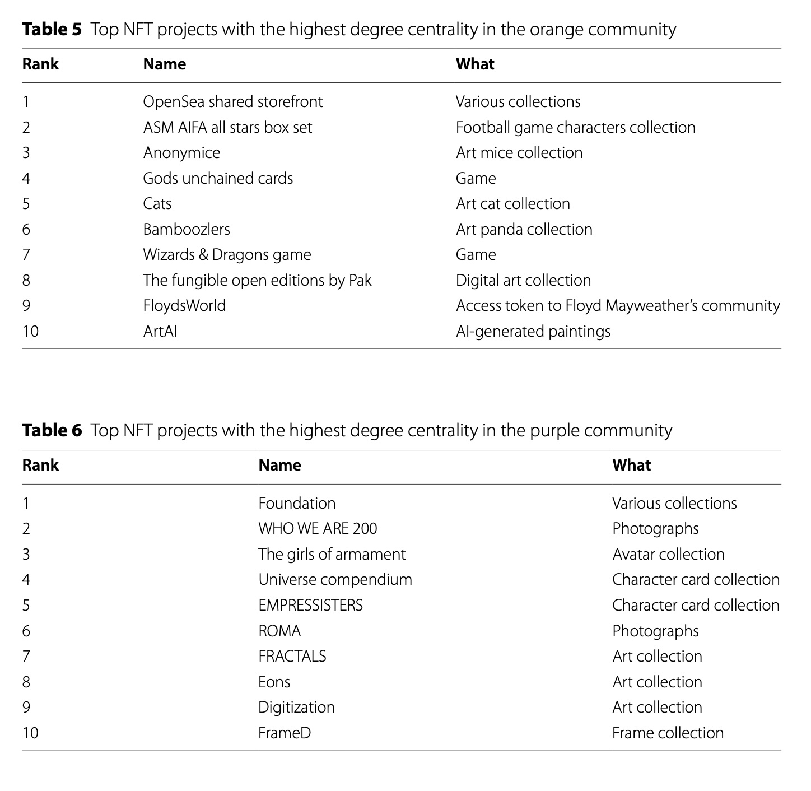
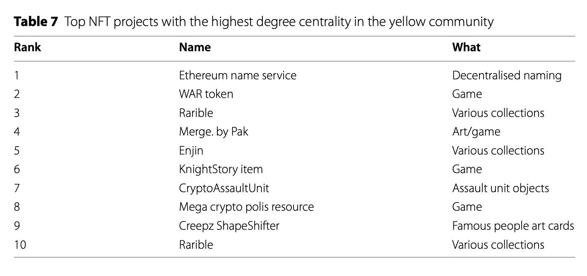
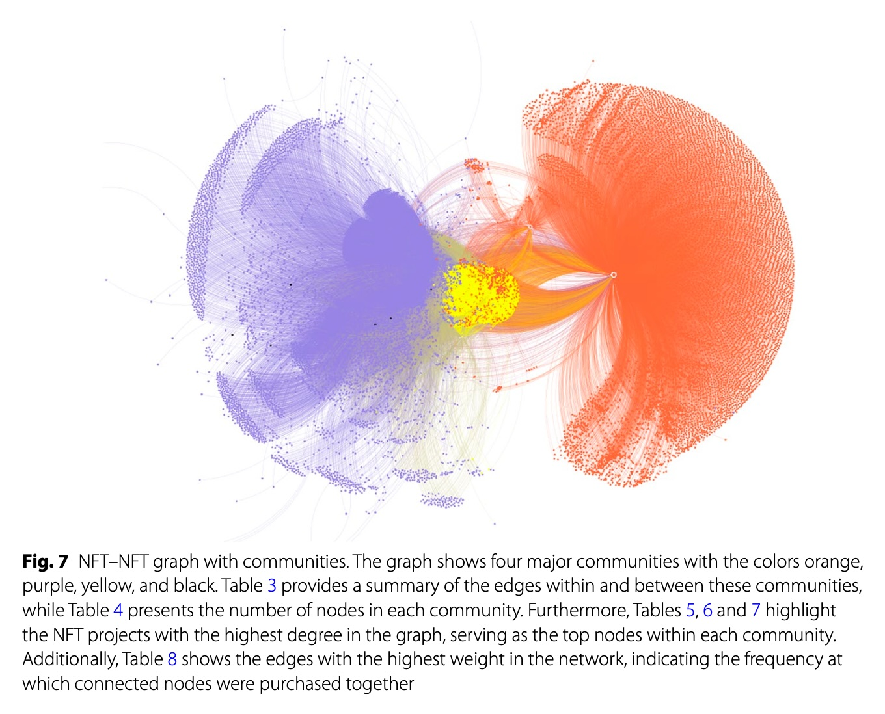
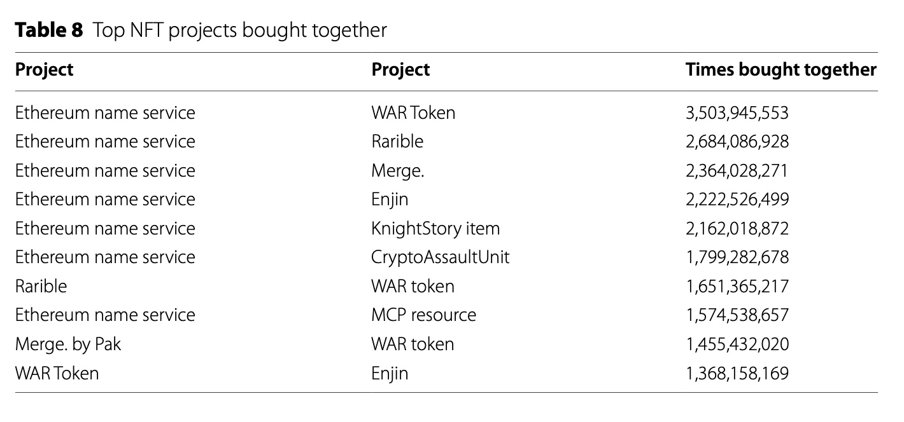
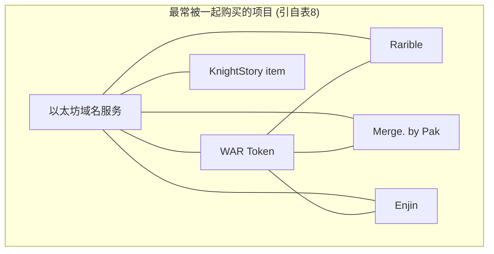

## AI论文解读 | A network analysis of the non‑fungible token (NFT) market: structural characteristics, evolution, and interactions
        
### 作者        
digoal        
        
### 日期        
2025-08-24       
        
### 标签        
PostgreSQL , PolarDB , DuckDB , AI , 论文解读        
        
----        
        
## 背景  
      
https://appliednetsci.springeropen.com/articles/10.1007/s41109-023-00565-4        
  
提示:          
```          
读懂《A network analysis of the non‑fungible token (NFT) market: structural characteristics, evolution, and interactions》这篇论文需要提前掌握哪些基础知识, 请使用中文通熟易懂的讲解这些基础知识, 可以引用论文中的图、表或使用Markdown支持的图形(text,mermaid等)增加解释性. 
  
使用中文通熟易懂的解读《A network analysis of the non‑fungible token (NFT) market: structural characteristics, evolution, and interactions》这篇论文, 其中的关键内容请着重讲解, 可以引用论文中的图、表或使用Markdown支持的图形(text,mermaid等)增加解释性. 
  
提取《A network analysis of the non‑fungible token (NFT) market: structural characteristics, evolution, and interactions》这篇论文中的重要术语, 使用中文对这些术语进行通熟易懂的讲解, 可以引用论文中的图、表或使用Markdown支持的图形(text,mermaid等)增加解释性. 
```     
  
## 1 前置知识 
  
好的，为了帮助您更好地理解《A network analysis of the non‑fungible token (NFT) market: structural characteristics, evolution, and interactions》这篇论文，我将为您梳理并通俗地讲解阅读前需要掌握的基础知识。

### 理解论文所需的基础知识

这篇论文的核心思想是，将复杂的NFT市场交易数据简化并抽象成一个“网络”，然后运用“网络科学”的方法来分析这个网络的结构特征和演变规律，从而揭示NFT市场的内在特点。

为了读懂这篇论文，您需要掌握三大块基础知识：

1.  **NFT与区块链基础 (NFT and Blockchain Basics)**
2.  **复杂网络分析 (Complex Network Analysis)**
3.  **社群发现算法 (Community Detection Algorithms)**

-----

#### 1\. NFT 与区块链基础 (NFT and Blockchain Basics)

首先，我们需要了解论文研究的对象是什么。

  * **什么是非同质化代币 (NFT)?**

      * **核心概念**: “非同质化”意味着每一个都是独一无二、不可替代的 。想象一下，你的一元硬币和我的可以随便交换，因为它们价值完全相同，这是“同质化”。但艺术家毕加索的画《格尔尼卡》是世界上唯一的，无法用另一幅画等价交换，这就是“非同质化”。
      * **在数字世界里**: NFT 是一种数字资产，它可以代表对某一独特物品（无论是虚拟的还是现实的）的所有权证明 。这个物品可以是一张图片、一首歌、一个游戏道具，甚至是一段文字 。

  * **什么是区块链 (Blockchain)?**

      * **核心概念**: 区块链是一个去中心化的、不可篡改的公共数字账本 。您可以把它想象成一个由全网用户共同维护的、公开透明的记账本。
      * **工作原理**: 每一笔交易都被记录在一个“区块”中，然后这个区块会按时间顺序被链接到前一个区块上，形成一条“链”。这条链被复制并分发到网络中的成千上万台计算机上。因此，想要篡改任何一笔记录都极其困难，因为它需要同时修改网络中大多数计算机上的数据。
      * **NFT与区块链的关系**: NFT的所有权记录就存储在这样的区块链上。论文提到，大多数NFT都基于**以太坊 (Ethereum)** 区块链 。以太坊不仅支持像比特币那样的加密货币，还支持运行一种叫做“智能合约”的程序，这正是创建和交易NFT的技术基础。论文中提及的 `ERC-721` 和 `ERC-1155` 就是以太坊上创建NFT的两种主流技术标准 。

-----

#### 2\. 复杂网络分析 (Complex Network Analysis)

这是理解本论文方法论的关键。论文将NFT市场中的所有交易行为看作一个巨大的网络。

  * **什么是网络 (或图)?**
    在网络科学中，一个网络由两部分组成：

      * **节点 (Nodes)**: 网络中的基本单元。在本论文的“NFT转账图”中，节点代表的是参与交易的**以太坊地址**（即买家和卖家） 。
      * **边 (Edges)**: 连接节点的线。在这里，一条边代表了两个地址之间发生的一次**NFT转账（交易）** 。

    论文中的 **图1** 直观地展示了2017年11月所有NFT交易构成的网络的一部分。图中的每一个点就是一个地址（节点），点之间的连线就是一笔交易（边）。其中最大的那个节点代表的是NFT被“创造”出来的源头地址 。

      

    *引自论文图1，帮助您形象地理解由地址和交易构成的网络 。*

  * **网络分析的关键指标**
    论文通过计算一系列指标来分析这个网络的特性 。

      * **度分布 (Degree Distribution)**:

          * **概念**: “度”是一个节点拥有的连接数。在NFT交易网络中，一个地址接收NFT的数量是它的**入度 (In-degree)**，发送NFT的数量是它的**出度 (Out-degree)** 。
          * **论文发现**: **图2** 显示，大约80%的地址出度仅为1（只卖过一次），而近半数地址的入度也为1（只买过一次） 。这揭示了NFT市场中的“二八定律”：绝大多数交易是由一小部分非常活跃的核心玩家完成的，而大部分用户只是偶尔参与 。

          

        *引自论文图2。曲线的陡峭上升表明，绝大多数节点的度都非常低 。*

      * **中心性 (Centrality)**:

          * **概念**: 衡量一个节点在网络中的重要性或影响力 。论文分析了三种中心性：
            1.  **度中心性 (Degree Centrality)**: 连接越多的节点越重要 。
            2.  **紧密中心性 (Closeness Centrality)**: 一个节点到网络中所有其他节点的平均距离越短，它就越处于网络中心 。
            3.  **PageRank中心性**: 不仅看重连接数量，更看重连接节点的质量。一个被许多重要节点连接的节点，其自身也更重要 。
          * **论文发现**: 各种中心性指标都表明，网络中只有极少数节点是“核心”，大多数节点都处于“边缘”位置 。

      * **聚类系数 (Clustering Coefficient)**:

          * **概念**: 衡量一个节点的邻居之间彼此连接的紧密程度。通俗地讲，就是“你的朋友们互相之间认识的比例有多高？” 。一个网络的平均聚类系数高，说明网络中容易形成许多“小圈子”。
          * **论文发现**: **图3** 的下图显示，NFT交易网络的聚类系数一直很低（接近0），说明网络结构松散，没有形成大量紧密的小团体 。

      * **同配性 (Assortativity)**:

          * **概念**: 衡量度高的节点是否倾向于和其他度高的节点连接 。
              * **正同配性**: “强强联合”，中心节点之间互动频繁。
              * **负同配性 (或异配性)**: “中心辐射边缘”，中心节点倾向于和大量边缘节点互动。
          * **论文发现**: **图3** 的上图显示，网络的同配性大部分时间为负值，呈现**异配性** 。这意味着NFT市场的主要模式不是“巨鲸”之间互相交易，而是“巨鲸”向大量普通用户出售或从他们那里购买 。

          

        *引自论文图3。上图为同配性，下图为聚类系数 。*

-----

#### 3\. 社群发现算法 (Community Detection Algorithms)

除了分析“人与人”的交易网络，论文还创造性地构建了 **“NFT项目与NFT项目”** 之间的关系网，并试图从中找出关联紧密的“社群” 。

  * **如何构建NFT-NFT网络?**

      * **核心逻辑**: 如果许多用户都同时购买了A项目和B项目的NFT，那么A和B这两个项目之间就存在一种强关联 。
      * **方法**: 论文首先构建一个“用户地址-NFT项目”的**二分图**，然后基于共同的购买者，在NFT项目之间建立连接，形成NFT-NFT网络 。

  * **什么是社群发现?**

      * **概念**: 一种网络分析技术，目的是在复杂的网络中自动识别出一些“小团体”或“社群”。这些社群的特点是内部节点之间的连接非常紧密，而社群之间的连接则相对稀疏 。
      * **莱顿算法 (Leiden Algorithm)**: 论文选用了一种名为**莱顿算法**的先进社群发现方法 。该算法通过最大化一个叫“模块度 (Modularity)”的指标来找到最优的社群划分方案，确保发现的社群内部结构是高度连通的 。

  * **论文发现**:

      * 通过该算法，论文在NFT项目中发现了**四个主要的社群**，并用不同颜色（橙、紫、黄、黑）在 **图7** 中进行了可视化 。
      * 通过分析每个社群中最重要的项目（见论文中的**表5、6、7**），论文揭示了不同社群具有不同的主题偏好 。例如：       
          * **橙色社群**：主要围绕**游戏**和**数字艺术收藏** 。
          * **紫色社群**：更偏向于**摄影**、**艺术收藏**和**头像类项目** 。
          * **黄色社群**：同样关注**游戏和艺术**，但包含了像“以太坊域名服务”这样的**基础设施类项目** 。

      

    *引自论文图7，这张图直观地展示了NFT项目根据用户购买行为的关联性被划分成的不同“兴趣圈子” 。*

### 总结

掌握了以上基础知识后，您就可以轻松地跟上论文的分析思路了。简单来说，这篇论文的逻辑就是：

1.  **数据收集**: 获取了从2017年到2022年海量的以太坊NFT交易数据 。
2.  **网络建模**: 将这些数据构建成两种网络：一个是**交易者网络**，另一个是**NFT项目网络**。
3.  **量化分析**: 使用网络科学的指标（度、中心性、聚类系数等）来分析交易者网络的结构和演变。
4.  **社群挖掘**: 使用社群发现算法来挖掘NFT项目网络中的“兴趣社群”。
5.  **得出结论**: 基于分析结果，对NFT市场的宏观特征、发展趋势和社群偏好进行解读。
  
## 2 解读论文 
  
好的，我们来一起通俗易懂地解读这篇关于NFT市场的网络分析论文。

这篇论文的核心思想非常巧妙：**它没有将NFT市场看作一堆孤立的买卖记录，而是将其描绘成一个巨大、相互连接的社交网络**。通过分析这个网络的结构、演变和内部“小圈子”，研究人员得以揭示出许多关于NFT市场深层次的运行规律。

### 论文的研究方法：如何把市场变成网络？

研究人员收集了从2017年6月到2022年2月间，在以太坊上发生的超过7700万次NFT转账数据 。基于这些数据，他们构建了两种关键的网络图：

1.  **NFT转账图 (人际关系网)**：

      * **节点 (点)**：代表每一个参与交易的以太坊地址（即买家和卖家）。
      * **边 (线)**：代表两个地址之间发生的一次NFT交易 。
      * **作用**：这个网络帮助我们理解 **“谁在和谁交易”** ，揭示市场的参与者结构。

2.  **NFT-NFT图 (项目关系网)**：

      * **节点 (点)**：代表一整个NFT项目（例如，无聊猿、CryptoKitties等）。
      * **边 (线)**：如果许多用户都同时购买了A项目和B项目的NFT，那么A和B之间就有一条连接线 。这条线的“粗细”代表了这种关联的强度。
      * **作用**：这个网络帮助我们理解 **“哪些项目更受同一群人欢迎”** ，揭示市场的兴趣社群和项目间的关联 。

-----

### 关键发现一：NFT市场是一个“少数人的游戏”

通过分析“人际关系网”（NFT转账图），研究人员发现了几个关于市场参与者的核心特征：

#### 1\. 交易活动高度集中（二八效应）

论文指出，市场中只有少数参与者进行了大量的买卖，而绝大多数地址的交易次数非常少 。

  * **数据支撑**：**图2** 的数据显示，大约 **80%** 的地址只卖出过1次NFT（出度为1），而近一半的地址也只买入过1次（入度为1）。这就像一个金字塔，顶端是少数极其活跃的“巨鲸”，而底部是海量的“散户” 。

  

*引自论文图2。曲线迅速攀升，说明绝大多数节点的连接数（交易次数）都非常低。*

#### 2\. 市场结构松散，且“中心辐射边缘”

  * **没有紧密的小圈子**：网络的“平均聚类系数”非常低 。这意味着市场并没有形成大量“你中有我、我中有你”的紧密交易小团体。
  * **巨鲸倾向于和散户交易**：网络的“同配性”为负值（异配性）。这说明市场的常态**不是**“巨鲸”之间相互倒手，而是“巨鲸”作为中心节点，与大量边缘的普通用户进行交易 。

这一发现可以通过 **图3** 得到验证，该图展示了网络的同配性（上图）和聚类系数（下图）随时间的变化。

  

*引自论文图3。上图显示同配性大部分时间为负，下图显示聚类系数始终接近于零。*

#### 3\. 市场价值与以太坊价格正相关，但有延迟

研究发现，NFT市场的总交易额与以太坊（ETH）的价格高度正相关 。简单来说，ETH涨，NFT市场也跟着火热。但有趣的是，这种影响不是即时的，而是存在一个**大约20天**的延迟 。这意味着，ETH价格的变动需要一段时间才能完全传导到NFT市场 。

-----

### 关键发现二：NFT项目形成了不同的“兴趣部落”

通过分析“项目关系网”（NFT-NFT图），研究人员发现了NFT项目之间并非毫无关联，而是形成了几个特征鲜明的“社群”。

#### 1\. 四大主要社群

研究人员使用“莱顿算法”将相互关联的NFT项目划分成了四个主要的社群，在 **图7** 中用不同颜色（橙色、紫色、黄色、黑色）表示 。其中，橙色社区规模最大，包含了超过一半的NFT项目 。

  

*引自论文图7。这张图直观地展示了NFT项目根据用户购买行为的关联性被划分成的不同“兴趣圈子”。*

#### 2\. 每个社群都有自己的“主题”

通过分析每个社群中最重要的项目（度中心性最高的项目），可以发现它们各自的鲜明特点：

  * **橙色社群 (最大)**：主要关注**游戏**和**数字艺术收藏品** 。核心项目包括 OpenSea 的共享店面、ASM AIFA 足球游戏角色和 Gods Unchained 卡牌游戏等 。
  * **紫色社群**：更偏向于**摄影、艺术收藏**和**头像(Avatar)类项目** 。核心项目是艺术平台 Foundation 和一些人物卡片、照片集等 。
  * **黄色社群 (最密集)**：这是一个混合了**游戏、艺术**和**基础设施**的社群 。其内部项目关联性极高，密度是橙色社区的近24倍 。核心项目是以太坊域名服务 (ENS)，以及 Rarible、Enjin 等平台和游戏 。

#### 3\. 哪些项目最常被“一起购买”？

**表8** 揭示了哪些NFT项目对最常出现在同一个用户的钱包里。结果显示，**以太坊域名服务 (ENS)** 几乎与其他所有热门项目都存在极强的关联，是NFT生态中当之无愧的“社交货币”和基础设施 。同时，WAR Token、Rarible、Enjin等同属黄色社群的项目也频繁地被打包购买，再次印证了社群内部的紧密联系 。    



### 总结与启示

总的来说，这篇论文通过新颖的网络分析视角，为我们描绘了一幅生动的NFT市场全景图：

1.  **市场是中心化的**：尽管区块链技术是去中心化的，但NFT市场的交易活动却高度集中在少数核心玩家手中。
2.  **市场结构是辐射式的**：主流交易模式是“中心玩家”与大量“外围玩家”之间的互动，而非核心玩家之间的内部循环。
3.  **市场价值有迹可循**：NFT市场的整体热度与ETH价格紧密相连，但存在一定的滞后性，这为市场观察者提供了预判的窗口。
4.  **项目生态已形成部落**：NFT项目并非一盘散沙，而是已经根据用户的共同兴趣形成了几个特色鲜明的“部落”，每个部落都有自己的主流文化和核心项目。

这些发现不仅加深了我们对NFT市场的理解，也为投资者、开发者和普通用户提供了宝贵的决策参考。
  
## 3 术语 
  
好的，这是对《A network analysis of the non‑fungible token (NFT) market》这篇论文中重要术语的通俗化中文讲解。

### 核心基础术语

#### 1\. 非同质化代币 (Non-fungible token, NFT)

  * **讲解**：这个词听起来很复杂，但核心意思是“独一无二的数字凭证” 。想象一下，你手里的一块钱和我手里的一块钱可以随便交换，因为它们完全一样，这是“同质化”。但《蒙娜丽莎》这幅画是唯一的，不能用另一幅画来等价交换，这就是“非同质化”。NFT就是用区块链技术为数字世界里的东西（比如一张图片、一首歌、一个游戏道具）创建一个独一无二、不可篡改的所有权证明 。

#### 2\. 区块链 (Blockchain)

  * **讲解**：可以把它理解成一个全民参与记账的、公开透明的、且无法篡改的“公共账本” 。NFT的所有权信息就记录在这个公共账本上，确保了其真实性和唯一性 。这篇论文主要研究的是建立在**以太坊 (Ethereum)** 这个区块链上的NFT交易 。

-----

### 网络分析相关术语

这篇论文的精髓在于将NFT市场看作一个巨大的网络进行分析。

#### 3\. NFT转账图 (NFT transfer graph)

  * **讲解**：这是研究人员构建的第一个核心网络，用来分析 **“谁和谁在交易”** 。在这个网络里：
      * **节点 (Nodes)**：代表每一个参与交易的以太坊地址（即买家和卖家）。
      * **边 (Edges)**：代表两个地址之间的一次NFT转账（交易）。
  * **图示**：论文中的图1就是这个网络的一个小样本，生动地展示了地址（点）之间通过交易（线）相互连接。    
    *引自论文图1，图中每个点是一个地址，每条线是一笔交易 。* 

#### 4\. 度分布 (In-degree and Out-degree Distribution)

  * **讲解**：这是衡量节点活跃度的指标。
      * **入度 (In-degree)**：一个地址收到了多少次NFT（可以理解为购买次数）。
      * **出度 (Out-degree)**：一个地址转出了多少次NFT（可以理解为销售次数）。    
  * **论文发现**：通过分析度分布（图2），论文发现市场存在明显的“二八效应”，即少数地址贡献了绝大多数的交易，而大部分地址只交易过一两次 。

#### 5\. 同配性 (Assortativity)

  * **讲解**：这个指标用来回答一个问题：“物以类聚，人以群分”的现象在NFT市场中存在吗？在这里，“类”指的是节点的“度”（即交易的活跃度）。
      * **正同配性**：意味着交易活跃的“大佬”倾向于和其他“大佬”交易。
      * **负同配性 (异配性)**：意味着“大佬”更倾向于和交易不频繁的“散户”进行交易 。
  * **论文发现**：NFT网络大部分时间呈现负同配性，说明市场的主要模式是中心玩家与大量外围玩家之间的互动，而不是强强联合 。

#### 6\. 聚类系数 (Clustering coefficient)

  * **讲解**：衡量网络中“小圈子”的紧密程度 。它的值越高，说明网络中的节点越容易形成“抱团”的紧密小团体 。可以通俗地理解为“你朋友的朋友也都是你的朋友”的程度 。
  * **论文发现**：NFT转账网络的聚类系数一直很低，说明网络结构松散，没有形成大量紧密的交易小圈子 。

#### 7\. 中心性 (Centrality)

  * **讲解**：用来衡量一个节点在网络中的重要性或影响力 。论文分析了三种中心性：
      * **度中心性 (Degree Centrality)**：连接数（交易次数）越多的节点越重要 。
      * **紧密中心性 (Closeness Centrality)**：一个节点到网络中所有其他节点的平均路径越短，就越处于网络的中心，信息传递效率越高 。
      * **PageRank中心性**：不仅看重连接数量，更看重连接节点的“质量”。被重要的节点连接的节点，自身也更重要 。
  * **论文发现**：所有中心性指标都表明，网络中只有极少数节点是核心和关键的，大部分节点都处于边缘位置 。

-----

### NFT项目关联分析术语

#### 8\. NFT-NFT图 (NFT-NFT graph)

  * **讲解**：这是研究人员构建的第二个核心网络，用于分析 **“哪些NFT项目是相互关联的”** 。
      * **节点 (Nodes)**：代表一个完整的NFT项目（如CryptoKitties）。
      * **边 (Edges)**：如果许多用户都同时购买了A项目和B项目的NFT，那么A和B之间就存在连接 。
  * **图示**：
    ```mermaid
    graph TD
        User_A --- Project_X[NFT项目 X]
        User_A --- Project_Y[NFT项目 Y]
        User_B --- Project_Y
        User_B --- Project_Z[NFT项目 Z]

        subgraph NFT-NFT网络
            Project_X -- 因为共同用户A --> Project_Y
            Project_Y -- 因为共同用户B --> Project_Z
        end
    ```

#### 9\. 社群发现 (Community detection)

  * **讲解**：一种在复杂网络中自动识别“小团体”或“社群”的技术 。社群内部的节点之间连接紧密，而社群之间的连接相对稀疏 。
  * **论文发现**：研究人员使用**莱顿算法 (Leiden algorithm)** ，在NFT-NFT图中发现了四个主要的社群 。这表明NFT项目根据用户的共同偏好，自然地形成了不同的“兴趣部落” 。
  * **图示**：图7直观地展示了这四个社群（用橙、紫、黄、黑四种颜色区分）。    
    *引自论文图7，这张图揭示了NFT项目之间存在的宏观结构 。*

通过理解以上术语，您就能更好地把握这篇论文的研究框架和核心结论。
  
## 参考        
         
https://appliednetsci.springeropen.com/articles/10.1007/s41109-023-00565-4    
        
<b> 以上内容基于DeepSeek、Qwen、Gemini及诸多AI生成, 轻微人工调整, 感谢杭州深度求索人工智能、阿里云、Google等公司. </b>        
        
<b> AI 生成的内容请自行辨别正确性, 当然也多了些许踩坑的乐趣, 毕竟冒险是每个男人的天性.  </b>        
  
  
