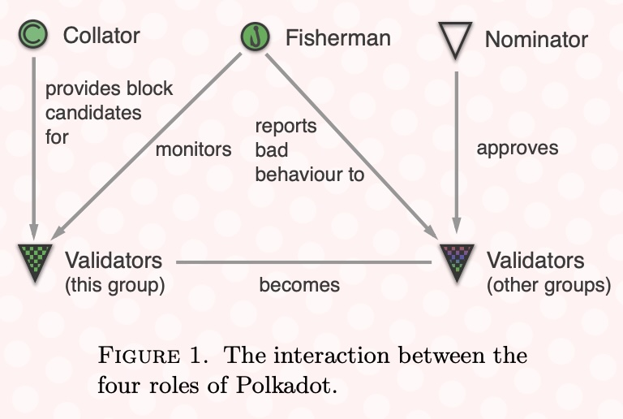
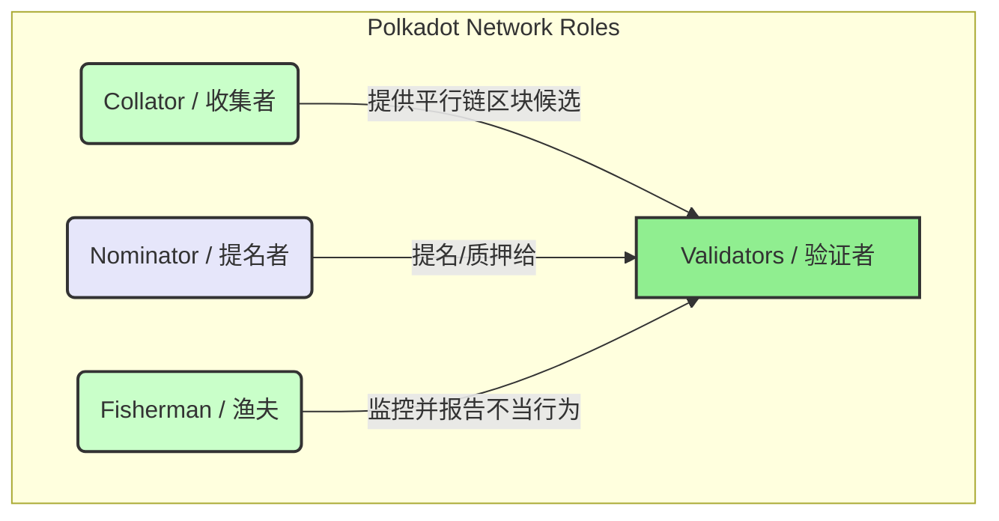
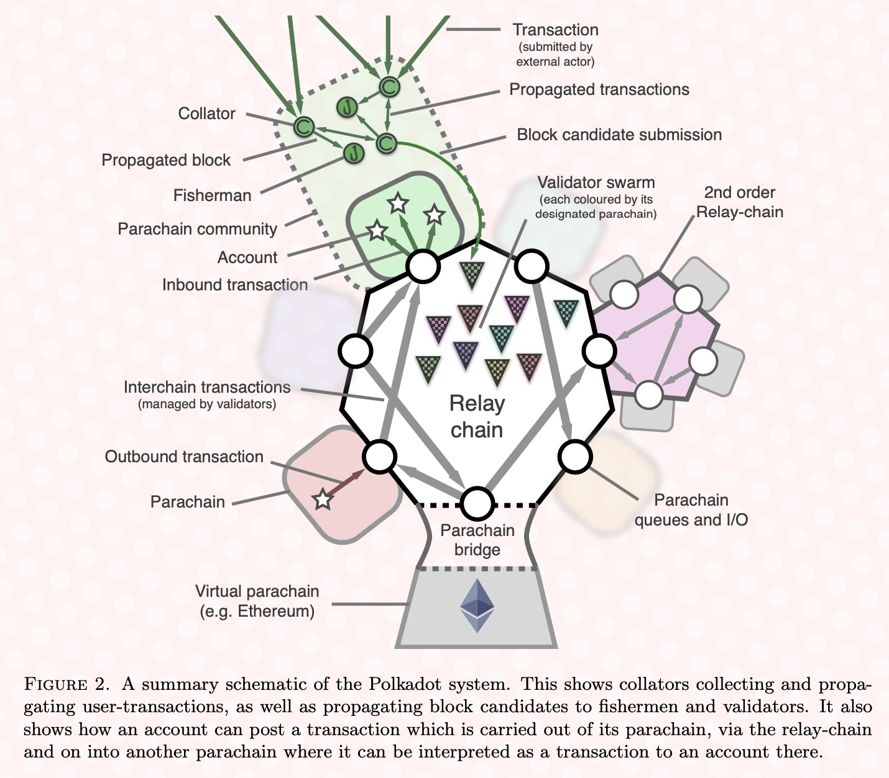
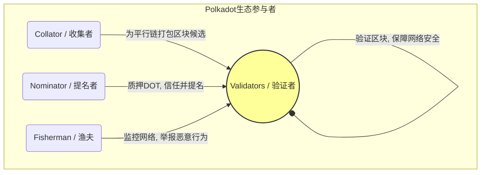
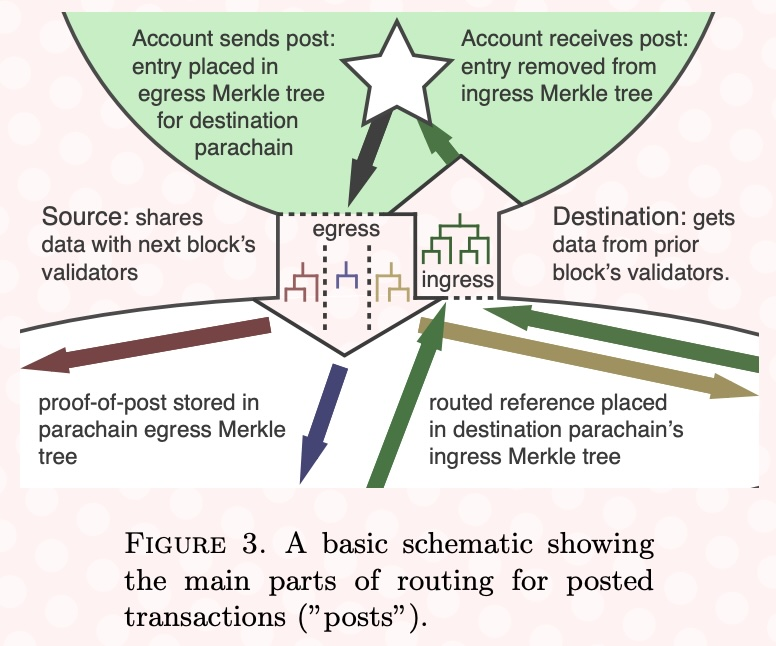

## AI论文解读 | POLKADOT: VISION FOR A HETEROGENEOUS MULTI-CHAIN FRAMEWORK DRAFT 1
        
### 作者        
digoal        
        
### 日期        
2025-08-24       
        
### 标签        
PostgreSQL , PolarDB , DuckDB , AI , 论文解读        
        
----        
        
## 背景  
      
https://assets.polkadot.network/Polkadot-whitepaper.pdf        
  
提示:          
```          
读懂《POLKADOT: VISION FOR A HETEROGENEOUS MULTI-CHAIN FRAMEWORK DRAFT 1》这篇论文需要提前掌握哪些基础知识, 请使用中文通熟易懂的讲解这些基础知识, 可以引用论文中的图、表或使用Markdown支持的图形(text,mermaid等)增加解释性. 
  
使用中文通熟易懂的解读《POLKADOT: VISION FOR A HETEROGENEOUS MULTI-CHAIN FRAMEWORK DRAFT 1》这篇论文, 其中的关键内容请着重讲解, 可以引用论文中的图、表或使用Markdown支持的图形(text,mermaid等)增加解释性. 
  
提取《POLKADOT: VISION FOR A HETEROGENEOUS MULTI-CHAIN FRAMEWORK DRAFT 1》这篇论文中的重要术语, 使用中文对这些术语进行通熟易懂的讲解, 可以引用论文中的图、表或使用Markdown支持的图形(text,mermaid等)增加解释性. 
```     
  
## 1 前置知识 
  
好的，要完全理解Gavin Wood博士撰写的Polkadot白皮书《POLKADOT: VISION FOR A HETEROGENEOUS MULTI-CHAIN FRAMEWORK》，确实需要一些区块链和分布式系统的基础知识。这份白皮书描绘了一个宏大的技术愿景，旨在解决当时区块链技术面临的核心瓶颈。

我将为你梳理出阅读这份白皮书所需的核心基础知识，并尽量用通俗易懂的方式进行讲解，同时引用论文中的图示来辅助说明。

-----

### 核心基础知识概览

要读懂Polkadot白皮书，你需要先了解以下几个关键领域：

1.  **区块链基础 (Blockchain 101)**：什么是区块链？它是如何工作的？
2.  **共识机制 (Consensus Mechanisms)**：去中心化网络如何达成一致？
3.  **智能合约与状态机 (Smart Contracts & State Machines)**：区块链如何执行复杂逻辑？
4.  **当时区块链面临的困境 (The Problems Polkadot Addresses)**：Polkadot究竟想解决什么问题？

下面我们逐一展开讲解。

### 1\. 基础知识一：什么是区块链？

你可以把区块链想象成一个**公共的、分布式的、不可篡改的数字账本**。

  * **公共和分布式**：这个账本不存放在任何一个中心服务器上，而是由网络中成千上万的参与者（节点）共同维护。每个人都有一份完整的副本。
  * **不可篡改**：一旦一笔交易被记录到账本上，就几乎不可能被修改或删除。这是通过密码学技术将一个个“区块”（记录交易的页面）链接在一起实现的，形成一条“链”。

白皮书中提到的比特币（Bitcoin）和以太坊（Ethereum）就是最早和最著名的区块链应用 。

> **通俗比喻**：想象一个全班同学共同记账的本子。每发生一件事（比如小明借给小红5块钱），大家都会在自己的本子上记下这一笔。为了防止有人耍赖，每页写满后，大家会根据这一页的内容算出一个特殊的“验证码”（哈希值），并把这个验证码写在下一页的页眉。这样，一页扣一页，如果有人想偷偷修改其中一页的内容，那一页的“验证码”就会对不上，后面所有页的“验证码”也都会失效，会被大家立刻发现。

### 2\. 基础知识二：共识机制 (Consensus Mechanisms)

既然网络是去中心化的，没有中央权威，那么大家如何就“下一页账本（新区块）应该写什么内容”以及“谁来写”达成一致呢？这就是**共识机制**要解决的问题。

白皮书重点提到了两种主流机制：

#### a) 工作量证明 (Proof-of-Work, PoW)

这是比特币和早期以太坊使用的机制 。

  * **核心思想**：通过算力竞赛来决定记账权。网络中的参与者（称为“矿工”）需要解决一个非常复杂的数学难题，谁先算出来，谁就获得了记账权，并将新的区块添加到链上，同时获得奖励。
  * **优缺点**：非常安全，因为攻击网络需要巨大的计算能力。但缺点也很明显：速度慢、效率低、极其耗费能源。这正是Polkadot试图解决的 **扩展性（Scalability）** 问题之一 。

#### b) 权益证明 (Proof-of-Stake, PoS)

这是Polkadot和其他许多新公链采用的机制 。

  * **核心思想**：不再比拼算力，而是根据参与者持有并“质押”（Stake）的代币数量来决定记账权。你质押的代币越多，被选中记账的概率就越大。如果你行为不端（例如试图伪造交易），你质押的代币将被罚没（Slash）。
  * **优缺点**：更节能、高效。Polkadot在此基础上设计了更复杂的 **提名权益证明（NPoS）** 机制，让普通持币者也能参与进来 。

#### c) 拜占庭容错 (Byzantine Fault Tolerance, BFT)

这是一个更古老的分布式系统概念。

  * **核心思想**：解决的是在一个可能存在“叛徒”（恶意节点）的系统中，如何让“忠诚的将军们”（诚实节点）达成正确的一致。Polkadot的共识算法就受到了BFT算法的启发 。

### 3\. 基础知识三：智能合约与状态机

区块链不仅仅能记账，还能执行代码，这就是**智能合约**。

  * **状态机 (State Machine)**：你可以将整个区块链看作一个巨大的“状态机” 。它的“状态”就是所有账户的余额、所有智能合约的数据等信息的集合。每一笔交易或合约调用都会触发一次“状态转移”，从当前状态变为一个新的状态 。
  * **智能合约**：部署在区块链上的一段代码，当满足特定条件时会自动执行。以太坊是智能合约平台的先驱 。例如，可以编写一个合约规定：“如果A向合约地址转入10个以太币，则自动将一栋数字房产的所有权转移给A”。

Polkadot白皮书的一个核心论点是：现有的区块链将 **共识（即决定交易顺序，也就是“Canonicality”）** 和 **状态转移（即执行交易，也就是“Validity”）** 这两件事捆绑得太紧了，导致效率低下 。Polkadot的设计哲学就是将这两者解耦 。

### 4\. 基础知识四：Polkadot想解决的核心问题

了解了以上基础后，你就能明白白皮书开篇提出的几个关键问题了 ：

1.  **扩展性 (Scalability)**：单个区块链处理交易的能力有限（比如每秒只能处理几十笔交易），无法满足大规模应用的需求 。就像一条单车道公路，车一多就堵死。
2.  **隔离性 (Isolatability)**：不同的区块链（如比特币、以太坊）是相互孤立的“信息孤岛”，无法安全、便捷地进行通信和资产转移 。
3.  **治理 (Governance)**：如何对去中心化网络进行升级和决策，避免出现社区分裂（硬分叉）？。

### Polkadot的核心概念与架构

基于以上背景，你就可以更好地理解Polkadot提出的创新解决方案：**异构多链框架（Heterogeneous Multi-chain Framework）** 。

#### a) 中继链 (Relay Chain) 和 平行链 (Parachains)

Polkadot的设计不是做一条“更好”的单链，而是创建一个“链的网络”。

  * **中继链 (Relay Chain)**：是Polkadot网络的核心，它不负责处理具体的应用逻辑，只负责**安全和共识** 。你可以把它理解为整个系统的“心脏”或“总调度中心”。
  * **平行链 (Parachains)**：是连接到中继链上的、可以高度定制化的专用区块链 。每条平行链可以有自己的规则、功能和代币，专注于解决特定问题（如DeFi、游戏、身份认证等）。它们把安全问题外包给了中继链。

> **通俗比喻**：中继链就像一个大型购物中心的安保系统和中央空调，它为所有入驻的商铺（平行链）提供统一的安全保障和基础设施。每个商铺可以自己决定卖什么、怎么装修，而无需各自雇佣保安和安装空调。

这种架构实现了：

  * **共享安全 (Pooled Security)**：所有平行链共享中继链提供的强大安全保障，新项目无需从零开始建立自己的安全网络 。
  * **可扩展性**：交易可以在多条平行链上**并行**处理，大大提升了整个网络的吞吐量 。
  * **互操作性**：平行链之间可以通过中继链安全地传递任何类型的信息和资产，打破了“孤岛”效应。

#### b) Polkadot网络中的四种角色

为了维护这个复杂的系统，Polkadot设计了四种关键角色，白皮书中的图1清晰地展示了它们的关系：

  



  * **验证者 (Validators)**：网络的最高安全保障者。他们负责验证平行链的区块，并参与中继链的共识，打包最终的区块 。他们需要质押大量的代币，是网络的中流砥柱。
  * **收集者 (Collators)**：平行链的“维护者”。他们收集平行链上的交易，生成一个“候选区块”，并把它连同证明一起提交给验证者 。他们就像是平行链上的“矿工”，但不负责最终的安全性。
  * **提名者 (Nominators)**：持币者。他们通过将自己的代币质押给信任的验证者来帮助保护网络，并分享验证者获得的奖励 。这个角色降低了参与网络安全的门槛。
  * **渔夫 (Fishermen)**：网络的“监督员”或“赏金猎人”。他们监控网络，寻找并举报验证者或收集者的不当行为。一旦举报成功，他们将获得丰厚的奖励 。

-----

### 总结

在阅读Polkadot白皮书之前，请确保你对以下概念有了基本的理解：

  * **区块链**：一个去中心化的、不可篡改的分布式账本。
  * **共识机制**：特别是**PoW**和**PoS**的区别，以及它们各自的优劣。
  * **智能合约**：区块链上可自动执行的代码，以及区块链作为**状态机**的概念。
  * **行业痛点**：传统区块链在**扩展性、互操作性、治理**方面遇到的挑战。

当你掌握了这些基础知识后，再去看白皮书中的“中继链”、“平行链”、“共享安全”以及四个核心角色的设计，就会豁然开朗，明白Polkadot的架构为何如此设计，以及它试图实现的宏大愿景。
  
## 2 解读论文 
  
好的，我们来一起用通俗易懂的方式解读Gavin Wood博士撰写的Polkadot白皮书。这份白皮书在当时提出了一个非常前沿和宏大的构想，旨在解决第一代区块链（如比特币和以太坊）所面临的核心瓶颈。

### **核心思想：Polkadot不是要做一条更快的“单行道”，而是要建一个“立交桥网络”**

在解读之前，请记住这个核心比喻：

  * **传统区块链（如比特币、以太坊）**：像一条功能单一的单行道。所有车辆（交易）无论类型（转账、运行复杂程序等），都必须在这条路上排队行驶。当车流量增大时，就会发生严重拥堵，通行费（交易费）也会飙升。
  * **Polkadot**：它本身不是一条让车跑的“路”，而是一个巨大的、高度协同的“城市交通枢纽系统”。它包含一个核心的 **“环岛主干道”（中继链）** 和许多连接到主干道上的 **“特色功能区”（平行链）** 。

这篇论文的核心，就是阐述如何构建并运行这个“交通枢纽系统”。

-----

### **一、Polkadot要解决的三大难题**

白皮书开篇就指出了当时区块链技术面临的关键问题 ：

1.  **扩展性 (Scalability)**：单个区块链处理交易的能力非常有限 。网络很容易因为交易量过大而变得缓慢和昂贵。
2.  **隔离性 (Isolatability)**：不同的区块链之间是孤立的 。比特币网络和以太坊网络就像两个无法互通的国家，资产和信息无法自由、安全地流动。
3.  **可开发性与治理 (Developability & Governance)**：在一个统一的框架下满足不同应用的需求很困难 。同时，对去中心化网络进行升级和决策是一个复杂且容易引起争议的过程，常常导致社区分裂（即“硬分叉”） 。

Polkadot的设计哲学就是为了从根本上解决这些问题。

### **二、Polkadot的核心架构：中继链、平行链与桥**

为了解决上述问题，Polkadot提出了一个创新的“异构多链框架” 。

  * **中继链 (Relay Chain)**：这是Polkadot的心脏和大脑 。它的功能被设计得极其精简，只做两件核心的事：**保障整个网络的安全**和**实现跨链消息的传递** 。它不运行智能合约或复杂的应用逻辑，就像交通枢纽的调度中心，只负责协调和安保。

  * **平行链 (Parachains)**：这些是可以高度定制化的、并行的区块链 。每条平行链都可以有自己独特的设计、代币和功能，以最优化的方式服务于特定场景，比如一条专为游戏设计的高速链，一条专为金融衍生品设计的隐私链等 。它们就像是枢纽系统中的各个“特色功能区”，各自处理自己的业务。

  * **桥 (Bridges)**：这是一种特殊的平行链，它的作用是连接Polkadot网络与外部独立的区块链，如以太坊和比特币 。通过桥，可以实现Polkadot与这些“老牌”区块链之间的资产和信息互通。

下图是白皮书中对整个系统的高度概括，清晰地展示了中继链（Relay chain）作为中心，连接着多个平行链（Parachain），并能通过桥（Parachain bridge）与外部网络（如以太坊）互联。

  

*来源: POLKADOT: VISION FOR A HETEROGENEOUS MULTI-CHAIN FRAMEWORK DRAFT 1, Figure 2*

### **三、关键创新点：共享安全 (Pooled Security)**

这是Polkadot最具革命性的理念之一。

在传统模式下，一个新的区块链项目要上线，必须自己招募足够多的矿工或验证者来保障网络安全，这是一个成本高昂且困难重重的过程。

而在Polkadot中，所有平行链**共享**中继链提供的安全保障 。中继链拥有一大群高额抵押的**验证者 (Validators)**，他们会随机被分配去验证不同平行链的交易 。这意味着：

  * **即时安全**：一条新的平行链只要连接到中继链，就能立刻享受到整个网络提供的顶级安全性，无需自己从零构建。
  * **经济高效**：项目方可以将精力集中在应用开发上，而不是维护网络安全上。

这个机制从根本上降低了区块链创新的门槛和成本。

### **四、Polkadot网络中的四个核心角色**

为了让这个复杂的系统高效、安全地运转，白皮书定义了四个关键角色。论文中的图1很好地说明了它们之间的互动关系。

  

*来源: POLKADOT: VISION FOR A HETEROGENEOUS MULTI-CHAIN FRAMEWORK DRAFT 1, Figure 1*

我们可以用一个更直观的Mermaid图来解释：



1.  **验证者 (Validators)**：网络的**守护者** 。他们是中继链的全节点，负责验证平行链提交的区块，并参与共识，最终确定全网的统一状态 。要成为验证者，必须抵押大量的DOT（Polkadot的原生代币），如果作恶，抵押品将被罚没（Slash） 。

2.  **收集者 (Collators)**：平行链的**勤杂工** 。他们驻守在某一条特定的平行链上，收集该链的用户交易，并将其打包成一个“候选区块”，然后提交给验证者进行最终确认 。他们从自己打包的交易中赚取手续费 。

3.  **提名者 (Nominators)**：**资本方**或**投资者** 。他们是持有DOT的普通用户，希望通过参与网络安全来获得收益。他们会选择自己信任的验证者，将自己的DOT抵押给他们，从而增加该验证者被选中参与共识的概率，并分享一部分验证者获得的奖励 。这个机制让普通人也能间接参与到网络的 Staking 中。

4.  **渔夫 (Fishermen)**：网络的**赏金猎人** 。他们是独立的监督者，时刻监控着验证者和收集者的行为 。一旦发现有人作恶（比如验证者对一个无效的区块签名），他们就可以提交证据进行举报 。举报成功后，作恶者的抵押品会被罚没，其中一部分会作为巨额奖励分给渔夫 。

### **五、跨链通信：简单高效的消息队列**

Polkadot实现跨链通信的机制被设计得非常简洁。每条平行链都有一个 **“出口队列”（Egress）** 和 **“入口队列”（Ingress）** 。

  * 当平行链A想给平行链B发送一条消息（比如转移一笔资产）：
    1.  平行链A的交易会在自己的“出口队列”中生成一个目标为B的消息 。
    2.  中继链的验证者在处理A的区块时，会注意到这个消息，并像一个“邮差”一样，把它从A的出口队列中取出，安全地放入B的“入口队列”中 。
    3.  平行链B在处理自己的下一个区块时，会查看入口队列，执行来自A的消息 。

这个过程完全是异步的，并通过中继链的安全机制保证了消息的真实性和有效性 。

  

*来源: POLKADOT: VISION FOR A HETEROGENEOUS MULTI-CHAIN FRAMEWORK DRAFT 1, Figure 3*

### **总结**

Gavin Wood的这篇白皮书描绘了一个雄心勃勃的蓝图：通过一个**异构、分片（sharded）的多链架构**，从根本上解决了区块链的**扩展性、隔离性和治理**三大难题。

其核心创新在于：

  * **架构分离**：将安全共识（由中继链负责）与应用逻辑（由平行链负责）分离，实现了专业化和高效率。
  * **共享安全**：让所有平行链共享一个强大而统一的安全保障，极大地降低了创新门槛。
  * **真正互操作**：提供了一个无需信任的、通用的跨链消息传递框架，让万链互联成为可能。

Polkadot的愿景是成为下一代互联网（Web3）的底层基础设施，一个能够承载无数不同类型区块链并让它们协同工作的“协议的协议”。
  
## 3 术语 
  
好的，根据您提供的《POLKADOT: VISION FOR A HETEROGENEOUS MULTI-CHAIN FRAMEWORK DRAFT 1》白皮书主题，以下是其中几个重要的核心术语及其通俗易懂的中文解释。

-----

### **核心概念**

  * **异构多链 (Heterogeneous Multi-Chain)**

      * **解释**: 传统的区块链（如比特币、以太坊）通常是单链模型，所有交易都在一条链上处理。而波卡白皮书的核心愿景是构建一个“异构多链”网络。这里的“异构”指网络中的每条链都拥有自己独特的结构、功能和优化方案，可以为不同的应用场景（如DeFi、游戏、物联网）量身定制，而不是千篇一律。这就像一个城市里有专门的商业区、住宅区、工业区，各司其职，从而实现整个城市的繁荣。

  * **中继链 (Relay Chain)**

      * **解释**: 中继链是波卡网络的核心和基础。它不处理复杂的应用交易，而是负责整个网络的安全、共识和互操作性。你可以把中继链想象成一个高速公路的主干道，所有连接到它的平行链都在这个主干道的“保护”下运行，共享其安全性。

  * **平行链 (Parachain)**

      * **解释**: 平行链是连接到中继链的自定义区块链。每条平行链可以有自己的规则和功能，专门用于特定的应用。例如，一条平行链可能专为去中心化金融（DeFi）设计，而另一条则可能用于游戏资产交易。平行链之间可以通过中继链进行通信和数据交换。

  * **平行线程 (Parathread)**

      * **解释**: 平行线程可以看作是“按需付费”的平行链。对于那些不需要持续连接到网络、交易量较小的项目，可以不租用昂贵的平行链插槽，而是像乘坐出租车一样，需要时才支付费用，临时接入网络。

**中继链与平行链关系图示**

```
           +----------------+
           |   中继链       |
           | (Relay Chain)  |
           |----------------|
           |  - 共享安全性  |
           |  - 跨链通信枢纽|
           +-------^--^-----+
                   |  |
           +-------+  +-------+
           | 平行链A |  | 平行链B |
           | (Parachain)  |  | (Parachain)  |
           |----------------|  |----------------|
           | - 游戏DApp专用 |  | - DeFi应用专用 |
           +----------------+  +----------------+
```

-----

### **网络角色与共识机制**

波卡采用了更复杂的共识机制，将传统区块链中矿工的角色拆分，形成了以下四个角色：

  * **提名人 (Nominators)**

      * **解释**: 提名人是波卡代币 **DOT** 的持有者，他们通过抵押自己的代币来“提名”和支持优秀的验证人，共同维护网络安全。如果被提名的验证人表现良好，提名人也会获得相应的奖励。

  * **验证人 (Validators)**

      * **解释**: 验证人是中继链的核心维护者。他们的主要工作是验证平行链收集人提交的数据块，并参与中继链的共识。他们通过高额的DOT抵押来证明其可信度，并确保网络的安全。

  * **收集人 (Collators)**

      * **解释**: 收集人负责收集特定平行链上的交易，并将其打包成区块，然后提交给中继链的验证人。他们可以理解为平行链上的“矿工”或“打包工”。

  * **渔夫 (Fishermen)**

      * **解释**: 渔夫是网络的“侦察兵”。他们的主要职责是监督和举报网络中的不当行为（如验证人或收集人的欺骗行为），一旦举报成功，他们将获得丰厚的奖励。

-----

### **波卡代币 (DOT)**

  * **解释**: DOT 是波卡的原生代币，具有三个主要用途：
    1.  **治理**: DOT 持有者对协议的升级、参数调整等拥有完整的投票权。
    2.  **质押**: DOT 可以被质押用于支持验证人，从而保护网络安全并获得奖励。
    3.  **绑定**: 项目方需要通过绑定（抵押）DOT 来获得平行链的插槽。如果项目不再需要插槽，可以解锁并取回代币。
  
## 参考        
         
https://assets.polkadot.network/Polkadot-whitepaper.pdf    
        
<b> 以上内容基于DeepSeek、Qwen、Gemini及诸多AI生成, 轻微人工调整, 感谢杭州深度求索人工智能、阿里云、Google等公司. </b>        
        
<b> AI 生成的内容请自行辨别正确性, 当然也多了些许踩坑的乐趣, 毕竟冒险是每个男人的天性.  </b>        
  
  
  
#### [期望 PostgreSQL|开源PolarDB 增加什么功能?](https://github.com/digoal/blog/issues/76 "269ac3d1c492e938c0191101c7238216")
  
  
#### [PolarDB 开源数据库](https://openpolardb.com/home "57258f76c37864c6e6d23383d05714ea")
  
  
#### [PolarDB 学习图谱](https://www.aliyun.com/database/openpolardb/activity "8642f60e04ed0c814bf9cb9677976bd4")
  
  
#### [PostgreSQL 解决方案集合](../201706/20170601_02.md "40cff096e9ed7122c512b35d8561d9c8")
  
  
#### [德哥 / digoal's Github - 公益是一辈子的事.](https://github.com/digoal/blog/blob/master/README.md "22709685feb7cab07d30f30387f0a9ae")
  
  
#### [About 德哥](https://github.com/digoal/blog/blob/master/me/readme.md "a37735981e7704886ffd590565582dd0")
  
  

  
