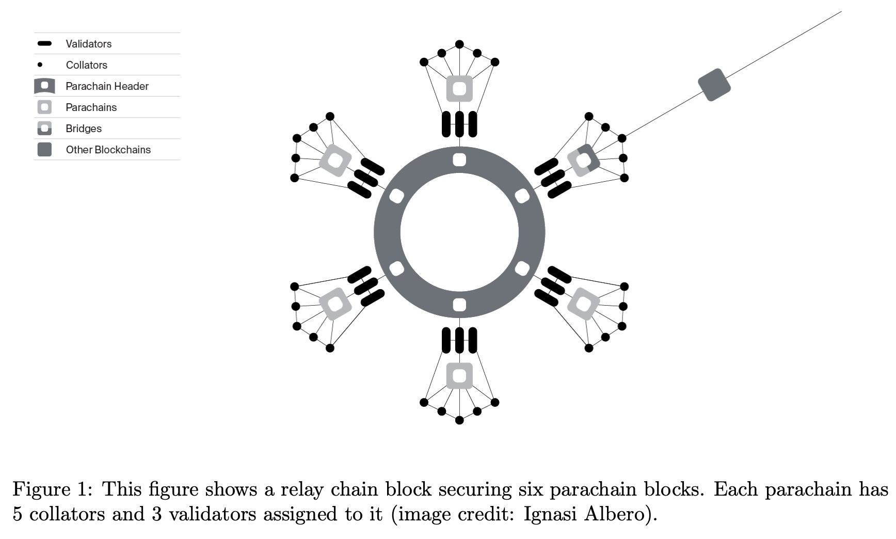

## AI论文解读 | Overview of Polkadot and its Design Considerations
        
### 作者        
digoal        
        
### 日期        
2025-08-24       
        
### 标签        
PostgreSQL , PolarDB , DuckDB , AI , 论文解读        
        
----        
        
## 背景  
      
https://arxiv.org/pdf/2005.13456        
  
提示:          
```          
读懂《Overview of Polkadot and its Design Considerations》这篇论文需要提前掌握哪些基础知识, 请使用中文通熟易懂的讲解这些基础知识, 可以引用论文中的图、表或使用Markdown支持的图形(text,mermaid等)增加解释性. 
  
使用中文通熟易懂的解读《Overview of Polkadot and its Design Considerations》这篇论文, 其中的关键内容请着重讲解, 可以引用论文中的图、表或使用Markdown支持的图形(text,mermaid等)增加解释性. 
  
提取《Overview of Polkadot and its Design Considerations》这篇论文中的重要术语, 使用中文对这些术语进行通熟易懂的讲解, 可以引用论文中的图、表或使用Markdown支持的图形(text,mermaid等)增加解释性. 
```     
  
## 1 前置知识 
  
好的，为了帮助您更好地理解《Polkadot及其设计考虑概述》这篇论文，我将为您梳理和讲解阅读此论文所需的基础知识。这些知识点将以通俗易懂的方式呈现，并结合论文中的图表进行解释。

---

### 理解Polkadot论文所需的基础知识

阅读这篇关于Polkadot的论文，您需要对以下几个核心领域有一个基本的认识。这些概念就像是拼图的碎片，理解了它们，您就能更好地拼凑出Polkadot的全貌。

#### 1. 什么是区块链？ (Blockchain)

您可以将区块链想象成一个**分布式的、不可篡改的公共账本**。

* **分布式 (Distributed)**: 这个账本不由任何单一中心机构（如银行）控制，而是由网络中成千上万的计算机（节点）共同维护。每个人都有一份账本的副本。
* **不可篡改 (Immutable)**: 一旦一笔交易被记录到账本上，就几乎不可能被修改或删除。这是通过密码学技术将一个个“区块”（包含交易记录的集合）像链条一样按时间顺序连接起来实现的。论文中的图2就清晰地展示了这一点。

  

上图中，每个“中继链区块 (Relay chain Block)”都通过一个哈希值 (hash) 与前一个区块相连，形成一条不可断裂的链 。

#### 2. “区块链不可能三角” (The Blockchain Trilemma)

这是一个行业普遍接受的概念，即一个区块链项目很难同时完美地实现以下三个目标：
* **去中心化 (Decentralization)**: 网络不由单一实体控制。
* **安全性 (Security)**: 网络能够抵御攻击和欺诈。
* **可扩展性 (Scalability)**: 网络能够处理大量的交易，并且速度很快（高吞吐量、低延迟）。

论文在引言中就提到了现有区块链（如比特币和以太坊）在可扩展性方面遇到的挑战，例如每秒只能处理数十笔交易，而Visa等信用卡公司则能处理数千笔 。Polkadot的设计初衷就是为了解决这个问题，特别是可扩展性和互操作性 。

#### 3. 共识机制 (Consensus Mechanisms)

在一个去中心化的网络中，节点们如何就“哪个区块是下一个合法的区块”达成一致？这就是共识机制要解决的问题。

* **工作量证明 (Proof-of-Work, PoW)**: 这是比特币和早期以太坊使用的方式。节点（矿工）需要进行大量的计算（“挖矿”），谁先解决一个复杂的数学难题，谁就有权添加下一个区块并获得奖励 。它的优点是安全性高，缺点是能源消耗巨大且效率低下。

* **权益证明 (Proof-of-Stake, PoS)**: 这是Polkadot和许多现代区块链采用的方式。节点（验证者）需要抵押（stake）一定数量的代币作为保证金。系统根据抵押的代币数量等因素来选择由谁来创建下一个区块。如果验证者作恶，他们的保证金将被罚没（slash）。PoS相比PoW更节能、更高效。Polkadot使用的是一种更复杂的变体，称为**提名权益证明 (NPoS)** 。

#### 4. 分片与多链架构 (Sharding & Multi-chain Architecture)

这是解决可扩展性问题的主要方案之一。

* **分片 (Sharding)**: 想象一下，一个收费站只有一个窗口，所有车辆都得排队通过，效率很低。分片就像是把这个收费站扩建成拥有多个并行窗口的收费广场，车辆可以同时在不同窗口缴费，总处理能力大大提升。在区块链中，这意味着将交易和数据处理任务分配到多个并行的链（分片）上同时进行 。

* **Polkadot的架构**: Polkadot正是基于这种思想设计的。它有一个核心的**中继链 (Relay Chain)** 和许多并行的**平行链 (Parachains)** 。
    * **中继链**: 负责整个网络的安全和共识，就像是收费广场的指挥中心，确保所有窗口都安全、协同工作 。
    * **平行链**: 负责处理具体的应用和交易，就像是各个独立的收费窗口，可以有不同的规则和功能（异构性）。

论文中的图1生动地展示了这种结构：

  

* 中心的圆环是**中继链**。
* 向外辐射的六个分支是**平行链 (Parachains)** 。
* 围绕在中心环上的大黑点是**验证者 (Validators)** ，他们负责保护中继链和验证平行链的数据。
* 每个平行链分支上的小黑点是**收集者 (Collators)** ，他们负责收集平行链的交易并提交给验证者 。

这种架构实现了**共享安全 (Shared Security)**，即所有平行链都共享中继链提供的强大安全性，而不必各自为政 。

#### 5. 拜占庭容错 (Byzantine Fault Tolerance, BFT)

这是一个源自计算机科学经典问题的概念，用来描述一个系统在部分组件（节点）可能出现故障或恶意行为的情况下，如何仍能保持整体一致和正常运行。

简单来说，就是如何在一群将军中达成一致的作战计划，即使其中有叛徒在传递假消息。在区块链中，这意味着网络必须能够在部分验证者是恶意或离线的情况下，依然能够正确地生成和确认区块。论文中提到，Polkadot的目标是实现拜占庭容错 ，并假设超过2/3的验证者是诚实的 。

#### 6. 核心参与角色 (Roles in the Network)

要读懂论文，理解不同角色的职责至关重要：
* **验证者 (Validators)**: 网络的最高安全保障。他们质押DOT代币，负责验证平行链区块和打包生成中继链区块 。
* **提名者 (Nominators)**: DOT代币持有者。他们通过质押自己的代币来“提名”和支持他们信任的验证者候选人，并分享验证者获得的奖励或惩罚 。
* **收集者 (Collators)**: 平行链的维护者。他们收集平行链上的交易，生成一个候选区块，并连同有效性证明一起提交给验证者 。
* **钓鱼人 (Fishermen)**: 网络的“赏金猎人”。他们监控网络，举报验证者或收集者的恶意行为（如验证了无效的平行链区块），并获得奖励 。

#### 7. 密码学基础 (Cryptography Primitives)

您不需要成为密码学专家，但了解几个基本概念会很有帮助：
* **哈希函数 (Hashing)**: 将任意长度的数据转换成一个固定长度的、独一无二的“指纹”。用于确保数据的完整性和链接区块（如图2所示）。   
* **公私钥加密 (Public/Private Keys)**: 用于身份验证和数字签名。账户的拥有者用私钥签名交易，其他人可以用公钥验证签名，从而确认交易的合法来源。
* **可验证随机函数 (VRF)**: 论文在BABE协议中提到 。这是一种特殊的密码学工具，可以产生一个**既随机又可验证**的数字。在Polkadot中，它被用来以一种公平、私密且不可预测的方式为验证者分配出块的权利，就像一个无法作弊的抽签系统 。

### 总结

在阅读论文之前，如果您能掌握以下核心思想，将会事半功倍：

| 核心概念 | 通俗解释 |
| :--- | :--- |
| **区块链** | 一个由大家共同维护、无法篡改的公开账本。 |
| **不可能三角** | 平衡“去中心化、安全、可扩展性”是区块链设计的核心挑战。 |
| **共识机制 (PoS)** | 通过“押金”机制来决定谁记账，节能高效。 |
| **分片/多链架构** | 像开辟多个并行车道一样，提升整个系统的处理能力。 |
| **Polkadot架构** | 一个“指挥中心 (中继链)” + 多个“专业工厂 (平行链)”的模式，实现共享安全。 |
| **拜占庭容错** | 即使有少数坏人，系统也能正常工作。 |
| **核心角色** | 各司其职（验证者、提名者、收集者等），共同维护网络。 |
| **密码学工具 (VRF)** | 确保系统中的随机选择（如谁来出块）是公平且不可预测的。 |

有了这些基础知识作为铺垫，您在阅读论文时，对于其中提到的BABE、GRANDPA、NPoS、XCMP等具体协议和设计，就能更好地理解其背后的原理和意图了。
  
## 2 解读论文 
  
好的，我们来一起深入解读这篇关于 Polkadot 设计理念的经典论文：《Overview of Polkadot and its Design Considerations》。

我将用通俗易懂的中文，为你剖析 Polkadot 的核心架构、关键机制和创新之处，并引用论文中的图表和插图来辅助说明。

### 摘要：Polkadot 试图解决什么问题？

首先，论文开篇就指出了当前区块链世界的两大核心痛点 ：

1.  **互操作性缺失 (Blockchain Silos)**：成百上千的区块链项目各自为政，像一座座孤岛，应用和资产难以在不同链之间自由流通 。
2.  **安全性分散与可扩展性不足 (Fragmented Security & Scalability Issues)**：每条链都需要自己维护安全，这导致了安全性的浪费和分散。同时，单链的交易处理能力（TPS）有限，难以满足大规模应用的需求 。

Polkadot 的目标正是为了解决这些问题，它希望创建一个**可扩展、可互操作且安全共享**的多链框架 。

-----

### 一、核心架构：中继链、平行链与桥

Polkadot 的设计可以理解为一个“中心枢纽+多个辐射分支”的结构。这个结构由三个核心部分组成：

  * **中继链 (Relay Chain)**：是 Polkadot 的心脏和大脑 。它不处理具体的应用业务，其唯一目的是**保障整个网络的安全、达成共识，并处理平行链之间的消息传递** 。可以把它想象成一个机场的指挥塔，负责协调所有飞机的起降和航线，但不负责运送乘客。
  * **平行链 (Parachains)**：是连接到中继链上的、具有特定功能的独立区块链 。它们可以是加密货币链、DeFi 链、游戏链、身份验证链等等。每条平行链都可以有自己的架构、代币和治理模式，专注于自己的业务逻辑。它们将安全和共识的工作“外包”给了中继链。
  * **桥 (Bridges)**：是一种特殊的平行链，它的作用是连接 Polkadot 网络与外部独立的区块链，如比特币、以太坊等 。

论文中的图1非常直观地展示了这个架构：

  

图1: Polkadot 架构示意图

这张图形象地展示了一个中继链（中心的环）连接了六条平行链。外围的小黑点代表**验证者 (Validators)**，他们是中继链的核心安全保障，会被随机分配去验证不同的平行链区块。每个平行链内部有自己的**收集者 (Collators)**（图中的小灰点），负责收集和生成平行链的区块。

我可以用 Mermaid 文本图更简洁地复现这个结构：


-----

### 二、网络中的关键角色 (The Who)

为了让这个复杂的系统运转起来，Polkadot 定义了四个关键角色 ：

1.  **验证者 (Validators)**：

      * **职责**：网络中最重要的角色，负责生产中继链的区块，并验证平行链提交的区块，从而保障整个网络的安全 。
      * **要求**：需要质押大量的 DOT 代币，并且保持高可用性的在线状态 。他们是 Polkadot 共享安全的基石。

2.  **提名者 (Nominators)**：

      * **职责**：持有 DOT 代币的利益相关者，他们通过质押自己的代币来“提名”和支持他们信任的验证者候选人 。
      * **角色**：他们是验证者的“投资人”和“监督者”，与所支持的验证者共享收益，也共担风险（如果验证者作恶被惩罚，提名者也会损失质押金） 。这个设计让更多持币者能参与到网络安全中。

3.  **收集者 (Collators)**：

      * **职责**：平行链的“维护者”。他们运行着特定平行链的全节点，收集该链上的交易，并生成一个“候选区块”（包含有效性证明），然后提交给中继链的验证者进行最终验证和纳入 。
      * **类比**：可以理解为传统 PoW 链中的“矿工”，但不负责共识安全，只负责区块的生产。

4.  **渔夫 (Fishermen)**：

      * **职责**：网络的“赏金猎人”或“审计员”。他们监控网络，专门寻找并举报验证者或收集者的恶意行为（比如验证了一个无效的平行链区块） 。
      * **激励**：成功举报将获得丰厚的奖励 。渔夫的存在像一种威慑，大大降低了作恶行为的发生概率 。

-----

### 三、核心机制详解 (The How)

这部分是论文的精华，解释了 Polkadot 是如何实现其宏大愿景的。

#### 1\. **混合共识机制：BABE + GRANDPA**

Polkadot 创新地将**区块生产**和**区块最终性确认**两个环节分离开来，以兼顾效率和安全性。

  * **BABE (Blind Assignment for Blockchain Extension)**：**负责区块生产** 。

      * 它是一种基于可验证随机函数 (VRF) 的协议，会为每个时间槽（slot）**私密地、随机地**指派一个验证者来生产中继链区块 。
      * **特点**：出块速度快，链可以持续增长，但可能会产生临时分叉。它提供的是**概率性最终确认**（Probabilistic Finality），即一个区块被推翻的概率随着其后新区块的增加而指数级降低 。

  * **GRANDPA (GHOST-based Recursive Ancestor Deriving Prefix Agreement)**：**负责最终性确认** 。

      * 它是一个独立的最终性确认工具 (finality gadget)。验证者们会对某条链进行投票，一旦超过 2/3 的验证者投票确认了包含某个区块的链，那么这个区块以及它之前的所有区块就都获得了**确定性最终确认**（Deterministic Finality） 。
      * **特点**：被 GRANDPA 确认的区块**绝对不会再被逆转** 。它能够一次性确认一批区块，非常高效。

**简单来说**：BABE 像一个快速的流水线，不断地生产出新区块，让链条快速延伸；而 GRANDPA 像一个严谨的质检官，定期地在流水线上盖上“最终合格”的印章，确保产品质量万无一失。这种分离设计使得网络即使在等待最终确认时，也能持续不断地出块，提高了整体性能 。

#### 2\. **共享安全 (Shared Security) 与平行链有效性验证**

这是 Polkadot 最核心的价值主张。

  * **原理**：所有平行链共享中继链的经济安全 。一条新的平行链无需从零开始招募验证者、建立自己的安全壁垒，它只需要接入 Polkadot，就能立即享受到由数千个验证者和巨额 DOT 质押所提供的顶级安全性 。这大大降低了新链的启动成本和安全风险。

  * **如何实现？**

    1.  平行链的收集者（Collator）创建一个包含**有效性证明 (Proof-of-Validity, PoV)** 的候选区块 。这个 PoV 区块包含了验证者在不持有平行链完整状态的情况下，也能验证该区块所需的所有信息。
    2.  中继链随机指派一组验证者来检查这个 PoV 区块 。
    3.  验证通过后，该平行链区块的“头部”信息会被包含到中继链的区块中，从而使其成为 Polkadot 规范链的一部分 。
    4.  为了确保 PoV 区块数据的**可用性**（防止收集者和验证者合谋隐藏数据），Polkadot 使用了**纠删码 (erasure coding)** 技术，将数据分割成多个分片，分发给所有验证者。只要有超过 1/3 的分片可用，就能恢复出完整数据 。

这个机制的巧妙之处在于，它用极高的经济成本威慑了攻击者：攻击任何一条平行链，都等同于在攻击整个 Polkadot 网络，需要对抗所有验证者的总质押价值 。

#### 3\. **NPoS (Nominated Proof-of-Stake) - 提名权益证明**

Polkadot 的验证者选举机制也独具匠心。它不是简单的“谁钱多谁上”，而是旨在实现**安全最大化**和**去中心化**。

  * **目标**：选出一组拥有高额且均衡质押金的验证者 。
  * **方法**：采用了一种基于**比例公平代表制 (Proportional Justified Representation, PJR)** 的选举算法 。该算法会综合所有提名者的投票偏好，智能地分配他们的质押金，使得尽可能多的少数派提名者群体也能有代表他们利益的验证者入选，同时让当选验证者的总质押额尽可能平均。
  * **优势**：
      * **高安全性**：使得验证者集合的总质押金远超任何单个实体所能拥有的 。
      * **去中心化**：避免了质押金过度集中在少数“巨鲸”验证者身上，保护了网络的去中心化特性 。

#### 4\. **链上治理与无分叉升级**

Polkadot 设计了一套复杂的链上治理机制，使其能够**自我进化**。

  * **核心**：网络的任何重大变更，最终都必须通过全体 DOT持有者按持币权重投票的**公投 (Referenda)** 来决定 。
  * **关键机构**：
      * **理事会 (Council)**：一个由 DOT 持有者选举产生的链上实体，代表被动利益相关者。它可以提出重要议案，并对某些议案进行加速 。
      * **技术委员会 (Technical Committee)**：由成功实现 Polkadot 协议的开发团队组成。它的唯一职责是发现紧急漏洞，并与理事会一同快速启动紧急公投 。
  * **无分叉升级**：Polkadot 的核心逻辑（Runtime）是以 WebAssembly (Wasm) 的形式存储在链上的。这意味着，只要公投通过，就可以直接通过一笔交易来替换链上的 Wasm 代码，从而实现网络功能的升级，整个过程无需“硬分叉” 。

-----

### 四、经济模型与激励

  * **通货膨胀与质押奖励**：Polkadot 的通胀率是受控的，主要用于支付给验证者和提名者作为维护网络安全的奖励 。系统会根据当前全网的总质押率动态调整给质押者的年化利率，以激励大家将 DOT 质押进来，维持一个理想的质押水平（例如 50%），从而保障网络安全 。
  * **交易费**：中继链上的交易费用一部分会奖励给区块生产者，另一部分则会进入**国库 (Treasury)** 。
  * **国库 (Treasury)**：国库的资金来源于交易费、罚没资金等。这些资金的使用由 DOT 持有者通过治理来决定，可用于资助社区项目、生态发展、市场活动等，为 Polkadot 的长期发展提供持续动力 。

### 结论

这篇论文全面阐述了 Polkadot 作为一个异构多链框架的宏大设计。其核心创新在于：

1.  **分层架构**：通过中继链与平行链的分工，将共识安全与应用逻辑解耦。
2.  **共享安全**：为所有平行链提供统一、强大的经济安全保障，极大地降低了创新门槛。
3.  **混合共识**：BABE+GRANDPA 的组合拳，在保证快速出块的同时，提供了确定性的最终保障。
4.  **先进的治理机制**：通过链上公投、理事会和无分叉升级，使网络具备了自我进化和适应未来的能力。

Polkadot 的设计哲学旨在构建一个真正去中心化、可扩展且能连接万链的 Web3.0 基础设施。这篇论文为我们理解其背后的深刻思考和复杂权衡提供了最权威的蓝图。
  
## 3 术语 
  
好的，我们来一起深入解读这篇关于 Polkadot 设计理念的经典论文：《Overview of Polkadot and its Design Considerations》。

我将用通俗易懂的中文，为你剖析 Polkadot 的核心架构、关键机制和创新之处，并引用论文中的图表和插图来辅助说明。

### 摘要：Polkadot 试图解决什么问题？

首先，论文开篇就指出了当前区块链世界的两大核心痛点：

1.  **互操作性缺失 (Blockchain Silos)**：成百上千的区块链项目各自为政，像一座座孤岛，应用和资产难以在不同链之间自由流通。
2.  **安全性分散与可扩展性不足 (Fragmented Security & Scalability Issues)**：每条链都需要自己维护安全，这导致了安全性的浪费和分散。同时，单链的交易处理能力（TPS）有限，难以满足大规模应用的需求。

Polkadot 的目标正是为了解决这些问题，它希望创建一个**可扩展、可互操作且安全共享**的多链框架。

-----

### 一、核心架构：中继链、平行链与桥

Polkadot 的设计可以理解为一个“中心枢纽+多个辐射分支”的结构。这个结构由三个核心部分组成：

  * **中继链 (Relay Chain)**：是 Polkadot 的心脏和大脑。它不处理具体的应用业务，其唯一目的是**保障整个网络的安全、达成共识，并处理平行链之间的消息传递**。可以把它想象成一个机场的指挥塔，负责协调所有飞机的起降和航线，但不负责运送乘客。
  * **平行链 (Parachains)**：是连接到中继链上的、具有特定功能的独立区块链。它们可以是加密货币链、DeFi 链、游戏链、身份验证链等等。每条平行链都可以有自己的架构、代币和治理模式，专注于自己的业务逻辑。它们将安全和共识的工作“外包”给了中继链。
  * **桥 (Bridges)**：是一种特殊的平行链，它的作用是连接 Polkadot 网络与外部独立的区块链，如比特币、以太坊等。

论文中的图1非常直观地展示了这个架构：

  

图1: Polkadot 架构示意图 

这张图形象地展示了一个中继链（中心的环）连接了六条平行链。外围的小黑点代表**验证者 (Validators)**，他们是中继链的核心安全保障，会被随机分配去验证不同的平行链区块。每个平行链内部有自己的**收集者 (Collators)**（图中的小灰点），负责收集和生成平行链的区块。

我可以用 Mermaid 文本图更简洁地复现这个结构：


-----

### 二、网络中的关键角色 (The Who)

为了让这个复杂的系统运转起来，Polkadot 定义了四个关键角色：

1.  **验证者 (Validators)**：

      * **职责**：网络中最重要的角色，负责生产中继链的区块，并验证平行链提交的区块，从而保障整个网络的安全。
      * **要求**：需要质押大量的 DOT 代币，并且保持高可用性的在线状态。他们是 Polkadot 共享安全的基石。

2.  **提名者 (Nominators)**：

      * **职责**：持有 DOT 代币的利益相关者，他们通过质押自己的代币来“提名”和支持他们信任的验证者候选人。
      * **角色**：他们是验证者的“投资人”和“监督者”，与所支持的验证者共享收益，也共担风险（如果验证者作恶被惩罚，提名者也会损失质押金）。这个设计让更多持币者能参与到网络安全中。

3.  **收集者 (Collators)**：

      * **职责**：平行链的“维护者”。他们运行着特定平行链的全节点，收集该链上的交易，并生成一个“候选区块”（包含有效性证明），然后提交给中继链的验证者进行最终验证和纳入。
      * **类比**：可以理解为传统 PoW 链中的“矿工”，但不负责共识安全，只负责区块的生产。

4.  **渔夫 (Fishermen)**：

      * **职责**：网络的“赏金猎人”或“审计员”。他们监控网络，专门寻找并举报验证者或收集者的恶意行为（比如验证了一个无效的平行链区块）。
      * **激励**：成功举报将获得丰厚的奖励。渔夫的存在像一种威慑，大大降低了作恶行为的发生概率。

-----

### 三、核心机制详解 (The How)

这部分是论文的精华，解释了 Polkadot 是如何实现其宏大愿景的。

#### 1\. **混合共识机制：BABE + GRANDPA**

Polkadot 创新地将**区块生产**和**区块最终性确认**两个环节分离开来，以兼顾效率和安全性。

  * **BABE (Blind Assignment for Blockchain Extension)**：**负责区块生产**。

      * 它是一种基于可验证随机函数 (VRF) 的协议，会为每个时间槽（slot）**私密地、随机地**指派一个验证者来生产中继链区块。
      * **特点**：出块速度快，链可以持续增长，但可能会产生临时分叉。它提供的是**概率性最终确认**（Probabilistic Finality），即一个区块被推翻的概率随着其后新区块的增加而指数级降低。

  * **GRANDPA (GHOST-based Recursive Ancestor Deriving Prefix Agreement)**：**负责最终性确认**。

      * 它是一个独立的最终性确认工具 (finality gadget)。验证者们会对某条链进行投票，一旦超过 2/3 的验证者投票确认了包含某个区块的链，那么这个区块以及它之前的所有区块就都获得了**确定性最终确认**（Deterministic Finality）。
      * **特点**：被 GRANDPA 确认的区块**绝对不会再被逆转**。它能够一次性确认一批区块，非常高效。

**简单来说**：BABE 像一个快速的流水线，不断地生产出新区块，让链条快速延伸；而 GRANDPA 像一个严谨的质检官，定期地在流水线上盖上“最终合格”的印章，确保产品质量万无一失。这种分离设计使得网络即使在等待最终确认时，也能持续不断地出块，提高了整体性能。

#### 2\. **共享安全 (Shared Security) 与平行链有效性验证**

这是 Polkadot 最核心的价值主张。

  * **原理**：所有平行链共享中继链的经济安全。一条新的平行链无需从零开始招募验证者、建立自己的安全壁垒，它只需要接入 Polkadot，就能立即享受到由数千个验证者和巨额 DOT 质押所提供的顶级安全性。这大大降低了新链的启动成本和安全风险。

  * **如何实现？**

    1.  平行链的收集者（Collator）创建一个包含**有效性证明 (Proof-of-Validity, PoV)** 的候选区块。这个 PoV 区块包含了验证者在不持有平行链完整状态的情况下，也能验证该区块所需的所有信息。
    2.  中继链随机指派一组验证者来检查这个 PoV 区块。
    3.  验证通过后，该平行链区块的“头部”信息会被包含到中继链的区块中，从而使其成为 Polkadot 规范链的一部分。
    4.  为了确保 PoV 区块数据的**可用性**（防止收集者和验证者合谋隐藏数据），Polkadot 使用了**纠删码 (erasure coding)** 技术，将数据分割成多个分片，分发给所有验证者。只要有足够的分片可用，就能恢复出完整数据。

这个机制的巧妙之处在于，它用极高的经济成本威慑了攻击者：攻击任何一条平行链，都等同于在攻击整个 Polkadot 网络，需要对抗所有验证者的总质押价值。

#### 3\. **NPoS (Nominated Proof-of-Stake) - 提名权益证明**

Polkadot 的验证者选举机制也独具匠心。它不是简单的“谁钱多谁上”，而是旨在实现**安全最大化**和**去中心化**。

  * **目标**：选出一组拥有高额且均衡质押金的验证者。
  * **方法**：采用了一种基于**比例公平代表制 (Proportional Justified Representation, PJR)** 的选举算法。该算法会综合所有提名者的投票偏好，智能地分配他们的质押金，使得尽可能多的少数派提名者群体也能有代表他们利益的验证者入选，同时让当选验证者的总质押额尽可能平均。
  * **优势**：
      * **高安全性**：使得验证者集合的总质押金远超任何单个实体所能拥有的。
      * **去中心化**：避免了质押金过度集中在少数“巨鲸”验证者身上，保护了网络的去中心化特性。

#### 4\. **链上治理与无分叉升级**

Polkadot 设计了一套复杂的链上治理机制，使其能够**自我进化**。

  * **核心**：网络的任何重大变更，最终都必须通过全体 DOT持有者按持币权重投票的**公投 (Referenda)** 来决定。
  * **关键机构**：
      * **理事会 (Council)**：一个由 DOT 持有者选举产生的链上实体，代表被动利益相关者。它可以提出重要议案，并对某些议案进行加速。
      * **技术委员会 (Technical Committee)**：由成功实现 Polkadot 协议的开发团队组成。它的唯一职责是发现紧急漏洞，并与理事会一同快速启动紧急公投。
  * **无分叉升级**：Polkadot 的核心逻辑（Runtime）是以 WebAssembly (Wasm) 的形式存储在链上的。这意味着，只要公投通过，就可以直接通过一笔交易来替换链上的 Wasm 代码，从而实现网络功能的升级，整个过程无需“硬分叉”。

-----

### 四、经济模型与激励

  * **通货膨胀与质押奖励**：Polkadot 的通胀率是受控的，主要用于支付给验证者和提名者作为维护网络安全的奖励。系统会根据当前全网的总质押率动态调整给质押者的年化利率，以激励大家将 DOT 质押进来，维持一个理想的质押水平（例如 50%），从而保障网络安全。
  * **交易费**：中继链上的交易费用一部分会奖励给区块生产者，另一部分则会进入**国库 (Treasury)**。
  * **国库 (Treasury)**：国库的资金来源于交易费、罚没资金等。这些资金的使用由 DOT 持有者通过治理来决定，可用于资助社区项目、生态发展、市场活动等，为 Polkadot 的长期发展提供持续动力。

### 结论

这篇论文全面阐述了 Polkadot 作为一个异构多链框架的宏大设计。其核心创新在于：

1.  **分层架构**：通过中继链与平行链的分工，将共识安全与应用逻辑解耦。
2.  **共享安全**：为所有平行链提供统一、强大的经济安全保障，极大地降低了创新门槛。
3.  **混合共识**：BABE+GRANDPA 的组合拳，在保证快速出块的同时，提供了确定性的最终保障。
4.  **先进的治理机制**：通过链上公投、理事会和无分叉升级，使网络具备了自我进化和适应未来的能力。

Polkadot 的设计哲学旨在构建一个真正去中心化、可扩展且能连接万链的 Web3.0 基础设施。这篇论文为我们理解其背后的深刻思考和复杂权衡提供了最权威的蓝图。
  
## 参考        
         
https://arxiv.org/pdf/2005.13456    
        
<b> 以上内容基于DeepSeek、Qwen、Gemini及诸多AI生成, 轻微人工调整, 感谢杭州深度求索人工智能、阿里云、Google等公司. </b>        
        
<b> AI 生成的内容请自行辨别正确性, 当然也多了些许踩坑的乐趣, 毕竟冒险是每个男人的天性.  </b>        
  
  
  
#### [期望 PostgreSQL|开源PolarDB 增加什么功能?](https://github.com/digoal/blog/issues/76 "269ac3d1c492e938c0191101c7238216")
  
  
#### [PolarDB 开源数据库](https://openpolardb.com/home "57258f76c37864c6e6d23383d05714ea")
  
  
#### [PolarDB 学习图谱](https://www.aliyun.com/database/openpolardb/activity "8642f60e04ed0c814bf9cb9677976bd4")
  
  
#### [PostgreSQL 解决方案集合](../201706/20170601_02.md "40cff096e9ed7122c512b35d8561d9c8")
  
  
#### [德哥 / digoal's Github - 公益是一辈子的事.](https://github.com/digoal/blog/blob/master/README.md "22709685feb7cab07d30f30387f0a9ae")
  
  
#### [About 德哥](https://github.com/digoal/blog/blob/master/me/readme.md "a37735981e7704886ffd590565582dd0")
  
  

  
