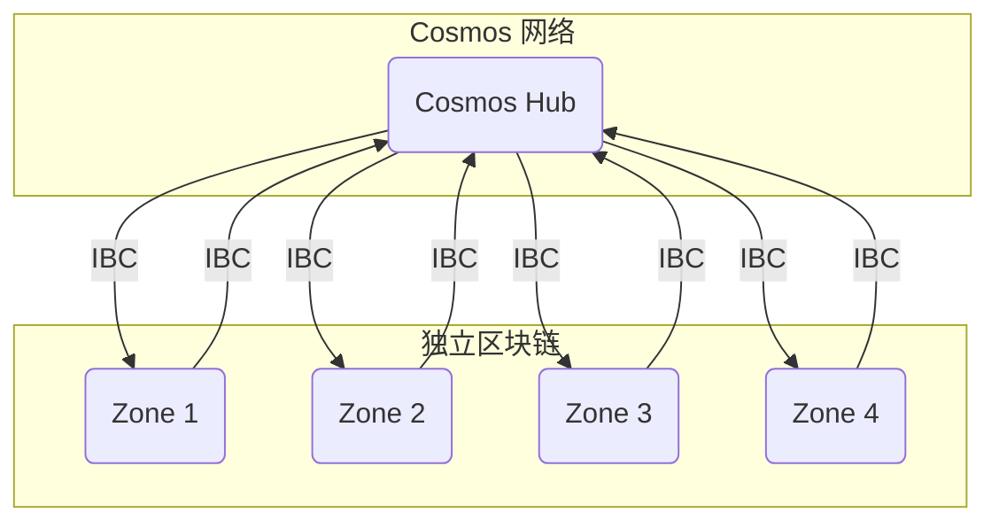
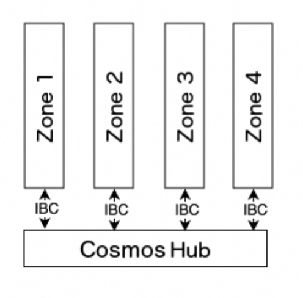
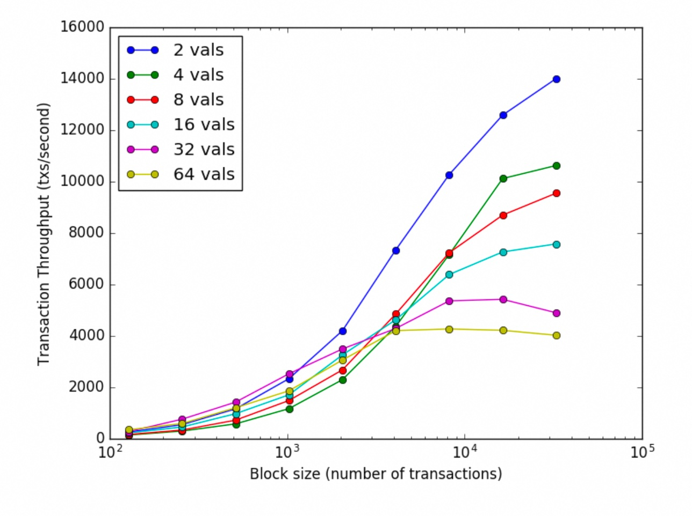
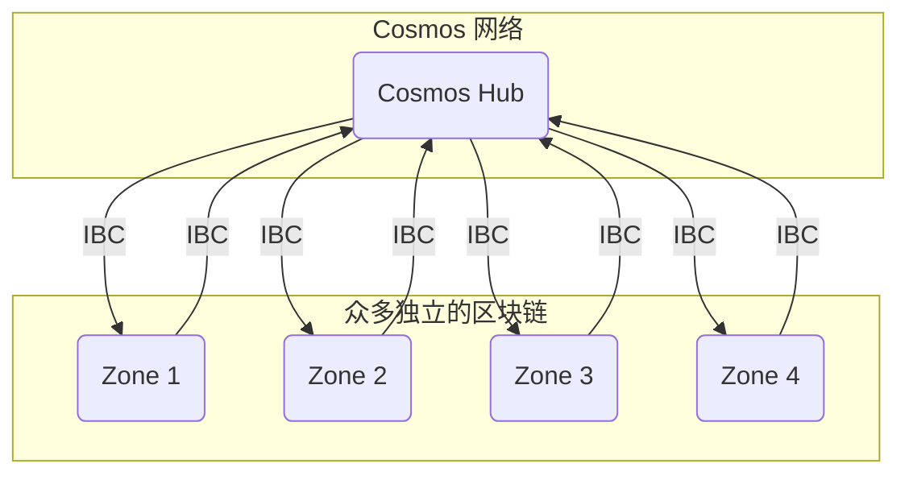
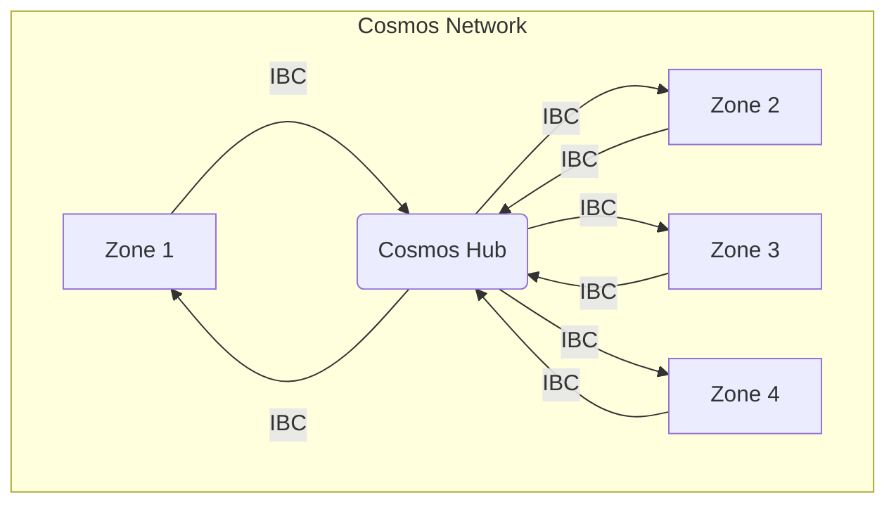

## AI论文解读 | Cosmos Whitepaper: A Network of Distributed Ledgers
        
### 作者        
digoal        
        
### 日期        
2025-08-25       
        
### 标签        
PostgreSQL , PolarDB , DuckDB , AI , 论文解读        
        
----        
        
## 背景  
      
https://wikibitimg.fx994.com/attach/2020/12/16623142020/WBE16623142020_55300.pdf        
  
提示:          
```          
读懂《Cosmos Whitepaper: A Network of Distributed Ledgers》这篇论文需要提前掌握哪些基础知识, 请使用中文通熟易懂的讲解这些基础知识, 可以引用论文中的图、表或使用Markdown支持的图形(text,mermaid等)增加解释性. 
  
使用中文通熟易懂的解读《Cosmos Whitepaper: A Network of Distributed Ledgers》这篇论文, 其中的关键内容请着重讲解, 可以引用论文中的图、表或使用Markdown支持的图形(text,mermaid等)增加解释性. 
  
提取《Cosmos Whitepaper: A Network of Distributed Ledgers》这篇论文中的重要术语, 使用中文对这些术语进行通熟易懂的讲解, 可以引用论文中的图、表或使用Markdown支持的图形(text,mermaid等)增加解释性. 
```     
  
## 1 前置知识 
  
要读懂《Cosmos 白皮书：一个分布式账本网络》，提前掌握一些区块链和分布式系统的基础知识将大有裨益。以下将用通俗易懂的中文为您讲解这些核心概念，并结合论文中的图表进行说明。

### 1\. 核心概念：区块链与分布式账本

首先，我们需要理解什么是区块链和分布式账本。

  * **分布式账本 (Distributed Ledger)**：想象一个公共账本，不由任何单一的中央机构（如银行）控制，而是由网络中的多个参与者共同维护。这个网络中的每一方都拥有账本的完整副本，任何新的交易记录都会被广播给所有参与者。这种去中心化的特性是区块链技术的基础 。

  * **区块链 (Blockchain)**：区块链是分布式账本的一种特定实现方式。它将交易数据打包成一个个“区块”（Block），然后用密码学技术将这些区块按时间顺序链接起来，形成一条“链”（Chain）。这种链接方式确保了数据一旦被记录就极难被篡改，因为修改一个区块意味着其后所有的区块都必须跟着改变，这在计算上几乎是不可能的。

### 2\. 共识机制：网络如何达成一致？

在一个没有中心节点的分布式网络中，所有参与者必须就交易的顺序和有效性达成一致，这个过程就是“共识”。

  * **工作量证明 (Proof-of-Work, PoW)**：这是比特币使用的共识机制 。参与者（称为“矿工”）通过解决复杂的数学难题来竞争记账权。第一个解决难题的矿工可以打包新的区块并获得奖励。这种方式非常耗能，并且交易确认速度较慢 。

  * **权益证明 (Proof-of-Stake, PoS)**：这是 Cosmos 所采用的模式。在这种机制下，记账权的获得不再依赖于算力竞赛，而是取决于参与者持有并“质押”（Stake）的代币数量。质押的代币越多，被选中记账的概率就越大。这些参与者被称为“验证者”（Validators）。PoS 相比 PoW 更节能、高效。

  * **拜占庭容错 (Byzantine Fault Tolerance, BFT)**：这是一个源于计算机科学的经典问题，探讨的是在一个可能存在恶意或故障节点的分布式系统中，如何达成共识。BFT 算法能够容忍一部分节点（通常是少于 1/3）出现任意形式的错误（包括恶意行为），同时保证整个系统仍能正常运行 。Tendermint BFT 是 Cosmos 使用的核心共识引擎，它是一种高效且安全的 BFT 实现 。

### 3\. Tendermint BFT：Cosmos 的引擎

Tendermint 是理解 Cosmos 的关键，它将共识引擎与应用程序分离开来。

  * **应用无关的共识引擎**：Tendermint Core 负责处理网络中所有节点间的共识过程，即就交易的顺序达成一致。但它本身并不关心交易的具体内容是什么 。

  * **ABCI 接口 (Application Blockchain Interface)**：这是一个连接 Tendermint 共识引擎和上层应用程序的接口 。通过这个接口，开发者可以使用任何编程语言来编写自己的区块链应用（状态机），而无需关心底层复杂的共识过程 。

      * **职责划分**：
          * **Tendermint Core (共识层)**：负责节点间共享区块和交易，并确立交易的最终顺序 。
          * **ABCI 应用 (应用层)**：负责维护状态（如账户余额），验证交易签名，执行交易逻辑等 。

### 4\. Cosmos 网络架构：Hub 与 Zone

Cosmos 的愿景是构建一个“区块链的互联网”，解决不同区块链之间的互操作性（Interoperability）和可扩展性（Scalability）问题 。

  * **Zone (分区)**：每一个独立的区块链都可以作为一个 "Zone" 。这些 Zone 可以有自己的代币、治理模式和功能，例如，一个 Zone 可以是专门用于去中心化交易的，另一个可以是专注于隐私保护的 。

  * **Hub (枢纽)**：Hub 是一个特殊的区块链，用于连接各个 Zone 。它像一个中央路由器，负责在不同的 Zone 之间安全、快速地传递代币和信息 。第一个也是最核心的 Hub 就是 Cosmos Hub。

  * **跨链通信协议 (Inter-Blockchain Communication, IBC)**：这是 Hub 和 Zone 之间，以及 Zone 与 Zone 之间（通过 Hub）进行通信的协议 。通过 IBC，一个 Zone 上的代币可以被安全地转移到另一个 Zone，而不需要通过传统的中心化交易所 。

下面这张图直观地展示了 Hub 和 Zones 之间的关系：



  

*上图引用自白皮书中的插图 ，清晰地展示了多个独立的 Zone 通过 IBC 协议连接到中央的 Cosmos Hub。*

### 5\. 性能与可扩展性

白皮书强调了 Tendermint 共识的高性能。下图展示了在不同数量验证者（vals）的情况下，交易吞吐量（txs/second）与区块大小（number of transactions）的关系。

  

*来源: Cosmos 白皮书第 3 页*

从图中可以看出，即使在有 64 个验证者、遍布全球的恶劣网络环境下，Tendermint 依然可以达到每秒数千笔交易的处理速度，并且延迟极低 。这是通过允许并行处理多个区块链（Zones）来实现的，从而极大地提升了整个网络的可扩展性 。

**总结一下，在阅读 Cosmos 白皮书之前，您需要掌握的基础知识包括：**

| 核心概念 | 关键知识点 |
| :--- | :--- |
| **分布式账本与区块链** | 理解其去中心化、不可篡改的特性。 |
| **共识机制** | 了解 PoW 的能耗问题和 PoS 的基本原理（验证者、质押）。 |
| **拜占庭容错 (BFT)** | 知道它是在解决分布式系统中的信任和一致性问题，是 Cosmos 安全性的基础。 |
| **Tendermint** | 明白它是一个将共识与应用分离的引擎，通过 ABCI 接口实现灵活性。 |
| **Cosmos 架构** | 掌握 Hub（枢纽）和 Zone（分区）的概念，以及 IBC（跨链通信协议）的作用。 |

有了这些基础知识，您在阅读白皮书时，就能更好地理解 Cosmos 为何要如此设计，以及它是如何解决当时区块链领域普遍存在的性能、可扩展性和互操作性等核心问题的 。
  
## 2 解读论文 
  
好的，我们来一起解读《Cosmos 白皮书：一个分布式账本网络》这篇重要的论文。

这篇白皮书的核心思想是解决当时区块链世界普遍存在的 **三大难题**：**性能与可扩展性差**、**互操作性缺失**以及**开发复杂性高**。Cosmos 提出了一套创新的架构，旨在构建一个由众多独立、可互通的区块链组成的“区块链互联网”。

-----

### 一、 背景：当时区块链的困境

在 Cosmos 出现之前，区块链世界主要由比特币和以太坊主导。然而，它们都面临着一些难以解决的问题：

  * **能源效率低下和性能瓶颈**：以比特币为代表的 PoW (工作量证明) 机制极其耗能，并且交易处理速度慢 (TPS 低) 。无论是 Segregated-Witness 还是 BitcoinNG，这些方案都受限于单一物理机的处理能力 。
  * **缺乏互操作性**：各个区块链是孤立的“数据孤岛”。比特币网络和以太坊网络就像两个无法直接通信的局域网，资产和信息无法自由流通。
  * **治理机制不成熟**：如何对网络进行升级和决策是一个难题。以太坊因为 TheDAO 黑客事件而被迫硬分叉，产生了 ETH 和 ETC，这正是缺乏成熟治理机制的体现 。

Cosmos 的目标就是解决以上所有问题 。

-----

### 二、 核心技术：Tendermint BFT 共识引擎

Tendermint 是 Cosmos 的基石，它是一个高性能、安全且一致性强的共识引擎。

#### 1\. Tendermint 是什么？

Tendermint 是一个**应用无关的共识引擎** 。这意味着它将区块链的**共识层**（负责交易排序和打包）和**应用层**（负责处理具体交易逻辑）彻底分离开来。

  * **共识层 (Tendermint Core)**：负责让网络中的节点对交易顺序达成一致。
  * **应用层 (Application)**：通过一个名为 **ABCI (Application Blockchain Interface)** 的接口与共识层连接 。开发者可以用任何编程语言来编写自己的应用，而无需关心底层的共识算法 。

这种分离设计极大地降低了区块链应用的开发难度，开发者可以专注于自己的业务逻辑。

#### 2\. Tendermint 的特点

  * **高性能**：白皮书中的性能测试图表显示，即使在全球分布的 64 个节点环境下，Tendermint 也能达到**每秒数千笔交易**的处理速度，并且交易确认延迟只有 1-2 秒 。   

    *来源: Cosmos 白皮书第 3 页*

  * **权益证明 (Proof-of-Stake)**：与比特币的 PoW 不同，Tendermint 采用 PoS 机制。拥有投票权的节点被称为“验证者”（Validators） 。验证者的投票权重取决于其质押的代币（在 Cosmos Hub 中称为 "Atom"）数量 。

  * **拜占庭容错 (BFT)**：Tendermint 是一个 BFT 算法，这意味着它能容忍网络中存在少于 $1/3$ 的恶意或故障节点，并保证整个系统的安全性和一致性 。它通过一个多轮投票和锁定的机制来确保验证者不会对两个不同的区块进行签名，从而**避免了区块链分叉** 。

  * **轻客户端友好**：由于其不会分叉的特性，轻客户端（如手机钱包）无需同步完整的区块头链，只需跟进验证者集的变更，就能快速安全地验证交易，这非常适合移动设备和物联网场景 。

-----

### 三、 宏伟架构：Hub (枢纽) 与 Zone (分区)

这是 Cosmos 解决可扩展性和互操作性的核心方案。Cosmos 不是一条单一的链，而是一个由众多独立区块链组成的网络 。

  * **Zone (分区)**：网络中的每一个独立区块链都是一个 "Zone" 。每个 Zone 都可以有自己的功能、代币和治理规则 。它可以是一个去中心化交易所，也可以是一个稳定币系统，或者任何其他应用。
  * **Hub (枢纽)**：Hub 是一条特殊的区块链，它的主要作用是连接各个 Zone，并作为它们之间相互通信的“路由器” 。**Cosmos Hub** 是网络中的第一个也是最核心的枢纽 。
  * **跨链通信 (IBC)**：Hub 和 Zone 之间通过一种名为 **IBC (Inter-Blockchain Communication)** 的协议进行通信 。这套协议就像是区块链世界的 TCP/IP，负责在不同链之间安全、可靠地传递信息和代币。

下面的架构图清晰地展示了这种 "Hub-and-Spoke"（轴辐）模型：



  

*图解：每个 Zone 都是一条独立的区块链，它们不直接相互通信，而是通过 IBC 协议将数据包发送到 Cosmos Hub，再由 Hub 转发给目标 Zone。Hub 负责追踪每个 Zone 中代币的总量，以防止代币增发等问题 。*

#### IBC 工作流程简述

当 Zone1 想要向 Zone2 发送代币时，流程大致如下：

1.  **Zone1 → Hub**: Zone1 将代币锁定，并向 Hub 发送一个 IBC 数据包，证明这一操作。
2.  **Hub 验证**: Hub 验证来自 Zone1 的证明。验证通过后，Hub 会记录一个“债权”，表示 Zone2 现在可以从 Hub 这里“提取”相应数量和类型的代币。
3.  **Hub → Zone2**: Hub 将包含该信息的 IBC 数据包转发给 Zone2。
4.  **Zone2 验证**: Zone2 验证来自 Hub 的证明，然后在自己的链上为接收方解锁或铸造相应的代币。

整个过程通过密码学证明来保证安全，实现了资产的跨链安全转移，而无需依赖中心化的第三方 。

-----

### 四、 主要应用场景

Cosmos 灵活的架构催生了丰富的应用场景。

1.  **去中心化交易所 (DEX)**：可以在一个高性能的 Zone 上构建一个完整的去中心化交易所。用户可以提交限价订单，而不需要像早期的原子交换那样要求交易双方同时在线 。借助 IBC，用户可以快速、方便地将资产从其他链充值到交易所 Zone，或从中提现 。

2.  **连接其他加密货币 (跨链桥)**：Cosmos 可以通过一个特殊的“桥接区”(Bridge-Zone) 来连接像比特币、以太坊这样的现有主流区块链 。这个桥接区一方面作为 Cosmos 的一个 Zone 运行，另一方面运行着另一个链（如以太坊）的全节点 。通过这种方式，可以将以太坊上的 ETH “桥接”到 Cosmos 网络中，变为可在 Cosmos 生态自由流通的资产 。

3.  **以太坊扩容**：可以将以太坊上的应用逻辑迁移到一个基于 Tendermint 的“以太坊 Zone”上。这个 Zone 可以使用桥接过来的 ETH 作为 gas 费，但享受 Tendermint 带来的高性能和低延迟 。

-----

### 五、 Cosmos Hub 的原生代币：Atom

Cosmos Hub 有一种原生的质押代币，名为 **Atom** 。Atom 不是像比特币那样的支付货币，它的核心用途是维护 Hub 的安全和进行网络治理。

  * **质押 (Staking)**：Atom 的持有者可以将代币质押给验证者，共同维护网络安全，并从中获得区块奖励和交易费分成 。如果验证者作恶（如双签），其质押的 Atom 将被罚没 (Slash) 。
  * **治理 (Governance)**：Atom 的持有者可以对网络的提案进行投票，例如修改网络参数或进行软件升级 。
  * **交易费**：与以太坊的 Ether 类似，Atom 也用于支付交易手续费，以防止网络垃圾交易 。

### 总结

《Cosmos 白皮书》描绘了一个宏大而精巧的蓝图，其核心贡献可以概括为：

1.  **通过 Tendermint Core 和 ABCI**，极大地简化了区块链应用的开发。
2.  **通过 Hub 与 Zone 的轴辐模型以及 IBC 协议**，首次提出了一个切实可行的、能够连接无数异构区块链的“区块链互联网”方案，解决了互操作性和可扩展性难题。
3.  **通过基于 PoS 和 BFT 的共识机制**，在保证安全性的前提下，实现了远超传统 PoW 链的高性能和高能源效率。

Cosmos 的设计哲学深刻影响了后来的许多项目，是区块链发展史上一个重要的里程碑。
  
## 3 术语 
  
根据你提供的《Cosmos Whitepaper: A Network of Distributed Ledgers》白皮书，以下是其中几个重要术语的中文解释：

-----

### Tendermint BFT

**Tendermint BFT** 是一种共识算法，它将共识层与应用层分离开来，解决了现有区块链的一些问题，例如能源效率低下、性能有限以及治理机制不成熟等 。

  * **工作原理**: 在 Tendermint 中，拥有正数投票权的节点被称为**验证人（validators）** 。这些验证人通过广播加密签名（即投票）来对下一个区块达成共识 。共识过程分轮次进行，每轮都有一位 **提议者（proposer）** 负责提出一个区块，然后验证人分阶段对该区块进行投票决定是否接受 。
  * **安全与性能**: Tendermint 的安全性源于其使用的“超级多数” (\>2/3) 投票和锁定机制 。如果超过 1/3 的投票权是“拜占庭”行为（即恶意行为），则会违反安全性 。然而，如果有任何验证人试图违反安全性，他们都会被协议识别出来 。尽管有这些严格的保证，Tendermint 仍然表现出色，在基准测试中，其共识算法每秒可以处理数千笔交易，并且提交延迟通常在一到两秒内 。
  * **与其他算法对比**:
      * 与 **比特币的工作量证明（Proof-of-Work）** 相比，Tendermint 使用基于加密签名的 BFT 循环算法，而不是挖矿 。这使得 Tendermint 可以通过多个并行区块链实现水平扩展，并且更频繁的区块提交也支持垂直扩展 。
      * 与 **Casper** 等其他共识算法相比，Tendermint 侧重于“一致性优于可用性”，即在网络分区导致没有超过 2/3 投票权的单一分区时，共识会完全停止 。但这种架构也可以通过“全球 Hub + 区域性自治 Zone”来缓解 。

-----

### Cosmos Hub 和 Zones

Cosmos 不是一个单一的分布式账本，而是一个由许多相互独立的并行区块链组成的网络，这些区块链被称为 **Zones** 。

  * **Cosmos Hub**: 这是 Cosmos 网络中的第一个 Zone 。Cosmos Hub 是一种多资产的权益证明加密货币，它通过一种名为 **跨链通信协议（IBC）** 的协议连接许多其他区块链（即 Zones）。所有跨 Zones 的代币转移都必须通过 Cosmos Hub 进行，Hub 负责记录每个连接 Zone 中所持有的代币总量 。Hub 的安全性对整个系统至关重要，因为它充当整个网络的中央账本 。
  * **Zones**: Zones 是独立的区块链，它们与 Hub 交换 IBC 消息 。从 Hub 的角度来看，一个 Zone 就像一个多资产的动态成员多重签名账户，它可以使用 IBC 数据包发送和接收代币 。任何人都可以连接一个新的 Zone 到 Cosmos Hub，这使得 Cosmos 能够与未来的区块链创新保持兼容性 。

下面是 Hub 和 Zones 关系图的简化版本：



  * **治理**: 每个 Zone 都可以有自己的宪法和治理机制 。Cosmos Hub 上的验证人（validators）和委托人（delegators）可以投票决定修改预设参数或协调升级的提案 。

-----

### 跨链通信协议 (IBC)

**跨链通信协议（Inter-blockchain Communication, IBC）** 是一种类似于区块链的虚拟 UDP 或 TCP 协议，它使得 Cosmos Hub 和 Zones 之间能够进行通信 。

  * **工作方式**: 要将数据包从一个区块链转移到另一个，需要在接收链上发布一个证明 。这个证明表明发送链已经为指定的目的地发布了一个数据包 。为了验证这个证明，接收链必须能够同步发送链的最新区块头 。
  * **交易类型**: IBC 协议主要通过两种交易类型来定义：
    1.  `IBCBlockCommitTx`: 允许一个区块链向任何观察者证明其最新的区块哈希 。
    2.  `IBCPacketTx`: 证明一个数据包确实已经被发送链发布 。

-----

### Cosmos 代币 (Atom) 和验证人/委托人

  * **Atom**: 这是 Cosmos Hub 的原生代币，也是唯一的质押代币 。持有 Atom 赋予持有人投票、验证或委托给其他验证人的权利 。像以太坊的 Ether 一样，Atom 也可用于支付交易费用以防止垃圾信息 。
  * **验证人（Validators）**: 他们是 Cosmos 中的专用安全机器，负责提交区块 。他们的角色类似于比特币矿工，但他们使用加密签名来投票 。验证人的投票权取决于他们质押的代币数量 。
  * **委托人（Delegators）**: 非验证人可以将他们的 Atom 代币委托给任何验证人，以赚取部分区块费用和 Atom 奖励 。然而，如果他们委托的验证人被入侵或违反协议，他们将面临被惩罚（即“削减”或 "slashed"）的风险 。如果验证人未能及时对提案进行投票，他们会被自动停用 。

**如何理解“削减”惩罚？**
当验证人有意或无意地偏离了协议时，会受到惩罚 。例如，在同一高度和轮次进行双重签名，或者违反 Tendermint 共识协议的规则 。这类行为会导致验证人失去其良好声誉，其质押的 Atom 和在储备池中的代币份额将被“削减” 。
  
## 参考        
         
https://wikibitimg.fx994.com/attach/2020/12/16623142020/WBE16623142020_55300.pdf    
        
<b> 以上内容基于DeepSeek、Qwen、Gemini及诸多AI生成, 轻微人工调整, 感谢杭州深度求索人工智能、阿里云、Google等公司. </b>        
        
<b> AI 生成的内容请自行辨别正确性, 当然也多了些许踩坑的乐趣, 毕竟冒险是每个男人的天性.  </b>        
  
  
    
#### [期望 PostgreSQL|开源PolarDB 增加什么功能?](https://github.com/digoal/blog/issues/76 "269ac3d1c492e938c0191101c7238216")
  
  
#### [PolarDB 开源数据库](https://openpolardb.com/home "57258f76c37864c6e6d23383d05714ea")
  
  
#### [PolarDB 学习图谱](https://www.aliyun.com/database/openpolardb/activity "8642f60e04ed0c814bf9cb9677976bd4")
  
  
#### [PostgreSQL 解决方案集合](../201706/20170601_02.md "40cff096e9ed7122c512b35d8561d9c8")
  
  
#### [德哥 / digoal's Github - 公益是一辈子的事.](https://github.com/digoal/blog/blob/master/README.md "22709685feb7cab07d30f30387f0a9ae")
  
  
#### [About 德哥](https://github.com/digoal/blog/blob/master/me/readme.md "a37735981e7704886ffd590565582dd0")
  
  

  
