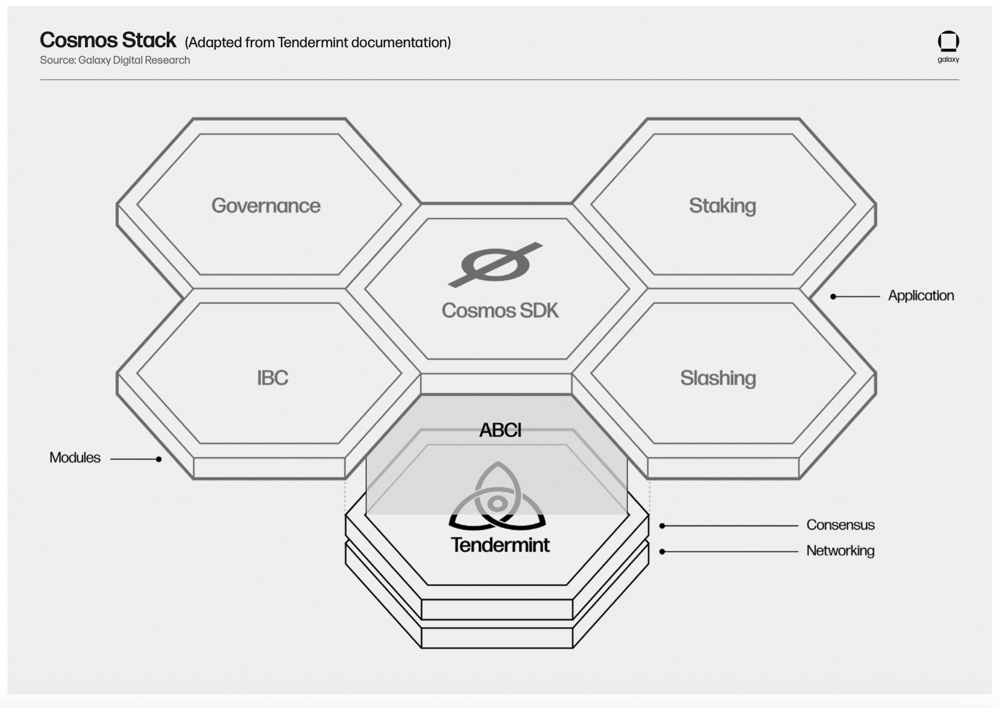
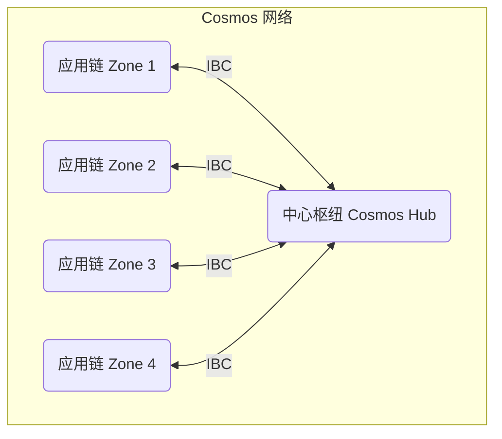

## AI论文解读 | Galaxy Research: Exploring the Cosmos
        
### 作者        
digoal        
        
### 日期        
2025-08-25       
        
### 标签        
PostgreSQL , PolarDB , DuckDB , AI , 论文解读        
        
----        
        
## 背景  
      
https://assets.ctfassets.net/h62aj7eo1csj/4X3Nk29JhsxXeqgGC1Odq2/8aa330670beca7e8d774b8397a8c4c36/GLXY_2022_ResearchReport_ExploringCosmos_v01.pdf        
  
提示:          
```          
读懂《Galaxy Research: Exploring the Cosmos》这篇论文需要提前掌握哪些基础知识, 请使用中文通熟易懂的讲解这些基础知识, 可以引用论文中的图、表或使用Markdown支持的图形(text,mermaid等)增加解释性. 
  
使用中文通熟易懂的解读《Galaxy Research: Exploring the Cosmos》这篇论文, 其中的关键内容请着重讲解, 可以引用论文中的图、表或使用Markdown支持的图形(text,mermaid等)增加解释性. 
  
提取《Galaxy Research: Exploring the Cosmos》这篇论文中的重要术语, 使用中文对这些术语进行通熟易懂的讲解, 可以引用论文中的图、表或使用Markdown支持的图形(text,mermaid等)增加解释性. 
```     
  
## 1 前置知识 
  
好的，为了帮助您更好地理解《Galaxy Research: Exploring the Cosmos》这份研究报告，我将为您梳理阅读前需要掌握的核心基础知识。这些知识将以通俗易懂的方式进行讲解，并结合报告中的图表和Markdown图形，让您能够轻松入门。

-----

### 理解报告所需的基础知识框架

阅读这篇关于Cosmos的深度报告，您主要需要掌握以下五个层面的基础知识。它们就像是五个台阶，从最基础的区块链概念一直延伸到Cosmos独特的技术架构。

1.  **区块链基础 (Blockchain Basics)**: 什么是区块链？
2.  **共识机制 (Consensus Mechanism)**: 区块链如何达成信任？
3.  **智能合约与去中心化应用 (Smart Contracts & dApps)**: 区块链能做什么？
4.  **区块链架构 (Blockchain Architecture)**: 单体式 vs. 模块化
5.  **互操作性 (Interoperability)**: 如何实现“链”间通信？

下面我们来逐一讲解。

### 核心概念 1: 什么是区块链 (Blockchain Basics)

您可以将区块链想象成一个**公共的、分布式的、不可篡改的数字账本**。

  * **公共和分布式**：这个账本不存放在某个中心服务器（比如银行的数据库），而是由网络中成千上万的计算机共同维护。每个人都有一份完整的账本备份。
  * **不可篡改**：一旦一笔交易（比如转账）被记录到账本上，就几乎不可能被修改或删除。这是通过密码学技术将一个个“区块”（包含交易记录的页面）链接起来实现的，形成一个“链”。

这个特性使得我们可以在没有中心化机构（如银行、政府）的情况下，建立点对点的信任。

### 核心概念 2: 共识机制 (Consensus Mechanism)

既然账本是分布式的，那么由谁来记账？如何保证大家账本上记录的内容是一致的？这就是**共识机制**要解决的问题。

报告中反复提到的 **Tendermint**  就是一种先进的共识引擎。要理解它，需要先了解以下几个概念：

#### 拜占庭将军问题 (Byzantine Generals Problem)

这是分布式系统中的一个经典问题。报告第九页对此有详细的描述 。

简单来说，想象一群拜占庭将军带领军队包围了一座城市，他们需要通过信使传递信息来决定是“进攻”还是“撤退”。但问题在于：

  * 信使可能被敌人截获或篡改信息。
  * 将军中可能存在叛徒，他们会故意发送错误的信息（比如对A将军说“进攻”，对B将军说“撤退”）。

如果不能达成统一行动（共识），忠诚的将军们就会因为行动不一致而战败。

```text
            +-----------+        +-----------+
            |  将军 A   |        |  将军 B   |
            +-----------+        +-----------+
                  |                    |
            (信使可能被篡改)     (将军可能是叛徒)
                  |                    |
                  V                    V
            +-----------+        +-----------+
            |  将军 C   |        |  将军 D   |
            +-----------+        +-----------+

问题：如何保证所有忠诚的将军最终执行相同的命令？
```

#### 拜占庭容错 (Byzantine Fault Tolerance, BFT)

一个能够解决拜占庭将军问题的系统，就具备了**拜占庭容错**能力。这意味着即使网络中存在一部分恶意或故障节点（叛徒将军），整个系统仍然可以正常运行并达成共识。

Tendermint就是一种BFT共识算法，报告中提到它可以容忍最多 $1/3$ 的验证者（将军）是恶意的 。

#### 工作量证明 (Proof-of-Work, PoW) vs. 权益证明 (Proof-of-Stake, PoS)

这是两种最主流的达成共识的方式。

  * **PoW (比特币采用)**：通过“挖矿”竞争记账权，节点需要消耗大量算力和电力来解决一个数学难题。谁先算出来，谁就能记账并获得奖励。这非常耗能 。
  * **PoS (Cosmos采用)**：记账权不再通过算力竞争，而是根据节点 **质押（Stake）** 的代币数量和时间来分配。你质押的代币越多，就越有机会被选中来验证交易和创建新区块，并获得奖励。如果你作恶，你质押的代币将被罚没（Slashing） 。

Cosmos采用PoS机制，这使得它比PoW链更节能、更高效。

### 核心概念 3: 智能合约与去中心化应用 (Smart Contracts & dApps)

如果说区块链是操作系统，那么**智能合约**就是在上面运行的程序。它是一段自动执行的、代码化的合同条款。例如，一个智能合约可以规定：“当A向我支付10个币时，我自动将一个数字收藏品的所有权转移给A”。

大量的智能合约组合在一起，就构成了**去中心化应用 (dApp)**，比如去中心化交易所（DEX）、借贷平台等。报告中提到的**Osmosis**  就是一个基于Cosmos构建的著名DEX。

### 核心概念 4: 区块链架构：单体式 vs. 模块化

这是理解Cosmos为何被称为“区块链的互联网”  的**最关键概念**。

  * **单体式架构 (Monolithic)**：像以太坊、Solana这样的区块链，所有功能——共识、数据处理、交易执行——都在一个统一的层面上完成。所有的dApp都在同一个“世界计算机”上竞争资源。这容易导致网络拥堵和高昂的手续费。

  * **模块化架构 (Modular)**：Cosmos的设计理念是将区块链的不同功能拆分开来。它提供了一套工具（如Tendermint共识引擎和Cosmos SDK ），让开发者可以轻松地为自己的应用构建一条专属的、独立的区块链（报告中称为**应用链 App-Chain** 或 **Zone** ）。

我们可以用一个Mermaid图来形象地展示这种区别：

```mermaid
graph TD
    subgraph 单体式架构 (如: 以太坊)
        A[统一的区块链层]
        A --承载--> B(dApp 1: DEX)
        A --承载--> C(dApp 2: 游戏)
        A --承载--> D(dApp 3: 借贷)
    end

    subgraph 模块化架构 (Cosmos)
        Z1[应用链 1: Osmosis DEX]
        Z2[应用链 2: dYdX 衍生品]
        Z3[应用链 3: 游戏链]
        Hub(Cosmos Hub: 路由中心)
        Z1 <--> Hub
        Z2 <--> Hub
        Z3 <--> Hub
    end
```

这种模块化设计的好处是：

1.  **主权性**：每个应用链都可以自定义规则，不受其他应用影响。
2.  **可扩展性**：一个应用的拥堵不会影响到另一个应用。整个网络的性能可以随着应用链的增加而线性扩展 。

### 核心概念 5: 互操作性与跨链通信 (Interoperability)

既然每个应用都是一条独立的链，那么它们之间如何安全地通信和转移资产呢？这就需要**互操作性**协议。

  * **跨链桥 (Bridges)**：这是常见的解决方案，但通常依赖于一个第三方的验证者集合，存在安全风险。报告中提到，仅2022年就有超过20亿美元从跨链桥被盗 。
  * **跨链通信协议 (Inter-Blockchain Communication Protocol, IBC)**：这是Cosmos的“王牌”技术 。IBC不是一个桥，而是一个标准化的通信协议，类似于互联网的TCP/IP。它不依赖于第三方验证者，而是让两条链直接通过轻客户端验证对方的状态，从而实现安全、无需信任的资产和数据传输 。

### 将知识与论文结合

掌握了以上基础知识后，您就可以轻松地将它们与报告中的关键术语对应起来：

  * **Tendermint Core**: 这是PoS和BFT共识引擎，是Cosmos技术栈的基石，负责网络的安全和节点间达成共识（对应**核心概念2**）。
  * **Cosmos SDK**: 这是一个开发工具包，让开发者可以像搭积木一样，快速构建自己的应用链（对应**核心概念4**）。
  * **IBC**: 这是跨链通信协议，负责连接所有独立的“Zone”，实现资产和数据的自由流动（对应**核心概念5**）。
  * **Hubs and Zones**: 这是Cosmos网络的拓扑结构。Zones是独立的应用链，Hubs（如Cosmos Hub）是专门用来连接各个Zones的路由中心，避免了每条链都互相直连的复杂性（对应**核心概念4**中的图示）。

报告第8页的这张图完美地总结了这种模块化架构 ：

  

*(图源：报告第8页 )*

  * **底层 (Tendermint)**：负责共识和网络，是地基。
  * **中间层 (ABCI)**：是连接共识层和应用层的“接口”。
  * **上层 (Cosmos SDK)**：包含各种功能模块（治理、质押、IBC等），开发者可以用它们来构建自己的应用。

### 总结

当您阅读这份报告时，请始终记住Cosmos的核心愿景：**构建一个由无数条主权、可互操作的区块链组成的“互联网”**。它通过提供模块化的工具，赋予开发者极大的灵活性和主权，并通过IBC协议将这些独立的“孤岛”安全地连接起来。

有了这些基础知识，您再去看报告中关于Juno 、Evmos 、dYdX V4  等具体项目的介绍，以及对未来路线图的展望时，就会有一个清晰的理解框架。祝您阅读愉快！
  
## 2 解读论文 
  
好的，我们来一起通俗易懂地解读这篇关于Cosmos的深度研究报告。

这篇报告系统性地介绍了Cosmos——一个常被称为“区块链的互联网”的生态系统。它不仅仅是一条链，而是一个由成百上千条可以相互通信的独立区块链组成的网络 。

### **一、Cosmos是什么？—— “区块链的互联网”**

首先，我们需要理解Cosmos与比特币、以太坊等传统区块链的根本区别。

  * **传统区块链（如以太坊）是“单体式”的**：所有应用（游戏、交易所、借贷）都在同一条公共链上运行，共享资源。这就像一座城市只有一条主干道，当车流量过大时，就会发生严重拥堵，通行费（Gas Fee）也随之飙升。
  * **Cosmos是“模块化”的**：它提供了一套工具，让开发者可以轻松为自己的应用**构建一条专属的、独立的区块链**（在Cosmos中称为“Zone”或“应用链”） 。这就像为城市里的每个重要区域（金融区、娱乐区）都修建了专属的高速公路，互不干扰。

这种架构带来了两大核心优势：

1.  **主权与灵活性**：每个应用链都可以拥有自己的规则、代币和功能，不受制于其他链 。
2.  **可扩展性**：每条应用链都能独立处理数千笔交易/秒，整个网络的总容量可以随着链的增多而无限扩展 。

然而，报告也开宗明义地指出了Cosmos的核心挑战：尽管技术强大，但其生态系统的繁荣并未给核心代币**ATOM**带来显著的价值捕获，这对开发者激励和社区资金构成了压力 。

-----

### **二、核心技术揭秘：Cosmos的三驾马车**

Cosmos的“模块化”愿景是通过一套精巧的技术堆栈实现的。我们可以将其理解为三驾马车，报告第8页的这张图清晰地展示了它们的协同工作方式 。

*(图源：报告第8页)*

#### 1\. **Tendermint Core：坚实的地基（共识层）**

Tendermint是Cosmos的基石，一个高性能的**共识引擎** 。

  * **作用**：负责让网络中的所有计算机（验证者）快速、安全地就交易顺序和有效性达成一致 。
  * **核心机制**：它采用 **权益证明（Proof-of-Stake）** 机制，并具备 **拜占庭容错（BFT）** 能力 。这意味着它无需像比特币那样进行高耗能的“挖矿” ，并且即使网络中有多达 $1/3$ 的验证者是恶意的或出现故障，整个网络依然能够安全、正常地运行 。
  * **流程**：区块的确认通过一个多步骤的投票过程完成（Propose -\> Prevote -\> Precommit -\> Commit），只有当超过 $2/3$ 的验证者（按质押权重计算）投票确认后，一个区块才会被最终敲定 。

#### 2\. **Cosmos SDK：强大的建造工具（应用层）**

如果Tendermint是地基，那么Cosmos SDK就是一套“**区块链乐高**” 。

  * **作用**：它是一个开源框架，提供了大量预先构建好的模块，如账户管理（Auth）、代币转账（Bank）、质押（Staking）、治理（Governance）等 。
  * **优势**：开发者无需从零开始编写所有底层代码，只需像搭积木一样组合所需模块，再专注于开发自己应用的核心逻辑即可 。这极大地降低了开发门槛，缩短了开发周期 。

#### 3\. **IBC协议：安全的跨链桥梁（通信层）**

有了独立的区块链，如何让它们之间安全地对话？答案就是**跨链通信协议（IBC）** 。

  * **作用**：IBC是Cosmos生态的“**TCP/IP协议**”，它为所有应用链提供了一个标准化的、安全的通信方式，用于传递资产和任意数据 。
  * **安全性**：与传统的跨链桥不同，IBC不依赖任何第三方的中间人来验证交易 。它通过让两条链直接运行对方的“轻客户端”来验证彼此的状态，其安全性由两条链自身的验证者保障 。报告强调，这使得IBC比普通跨链桥**安全得多** 。

为了高效管理链间连接，Cosmos采用了“**中心辐射模型（Hubs and Zones）**” 。Zones是应用链，而Hubs（如Cosmos Hub）是专门的路由中心。一条Zone只需连接到一个Hub，就能与所有连接到该Hub的其他Zones进行通信，避免了网络连接的混乱 。



-----

### **三、生态巡礼：Cosmos版图上的明星项目**

报告用大量篇幅介绍了基于Cosmos技术构建的多元化生态。

  * **Cosmos Hub ($ATOM)**：作为生态中第一个也是最重要的Hub，它的目标是成为网络的“心脏”，并通过即将推出的“**链间安全（Interchain Security）**”功能，将自己的高安全性“租赁”给新的、小型的应用链，并从中收取费用，为ATOM代币赋能 。
  * **Osmosis ($OSMO)**：Cosmos生态的**头号去中心化交易所（DEX）**，也是应用链模式成功的典范 。它开创了“**超流态质押（Superfluid Staking）**”功能，允许用户将用于提供流动性的LP代币同时进行质押，从而在赚取交易费的同时获得PoS质押奖励，极大地提高了资本效率 。
  * **dYdX V4 ($DYDX)**：这被认为是**对Cosmos技术栈的巨大认可** 。dYdX是全球领先的去中心化衍生品交易所，它选择在Cosmos上构建V4版本，正是看中了Cosmos SDK的灵活性和高性能，这能帮助它实现一个完全去中心化、且由社区控制的链下订单簿和匹配引擎 。
  * **其他重要项目**：生态还包括与以太坊兼容的**Evmos** 、注重隐私保护的**Secret Network** 、以及币安交易所构建的**BNB Chain**（虽然使用了Cosmos SDK，但未连接IBC）等，展现了极强的多样性。

-----

### **四、机遇与挑战**

报告客观地分析了Cosmos面临的机遇与挑战。

#### **机遇**

1.  **技术护城河**：Cosmos SDK的灵活性和IBC的安全性，对追求高性能和完全去中心化的成熟项目（如dYdX）具有极强的吸引力 。
2.  **创新沃土**：模块化架构允许项目进行在单体链上无法实现的底层创新（如Osmosis的超流态质押）。
3.  **安全性优势**：随着传统跨链桥安全事件频发，IBC的安全性优势愈发凸显 。

#### **挑战**

1.  **ATOM代币经济学**：这是最核心的问题。生态的繁荣无法有效传导至ATOM代币，导致核心开发资金不足，激励机制匮乏 。报告指出，团队计划在2022年第三/四季度对此进行改进 。
2.  **核心团队的内部矛盾**：报告披露了创始人Jae Kwon与其他核心贡献者之间的紧张关系，这可能会影响社区的凝聚力和发展效率 。
3.  **潜在的中心化风险**：尽管Cosmos网络由许多条链构成，但报告通过数据分析发现，很大一部分链的安全性是由少数几家专业的“节点即服务”公司保障的 。这意味着，如果这些头部验证者公司受到攻击，可能会同时影响多条链的安危 。

-----

### **五、未来展望**

报告对Cosmos的未来持谨慎乐观态度。关键的未来发展方向包括：

  * **链间安全（Interchain Security）**：这是Cosmos Hub路线图的核心，旨在通过共享安全来捕获价值，预计在2022年第三/四季度推出 。
  * **ATOM代币经济学改革**：社区期待已久的改革，将直接关系到生态系统能否获得持续发展的动力 。
  * **持续吸引开发者**：随着dYdX等重量级项目的加入，Cosmos有望吸引更多开发者，形成强大的网络效应 。

**总而言之，该报告认为Cosmos拥有当前加密世界中最顶尖、最灵活的区块链技术之一 。它是一个充满创新活力的试验场 。然而，它的技术优势能否转化为持久的生态繁荣，关键取决于能否解决其核心代币ATOM的效用问题，并维持一个健康、协作的社区环境 。**
  
## 3 术语 
  
好的，这里是为您从《Galaxy Research: Exploring the Cosmos》报告中提取的核心术语及其通俗易懂的中文讲解。

-----

### **1. Tendermint Core (Tendermint 核心)**

您可以将 Tendermint Core 想象成一辆汽车的**引擎和底盘** 。

  * **讲解**: 它是Cosmos技术栈的基础，是一个集成了共识算法和网络通信协议的底层软件 。任何开发者都可以使用这个“引擎和底盘”，然后在上面构建自己想要的“车身”（也就是具体的区块链应用）。它的核心是实现了拜占庭容错（BFT），并且可以容忍不超过 $1/3$ 的验证者节点作恶或失效 。

### **2. Byzantine Fault Tolerance (BFT) / 拜占庭容错**

BFT是分布式系统中的一个概念，用来描述一个系统抵抗“**内鬼**”和“**故障**”的能力 。

  * **讲解**: 报告中用“拜占庭将军问题”来解释了这个概念 。想象一群将军需要协同攻击一座城市，但他们中可能有叛徒，信使也可能被敌人截获 。一个具备BFT能力的系统，就像一个能保证所有忠诚的将军最终能统一行动的指挥系统，即使有部分将军是叛徒 。在区块链中，“将军”就是验证交易的节点，“统一行动”就是对交易顺序达成共识。

<!-- end list -->

```text
            +---------------+        +---------------+
            |  忠诚将军 A   |        |   叛徒将军 B  |
            +---------------+        +---------------+
                   |                        |
(命令: 进攻)      |                        | (谎报命令: 撤退)
                   |                        |
                   V                        V
            +---------------+        +---------------+
            |  忠诚将军 C   |        |  忠诚将军 D   |
            +---------------+        +---------------+

问题：C和D如何能在B的干扰下，仍然和A采取相同的行动？
BFT系统就是这个问题的解决方案。
```

### **3. Application BlockChain Interface (ABCI) / 应用区块链接口**

ABCI就像一个**通用翻译器**或**标准插座** 。

  * **讲解**: 它连接着底层的“引擎” Tendermint Core 和上层的“应用” 。有了这个标准接口，无论你的应用是用什么编程语言（Go, Rust, JavaScript等）编写的，都可以顺畅地与Tendermint引擎进行通信 。例如，当一笔新交易出现时，引擎会通过ABCI发送`CheckTx`消息给应用，询问“这笔交易合法吗？” ；在打包区块时，会发送`DeliverTx`消息，通知应用“执行这笔交易” 。

### **4. Cosmos SDK (软件开发工具包)**

Cosmos SDK可以被理解为一套“**区块链乐高积木**” 。

  * **讲解**: 它是一个开源框架，提供了大量预先构建好的功能模块 。开发者不需要从零开始，可以直接选用如账户（Auth）、银行（Bank）、质押（Staking）、治理（Governance）、跨链通信（IBC）等模块，像搭积木一样快速构建出一条功能完备的、为自己应用量身定制的区块链 。这极大地降低了开发难度，节省了时间 。

### **5. Inter-Blockchain Communication Protocol (IBC) / 跨链通信协议**

IBC是Cosmos生态的“**互联网TCP/IP协议**” 。

  * **讲解**: 它不是一个具体的“桥”，而是一套标准化的通信规则，让生态内所有独立的区块链（Zones）可以安全、无需信任地互相发送资产和数据 。它的安全性之所以高，是因为它不依赖任何第三方验证者，而是让两条通信的链直接验证对方的状态，安全保障来自于这两条链自身的验证者集合 。

### **6. Hubs and Zones (中心枢纽与区域)**

这是Cosmos网络的**拓扑结构**，类似于“**国际机场枢纽和地方机场**”的关系 。

  * **讲解**:
      * **Zones (区域)**: 指的是每一条独立的、为特定应用服务的区块链，就像各个“地方机场” 。
      * **Hubs (中心枢纽)**: 是专门用来连接各个Zone的特殊区块链，就像“国际机场枢纽” 。
      * 这种设计的好处是，一个Zone（地方机场）只需要和Hub（国际枢纽）建立一条IBC连接（航线），就可以通过Hub与其他所有连接到该Hub的Zone进行通信 。这避免了在成百上千个Zone之间建立错综复杂的直连线路，极大地提高了网络效率 。

<!-- end list -->

```mermaid
graph TD
    subgraph Cosmos网络拓扑
        Hub[Cosmos Hub (国际枢纽)]
        Zone1[应用链A (地方机场)]
        Zone2[应用链B (地方机场)]
        Zone3[应用链C (地方機場)]

        Zone1 -- IBC连接 --> Hub
        Zone2 -- IBC连接 --> Hub
        Zone3 -- IBC连接 --> Hub
    end
```

### **7. Peg Zones (锚定区域)**

Peg Zone可以被看作是一个**特殊的“协议转换器”或“海关”**。

  * **讲解**: IBC协议要求与之连接的链必须有快速且确定的“最终性”（即交易一旦确认就不可逆转） 。但像比特币这样的链，其最终性是概率性的（等待的区块越多越安全） 。Peg Zone的作用就是追踪这些概率性链的状态，并为其建立一个最终性屏障，在风险足够低之后，再将其接入IBC网络 。

### **8. Interchain Security (链间安全)**

这是一种由Cosmos Hub提供的“**安全租赁服务**” 。

  * **讲解**: 一条新的区块链启动时，需要招募足够多的验证者来保障网络安全，这是一个成本高昂且困难的过程 。链间安全允许这些新链（被称为“消费者链”）直接使用Cosmos Hub庞大且成熟的验证者网络来保护自己，而无需自建验证者团队 。作为回报，这些新链需要将一部分交易费和代币奖励支付给Cosmos Hub及其验证者 。

### **9. Ignite CLI (Ignite 命令行工具)**

Ignite CLI是一个“**一键启动区块链的开发脚手架**” 。

  * **讲解**: 它是一个命令行工具，将使用Cosmos SDK和Tendermint创建新链的过程自动化 。开发者只需几条简单的命令，就可以生成一条新链的基础框架，并管理验证者、发送代币等，极大地提高了开发效率 。

### **10. Application-Specific Blockchain (应用专属链)**

这是支撑整个Cosmos哲学的核心理念，指的是“**一链一应用**” 。

  * **讲解**: 与以太坊等通用平台上所有应用争抢资源的模式不同，Cosmos鼓励为每个复杂的应用构建一条专属的区块链 。这样做的好处是，应用可以根据自身需求定制所有参数（如交易费、治理规则等），性能不会受到网络上其他应用的干扰，实现了真正的“主权” 。dYdX V4就是将交易所这个应用构建成一条专属链的典型例子 。
  
## 参考        
         
https://assets.ctfassets.net/h62aj7eo1csj/4X3Nk29JhsxXeqgGC1Odq2/8aa330670beca7e8d774b8397a8c4c36/GLXY_2022_ResearchReport_ExploringCosmos_v01.pdf    
        
<b> 以上内容基于DeepSeek、Qwen、Gemini及诸多AI生成, 轻微人工调整, 感谢杭州深度求索人工智能、阿里云、Google等公司. </b>        
        
<b> AI 生成的内容请自行辨别正确性, 当然也多了些许踩坑的乐趣, 毕竟冒险是每个男人的天性.  </b>        
  
  
      
#### [期望 PostgreSQL|开源PolarDB 增加什么功能?](https://github.com/digoal/blog/issues/76 "269ac3d1c492e938c0191101c7238216")
  
  
#### [PolarDB 开源数据库](https://openpolardb.com/home "57258f76c37864c6e6d23383d05714ea")
  
  
#### [PolarDB 学习图谱](https://www.aliyun.com/database/openpolardb/activity "8642f60e04ed0c814bf9cb9677976bd4")
  
  
#### [PostgreSQL 解决方案集合](../201706/20170601_02.md "40cff096e9ed7122c512b35d8561d9c8")
  
  
#### [德哥 / digoal's Github - 公益是一辈子的事.](https://github.com/digoal/blog/blob/master/README.md "22709685feb7cab07d30f30387f0a9ae")
  
  
#### [About 德哥](https://github.com/digoal/blog/blob/master/me/readme.md "a37735981e7704886ffd590565582dd0")
  
  

  
