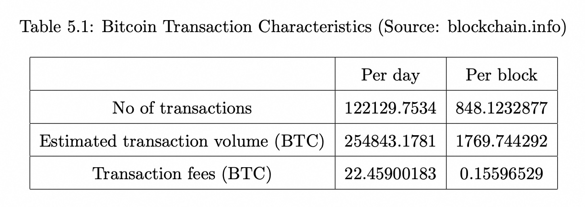

## AI论文解读 | The Economics of Cryptocurrencies – Bitcoin and Beyond
        
### 作者        
digoal        
        
### 日期        
2025-08-26       
        
### 标签        
PostgreSQL , PolarDB , DuckDB , AI , 论文解读        
        
----        
        
## 背景  
      
https://www.bis.org/events/eopix_1810/chiu_paper.pdf        
  
提示:          
```          
读懂《The Economics of Cryptocurrencies – Bitcoin and Beyond》这篇论文需要提前掌握哪些基础知识, 请使用中文通熟易懂的讲解这些基础知识, 可以引用论文中的图、表或使用Markdown支持的图形(text,mermaid等)增加解释性. 
  
使用中文通熟易懂的解读《The Economics of Cryptocurrencies – Bitcoin and Beyond》这篇论文, 其中的关键内容请着重讲解, 可以引用论文中的图、表或使用Markdown支持的图形(text,mermaid等)增加解释性. 
  
提取《The Economics of Cryptocurrencies – Bitcoin and Beyond》这篇论文中的重要术语, 使用中文对这些术语进行通熟易懂的讲解, 可以引用论文中的图、表或使用Markdown支持的图形(text,mermaid等)增加解释性. 
```     
  
## 1 前置知识 
  
好的，为了帮助您更好地理解《The Economics of Cryptocurrencies – Bitcoin and Beyond》这篇论文，我将为您梳理和讲解阅读此文所需掌握的核心基础知识。

这篇论文的核心目标是**使用经济学模型来分析加密货币作为支付手段的效率和最优设计**。它不仅仅是介绍技术，而是深入探讨系统参与者（如买家、卖家、矿工）的激励机制，以及这些激励如何影响整个系统的安全性、成本和总体社会福利。

要读懂这篇论文，您需要具备以下四个领域的基础知识：

1.  **加密货币与区块链的基础知识**
2.  **微观经济学与博弈论**
3.  **宏观经济学与货币理论**
4.  **定量分析方法**

下面我将用通俗易懂的语言，并结合论文中的图表来逐一讲解。

-----

### 1\. 加密货币与区块链的基础知识

这是理解论文讨论对象的基础。您需要了解加密货币是如何运作的，特别是它如何解决“双花问题”。

  * **双花问题 (Double-Spending Problem)**
    数字货币本质上是一串代码，可以被无限复制。双花问题指的是，同一笔数字货币被花费了两次或多次 。在传统的电子支付系统（如支付宝、PayPal）中，这个问题由一个中心化的第三方机构（如银行或支付公司）来解决，它维护一个唯一的账本，确保每笔钱只被花一次 。

    论文中的 **Figure 2.1** 很形象地展示了这一点：   

      * **上图 (e.g. PayPal)**：所有交易都通过一个中介（Intermediary），由它来记账，防止双花。
      * **下图 (e.g. Bitcoin)**：没有中介，而是由一个去中心化的网络（矿工 miners）共同维护一个公开账本 。

  * **区块链 (Blockchain) 和挖矿 (Mining)**
    区块链就是那个去中心化的公开账本 。它就像一个不断加页的账本，每一页（**区块, Block**）记录了一段时间内的所有交易 。这些区块按时间顺序链接在一起，形成一条链。

    **挖矿 (Mining)** 是指验证交易并把它们打包成新区块，然后添加到区块链上的过程 。为了争夺记账权，矿工们需要进行一种被称为**工作量证明 (Proof-of-Work, PoW)** 的竞赛，这通常需要消耗大量的计算资源（如电力）。第一个完成计算的矿工将获得记账权，并得到系统的奖励（新发行的比特币和交易费）。

  * **双花攻击与交易确认 (Confirmation Lag)**
    论文的核心是分析如何防止恶意的“双花攻击”。一个恶意的买家在支付给卖家后，可以**秘密地**挖一条不包含这笔支付记录的“分叉链” 。如果这条秘密链的长度最终超过了公共链，那么它就会被网络接受为“正统”历史，买家的支付就等于被撤销了，但他已经拿到了商品 。

    卖家的防御手段是**等待交易确认 (Confirmation Lag)** 。也就是说，卖家在看到支付交易被打包进一个区块后，并不会立刻发货，而是会等待后面再接上N个新的区块（即N次确认）。因为攻击者要逆转这笔交易，就需要重新计算这N+1个区块，并要比全网其他矿工更快，这在计算上极其困难且成本高昂 。确认次数N越多，交易就越安全。

### 2\. 微观经济学与博弈论

这部分知识用来理解论文中对个体（买家、矿工）行为的分析。论文假设所有参与者都是“理性人”，会根据成本和收益做出对自己最有利的决策。

  * **成本-收益分析 (Cost-Benefit Analysis)**

      * **对矿工而言**: 挖矿的**收益**是区块奖励 `R` 。**成本**是投入的计算资源 `q`（可以理解为电费和矿机损耗）。矿工会不断投入资源，直到投入的边际成本等于预期的边际收益。
      * **对双花攻击者而言**: 攻击的**收益**是省下的货款 `d`  和可能获得的挖矿奖励 `(N+1)R` 。**成本**是秘密挖矿投入的计算资源。攻击者会评估攻击的成功概率和潜在收益，来决定是否发动攻击。

  * **纳什均衡 (Nash Equilibrium)**
    在挖矿这个“游戏”中，所有矿工都在竞争。纳什均衡是指一种稳定状态：在这个状态下，考虑到其他所有矿工的算力投入，没有任何一个矿工能通过单方面改变自己的算力投入而获得更高的利润 。论文通过这个概念来推导整个网络总共有多少计算资源在挖矿，这个总量与区块奖励 `R` 直接相关。

  * **优化问题 (Optimization)**
    论文中充满了 `max` (最大化) 这类的数学表达式。例如，矿工决定投入多少算力 `q(i)` 来最大化自己的期望利润 `ρiβR − q(i)` 。您不需要深入理解具体的数学推导，但要明白这背后是在模拟一个理性参与者的决策过程：如何在各种约束条件下，做出最优选择以最大化自身利益。

### 3\. 宏观经济学与货币理论

这部分知识帮助您理解加密货币如何在整个经济系统中运作，它的价值来源，以及如何评估其整体效率。

  * **一般均衡 (General Equilibrium)**
    论文不只看单个交易，而是将所有参与者的行为放在一个相互关联的经济模型中，分析整个系统的平衡状态。这意味着，一个变量的改变会引发一系列连锁反应。论文中的 **Figure 2.5** 完美地诠释了这种思想，我可以用Mermaid图为您重现这个核心逻辑：   

    ```mermaid
    graph TD
        A["货币价值高 (High Currency Value)"] --> B["挖矿奖励丰厚 (High Mining Rewards)"];
        B --> C["挖矿投入大 (High Mining Effort)"];
        C --> D["系统安全性高 (High Security)"];
        D --> A;
    ```

    这个循环揭示了加密货币系统的自洽性：货币有价值，矿工才有动力挖矿；矿工努力挖矿，系统才安全；系统安全，人们才信任并使用它，货币才有价值 。

  * **货币模型框架 (Lagos-Wright Framework)**
    为了给加密货币一个存在的理由，论文采用了一个在现代货币经济学中非常经典的理论框架 。这个框架将经济活动分为两个市场：

      * **白天市场 (Day Market)**: 一个像理想化超市一样的中心化市场，可以进行所有交易，人们在这里调整自己持有的现金（加密货币）数量 。
      * **夜晚市场 (Night Market)**: 一个去中心化的、匿名的市场，人们两两配对进行交易 。在这里，由于缺乏信任和记录，交易必须依赖一种支付媒介，这便是加密货币发挥作用的舞台。
        这个设定是为了在模型中创造出对“货币”的刚性需求。

  * **社会福利 (Social Welfare)**
    这是评估一个经济系统好坏的最终标准。在论文中，社会福利被定义为**所有交易创造的总价值（买家获得的满足感减去卖家的生产成本）减去整个系统运行的成本** 。对于加密货币系统而言，最大的运行成本就是挖矿所消耗的社会资源（如电力）。论文的目标之一就是找到一种能最大化社会福利的加密货币设计方案。

  * **铸币税 (Seigniorage) vs. 交易费 (Transaction Fees)**
    这是为矿工提供奖励的两种方式 。

      * **铸币税**: 通过增发货币来支付奖励。这会导致通货膨胀 (`µ` \> 1)，所有持币者都会承担成本 。
      * **交易费**: 交易发起者直接向矿工支付费用 (`τ`) 。
        论文的一个核心结论是，**完全依靠铸币税（通胀）来支付奖励，并且将交易费设为零，是更优的设计** 。因为通胀税由所有持币人分摊，而交易费只向那些急需交易的人征收，扭曲效应更大 。

### 4\. 定量分析方法

论文的后半部分从纯理论转向了数据和计算，以评估现实世界中加密货币的效率。

  * **校准 (Calibration)**
    这是一种将理论模型与现实数据联系起来的方法 。研究者会设定模型中的一些参数（例如人们的交易频率 `σ`、货币增长率 `µ`），使模型的输出结果（如交易总量、平均交易费）与现实世界中比特币的数据（如 **Table 5.1** 所示）相匹配 。经过校准的模型就可以被用来进行更可靠的量化分析。    

  * **福利损失 (Welfare Loss)**
    这是一个核心的衡量指标，用来表示一个支付系统的无效率程度 。论文中估算出，当前比特币的设计导致了 **1.4% 的福利损失** 。这个数字的含义是：人们愿意放弃其总消费的1.4%，来换取一个完全没有交易摩擦和成本（如挖矿消耗）的理想支付系统。另一种理解方式是，比特币系统带来的不便，约等于在一个传统的现金体系中忍受高达 **230% 的年通货膨胀率** 。

### 总结

掌握了以上四个方面的知识后，您就可以理解论文的完整逻辑了：
它首先**基于区块链和双花攻防的现实机制**（知识点1），建立了一个**模拟个体理性决策的微观博弈模型**（知识点2），然后将这个微观模型嵌入一个**描述整体经济运行的宏观货币框架**（知识点3）中，最后通过**校准和量化计算**（知识点4）来评估比特币的现实效率，并提出最优的设计方案。

希望这份详尽的讲解能帮助您顺利读懂这篇优秀的论文。
  
## 2 解读论文 
  
好的，这篇由Jonathan Chiu和Thorsten V. Koeppl撰写的论文《加密货币经济学：比特币及其超越》是探讨加密货币背后经济学原理的经典之作。它没有停留在技术表面，而是深入剖析了一个核心问题：**作为一个支付系统，加密货币的效率如何？我们能如何优化它的设计？**

我将为您提炼并通俗地解读其关键内容。

### **核心观点速览**

1.  **加密货币的核心挑战**：从经济学角度看，加密货币必须解决“双花问题 (double-spending)”，但其解决方案——**挖矿 (mining)** 和 **延迟结算 (settlement lags)** ——本身会带来巨大的社会成本 。
2.  **比特币的设计效率低下**：论文通过建模计算出，当前比特币的设计导致了巨大的福利损失，约占消费的1.4% 。这比一个温和通胀的现金系统昂贵近500倍 。
3.  **存在最优设计方案**：论文指出，可以通过优化奖励机制（完全依赖货币增发而非交易费）来大幅降低成本，将福利损失降至0.08% 。
4.  **加密货币的适用场景**：它更适合处理**高频、小额**的零售支付，而不适合处理大额支付 。在解决了扩容问题后，它有潜力挑战现有的零售支付系统 。

-----

### **解读一：加密货币如何解决信任问题？(双花问题)**

数字货币的本质是数字记录，可以被轻易复制，这就带来了“双花”风险。

  * **传统方式**：依赖一个可信的第三方（如银行、支付宝）来维护一个中央账本，确保每一分钱只被花一次 。
  * **加密货币方式**：它移除了这个中心方，依赖一个去中心化的网络（由“矿工”组成）来共同维护一个公开的账本（区块链） 。

这个去中心化的系统想要成功，就必须解决一个核心的博弈问题：**如何让大家相信账本是准确的，并且如何防止有人恶意篡改账本？**

论文指出，加密货币通过两种机制来应对这个挑战：

1.  **资源密集型的挖矿竞赛 (Mining)**：矿工们通过“工作量证明 (Proof-of-Work)”来争夺记账权，这是一个非常消耗计算资源和电力的过程 。因为篡改历史记录需要重新计算被篡改点之后的所有区块，且速度要超过全网其他人，这使得攻击成本极其高昂 。
2.  **延迟交易确认 (Confirmation Lags)**：卖家在收到付款后，不会立即交付商品，而是会等待该笔交易被写入区块链，并且后面又连接了N个新的区块之后才确认交易完成 。等待的区块越多（N越大），交易记录被篡改的可能性就越小 。

这就引出了加密货币的**第一个核心权衡**：

> **结算速度 (Speed) vs. 结算最终性 (Finality)** 
>
> 交易要想**立即**确认，其安全性就无法得到保证（容易被双花）。要想获得**最终**的、不可篡改的安全性，就必须接受延迟。论文得出一个根本性结论：**任何基于PoW的加密货币都无法同时实现即时结算和最终结算** 。

-----

### **解读二：加密货币系统的内在经济循环**

论文的一个深刻洞见是，加密货币系统是一个**自举 (Bootstrapping)** 的闭环经济体。系统的安全性、矿工的激励和货币的价值三者相互依赖，形成一个循环。

我们可以用下图来展示这个在论文 **Figure 2.5** 中被提出的关键循环 ：    


  * **货币价值 → 挖矿奖励**：加密货币（如比特币）必须有价值，矿工获得的区块奖励（新币+交易费）才有意义 。
  * **挖矿奖励 → 挖矿投入**：丰厚的奖励会激励矿工投入更多的计算资源（矿机、电力）来挖矿 。
  * **挖矿投入 → 系统安全性**：全网投入的计算资源越多，攻击者想通过“算力优势”来发起双花攻击的成本就越高，系统也就越安全 。
  * **系统安全性 → 货币价值**：只有当用户相信这个系统是安全的，不会轻易被攻击，他们才愿意持有和使用这种加密货币，从而赋予它价值 。

这个模型解释了为什么加密货币需要足够大的用户和矿工群体才能稳定运行。

-----

### **解读三：比特币的成本有多高？(福利损失)**

论文最核心的贡献之一，就是首次对加密货币的社会成本进行了量化分析。

**社会成本主要来源：挖矿。** 挖矿消耗的巨量电力和计算资源，从全社会的角度看，是一种**净损失 (Deadweight Loss)**，因为它没有创造出额外的商品或服务，其唯一目的是维护网络安全。

论文通过建立一个“一般均衡模型”来估算这个成本，并将其定义为**福利损失 (Welfare Loss)**。

**计算结果** (见论文 **Table 5.3**) ：   

  * **比特币 (现状)**：
      * 福利损失高达 **1.41%** 。这意味着，人们愿意放弃其总消费的1.41%，来换取一个没有挖矿成本的理想支付系统。
      * 每年的挖矿成本约为 **3.6亿美元** (按当时数据) 。
      * 其效率之低，相当于一个年通胀率高达 **230.44%** 的现金系统 。

**为什么成本这么高？** 因为比特币的奖励机制过于慷慨，导致了过度的挖矿竞争 。

-----

### **解读四：如何设计一个更优的加密货币？**

论文指出，比特币的“高成本”并非不可避免，而是其设计有待优化。

**核心问题：如何为挖矿提供奖励？**
有两种方式：

1.  **货币增发 (Seigniorage / Money Growth, `µ`)**：通过创造新币来奖励矿工。这会稀释所有持币者的价值，本质是一种通胀税。
2.  **交易费 (Transaction Fees, `τ`)**：由每笔交易的发送者支付。

**最优设计方案 (Proposition 8)** ：
论文给出了一个非常清晰的结论：**最优的奖励结构应该是将交易费设置为零 (`τ=0`)，完全依赖温和的货币增发来支付矿工奖励 (`µ > 1`)** 。

**为什么？**
因为交易费只由那些恰好需要进行交易的人承担，而这些人正是对货币需求最高的人群，向他们收费会严重抑制交易活动 。相比之下，通胀税由所有持币者共同分摊，对经济活动的扭曲更小，是一种更公平和高效的“税收”方式 。

**优化后的结果**：
如果比特币采用这种最优设计，其福利损失可以从1.41%大幅降低到 **0.08%**，对应的等效通胀率也降至更温和的 **27.51%** 。

-----

### **解读五：加密货币最适合用在哪？**

论文还探讨了加密货币在不同支付场景下的效率。

**结论**：加密货币在处理**小额、高频的零售支付**时远比处理**大额、低频的支付**更有效率 。

**数据对比** (见论文 **Table 5.4**) ：   

| 支付系统 | 平均交易额 | 等效每笔交易费用 |
| :--- | :--- | :--- |
| **零售支付 (模拟美国借记卡)** | $38.29 | **$0.0002** (0.02美分)  |
| **大额支付 (模拟Fedwire)** | $6,552,236 | **$392.56**  |

**原因是什么？**
双花攻击的动机与交易金额大小成正比 。处理大额支付意味着潜在的攻击收益极高，因此系统需要投入天量的挖矿资源和设置更长的确认延迟来确保安全，这导致成本急剧上升 。而挖矿提供的安全性是一种“公共物品”，一旦投入，就可以同时保护网络上无数笔小额交易 。

因此，当交易总量巨大而单笔金额较小时，分摊到每笔交易上的安全成本就微乎其微了。这表明，**如果未来能解决可扩展性（扩容）问题，加密货币有潜力成为现有零售支付系统（如Visa、Mastercard）的一个有力竞争者** 。

### **总结**

总的来说，这篇论文用严谨的经济学模型和定量分析，为我们揭示了加密货币运作的核心经济逻辑。它告诉我们，加密货币的去中心化信任是有代价的，比特币的当前设计付出了过高的代价。但通过优化设计，这个代价可以被大幅降低，并使其在特定场景（尤其是零售支付）中展现出成为未来支付系统替代方案的潜力。
  
## 3 术语 
  
好的，这是从《The Economics of Cryptocurrencies – Bitcoin and Beyond》这篇论文中提取的重要术语及其通俗易懂的中文讲解。

-----

### **1. 双花问题 (Double-Spending Problem)**

  * **讲解**: 这是数字货币面临的最根本的挑战 。由于数字信息可以被轻易复制，双花问题指的是同**一笔数字货币被非法地花费了两次或更多次** 。在传统金融体系中，银行等中心化机构负责维护账本，防止此类问题发生 。但在去中心化的加密货币中，必须通过其他机制来解决 。这篇论文的核心就是围绕解决双花问题的成本与效率展开的。

  * **图示理解**: 论文中的 Figure 2.3 直观地展示了一次双花攻击的过程。   

    ```mermaid
    graph TD
        subgraph "正常交易路径"
            A(买家支付给卖家) --> B{矿工打包交易};
            B --> C[区块被添加到主链];
            C --> D(卖家收到钱);
        end

        subgraph "双花攻击路径 (秘密进行)"
            A_attack(买家创建一笔交易<br>把同一笔钱付给自己) --> B_attack{"攻击者(买家)秘密挖矿"};
            B_attack --> C_attack[秘密挖出一条更长的分叉链];
            C_attack --> E_attack(攻击成功, 主链被替代<br>卖家收不到钱);
        end
    ```

### **2. 工作量证明 (Proof-of-Work, PoW)**

  * **讲解**: 这是一种共识机制，用来决定谁有权在区块链上添加新的交易记录（即“记账权”） 。矿工们需要竞争解决一个计算上非常困难的数学问题，第一个解决问题的矿工就赢得了记账权 。这个过程需要消耗大量的计算资源（如算力和电力），正因为其“昂贵”的特性，它构成了篡改区块链的主要成本壁垒，从而保障了网络的安全 。

### **3. 挖矿 (Mining)**

  * **讲解**: 挖矿是矿工们参与工作量证明（PoW）竞赛以验证交易、创建新区块并将其添加到区块链上的过程 。成功挖出新区块的矿工会获得系统给予的奖励，这些奖励通常由两部分组成：新创造的加密货币（如比特币）和用户支付的交易费 。从经济学角度看，挖矿是为去中心化网络提供安全保障的核心活动，但其消耗的社会资源（如电力）也是加密货币系统的主要成本来源 。

### **4. 确认延迟 (Confirmation Lag, N)**

  * **讲解**: 指卖家在收到付款后，需要等待交易被打包进区块，并且**该区块后面又连接了N个新的区块**之后，才最终确认交易完成并交付商品 。设置确认延迟是为了防范双花攻击 。因为攻击者要篡改一笔交易，就需要重新计算包含该交易的区块以及其后所有的N个区块，这在计算上的难度会随着N的增加而指数级增长 。因此，确认延迟是牺牲即时性换取安全性的重要机制 。

### **5. 双花证明合约 (Double Spending-Proof / DS-proof Contract)**

  * **讲解**: 这是一个论文中定义的术语，指一笔交易的条款（包括交易金额`d`和确认延迟`N`）使得潜在的攻击者（买家）**没有经济动机去发动双花攻击** 。当攻击的预期收益低于其成本时，攻击就不会发生。论文推导出了一个关键的不等式来定义DS-proof合约：`d < R(N + 1)N`，其中`d`是交易金额，`R`是挖矿奖励，`N`是确认延迟次数 。这个公式意味着，交易金额越大，就需要越高的挖矿奖励或更长的确认延迟来保证其安全。

### **6. 结算最终性 (Finality)**

  * **讲解**: 指一笔交易被确认后**不可逆转、不可篡改的程度**。论文将结算分为两种状态：

      * **最终的 (Final)**: 交易被成功双花的概率为零 (`P=0`) 。
      * **概率性的 (Probabilistic)**: 交易被成功双花的概率大于零 (`P>0`) 。
        论文的一个重要结论是，基于PoW的加密货币无法同时实现“即时结算”和“完全的最终性” 。下图展示了交易规模、确认延迟和最终性之间的权衡关系（基于`Figure 3.3`的思想）。    

### **7. 福利损失 (Welfare Loss)**

  * **讲解**: 这是论文用来衡量加密货币系统社会成本的核心经济学指标。它指的是，由于系统运行存在成本（主要是挖矿消耗的资源），导致整个社会损失的潜在价值 。论文估计，当前比特币系统的福利损失高达消费总额的**1.4%** 。换句话说，人们愿意放弃1.4%的消费，来换取一个没有这些运行成本的理想支付系统。这个指标直观地量化了比特币作为支付工具的低效率。

### **8. 铸币税 (Seigniorage)**

  * **讲解**: 指政府或货币发行方通过印刷新货币获得的收入。在加密货币的背景下，它特指通过**增发新的加密货币来支付给矿工的奖励** 。这会导致货币总量的增加，从而稀释现有货币的价值，本质上是对所有持币者征收的一种“通货膨胀税” 。论文的一个关键发现是，用铸币税（而非交易费）来支付挖矿奖励是一种更优的设计 。
  
## 参考        
         
https://www.bis.org/events/eopix_1810/chiu_paper.pdf    
        
<b> 以上内容基于DeepSeek、Qwen、Gemini及诸多AI生成, 轻微人工调整, 感谢杭州深度求索人工智能、阿里云、Google等公司. </b>        
        
<b> AI 生成的内容请自行辨别正确性, 当然也多了些许踩坑的乐趣, 毕竟冒险是每个男人的天性.  </b>        
   
     
#### [期望 PostgreSQL|开源PolarDB 增加什么功能?](https://github.com/digoal/blog/issues/76 "269ac3d1c492e938c0191101c7238216")
  
  
#### [PolarDB 开源数据库](https://openpolardb.com/home "57258f76c37864c6e6d23383d05714ea")
  
  
#### [PolarDB 学习图谱](https://www.aliyun.com/database/openpolardb/activity "8642f60e04ed0c814bf9cb9677976bd4")
  
  
#### [PostgreSQL 解决方案集合](../201706/20170601_02.md "40cff096e9ed7122c512b35d8561d9c8")
  
  
#### [德哥 / digoal's Github - 公益是一辈子的事.](https://github.com/digoal/blog/blob/master/README.md "22709685feb7cab07d30f30387f0a9ae")
  
  
#### [About 德哥](https://github.com/digoal/blog/blob/master/me/readme.md "a37735981e7704886ffd590565582dd0")
  
  

  
