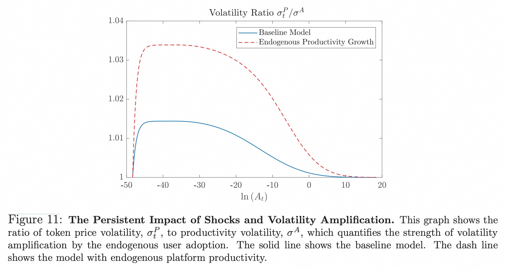

## AI论文解读 | TOKENOMICS: DYNAMIC ADOPTION AND VALUATION
        
### 作者        
digoal        
        
### 日期        
2025-08-26       
        
### 标签        
PostgreSQL , PolarDB , DuckDB , AI , 论文解读        
        
----        
        
## 背景  
      
https://www.nber.org/system/files/working_papers/w27222/w27222.pdf        
  
提示:          
```          
读懂《TOKENOMICS: DYNAMIC ADOPTION AND VALUATION》这篇论文需要提前掌握哪些基础知识, 请使用中文通熟易懂的讲解这些基础知识, 可以引用论文中的图、表或使用Markdown支持的图形(text,mermaid等)增加解释性. 
  
使用中文通熟易懂的解读《TOKENOMICS: DYNAMIC ADOPTION AND VALUATION》这篇论文, 其中的关键内容请着重讲解, 可以引用论文中的图、表或使用Markdown支持的图形(text,mermaid等)增加解释性. 
  
提取《TOKENOMICS: DYNAMIC ADOPTION AND VALUATION》这篇论文中的重要术语, 使用中文对这些术语进行通熟易懂的讲解, 可以引用论文中的图、表或使用Markdown支持的图形(text,mermaid等)增加解释性. 
```     
  
## 1 前置知识 
  
好的，为了帮助您更好地理解《TOKENOMICS：DYNAMIC ADOPTION AND VALUATION》这篇论文，我将为您梳理阅读前需要掌握的一些核心基础知识。这篇论文融合了金融经济学、平台经济学和一些数学工具，我会用通俗易懂的语言，并结合论文中的图表来进行解释。

### 核心基础知识概览

您可以将理解这篇论文想象成搭建一座知识大厦，地基主要由以下几个部分构成：


下面我们逐一分解这些概念。

### 1\. 经济学与金融学基础

#### **动态资产定价 (Dynamic Asset-Pricing)**

传统上，我们给股票或债券估值，是通过预测它们未来能产生的现金流（如股息、利息），然后用一个折现率把这些未来的钱折算成今天的价值 。

但这套方法不适用于很多加密货币或平台通证（Token），因为它们本身不产生现金流 。这篇论文的核心观点是，**通证的价值来源于它在平台上的“交易需求”或“使用价值”** 。

  * **核心思想**: 一个资产的价值不是静态的，而是随着时间动态变化的。你需要建立一个模型来描述这个价值是如何随着关键因素（比如用户数量、平台技术水平）的变化而演变的。
  * **论文应用**: 论文建立了一个动态模型，认为通证的价值主要由两个内生变量决定：**平台的用户数量 (User Base)** 和 **通证价格 (Token Price)** 。这两个变量相互影响，共同演进。

#### **持有成本 (Carry Cost)**

持有成本是指为了持有一个资产而放弃的潜在收益。

  * **简单例子**: 假设你手上有100元现金。你可以把它存银行获得年化3%的利息。如果你选择把这100元现金放在钱包里，你就放弃了这3元的利息。这3元就是你持有现金的“持有成本”。
  * **论文应用**:
      * **无通证平台 (Tokenless Economy)**: 用户如果想在平台上交易，必须持有“一般消费品”（Numeraire good，可以理解为“钱”）。持有这些“钱”的成本，就是放弃了将其投资于其他金融资产所能获得的无风险回报（论文中用 $r$ 表示） 。
      * **有通证平台 (Tokenized Economy)**: 用户持有的是平台通证。持有成本变成了 $(r - \\mu\_{P\_t})dt$ 。这里的 $\\mu\_{P\_t}$ 是通证价格的预期增长率。如果大家预期通证会升值 ($\\mu\_{P\_t} \> 0$)，那么持有它的成本就降低了，因为它本身的升值部分抵消了机会成本 。这正是论文论证通证能“加速用户采纳”的关键机制 。

#### **戈登增长模型 (Gordon Growth Model)**

这是一个给持续增长的资产（如股票）估值的经典公式。

  * **公式**: $P = \\frac{D\_1}{r - g}$
      * $P$ 是资产现价
      * $D\_1$ 是下一期的股息
      * $r$ 是折现率
      * $g$ 是股息的永久增长率
  * **论文应用**: 当平台发展成熟，所有潜在用户都已加入（即“完全采纳”）后，通证的价值就可以用一个类似戈登增长模型的公式来描述（见论文公式36） 。此时，通证的价值取决于平台总的交易需求、通证供应量以及平台的长期增长预期。

### 2\. 平台与网络经济学

#### **网络外部性 (Network Externality)**

网络外部性也叫网络效应，指的是一个产品或服务的价值随着用户数量的增加而增加 。

  * **经典例子**: 电话。如果全世界只有一个人有电话，那这部电话就毫无价值。用的人越多，电话网络的价值就越大。社交网络、电商平台也是如此。
  * **论文应用**: 论文明确指出，平台的用户基础 (user base, $N\_t$) 越大，网络效应就越强，每个用户在平台上进行交易的效用就越高 。这形成了一个正向反馈循环：
    > 更多用户 → 平台价值更高 → 吸引更多新用户 → ...

这个机制是驱动平台增长的核心动力。

#### **S型采纳曲线 (S-Curve of Adoption)**

这是一种描述新技术或新产品被市场接受过程的典型模式。

  * **曲线特征**:

    1.  **启动期 (Slow Start)**: 早期只有少数创新者和早期采纳者使用，增长缓慢。
    2.  **加速期 (Rapid Growth)**: 随着网络效应显现和信息扩散，用户数量开始爆发式增长。
    3.  **成熟期 (Tapering Off)**: 市场趋于饱和，潜在用户基本都被吸收，增长速度放缓并最终趋于平稳。

  * **论文应用**: 论文通过模型推导出，在通证化经济中，平台的用户增长曲线完美地呈现出一个“S”型（见下方论文图2） 。    

      * **横轴 `ln(At)`**: 平台生产力（可以理解为技术、功能、生态等的综合实力）的对数。
      * **纵轴 `Nt`**: 标准化的用户数量（0到1之间）。
      * **蓝色实线**: 代表有通证的平台，其用户增长轨迹呈现出典型的S型。
      * **红色虚线**: 代表没有通证的平台，虽然也是S型，但增长速度明显慢于有通证的平台。
  
## 2 解读论文 
  
好的，这篇NBER的工作论文《TOKENOMICS: DYNAMIC ADOPTION AND VALUATION》是该领域的经典之作。它首次为平台通证（Token）建立了一个基于经济学基本原理的动态估值和用户采纳模型。下面我将用通俗易懂的方式为您解读其核心内容。

### **核心思想一句话总结**

这篇论文的核心观点是：**平台通证的价值并非来自未来的现金流（像股票），而是源于其在平台上的交易功能和网络效应 。通证通过“资本化”平台未来的增长预期，降低了用户的交易成本，从而加速了用户采纳，并稳定了用户基础 。**

-----

### **1. 论文解决了什么核心问题？**

在2020年之前，很多人对加密货币的价值来源感到困惑，出现了“郁金香泡沫”、“没有内在价值”等批评声音。传统的金融估值模型（如现金流折现）无法应用于这些不产生现金流的资产 。

这篇论文的目标就是**为平台类通证（如Filecoin的FIL，BAT等）提供一个基于基本面的动态估值框架** 。它试图回答两个核心问题：

  * 一个平台的通证价值从何而来？
  * 引入通证机制，对平台本身（尤其是用户增长）有什么影响？

### **2. 模型的两大基石：网络效应与动态决策**

为了回答上述问题，作者构建了一个动态模型，其核心设定非常巧妙：

  * **用户异质性 (User Heterogeneity)**: 平台上有各种各样的潜在用户，他们对于使用平台进行交易的需求是不同的（模型中用 $u\_i$ 表示） 。
  * **网络外部性 (Network Externality)**: 平台上的用户越多（用户基础 $N\_t$ 越大），平台的价值就越大，每个用户能获得的交易效用也越高 。这就像微信一样，用的人越多，对每个人就越有用。
  * **动态权衡 (Dynamic Trade-off)**: 用户在任何时刻都在做决策：**要不要加入平台？** 加入的好处是获得交易效用，但成本是需要支付一个参与成本，并且持有用于交易的媒介会产生机会成本 。

### **3. 关键机制：通证如何降低用户的“持有成本”**

这是理解整篇论文的钥匙。首先，我们需要理解什么是**持有成本 (Carry Cost)**。

无论是在有通证还是无通证的平台上交易，用户都需要持有某种交易媒介。持有这种媒介的机会成本就是“持有成本”。

  * **无通证平台 (Tokenless Economy)**: 用户直接使用“货币”（模型中称为一般等价物）交易。持有这些货币，就等于放弃了将这些钱投资于其他金融资产所能获得的无风险收益 $r$ 。因此，持有成本就是 $r$。
  * **有通证平台 (Tokenized Economy)**: 用户必须持有平台的通证进行交易。这时，用户的机会成本不仅是无风险收益 $r$，还要考虑通证本身价格的变化。如果用户预期未来通证会升值（预期价格增长率为 $\\mu\_{P\_t}$），那么这个升值的部分就可以抵消一部分机会成本 。因此，**有效的持有成本变成了 $(r - \\mu\_{P\_t})$** 。

这个机制形成了一个强大的正向反馈循环，论文的图1很好地展示了这一点：   


**简而言之，通证将平台未来的增长潜力（未来会有更多用户）提前反映在了当前的价格预期上，这种升值预期反过来降低了当前用户的进入门槛，从而真正地加速了增长 。**

### **4. 论文的两大核心发现**

基于上述机制，论文得出了两个非常重要的结论：

#### **发现一：通证能“加速”并“稳定”用户增长**

1.  **加速用户采纳 (Faster Adoption)**:
    由于有效持有成本降低，有通证的平台比没有通证的平台能更快地吸引用户。论文的图2直观地展示了这一点：   

      * **蓝色实线 (Tokenized)**: 代表有通证的平台，其用户增长曲线（S型曲线）更为陡峭，意味着在相同的平台生产力 `ln(At)` 水平下，它能达到更高的用户采-纳率 `Nt` 。
      * **红色虚线 (Tokenless)**: 代表无通证的平台，增长相对缓慢 。
      * **灰色散点**: 是作者用来校准模型的真实世界数据 。

    **这张图清晰地表明，引入通证机制确实能“助推”平台的冷启动和成长。**

2.  **稳定用户基础 (More Stable User Base)**:
    通证价格预期还能起到“减震器”的作用，降低用户基础的波动性 。

      * **当平台遭遇负面冲击时**（如技术故障导致生产力 $A\_t$ 下降），短期内用户会减少。但用户基础的减少意味着未来增长的潜力变大了，这会**提高**通证未来的升值预期 $\\mu\_{P\_t}$，从而降低持有成本，部分抵消负面冲击，抑制用户流失 。
      * **当平台迎来正面冲击时**，用户激增，未来增长潜力减小，这会**降低**通证的升值预期，增加持有成本，防止用户增长过热 。

    论文的图3A显示，在任何用户采纳阶段（横轴为 $N\_t$），有通证的平台（蓝色实线）其用户基础的波动率（ $\\sigma\_{N\_t}$ ）都低于无通证的平台（红色虚线） 。    

#### **发现二：内生性用户采纳是理解通证价格动态的关键**

论文指出，必须将用户采纳作为模型内生的变量，才能解释通证价格的几个重要特征：

1.  **价格的非线性增长**: 论文图4显示，通证价格（`ln(Pt)`）与用户基础（`Nt`）之间不是简单的线性关系 。在用户采纳的早期和晚期，即使用户增长缓慢，价格也可能出现快速上涨 。这解释了为什么处于不同发展阶段的平台，其市值差异会非常巨大 。    

2.  **“超额波动”的来源 (Excess Volatility)**: 网络效应会放大平台基本面冲击对价格的影响 。一个小的利好消息，可能因为引发了用户增长的预期，从而被网络效应放大，导致价格出现远超基本面变化的剧烈波动 。

3.  **“泡沫化”价格行为 (Bubbly Price Dynamics)**: 如果考虑到平台的系统性风险会随着用户基础扩大而增加（即越是主流，和宏观经济联系越紧密），模型可以自然地生成价格先大幅上涨，然后回落并稳定的“类泡沫”路径 。

### **5. 结论与启示**

《TOKENOMICS》这篇论文为通证经济提供了一个坚实的理论基础。它的主要贡献在于：

  * **提供了一个基本面估值框架**: 明确了通证价值的核心来源是其**使用价值**和**网络效应**。
  * **阐明了通证的核心经济功能**: 通证是一种**激励机制**，通过资本化未来增长，有效降低早期用户的进入成本，解决了平台经济中普遍存在的“冷启动”难题 。
  * **解释了通证市场的独特性**: 将用户采纳的动态过程与资产定价相结合，为理解通证价格的高波动性和非线性动态提供了合理的经济学解释 。

总而言之，这篇论文告诉我们，一个设计良好的通证模型不仅仅是一种融资工具，更是一种内嵌在平台中的、能够自我驱动增长的经济引擎。
  
## 3 术语 
  
好的，我已经阅读了您提供的《TOKENOMICS: DYNAMIC ADOPTION AND VALUATION》这篇论文。以下是其中几个重要术语的中文解释，并引用了论文中的概念和图表进行说明。

-----

### **1. 代币经济学 (Tokenomics)**

代币经济学是论文的核心主题。这篇论文提出了一种动态资产定价模型，用于分析加密代币的价值。与传统的通过现金流折现来估值金融资产不同，代币的价值源于其在数字平台上的应用，即通过聚合异质性用户的交易需求来确定其均衡价值 。

简而言之，代币的价值不是因为它能产生利息或股息，而是因为它在特定的数字平台或网络中具有实用性，例如用于支付或获取服务。

-----

### **2. 内生性平台采用 (Endogenous Platform Adoption)**

内生性平台采用是指平台用户数量（用户基础）的增长过程。该模型认为，平台的采用并非是外力推动的，而是由其内部因素（如用户需求和代币价格）决定的 。

这一过程通常呈现出**S形曲线**的特征：

  * **初期**：用户增长缓慢。
  * **中期**：增长加速且波动性增强。
  * **后期**：增长最终放缓，趋于饱和。

论文中的图2展示了这种S形曲线，并将其与没有代币的平台的采用曲线进行了比较 。    

以下是一个基于论文概念的S形采用曲线的文本示意图：

```
       用户数量 (Nt)
       |
100% - |---------\----------
       |          \
       |           \
       |            |
       |            |
 0%  - |--------------\-------
       |_______________________
           平台生产力 (At)
```

-----

### **3. 用户网络外部性 (User Network Externality)**

这是代币经济学模型中的一个关键特征。网络外部性是指一个产品的价值随着使用该产品的人数增加而增加的现象 。

在论文中，平台的用户网络外部性体现为：

  * **用户越多**，任何单个用户就越容易找到交易对手。
  * **代币的实用性**随之增强。
  * 这形成了一个正向的反馈循环，即用户越多，代币越有用，从而吸引更多用户加入 。

-----

### **4. 持有成本 (Carry Cost)**

持有成本是指持有代币或货币而不是将其投资于金融资产所放弃的收益，即机会成本 。

论文的一个关键观点是，引入代币可以有效降低用户的持有成本 。这是因为：

  * 用户持有代币进行交易时，虽然放弃了金融资产的收益，但如果他们预期代币价格会升值，这种升值预期会抵消一部分机会成本 。
  * 这种预期升值（ $\\mu\_{P,t}$ ) 降低了有效持有成本，从而鼓励用户更早地加入平台 。

-----

### **5. 波动性放大 (Volatility Amplification)**

论文指出，内生的用户采用会放大平台生产力冲击对代币价格的影响，从而产生“超额波动性” 。

这是平台经济学中一种独特的内生性风险 。例如，当平台生产力出现正向冲击时，它会直接增加代币的效用，进而吸引更多用户加入。用户数量的增加会进一步提高代币的价值，这种反馈效应放大了最初冲击对代币价格的影响 。

论文中的图11展示了代币价格的波动性（ $\\sigma\_{P,t}$ ）与平台生产力波动性（ $\\sigma\_A$ ）的比率通常大于1，说明了内生性采用确实会放大波动性 。当平台达到完全采用时，这种内生性风险会消失 。    
  
## 参考        
         
https://www.nber.org/system/files/working_papers/w27222/w27222.pdf    
        
<b> 以上内容基于DeepSeek、Qwen、Gemini及诸多AI生成, 轻微人工调整, 感谢杭州深度求索人工智能、阿里云、Google等公司. </b>        
        
<b> AI 生成的内容请自行辨别正确性, 当然也多了些许踩坑的乐趣, 毕竟冒险是每个男人的天性.  </b>        
  
  
#### [期望 PostgreSQL|开源PolarDB 增加什么功能?](https://github.com/digoal/blog/issues/76 "269ac3d1c492e938c0191101c7238216")
  
  
#### [PolarDB 开源数据库](https://openpolardb.com/home "57258f76c37864c6e6d23383d05714ea")
  
  
#### [PolarDB 学习图谱](https://www.aliyun.com/database/openpolardb/activity "8642f60e04ed0c814bf9cb9677976bd4")
  
  
#### [PostgreSQL 解决方案集合](../201706/20170601_02.md "40cff096e9ed7122c512b35d8561d9c8")
  
  
#### [德哥 / digoal's Github - 公益是一辈子的事.](https://github.com/digoal/blog/blob/master/README.md "22709685feb7cab07d30f30387f0a9ae")
  
  
#### [About 德哥](https://github.com/digoal/blog/blob/master/me/readme.md "a37735981e7704886ffd590565582dd0")
  
  

  
