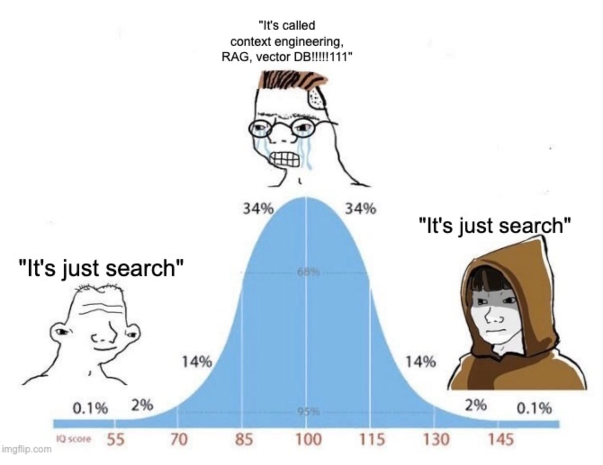
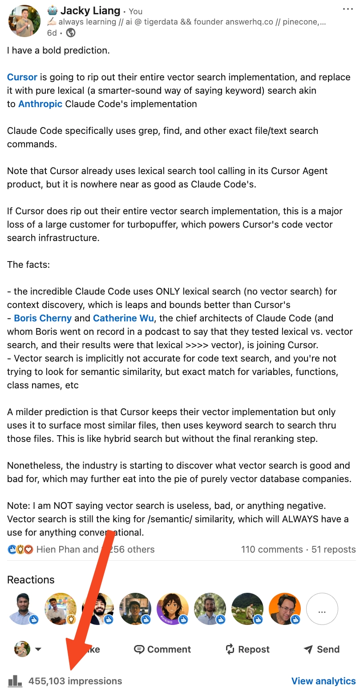
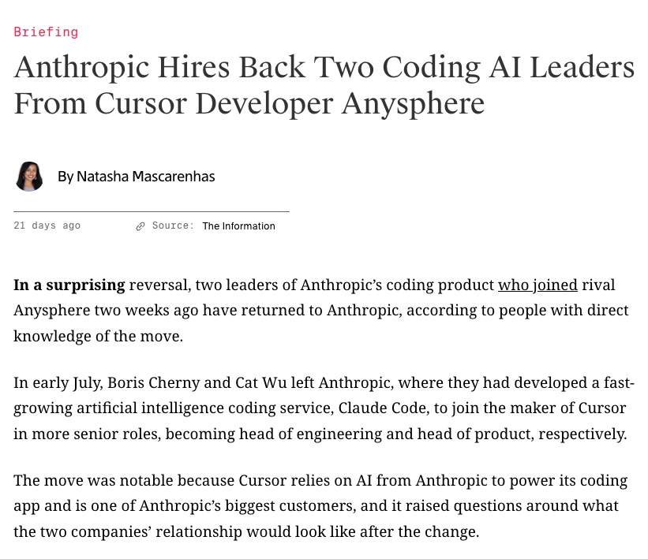
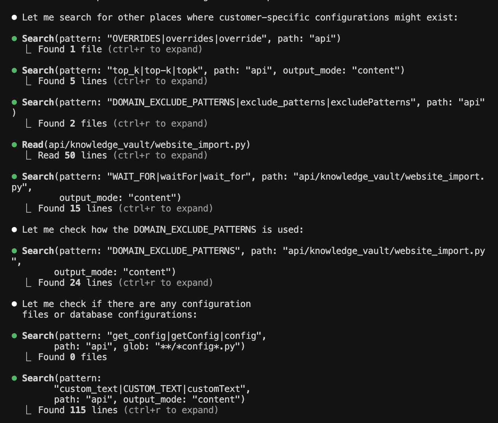
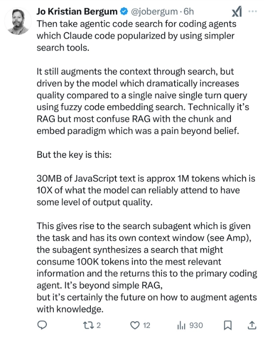

## AI搜索“不等于”向量搜索, 那么答案究竟是什么?   
          
### 作者          
digoal          
          
### 日期          
2025-08-26         
          
### 标签          
PostgreSQL , PolarDB , DuckDB , AI , 搜索 , 向量搜索 , 混合搜索 , rerank , 重排 , 相似性不等于相关性         
          
----          
          
## 背景    
AI 代理(智能体)在执行任务的过程中可能需要进行多轮次搜索，获取完成任务所需的辅助资料。  
  
例如gemini 2.5 flash提供的deep research功能, 在给其下达任务后, 首先可能会通过gemini 2.5 pro推理模型生成任务步骤, 然后由gemini 2.5 flash执行各个步骤的子任务. 由于模型参数量以及训练素材的局限性, 每一步都可能涉及大量参考资料的搜索, 以完成该步骤的任务.  (Qwen里也有一个类似功能叫“深入研究”).   
  
和给人类下达任务一样, 搜索可能不是一次完成的, 例如我们在google搜索素材时, 通常还需要根据自己的意图自行分别是否为想要的网页, 甚至可能要点开网页进去查看是否能满足意图需求.   
  
都不用说google搜索这么大的资料库, 就算是我自己写的blog(目前有5000多篇, 所有内容可在 https://github.com/digoal/blog 查看), 如果有人问我问题, 去blog库里搜相关文章的话, 我都不敢打包票能一次搜到所有相关blog.   
  
AI 代理(智能体)也是这样的, 一个任务可能会搜索出很多相关资料, 然后根据当前步骤的意图进行筛选, 从中找到覆盖所有问题点要素的资料, 并过滤掉不需要的“噪音”资料.   
  
前面的过程看起来很简单, 但是AI搜索到底是怎么搜的呢?   
  
提起AI搜索大家第一时间想到的就是向量（语义）搜索，但经过大量用户实践发现向量搜索(语义搜索)已经无法满足AI代理(智能体)的诉求，那么“AI搜索”到底路在何方？  
  
<b>多轮搜索 + 混合搜索(向量+模糊搜索+分词搜索+精确搜索等) + 重排?</b>    
  
应该是目前比较合理的解决方案.  
  
下面来看几篇翻译文章, 里面提到了一些“AI智能体”供应商的行为, 从这些供应商的行为侧面反映出向量搜索(语义搜索)已经无法满足AI代理(智能体)的诉求.   
  
同时这些文章也提到了一些解决方案, 与上面的结论一致.   
  
我在早些时间也分享过一些RAG搜索相关的实践文章(里面提到AI搜索召回的评分标准以及改进方法等), 参考文末文章.    
  
接下来的一、二章节翻译自:  
  
https://www.tigerdata.com/blog/vector-search-isnt-the-answer-to-everything-so-what-is-a-technical-deep-dive  
  
https://www.tigerdata.com/blog/why-cursor-is-about-to-ditch-vector-search-and-you-should-too  
  
## 一、为什么 Cursor 即将放弃向量搜索  
  
每次关于 AI 和 LLM 应用的讨论最终都会落到相同的流行语上：检索增强生成 (RAG)、向量数据库、上下文工程（又一个新术语！）、提示工程（显然现在已经出现了？）等等。   
  
每隔几个月，我们就会出现一些新词，而之前的词语就会变得过时。   
  
剥去 VC-认可的、Twitter-140-字符友好的术语，你会发现下面有些更简单的东西……   
  
AI 只是搜索。   
  
就是这样。   
  
不幸的是，科技行业沉迷于向量数据库，以为它们能解决所有问题。在2023年向量数据库投资达到顶峰两年后，各大公司逐渐认识到`相似性 != 相关性`，而有时，传统的词汇搜索反而会破坏语义相似性。   
  
构建编码代理？客服聊天机器人？电商搜索？不同的问题需要不同的搜索技术。   
  
Claude Code 蚕食 Cursor 的市场份额是有原因的，他们甚至聘请了 Claude Code 团队 —— 这一切都是为了寻找合适的人才。   
  
    
  
### 为什么LLM需要搜索   
在我们探讨为什么AI仅仅是搜索之前，我们需要首先了解一下为什么AI和LLM需要搜索的历史。   
  
大型语言模型的训练截止日期为某个特定日期，该日期称为截止日期，这意味着它们的训练数据不包含该时间点之后的信息。即使是像 Claude Sonnet 4 这样最新发布的模型，其截止日期也是 2025 年 3 月。  
  
先不说截止日期，如果你想问一个LLM  
- 今天的天气怎么样？  
- 你的公司是如何赢得最近这笔交易的（数据在 Slack 和 Salesforce 上，而不是公开的）？  
- 为什么 Timescale改名为 TigerData？  
  
这些问题要么需要最新数据、要么需要非公开数据, 所以您现在解决问题需要外部数据。   
  
具有向量搜索的检索增强生成 (RAG) 已经成为向 LLM 添加外部数据的默认方法，这些 LLM 无法隐式访问某个点的数据或不属于其训练一部分的私有/专有数据。   
  
### 为什么向量成为AI搜索的代名词  
向量搜索通过查找与问题语义最相似的信息来解决这个“信息不足”的问题。   
  
显然，就像所有好的炒作周期一样，业界也纷纷效仿，因为它听起来很酷，而且是AI原生的。像Pinecone（顺便说一下，我曾经在这里工作过）、Weaviate、Qdrant这样的公司都乘着这股AI浪潮，在2023年末进行了巨额融资，因为人们相信`向量搜索可以处理任何工作负载`。   
  
向量搜索和向量数据库已成为解决所有外部 AI 数据问题的首选方案。像Voyage AI这样的embedding模型提供商也顺应了这股潮流，因为您需要embedding模型将文本转换为其语义的数学表示（向量）。   
  
所以现在，整个科技行业都认为`AI应用=向量数据库`。每个AI应用都需要一个向量数据库。   
  
### 相似性 != 相关性  
两年后的2025年，向量数据库公司的前景看起来……很艰难。我亲身经历过这样的低迷时期。    
  
原因很简单……   
  
事实证明，向量数据库并非万能的解决方案。业界最终发现了向量数据库的`使用/实施/维护`存在固有的局限性和弊端。  
  
向量搜索会给出“最相似”的内容，但不一定能给出“最相关”的内容。这在`编码`或任何需要`特异性`的用例中尤其令人头疼。   
  
### 并非所有文本都具有语义   
编码时，如果要搜索`getUserById`，则需要精确匹配函数名称。`getUserById`是一个标识符，而不是一个概念 —— 但向量搜索可能会返回`findUserByEmail`、`updateUserProfile`或`deleteUserAccount` ，因为它们在语义上相似。对于对话用例来说足够接近；但对于代码来说完全错误。  
  
在客户支持中，当你需要零件“P/N 4B0-959-855-A”的手册时，你需要的就是这份文档。“P/N 4B0-959-855-A”是一个参考编号，而不是有意义的文本 —— 但向量搜索会给出语义上最相似的 10 个零件编号，例如“4B0-959-855-B”或“4B0-959-856-A”，这在你尝试修理一台坏掉的机器时毫无用处。  
  
对于电商平台，搜索 Nike SKU “DQ4312-101”应该首先返回该商品。“DQ4312-101”是商品代码，而非描述性内容 —— 但向量搜索可能会显示“DQ4312-102”（错误的配色）或“DQ4311-101”（完全不同的鞋子），因为它们的编号相似。如果你发错了鞋子，代价高昂，甚至会造成1000倍的损失。  
  
在 Spotify 上搜索“Dark Side of the Moon”时，您想要的是精确的 Pink Floyd 专辑，而不是类似的歌曲名称，例如 Kelly Clarkson 的“Dark Side”或 Echo & the Bunnymen 的“The Killing Moon”。   
  
> 向量搜索不适用于语义相似性不相关的文本  
  
## 为什么 Claude Code 会战胜 Cursor  
  
Claude Code 在搜索相关上下文（例如，这个函数在哪里定义？哪些文件导入了这个模块？这个 API 端点是如何实现的？）时使用纯词汇搜索（关键字匹配）而不是向量搜索，结果不言而喻。   
  
作为一个用了 12 个月 Cursor 的人（感谢Zack Proser介绍我使用它），也是Cursor 的铁杆粉丝之一，并且发誓 AI 编程已经无可挑剔了 —— 我这周取消了 Cursor 的订阅。我真没想到我会这么做。   
  
但是…… Claude Code 要好得多。  
  
  
  
使用 Cursor 时，你需要不断手动使用 `@` 符号标记文件，因为它通常无法自行找到正确的上下文。你需要非常了解你的代码库，才能帮助 AI 理解哪些内容是相关的。   
  
人们喜爱 Claude Code 的一个重要原因是它能自动找到正确的文件，无需手动标记一堆文件夹和文件。对于大型代码库或新手来说，这种体验尤其美妙。   
  
### 50年历史的小工具(例如grep)永不过时  
在Claude Code中的Claude Sonnet 4 和 Opus 绝不会使用猜测(语义)。   
  
他们使用已有 50 年历史的`grep` 实用程序以精确如外科手术般的方式进行搜索。   
  
例如 —— 需要使用hook来查找 React 组件吗？  
```  
grep -r "useState\|useEffect" --include="*.jsx" --include="*.tsx"  
```  
  
需要导入特定模块的文件吗？  
```  
grep -r "import.*react-router" --include="*.js"  
```  
  
Claude Code 在词汇搜索实现方面更进一步。   
  
Claude 会持续搜索匹配项（又称代理搜索, AI Agent搜索不断重复迭代直到 完成目标或无法完成目标 为止; https://cohere.com/blog/ai-retrieval-graphrag-and-agentic-search ），直到找到所需内容，或者排除不存在此类依赖项或函数。只有这样，它才会编写代码，因为它知道/你还没有在其他地方写过类似的代码 —— 从而避免了意大利面条式代码和冗余实现，而这正是 Cursor 的agent经常遇到的问题。   
  
<b> 对于编码来说，`相似性 != 相关性`。相似性是模糊的；相关性是精确的。</b>  
  
注意：对编码代理的代理搜索并不是什么新鲜事, 但我认为 Claude Code 完善了它。  
  
相关阅读  
- https://pashpashpash.substack.com/p/why-i-no-longer-recommend-rag-for  
- https://x.com/pashmerepat/status/1926717705660375463  
- https://cline.bot/blog/why-cline-doesnt-index-your-codebase-and-why-thats-a-good-thing  
  
### 看看Cursor团队的举动  
有证据表明，Cursor 的团队绝对同意 Claude Code 更胜一筹，因为他们确实聘请了 Claude Code 的两位负责人Boris Cherny 和 Cat Wu 于 2025 年 7 月加入他们。   
  
唔…   
  
我曾预测Cursor可能会完全放弃对代码进行向量搜索（他们目前使用 turbopuffer 作为向量数据库），而完全使用词汇搜索。后来在 LinkedIn 上获得了 450,000 次展示，我认为这个预测可能并没有那么离谱。  
  
  
  
### 那么我们应该从中得到什么呢？  
“好吧，杰基，”你可能会说，“这一切都是有道理的，但这对我和我的产品有什么帮助呢？”  
  
好问题！  
  
如果您阅读本文后应该获得一些收获，例如：   
  
AI 就是搜索 —— 不要默认“AI/RAG = 向量数据库”。不要想当然地认为每个 AI 应用都需要向量数据库。有时，一个简单的关键词搜索，甚至一个基本的数据库查询，就足以满足你的需求。  
  
思考要完成的任务，然后选择合适的搜索技术。  
- 构建代码助手？使用像 Claude Code 这样的词汇搜索。  
- 构建需要理解意图的客服聊天机器人？向量搜索或许是完美的选择。  
- 构建电商搜索？你可能两者都需要。  
  
不同的问题需要不同的工具：精确匹配 vs. 语义相似度。  
- 当用户搜索“iPhone 16 Pro Max 256GB 深空黑”时，他们想要的是完全匹配的产品，而不是语义相似的手机。  
- 当他们问“如何重置密码”时，语义相似度有助于找到相关的帮助文章。  
  
行业正在发展 —— 不再存在一刀切的解决方案。最聪明的公司已经超越了纯向量搜索。Pinecone 拥有级联检索，Turbopuffer 拥有混合搜索，Elasticsearch 拥有互惠排序融合，而Snowflake Cortex则融合了多种搜索技术。  
  
事实是这样的 —— 大多数现实世界的人工智能应用程序实际上需要词汇和向量方法的协同工作。   
  
这就是所谓的混合搜索，也是行业的发展方向。   
  
## 二、向量(语义)搜索并非万能答案。那么，究竟是什么？  
  
在上一章(上面这篇文章)，我指出人工智能行业对向量搜索的痴迷是错误的。Claude Code 对于 Cursor 的成功证明了，在某些情况下，词汇搜索会战胜语义相似性。  
  
反响非常强烈。   
  
上面这篇文章 800,000 次展示、2,000 次点赞、数百条评论，显然还有与 Cursor 和专用向量数据库公司的一些不愉快的对话！   
  
### 突发新闻：Claude Code 团队回归  
  
我们之前说过，人工智能领域发展很快，但我并不确定它到底有多快。   
  
嗯，我发表这篇文章一周后，Cursor 聘请的 Claude Code 负责人 Boris Cherny 和 Cat Wu 回到了 Anthropic。他们在 Cursor 待了整整两周，然后又回来继续 Claude Code 的开发。   
  
<b> 没错, 只待了两周。 </b>   
  
  
  
人工智能人才争夺战愈演愈烈。来源：[The Information](https://www.theinformation.com/briefings/anthropic-hires-back-two-coding-ai-leaders-cursor-developer-anysphere?rc=7br7st)  
  
他们在 Cursor 看到了什么让他们转过头来？  
  
抛开行业八卦，以下是我从我的热门帖子(上面这篇文章)的所有讨论中了解到的信息：每个人都同意向量搜索并不完美，但并不是每个人都知道正确的解决方案是什么。    
  
### 相似性 != 相关性   
  
我想澄清一些事情 —— 在上一篇文章中，我并没有声称向量搜索或数据库不好。  
  
问题不在于工具，而在于使用错误的工具来完成错误的工作。   
  
我们一直将任何单一的搜索技术视为灵丹妙药。   
  
以下是在生产中构建 AI 系统时实际发生的情况：  
  
您的 AI 代码代理需要查找 `getUserById`。向量搜索会返回 10 个与 `getUserByName`、`getUserByEmail`、`updateUserById` 等类似的结果，因为它们在语义上相似。您确实需要 `getUserById`，但向量搜索会返回与 `getUserById` 最相似的 10 个结果。   
  
您需要精确的，但您得到的却是最相似的。   
  
您的用户会感到沮丧，因为人工智能“不理解”准确性。   
  
你的 AI 客服被问及“iPhone 15 Pro Max 256GB 深空黑”。向量搜索也返回“iPhone 15 Pro 128GB 深空黑”，因为它们的embedding值几乎完全相同(语义相似)。   
  
您的用户会感到沮丧，因为人工智能“不理解”准确性。   
  
您的 AI 电商搜索结果为 SKU“DQ4312-101”的数据时。由于数字相似，向量搜索返回“DQ4312-102”和“DQ4311-101”。  
  
您的用户会感到沮丧，因为人工智能“不理解”准确性。   
  
你知道我的意思吗？   
  
TigerData 采访过的每个 AI 团队最终都会遇到这样的障碍：向量搜索可以给出相似性，但事实证明，用户实际上需要的是相关性。   
  
### 混合搜索+重新排名是解决方案   
最有意义的答案是混合搜索和重新排名(rerank)。   
  
工作原理如下：  
- 使用多种搜索技术 —— 关键词、语义、向量搜索等，来查找可能相关的内容  
- 根据相关性重新排序 - 使用重新排序(rerank)来显示真正有用的内容  
  
“上下文工程”这个术语最近在人工智能领域越来越流行（稍后会详细介绍），我们认为混合搜索+重新排名是为 LLM 提供足够的高相关性上下文（不多不少）的自然实现。   
  
让我们向您展示如何构建它并将其合并到您的生产应用程序中。   
  
### 数据集  
我们将使用[CNN-DailyMail 数据集](https://huggingface.co/datasets/abisee/cnn_dailymail)，其中包含超过 30 万篇独特的英文新闻文章。该数据集最初设计用于机器阅读理解和摘要，但它也非常适合展示混合搜索，因为新闻文章既包含需要精确匹配的精确术语（名称、日期、地点），也包含有利于相似性搜索的语义概念（主题、题材、相关事件）。  
  
数据集有三列：  
  
Field	| 描述  
---|---  
id	|源 URL 的十六进制 SHA1 哈希值  
article	|新闻文章全文  
highlights	|作者撰写的文章摘要  
  
数据集包含三个字段：`id`、`article` 和 `highlights`；我们只关注 `article` 字段。为了简洁起见，我们仅使用 1,000 篇文章。   
```  
from datasets import load_dataset  
# Load the CNN-DailyMail dataset from Hugging Face  
dataset = load_dataset("cnn_dailymail", "3.0.0")  
content = dataset["train"]  
# Select a random subset of 1,000 articles  
content = content.shuffle(seed=42).select(range(0, 1000))  
print(f"Dataset size: {len(content)} articles")  
print(f"Sample article preview: {content[0]['article'][:200]}...")  
```  
  
新闻文章通常包含以下内容，这使得它们非常适合演示混合搜索：  
- 命名实体（人物、地点、组织） —— 需要精确匹配  
- 复杂主题 —— 受益于语义理解  
- 多样化的写作风格 —— 挑战不同的搜索方法  
- 包含缩写、参考和上下文的真实世界语言  
  
### 使用 PostgreSQL 和 pgvector 构建混合搜索引擎  
  
我们将创建一个混合搜索引擎，将`精确匹配`、`全文搜索`和`向量搜索`与`重新排名(rerank)`相结合。  
  
有关完整的设置、安装和实施说明，请阅读我们关于[使用 pgvector 和 Cohere 构建 PostgreSQL 混合搜索](https://www.tigerdata.com/blog/postgresql-hybrid-search-using-pgvector-and-cohere)的文章。我们将在本文中分享其中的亮点。   
  
#### 安装和数据导入  
首先，让我们准备好环境。你需要以下库：   
```  
pip install psycopg2-binary pgvector openai cohere numpy  
```  
  
```  
import psycopg2  
from openai import OpenAI  
import cohere  
import numpy as np  
import json  
from typing import List, Dict, Any  
```  
  
设置您的 API 客户端（确保您从每个相应的服务中获取相关的设置密钥和字符串）：  
```  
# Initialize clients  
openai_client = OpenAI(api_key="your-openai-key")  
cohere_client = cohere.Client("your-cohere-key")  
  
# Database connection  
conn = psycopg2.connect("your-postgres-connection-string")  
```  
  
#### 数据库部署  
让我们在[Tiger Cloud](https://console.cloud.timescale.com/) （一个为 AI 应用量身定制的云 PostgreSQL 平台）上创建一个 PostgreSQL 表，用于存储包含文本内容和向量嵌入的新闻文章，以及混合搜索所需的索引。  
  
    
  
Tiger Cloud 入门超级简单 —— 我们还提供 30 天免费试用。来源：[Tiger Cloud 文档](https://docs.tigerdata.com/getting-started/latest/services/#create-your-timescale-account)  
  
首先，请注册，创建一个新的数据库，然后按照提供的说明进行操作。有关如何创建 Tiger Cloud 数据库的更多详细信息，请参阅本[指南](https://docs.tigerdata.com/getting-started/latest/services/#create-your-timescale-account)。   
```  
-- Enable extensions  
CREATE EXTENSION IF NOT EXISTS vector;  
  
-- Create table for our news articles  
CREATE TABLE documents (  
    id BIGINT PRIMARY KEY GENERATED BY DEFAULT AS IDENTITY,  
    contents TEXT,  
    embedding VECTOR(1024)  -- Cohere embed-english-v3.0 dimensions  
);  
  
-- Create indexes for performance  
CREATE INDEX ON documents USING GIN (to_tsvector('english', contents));  
CREATE INDEX ON documents USING ivfflat (embedding vector_cosine_ops);  
```  
  
#### 加载数据, 生成embedding  
让我们加载 1,000 篇文章，使用 Cohere 的模型生成embedding，并通过单个批处理操作将文本和向量表示插入到数据库中。  
```  
import cohere  
import psycopg2  
import itertools  
from datasets import load_dataset  
  
# Initialize Cohere client  
co = cohere.Client('your-cohere-api-key')  
model = "embed-english-v3.0"  
  
# Load and prepare dataset  
dataset = load_dataset("cnn_dailymail", "3.0.0")  
content = dataset["train"].shuffle(seed=42).select(range(0, 1000))  
  
# Generate embeddings for all articles  
doc_embeddings = co.embed(  
    texts=content["article"],  
    model=model,  
    input_type="search_document",  
    embedding_types=['float']  
)  
  
# Insert articles and embeddings into database  
sql = '''INSERT INTO documents (contents, embedding) VALUES ''' + \  
      ', '.join(['(%s, %s)' for _ in doc_embeddings.embeddings.float_])  
  
params = list(itertools.chain(*zip(  
    content["article"],   
    doc_embeddings.embeddings.float_  
)))  
  
cursor.execute(sql, params)  
conn.commit()  
```  
  
#### 混合搜索引擎实现  
该类实现了三种不同的搜索方法（精确、全文、语义），智能地组合它们的结果，并使用 Cohere 的重新排名(rerank) API 来显示与查询最相关的文章。  
```  
class NewsMultiSearch:  
    def __init__(self, connection, cohere_client):  
        self.conn = connection  
        self.co = cohere_client  
        self.model = "embed-english-v3.0"  
      
    def exact_search(self, query: str, limit: int = 10):  
        """Exact keyword matching for specific terms, names, dates"""  
        with self.conn.cursor() as cur:  
            # Search for exact phrases and important keywords  
            cur.execute("""  
                SELECT id, contents, 1.0 as score, 'exact' as search_type  
                FROM documents   
                WHERE contents ILIKE %s  
                ORDER BY char_length(contents)  -- Prefer shorter, more focused articles  
                LIMIT %s  
            """, (f"%{query}%", limit))  
            return cur.fetchall()  
      
    def fulltext_search(self, query: str, limit: int = 10):  
        """PostgreSQL full-text search with ranking"""  
        with self.conn.cursor() as cur:  
            cur.execute("""  
                SELECT id, contents,  
                       ts_rank_cd(  
                           to_tsvector('english', contents),  
                           plainto_tsquery('english', %s)  
                       ) as score,  
                       'fulltext' as search_type  
                FROM documents,  
                     plainto_tsquery('english', %s) query  
                WHERE to_tsvector('english', contents) @@ query  
                ORDER BY score DESC  
                LIMIT %s  
            """, (query, query, limit))  
            return cur.fetchall()  
      
    def semantic_search(self, query: str, limit: int = 10):  
        """Vector-based semantic search using Cohere embeddings"""  
        try:  
            # Generate query embedding  
            query_embeddings = self.co.embed(  
                texts=[query],  
                model=self.model,  
                input_type="search_query",  
                embedding_types=['float']  
            )  
              
            with self.conn.cursor() as cur:  
                cur.execute("""  
                    SELECT id, contents,  
                           1 - (embedding <=> %s::vector) as score,  
                           'semantic' as search_type  
                    FROM documents  
                    ORDER BY embedding <=> %s::vector  
                    LIMIT %s  
                """, (  
                    query_embeddings.embeddings.float_[0],  
                    query_embeddings.embeddings.float_[0],  
                    limit  
                ))  
                return cur.fetchall()  
                  
        except Exception as e:  
            print(f"Semantic search error: {e}")  
            return []  
      
    def combine_and_deduplicate(self, *result_sets):  
        """Combine results from multiple search methods, removing duplicates"""  
        seen_ids = set()  
        combined = []  
          
        # Process results in order of priority  
        for results in result_sets:  
            for result in results:  
                doc_id = result[0]  
                if doc_id not in seen_ids:  
                    seen_ids.add(doc_id)  
                    combined.append({  
                        'id': doc_id,  
                        'content': result[1],  
                        'score': result[2],  
                        'search_type': result[3]  
                    })  
          
        return combined  
      
    def rerank_results(self, query: str, results: list, top_k: int = 5):  
        """Use Cohere's rerank API for final relevance scoring"""  
        if not results:  
            return []  
          
        # Prepare documents for reranking (truncate long articles)  
        documents = []  
        for result in results:  
            # Take first 2000 chars to stay within rerank limits  
            doc_text = result['content'][:2000]  
            documents.append(doc_text)  
          
        try:  
            rerank_response = self.co.rerank(  
                model="rerank-english-v3.0",  
                query=query,  
                documents=documents,  
                top_n=min(top_k, len(documents)),  
                return_documents=True  
            )  
              
            # Map reranked results back to original data  
            reranked = []  
            for rerank_result in rerank_response.results:  
                original_idx = rerank_result.index  
                result = results[original_idx].copy()  
                result['rerank_score'] = rerank_result.relevance_score  
                result['reranked_content'] = rerank_result.document.text  
                reranked.append(result)  
              
            return reranked  
              
        except Exception as e:  
            print(f"Reranking error: {e}")  
            return results[:top_k]  
      
    def hybrid_search(self, query: str, limit: int = 5):  
        """Main hybrid search function combining all methods"""  
        # Cast wide net with all search methods  
        exact_results = self.exact_search(query, limit * 2)  
        fulltext_results = self.fulltext_search(query, limit * 2)  
        semantic_results = self.semantic_search(query, limit * 2)  
          
        # Combine and deduplicate (exact matches prioritized first)  
        combined = self.combine_and_deduplicate(  
            exact_results,  
            fulltext_results,   
            semantic_results  
        )  
          
        # Rerank for final relevance  
        final_results = self.rerank_results(query, combined, limit)  
          
        return final_results  
  
# Initialize the search engine  
search_engine = NewsMultiSearch(conn, co)  
```  
  
#### 使用示例  
这展示了如何使用完整的系统，运行混合搜索并显示相关性分数和搜索方法类型的结果。  
```  
# Test the complete hybrid search system  
query = "people who died due to carbon monoxide poisoning"  
  
# Run hybrid search  
results = search_engine.hybrid_search(query, 5)  
  
# Display results  
print(f"Hybrid Search Results for: '{query}'\n")  
for i, result in enumerate(results, 1):  
    score = result.get('rerank_score', result['score'])  
    search_type = result['search_type']  
    preview = result['content'][:200] + "..."  
      
    print(f"{i}. [Score: {score:.3f}] [{search_type}]")  
    print(f"   {preview}\n")  
```  
  
此实现为您提供了完整的混合搜索能力：`精确匹配`可找到精确的术语，`全文检索`可处理语言关键词，`语义搜索(向量搜索)`可捕捉文本含义，而`重新排名(rerank)`可确保最相关的结果被首先显示。  
  
这里最重要的是，每种搜索方法都捕捉了`相关性`的不同方面。结合`重新排序`，混合搜索既能满足`精确匹配`的精度需求，又能满足`语义理解`的灵活性。   
  
### 向量搜索 vs. FTS(全文检索) vs. 混合搜索+重新排序  
让我们用一些会破坏单一搜索方法相关性的查询请求, 来测试我们上面构筑的混合搜索系统。使用我们的数据集，比较纯向量搜索和以上的混合搜索实现。  
```  
# Initialize our search engine  
search_engine = MultiSearchEngine(conn, openai_client, cohere_client)  
  
# Test query: Carbon monoxide deaths (exact terms + semantic context)  
query = "people who died due to carbon monoxide poisoning"  
  
# Compare approaches  
vector_only = search_engine.vector_search(query, 5)  
fulltext_only = search_engine.fulltext_search(query, 5)  
hybrid_results = search_engine.hybrid_search(query, 5)  
```  
  
#### 测试案例1：具体医疗事件  
查询： “因一氧化碳中毒而死亡的人”  
  
仅向量搜索：  
```  
1. Article about house fires and safety (Score: 0.84)  
2. General emergency response procedures (Score: 0.82)    
3. Winter heating safety tips (Score: 0.79)  
4. Carbon monoxide detector regulations (Score: 0.77)  
5. Family found dead in Pennsylvania home (Score: 0.75)  
```  
  
仅限全文搜索：  
```  
1. Family found dead in Pennsylvania home (Score: 0.95)  
2. Carbon monoxide detector regulations (Score: 0.73)  
3. House fire in Detroit claims lives (Score: 0.45)  
4. Winter heating safety guidelines (Score: 0.42)  
5. Emergency response training article (Score: 0.38)  
```  
  
混合搜索+重新排名：  
```  
1. Family found dead in Pennsylvania home (Score: 0.987)  
2. Three die from generator fumes in Texas (Score: 0.923)  
3. Carbon monoxide kills four in Chicago (Score: 0.876)  
4. Winter storm leads to CO deaths (Score: 0.834)  
5. Faulty heater blamed in family deaths (Score: 0.789)  
```  
  
差异非常显著。向量搜索将最相关的文章埋在了第5位。全文搜索找到了一个不错的结果，但却遗漏了相关事件。混合搜索则浮现出多个相关案例，并且都得到了正确的排名。  
  
#### 测试案例2：政 治 事 件  
查询： “联合国安理会各国元首会议”  
  
仅向量搜索：  
```  
1. International diplomatic relations (Score: 0.91)  
2. United Nations general assembly (Score: 0.88)  
3. Foreign policy discussions (Score: 0.85)  
4. Trade negotiations summit (Score: 0.82)  
5. Security Council emergency session (Score: 0.79)  
```  
  
混合搜索+重新排名：  
```  
1. Security Council emergency session (Score: 0.994)  
2. Rare meeting of world leaders at UN (Score: 0.967)  
3. Presidents gather for crisis talks (Score: 0.923)  
4. UN Security Council votes on resolution (Score: 0.887)  
5. Diplomatic breakthrough at United Nations (Score: 0.845)  
```  
  
再次，混合搜索正确地优先考虑了精确匹配（“安全理事会紧急会议”），而向量搜索将其排在相关结果的最后。  
  
#### 测试结果  
对我们的数据集中的 100 个测试查询进行以下比较：  
  
搜索方法 |	`精度@5`	| `召回率@10`	| 用户满意度  
---|---|---|---  
仅向量检索	|0.73	|0.65	|6.2/10  
仅全文检索	|0.81	|0.58	|6.8/10  
混合+重新排序	|0.94	|0.89	|8.7/10  
  
具体数字为： 与仅向量搜索相比，准确率提高了 23%，召回率提高了 37%。  
  
当单一搜索方法完全失败时，混合搜索就会胜出。  
  
### 混合搜索的优势  
查询：“联合国安理会国家元首会议”  
- 向量搜索：返回一般外交文章，错过特定的罕见会议  
- 混合搜索：首先进行精确短语匹配，然后进行相关的安全理事会报道  
  
查询：“宾夕法尼亚州一家人因一氧化碳中毒死亡”  
- 向量搜索：返回有关一氧化碳探测器的一般安全文章  
- 混合搜索：首先是确切事件，然后是相关的一氧化碳死亡案例  
  
查询：“2005 年 8 月新奥尔良卡特里娜飓风”  
- 向量搜索：返回混合在一起的各种飓风文章  
- 混合搜索：首先搜索具体的卡特里娜飓风报道，然后搜索按时间顺序排列的相关风暴  
  
精确的术语（专有名词、日期、具体事件）需要精确匹配，而更广泛的上下文则需要语义理解。混合搜索可以处理这两种情况。   
  
### 接下来会发生什么  
我们看到人工智能搜索有两个主要趋势（以及一个额外的趋势）：   
  
#### 1. AI 代理搜索的兴起  
  
AI 系统不像我们的演示那样只进行一次查询，而是会执行多次搜索，直到找到所需内容。这正是 Claude Code 的强大之处，也是它如此优秀的原因：  
```  
1. Search for function definition  
2. If not found, search for similar functions  
3. Search for imports and dependencies    
4. Search for usage examples  
5. Only then write code  
```  
  
  
  
Claude Code 如何进行连续搜索和验证特定函数、类或变量的示例  
  
AI 代理搜索对于编码代理(coder agent)特别有用的原因是，它有一个内置的验证器循环，形式为 `grep`、`find` 和`compiler/interpreter`，可提供确定性反馈（“找到 0 行” VS “在 `auth.py`、`chat/index.py`、`service.py` 中找到 10 行”），验证结果以提供确定性反馈。   
  
  
  
来源：Jo Kristian Bergum on X  
  
#### 2. 情境工程 (context engineering)   
一个日益流行的新概念是“情境工程”，由西蒙·威利森 (Simon Willison) 推广。   
  
  
  
资料来源：X 上的 Andrew Karpathy  
  
前提是不要再问“我应该使用什么搜索技术？”，而要问“我的LLM需要什么样的上下文(context)？”，然后选择能够提供该上下文(context)的搜索技术。   
  
#### 3. ???  
新技术仍在不断被发现和开发中。说实话，距离本文发布还有 6 到 12 个月的时间，我们可能就发现了一项新技术。您不必急于实施它，但了解它的优势类型、利弊以及实施的复杂性将有助于您做出更好的决策。   
  
尽管如此，首要原则依然适用 —— 不要被新奇事物所迷惑。根据你的实际需求，使用合适的搜索工具。   
  
### 混合搜索实施路线图  
将此发送给您的 CTO。(广告来了!!!)  
- 注册Tiger Cloud 30 天免费试用。在我们的仪表板中使用带 pgvector 插件的 PostgreSQL。迁移现有数据并创建如上所示的索引。  
- 实现三个核心搜索功能 —— 精确搜索、全文搜索和向量搜索。并分别进行测试。   
- 添加结果组合和重新排序。   
- 针对您当前的搜索进行 A/B 测试。通过抽查和评估来衡量相关性的提升。   
- 为复杂查询添加代理模式。考虑上下文优先的设计原则。   
  
TigerData 已为您准备好实现混合搜索所需的工具。PostgreSQL、pgvector 和 pgai 为您提供了生产级混合搜索系统所需的一切。  
  
### 为合适的工作选择合适的工具  
向量数据库公司承诺解决一切问题。   
  
但是他们没有，我们也不应该期望他们会这样做。   
  
解决方案不是放弃向量搜索；而是将其与其他技术结合起来，以解决向量搜索无法解决的问题。   
  
如果您从本文中可以得到一点启示，那就是：  
- 标识符精确匹配  
- 关键词全文搜索  
- 向量搜索语义  
- 并通过对`搜索问题的相关性`的重新排序将所有内容整合在一起。  
  
如今，像[Instacart](https://tech.instacart.com/how-instacart-built-a-modern-search-infrastructure-on-postgres-c528fa601d54)这样的公司正在实现搜索相关性的两位数提升，并构建真正了解用户需求的人工智能系统。   
  
向量搜索可能是最适合您用例的工具。也可能只是解决方案的一半。它也可能根本不是解决方案，例如对于coder agent而言。   
  
<b>为正确的工作选择正确的工具。 </b>  
  
### 后续步骤  
Tiger Cloud 为您提供所需的一切：  
- [pgvector(ivfflat/hnsw)](https://github.com/pgvector/pgvector) : 用于向量搜索(语义搜索)  
- [pgvectorscale(diskann)](https://github.com/timescale/pgvectorscale) : 实现大规模数据量的高性能向量搜索(语义搜索)  
- [pgai](https://github.com/timescale/pgai) : 简化 AI 工作流  
  
所有这些都在 PostgreSQL 上运行，您已经知道如何使用它。  
  
免费试用Tiger Cloud 30 天，了解 PostgreSQL 为何能占领数据库市场。  
  
#### 补充阅读  
- [使用 Pgvector 和 Cohere 的 PostgreSQL 混合搜索](https://www.timescale.com/blog/postgresql-hybrid-search-using-pgvector-and-cohere/)  
- [Hugging Face：CNN/DailyMail 数据集](https://huggingface.co/datasets/abisee/cnn_dailymail)  
- [为什么 Cursor 即将放弃向量搜索（你也应该这么做）](https://www.tigerdata.com/blog/why-cursor-is-about-to-ditch-vector-search-and-you-should-too)  
- [Instacart 如何在 Postgres 上构建现代AI搜索基础设施](https://tech.instacart.com/how-instacart-built-a-modern-search-infrastructure-on-postgres-c528fa601d54)  
- [Simon Willison 的博客：情境工程(Context Engineering)](https://simonwillison.net/2025/jun/27/context-engineering/)  
  
关于作者：  
  
Jacky Liang 是 TigerData 的开发者，对人工智能和LLM (LLM) 课程充满热情。他曾在 Pinecone、Oracle Cloud 和 Looker Data 担任软件开发人员和产品经理，这塑造了他对于软件的思考方式。   
  
他揭露人工智能的炒作，聚焦于真正有效的方法。我们该如何利用人工智能解决实际问题？哪些工具值得你花时间？这项技术究竟会如何改变我们的工作方式？   
  
当 Jacky 不写作或谈论人工智能时，他会做一些业余项目，并努力跟上层出不穷的人工智能新工具和研究 —— 这几乎是不可能完成的任务，但他仍在不断尝试。他选择的模型是 Claude Sonnet 4，他最喜欢的编程工具是 Claude Code。  
  
## 三、AI搜索效率改进思考   
上面文章提到了rerank, 但是 ... 排序居然在应用端完成, 意味着需要搬动数据!!!  
  
如果每次都需要合并混合搜索的tuple, 丢给应用程序去完成rerank, 这种move data的效率显然不够高! 因为通常被搜索的tuples可能都比较大, 例如大文本/高维向量, 记录条数也比较多, move data效率较低.   
  
如何解决呢? 以下是一些思路    
  
1、rerank 模型能不能内置到数据库中? 似乎有方法, 可以参考VectorChord项目的做法  
- [《VectorChord 向量插件学习心得》](../202505/20250513_01.md)    
- [《VectorChord-bm25项目中BM25分数计算的Block-WeakAnd算法》](../202505/20250522_05.md)    
- [《召回精度提升插件: pg_tokenizer + VectorChord-BM25 reranking》](../202504/20250427_04.md)    
  
2、rerank 能不能直接在索引搜索的filter阶段完成? 也可以参考VectorChord和paradedb项目的做法  
- https://github.com/paradedb/paradedb  
- https://vectorchord.ai/  
  
3、数据库内置 rerank 模型能不能灵活更换? 当然可以  
  
## 四、混合搜索加速  
混合搜索 = 向量 + 模糊搜索 + 分词搜索 + 精确搜索 等等  
  
每一种搜索都有索引可加速检索.   
  
精确搜索(等于、大于、小于、包含、不包含、范围等等精确描述的搜索), 太多索引可以支持其加速了: btree,hash,gin,gist,brin,bloom ... 可根据需求选择. 参考:    
- [《PostgreSQL 9种索引的原理和应用场景》](../201706/20170627_01.md)    
  
模糊搜索  
- PostgreSQL 可以采用 pg_bigm, pg_trgm等插件, 搜索效率高到吓人  
  
分词搜索  
- PostgreSQL 支持各种语言的分词和GIN索引加速, 中文分词推荐pg_jieba等插件  
  
向量搜索  
- PG插件可就太多了, 例如vectorchord, pgvector, pgvectorscale, pg_search等  
  
如果AI智能体要到数据库搜索内容, 甚至应该还包含其他高级检索. 例如地理信息数据的搜索、JSON的搜索、HLL、滑动窗口过滤、聚合分析等等. 这些则需要数据库提供更强大的存储能力、高效的过滤或计算算法、甚至是发给你问外部数据源的能力(例如湖仓能力等.) 参考:   
- [《paradedb v0.7.0发布, 支持PostgreSQL数据湖插件pg_lakehouse 访问本地、远端对象存储的parquet,csv,json,avro,orc等文件》](../202405/20240520_01.md)    
- [《祝贺DuckDB斩获30K star, Roadmap暴露野心, 估值可能过百亿》](../202506/20250610_04.md)    
- [《DuckDB 在做云边一体》](../202507/20250713_03.md)    
  
rerank  
- PostgreSQL内置的插件也较多, 可参考 VectorChord-bm25、paradedb   
  
更多参考文章:   
  
[《多模融合查询: 文本(分词匹配、模糊匹配、字面相似、rank算法、rank排序) + AI(语义向量相似、其他相似) + 空间(范围、距离排序) + 数组标签(包含、相交、不包含、相似性) + 标量过滤(范围、等值、不等) + 图》](../202401/20240131_02.md)    
  
[《数据库筑基课 - 向量索引之 HNSW》](../202506/20250624_03.md)    
  
[《图数据库赛道没了 | SQL:PGQ标准出炉, 还不懂PGQ图式查询用法? 用DuckDB将PGQ一次整明白》](../202507/20250727_01.md)    
  
[《还在为age图插件的停更惋惜? Postgres用GraphBLAS每秒处理数十亿条边》](../202507/20250723_08.md)    
  
[《AGE要复活了? PG将内置PGQ(SQL:2023 Property-Graph Queries)》](../202507/20250725_06.md)    
  
  
## 参考  
https://www.tigerdata.com/blog/vector-search-isnt-the-answer-to-everything-so-what-is-a-technical-deep-dive  
  
https://www.tigerdata.com/blog/why-cursor-is-about-to-ditch-vector-search-and-you-should-too  
  
[《为什么用了RAG, 我的AI还是笨得跟猪一样! RAG效果评测与优化》](../202504/20250414_04.md)    
  
[《DuckDB进军AI数据库底座, 坐实了 | 文本语义(向量)搜索、全文检索、bm25搜索与排序、模糊搜索详解》](../202506/20250614_02.md)    
  
[《VectorChord 向量插件学习心得》](../202505/20250513_01.md)    
  
[《VectorChord-bm25项目中BM25分数计算的Block-WeakAnd算法》](../202505/20250522_05.md)    
  
[《召回精度提升插件: pg_tokenizer + VectorChord-BM25 reranking》](../202504/20250427_04.md)    
  
[《AI论文解读 | 通用多语言长文本表示与重排序模型 mGTE: Generalized Long-Context Text Representation and Reranking Models for Multilingual Text Retrieval》](../202504/20250424_08.md)    
  
[《AI与数据库的共生融合：能力、创新与未来范式》](../202508/20250818_03.md)    
    
[《深度研究报告 | AI 智能体所需的数据库产品及未来发展趋势》](../202507/20250722_03.md)    
     
https://github.com/paradedb/paradedb  
  
[《多模融合查询: 文本(分词匹配、模糊匹配、字面相似、rank算法、rank排序) + AI(语义向量相似、其他相似) + 空间(范围、距离排序) + 数组标签(包含、相交、不包含、相似性) + 标量过滤(范围、等值、不等) + 图》](../202401/20240131_02.md)    
  
[《数据库筑基课 - 向量索引之 HNSW》](../202506/20250624_03.md)    
  
[《图数据库赛道没了 | SQL:PGQ标准出炉, 还不懂PGQ图式查询用法? 用DuckDB将PGQ一次整明白》](../202507/20250727_01.md)    
  
[《还在为age图插件的停更惋惜? Postgres用GraphBLAS每秒处理数十亿条边》](../202507/20250723_08.md)    
  
[《AGE要复活了? PG将内置PGQ(SQL:2023 Property-Graph Queries)》](../202507/20250725_06.md)    
  
[《PostgreSQL 9种索引的原理和应用场景》](../201706/20170627_01.md)    
    
[《AI论文解读 | RAG vs. GraphRAG: A Systematic Evaluation and Key Insights》](../202507/20250724_02.md)    
  
[《AI论文解读 | From Local to Global: A GraphRAG Approach to Query-Focused Summarization》](../202505/20250514_02.md)    
  
[《AI论文解读 | Retrieval-Augmented Generation with Graphs (GraphRAG)》](../202505/20250514_01.md)    
  
[《AI论文解读 | KAG: Boosting LLMs in Professional Domains via Knowledge Augmented Generation》](../202505/20250515_01.md)    
    
https://www.tigerdata.com/blog/postgresql-hybrid-search-using-pgvector-and-cohere  
    
[《Elasticsearch vs Paradedb pg_search - RAG绝配: PostgreSQL 混合搜索插件(全文检索+语义(向量)检索)》](../202409/20240918_04.md)    
      
#### [期望 PostgreSQL|开源PolarDB 增加什么功能?](https://github.com/digoal/blog/issues/76 "269ac3d1c492e938c0191101c7238216")
  
  
#### [PolarDB 开源数据库](https://openpolardb.com/home "57258f76c37864c6e6d23383d05714ea")
  
  
#### [PolarDB 学习图谱](https://www.aliyun.com/database/openpolardb/activity "8642f60e04ed0c814bf9cb9677976bd4")
  
  
#### [PostgreSQL 解决方案集合](../201706/20170601_02.md "40cff096e9ed7122c512b35d8561d9c8")
  
  
#### [德哥 / digoal's Github - 公益是一辈子的事.](https://github.com/digoal/blog/blob/master/README.md "22709685feb7cab07d30f30387f0a9ae")
  
  
#### [About 德哥](https://github.com/digoal/blog/blob/master/me/readme.md "a37735981e7704886ffd590565582dd0")
  
  

  
