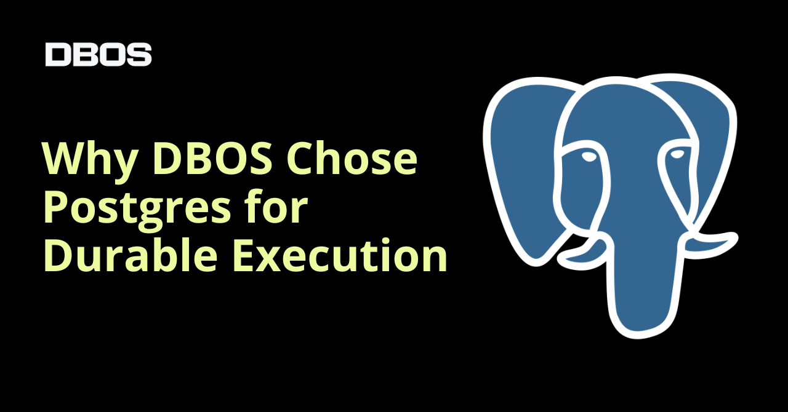
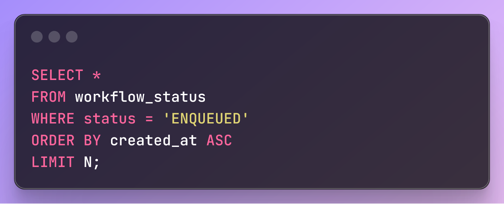
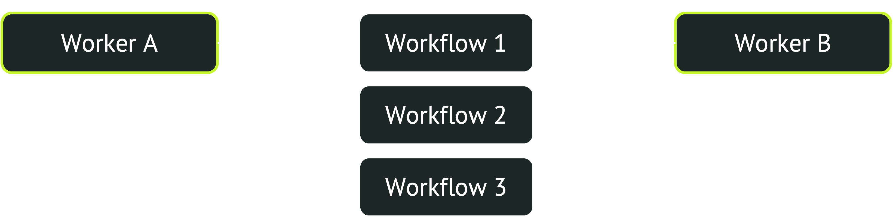
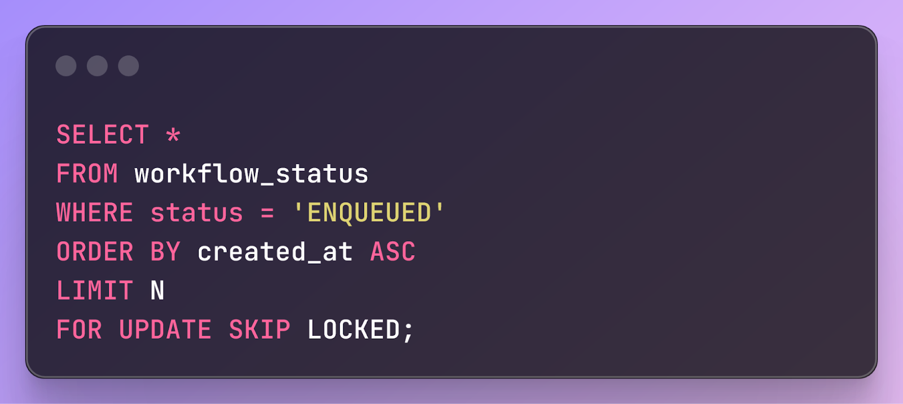
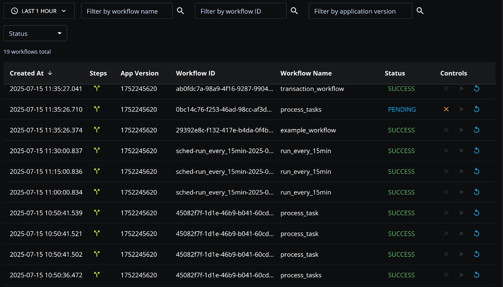
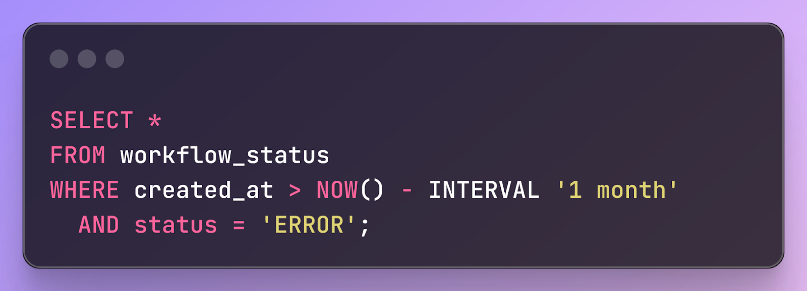
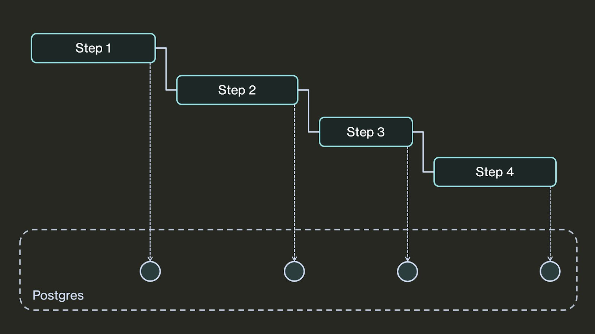
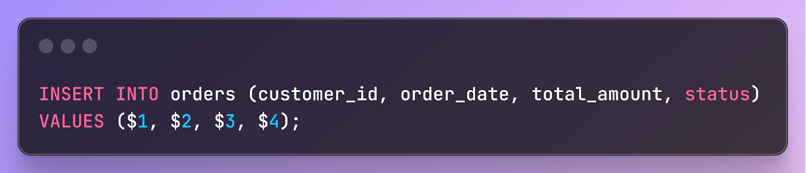
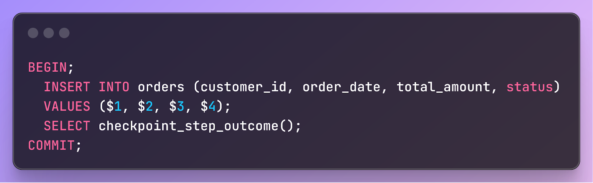

## 高并发持久工作流/任务流/任务分配的数据库选型: 为什么PG会胜出?    
                  
### 作者                  
digoal                  
                  
### 日期                  
2025-08-26                  
                  
### 标签                  
PostgreSQL , PolarDB , DuckDB , 工作流 , 任务流 , 任务分配 , 持久化 , 数据库选型 , 检查点 , 高并发 , 锁冲突 , skip lock , advisory lock , 秒杀            
                  
----                  
                  
## 背景     
什么是工作流/任务流/任务分配?  
  
说白了就是任务队列的生成和消费, 但是有一些约束条件:  
  
1、任务通常是先进先出的, 例如先放进去的任务, 先执行(消费).  
  
2、任务消费一次且仅一次, 不能重复执行.  
  
3、来消费的工作进程通常是高并发的.  
  
4、任务的写入和消费状态都是持久化的.  
  
在哪些业务场景中有典型的任务流需求呢?   
  
例如在跨境电商业务中可能涉及这样的场景, 由于有上下游产业链的存在,     
- 1、用户下单后, 上下游厂商会在自己系统中生成一笔订单记录并反馈给对方,     
- 2、在收到反馈订单后, 本地会先缓存反馈的订单记录队列,     
- 3、然后后台再从缓存取出订单并进行处理.      
      
这个过程的核心流程:     
- 1、高速写入队列、    
- 2、高并发从队列获取任务, 从队列按先后顺序提取并高速处理、    
- 3、从队列清除已处理订单记录.        
      
如果是高并发的处理, 因为worker进程都按相同顺序获取记录, 容易产生热点, 可能遇到取出队列遇到锁冲突瓶颈、IO扫描浪费、CPU计算浪费的瓶颈. 以及在清除已处理订单后, 索引版本未及时清理导致的回表版本判断带来的IO浪费和CPU运算浪费瓶颈等.      
- 文末的《打车与宇宙大爆炸的关系》一文有相似问题和优化方法, 思路类似.      
  
PostgreSQL有什么特性能满足这个场景的诉求, 解决热点问题呢?  
  
1、advisory lock, 非常轻量的锁, 不涉及表tuple级别的锁, 解决秒杀场景的冲突性能最好.   
  
2、skip lock, select for update时跳过已上锁的tuple, 在高并发按相同顺序获取任务tuple时跳过冲突的记录, 快速获取到未上锁的记录.  
  
这两个功能的实践详见 [《沉浸式学习PostgreSQL|PolarDB 2: 电商高并发秒杀业务、跨境电商高并发队列消费业务》](../202308/20230822_03.md)    
  
说到这想必大家已经充分理解了标题提到的《高并发持久化工作流/任务流/任务分配的数据库选型: 为什么PG会胜出? 》  
  
今天发这篇文章主要是看到DBOS发了一篇类似文章, 但是它只用到了skip lock特性, 其实advisory lock性能更好. 其实上面的文章实践更加详细.   
  
以下内容翻译自: https://www.dbos.dev/blog/why-postgres-durable-execution  
  
## 为什么要使用 PostgreSQL 构建持久工作流  
  
    
  
当我们开始构建持久工作流时，我们面临的最关键的架构决策是使用哪种数据库来存储工作流元数据。持久工作流的核心操作很简单 —— 检查工作流状态并从最新检查点恢复中断的工作流。几乎任何数据库都可以处理这些操作，但选择合适的数据库对于确保工作流的可扩展性和高性能至关重要。  
  
在这篇博文中，我们将深入探讨为何选择基于 Postgres 进行构建。虽然这一决定背后有充分的非技术原因（Postgres 广受欢迎且开源，拥有活跃的社区、超过 40 年的实践检验），但我们将重点关注技术方面的原因 —— Postgres 的关键特性，这些特性使得开发健壮且高性能的工作流库变得更加容易。  
  
具体来说，我们将关注以下方面：  
- Postgres 并发控制（特别是其对`skip lock`的支持）特别适合实现可扩展的分布式队列。  
- 关系数据模型（加上对二级索引的谨慎使用）实现对工作流元数据的高性能可观察性工具。  
- Postgres 事务特性(ACID)为工作流在执行数据库操作时的原子保证。  
  
### 构建可扩展队列  
将持久工作流加入队列以便稍后执行通常很有用。然而，使用数据库表作为队列比较棘手，因为存在争用的风险。为了了解这个问题的原因，我们来看看数据库支持的队列是如何工作的。   
  
在数据库支持的工作流队列中，`客户端`通过将工作流添加到队列表中来将其入队，而`工作线程`则出队并处理最早入队的工作流（假设队列遵循先进先出 (`FIFO`) 原则）。简单来说，每个工作线程都会运行如下查询，找出 N 个最早入队的工作流，然后将它们出队：  
  
用于从持久队列中检索任务的 SQL 查询:  
  
    
  
问题在于，如果有许多工作线程同时从队列中拉取新任务，它们都会尝试将相同的工作流出队。然而，每个工作流只能由一个工作线程出队，因此大多数工作线程将无法找到新任务，不得不重试。如果工作线程数量足够多，这种争用就会造成系统瓶颈，限制任务出队的速度。  
  
    
  
幸运的是，Postgres 提供了一个解决方案：锁定子句(skip locked)。以下是一个使用锁定子句的查询示例：  
  
Postgres SELECT FOR UPDATE SKIP LOCKED 查询示例:   
  
    
  
以这种方式选择行会执行两项操作。首先，它会锁定行，以便其他工作进程无法选择它们。其次，它会跳过已锁定的行，不是选择最旧的 N 个已入队工作流，而是选择最旧的 N 个尚未被其他工作进程锁定的已入队工作流。这样，许多工作进程可以并发地拉取新的工作流而不会发生争用等待(wait lock)。一个工作进程选择最旧的 N 个工作流并锁定它们，第二个工作进程选择下一个最旧的 N 个工作流并锁定它们，依此类推。  
  
    
  
因此，通过大大减少争用，Postgres 使持久的工作流系统能够每秒处理数千名工作人员的数万个工作流。  
  
### 使工作流程可观察  
持久工作流的一大优势在于其内置的可观察性。如果每个工作流中的每个步骤都设置了检查点并存储到持久存储中，您就可以扫描这些检查点来实时监控工作流并可视化工作流的执行情况。例如，工作流仪表板可以显示过去一小时内运行的每个工作流，或过去一个月内出错的每个工作流：  
  
观察持久的工作流程历史:  
  
    
  
要实现可观察性，您需要能够对工作流元数据运行高性能查询。Postgres 在这方面表现出色，因为几乎任何工作流可观察性查询都可以轻松地用 SQL 表达。例如，以下查询用于查找上个月发生错误的所有工作流。  
  
检索持久工作流状态的示例 SQL 查询:  
  
    
  
这些查询看似显而易见，但其强大之处无论怎么强调都不为过。这完全是因为 Postgres 的关系模型允许您使用 SQL 以声明式的方式表达复杂的过滤和分析操作，这得益于数十年的查询优化研究。许多采用更简单数据模型的流行系统（例如键值存储）并不提供此类支持。  
  
PS: 以上有点吹了, 我觉得DBOS表述不准, 实际上以上应该使用partial index来加速查询, 如果你只关注ERROR状态的队列, 可仅仅对ERROR状态的数据加索引, 减少索引大小同时能提升查询速度.  
  
Postgres 还提供了使这些可观察性查询在大规模（超过 1000 万个工作流）下保持高性能的工具：二级索引。二级索引允许 Postgres 快速查找所有具有特定属性或属性范围的工作流。它们的构建和维护成本很高，因此必须谨慎使用：如果不增加高昂的开销，就无法索引每个工作流属性。  
  
为了在查询性能和运行时开销之间取得平衡，我们为少数在频繁运行的查询中选择性最高的字段添加了二级索引。由于大多数工作流可观测性查询都是基于时间的（通常是仪表板显示某个时间范围内的所有工作流），因此最重要的索引位于 `created_at` 列。此外，我们还为另外两个经常被搜索且无需指定时间范围的属性添加了索引：`executor_id`（用户通常希望查找在给定服务器上运行的所有工作流）和 `status`（用户通常希望查找所有曾经发生过错误的工作流）。  
  
### 实现 Exactly-Once 语义  
通常，持久工作流保证步骤至少执行一次。其工作方式是，每个步骤完成后，其结果都会在数据存储中进行检查点设置：  
  
持久工作流检查点图:  
  
    
  
如果程序失败，工作流在重新启动时会查找其最新的检查点，并从上次完成的步骤继续执行。这意味着，如果工作流在执行某个步骤时失败，该步骤可能会执行两次 —— 一次在失败之前，另一次在工作流从失败中恢复后。由于步骤可能会执行多次，因此它们应该是幂等的，或者说，能够灵活地重新执行。  
  
通过在 Postgres 上构建持久化工作流，我们可以做得更好，并保证步骤只执行一次 —— 前提是这些步骤执行了数据库原子操作。为此，我们利用了 Postgres 事务。诀窍在于在单个数据库事务中执行整个步骤，并将步骤检查点“搭载”到事务中。这样，如果工作流在步骤执行过程中失败，整个事务将回滚，不会发生任何操作。但如果工作流在事务提交后失败，则步骤检查点已经写入，因此不会重新执行该步骤。  
  
例如，假设某个步骤将一条记录插入数据库表:  
  
    
  
此步骤并非幂等，因此执行两次会很糟糕——订单会被插入到表中两次。但是，由于此步骤仅包含一个数据库操作，因此我们可以在同一个事务中执行此步骤并检查其结果，如下所示：  
  
持久工作流中的幂等步骤示例:  
  
    
  
因此，该步骤要么完全完成或提交（包括其检查点），要么失败并完全回滚 - 保证该步骤只执行一次。  
  
### 了解更多  
如果您喜欢使用 Postgres 进行开发，我们很乐意听取您的意见。在 DBOS，我们的目标是让持久工作流尽可能轻量且易于使用。快来看看吧：  
  
快速入门：https://docs.dbos.dev/quickstart   
  
GitHub：https://github.com/dbos-inc  
  
## 参考  
[《PostgreSQL 高并发任务分配系统 实践》](../201712/20171216_01.md)    
  
[《沉浸式学习PostgreSQL|PolarDB 2: 电商高并发秒杀业务、跨境电商高并发队列消费业务》](../202308/20230822_03.md)    
  
[《高并发队列处理业务的数据库性能优化 - IO扫描|CPU计算浪费 , 锁冲突 , 垃圾索引扫描浪费》](../202308/20230805_01.md)    
  
https://www.dbos.dev/blog/why-postgres-durable-execution  
     
[《PostgreSQL 秒杀4种方法 - 增加 批量流式加减库存 方法》](../201801/20180105_03.md)    
  
[《HTAP数据库 PostgreSQL 场景与性能测试之 30 - (OLTP) 秒杀 - 高并发单点更新》](../201711/20171107_31.md)    
  
[《聊一聊双十一背后的技术 - 不一样的秒杀技术, 裸秒》](../201611/20161117_01.md)    
  
[《PostgreSQL 秒杀场景优化》](../201509/20150914_01.md)    
  
[《[直播]为什么打车和宇宙大爆炸有关?》](../202009/20200926_02.md)    
  
[《PostgreSQL 网约车打车派单 高峰区域集中打车冲突优化1 - 宇宙大爆炸理论与PostgreSQL实践》](../201804/20180416_02.md)    
        
#### [期望 PostgreSQL|开源PolarDB 增加什么功能?](https://github.com/digoal/blog/issues/76 "269ac3d1c492e938c0191101c7238216")
  
  
#### [PolarDB 开源数据库](https://openpolardb.com/home "57258f76c37864c6e6d23383d05714ea")
  
  
#### [PolarDB 学习图谱](https://www.aliyun.com/database/openpolardb/activity "8642f60e04ed0c814bf9cb9677976bd4")
  
  
#### [PostgreSQL 解决方案集合](../201706/20170601_02.md "40cff096e9ed7122c512b35d8561d9c8")
  
  
#### [德哥 / digoal's Github - 公益是一辈子的事.](https://github.com/digoal/blog/blob/master/README.md "22709685feb7cab07d30f30387f0a9ae")
  
  
#### [About 德哥](https://github.com/digoal/blog/blob/master/me/readme.md "a37735981e7704886ffd590565582dd0")
  
  

  
