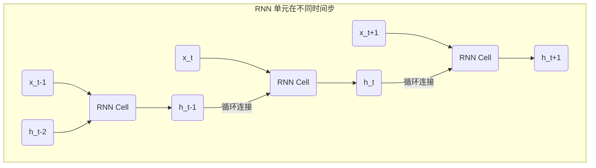
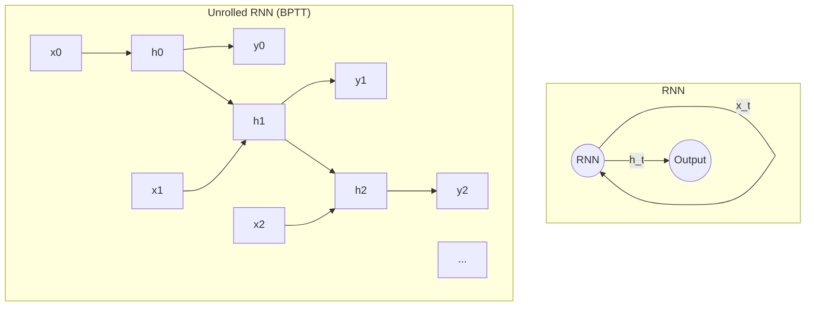
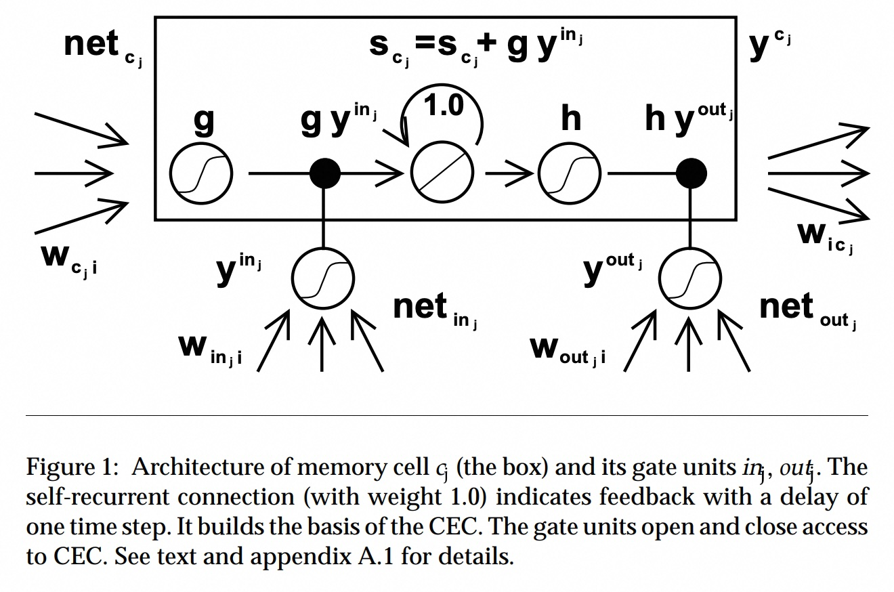
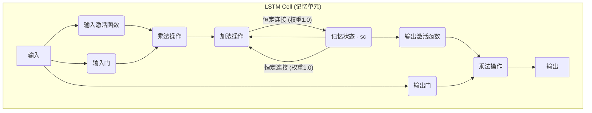

## AI论文解读 | Long Short-Term Memory
        
### 作者        
digoal        
        
### 日期        
2025-08-27       
        
### 标签        
PostgreSQL , PolarDB , DuckDB , AI , 论文解读        
        
----        
        
## 背景  
      
https://deeplearning.cs.cmu.edu/F23/document/readings/LSTM.pdf        
  
提示:          
```          
读懂《Long Short-Term Memory》这篇论文需要提前掌握哪些基础知识, 请使用中文通熟易懂的讲解这些基础知识, 可以引用论文中的图、表或使用Markdown支持的图形(text,mermaid等)增加解释性. 
  
使用中文通熟易懂的解读《Long Short-Term Memory》这篇论文, 其中的关键内容请着重讲解, 可以引用论文中的图、表或使用Markdown支持的图形(text,mermaid等)增加解释性. 
  
提取《Long Short-Term Memory》这篇论文中的重要术语, 使用中文对这些术语进行通熟易懂的讲解, 可以引用论文中的图、表或使用Markdown支持的图形(text,mermaid等)增加解释性. 
```     
  
## 1 前置知识 
  
好的，为了完全理解并读懂这篇开创性的论文《Long Short-Term Memory》，您需要掌握一些核心的基础知识。这篇论文旨在解决一个长期困扰循环神经网络（RNN）的难题。下面我将用通俗易懂的中文，结合论文中的图表和Markdown图形，为您逐一讲解这些必备知识。

### 核心基础知识概览

要读懂这篇论文，您需要按顺序理解以下几个关键概念：

1.  **人工神经网络 (ANN) 与梯度下降**：这是所有深度学习的基础。
2.  **循环神经网络 (RNN)**：论文研究的核心对象，一种为处理序列数据而设计的网络。
3.  **梯度消失与梯度爆炸问题**：论文要解决的核心痛点。
4.  **随时间反向传播 (BPTT) 算法**：训练RNN的标准方法，也是梯度问题产生的直接原因。
5.  **必备的数学基础**：微积分、线性代数和概率论。

-----

### 1\. 人工神经网络 (Artificial Neural Network, ANN) 与梯度下降

#### 什么是神经网络？

想象一个由许多相互连接的“神经元”组成的网络。每个神经元接收来自其他神经元的输入信号，对这些信号进行加权求和，然后通过一个“激活函数”处理，最终产生一个输出信号。网络通过调整连接之间的“权重”来学习。

#### 学习过程：梯度下降

网络如何知道该如何调整权重呢？它通过一个叫做**梯度下降 (Gradient Descent)** 的过程来学习。

  * **目标**：找到一组最佳权重，使得网络的预测输出与真实目标之间的“误差”或“损失”最小。
  * **方法**：想象你站在一座山上，想以最快的速度走到山谷的最低点。你会在你当前的位置，寻找最陡峭的下山方向，然后迈出一步。重复这个过程，你最终会到达谷底。
      * **山**：就是网络的“损失函数”曲面。
      * **最陡峭的方向**：就是损失函数对权重的**梯度**（导数）。
      * **迈出一步**：就是沿着梯度相反的方向更新权重。

这个计算梯度的过程，在神经网络中被称为**反向传播 (Backpropagation)**。论文中反复提到的 "gradient-based method"  和 "backpropagation"  就是指这个核心学习机制。

-----

### 2\. 循环神经网络 (Recurrent Neural Network, RNN)

#### 为什么需要RNN？

传统的神经网络处理输入时，认为每个输入都是相互独立的。但很多任务并非如此，例如语言翻译、语音识别等，数据点之间存在时序关系。比如，理解一句话的含义，你需要记住前面说过的词。

RNN就是为此而设计的。它的核心特点是带有一个 **“循环”** 或 **“反馈连接”** 。



如上图所示，RNN单元在处理当前时刻 `t` 的输入 `x_t` 时，不仅考虑了 `x_t`，还考虑了来自上一时刻 `t-1` 的隐藏状态 `h_t-1`。这个隐藏状态 `h` 就扮演了 **“短期记忆”** 的角色 ，它编码了过去的信息。

论文指出，RNN原则上可以用这种反馈连接来存储近期输入事件的表示 ，这对于语音处理、音乐创作等任务至关重要 。

-----

### 3\. 梯度消失 (Vanishing) 与梯度爆炸 (Exploding) 问题

这是理解LSTM论文动机的**最关键知识点**。

#### 问题的根源

在训练RNN时，误差信号需要通过时间的反向传播来更新权重。想象一下，如果要让网络根据100个时间步之前的一个输入来调整当前输出的误差，这个误差信号就需要“穿越”100个时间步传回去。

在穿越的过程中，误差梯度会反复乘以一个权重矩阵。

  * **梯度消失**：如果这个权重矩阵的值普遍小于1，那么梯度在每一步传播时都会变小。经过很多步之后，它会变得极其微小，接近于0。这就好比声音在空气中传播，距离越远，声音越小，最后完全听不见。当梯度消失时，网络就无法学习到“长期依赖”关系 ，因为它无法从很久之前的事件中获得有效的学习信号。
  * **梯度爆炸**：反之，如果权重矩阵的值普遍大于1，梯度在传播中会指数级增长，变得巨大无比 。这会导致权重更新过大，使学习过程非常不稳定，就像往火里浇油一样。

论文在第3.1节中详细分析了这个问题，并给出了公式化的解释 。其核心思想是，误差在时间步 `t` 和 `t-q` 之间的传递，会乘以一个q次方的项，这导致了指数级的衰减或增长 。

-----

### 4\. 随时间反向传播 (Backpropagation Through Time, BPTT)

BPTT是训练RNN的标准算法 。理解它的基本思想有助于明白梯度问题的来龙去脉。

  * **核心思想**：将RNN按时间序列“展开”（unroll），变成一个非常深的前馈神经网络。这个网络的每一层对应RNN的一个时间步。
  * **过程**：
    1.  提供一个输入序列，RNN按时间步正向计算，得到所有时间步的输出。
    2.  计算每个时间步的输出与目标之间的误差。
    3.  将展开的网络视为一个整体，使用标准的反向传播算法计算梯度。
    4.  最后，将所有时间步计算出的相同权重的梯度累加起来，用于更新权重。




正是因为BPTT将RNN展开成了一个深度网络，所以它直接面临着深度网络中的梯度消失/爆炸问题。误差信号需要从最后一步一直传播到第一步，路径非常长，从而导致了问题的发生 。论文明确指出，传统的BPTT和RTRL（另一种训练算法）都无法解决长时依赖问题 。

-----

### 5\. 必备的数学基础

  * **微积分 (Calculus)**：
      * **导数与偏导数**：理解梯度的基础。
      * **链式法则 (Chain Rule)**：反向传播算法的数学核心。论文中的公式，如 $\\vartheta\_{j}(t)=\\int\_{j}^{\\prime}(net\_{j}(t))\\sum\_{i}w\_{ij}\\vartheta\_{j}(t+1)$ ，就是链式法则的应用。
  * **线性代数 (Linear Algebra)**：
      * **向量与矩阵**：神经网络的输入、输出和权重都通常用向量和矩阵表示。
      * **矩阵乘法**：神经网络中信息从一层传递到另一层的核心运算。论文中也使用了矩阵表示法，例如 $W$ 代表权重矩阵 。
  * **概率论与统计 (Probability & Statistics)**：
      * 理解论文中的实验设置和结果评估需要一些基本概念，如高斯分布 、均值、方差等。

### 总结与学习路径

当您掌握了以上知识后，再来阅读这篇论文，就会发现作者的思路非常清晰：

1.  **提出问题**：RNN在处理长序列时，由于BPTT算法会导致梯度消失或爆炸，因此无法学习到长期依赖关系 。

2.  **分析问题**：通过数学推导，证明了误差信号会随传播距离指数级衰减 。

3.  **提出解决方案**：设计一种全新的、名为**长短期记忆 (LSTM)** 的网络结构。

      * 引入**记忆单元 (Memory Cell)** 和一个核心的**恒定误差传送带 (Constant Error Carousel, CEC)** ，使得误差可以在记忆单元内部无衰减地传递。
      * 引入**输入门 (Input Gate)** 和**输出门 (Output Gate)** 这两个“阀门” ，通过学习来控制信息的流入和流出，保护记忆单元免受干扰。这可以从论文的图1中直观地看到 。   

    *上图是LSTM核心单元的示意图 。中间带 "1.0" 循环箭头的 CEC 保证了误差的恒定流动，而输入门( $y^{in\_j}$ )和输出门( $y^{out\_j}$ )则像开关一样控制着信息的写入与读出。*

建议您的学习路径是：
**神经网络基础 → RNN原理 → 梯度消失/爆炸问题 → BPTT算法 → 最后阅读LSTM论文原文。**

希望这份指南能帮助您扫清阅读障碍，顺利地理解这篇深度学习领域的经典之作。
  
## 2 解读论文
  
好的，我将为您通俗易懂地解读这篇开创性的论文《Long Short-Term Memory》。

### 论文背景：传统网络的困境

在《Long Short-Term Memory》论文发表之前，循环神经网络（RNN）在处理序列数据（比如文本、语音）时面临一个巨大的挑战： **梯度消失（Vanishing Gradient）** 问题 。

简单来说，当RNN处理很长的序列时，比如一句话或一段文字，重要的信息可能出现在序列的开头，但网络需要到很远的结尾处才能使用这些信息。在训练过程中，网络通过**反向传播**来更新权重，这个过程就像是把误差信号从序列的末尾向前传递。然而，随着时间步的增加，传递的误差信号会呈指数级衰减，就像声音在空气中传播得越来越弱一样 。这导致网络在学习长距离依赖关系时，开头的重要信息“被遗忘”了，无法有效地影响后续的计算，从而导致训练非常困难或根本无效 。

### 核心思想：恒定错误传输（CEC）

为了解决这个问题，论文的核心思想是引入一种特殊的机制，称为**恒定错误传输（Constant Error Carousel, CEC）** 。

想象一下一个传统的神经元就像一个水桶，流入的水（信息）会不断流失。而LSTM的 **记忆单元（Memory Cell）** 则更像是一个可以锁住信息的“传送带”或“管道” 。这个记忆单元有一个固定的、权重为1.0的自连接，这确保了信息可以在其中无限期地循环，就像一个永动机一样 。这意味着无论序列有多长，重要的信息和反向传播的梯度都不会衰减，从而解决了梯度消失的问题 。

### 关键结构：门控机制

然而，仅仅让信息无限循环是不够的，我们还需要控制何时写入新信息，以及何时读取旧信息，这就引出了LSTM的另一大创新：**门控单元（Gate Units）** 。这些门控单元是**乘法单元**，它们就像是记忆单元的“开关”，通过学习来控制信息的流入和流出 。

LSTM论文中提出了两个关键的门：

1.  **输入门（Input Gate）**：这个门决定了当前输入的信息是否应该被“写入”记忆单元 。它就像是一个守门员，可以阻止不相关或“嘈杂”的信息进入记忆单元，避免污染重要的长期记忆 。
2.  **输出门（Output Gate）**：这个门决定了记忆单元中存储的信息是否应该被“读取”出来，并影响当前时间步的输出 。它扮演着信息检索者的角色，确保只有在需要的时候才访问内存，防止记忆单元的内容对其他单元造成不必要的干扰 。

通过这种门控机制，LSTM巧妙地解决了传统网络中存在的**输入权重冲突**和**输出权重冲突**问题 。

### LSTM记忆单元结构图

下面是论文中图1所展示的LSTM记忆单元的简化示意图，它直观地展示了CEC和门控单元的协同工作：    



  * **输入门（Input Gate）**：控制新信息流入。
  * **输出门（Output Gate）**：控制记忆状态的输出。
  * **恒定连接**：权重为1.0，确保记忆状态`sc`可以长时间保持不变，是**CEC**的实现 。

### 论文中的主要贡献和结论

除了提出创新的结构，这篇论文还通过大量的实验证明了LSTM的有效性 。

  * **解决长时依赖问题**：LSTM能够成功地解决传统RNN无法处理的、跨越数千个时间步的长时依赖任务 。
  * **更快的学习速度**：在与当时主流的实时循环学习（RTRL）和随时间反向传播（BPTT）等方法对比时，LSTM展现出更快的学习速度 。
  * **计算效率**：LSTM的计算复杂度与BPTT相当，都是每一步和每个权重为`O(1)`，并且它在时空上都是局部化的，因此非常高效 。
  * **强大的泛化能力**：LSTM在处理各种不同类型的任务时表现出色，包括有噪声、需要精准记忆和需要理解时间顺序的任务 。

总的来说，这篇论文不仅诊断了传统RNN的“记忆力”问题，更提出了一种全新的、高效且强大的架构来解决它，为后来的深度学习发展奠定了坚实的基础 。
  
## 3 术语
  
好的，我将为您提取《Long Short-Term Memory》论文中的重要术语，并用通俗易懂的方式进行讲解。

-----

### 1\. 梯度消失（Vanishing Gradient）

在论文发表前，这是循环神经网络（RNN）面临的一个巨大难题。

**通俗解释**：想象你正在玩一个“传话”游戏，从队伍的开头向末尾传递一个很长的句子。当句子很长时，传到最后一句时，开头的信息很可能已经变得模糊不清甚至完全丢失了。在神经网络的训练中，**梯度**就是用来“传达”如何调整参数以减少错误的信号。当网络处理很长的序列时，这个信号会随着时间步的增加而指数级地衰减，最终变得太小而无法有效更新网络，这就像是传话游戏中的声音越来越小，以至于后面的玩家根本听不清了。

-----

### 2\. 长时依赖（Long-Time-Lag Dependency）

**通俗解释**：这是梯度消失问题在实际应用中的具体表现。比如，你正在阅读一段很长的文字，理解某个句子末尾的代词（比如“它”）需要你回想起这段话开头提到的一个名词。如果网络无法“记住”开头的那个词，就无法正确理解这个代词所指代的对象。这就是所谓的“长时依赖”问题——网络难以建立和利用序列中相隔较远的数据点之间的关系。

-----

### 3\. 恒定错误传输（Constant Error Carousel, CEC）

这是LSTM最核心的创新和思想，也是解决梯度消失问题的关键。

**通俗解释**：为了避免“梯度消失”的传话问题，LSTM引入了一个特殊的机制。与其让信息像传统网络一样在每次传递中都衰减，LSTM的记忆单元（Memory Cell）内部有一个权重为1.0的“自连接”。这个连接就像一个**永不衰减的传送带**，可以保证信息和梯度信号在记忆单元内部无限循环，既不会衰减，也不会放大。这就确保了重要的长期记忆和梯度可以被完美地保存和传递，无论序列有多长。

-----

### 4\. 记忆单元（Memory Cell）与门控单元（Gate Units）

**记忆单元**是LSTM的核心组件，它就像是一个**独立的内存单元**，专门用来存储信息。而**门控单元**则像是这个内存单元的**守门人**，它们通过学习来控制信息的进出，从而避免无用的信息进入记忆，并确保只有需要时才读取有用的信息。

论文中主要提到了两个关键的门：

#### **输入门（Input Gate）**

**通俗解释**：这个门决定了新的信息是否能够被写入记忆单元。它就像一个过滤器，可以决定当前时间步的输入数据中哪些部分是重要的，哪些应该被忽略。只有当输入门“打开”时，新信息才能进入记忆单元，这有效地解决了“输入权重冲突”的问题，即避免了不相关信息对记忆单元的干扰。

#### **输出门（Output Gate）**

**通俗解释**：这个门决定了记忆单元中存储的信息是否应该被读取出来，并作为当前时间步的输出。它就像一个“信息开关”，确保记忆单元的内容不会无时无刻地影响其他单元，只有在需要时才将有用的长期记忆释放出来。这解决了“输出权重冲突”的问题，保证了LSTM单元的内部状态可以长时间保持稳定，而不被外部输出所干扰。

下面是论文中的LSTM单元结构图，它直观地展示了这些术语之间的关系：


  
## 参考        
         
https://deeplearning.cs.cmu.edu/F23/document/readings/LSTM.pdf    
        
<b> 以上内容基于DeepSeek、Qwen、Gemini及诸多AI生成, 轻微人工调整, 感谢杭州深度求索人工智能、阿里云、Google等公司. </b>        
        
<b> AI 生成的内容请自行辨别正确性, 当然也多了些许踩坑的乐趣, 毕竟冒险是每个男人的天性.  </b>        
    
#### [期望 PostgreSQL|开源PolarDB 增加什么功能?](https://github.com/digoal/blog/issues/76 "269ac3d1c492e938c0191101c7238216")
  
  
#### [PolarDB 开源数据库](https://openpolardb.com/home "57258f76c37864c6e6d23383d05714ea")
  
  
#### [PolarDB 学习图谱](https://www.aliyun.com/database/openpolardb/activity "8642f60e04ed0c814bf9cb9677976bd4")
  
  
#### [PostgreSQL 解决方案集合](../201706/20170601_02.md "40cff096e9ed7122c512b35d8561d9c8")
  
  
#### [德哥 / digoal's Github - 公益是一辈子的事.](https://github.com/digoal/blog/blob/master/README.md "22709685feb7cab07d30f30387f0a9ae")
  
  
#### [About 德哥](https://github.com/digoal/blog/blob/master/me/readme.md "a37735981e7704886ffd590565582dd0")
  
  

  
