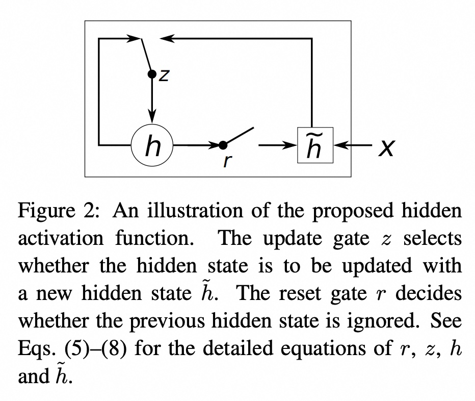
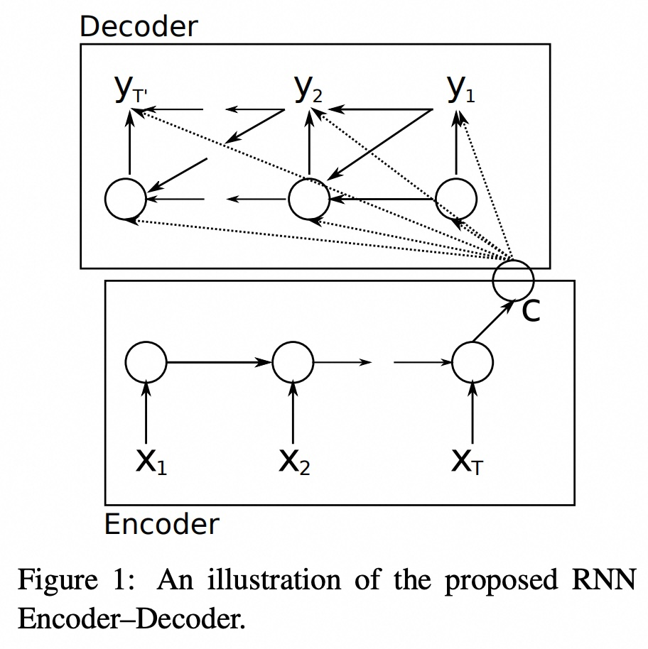
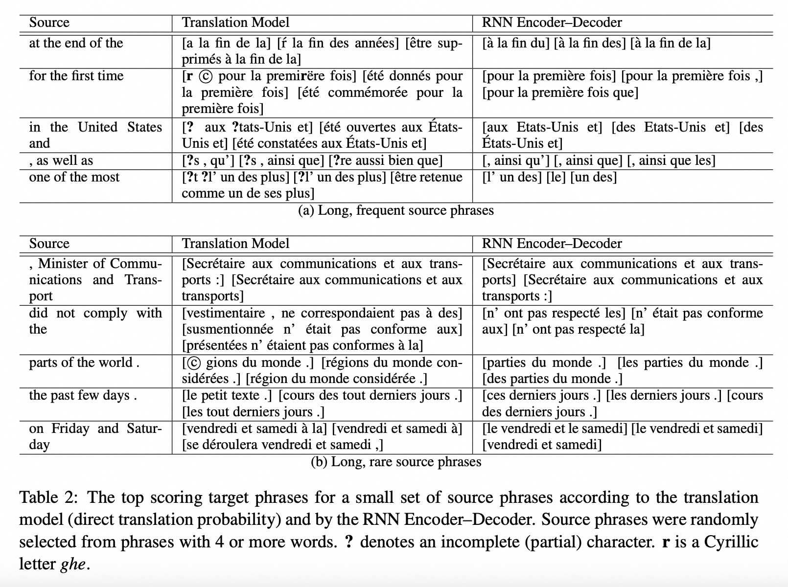
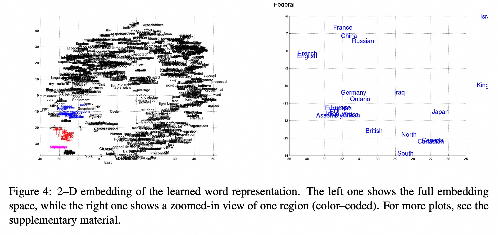
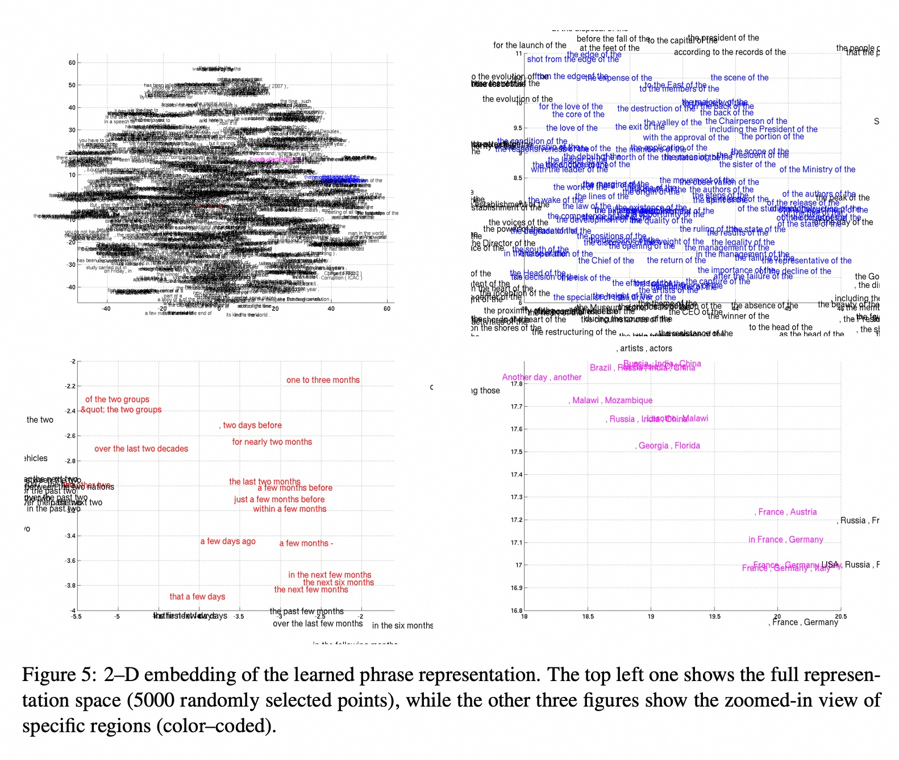

## AI论文解读 | Learning Phrase Representations using RNN Encoder–Decoder for Statistical Machine Translation
        
### 作者        
digoal        
        
### 日期        
2025-08-27       
        
### 标签        
PostgreSQL , PolarDB , DuckDB , AI , 论文解读        
        
----        
        
## 背景  
      
https://arxiv.org/pdf/1406.1078        
  
提示:          
```          
读懂《Learning Phrase Representations using RNN Encoder–Decoder for Statistical Machine Translation》这篇论文需要提前掌握哪些基础知识, 请使用中文通熟易懂的讲解这些基础知识, 可以引用论文中的图、表或使用Markdown支持的图形(text,mermaid等)增加解释性. 
  
使用中文通熟易懂的解读《Learning Phrase Representations using RNN Encoder–Decoder for Statistical Machine Translation》这篇论文, 其中的关键内容请着重讲解, 可以引用论文中的图、表或使用Markdown支持的图形(text,mermaid等)增加解释性. 
  
提取《Learning Phrase Representations using RNN Encoder–Decoder for Statistical Machine Translation》这篇论文中的重要术语, 使用中文对这些术语进行通熟易懂的讲解, 可以引用论文中的图、表或使用Markdown支持的图形(text,mermaid等)增加解释性. 
```     
  
## 1 前置知识 
  
好的，为了能透彻理解这篇开创性的论文《使用RNN编码器-解码器学习短语表示以用于统计机器翻译》，你需要掌握一些核心的前置知识。这篇论文的精髓在于它提出了一种全新的神经网络架构，来解决将一个可变长度的序列（如一句话）转换成另一个可变长度序列的问题。

下面我将用通俗易懂的方式，为你讲解需要掌握的基础知识，并结合论文中的图表进行说明。

### 核心知识点清单

1.  **神经网络基础 (Neural Networks)**
2.  **循环神经网络 (Recurrent Neural Networks, RNN)**
3.  **梯度消失/爆炸问题 (Vanishing/Exploding Gradient Problem)**
4.  **门控循环单元 (Gated Recurrent Unit, GRU)**
5.  **编码器-解码器架构 (Encoder-Decoder Architecture)**
6.  **统计机器翻译 (Statistical Machine Translation, SMT)**
7.  **词嵌入 (Word Embeddings)**

-----

### 1\. 神经网络基础

在理解RNN之前，你需要对最基础的神经网络有一个概念。

  * **是什么**：你可以把它想象成一个模仿人脑神经元连接方式的计算模型。它由许多相互连接的“神经元”组成，分布在输入层、隐藏层和输出层。
  * **做什么**：通过“学习”大量数据，模型可以自动调整神经元之间的连接权重，从而学会识别模式、进行预测或分类。比如，给它看很多猫的图片，它就能学会识别新的猫图片。

### 2\. 循环神经网络 (RNN)

这是理解本篇论文的**第一个核心**。传统的神经网络处理的输入是固定长度的，但语言是序列化的，长度可变。RNN就是为处理序列数据而生的。

  * **是什么**：一种特殊的神经网络，它带有“记忆”功能。在处理序列中的下一个元素时，它会同时考虑当前的输入和它“记忆”中的上一个元素的信息。

  * **如何工作**：RNN的核心在于它的隐藏状态（hidden state）。在每个时间步 `t`，隐藏状态 $h\_{\\langle t \\rangle}$ 的更新不仅依赖于当前的输入 $x\_t$，还依赖于上一个时间步的隐藏状态 $h\_{\\langle t-1 \\rangle}$。

    论文中的公式(1)完美地描述了这一点：

    $h\_{\\langle t\\rangle}=f(h\_{\\langle t-1\\rangle},x\_{t}) \\text{}$

    这个过程可以用下面的流程图简单表示：

    ```mermaid
    graph LR
        subgraph "时间步 t-1"
            h_prev[h_t-1]
        end
        subgraph "时间步 t"
            x_t[输入 x_t]
            h_t[隐藏状态 h_t]
        end
        subgraph "时间步 t+1"
            h_next[h_t+1]
        end

        h_prev -- 传递记忆 --> h_t
        x_t -- 当前输入 --> h_t
        h_t -- 传递记忆 --> h_next
    ```

    这种链式结构使得RNN能够捕捉到序列中的时间依赖关系，非常适合处理自然语言。

### 3\. 梯度消失/爆炸问题

标准RNN虽然有记忆能力，但它的记忆是“短期”的。当序列很长时，它很难学习到序列开头的词和结尾的词之间的依赖关系。

  * **是什么**：在训练RNN时，用于更新模型权重的“梯度”信号在长序列中反向传播时，可能会变得非常小（梯度消失）或非常大（梯度爆炸）。
  * **后果**：
      * **梯度消失**：模型学不到长距离的依赖关系，就像一个人记不住很久以前发生的事情。
      * **梯度爆炸**：训练过程不稳定，导致模型无法收敛。

### 4\. 门控循环单元 (GRU)

为了解决RNN的长期依赖问题，研究者们设计了更复杂的RNN单元，比如LSTM和GRU。这篇论文提出的新型隐藏单元，实际上就是**GRU (Gated Recurrent Unit)** 的一个早期且非常成功的版本，这是论文的**一大创新点**。

  * **是什么**：一种改进的RNN单元，它引入了“门”机制来有选择地传递和遗忘信息。

  * **核心思想**：通过**重置门 (reset gate)** 和 **更新门 (update gate)** 来控制信息的流动。

    我们可以结合论文中的图2来理解：   
    
    *Figure 2 from the paper illustrating the proposed hidden unit.*

      * **重置门 (r)**：决定要 **“忘记”** 多少过去的隐藏状态信息 。如果重置门关闭（接近0），模型就会忽略掉之前的记忆，用当前输入重新开始。
      * **更新门 (z)**：决定将多少 **“现在”** 的新信息融入到最终的隐藏状态中 。它控制着旧的记忆( $h\_{\\langle t-1 \\rangle}$ )和新的候选记忆( $\\tilde{h}\_{\\langle t \\rangle}$ )的比例。

    这个机制允许模型学习到哪些信息是重要的，需要长期保留；哪些是暂时的，可以随时丢弃。从而有效解决了梯度消失问题，实现了长期记忆 。

### 5\. 编码器-解码器 (Encoder-Decoder) 架构

这是理解本篇论文的**第二个核心**，也是整个模型的骨架。它由两个RNN组成。

  * **是什么**：一个专门用于处理“输入序列到输出序列”（Seq2Seq）问题的框架。

  * **如何工作**（参考论文图1）： 

    1.  **编码器 (Encoder)**：它是一个RNN，负责读取并理解输入的源语言句子（例如，英文：“I am a student”）。它将整个句子的信息压缩成一个固定长度的向量，称为**上下文向量 (context vector, C)** 。这个向量可以被看作是整个输入句子的“思想总结”或“语义表示”。

    2.  **解码器 (Decoder)**：它也是一个RNN。它接收编码器生成的上下文向量 `C`，然后一个词一个词地生成目标语言的句子（例如，法文：“Je suis un étudiant”）。在生成每个词时，它不仅会参考上下文向量 `C`，还会参考它自己上一步已经生成的词 。

      

    *Figure 1 from the paper illustrating the RNN Encoder-Decoder model.*

    这个架构的强大之处在于，它不要求输入和输出序列的长度相同 ，非常适合机器翻译等任务。

    ```mermaid
    graph TD
        A["源语言句子 (I am a student)"] --> B(编码器 RNN);
        B -- 压缩成 --> C["上下文向量 C (思想总结)"];
        C -- 传递给 --> D(解码器 RNN);
        D -- 逐词生成 --> E["目标语言句子 (Je suis un étudiant)"];
    ```

### 6\. 统计机器翻译 (SMT)

在深度学习方法流行之前，SMT是机器翻译的主流技术。这篇论文的成果是作为对SMT系统的**改进**而应用的。

  * **是什么**：一种基于概率和统计模型的翻译方法。它的核心是**短语表 (Phrase Table)**。

  * **短语表**：可以理解为一个巨大的双语词典，但记录的是短语对短语的翻译，以及它们的翻译概率。例如，“at the end of the” 对应 “à la fin de la” 的概率很高。

  * **论文的贡献**：传统的SMT主要靠统计词频来计算短语翻译的概率，这很粗糙，无法理解语义。而这篇论文提出的RNN Encoder-Decoder模型能够**学习到短语的语义表示**。因此，它可以为短语表中的每一个短语对给出一个更“聪明”的、基于语义的得分 。将这个新得分作为SMT系统的一个额外特征，显著提升了翻译质量 。

    从论文的**表2**可以看出，对于源短语 "at the end of the"，传统的翻译模型 (Translation Model) 可能会给出一些包含了不相关词的较长翻译，而RNN Encoder-Decoder给出的翻译则非常精准和地道 。   

### 7\. 词嵌入 (Word Embeddings)

神经网络无法直接处理文本，需要先将词语转换成数字。

  * **是什么**：将每个词语表示成一个稠密的、低维的实数向量的技术。
  * **核心思想**：这种表示能够捕捉词语的**语义信息**。在向量空间中，意思相近的词语，它们的向量也更接近。例如，“国王”和“女王”的向量距离会很近。
  * **论文中的体现**：论文在**图4**和**图5**中展示了其模型学习到的词嵌入和短语表示 。从图中可以看到，无论是单词（如国家名称聚在一起）还是短语（如表示时间段的短语聚在一起），模型都成功地将语义或语法上相似的单元在向量空间中聚集了起来 ，证明了其学习表示的有效性。      

### 总结

要读懂这篇论文，你需要按照以下逻辑链来组织知识：

1.  **基础**：了解神经网络如何通过学习数据来工作。
2.  **核心部件**：理解 **RNN** 如何处理序列数据，以及它为什么会遇到**长期依赖**的难题。
3.  **创新点1 (单元层面)**：掌握论文提出的**GRU**单元如何通过“门”机制来解决长期依赖问题。
4.  **创新点2 (架构层面)**：理解 **Encoder-Decoder** 架构如何通过“编码-总结-解码”的模式，将一个序列优雅地转换为另一个序列。
5.  **应用背景**：了解传统的 **SMT** 是如何工作的，以及这篇论文的模型是如何作为一项“插件”或“增强功能”，为SMT系统提供了更优质的短语翻译得分。
6.  **表示方法**：理解**词嵌入**是将文本转换为神经网络能处理的向量，并能捕捉语义信息的基本手段。

掌握了这些知识后，你就能轻松地理解这篇论文的动机、方法、创新点及其在机器翻译领域带来的革命性影响。
  
## 2 解读论文
  
根据你上传的论文《Learning Phrase Representations using RNN Encoder–Decoder for Statistical Machine Translation》，下面是这篇论文的通俗解读和关键内容讲解。

### 论文核心思想：用“编码-解码”理解机器翻译

这篇论文的核心在于提出了一种全新的神经网络模型，叫作**RNN Encoder-Decoder（循环神经网络编码器-解码器）** 。你可以把它想象成一个聪明的翻译官，它由两部分组成：

1.  **编码器（Encoder）**：一个RNN网络，负责**理解**一句话。它会逐字逐句地读取源语言（比如英语）的句子，然后把整个句子的意思浓缩成一个**固定长度的向量**（一个数字串）。这个向量就像是句子的“DNA”，包含了所有重要的语义和语法信息 。
2.  **解码器（Decoder）**：另一个RNN网络，负责**生成**一句话。它拿到编码器生成的那个“DNA”向量，然后像讲故事一样，逐字逐句地生成目标语言（比如法语）的翻译句子 。

这个模型最厉害的地方在于，编码器和解码器是**一起训练**的，目的是最大化目标句子在给定源句子下的条件概率，让它们相互配合，达到最好的翻译效果 。

#### 核心亮点一：处理“变长”问题

在传统的机器翻译方法中，处理不同长度的句子一直是个难题。而RNN Encoder-Decoder模型巧妙地解决了这个问题 。

* **编码器**：无论源语言句子有多长，它都能将其压缩成一个**固定长度**的向量。
* **解码器**：拿到这个固定向量后，又能生成任意长度的目标语言句子 。

这个设计非常优雅，让模型能够自然地处理可变长度的输入和输出序列 。

---

### 关键创新：自适应记忆和遗忘的隐藏单元

为了让模型能更好地学习，作者还提出了一种新型的隐藏单元（Hidden Unit） 。你可以把它理解成一个更聪明的“神经元”，它有两个关键的“门”：

1.  **重置门（Reset Gate）**：这个门决定了有多少过去的隐藏状态（记忆）应该被**遗忘** 。如果重置门接近0，那么隐藏状态就会忽略过去的记忆，只关注当前的输入信息。这就像是模型在说：“这段信息不重要，可以扔掉了！” 
2.  **更新门（Update Gate）**：这个门决定了有多少过去的隐藏状态（记忆）应该被**保留**到当前的隐藏状态中 。这个门的作用类似于LSTM（长短期记忆网络）中的记忆单元，帮助模型记住那些长距离的、重要的信息 。

通过这两个门的配合，每个隐藏单元都能学习捕获不同时间尺度上的依赖关系 。那些负责捕获短期依赖关系的单元会频繁地激活重置门，而那些负责长期依赖的单元则会保持更新门的活跃 。

这种设计比当时流行的LSTM单元更简单，计算和实现起来也更方便 。

---

### 论文的应用与实验结果

这篇论文并没有直接用这个模型来取代传统的统计机器翻译（SMT）系统，而是把它作为一个**辅助工具** 。

* **如何应用？** 作者在经典的基于短语的SMT系统中，将RNN Encoder-Decoder模型计算出的短语对（phrase pair）的条件概率，作为**额外的特征**加入到现有的对数线性模型中 。
* **实验结果**：在英法翻译任务中，这个方法显著提升了翻译性能 。
    * **基线系统**：BLEU得分33.30 。
    * **加入RNN特征后**：BLEU得分提升到了33.87 。
    * **结合CSLM（语言模型）和RNN后**：BLEU得分达到了34.64 。

这表明RNN Encoder-Decoder的贡献是独特的，它和传统的语言模型特征可以互补，从而获得更好的效果 。

#### 定性分析：模型到底学到了什么？

除了量化指标，论文还进行了定性分析，以了解模型为何能提升性能。

作者将RNN Encoder-Decoder的短语得分与传统的翻译模型（TM）得分进行了对比 。结果发现：
* **RNN模型更偏爱“字面”翻译**：在一些长而常见的短语上，RNN Encoder-Decoder给出的高分短语对更接近字面意思，并且通常更短 。
* **模型能捕捉语言规律**：RNN模型在训练时没有使用短语对出现的频率信息 。这使得它能更专注于学习语言的**内在规律**，而不是简单地记忆频率 。
* **学习了有意义的短语表示**：分析还显示，这个模型学习到的短语表示，在一个连续的空间中既能保留**语义**（意思）又能保留**语法**结构 。

总的来说，这篇论文是深度学习在机器翻译领域的一个里程碑，它首次提出了Encoder-Decoder架构，为后续的神经网络机器翻译（NMT）奠定了基础。虽然它当时只是作为SMT系统的辅助工具，但这个架构本身，以及提出的新型门控循环单元（也就是后来的**GRU**），对整个深度学习领域都产生了深远影响。
  
## 3 术语
  
### 重要术语中文解读

根据你上传的论文《Learning Phrase Representations using RNN Encoder–Decoder for Statistical Machine Translation》，以下是一些关键术语的通俗易懂的中文讲解。

-----

#### 1\. RNN Encoder-Decoder（循环神经网络编码器-解码器）

  * **通俗理解**：你可以把它想象成一个 **“翻译流水线”** ，由两个相互协作的机器人组成。

      * **第一个机器人（编码器）**：专门负责**理解**。它从左到右逐一读入源语言（比如英语）的单词，然后把整个句子的意思压缩成一个 **“想法胶囊”** （一个固定长度的向量）。
      * **第二个机器人（解码器）**：专门负责**表达**。它拿到这个“想法胶囊”，再从左到右逐一吐出目标语言（比如中文）的单词，完成翻译。

  * **论文中的图示**：论文中的图1很好地解释了这个过程，如下所示：   

    ```mermaid
    graph TD
        subgraph Encoder
            direction LR
            A[x1: HE] --> B[h1]
            B --> C[x2: IS]
            C --> D[h2]
            D --> E[x3: GOOD]
            E --> F[h3]
            F --> G[x4: .]
            G --> H[h4]
            H --> Z[c]
        end

        subgraph Decoder
            direction LR
            Z[c] --> I[y1: 他]
            I --> J[s1]
            J --> K[y2: 很好]
            K --> L[s2]
            L --> M[y3: .]
        end

        Encoder --> Decoder
    ```

      * `x1, x2, x3, ...` 代表源语言的词语（如 “He”, “is”, “good”）。
      * `h1, h2, h3, ...` 是编码器在每个时间步的隐藏状态，代表了它对句子的理解。
      * `c` 是最终的“想法胶囊”，也就是编码器将整个句子压缩后的向量表示。
      * `y1, y2, y3, ...` 是解码器生成的翻译结果（如 “他”, “很好”, “.”）。

-----

#### 2\. Fixed-length Vector Representation（固定长度向量表示）

  * **通俗理解**：这个“固定长度向量”就是上面提到的 **“想法胶囊”** 。它是一个由一串数字组成的列表（比如 `[0.1, -0.5, 0.9, ...]`），代表了整个句子的意思。
  * **重要性**：这个概念是这篇论文最核心的贡献之一。在此之前，机器翻译很难处理句子长度不同的问题。而这个固定向量就像一个 **“瓶子”** ，无论源句子有多长，都能把它“装”进去，从而让解码器能统一地从这个“瓶子”里提取信息，生成翻译。

-----

#### 3\. Gated Recurrent Unit (GRU)（门控循环单元）

  * **通俗理解**：这是论文中提出的一种新型RNN单元，你可以把它看作一个更 **“聪明”** 的神经元。它内部有两个“门”：

      * **重置门（Reset Gate）**：决定要 **“忘记”** 多少过去的记忆。如果重置门关闭（值为0），它就会把过去的旧信息全部清空，只关注当前的新信息。这让模型在处理不相关的信息时更加灵活。
      * **更新门（Update Gate）**：决定要 **“保留”** 多少过去的记忆。如果更新门打开（值为1），它就会把之前的记忆和新的信息结合起来，记住那些重要的长期依赖。

  * **重要性**：GRU的设计比当时流行的LSTM更简单，参数更少，但效果却不差。这使得它在训练时更快，成为后来很多序列模型中的常用组件。

-----

#### 4\. Log-linear Model（对数线性模型）

  * **通俗理解**：这是一个在传统统计机器翻译（SMT）系统中常用的模型，可以简单理解为一种 **“打分器”** 。它会综合考虑多种因素（特征），比如短语出现的频率、语言的流畅度等，来给出一个翻译结果的得分。得分越高，翻译越好。
  * **论文中的应用**：这篇论文的创新点在于，它将RNN Encoder-Decoder计算出的短语得分，作为**一个新的“特征”**，加入到这个对数线性模型中。这就像是给“打分器”增加了一个新的评判标准，让它能更全面地评估翻译质量，从而提升了整体的翻译性能。
  
## 参考        
         
https://arxiv.org/pdf/1406.1078    
        
<b> 以上内容基于DeepSeek、Qwen、Gemini及诸多AI生成, 轻微人工调整, 感谢杭州深度求索人工智能、阿里云、Google等公司. </b>        
        
<b> AI 生成的内容请自行辨别正确性, 当然也多了些许踩坑的乐趣, 毕竟冒险是每个男人的天性.  </b>        
    
#### [期望 PostgreSQL|开源PolarDB 增加什么功能?](https://github.com/digoal/blog/issues/76 "269ac3d1c492e938c0191101c7238216")
  
  
#### [PolarDB 开源数据库](https://openpolardb.com/home "57258f76c37864c6e6d23383d05714ea")
  
  
#### [PolarDB 学习图谱](https://www.aliyun.com/database/openpolardb/activity "8642f60e04ed0c814bf9cb9677976bd4")
  
  
#### [PostgreSQL 解决方案集合](../201706/20170601_02.md "40cff096e9ed7122c512b35d8561d9c8")
  
  
#### [德哥 / digoal's Github - 公益是一辈子的事.](https://github.com/digoal/blog/blob/master/README.md "22709685feb7cab07d30f30387f0a9ae")
  
  
#### [About 德哥](https://github.com/digoal/blog/blob/master/me/readme.md "a37735981e7704886ffd590565582dd0")
  
  

  
