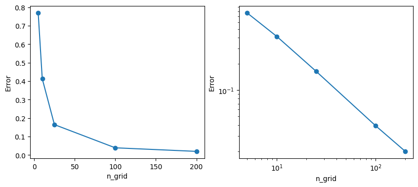

## 残差矢量量化(RVQ) : 探索“神经音频编解码器”的核心技术   
                                                    
### 作者                                                    
digoal                                                    
                                                    
### 日期                                                    
2025-08-27                                                    
                                                    
### 标签                                                    
PostgreSQL , PolarDB , DuckDB , vectorchord , 向量 , 向量量化 , VQ , 残差向量量化 , RVQ     
                                                    
----                                                    
                                                    
## 背景    
残差矢量量化(rvq)是 PostgreSQL 向量索引插件 Vectorchord 提升性能的秘密武器之一. 下面将详细介绍vq, rvq.   
  
以下内容翻译自:  
  
https://drscotthawley.github.io/blog/posts/2023-06-12-RVQ.html  
  
# 残差矢量量化(RVQ) : 探索“神经音频编解码器”的核心   
  
## 介绍  
  
“矢量量化”，听起来有点吓人。“残差矢量量化”听起来更吓人，对大多数人来说甚至毫无意义。其实，只要看几张图片，这些概念就很容易理解，甚至连小孩子都能理解——呃……如果小孩子愿意的话。当然，这些算法可以用更复杂的方法实现，我们稍后会稍微介绍一下，但其基础其实非常简单。  
  
残差矢量量化 (RVQ) 是一种数据压缩技术，应用于谷歌[SoundStream](https://www.instagram.com/p/CteX0esglU-/)和 Facebook/Meta AI 的[Encodec](https://github.com/facebookresearch/encodec)等先进的神经音频编解码器，而这些编解码器又构成了[AudioLM（谷歌）](https://google-research.github.io/seanet/audiolm/examples/)和[MusicGen（Facebook）](https://ai.honu.io/papers/musicgen/)等生成音频模型的支柱。它也被 Lucidrain [vector-quantize-pytorch](https://github.com/lucidrains/vector-quantize-pytorch) 库应用，由于它速度快且性能好，我们将在最后使用它。  
  
什么是 RVQ？它是如何工作的？  
  
首先，我们应该考虑常规的矢量量化（VQ）。VQ 已经存在了几十年，并且在许多涉及压缩的信号处理领域中都有应用。  
  
> 注意：每当我说一些同时适用于 VQ 和 RVQ 的内容时，我都会使用缩写“(R)VQ”。  
  
  
  
> 提示：两个类比  
> 1、城市和城镇： RVQ 类似于物流中经常出现的“枢纽辐射”图：以航空旅行为例，主要城市是“枢纽”（芝加哥、洛杉矶、亚特兰大），人们从这些枢纽乘坐小型航班前往较小的城市和城镇。VQ 就像用最近的城镇替换每个地址 —— 这可能会产生大量的向量！RVQ 意味着我们有一个简短的枢纽列表，然后从每个枢纽得到一个较小城市的列表，由此我们可以得到连接较小城市和附近城镇的列表。  
>   
> 2、数字和位数：从某种角度来看，RVQ 类似于我们用位数表示数字的方式。我们不是为从 0 到 9999 的每个整数创建 10,000 个单独的类别，而是使用 4 个“码本”（分别代表千位、百位、十位和个位），每个码本由 0 到 9 这 10 个数字组成。4 * 10 = 40，这比 10,000 少得多！我们甚至可以通过使用更多码本来在小数点右侧包含更小的“残差向量”，从而将实数表示到任意精度。  
  
## 矢量量化=划分空间  
“矢量量化”实际上是将数据点的空间划分成一组离散的区域。换句话说，我们对空间进行了“分区”。  
  
假设我们在空间中有一堆点：  
```  
import numpy as np   
import matplotlib.pyplot as plt  
  
# make some data  
n_points = 25  
DATA_MIN, DATA_MAX = -0.5, 0.5 # we'll let these be globals  
np.random.seed(9)  # for reproducibility  
data = DATA_MIN + (DATA_MAX-DATA_MIN)*np.random.rand(n_points, 2)  
  
# plot it  
fig, ax = plt.subplots(figsize=(3,3))  
ax.set_xlim(DATA_MIN, DATA_MAX)  
ax.set_ylim(DATA_MIN, DATA_MAX)  
#ax.set_xticks([])  # hide axis ticks  
#ax.set_yticks([])  
ax.set_xlabel('x')  
ax.set_ylabel('y')  
plt.scatter(data[:, 0], data[:, 1], s=16)  
plt.show()  
```  
  
  
  
图 1.一组数据点，又称“向量” 。  
  
对于计算机科学家来说，每个点的坐标（x，y）定义了一个“向量”。（对数学家和物理学家来说，“向量”指: 从原点指向每个点，但这种区别对我们来说并不重要。）  
  
> 澄清  
> 对于神经音频编解码器，向量可以是音频频谱图中的垂直切片（列），即在称为“帧”的短时间间隔内发现的一组频率的振幅列表。然而，更常见的是，向量本身是某些其他音频编码器（例如卷积神经网络）的输出，并且 (R)VQ 是为了进一步压缩这些编码向量，以便执行诸如[潜在扩散](https://github.com/CompVis/latent-diffusion)之类的操作。  
  
现在将空间划分成一堆区域。我们可以采取多种形式来实现这一点。现在，我们先考虑两个例子：  
- 我的手绘彩色图和一组平铺的正方形。  
- 有一些“更高级”的算法可以以最“拟合”数据的方式划分空间（例如，下文的“k-Means”算法）。  
  
  
  
以下abc图式 : 划分或“量化”空间的方法示例，又称“分区方案” 。  
  
  
  
（a）手工  
  
  
  
（b）正方形  
  
  
  
（c）Fancy（图片来源：芬兰阿尔托大学）  
  
图c 为泰森多边形, 参考. 我们稍后可以讨论像图c那样的方案。  
- [《PolarDB 开源版 使用PostGIS 以及泰森多边形 解决 "零售、配送、综合体、教培、连锁店等经营"|"通信行业基站建设功率和指向" 的地理最优解问题, 含pgadmin4 容器部署, GIS数据可视化》](../202301/20230104_02.md)    
- [《重新发现PostgreSQL之美 - 25 最强大脑题目 泰森多边形(空间战略布局问题)》](../202106/20210614_09.md)    
- [《在PostgreSQL中生成和查看泰森多边形 - Voronoi diagram - 最强大脑题目》](../201904/20190421_01.md)    
  
接下来，我可以用squares做更多的代码，所以让我们从那里开始吧。;-)  
  
我稍微形式化一下：我们让变量`n_grid`控制正方形的数量。因此，对于我们的二维示例，将有`n_grid^2`方形区域。  
  
通过矢量量化，我们为每个区域赋予一个索引值（例如，对于 `5x5` 方格，索引值为 `0` 到 `24`），然后用该区域的索引替换每个矢量的值。  
  
```  
#| code-fold: true  
#| code-summary: "Show the code"  
import pandas as pd   
  
def plot_data_grid(data, n_grid=5, hide_tick_labels=True, show_indices=False, show_centroids=False,   
                   show_next_level_grid=False):  
    "big ol' workhorse plotting routine that we'll progressively make use of as the lesson proceeds"  
    fig, ax = plt.subplots(figsize=(3,3))  
    h = 1.0 / n_grid  
    ax.set_xlim(DATA_MIN, DATA_MAX)  
    ax.set_ylim(DATA_MIN, DATA_MAX)  
  
    for i in range(n_grid + 1):  
        ax.axhline(DATA_MIN + i*h, color='black')  
        ax.axvline(DATA_MIN + i*h, color='black')  
          
    if show_indices:  
        index = 0  
        for j in range(n_grid):  
            for i in range(n_grid):  
                x = DATA_MIN + (i + 0.5) / n_grid  
                y = DATA_MIN + 1 - (j + 0.5) / n_grid  
                ax.text(x, y, str(index), ha='center', va='center',fontsize=14)  
                index += 1  
  
    if show_centroids:   
        for j in range(n_grid):  
            for i in range(n_grid):  
                x = DATA_MIN + (i + 0.5)*h  
                y = DATA_MIN + (j + 0.5)*h  
                ax.plot(x, y, 'ro', markersize=6)  
                  
    if hide_tick_labels:  
        ax.set_xticks([])  
        ax.set_yticks([])  
  
    ax.set_aspect('equal')  
    if data is not None:  
        plt.scatter(data[:, 0], data[:, 1], s=16)  
    plt.show()  
      
      
n_grid=5  
#plot_data_grid(data, n_grid=n_grid)  
plot_data_grid(data, n_grid=n_grid, show_indices=True)  
```  
  
  
  
图 3. （`0-24`整数）每个区域的索引。  
  
对于数据点所代表的每个“向量”，我们不再使用`(x,y)`坐标对，而是其所在区域的（整数）索引。  
  
> 笔记  
> 我们已经从每个点需要两个浮点数变成了只需要一个整数值。在二维空间中，由此带来的“节省”或数据压缩量可能并不明显，但请记住：随着我们以后处理大量维度，这种方案将为我们节省大量数据。  
  
如果我们想要与索引对应的坐标，我们将使用每个区域的质心。从这个意义上讲，向量被“量化”，因此它们只能取由区域质心给出的值。在以下示例中，质心显示为红色：  
  
```  
plot_data_grid(data, n_grid=n_grid, show_indices=False,   
               show_centroids=True)  
```  
  
  
  
图 4.质心位置  
  
因此，每个蓝点实际上都会被最近的红点替换。从这个意义上讲，我们“量化”了向量（因为我们量化了空间本身）。  
  
> 术语  
> 质心位置的集合称为“码本”。当我们想要使用（空间中的）实际矢量值时，我们通过查找码本将码本索引转换为（质心）位置。  
  
因此，显示数据点、区域索引和质心的完整（尽管不方便）图片如下所示：  
  
```  
plot_data_grid(data, n_grid=n_grid, show_indices=True, show_centroids=True, hide_tick_labels=False)  
```  
  
  
  
图 5.显示数据点、区域索引和质心位置的详细图表。  
  
对于我们选择的坐标，码本（即索引到质心位置的映射）如下所示：  
  
```  
from IPython.display import display, Markdown  
  
def generate_codebook(n_grid, n_dim=2, debug=False):  
    n_gridpoints = n_grid ** n_dim  
    if debug: print(f"generate_codebook: n_grid = {n_grid}, n_dim = {n_dim}, n_gridpoints = {n_gridpoints}")  
    centroids = np.empty((n_gridpoints, n_dim))  
    h = (DATA_MAX - DATA_MIN)/n_grid  
    for i in range(n_dim):  
        coords = np.linspace(DATA_MIN + h/2, DATA_MAX - h/2, n_grid)  
        coords = np.tile(coords, int(n_gridpoints / n_grid ** (i + 1)))  
        coords = np.repeat(coords, n_grid ** i)  
        centroids[:, i] = coords  
  
    return centroids  
  
  
codebook = generate_codebook(n_grid)  
  
  
# print it nicely  
cb_str = f"| index      | vector |\n| ----------- | ----------- |"  
for i in range(codebook.shape[0]):  
    cb_str += f"\n| {i} | ({codebook[i,0]:.1f}, {codebook[i,1]:.1f}) |"  
display(Markdown(cb_str))  
```  
  
  
index	| vector  
---|---  
0	| (-0.4, -0.4)  
1	| (-0.2, -0.4)  
2	| (0.0, -0.4)  
3	| (0.2, -0.4)  
4	| (0.4, -0.4)  
5	| (-0.4, -0.2)  
6	| (-0.2, -0.2)  
7	| (0.0, -0.2)  
8	| (0.2, -0.2)  
9	| (0.4, -0.2)  
10	| (-0.4, 0.0)  
11	| (-0.2, 0.0)  
12	| (0.0, 0.0)  
13	| (0.2, 0.0)  
14	| (0.4, 0.0)  
15	| (-0.4, 0.2)  
16	| (-0.2, 0.2)  
17	| (0.0, 0.2)  
18	| (0.2, 0.2)  
19	| (0.4, 0.2)  
20	| (-0.4, 0.4)  
21	| (-0.2, 0.4)  
22	| (0.0, 0.4)  
23	| (0.2, 0.4)  
24	| (0.4, 0.4)  
  
### 重建误差  
当我们进行这种量化（即用最近的质心替换向量）时，质心位置与原始数据向量本身相比自然会有些“偏差”。网格越精细，区域越小，误差就越小。对于二维网格在哪里，误差约为`h^2`, `h`是网格间距（`h = 1/5 = 0.2`）。  
  
> 笔记  
> 请注意，码本中的向量并非“基向量”：我们不会将码本向量进行线性组合，因为那样并非“量化”（并且会将数据点数量与原始数据相同，导致几乎没有压缩）。VQ 通过使用最接近的码本向量来近似数据点，帮助我们解决了数据点数量过多的问题；而 RVQ 中的 R 值则使我们能够在不需要极长码本的情况下，在空间内提供良好的“分辨率”。  
  
让我们检查一下当我们改变网格间距时误差是如何变化的，即当我们改变`n_grid`时。  
  
```  
def find_closest_centroids(data, codebook):  
    distances = np.sum((data[:, np.newaxis] - codebook) ** 2, axis=2)  
    closest_centroids = np.argmin(distances, axis=1)  
    return closest_centroids # indices not coordinates  
  
def compute_error(data, codebook):  
    n_grid = int(np.sqrt(codebook.shape[0]))  
    h = 1/n_grid * (DATA_MAX - DATA_MIN)   
    quantized_ind = find_closest_centroids(data, codebook)  
    quantized_xy = codebook[quantized_ind]         
    error = np.sqrt( np.sum( (data - quantized_xy)**2 ) )  
    return error   
  
n_points2 = 100  
data2 = DATA_MIN + (DATA_MAX - DATA_MIN)*np.random.rand(n_points2, 2)  
  
errors = []  
grids = np.array([5,10,25,100,200])  
for n_grid2 in grids:  
    codebook = generate_codebook(n_grid2)  
    error = compute_error(data2, codebook)                 
    errors.append(error)  
      
fig, ax = plt.subplots(1,2, figsize=(10,4))      
ax[0].plot(grids, errors, 'o-')  
ax[1].loglog(grids, errors, 'o-')  
for i in range(2):  
    ax[i].set_ylabel('Error')  
    ax[i].set_xlabel('n_grid')  
plt.show()  
print(f"lowest error (for n_grid={grids[-1]}) = ",errors[-1])  
```  
  
  
  
图 6.误差与分辨率的关系图，左轴为线性轴，右轴为对数轴。请注意，计算成本会随着区域数量的增加而变化，即`n_grid^2`。  
  
```  
lowest error (for n_grid=200) =  0.019903707672610238  
```  
  
所以，使用的“网格线”越多，误差就越小，但代价是什么呢？为了得到 0.02 的误差，我们需要`200^2 = 400`区域。在高于 2 的维度中，获得`更高分辨率/更低误差`的“代价”会大幅上升：在D维向量空间中为了将分辨率翻倍，计算成本增加了`2^D`。（想象`D=32、64、128、…`）  
  
但我们不需要均匀地覆盖整个空间！这就是残差矢量量化（RVQ）的用武之地。您可以直接跳到RVQ部分。下一部分我们将选一个可选的题外话，学习另一种划分空间的方法，即“k-means”算法。  
  
> 笔记  
> 另一个关键点：通过替换矢量的所有坐标值（即 浮点数d ）为单个整数(网格ID)，VQ 实现了数据压缩系数d（浮点数占用的bit数是整数的几倍）。对于大量维度，无论采用何种分区方案，这种压缩都可能非常显著。  
  
### k-means 分区方案  
  
> 关于 k-Means 的讨论实际上对理解 (R)VQ 来说并不重要。完全不是。说实话，完全可以跳过。所以……只有真正好奇才读。否则，直接跳到残差矢量量化部分。  
  
K-Means 算法是另一种划分空间的方法，它取代了静态的正方形，允许我们的区域和质心“跟随数据”动态移动。K-Means 通常用于初始化神经编解码器（例如 SoundStream、Encodec 等）的 RVQ 码本，之后，神经网络的其余训练算法可能会进一步优化码本。  
  
我们将从下面显示的一组数据点开始，这些数据点显示为小黑圈，以及一组用大号彩色圆圈表示的`k`(“质心”)。（它们现在还不是真正的“质心”，但我们会讲到它）。  
  
```  
# lots of imports to try to get the plotly plots and animations to show!  
import plotly.io as pio  
pio.renderers.default='notebook'  
import plotly.express as px   
from plotly.offline import plot, iplot, init_notebook_mode  
import plotly.graph_objs as go  
init_notebook_mode(connected=True)  
  
  
ndim = 2  # easier to do in 2d at first  
npoints = 100  
np.random.seed(1)  
datak = DATA_MIN + (DATA_MAX-DATA_MIN)*np.random.rand(npoints, ndim)   # make up some random data points  
  
k = 5        # k-Means parameter: number of clusters  
  
# start with random centroids  
centroids = DATA_MIN + 0.2+0.6*(DATA_MAX-DATA_MIN)*np.random.rand(k, ndim) # don't let the starting centroids be on the far edges of the plot  
orig_centroids = centroids.copy() # save these for later when we'll make a movie  
  
  
def plot_kmeans(data, centroids, cluster_memb=None): # we'll leave a way to color the data points  
    all_data = np.concatenate((data,centroids))  
    is_centroid = np.array( [1 if i >= npoints else 0 for i in range(all_data.shape[0])] , np.newaxis)  
    sizes = is_centroid*3 + 1  
    cs = cluster_memb if cluster_memb is not None else -1+np.zeros( (data.shape[0],1) ,dtype=int)   
    cs = np.append(cs, range(k)) # add the centroids  
    plot_data = np.column_stack( (all_data, sizes, cs) )  
    columns = ['x','y','sizes','cluster']  
    df = pd.DataFrame( plot_data,  columns=columns)  
    fig = px.scatter(df, x="x", y="y", color='cluster', size='sizes',  range_color=(-1,k),  
            width=420, height=360, color_continuous_scale='Turbo')  
    fig.update_layout(margin=dict(l=20, r=20, t=20, b=20),)#template='plotly_dark',)  
    return fig  
  
plot_kmeans(datak, centroids)  
```  
  
  
  
图 7. k-Means 的初始状态，显示没有任何“成员资格”的数据（暗点）和随机质心位置（大彩色点）  
  
这就是我们的起点。接下来，我们要做的是，根据每个点最接近的质心来给它着色。  
  
> 警告  
> 是的，对于多维空间中的大量点来说，这可能会非常慢。关于如何加速“最近邻”类型的算法，已经有了一套完整的研究体系。在本演示中，我们将尽量简化。接下来，我们将使用的库实际上会进行“近似 K-means”算法来提高速度。  
  
```  
def distance(p1, p2):  
    "euclidean distance squared. we don't need the square root b/c we're only interested in ordering by distance"  
    return np.sum((p1-p2)**2, axis=1)  
  
def calc_cluster_membership(data, centroids):  
    npoints = data.shape[0]  
    min_ds = 9999*np.ones(npoints)  
    cluster_memb = np.zeros(npoints, dtype=int)-1  
    for i, c in enumerate(centroids): # compute distances for all points  
        ds = distance(data, c)  
        inds = np.argwhere(ds < min_ds)  
        if inds.size > 0:   
            min_ds[inds] = ds[inds]  
            cluster_memb[inds] = i  
    assert len(cluster_memb)==npoints # we're not including the centroids themselves here  
    return cluster_memb  
  
cluster_memb = calc_cluster_membership(datak, centroids)  
plot_kmeans(datak, centroids, cluster_memb=cluster_memb)  
```  
  
  
  
图 8. K-means 聚类的第一步：根据距离质心（大圆点）最近的点，将数据点的“成员”分配到不同的聚类中。请注意，此图中的“质心”还不是真正的质心。我们将在下一步中修复这个问题。  
  
下一步是使用分配给每个质心的点重新计算质心位置。这些质心只是这些点的平均值。  
  
```  
def move_centroids(centroids, data, cluster_memb):  
    for ki in range(centroids.shape[0]):  
        inds = np.argwhere( cluster_memb == ki)  
        if inds.size > 0:  
            for dim in range(data.shape[-1]):  
                centroids[ki,dim] = np.mean(data[inds,dim], axis=0)  
    return centroids  
  
centroids = move_centroids(centroids, datak, cluster_memb)  
#print("These centroids should be fairly 'centered' in their respective groups of data.")  
plot_kmeans(datak, centroids, cluster_memb=cluster_memb)  
```  
  
  
  
图 9. K-means 算法的下一步：移动质心，使其位于每个聚类的中间  
  
但现在，由于质心移动，一些点的最近邻成员也可能已经改变。因此，我们重新计算这些：  
  
```  
cluster_memb = calc_cluster_membership(datak, centroids)  
plot_kmeans(datak, centroids, cluster_memb=cluster_memb)  
```  
  
  
  
图 10. k-Means 的下一步：根据新的聚类位置重新分配点的聚类成员  
  
… 我们会重复这个过程，直到满足某个停止条件。例如，我们可以设置一个最大迭代次数(vectorchord索引build过程中也有一个参数可设置轮次)，或者当质心停止移动，或者聚类成员停止变化时停止，等等。在本演示中，我们将只使用最大迭代次数。  
  
因此，整个过程的电影看起来可能是这样的：  
  
```  
centroids = orig_centroids.copy() # start over  
cluster_memb = -1+np.zeros( (datak.shape[0],1) ,dtype=int)   
maxiter = 10  
plot_kmeans(datak, centroids, cluster_memb=cluster_memb)  
ts = np.arange(2*maxiter,dtype=int)  
  
columns = ['t','x','y','sizes','cluster','point_number']  
total_points = npoints + k  # points + clusters  
movie_data = np.zeros( (len(ts)*total_points, len(columns)) )  # giant data array for all data points at all times  
movie_data[:,0] = np.repeat(ts, total_points)          # t  
  
xs = np.concatenate( ( datak[:,0], centroids[:,0] ) ) # initial xs  
ys = np.concatenate( ( datak[:,1], centroids[:,1] ) ) # initial ys  
movie_data[:,1] = np.tile(xs, len(ts))  
movie_data[:,2] = np.tile(ys, len(ts))  
  
sizes = np.ones(total_points,dtype=int)  
sizes[-k:] = 3  
movie_data[:,3] = np.tile(sizes, len(ts)) # sizes is repeated for all times  
  
cs = -2 + np.ones(total_points,dtype=int)  
cs[-k:] = np.arange(k, dtype=int)  
movie_data[:,4] = np.tile(cs, len(ts))  
  
movie_data[:,5] = np.tile(np.arange(total_points), len(ts))  # point_number is repeated for all time  
  
for t in ts:  
    if t==0:   
        continue # leave initial data as step 0  
    elif t % 2 == 1:   
        cluster_memb = calc_cluster_membership(datak, centroids)  
    else:  
        centroids = move_centroids(centroids, datak, cluster_memb)  
  
    start, end = t*total_points, (t+1)*total_points    
    movie_data[start:end, 1] = np.concatenate( (datak[:,0], centroids[:,0]) )    # xs  
    movie_data[start:end, 2] = np.concatenate( (datak[:,1], centroids[:,1]) )    # ys  
    movie_data[start:end, 4] = np.concatenate( (cluster_memb, np.arange(k, dtype=int)) )  # cluster membership  
      
      
df = pd.DataFrame(movie_data, columns=columns)  
#df['cluster'] = df['cluster'].astype(int).astype(str) # use discrete colormap  
#display(df)  
  
  
fig = px.scatter(df, x="x", y="y", animation_frame="t", animation_group="point_number",  
           color="cluster", hover_name="cluster", hover_data=['point_number'],  
           size='sizes', width=420, height=460, range_color=(-1,k), color_continuous_scale='Turbo'  
           )  
fig.update_layout( margin=dict(l=20, r=20, t=30, b=10),)# template='plotly_dark',)  
fig.layout.updatemenus[0].buttons[0].args[1]["transition"]["duration"] = 0 # don't interpolate frames  
display(fig)  
#print( "Caption: In this movie, each step will either be the 'membership' step or \nthe 'centroid moving' step.")  
```  
  
  
  
图 11. （交互式）在以上pic中，每个时间步骤要么是根据当前质心计算“集群成员”的步骤，要么是“质心移动”的步骤。  
  
对于那些感兴趣的人，我会在下面放上一个有效的 k-Means 算法的代码——它很短！  
  
```  
def kmeans(data, k=5, n_iter=8):  
    n_dim, data_min, data_max = data.shape[-1], np.min(data), np.max(data)  
    centroids = data_min + 0.2+0.6*(data_max-data_min)*np.random.rand(k, n_dim) # random init  
    for it in range(n_iter):  
        cluster_memb = calc_cluster_membership(data, centroids)  
        centroids = move_centroids(centroids, data, cluster_memb)  
  
    return centroids, cluster_memb  
```  
  
由于 k-Means 是一种“最近邻”算法，因此它的最终结果是根据“Vornonoi 图”分组的一组向量，如本文开头所示，为了便于说明，我们将再次展示该图：  
  
  
  
图 12.通过 k-Means 算法实现的空间划分。（ 图片来源：[芬兰阿尔托大学](https://speechprocessingbook.aalto.fi/Modelling/Vector_quantization_VQ.html) ）  
  
## 残差矢量量化（RVQ）  
  
顺便说一句，[RVQ](https://ieeexplore.ieee.org/abstract/document/480761) 已经存在很长一段时间了。  
  
### 基本思想：“码本中的码本”  
RVQ 的诀窍在于，它不是使用单个高分辨率码本，而是“码本套着码本”，或者，如果你愿意，也可以称之为“码本堆叠”。假设我们想将初始 `5x5` 网格的分辨率提高五倍。我们不使用 `25x25` 网格（这将导致计算成本是原始网格的 25 倍），而是在向量量化的区域“内部”放置一个小的 `5x5` 网格，结果会怎样？  
  
例如，在“中间”区域（区域 12），我们可以做……  
  
```  
from matplotlib import collections  as mc  
  
  
def get_region_membership(data:np.array, h=0.2, codebook=None):  
    "Tells which region each point is in. TBD: this is slow but it works! ;-) "  
    memb = np.zeros(data.shape[0], dtype=np.int32)  
    if codebook is None:  # just assume basic squares  
        for di, p in enumerate(data):  
            i = (p[0]-DATA_MIN) // h  
            j = (p[1]-DATA_MIN) // h  
            ind = i + j*n_grid  
            memb[di] = ind  
    else:   
        memb = calc_cluster_membership(data, codebook)  
    return memb  
  
  
def plot_data_grid_with_resids(data, n_grid=5, hide_tick_labels=True, show_indices=False, show_centroids=False,   
                   show_next_level_grid=False, show_resids=True, codebook=None, show_grid=True):  
    "big ol' workhorse plotting routine that we'll progressively make use of as the lesson proceeds"  
    fig, ax = plt.subplots(figsize=(3,3))  
    h = 1.0 / n_grid  
    ax.set_xlim(DATA_MIN, DATA_MAX)  
    ax.set_ylim(DATA_MIN, DATA_MAX)  
  
    if show_grid:  
        for i in range(n_grid + 1):    
            ax.axhline(DATA_MIN + i*h, color='black')  
            ax.axvline(DATA_MIN + i*h, color='black')  
          
    if show_next_level_grid: # draws lines in the middle  
        x_start = 2*h  
        y_start = -h/2  
        for i in range(n_grid): # horizontal lines  
            y = y_start + i*h/n_grid  
            ax.axhline(y, xmin=x_start, xmax=x_start+h, color='black')  
        y_start, x_start = x_start, y_start  
        for j in range(n_grid): # horizontal lines  
            x = x_start + j*h/n_grid  
            ax.axvline(x, ymin=y_start, ymax=y_start+h, color='black')  
          
    if show_indices:  
        index = 0  
        for j in range(n_grid):  
            for i in range(n_grid):  
                x = DATA_MIN + (i + 0.5) / n_grid  
                y = DATA_MIN + 1 - (j + 0.5) / n_grid  
                ax.text(x, y, str(index), ha='center', va='center',fontsize=14)  
                index += 1  
  
    if show_centroids:   
        for j in range(n_grid):  
            for i in range(n_grid):  
                x = DATA_MIN + (i + 0.5)*h  
                y = DATA_MIN + (j + 0.5)*h  
                ax.plot(x, y, 'ro', markersize=6)  
                  
    if show_resids and codebook is not None:  
        memb = get_region_membership(data, codebook=codebook)  
        resids = data*0  
        lines = []  
        for i, p in enumerate(data):  
            #resids[i] = p - codebook[memb[i]] # don't actually need to compute resids for this  
            lines.append([p, codebook[memb[i]] ] )  
        lc = mc.LineCollection(lines, colors=(1,0,1,1), linewidths=2)  
        ax.add_collection(lc)  
          
    if hide_tick_labels:  
        ax.set_xticks([])  
        ax.set_yticks([])  
  
    ax.set_aspect('equal')  
    if data is not None:  
        plt.scatter(data[:, 0], data[:, 1], s=16)  
    plt.show()  
      
      
n_grid=5  
codebook = generate_codebook(n_grid)  
plot_data_grid_with_resids(data, n_grid=n_grid, show_next_level_grid=True, show_centroids=True,   
                           hide_tick_labels=False, codebook=codebook, show_resids=False)  
```  
  
  
  
图 13. “码本中的码本”图示，其中较小的 `5x5` 码本将相对于中间区域的码本。  
  
中间“主”方块中的蓝点与其对应的红色质心之间的差异将成为“残差”。我们也将在“小”`5x5`网格内对其进行量化。这将作为原始码本“之后”使用的码本。我们将获得与 `25x25` 网格相同的分辨率，只是计算成本将改为 `2*(5*5)=50`，而不是 `25*25=625`！因此，我们的成本将比全网格方法小 12.5 倍。  
  
有趣的是，如果我们只考虑残差，即主质心和所讨论向量之间的差异，那么我们可以对空间中的所有点使用相同的“下一级”码本！在下图中，我们将残差显示为从每个点延伸到其对应的最近质心的紫色线段：  
  
```  
plot_data_grid_with_resids(data, n_grid=n_grid, show_next_level_grid=True, show_centroids=True,   
                           hide_tick_labels=True, codebook=codebook, show_resids=True)  
```  
  
  
  
图 14。重新定义的图示，显示为连接向量（蓝点）及其最近的质心（红点）的紫色线段。  
  
此外，因为我们巧妙地将数据设置为以原点为中心`(0,0)`，我们可以将原始数据点视为相对于整个域的“质心”即原点的“残差”！  
  
```  
plot_data_grid_with_resids(data, n_grid=n_grid, show_next_level_grid=False, show_centroids=False,   
                           hide_tick_labels=False, codebook=np.zeros((data.shape[0],2)), show_resids=True, show_grid=False)  
```  
  
  
  
图 15.对于“0 级”码本，我们如何将数据点本身视为相对于原点的残差  
  
同样，由于我们巧妙地选择了坐标，对于下一级量化，我们可以将下一级的码本取为上一级码本除以`n_grid`！情况并非总是如此；我只是觉得自己很聪明，也很懒。  
  
  
### 量化器算法  
到目前为止，我们默认隐藏了代码。但为了真正理解 RVQ 方法，我将展示代码。  
  
让我们编写一个通用的、多“层”嵌套码本的量化器。它将获取我们的数据点并返回各层码本的索引。  
  
将遵循 Google 2021 年论文[“SoundStream：端到端神经音频编解码器”](https://arxiv.org/abs/2107.03312)第 4 页中的“算法 1”：  
  
  
  
图 16.SoundStream 的 RVQ 算法  
  
但我喜欢我的写作方式：  
  
```  
def quantizer(data, codebooks, n_grid=5):  
    "this will spit out indices for residuals in a series of 'nested' codebooks"  
    resids = data   
    indices = []  
    for cb in codebooks:  
        indices_l = get_region_membership(resids, codebook=cb)  
        resids = resids - cb[indices_l]  
        indices.append(indices_l)  
    return np.array(indices)  
  
# Make the nested codebooks  
n_codebooks = 3  
codebook = generate_codebook(n_grid)  
codebooks = [codebook/n_grid**level for level in range(n_codebooks)]  
  
indices = quantizer(data, codebooks)   # call the quantizer  
display(indices)  
```  
  
```  
array([[10,  2,  5,  7,  5, 20,  4, 13, 19, 17, 16, 14, 24,  4, 22, 23,  
         4, 21, 19, 11, 13, 12,  4, 18,  4],  
       [10, 17,  3,  5, 17,  9,  3, 22,  7, 13, 14,  5,  3, 24, 18,  6,  
        24,  6, 17,  8, 10,  1, 21, 12,  3],  
       [11,  6, 12,  7, 15, 20, 23,  7, 17, 13,  8, 18,  2,  7, 15, 11,  
        16, 20, 23, 13, 11, 24, 18, 10, 20]])  
```  
  
让我们尝试使用每一级码本重建原始数据来测试一下。下图中，原始数据为蓝色，其他颜色表示使用递增数量的码本进行量化的结果：  
  
```  
K = n_codebooks  
fig, ax_all = plt.subplots(nrows=1, ncols=K, figsize=(10+(K-3),3))  
recon = data*0  
for axi in range(K):  
    ax = ax_all[axi]  
    ax.scatter(data[:, 0], data[:, 1], s=16)  
    recon += codebooks[axi][indices[axi]]  
    ax.scatter(recon[:, 0], recon[:, 1], s=16, color='orange')  
    ax.set_xticks([])  
    ax.set_yticks([])  
    hpos = 1/K*0.85 + 1/K*0.81*axi if K==4 else .25 + .27*axi  
    fig.text(hpos, .05, f"{axi+1} codebook{'s' if axi>0 else ''}", ha='center')  
  
    error = ((recon - data)**2).mean()  
    fig.text(hpos, .0001, f"Error = {error:.2e}", ha='center')  
      
plt.show()  
```  
  
  
  
图 17.使用多级RVQ 码本（橙色点）重建数据（蓝色点）  
  
我们发现，使用的码本层数越多，我们就能越准确地逼近原始数据。最右边的图像的有效分辨率为`5^3=125`小方块，在二维中而是只使用`5*5*2=75`，这并不是一个巨大的节省，但让我们看看这对于更高维度来说有多重要。  
  
设维度为`d`，并且`K`是码本的数量（“与 k-means中的 k 无关”）。我们将用大量数据填充一个 `d` 维超立方体，并使用 RVQ 将其细分为嵌套的小超立方体组，并计算误差 —— 以及与使用常规 VQ 而不是 RVQ 相比的计算成本“节省”。  
  
> 笔记  
> 使用均匀的正方形/（`d`维）超立方体区域是一个非常愚蠢的想法。因为区域的数量会像`n_grid^d`，实际上可能比我们拥有的数据向量数量要大得多！我们将在下面尝试一种更复杂的分区方案。  
  
```  
#### label: fig-rvq-recon-highdim2  
#### fig-cap: "Error for high-dimensional datasets using various levels of RVQ. 'cost savings factor' refers to the ratio of using regular VQ (at uniform resolution) vs RVQ"  
  
d_choices = [2, 3, 4, 6]  # we can't go much higher with 5x5 uniform grids!  
K_choices = [1,2,3,4]     # variable numbers of codebooks  
  
npoints_hd = 1000  # points in high-dim spaces  
  
print("Here we show the error for high-dimensional datasets using various levels of RVQ.")  
print("'cost savings factor' refers to the ratio of using regular VQ (at uniform resolution)\nvs RVQ.")  
  
for d in d_choices:  
    print(f"\nd = {d}:")  
    np.random.seed(1)  
    data_hd = DATA_MIN + (DATA_MAX-DATA_MIN)*np.random.rand(npoints_hd, d)  
    codebook0 = generate_codebook(n_grid, n_dim=d)  
    codebooks = [codebook0/n_grid**level for level in range(max(K_choices))] # lets get this over with rather than in the loop  
    for K in K_choices:   
        indices = quantizer(data_hd, codebooks)  
        recon = data_hd*0  
        for lil_k in range(K):   # reconstruct using all codebooks  
            recon += codebooks[lil_k][indices[lil_k]]  
        error = ((recon - data_hd)**2).mean()  
        grid_0_points = n_grid**(d)  
        rvq_points = grid_0_points*K   
        uni_res = grid_0_points**K # comparable uniform resolution  
        savings = uni_res/rvq_points  
        print(f"  K = {K}, error = {error:.2e}, cost savings factor = {savings:.1f}")  
        pass  
```  
  
```  
Here we show the error for high-dimensional datasets using various levels of RVQ.  
'cost savings factor' refers to the ratio of using regular VQ (at uniform resolution)  
vs RVQ.  
  
d = 2:  
  K = 1, error = 3.41e-03, cost savings factor = 1.0  
  K = 2, error = 1.29e-04, cost savings factor = 12.5  
  K = 3, error = 5.26e-06, cost savings factor = 208.3  
  K = 4, error = 2.16e-07, cost savings factor = 3906.2  
  
d = 3:  
  K = 1, error = 3.37e-03, cost savings factor = 1.0  
  K = 2, error = 1.29e-04, cost savings factor = 62.5  
  K = 3, error = 5.31e-06, cost savings factor = 5208.3  
  K = 4, error = 2.18e-07, cost savings factor = 488281.2  
  
d = 4:  
  K = 1, error = 3.36e-03, cost savings factor = 1.0  
  K = 2, error = 1.32e-04, cost savings factor = 312.5  
  K = 3, error = 5.34e-06, cost savings factor = 130208.3  
  K = 4, error = 2.16e-07, cost savings factor = 61035156.2  
  
d = 6:  
  K = 1, error = 3.37e-03, cost savings factor = 1.0  
  K = 2, error = 1.33e-04, cost savings factor = 7812.5  
  K = 3, error = 5.35e-06, cost savings factor = 81380208.3  
  K = 4, error = 2.16e-07, cost savings factor = 953674316406.2  
```  
  
然而，这些“成本节省因素”是人为设定的，因为我们仍然使用正方形/(`d`维)超立方体来划分区域，我们不需要那样塑造它们，也不需要那么多。(R)VQ 的优点在于，你可以指定所需的质心数量 —— 也就是你想要的码本有多“长” —— 即使维度数量激增，你也可以将其保持在一个可控的范围内。  
  
因此，为了处理更高的维度，我们需要停止使用均匀的正方形，这样我们就可以得到一个小于几千个质心的码本“长度”（而不是刚才的数十万个，例如 `5^8 = 390625`）。为了获取跟随数据的非均匀区域，我们将使用上面描述的 `k-Means` 方法。  
  
让我们看看重建误差在高维度中的表现。  
  
### 误差分析：指数收敛  
  
我们可以尝试给定数量的（最初）随机质心，并尝试通过 k-Means 将它们与数据匹配。  
  
> 笔记  
> RVQ 计算中不同层级的残差可能具有不同的数据分布。这意味着，我们不再像以前那样“共享（缩放的）码本”，而是需要在每个“层级”重新计算一个新的码本。否则，RVQ 不会带来任何优势（相信我，我试过了）。  
  
在下面的计算中，我们将改变维数、码本的长度和码本的数量，看看这些如何影响重建误差。  
  
但是，不要使用我们的代码，而是使用 lucidrains 提供的精彩存储库：[lucidrains/vector-quantize-pytorch](https://github.com/lucidrains/vector-quantize-pytorch)  
  
以下错误值集合是一堆数字，您可能不感兴趣。您可以随意滚动过去，直接查看（部分）数字的图形表示。  
  
```  
import torch  
from vector_quantize_pytorch import ResidualVQ  
from functools import partial   
  
def make_pretty(d,styler):  
    styler.set_caption(f"d = {d}:")  
    styler.format(lambda e: f'{10**e:0.1e}')   # undo the log op  
    styler.background_gradient(axis=None, vmin=-12, vmax=1, cmap="plasma")  
    return styler  
  
def show_colored_data(results_d, d, cb_lengths, K_choices):  
    "displays a dataframe table but colors the background according to log10 of the numbers"  
    rdf = pd.DataFrame(np.log10(results_d.numpy()),   
                       columns=[f'K = {k}' for k in K_choices],   
                       index=[f'cb_len = {c}' for c in cb_lengths])  
    ourfunc = partial(make_pretty,d)  
    display(rdf.style.pipe(ourfunc))  
    return  
  
n_dim = 256  # number of dimensions  
cb_len = 256 # codebook length  
K = 4        # number of codebooks  
npoints_hd = 4096  # number of data points in high-dim space  
  
d_choices = [2, 3, 6, 8, 16, 32, 64, 128, 256, 512]  # dimensions to try  
cb_lengths = [25, 64, 256, 1024, 2048]                 # codebook lengths  
K_choices = [1,2,3,4,6,8,10]#,16]                           # variable numbers of codebooks  
  
results = torch.empty( ( len(d_choices), len(cb_lengths), len(K_choices) )).cpu()  
for q1, n_dim in enumerate(d_choices):  
    #print(f"\nd={n_dim:4}:       {' '.join([f'      K={i}' for i in K_choices])}")  
    for q2, cb_len in enumerate(cb_lengths):  
        #print(f"   cb_len={cb_len:4}: ",end="")  
        for q3, K in enumerate(K_choices):  
              
            residual_vq = ResidualVQ(  
                dim = n_dim,  
                codebook_size = cb_len,  
                num_quantizers = K,  
                kmeans_init = True,   # set to True  
                kmeans_iters = 10     # number of kmeans iterations to calculate the centroids for the codebook on init  
            )  
            torch.manual_seed(0)  
            x = torch.randn(1, npoints_hd, n_dim)  
            quantized, indices, commit_loss = residual_vq(x)  
            error = ((quantized - x)**2).mean()  
            #print(f"  {error:.1e} ", end="")  
            results[q1,q2,q3] = error  
        #print()  
    show_colored_data(results[q1], n_dim, cb_lengths, K_choices)       
```  
  
  
  
  
  
  
  
  
  
  
  
> 澄清：`K=1` 的 RVQ 与常规 VQ 相同。  
  
```  
import numpy as np  
import plotly.graph_objects as go  
import plotly.io as pio  
pio.renderers.default='notebook'  
import plotly.express as px   
from plotly.offline import plot, iplot, init_notebook_mode  
import plotly.graph_objs as go  
init_notebook_mode(connected=True)  
import plotly.graph_objects as go  
  
def plot_results(results, d_choices, cb_lengths, K_choices, log_xy=True, log_z=False, vary_K=False,  
                camera=dict( up=dict(x=0, y=0, z=1), center=dict(x=0, y=0, z=-0.2), eye=dict(x=1.3, y=1.3, z=1.25)),  
                width=750,):  
    y, ylabel = np.array(d_choices), 'd'  
    if vary_K:  
        x, xlabel = np.array(K_choices), 'K'  
        z = results[:,-1,:]   
    else:  
        x, xlabel = np.array(cb_lengths), 'cb_len'  
        z = results[:,:,3]   
    z, zlabel = z.numpy(), 'error'  
  
    if log_xy:  
        if not vary_K:   
            x, xlabel = np.log10(x), f"log10( {xlabel} )"  
        y, ylabel = np.log10(y), f"log10( {ylabel} )"  
    if log_z:  
        z, zlabel = np.log10(z), f"log10( {zlabel} )"  
  
    X, Y = np.meshgrid(x, y)  
  
    fig = go.Figure(data=[go.Surface(x=X, y=Y, z=z, )], )  
    fig.update_layout(scene = dict(xaxis_title=xlabel,yaxis_title=ylabel,zaxis_title=zlabel))  
    fig.update_layout(template='plotly_dark',  
        autosize=False,  
        width=width,  
        height=400,  
        margin=dict(l=20,r=20,b=10,t=20,pad=4),  
        #paper_bgcolor="LightSteelBlue",  
        scene_camera = camera,  
    )  
    return fig  
  
fig = plot_results(results, d_choices, cb_lengths, K_choices, log_xy=True, log_z=False)  
fig.show()  
```  
  
  
  
图 18. （交互式）具有不同数据维度和码本长度的4 个码本的`重建误差`表面图。  
  
因此，正如我们所料，更长的码本会有所帮助，而在更高的维度上，误差往往会更大。  
  
以下是同样的事情，但误差采用对数轴表示：  
  
```  
camera=dict( up=dict(x=0, y=0, z=1), center=dict(x=-0.15, y=0, z=-0.2), eye=dict(x=1.2, y=-1.4, z=1))  
fig = plot_results(results, d_choices, cb_lengths, K_choices, log_xy=True, log_z=True, camera=camera)  
fig.show()  
```  
  
  
  
图 19. （交互式）4 个码本的`重建误差`表面图，每个码本包含不同的数据维度和码本长度。（z 轴为对数）  
  
现在让我们看一下码本长度为 2048 的误差，其中我们改变了码本的数量：  
  
```  
camera=dict( up=dict(x=0, y=0, z=1), center=dict(x=-0.1, y=0, z=-0.22), eye=dict(x=0.3, y=-1.8, z=1))  
fig = plot_results(results, d_choices, cb_lengths, K_choices, vary_K=True, log_xy=True, log_z=True, camera=camera)  
fig.show()  
  
fig, ax = plt.subplots(figsize=(6.5,4))  
ourdata = results[:,-1,:] # max cb_len  
for q1, d in enumerate(d_choices):  
    x = np.array(K_choices)  
    y = ourdata[q1]  
    ax.semilogy(x,y,'o-',label=f"d = {d}")  
      
box = ax.get_position()  
ax.set_position([box.x0, box.y0, box.width * 0.8, box.height])  
ax.legend(loc='center left', bbox_to_anchor=(1, 0.5))  
ax.set_xlabel("K")  
ax.set_ylabel("error")  
plt.show()  
```  
  
  
  
（a）（交互式）3D表面图  
  
  
  
（b）线图  
  
图 20.码本长度为 2048 时，不同数据维度和码本数量 (K) 的`重构误差`。（z 轴为对数）  
  
请注意，在最后一张图中，随着 K 的变化，我们看到直线(是的，当我们达到机器精度(`10^-15`)时，线条就会变平, 不用担心)，并且 K 轴是线性的，误差轴是对数的。这意味着——这是一个重要的结论：  
  
> 大创意  
> 当我们将码本添加到 RVQ 算法中时，错误会呈指数下降！  
  
<b> 这是 RVQ 方法的一大“卖点”：计算成本线性增加，错误减少却获得指数级的回报。</b>   
  
## 极高维度下的难度  
然而，上述结果还表明，对于非常高的维度（例如，`d>=128`)，(R)VQ 提供的收益远不及低维度那么大 —— 添加更多更大的码本对错误没有太大影响。  
  
因此，在他们全新的第二篇论文[《使用改进的 RVQGAN 进行高保真音频压缩》](https://arxiv.org/abs/2306.06546)中，[Descript](https://www.descript.com/)团队选择将其投影到低维空间（`d=8`) , 首先使用[线性层](https://pytorch.org/docs/stable/generated/torch.nn.Linear.html)，然后执行RVQ，然后使用另一组线性层投影回来。  
  
……暂时就此打住。我们还有很多可以说的和可以做的 —— 比如，“如何使用 RVQ 进行反向传播？” —— 不过，现在看来，这个讨论应该暂时停顿一下。  
  
## 致谢  
  
感谢[Harmonai](https://www.harmonai.org/)的Zach Evans激励我研究这个主题，并在我写作时提供有益的讨论和纠正。  
  
  
# 附录: AI对RVQ的解释  
  
好的，我们来用最通俗、最生活化的方式，讲清楚“**残差矢量量化**”（Residual Vector Quantization, 简称 RVQ）是什么，它为什么厉害，以及它和我们日常生活的哪些东西类似。  
  
---  
  
### 🌟 一句话理解  
  
**残差矢量量化，就是“分步猜数字，越猜越准”的压缩技术。**  
  
它把一个复杂的数据（比如一个向量）拆成好几“步”来近似，每一步都只负责“修正上一步的误差”，最终用很少的信息，就能还原出非常接近原数据的结果。  
  
---  
  
### 🧩 第一步：先理解“矢量量化”（VQ）  
  
想象你有一张**非常高清的照片**，像素是 1920x1080，每个像素的颜色用一个“颜色向量”表示（比如 RGB 值）。  
  
你想把它压缩，让它变小，但又不想太模糊。  
  
**普通压缩**：直接降低分辨率或扔掉一些颜色。  
  
**矢量量化（VQ）**：我们想个聪明办法。  
  
我们先准备一个“**颜色小字典**”（叫“码本”，Codebook），里面只有 256 种颜色。比如：深红、浅蓝、墨绿……这些是“代表色”。  
  
然后，对于照片里的每一个像素，我们不存它的精确颜色，而是存一个“**编号**”——这个编号指向“小字典”里的某个代表色。  
  
> 例如：编号 `123` 代表“天蓝色”。  
  
这样，原来一个颜色要存 3 个字节（RGB），现在只存 1 个字节（编号），就实现了压缩。  
  
但问题是：如果真实颜色是“淡天蓝”，而字典里只有“天蓝”，那就会有**误差**（失真）。  
  
---  
  
### 🔧 第二步：引入“残差”（Residual）  
  
“残差”就是“**差多少**”。  
  
比如：  
- 你猜我身高是 170cm（这是你的“量化值”）。  
- 但我的实际身高是 173cm。  
- 那么，“残差”就是 `173 - 170 = 3cm`。  
  
这个“3cm”就是你猜错的部分。  
  
---  
  
### 🎯 第三步：残差矢量量化（RVQ）——分步修正  
  
RVQ 的聪明之处在于：**它不指望一步到位，而是分好几步，一步步修正误差**。  
  
#### 🧩 举个生活例子：猜价格游戏  
  
假设你要猜一件商品的价格，比如 **173.45 元**。  
  
你有一个“数字字典”，但里面只有 100 以内的整数。  
  
#### ❌ 普通 VQ（一步猜）：  
- 你只能从字典里选一个最接近的数，比如 `170`。  
- 误差是 `3.45`，结果不够准。  
  
#### ✅ RVQ（分步猜）：  
1.  **第一轮**：你从字典里选一个“大方向”的数，比如 `170`。  
    - 残差 = `173.45 - 170 = 3.45`  
2.  **第二轮**：你再用同一个字典（或另一个小字典），去猜这个“残差” `3.45`。  
    - 你猜 `3`  
    - 新残差 = `3.45 - 3 = 0.45`  
3.  **第三轮**：再猜 `0.45`，你猜 `0.5`  
    - 残差 = `-0.05`（很小了，可以忽略）  
  
最终，你用三个“编号”（170, 3, 0.5）还原出 `170 + 3 + 0.5 = 173.5`，非常接近真实值 `173.45`。  
  
> 而你只用了 3 个字典里的“代表数”相加，就实现了高精度还原。  
  
---  
  
### 🧠 在 AI 和数据压缩中怎么用？  
  
在 AI 模型（比如语音、图像、向量数据库）中，数据是“高维向量”（比如一个 768 维的向量）。  
  
直接量化会失真严重。  
  
**RVQ 的做法**：  
  
1.  **第一层量化**：用一个码本，把 768 维向量近似成一个“粗略版本”。  
2.  **计算残差**：原向量 - 粗略版本 = 残差向量（还是 768 维，但数值小很多）。  
3.  **第二层量化**：再用一个码本，去量化这个残差向量。  
4.  **重复**：再算新残差，再量化…… 一般做 4~8 层。  
  
最终，你只需要存储每一层“用了哪个编号”，比如 `[123, 45, 67, 89]`。  
  
解码时，把每层的“代表向量”加起来，就能还原出一个非常接近原向量的结果。  
  
---  
  
### ✅ RVQ 的好处  
  
| 优点 | 说明 |  
|------|------|  
| **压缩率高** | 只存几个编号，数据量极小 |  
| **精度高** | 多层修正，误差越来越小 |  
| **结构简单** | 每层都用同一个小码本，实现简单 |  
| **适合硬件** | 适合在手机、边缘设备上运行 |  
  
---  
  
### 🧩 总结：用一个比喻收尾  
  
想象你要画一幅画：  
  
- **普通压缩**：直接画个简笔画。  
- **普通 VQ**：用一套有限的色块拼贴，但颜色不准。  
- **RVQ**：你先用大笔触铺底色（第一层），再用小笔触修正细节（第二层），再用更细的笔处理光影（第三层）…… 最终用很少的“笔触指令”，画出一幅非常逼真的画。  
  
---  
  
✅ 所以，**残差矢量量化** 就是：  
  
> **“先搭架子，再修细节”** 的智能压缩术，用“分步纠错”的方式，用极少的信息，还原出高质量的数据。  
  
  
  
  
## 参考  
https://drscotthawley.github.io/blog/posts/2023-06-12-RVQ.html   
  
https://github.com/drscotthawley  
    
#### [期望 PostgreSQL|开源PolarDB 增加什么功能?](https://github.com/digoal/blog/issues/76 "269ac3d1c492e938c0191101c7238216")
  
  
#### [PolarDB 开源数据库](https://openpolardb.com/home "57258f76c37864c6e6d23383d05714ea")
  
  
#### [PolarDB 学习图谱](https://www.aliyun.com/database/openpolardb/activity "8642f60e04ed0c814bf9cb9677976bd4")
  
  
#### [PostgreSQL 解决方案集合](../201706/20170601_02.md "40cff096e9ed7122c512b35d8561d9c8")
  
  
#### [德哥 / digoal's Github - 公益是一辈子的事.](https://github.com/digoal/blog/blob/master/README.md "22709685feb7cab07d30f30387f0a9ae")
  
  
#### [About 德哥](https://github.com/digoal/blog/blob/master/me/readme.md "a37735981e7704886ffd590565582dd0")
  
  

  
