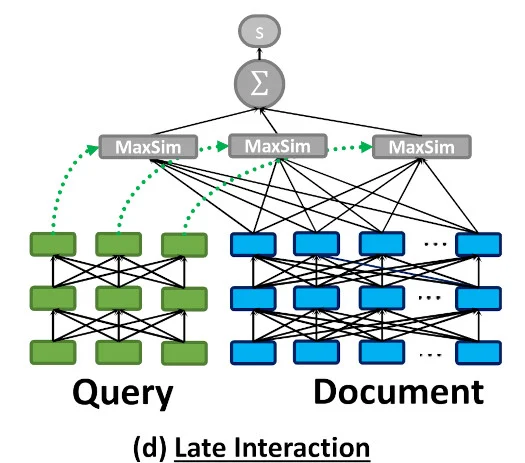

## 不是混合搜索? 另一种解决方案提高向量搜索结果相关性! 使用 PostgreSQL 中的 ColBERT rerank 增强向量搜索  
                                                      
### 作者                                                      
digoal                                                      
                                                      
### 日期                                                      
2025-08-27                                                      
                                                      
### 标签                                                      
PostgreSQL , PolarDB , DuckDB , 向量搜索 , 相关性 , 相似性 , 混合搜索 , 结果不理想 , ground truth , 嵌入(embedding) , 句子向量 , token向量 , 多向量 , 向量数组     
                                                      
----                                                      
                                                      
## 背景      
RAG严重依赖向量搜索, 但是有一个漏洞, 可能导致搜索出来的结果并不理想, 原因是`相似性!=相关性`.   
  
业界的解决办法是混合搜索( 即: 向量(语义)搜索 + 全文检索 + 模糊查询等 + rerank ), 详见这篇文章: [《AI搜索“不等于”向量搜索, 那么答案究竟是什么?》](../202508/20250826_03.md)    
  
其实还有一种解决办法: 多向量搜索.  
  
目前向量搜索结果不理想的根本原因是:  
- query`句子/段落 embedding` 与 库内`句子/段落 embedding` 的相似性  
  
换句话说, 段落由句子组成, 句子由token(词组)组成, 然而embedding对应的是token(词组)聚合后的向量值.  
  
那么能不能直接使用token(词组)的向量值进行搜索, 减少信息的丢失呢?   
  
能, 但是数据量太大了, 一句话可能包含很多个token, 一段话就更多了. 使用token搜索时会产生`笛卡尔积式`的搜索.   
  
有没有可能加速呢?   
  
这就是将介绍的 vectorchord maxsim 算子.  
  
以下内容翻译自: https://blog.vectorchord.ai/supercharge-vector-search-with-colbert-rerank-in-postgresql  
  
# 使用 PostgreSQL 中的 ColBERT rerank 增强向量搜索  
  
传统的向量搜索方法通常使用句子嵌入来定位相似内容。然而，通过`池化token嵌入`来`生成句子嵌入`可能会牺牲token级别的细粒度细节。ColBERT通过将文本表示为token级别的多向量（而非单个聚合向量）来克服这个问题。这种方法利用token级别的上下文后期交互，使[ColBERT](https://github.com/stanford-futuredata/ColBERT)能够保留更细微的信息，并比单纯依赖句子嵌入的方法提高搜索准确率。  
  
  
  
ColBERT 结构（摘自原始论文）  
  
如上图所示，ColBERT 将每个文档/查询编码为一个token向量列表(数组)，并在查询期间计算 MaxSim。  
  
Token 级的后期交互计算需要更高的算力和存储空间。这使得在大型数据集中使用 ColBERT 搜索变得极具挑战性，尤其是在低延迟至关重要的情况下。  
  
一种可能的解决方案是将句子级向量搜索与token级后期交互重排序相结合，从而利用近似向量搜索的效率和多向量相似性搜索的高质量。  
  
多向量(即向量数组)方法不仅限于纯文本检索任务，它还可以用于视觉文档理解. [参考此文](../202508/20250827_03.md) 。对于多模态检索模型，像[ColPali](https://huggingface.co/vidore/colpali-v1.3)和[ColQwen](https://huggingface.co/vidore/colqwen2-v1.0-merged)这样的先进模型直接将文档图像(pdf,扫描文本等)编码为多向量，并表现出比 OCR 转文本方法更强大的性能。  
  
本博客将演示如何使用 PostgreSQL 扩展插件 [VectorChord](https://github.com/tensorchord/VectorChord/) 和 pgvector 进行 ColBERT 重新排序。  
  
## 教程  
假设我们已经有了文档，让我们创建一个表来存储所有文档：  
  
```  
import psycopg  
from pgvector.psycopg import register_vector  
  
class PgClient:  
    def __init__(self, url: str, dataset: str, sentence_emb_dim: int, token_emb_dim: int):  
        self.dataset = dataset  
        self.sentence_emb_dim = sentence_emb_dim  
        self.token_emb_dim = token_emb_dim  
        self.conn = psycopg.connect(url, autocommit=True)  
        with self.conn.cursor() as cursor:  
            cursor.execute("CREATE EXTENSION IF NOT EXISTS vchord CASCADE;")  
        register_vector(self.conn)  
  
    def create(self):  
        with self.conn.cursor() as cursor:  
            cursor.execute(  
                f"CREATE TABLE IF NOT EXISTS {self.dataset}_corpus "  
                "(id INT BY DEFAULT AS IDENTITY PRIMARY KEY, text TEXT, "  
                f"emb vector({self.sentence_emb_dim}), embs vector({self.token_emb_dim})[]);"  
            )  
```  
  
这里我们创建了一个包含句子级嵌入和token级嵌入的表。  
  
有许多嵌入 API 和[开源模型](https://huggingface.co/spaces/mteb/leaderboard)。您可以选择适合您用例的模型。  
  
对于标记(token)级嵌入：  
```  
from colbert.infra import ColBERTConfig  
from colbert.modeling.checkpoint import Checkpoint  
  
class TokenEncoder:  
    def __init__(self):  
        self.config = ColBERTConfig(doc_maxlen=220, query_maxlen=32)  
        self.checkpoint = Checkpoint(  
            "colbert-ir/colbertv2.0", colbert_config=self.config, verbose=0  
        )  
  
    def encode_doc(self, doc: str):  
        return self.checkpoint.docFromText([doc], keep_dims=False)[0].numpy()  
  
    def encode_query(self, query: str):  
        return self.checkpoint.queryFromText([query])[0].numpy()  
```  
  
ColBERT 模型默认生成 128 维向量。  
  
插入数据：  
  
```  
class PgClient:  
    ...  
    def insert(self, documents: list[str]):  
        with self.conn.cursor() as cursor:  
            for doc in tqdm(documents):  
                sentence_emb = sentence_encoder.encode_doc(doc)  
                token_embs = [emb for emb in token_encoder.encode(doc)]  
                cursor.execute(  
                    f"INSERT INTO {self.dataset}_corpus (text, emb, embs) VALUES (%s, %s, %s)"  
                    (doc, sentence_emb, token_embs)  
                )  
```  
  
对于向量搜索部分，我们可以使用VectorChord构建高性能的RaBitQ索引：  
  
```  
class PgClient:  
    ...  
    def index(self, num_doc: int, workers: int):  
        n_cluster = 1 << math.ceil(math.log2(num_doc ** 0.5 * 4))  
        config = f"""  
        residual_quantization = true  
        [build.internal]  
        lists = [{n_cluster}]  
        build_threads = {workers}  
        spherical_centroids = false  
        """  
        with self.conn.cursor() as cursor:  
            cursor.execute(f"SET max_parallel_maintenance_workers TO {workers}")  
            cursor.execute(f"SET max_parallel_workers TO {workers}")  
            cursor.execute(  
                f"CREATE INDEX {self.dataset}_rabitq ON {self.dataset}_corpus USING "  
                f"vchordrq (emb vector_l2_ops) WITH (options = $${config}$$)"  
            )  
```  
  
为了加快索引构建过程，我们可以利用外部质心(即k-means的聚集点)构建。更多详情，请参阅[“在 VectorChord 中构建外部质心的优势和步骤”](https://blog.vectorchord.ai/benefits-and-steps-of-external-centroids-building-in-vectorchord) 。  
  
现在，我们可以查询 PostgreSQL：  
  
```  
class PgClient:  
    ...  
    def query(self, doc: str, topk: int):  
        sentence_emb = sentence_encoder.encode_query(doc)  
        with self.conn.cursor() as cursor:  
            cursor.execute(  
                f"SELECT id, text FROM {self.dataset}_corpus ORDER BY emb <-> %s LIMIT {topk}"  
            )  
            res = cursor.fetchall()  
        return res  
```  
  
为了支持MaxSim重新排名(rerank)，我们需要创建一个函数：  
  
```  
class PgClient:  
    def __init__(self, url: str, dataset: str, sentence_emb_dim: int, token_emb_dim: int):  
        ...  
        self.conn.execute("""  
            CREATE OR REPLACE FUNCTION max_sim(document vector[], query vector[]) RETURNS double precision AS $$  
            WITH queries AS (  
                SELECT row_number() OVER () AS query_number, * FROM (SELECT unnest(query) AS query)  
            ),  
            documents AS (  
                SELECT unnest(document) AS document  
            ),  
            similarities AS (  
                SELECT query_number, document <=> query AS similarity FROM queries CROSS JOIN documents  
            ),  
            max_similarities AS (  
                SELECT MAX(similarity) AS max_similarity FROM similarities GROUP BY query_number  
            )  
            SELECT SUM(max_similarity) FROM max_similarities  
            $$ LANGUAGE SQL  
        """)  
```  
  
现在，我们可以对向量搜索检索到的文档进行重新排序：  
  
```  
class PgClient:  
    def rerank(self, query: str, ids: list[int], topk: int):  
        token_embs = [emb for emb in token_encoder.encode_query(query)]  
        with self.conn.cursor() as cursor:  
            cursor.execute(  
                f"SELECT id, text FROM {self.dataset}_corpus WHERE id = ANY(%s) ORDER BY "  
                f"max_sim(embs, %s) DESC LIMIT {topk}"  
                (ids, token_embs)  
            )  
            res = cursor.fetchall()  
        return res  
```  
  
## 评估效果  
我们在多个[BEIR数据集](https://github.com/beir-cellar/beir)上测试了此方法。  
  
结果如下：  
  
数据集	| 搜索 `NDCG@10`	 | rerank `NDCG@10`  
---|---|---  
fiqa |0.23211	| 0.3033  
quora	|0.31599	| 0.3934  
  
这表明 ColBERT rerank 可以显著增强向量搜索的结果。  
  
所有相关的基准代码都可以在[这里](https://github.com/kemingy/vectorchord-colbert)找到。  
  
## 未来工作  
向量搜索和全文搜索结合 ColBERT rerank 功能可以进一步提升性能。我们还开发了 [PostgreSQL BM25](https://github.com/tensorchord/VectorChord-bm25) 扩展插件。  
  
## 参考  
https://www.answer.ai/posts/colbert-pooling.html  
  
https://github.com/stanford-futuredata/ColBERT  
  
https://github.com/tensorchord/vectorChord/  
  
https://github.com/tensorchord/VectorChord-bm25  
  
https://huggingface.co/blog/manu/colpali  
     
[《AI搜索“不等于”向量搜索, 那么答案究竟是什么?》](../202508/20250826_03.md)    
  
[《用多向量搜索支持 无OCR的RAG》](../202508/20250827_03.md)  
    
#### [期望 PostgreSQL|开源PolarDB 增加什么功能?](https://github.com/digoal/blog/issues/76 "269ac3d1c492e938c0191101c7238216")
  
  
#### [PolarDB 开源数据库](https://openpolardb.com/home "57258f76c37864c6e6d23383d05714ea")
  
  
#### [PolarDB 学习图谱](https://www.aliyun.com/database/openpolardb/activity "8642f60e04ed0c814bf9cb9677976bd4")
  
  
#### [PostgreSQL 解决方案集合](../201706/20170601_02.md "40cff096e9ed7122c512b35d8561d9c8")
  
  
#### [德哥 / digoal's Github - 公益是一辈子的事.](https://github.com/digoal/blog/blob/master/README.md "22709685feb7cab07d30f30387f0a9ae")
  
  
#### [About 德哥](https://github.com/digoal/blog/blob/master/me/readme.md "a37735981e7704886ffd590565582dd0")
  
  

  
