## AI论文解读 | Advances in Residual Vector Quantization: A Review
        
### 作者        
digoal        
        
### 日期        
2025-08-28       
        
### 标签        
PostgreSQL , PolarDB , DuckDB , AI , 论文解读        
        
----        
        
## 背景  
      
https://ieeexplore.ieee.org/stamp/stamp.jsp?tp=&arnumber=480761  

https://ieeexplore.ieee.org/abstract/document/480761  
  
提示:          
```          
读懂《Advances in Residual Vector Quantization: A Review》这篇论文需要提前掌握哪些基础知识, 请使用中文通熟易懂的讲解这些基础知识, 可以引用论文中的图、表或使用Markdown支持的图形(text,mermaid等)增加解释性. 
  
使用中文通熟易懂的解读《Advances in Residual Vector Quantization: A Review》这篇论文, 其中的关键内容请着重讲解, 可以引用论文中的图、表或使用Markdown支持的图形(text,mermaid等)增加解释性. 
  
提取《Advances in Residual Vector Quantization: A Review》这篇论文中的重要术语, 使用中文对这些术语进行通熟易懂的讲解, 可以引用论文中的图、表或使用Markdown支持的图形(text,mermaid等)增加解释性. 
```     
  
## 1 前置知识 
  
理解这篇《Advances in Residual Vector Quantization: A Review》论文，您需要先掌握一些核心的基础知识。以下我将为您分步讲解这些概念，以便您更好地理解论文内容。

-----

### 1\. 向量量化 (Vector Quantization, VQ)

**向量量化 (VQ)** 是数字信号处理中的一种数据压缩方法。它将高维度的向量数据，映射成一个有限的、离散的“码本”中的某个向量，从而达到压缩数据的目的。

可以把它想象成一个“字典”查找过程：

1.  **输入向量 (Input Vector)**：原始的高维数据，比如一张图片中的一小块像素集合。
2.  **码本 (Codebook)**：一个预先设计好的、包含有限数量的“代表性”向量（也叫**码字**或**码向量**）的集合。这就像一本字典，里面的每个词条（码字）都代表了一类事物。
3.  **编码器 (Encoder)**：根据某种规则，比如找到与输入向量距离最近的码字，将输入向量映射为该码字在码本中的索引（一个整数）。这个索引就是压缩后的数据。
4.  **解码器 (Decoder)**：接收到这个索引后，从码本中找到对应的码字向量，作为原始向量的近似重建。

这个过程的目的是在保证可接受的失真（即重建后的向量与原始向量的差异）下，最大化压缩比。

### 2\. 残差向量量化 (Residual Vector Quantization, RVQ)

**残差向量量化 (RVQ)** 是 VQ 的一种特殊结构，旨在解决传统 VQ 在高维度或高码率下，计算和存储成本呈指数级增长的问题 。RVQ 的核心思想是**分阶段进行量化**。

它不是一次性量化整个输入向量，而是像“分步”解决问题一样：

1.  **第一阶段**：首先对原始输入向量进行第一次量化，得到一个初步的近似向量。
2.  **计算残差 (Residual)**：用原始向量减去第一阶段的近似向量，得到一个“残差”或“误差”向量。这个残差向量就是原始向量中尚未被量化的信息。
3.  **后续阶段**：将这个残差向量作为新的输入，送入下一阶段的量化器进行量化。
4.  **重复过程**：重复以上步骤，直到残差小到可以忽略不计，或达到预设的阶段数。

最后，每个阶段产生的码字会相加起来，共同组成一个完整的重建向量 。

论文中的图1清晰地展示了这个过程： 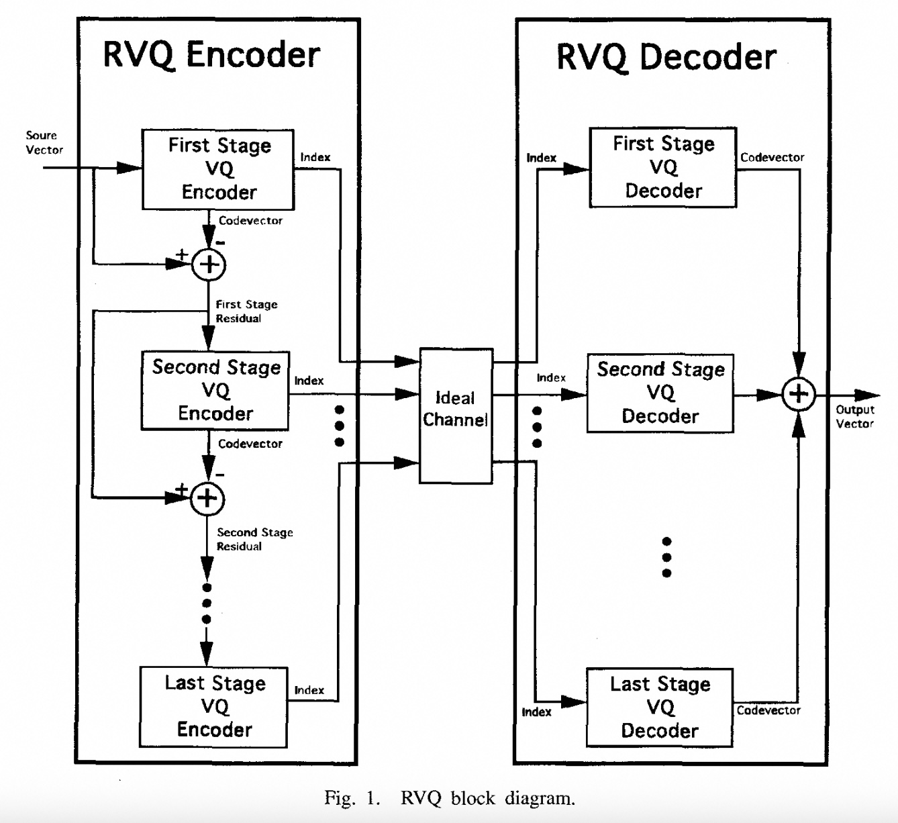  

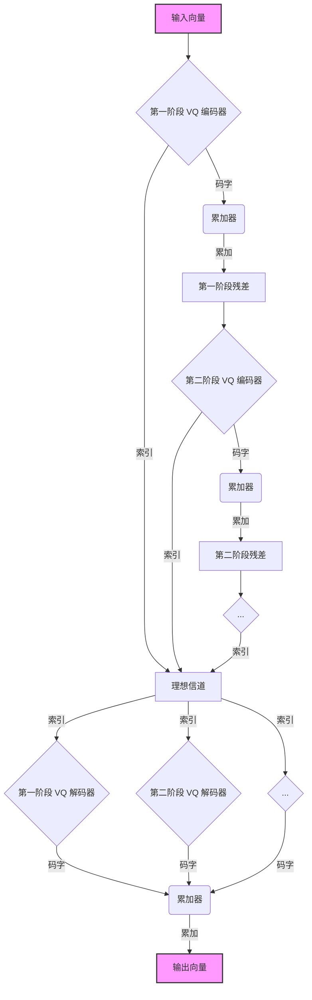

  * **编码器 (Encoder)**：左侧部分，逐级处理残差，并将每个阶段的索引发送出去。
  * **解码器 (Decoder)**：右侧部分，接收所有索引，然后将每个阶段对应的码字相加，重建出最终的向量。

### 3\. 关键概念和设计原则

这篇论文的重点在于 RVQ 的设计方法，因此理解以下几个概念至关重要：

  * **直和码本 (Direct Sum Codebook)**：RVQ 码本的结构特点 。它不是一个单一的大码本，而是由每个阶段的小码本相加而成 。这种结构大大减少了存储需求 。
  * **顺序搜索 (Sequential Search)**：RVQ 编码器查找码字的方式 。它按照阶段顺序，依次为每个残差向量找到最佳匹配的码字。这种搜索方式降低了计算复杂度 。
  * **联合优化 (Joint Optimization)**：这是论文讨论的重点之一。早期的 RVQ 设计方法是“顺序设计”，即每个阶段只考虑前一阶段的误差，而忽略了后续阶段的误差（所谓的“逆向因果误差”）。联合优化则是一种更优的设计方法，它同时考虑所有阶段的误差，以达到整体失真最小化 。
  * **因果误差与逆向因果误差 (Causal and Anticausal Errors)**：
      * **因果误差 (Causal Error)**：由当前阶段之前的量化错误所产生的残差 。
      * **逆向因果误差 (Anticausal Error)**：由当前阶段之后的量化错误所产生的误差 。联合优化方法正是通过最小化这两种误差来提高性能的 。

理解这些基础知识后，您将能更好地把握论文中关于 RVQ 设计方法（如**顺序更新法**、**联合更新法**）、各种 RVQ 变体（如**预测 RVQ**、**有限状态 RVQ**）以及其在图像和视频编码中应用（如**小波变换**）的讨论。
  
## 2 解读论文 
  
好的，我们来一起深入解读这篇经典的综述性论文《Advances in Residual Vector Quantization: A Review》。

这篇论文发表于1996年，由Christopher F. Barnes等人撰写，是对残差向量量化（Residual Vector Quantization, RVQ）技术的一次全面回顾和展望。它不仅是该领域的入门佳作，也为后续的研究指明了方向。

我将为你提炼并解读其中的关键内容。

-----

### **核心思想：RVQ——化整为零，逐层逼近**

想象一下，你要用一套有限的“标准色块”去拼凑一幅复杂的图像。

  * **传统的向量量化 (Vector Quantization, VQ)**：就像有一个巨大无比的调色盘，包含所有可能用到的复杂色块。对于图像中的每一小块区域，你都要在这个巨大的调色盘里找到最接近的那一个。这种方法理论上效果最好，但问题是，这个“调色盘”的尺寸（即码本大小）会随着图像块的复杂度和色彩精度的要求呈指数级增长，导致计算和存储开销变得无法承受。论文中提到，其成本与 $2^{rk}$ 成正比，其中r是比特率，k是向量维度。

  * **残差向量量化 (Residual Vector Quantization, RVQ)**：为了解决这个问题，RVQ提出了一种“分步走”的策略。它不用一个巨大的调色盘，而是用多个小调色盘。

    1.  **第一步**：先用第一个小调色盘，为原始图像块找一个“大概差不多”的色块。
    2.  **第二步**：用原始图像块减去这个“大概差不多”的色块，得到一个“残差”（Residual），也就是误差。这个残差本身也是一小块图像数据。
    3.  **第三步**：再用第二个小调色盘，为这个“残差”找一个最匹配的修正色块。
    4.  **重复**：不断地对上一部的残差进行量化，直到精度足够。

最终，原始图像块就约等于“第一步的色块 + 第二步的修正色块 + 第三步的修正色块 + ...”。这种化整为零、逐层逼近的思想，就是RVQ的核心。它极大地降低了计算和存储的复杂度。

我们可以用下面的流程图来直观地理解这个过程，它等同于论文中的图1（Fig. 1）：    

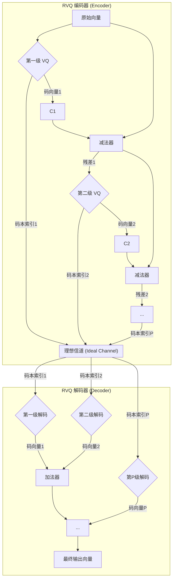

**解读**：

  * **编码器**：输入一个原始向量（如一个4x4的图像块），经过第一级VQ编码，输出一个索引（Index）和一个码向量（Codevector）。原始向量减去这个码向量得到残差，残差再输入给下一级VQ，依此类推。
  * **解码器**：接收到所有层级的索引后，从各级码本中取出对应的码向量，并将它们全部加起来，就重构出了最终的输出向量。

-----

### **关键内容一：RVQ的设计难题——“贪心” vs. “远见”**

RVQ虽然结构简单，但如何设计每一级的“小调色盘”（即码本）却是个大问题。

#### 1\. 序贯设计 (Sequential Design)：简单但“贪心”

最直观的方法是：

1.  用标准算法（如GLA）为原始数据设计出第一级码本。
2.  计算出所有数据的残差。
3.  再用同样的算法为这些残差设计第二级码本。
4.  ...依此类推。

这种方法被称为**序贯GLA设计**。它的问题在于 **“贪心”** 或者说“短视”。在设计第一级码本时，它只想着如何让当前的误差最小化（论文中称为 **因果误差 Causal Error** ），完全没有考虑这个决定会给后续的层级带来多大的麻烦（论文中称为**非因果误差 Anticausal Error**）。

如论文图10和图11所示，使用这种贪心方法设计的RVQ，尤其是在层级很多（例如20级）的情况下，性能会急剧下降，其信噪比（SNR）远低于理论上限。图11的码向量星座图显示，码向量分布非常不理想，很多都挤在一起，没有充分利用信号空间。

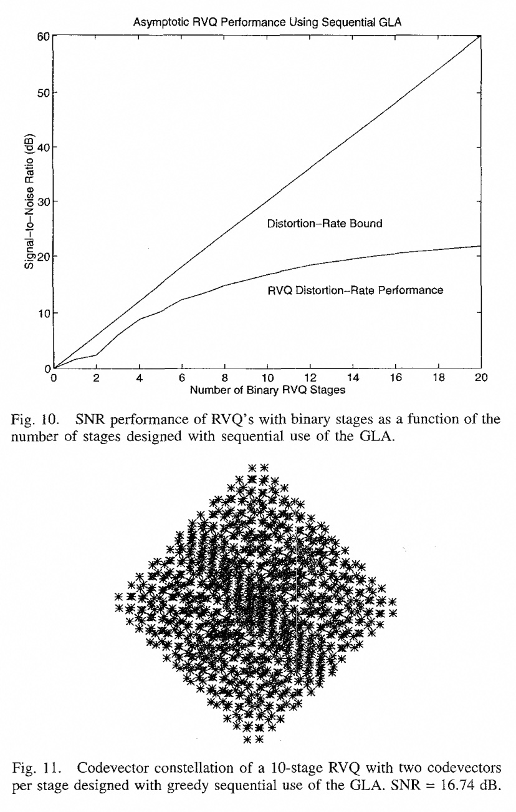  

  

#### 2\. 联合优化 (Joint Optimization)：复杂但有“远见”

更理想的方法是**联合优化**。它的目标是同时优化**所有**层级的码本，使得**最终的**重构误差最小。这意味着在更新第一级的码本时，需要同时考虑到第二、三、四...级码本会如何补偿它的误差。

这就像下棋，不能只看眼前一步，还要预判后面几步的走势。这显然比“走一步看一步”的序贯设计要好，但实现起来也复杂得多。论文中比较了几种联合优化的方法，如：

  * **Chan和Gersho的序贯更新法**：交替更新编码器和解码器的某一级。
  * **Barnes和Frost的交错不动点法**：使用内外两个循环，内循环专门用于联合优化所有解码器层级，直到收敛，再进行外循环的下一次迭代。这种方法更彻底，但也更容易不稳定。

**核心 takeaway**：简单的序贯设计性能很差，尤其是在多层级时。**联合优化是提升RVQ性能的关键**，尽管它更复杂且存在稳定性问题。

-----

### **关键内容二：RVQ的“天敌”——码本纠缠 (Entanglement)**

这是论文中一个非常形象且核心的概念。RVQ的结构可以看作一棵树，从根节点（原点）出发，第一级码向量是第一层节点，第一级和第二级码向量之和是第二层节点（叶子节点），以此类推。

  * **无纠缠的树 (Unentangled Tree)**：如图12所示，树的结构非常规整，分支之间互不交叉。这种结构下，简单的序"贪心"搜索（在每一级都选择离当前残差最近的码向量）通常是有效的。
    *论文图12：一个两级、每级4个码向量的RVQ树结构（无纠缠）*

  * **纠缠的树 (Entangled Tree)**：如图13所示，树的各个分支互相缠绕、交叉。
    *论文图13：一个四级、每级2个码向量的RVQ树结构（纠缠）*

  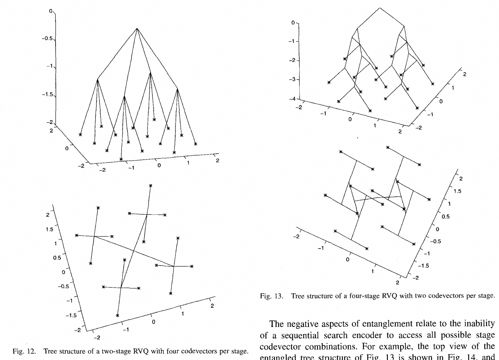  

**纠缠是把双刃剑**：

  * **优点**：纠缠的结构允许最终的码向量（叶子节点）在空间中进行更灵活、更优化的排列。如论文的实验所示（图7 vs 图8），纠缠的四级RVQ（SNR=9.55 dB）性能反而优于结构更简单的两级RVQ（SNR=9.42 dB）。这说明纠缠**蕴含了获得更高性能的潜力**。 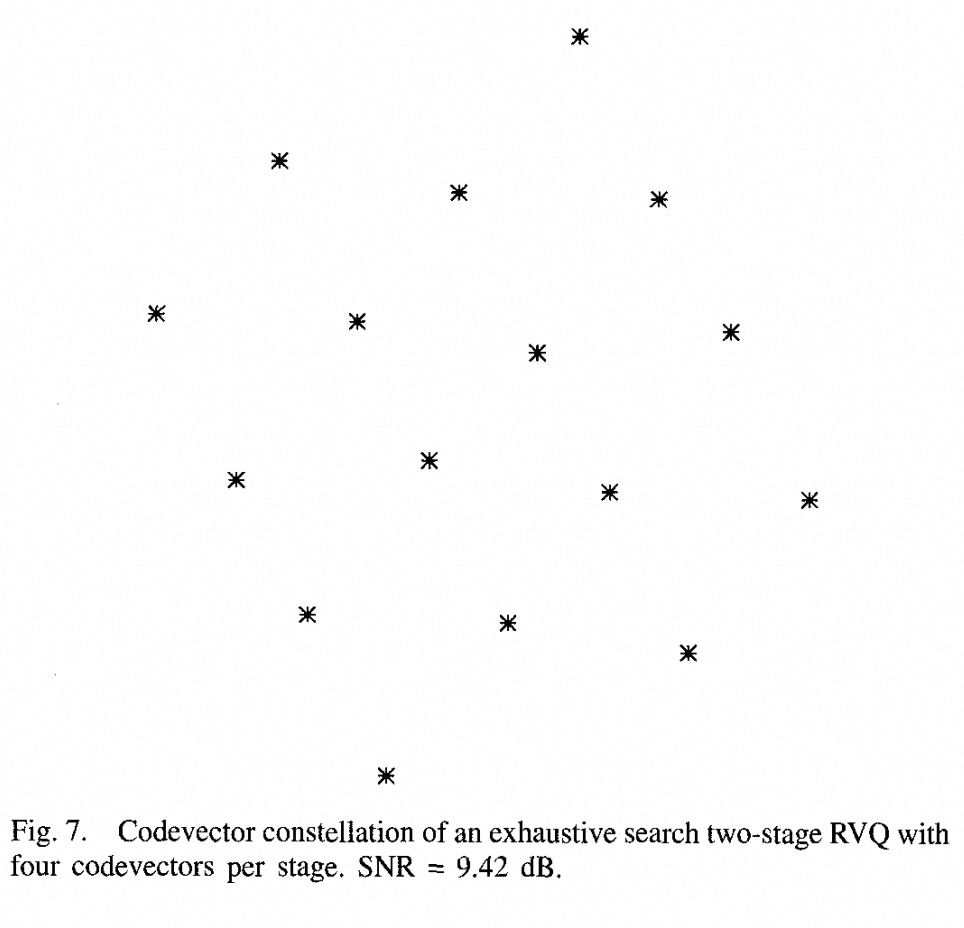   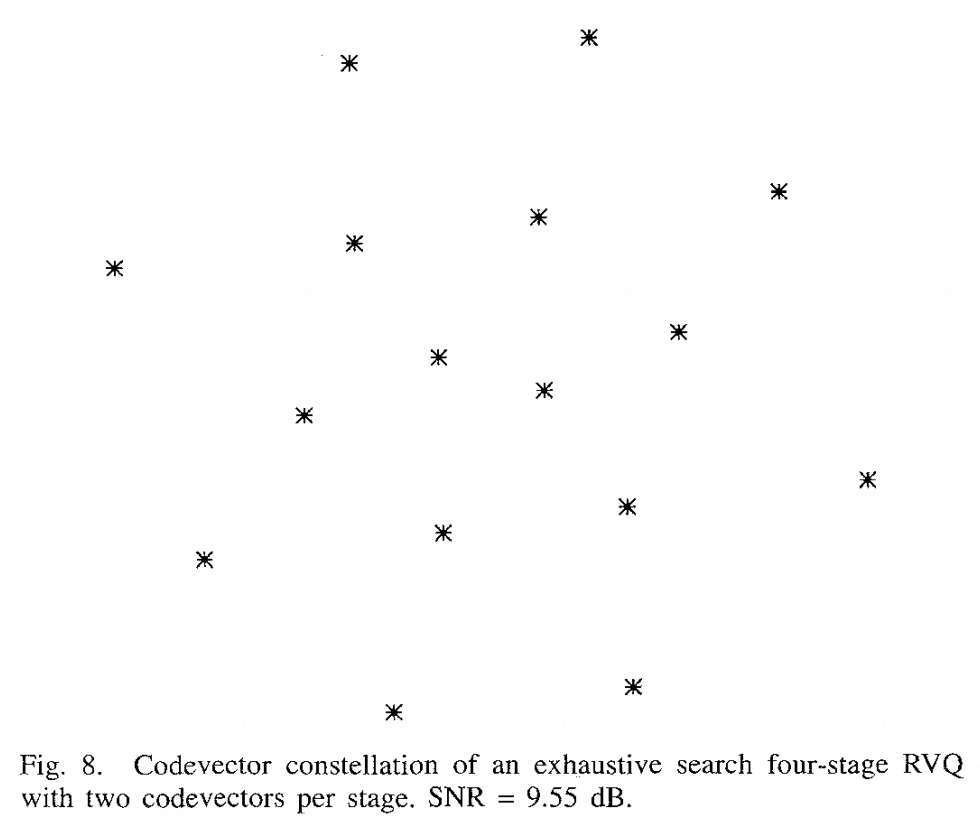   
  * **缺点（天敌的由来）**：纠缠对于简单的序贯搜索是**致命的**。由于分支交叉，在某一级做出的“局部最优”选择，很可能让你错过全局最优的路径。更糟糕的是，某些最终的码向量（叶子节点）在简单的序贯搜索下可能**永远无法被选中**，成了“死木”（dead wood），从而降低了码本的有效利用率。

**如何驯服“天敌”**？
论文提出，不能因噎废食，完全消除纠缠。而是应该采用 **“纠缠容忍”的编码器 (Entanglement-Permissive Encoders)** 。其中最经典的就是 **M-search 算法**。

  * **M-search**：在每一级搜索时，不再只保留一个最优的选择，而是保留 **M** 个次优的选择。在下一级，对这 M 条路径都进行扩展，然后再从所有扩展出的新路径中，选出新的 M 个最优路径。通过这种方式，大大增加了找到全局最优路径的概率，从而在享受纠缠带来的性能增益的同时，避免了其对序贯搜索的负面影响。

-----

### **关键内容三：RVQ的高级应用与变种**

这篇论文作为一篇综述，还介绍了RVQ在多个方向上的扩展应用。

#### 1\. 逐次逼近 (Successive Approximation)

这是RVQ最自然、最强大的一个特性。由于RVQ的解码过程是码向量的累加，解码器可以：

  * 只接收第一级的索引，解码得到一个**粗糙**的图像。
  * 再接收第二级的索引，解码并与第一级结果相加，得到一个**更清晰**的图像。
  * ...以此类推。

这完美地支持了**渐进式传输（Progressive Transmission）**，比如网页上先快速显示一张模糊的图片，然后图片逐渐变清晰。这是很多其他VQ结构难以高效实现的。

论文还介绍了两种可变比特率的RVQ编码器（Type I 和 Type II，如图28和29），它们可以智能地为图像的不同区域分配不同数量的量化层级（例如，为平滑区域分配少量层级，为纹理复杂区域分配更多层级），从而实现更高效的压缩。 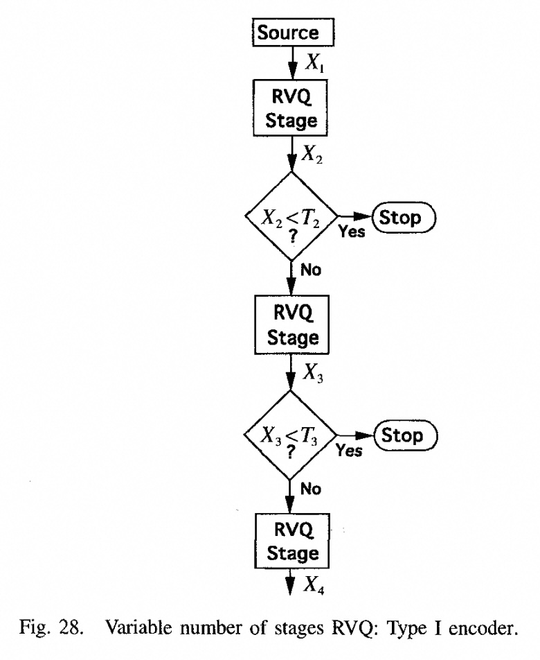   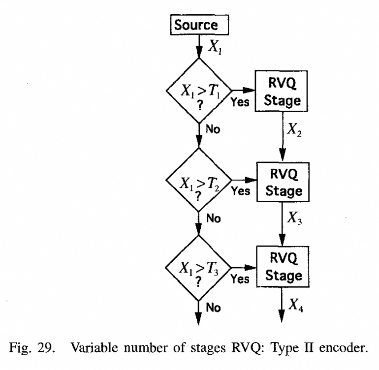   

#### 2\. 带记忆的RVQ (RVQ with Memory)

标准的RVQ处理每一个图像块时都是独立的。但实际上，相邻的图像块之间通常有很强的相关性。带记忆的RVQ就是为了利用这种相关性。

  * **预测RVQ (Predictive RVQ, PRVQ)**：先根据已编码的相邻块，**预测**当前块的内容，然后只对**预测误差**（通常比原始块信息量小得多）进行RVQ编码。
  * **有限状态RVQ (Finite-State RVQ, FSRVQ)**：维护一个“状态”，该状态由先前编码的块决定。每个状态都有自己专属的一套RVQ码本。根据当前状态选择合适的码本进行编码。

如论文中的表II和表III所示，PRVQ和FSRVQ的性能均优于无记忆的RVQ和标准VQ，因为它们有效利用了块间冗余。 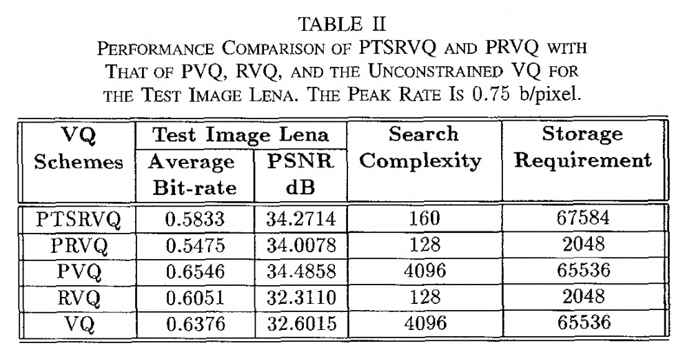  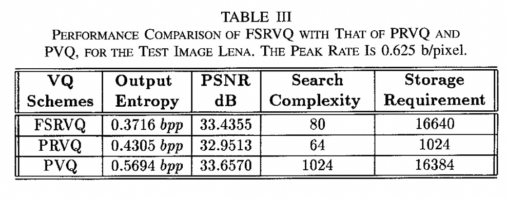  

#### 3\. 与熵编码结合 (Entropy Coding)

RVQ产生的索引序列并非是均匀分布的，某些索引组合出现的概率更高。利用这一点，可以使用熵编码（如Huffman编码、算术编码）对索引序列进行进一步的无损压缩。论文指出，RVQ的结构（特别是纠缠导致的“死木”）天然地降低了输出索引的熵，使其非常适合与熵编码结合，从而获得更高的压缩率。

-----

### **总结与贡献**

这篇论文系统性地梳理了RVQ技术的理论、实践与挑战，其主要贡献可以总结为：

1.  **明确了核心矛盾**：指出了RVQ设计的根本矛盾在于，既要通过**多级直和结构 (Direct Sum Structure)** 降低复杂度，又要克服**序贯搜索 (Sequential Search)** 带来的性能损失。
2.  **提出了关键概念“纠缠”**：首次深刻地阐述了码本纠缠现象，并分析了其优缺点，为理解和设计高性能RVQ提供了全新的视角。
3.  **强调了联合优化的重要性**：通过对比分析，证明了联合优化相对于简单序贯设计的巨大优势，并回顾了实现联合优化的多种技术路径。
4.  **展示了广阔的应用前景**：全面介绍了RVQ在逐次逼近、预测编码、可变速率编码等方面的强大能力，证明了它不仅仅是一个理论模型，更是一个具有高度实用价值的工具。

总而言之，《Advances in Residual Vector Quantization: A Review》是一篇高屋建瓴的著作，它清晰地告诉我们，RVQ通过巧妙的“分而治之”策略，在性能和复杂度之间取得了绝佳的平衡，而驾驭其性能的关键在于理解并善用“联合优化”与“码本纠缠”。
  
## 3 术语 
  
要读懂《Advances in Residual Vector Quantization: A Review》这篇论文，掌握其中的核心术语至关重要。以下我为您整理并用中文通俗易懂地讲解这些重要术语：

-----

### 1\. 向量量化 (Vector Quantization, VQ)

**向量量化**，简称 **VQ**，是一种将高维数据进行压缩的技术。您可以把它想象成一个“字典”或“码本”，里面收录了许多具有代表性的“词条”（称为**码字**或**码向量**）。

  * **工作原理**: 当我们有一个新的数据向量（比如一段音频或一小块图像），我们会在这个“字典”里找到与它最相似的那个“词条”，然后用这个“词条”的索引（一个简单的数字）来代替原始的复杂数据。
  * **优点**: 大大减少了需要存储或传输的数据量。
  * **缺点**: 如果“字典”太小，可能会导致压缩后的数据失真严重；如果“字典”太大，查找起来又非常耗时。

### 2\. 残差向量量化 (Residual Vector Quantization, RVQ)

**残差向量量化**，简称 **RVQ**，是 VQ 的一种高级形式，旨在解决传统 VQ 的字典规模过大问题。它的核心思想是“分阶段、逐步逼近”。

  * **工作原理**: RVQ 不会一次性找到最相似的码字，而是分多步进行：
    1.  **第一步**: 先进行一次粗略的量化，找到一个初步的近似向量。
    2.  **计算残差**: 用原始向量减去这个近似向量，得到一个“残差”向量，它包含了第一次量化后剩下的误差信息。
    3.  **循环**: 将这个残差向量作为新的输入，再用一个独立的码本进行第二次量化。
    4.  **最终结果**: 这个过程可以重复多次，每个阶段都会生成一个索引，所有这些索引加起来就构成了最终的压缩结果。

论文中的图2展示了这个过程，它被称为**累加型（additive）残差向量量化器**。 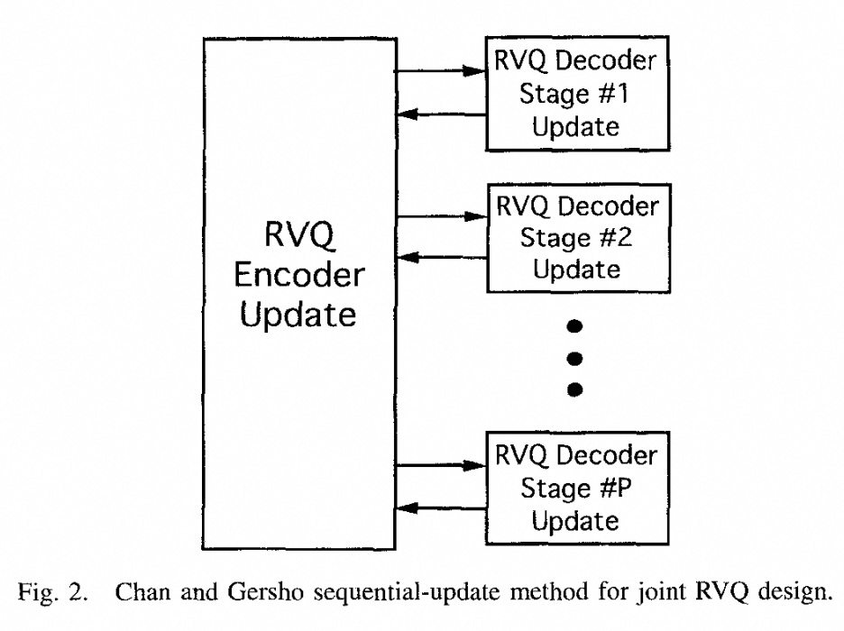  

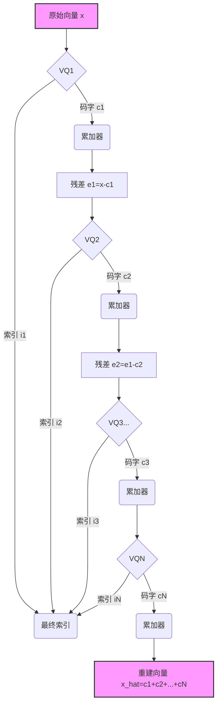

  * **优点**: 每一个阶段只需要一个很小的码本，这大大降低了总体的存储和计算需求。

### 3\. 联合优化 (Joint Optimization)

传统的 RVQ 设计通常是“顺序”的，即一个阶段一个阶段地独立进行优化，这可能导致最终的重建效果不是最优的。

  * **联合优化**：是一种更先进的设计方法。它不单独优化每个阶段，而是**同时考虑所有阶段的量化误差**，通过一个统一的优化目标来训练整个 RVQ 系统，从而让所有阶段的码本能够协同工作，达到整体失真最小化。
  * **论文中的论述**: 这篇论文的一个重要主题就是讨论如何实现联合最优的编码器和解码器设计。

### 4\. 预测 RVQ (Predictive RVQ) 和 有限状态 RVQ (Finite State RVQ)

这些是 RVQ 的两种特殊变体，旨在利用数据之间的相关性来进一步提高压缩效率。

  * **预测 RVQ**: 类似于传统的预测编码，它会先根据相邻的已编码数据来“预测”当前的向量，然后只对**预测误差**进行 RVQ 编码。这种方法特别适用于视频等时间序列数据。
  * **有限状态 RVQ**: 这种方法会根据先前编码的向量来决定当前应该使用哪个“子码本”进行量化。它的核心思想是利用**上下文信息**来更精确地选择码本，就像在对话中根据前文来预测后面的词汇一样。

### 5\. 逐次逼近 RVQ (Successive Approximation RVQ)

这是一种非常实用的 RVQ 变体，它的主要特点是支持“嵌入式”或“可分级”的编码。

  * **工作原理**: 它分阶段地产生编码结果，先传输第一阶段的粗略信息，如果需要更高质量，再传输第二阶段、第三阶段的信息。
  * **应用场景**: 这对于网络传输非常有用。比如，你可以在低带宽下先快速加载一个低分辨率的图片，然后随着带宽的增加，逐步加载更多细节，直到获得完整的高分辨率图片。这种技术在论文中被应用于图像小波变换编码系统。
  
## 参考        
         
https://ieeexplore.ieee.org/stamp/stamp.jsp?tp=&arnumber=480761  
  
https://ieeexplore.ieee.org/abstract/document/480761  
        
<b> 以上内容基于DeepSeek、Qwen、Gemini及诸多AI生成, 轻微人工调整, 感谢杭州深度求索人工智能、阿里云、Google等公司. </b>        
        
<b> AI 生成的内容请自行辨别正确性, 当然也多了些许踩坑的乐趣, 毕竟冒险是每个男人的天性.  </b>        
    
#### [期望 PostgreSQL|开源PolarDB 增加什么功能?](https://github.com/digoal/blog/issues/76 "269ac3d1c492e938c0191101c7238216")
  
  
#### [PolarDB 开源数据库](https://openpolardb.com/home "57258f76c37864c6e6d23383d05714ea")
  
  
#### [PolarDB 学习图谱](https://www.aliyun.com/database/openpolardb/activity "8642f60e04ed0c814bf9cb9677976bd4")
  
  
#### [PostgreSQL 解决方案集合](../201706/20170601_02.md "40cff096e9ed7122c512b35d8561d9c8")
  
  
#### [德哥 / digoal's Github - 公益是一辈子的事.](https://github.com/digoal/blog/blob/master/README.md "22709685feb7cab07d30f30387f0a9ae")
  
  
#### [About 德哥](https://github.com/digoal/blog/blob/master/me/readme.md "a37735981e7704886ffd590565582dd0")
  
  

  
