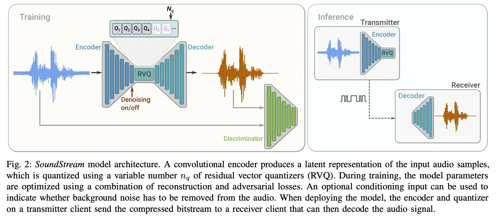
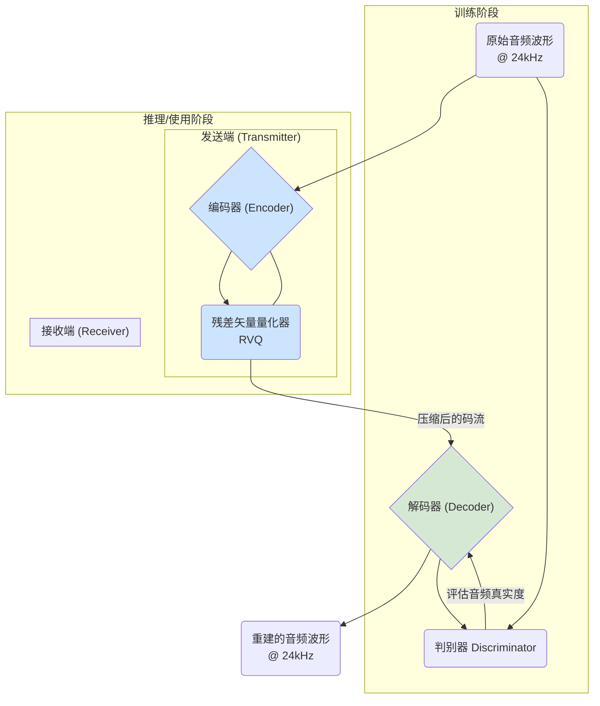
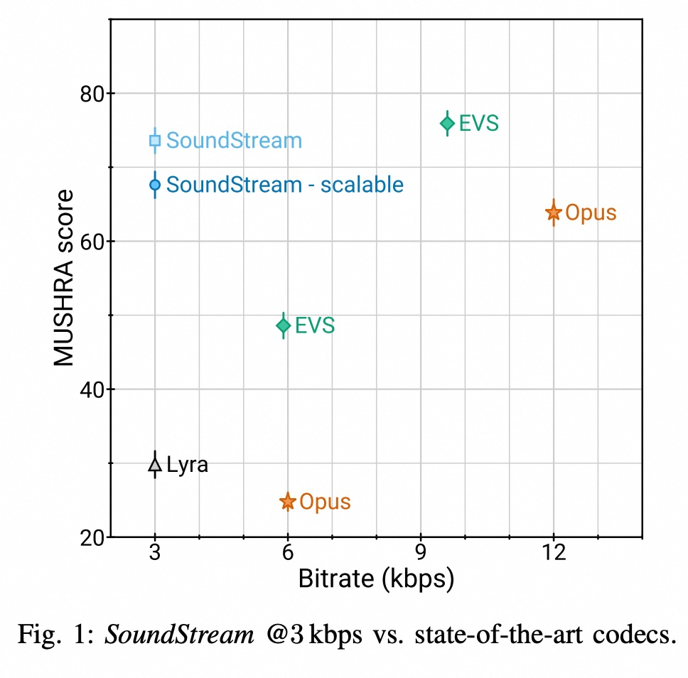
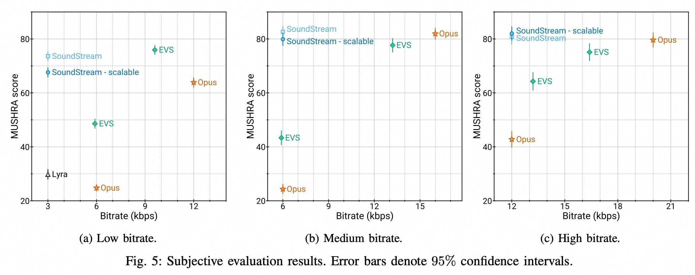
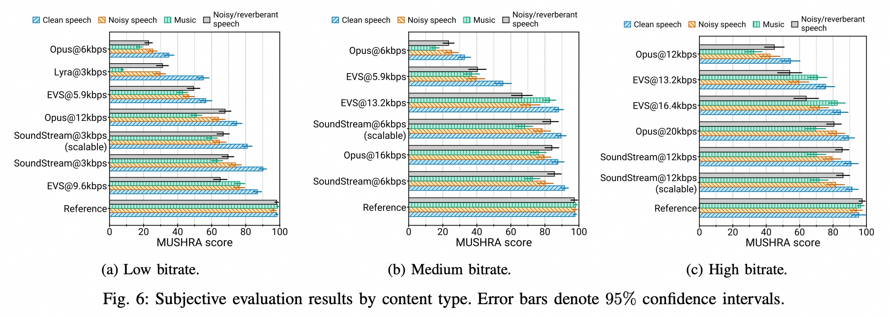
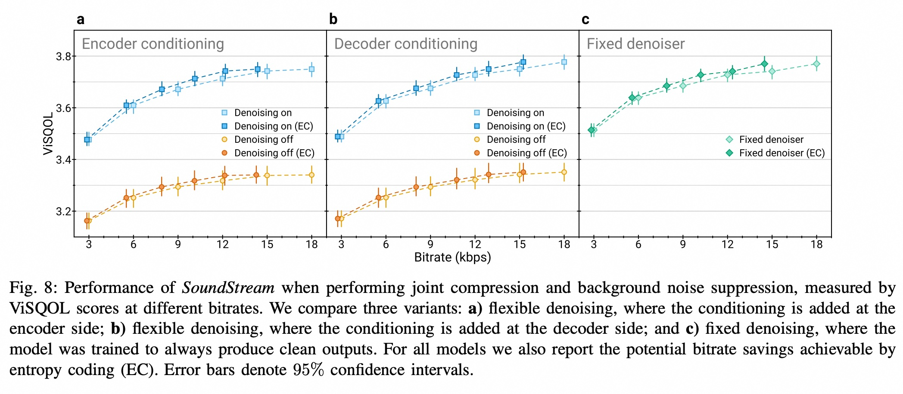

## AI论文解读 | SoundStream: An End-to-End Neural Audio Codec
        
### 作者        
digoal        
        
### 日期        
2025-08-28       
        
### 标签        
PostgreSQL , PolarDB , DuckDB , AI , 论文解读        
        
----        
        
## 背景  
      
https://arxiv.org/pdf/2107.03312        
  
提示:          
```          
读懂《SoundStream: An End-to-End Neural Audio Codec》这篇论文需要提前掌握哪些基础知识, 请使用中文通熟易懂的讲解这些基础知识, 可以引用论文中的图、表或使用Markdown支持的图形(text,mermaid等)增加解释性. 
  
使用中文通熟易懂的解读《SoundStream: An End-to-End Neural Audio Codec》这篇论文, 其中的关键内容请着重讲解, 可以引用论文中的图、表或使用Markdown支持的图形(text,mermaid等)增加解释性. 
  
提取《SoundStream: An End-to-End Neural Audio Codec》这篇论文中的重要术语, 使用中文对这些术语进行通熟易懂的讲解, 可以引用论文中的图、表或使用Markdown支持的图形(text,mermaid等)增加解释性. 
```     
  
## 1 前置知识 
  
想要读懂这篇《SoundStream: An End-to-End Neural Audio Codec》论文，你需要掌握一些基础的深度学习和音频处理知识。这篇论文的核心在于将这些技术融合在一起，创造了一个新的音频编解码器。

以下是理解这篇论文所需掌握的关键概念：

-----

### 1\. 什么是编解码器 (Codec)

简单来说，编解码器（Codec）就是将音频信号从原始格式压缩到更小、更易于传输的格式，然后在另一端将其解压缩并恢复成可听的音频。

  * **传统编解码器**: 论文中提到了 Opus 和 EVS 等传统编解码器，它们通常依赖于人工设计的信号处理方法。例如，将音频分解为时间和频率上的系数，然后进行量化和编码 。
  * **神经编解码器 (Neural Audio Codec)**: 就像 SoundStream 一样，这类编解码器使用深度学习模型来处理音频。它们不需要复杂的人工规则，而是通过“端到端”（end-to-end）的方式，直接从数据中学习如何压缩和恢复音频。

### 2\. 端到端 (End-to-End) 深度学习

“端到端”是指整个系统（从输入到输出）作为一个整体进行训练，而不是将每个部分分开训练。

  * **工作流程**: 在 SoundStream 中，这意味着编码器（Encoder）、量化器（Quantizer）和解码器（Decoder）被一起训练，共同优化最终的音频质量。这与以前的方法不同，以前的方法可能会学习固定的特征，然后只训练一个解码器 。这种端到端的方式能让模型学习到更高效、更具表现力的音频压缩方式。

### 3\. 编解码器的基本架构：编码器和解码器

SoundStream 的模型架构类似于一个**自编码器** (Autoencoder) ，它由两部分组成：

  * **编码器 (Encoder)**: 负责接收原始音频波形，并将其压缩成一个更小的、更密集的“**嵌入**”（embeddings）或“**潜在表示**”（latent representation） 。论文中 SoundStream 使用的是**全卷积网络**（fully convolutional network） 。
  * **解码器 (Decoder)**: 负责接收编码器输出的压缩后的表示，并尝试将其还原成接近原始波形的音频 。解码器也使用了全卷积网络，并且与编码器的结构相似，但执行相反的操作，例如使用转置卷积进行上采样 。

这个架构在论文图2中有清晰的展示：   

### 4\. 关键压缩技术：残差向量量化器 (RVQ)

这是论文中最核心的创新点之一，解决了传统量化中比特率过高的问题 。

  * **向量量化 (Vector Quantization, VQ)**: 这是一个将高维空间中的点映射到离散“码本”（codebook）中的离散向量的过程 。它将连续的潜在表示转换为可以被编码为比特流的离散符号。
  * **残差向量量化 (Residual Vector Quantization, RVQ)**: 为了解决码本规模指数级增长的问题，SoundStream 采用了一种“多级”的量化方法 。它不是一次性量化整个向量，而是分步进行：
    1.  用第一个量化器对输入的向量进行量化。
    2.  计算量化后与原始向量之间的**残差**（residuals）。
    3.  用第二个量化器对这个残差进行量化。
    4.  重复这个过程，直到达到所需的量化层数 。

这种方法大大降低了每个量化器码本的规模，从而使得整个系统在计算上可行 。

### 5\. 训练机制：对抗性损失和重构损失

SoundStream 的高质量输出得益于其独特的训练目标，它结合了两种重要的损失函数 ：

  * **重构损失 (Reconstruction Loss)**: 这部分损失确保模型恢复出的音频波形在数学上尽可能接近原始波形 。
  * **对抗性损失 (Adversarial Loss)**: 这是一个来自**生成对抗网络 (GAN)** 的概念。模型中有一个“**生成器**”（Generator，即编码器和解码器）和一个“**判别器**”（Discriminator） 。
      * **生成器**的任务是生成以假乱真的音频。
      * **判别器**的任务是判断输入的音频是原始音频还是生成器产生的假音频 。
      * 两者在训练中互相博弈，生成器不断提升生成质量以骗过判别器，而判别器则不断提升辨别能力。最终，这使得生成器能够生成在听觉上非常自然、高质量的音频 。论文中提到了两种判别器：基于波形的和基于短时傅里叶变换（STFT）的 。

### 6\. 位率可扩展性 (Bitrate Scalability)

这是一项非常实用的功能，允许一个单一模型在不同比特率下工作，而无需为每个比特率单独训练一个模型 。

  * **工作原理**: 论文中介绍了一种名为“**量化器丢弃**”（quantizer dropout）的训练技术。在训练时，模型会随机使用不同数量的量化器层（ $n\_{q}$ ），这使得模型可以适应从低比特率到高比特率的不同需求 。
  * **优势**: 在实际使用时，可以根据所需的比特率选择使用不同数量的量化器层，而不需要改变模型的架构 。

-----

掌握了这些概念，你就可以更好地理解论文中 SoundStream 模型的运作原理、它如何实现高效压缩以及其在音频质量上超越传统编解码器的原因。
  
## 2 解读论文 
  
好的，我们来一起用通俗易懂的方式解读这篇重量级的论文——《SoundStream: An End-to-End Neural Audio Codec》。

### **核心摘要：SoundStream是什么？**

简单来说，SoundStream 是一个**革命性的AI音频压缩技术（编解码器）** 。它的核心思想是使用一个单一的、端到端的深度神经网络，来完成音频的压缩和解压 。

它最颠覆的地方在于，**能用比现有顶尖技术（如Opus、EVS）低得多的码率（数据量），实现同等甚至更好的音质** 。想象一下，原来需要12kbps才能流畅传输的高质量语音，现在用SoundStream只需3kbps就能搞定，数据量节省了75%，这对实时通信、流媒体等领域意义重大。

-----

### **1. 关键亮点与贡献**

这篇论文的贡献可以总结为以下几点：

  * **惊人的压缩效率**：在主观听感测试中，SoundStream在3kbps码率下的音质超越了12kbps的Opus，并接近9.6kbps的EVS 。这意味着它可以用3到4倍的效率压缩音频 。
  * **端到端学习**：不同于传统编解码器需要手动设计各种信号处理模块（如滤波器、变换等），SoundStream的编码器、解码器和压缩核心（量化器）都是通过数据学习自动优化的，浑然一体 。
  * **强大的通用性**：它不仅能处理语音，还能高质量地压缩音乐和各种复杂的环境音 。这是传统语音编解码器难以做到的，尤其是在极低码率下 。
  * **码率可伸缩性 (Bitrate Scalability)**：通过一种名为“量化器丢弃 (quantizer dropout)”的巧妙训练技巧，**单个SoundStream模型就能支持从3kbps到18kbps的多种不同码率**，无需为每个码率都训练一个新模型，非常实用 。
  * **压缩与增强一体化**：SoundStream可以在压缩音频的同时，顺便完成**背景降噪**等增强任务，而且几乎不增加额外的延迟和计算量 。
  * **低延迟与实时性**：模型经过精心设计，支持流式处理，可以在智能手机的单个CPU核心上实时运行，满足实时通信的需求 。

-----

### **2. 关键技术深度解析**

为了理解SoundStream如何做到这一切，我们需要深入了解它的三个核心技术。

#### **a. 整体架构：编码器 - 量化器 - 解码器**

SoundStream的结构非常经典，就像一个沙漏。它由三个部分组成：编码器（Encoder）、量化器（Quantizer）和解码器（Decoder） 。

我用Mermaid图来展示这个流程：



  * **编码器 (Encoder)**：它像一个信息提炼大师，将输入的原始音频波形（数据量很大）转换成一种紧凑的、包含了核心信息的“特征”或“嵌入”（Embeddings） 。这个过程会大大降低数据的时间分辨率，比如原文中每320个音频采样点才生成一个特征 。
  * **量化器 (Quantizer)**：这是压缩的**核心步骤**。它将编码器输出的连续特征，映射到一个有限的、离散的“码本”上。你可以把它想象成一个调色板，无论输入什么颜色，都必须从调色板上选一个最接近的颜色来代替。这个过程会损失信息，但也是数据能被压缩的关键 。
  * **解码器 (Decoder)**：它接收经过量化器压缩后的码流，像一个技艺高超的画家，根据有限的“颜色”信息，重建出完整的音频波形 。
  * **判别器 (Discriminator)**：这个组件只在**训练时**使用。它是一个“鉴伪专家”，不断地比较解码器生成的“假”音频和原始的“真”音频。它的目标是尽可能分辨出真假，而解码器的目标则是生成让判别器也无法分辨的音频。通过这种“对抗训练”，解码器能学会生成听起来非常自然、逼真的声音，而不是仅仅在波形上相似 。

#### **b. 灵魂所在：残差矢量量化器 (RVQ)**

传统的矢量量化（VQ）有一个致命问题：**码本大小会随着码率指数爆炸** 。例如，论文中提到，如果要实现一个6kbps的码率，每个特征需要用80个比特来表示，那么码本的大小将是 $2^{80}$ ！这在计算上是完全不可行的。

SoundStream的解决方案是**残差矢量量化器 (Residual Vector Quantizer, RVQ)** 。

它的思想非常巧妙，可以理解为“**逐级精修**”：

1.  **第一级量化**：用第一个量化器（码本较小，比如1024个条目）对原始特征进行一次粗略的量化，得到一个近似值。
2.  **计算残差**：用原始特征减去这个近似值，得到量化后的“误差”，也就是**残差 (Residual)** 。
3.  **第二级量化**：用第二个量化器去量化这个“残差”。这相当于在第一步的基础上进行修正和补充细节。
4.  **循环往复**：不断地对上一级的残差进行再量化，每一级都为最终结果增加更多细节 。

最终，原始特征被表示为**多个量化层输出的总和** 。比如，同样是80比特的预算，RVQ可以将其分配给8个量化器，每个量化器只需10比特（即码本大小为 $2^{10}=1024$），这在计算上就完全可行了 。

#### **c. 一鱼多吃：量化器丢弃 (Quantizer Dropout)**

如何让一个模型支持多种码率？SoundStream提出了**量化器丢弃 (Quantizer Dropout)** 的训练策略 。

RVQ的逐级精修结构天然适合这个任务。在训练时，对于每个输入的音频样本，模型会**随机选择**一个最终的量化层数 $n\_q$（比如总共有 $N\_q=8$ 层，它会随机选1到8之间的任意一个数） 。

  * 如果随机选了 $n\_q=2$，模型就只用前两层量化器来压缩和重建音频，这对应一个**低码率**场景。
  * 如果随机选了 $n\_q=8$，模型就用全部八层量化器，对应一个**高码率**场景。

通过这种方式，模型被“强迫”学会在任何数量的量化层下都能良好工作。最终得到的单个模型，在实际使用时，我们只需根据想要的码率（比如3k, 6k, 12k）选择使用前几层量化器即可，实现了高效的码率可伸缩性 。

-----

### **3. 实验效果：数据怎么说？**

#### **主观音质对比 (MUSHRA Score)**

论文中最具说服力的是**图1**和**图5**的主观音质评测结果。MUSHRA分数越高，代表听者感觉音质越好。

  

  

*(图源: 论文 Fig. 1 & 5a )*

从上图可以清晰地看到：

  * 最左侧的**SoundStream @ 3kbps**（蓝色菱形和方形）的分数，远高于其右侧的**Opus @ 6kbps**（橙色星形），甚至比**EVS @ 5.9kbps**（绿色菱形）还要高 。
  * 为了达到和SoundStream 3kbps相近的音质，Opus需要用到12kbps，EVS需要用到9.6kbps 。

这个结果充分证明了SoundStream在低码率下的巨大优势。

#### **跨内容类型的表现**

论文中的**图6**进一步展示了SoundStream在不同类型音频上的表现，包括纯净语音、带噪语音和音乐 。结果显示，即使在3kbps的极低码率下，SoundStream处理音乐的质量也显著优于12kbps的Opus 。这证明了它作为一个通用音频编解码器的强大能力。

  

#### **压缩与降噪一体化**

**图8**展示了压缩与降噪一体化模型的效果 。结果表明，在开启降噪功能后，音频质量（以ViSQOL分数衡量）得到了显著提升 。更重要的是，这个可以灵活开关降噪功能的模型，其性能与一个只能降噪的“固定”模型相比几乎没有损失 。这说明一体化设计非常成功，在不牺牲性能的前提下增加了强大的附加功能。

  

-----

### **总结**

《SoundStream》这篇论文提出了一个基于端到端神经网络的音频编解码器，它通过**创新的残差矢量量化器（RVQ）** 和 **量化器丢弃训练策略**，实现了前所未有的压缩效率和模型灵活性。它不仅在极低码率下大幅超越了Opus和EVS等行业标杆，还能同时处理语音、音乐等多种内容，并能无缝集成降噪等增强功能。SoundStream为未来的实时通信和音频流媒体技术树立了一个新的标杆。
  
## 3 术语 
  
要读懂《SoundStream: An End-to-End Neural Audio Codec》这篇论文，除了掌握深度学习和音频编解码的基础概念外，理解论文中几个关键的**核心术语**至关重要。这些术语代表了 SoundStream 区别于其他方法的创新点。

下面是对论文中重要术语的中文讲解：

-----

### 1\. 神经音频编解码器 (Neural Audio Codec)

**神经音频编解码器**是指利用深度神经网络来完成音频压缩和解压缩任务的系统。与传统的音频编解码器（如MP3、Opus）依赖于人类设计的信号处理算法不同，神经编解码器通过从大量数据中学习，自主地找出最佳的压缩和重构策略。

  * **传统编解码器**: 通常基于心理声学模型，会丢弃人耳听不到的音频信息。这是一种“基于规则”的方法。
  * **神经编解码器 (SoundStream)**: 整个系统作为一个大型神经网络，从原始音频**端到端**地学习如何用最少的参数（比特）表示音频，并尽可能高质量地恢复。这是一种“基于学习”的方法。

### 2\. 残差向量量化 (Residual Vector Quantization, RVQ)

这是论文中实现高效压缩的最关键技术，也是 SoundStream 区别于其他神经编解码器的核心。

**向量量化 (VQ)** 本质上是一个查表（lookup table）过程，它将连续的音频特征（向量）映射到一个预先定义的离散码本中的一个向量。但是，如果想要非常精细地表示音频，需要的码本会变得非常巨大，计算成本极高。

**残差向量量化 (RVQ)** 解决了这个问题。它通过多步、分层的方式进行量化，每次只量化上一步量化后剩下的“残差”，从而大大减小了每个量化器码本的规模。

你可以把这个过程想象成：

1.  首先，用**第一个量化器**找到一个最接近原始特征的表示。
2.  计算原始特征与这个表示之间的 **“残差”** （即它们之间的差距）。
3.  然后，用**第二个量化器**对这个残差进行量化，找到一个最佳的表示来“修正”第一步的误差。
4.  重复这个步骤，直到所有层都完成。

（这个示意图是根据论文中的原理绘制的简化版，目的是帮助理解。）

这种方法使得 SoundStream 能够用更少的计算资源实现更高的音频质量，并且能够根据需要增加或减少量化器的层数来控制比特率。

### 3\. 全卷积网络 (Fully Convolutional Network, FCN)

**全卷积网络**是指网络中的所有层都由卷积层（包括转置卷积层）组成，不包含全连接层。

  * **论文中的应用**: 在 SoundStream 中，编码器和解码器都采用了这种架构。
  * **编码器**: 包含一系列**一维卷积层**，用于对输入音频波形进行下采样（即减小其维度），从而提取压缩的潜在特征。
  * **解码器**: 包含一系列**转置一维卷积层**，用于对编码器输出的压缩特征进行上采样，逐步将其恢复为原始的音频波形。

这种架构的优点在于：

  * **高效**: 卷积操作在处理音频这样的时序数据时非常高效。
  * **参数共享**: 网络的参数可以在整个音频序列上共享，减少了模型的复杂度和大小。
  * **实时性**: 全卷积网络可以实现低延迟处理，支持实时音频流。

### 4\. 多带判别器 (Multi-band Discriminator)

**判别器**是**生成对抗网络（GAN）中的一个重要组成部分。它的作用是判断一段音频是真实的（来自训练数据）还是由模型生成器**（即 SoundStream 的编码器+解码器）产生的“假”音频。

**多带判别器**是 SoundStream 论文中提出的一种特殊判别器。它不是只分析整个音频，而是将音频信号分解成不同的**频率子带**（例如，低频、中频、高频），然后为每个频率子带训练一个独立的判别器。

  * **工作原理**: 论文中提到，一个**全带判别器**（Full-band discriminator）处理整个音频，而**多带判别器**则分别处理不同的频率子带。
  * **作用**: 这种设计可以迫使生成器在**所有**频率上都生成高质量、自然的音频，避免模型为了优化整体质量而牺牲某些特定频率段的性能，从而保证最终生成的音频听起来更加真实和自然。

### 5\. 量化器丢弃 (Structured Dropout)

这是 SoundStream 实现**位率可扩展性**（Bitrate Scalability）的关键训练技巧。

  * **位率可扩展性**: 允许单个模型在不同的比特率下工作，例如 3 kbps、6 kbps、9 kbps，而无需为每个比特率单独训练一个模型。
  * **量化器丢弃 (Structured Dropout)**: 在训练过程中，模型会随机选择使用不同数量的**残差向量量化器**（RVQ）层。例如，在训练时，有时会使用 8 个量化器层，有时只使用 4 个或 2 个。
  * **优势**: 这使得模型在训练时就学会适应不同数量的量化器层，从而在推理时，我们可以通过简单地使用不同数量的量化器层来选择所需的比特率，而不影响音频质量。这大大简化了部署和应用。
  
## 参考        
         
https://arxiv.org/pdf/2107.03312    
        
<b> 以上内容基于DeepSeek、Qwen、Gemini及诸多AI生成, 轻微人工调整, 感谢杭州深度求索人工智能、阿里云、Google等公司. </b>        
        
<b> AI 生成的内容请自行辨别正确性, 当然也多了些许踩坑的乐趣, 毕竟冒险是每个男人的天性.  </b>        
    
#### [期望 PostgreSQL|开源PolarDB 增加什么功能?](https://github.com/digoal/blog/issues/76 "269ac3d1c492e938c0191101c7238216")
  
  
#### [PolarDB 开源数据库](https://openpolardb.com/home "57258f76c37864c6e6d23383d05714ea")
  
  
#### [PolarDB 学习图谱](https://www.aliyun.com/database/openpolardb/activity "8642f60e04ed0c814bf9cb9677976bd4")
  
  
#### [PostgreSQL 解决方案集合](../201706/20170601_02.md "40cff096e9ed7122c512b35d8561d9c8")
  
  
#### [德哥 / digoal's Github - 公益是一辈子的事.](https://github.com/digoal/blog/blob/master/README.md "22709685feb7cab07d30f30387f0a9ae")
  
  
#### [About 德哥](https://github.com/digoal/blog/blob/master/me/readme.md "a37735981e7704886ffd590565582dd0")
  
  

  
