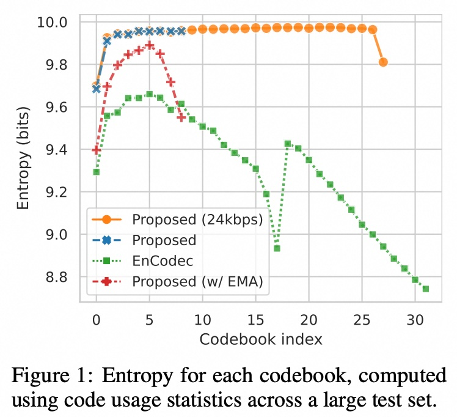
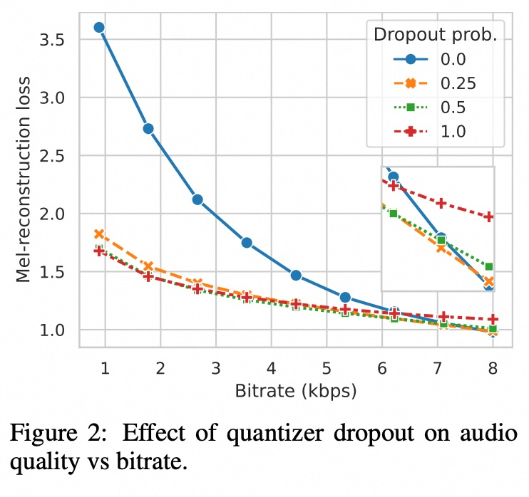
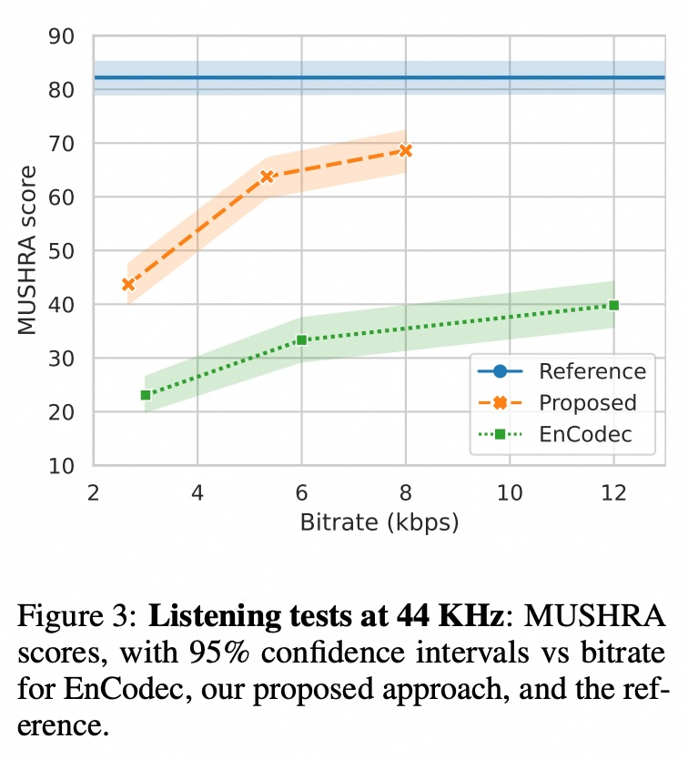

## AI论文解读 | High-Fidelity Audio Compression with Improved RVQGAN
        
### 作者        
digoal        
        
### 日期        
2025-08-28       
        
### 标签        
PostgreSQL , PolarDB , DuckDB , AI , 论文解读        
        
----        
        
## 背景  
      
https://arxiv.org/pdf/2306.06546        
  
提示:          
```          
读懂《High-Fidelity Audio Compression with Improved RVQGAN》这篇论文需要提前掌握哪些基础知识, 请使用中文通熟易懂的讲解这些基础知识, 可以引用论文中的图、表或使用Markdown支持的图形(text,mermaid等)增加解释性. 
  
使用中文通熟易懂的解读《High-Fidelity Audio Compression with Improved RVQGAN》这篇论文, 其中的关键内容请着重讲解, 可以引用论文中的图、表或使用Markdown支持的图形(text,mermaid等)增加解释性. 
  
提取《High-Fidelity Audio Compression with Improved RVQGAN》这篇论文中的重要术语, 使用中文对这些术语进行通熟易懂的讲解, 可以引用论文中的图、表或使用Markdown支持的图形(text,mermaid等)增加解释性. 
```     
  
## 1 前置知识 
  
您好，根据您上传的《High-Fidelity Audio Compression with Improved RVQGAN》这篇论文，为了更好地理解其核心内容，您需要掌握以下几个基础知识。这些概念都是这篇论文构建其模型和提出改进方法的基础。

---

### 1. 自动编码器 (Autoencoder)

自动编码器是一种神经网络，用于学习数据的有效编码（即降维）。它由两部分组成：

* **编码器 (Encoder)**：将高维输入（例如原始音频信号）压缩成一个低维的“潜在表示”（latent representation）。
* **解码器 (Decoder)**：将这个潜在表示重建回高维输出（例如压缩后的音频信号）。

这篇论文中的模型本质上就是一个自动编码器，用于将音频压缩成一个更小的表示，然后从这个表示中重建音频。

### 2. 矢量量化变分自动编码器 (VQ-VAE)

传统的自动编码器使用连续的潜在变量，但该论文提出使用**离散的潜在变量**是更好的选择 。**矢量量化 (Vector Quantization, VQ)** 就是实现这一点的关键技术。

* **核心思想**：VQ将连续的潜在表示映射到一组预定义的、离散的“代码本”（codebook）中的最近邻向量 。
* **代码本崩溃 (Codebook Collapse)**：一个常见问题是，在训练过程中，代码本中的大部分向量可能从未被使用过，导致有效比特率降低，重建质量变差 。论文通过**因子化编码**和 **L2 归一化**等改进技术解决了这个问题，从而提高了代码本的利用效率 。

### 3. 生成对抗网络 (GANs)

GANs 是一种训练生成模型的方法，由两个相互对抗的神经网络组成：

* **生成器 (Generator)**：负责从潜在表示中生成假数据（如重建音频）。
* **判别器 (Discriminator)**：负责区分真实数据（原始音频）和生成器生成的假数据。

生成器和判别器在博弈中共同进步。生成器努力生成更逼真的假数据来“骗过”判别器，而判别器则努力变得更强大，能够更准确地识别假数据 。这篇论文的模型 **Improved RVQGAN** 正是利用了这种对抗性训练方法来提高音频生成质量，减少音频伪影 。

### 4. 残差矢量量化 (Residual Vector Quantization, RVQ)

这是论文模型名称中 “RVQ” 的来源。RVQ 是一种特殊的矢量量化方法，通过以下步骤逐步细化量化过程：

1.  首先，用一个代码本对输入向量进行量化，得到一个初步的量化结果。
2.  然后，计算原始向量与初步量化结果之间的“残差”（residual）。
3.  接下来，使用第二个代码本对这个残差进行量化。
4.  这个过程可以递归地进行，每一步都对上一步的残差进行量化，直到达到所需的量化层数 。

通过这种方式，每增加一个量化层（即一个代码本），模型都能捕捉到更精细的细节，从而提高重建质量 。

### 5. 损失函数 (Loss Functions)

损失函数用于衡量模型预测结果与真实结果之间的差异，并指导模型的训练。该论文使用了多种损失函数来共同优化模型：

* **对抗性损失 (Adversarial Loss)**：来自 GANs，用于确保生成的音频在时域和频域都与真实音频难以区分 。
* **多尺度梅尔重建损失 (Multi-scale Mel-reconstruction Loss)**：用于在不同时间尺度上鼓励模型重建出与真实音频相似的梅尔谱图。这有助于提高模型的稳定性和收敛速度 。
* **代码本和承诺损失 (Codebook and Commitment Losses)**：源于 VQ-VAE 的原始设定，用于训练代码本并确保编码器输出的潜在表示与代码本中的向量足够接近 。

### 6. 特殊技术与概念

* **Snake 激活函数**：为了解决传统激活函数在处理周期性音频信号时出现的伪影问题 ，该论文采用了 Snake 激活函数。这种激活函数引入了一种周期性偏置，有助于生成更高保真度的音频 。
* **多尺度 STFT 判别器**：为了解决高频重构模糊和相位建模错误问题 ，论文使用了一种基于**短时傅里叶变换（STFT）**的多尺度判别器 。STFT 是一种将时域信号转换为频域表示的技术，判别器通过分析不同时间尺度的 STFT 结果，能更好地捕捉音频的高频细节和相位信息 。

掌握了上述基础知识后，您将能更容易地理解这篇论文如何通过改进这些组件来构建一个性能优越的音频压缩模型。
  
## 2 解读论文 
  
好的，我们来用通俗易懂的方式解读一下这篇名为《High-Fidelity Audio Compression with Improved RVQGAN》的重磅论文。

可以把这篇论文的核心思想概括为：**研究人员们开发出了一种全新的神经网络音频压缩技术（名叫“Improved RVQGAN”），它能像一个超级压缩软件，将庞大的高保真音频文件（比如44.1kHz的CD音质音乐）压缩到极小，同时又能奇迹般地保留下几乎所有的音质细节。**

想象一下，你有一首5分钟的CD音质无损音乐，大小可能是50MB。通过这个技术，可以把它压缩到大约3.6MB（8kbps），但听起来的感觉却和原来差不多，几乎分辨不出区别。这比我们熟知的MP3、AAC等传统压缩格式在同样低码率下的效果要好得多。

-----

### **为什么要研究这个？—— 问题背景**

在AI生成内容（AIGC）的时代，我们不仅能让AI画画、写文章，还能让它创作音乐、合成语音。但高品质音频的数据量非常巨大，一秒钟就有数万个数据点。直接让AI模型处理这么庞大的数据，既困难又消耗资源。

因此，业界通常分两步走：

1.  **压缩/编码**：先把原始音频“浓缩”成一串简短的“密码”（称为tokens或离散码）。这个密码丢掉了一些人耳不易察觉的冗余信息，但保留了核心的声音特征。
2.  **生成**：训练一个大型语言模型（比如Transformer），让它学习这些“密码”的规律。需要生成音频时，模型会先生成一串新密码，再用一个“解码器”把密码还原成声音。

这个流程的成败，很大程度上取决于第一步的压缩效果。如果压缩后的“密码”质量不高，信息损失严重，那么无论第二步的生成模型多强大，最终还原出的声音也会充满瑕疵。现有的技术（如SoundStream, EnCodec）虽然不错，但在低码率下，还是会产生一些恼人的杂音和失真。

这篇论文的目标，就是打造一个顶级的音频压缩模型，为下一代高保真音频生成打下坚实的基础。

### **核心技术揭秘：Improved RVQGAN是怎么做到的？**

论文提出的`Improved RVQGAN`模型，通过对现有技术的几项关键创新，实现了音质和压缩率的巨大突破。我们来逐一拆解：

#### **1. 更好的“密码本”学习方法 (Improved Residual Vector Quantization)**

这是论文最重要的改进之一。模型的核心是“矢量量化”（Vector Quantization），你可以把它想象成一个制作“密码本”的过程。

  * **传统方法的困境**：编码器将音频切片并提取特征，然后需要在“密码本”里查找最接近的“密码”（码字）来替代它。但训练时经常出现一个叫 **“码本崩溃”（Codebook Collapse）** 的问题。就好比一本厚厚的英文字典，你翻来覆去只用了其中最常见的几百个词，大量生僻词永远用不上。这导致“密码本”的利用率极低，带宽被浪费，压缩效果自然就差。

  * **论文的解决方案**：作者借鉴了图像领域的先进经验，引入了两种技巧：

      * **分解码本 (Factorized Codes)**：不直接在高维空间里（比如1024维）查找码字，而是先通过一个“投影”层，把特征压缩到一个很低维的空间（比如8维）里去查。这就像给字典的每个词条建立一个极其精简的核心释义索引，查索引比翻整本书快得多，也准得多。
      * **L2归一化 (L2-normalized Codes)**：对特征和码字都进行“标准化”处理，使得匹配过程更稳定，训练效果更好。

这两个技巧极大地提升了“密码本”的利用率。从论文的**图1**中可以清晰地看到效果：   

> **图1 解读**: 这张图显示了每个码本中“密码”被使用的均衡程度（熵）。橙色和蓝色的线代表论文提出的新方法，它们几乎都达到了10.0的理论上限，意味着“密码本”里的每个“密码”都被充分利用了。而旧方法（绿色和红色的线）在后面的码本中利用率急剧下降，造成了严重的带宽浪费。

#### **2. 引入周期性归纳偏置 (Periodic Activation Function)**

声音，尤其是音乐和人声，天然具有很强的**周期性**（比如音高）。传统的神经网络激活函数（如ReLU）在学习这类周期性信号时表现不佳，容易导致生成的声音出现音高不准或奇怪的“金属音”。

  * **论文的解决方案**：作者将模型中的标准激活函数换成了**Snake激活函数**。这种函数本身就带有一个周期性的`sin²`项，等于直接告诉了神经网络：“你要处理的东西是带周期的，多往这方面学习！”
  * **效果**：这个改动虽然简单，但效果显著。论文的消融实验（见下表节选）证明，仅此一项改动就大幅提升了音频的相位重建质量（由SI-SDR指标衡量）。

| 组件 | 激活函数 | SI-SDR (越高越好) | 结论 |
| :--- | :--- | :--- | :--- |
| 基线模型 | **snake** | 9.12 | 效果好 |
| 对比模型 | relu | 6.92 | 效果差 |

#### **3. 改进可变码率训练策略 (Quantizer Dropout)**

为了让一个模型能支持多种压缩码率（比如用户可以自由选择2kbps, 4kbps, 8kbps），研究者们发明了“量化器丢弃”（Quantizer Dropout）技术。简单说，就是在训练时随机“丢弃”一部分码本，让模型学会在码本数量变化时也能好好工作。

  * **传统方法的副作用**：研究者发现，这个技术虽然实现了可变码率，但却损害了模型在最高码率下的“全力输出”性能。

  * **论文的解决方案**：他们提出，不是每次都强制进行丢弃，而是以一定的**概率p**（比如50%的概率）来决定是否对当前批次的数据进行丢弃。这样一来，模型既能学到在低码率下的适应性，又不会忘记在高码率下的“巅峰状态”。

从论文的**图2**可以看出这个策略的巧妙之处：   

> **图2 解读**: 蓝线 (p=0.0) 代表完全不使用丢弃，它在最高码率(8kbps)时音质最好（损失最低），但在低码率时表现很差。其他虚线代表不同概率的丢弃策略。可以发现，橙色线 (p=0.5) 在低码率时紧跟其他丢弃策略，保证了低码率的性能，同时在最高码率时与蓝线的差距非常小，实现了最佳的平衡。

#### **4. 更强大的判别器和损失函数**

为了让生成的音频听起来更真实，模型采用“生成对抗网络”（GAN）的框架进行训练。这意味着有一个“生成器”（我们上面讨论的模型）和一个“判别器”。

  * **生成器**：负责压缩和重建音频。
  * **判别器**：像一个挑剔的“金耳朵”，不断地去分辨哪些是真实音频，哪些是生成器重建的音频。它的目标是尽可能找出假音频的破绽。

生成器则努力地“欺骗”判别器，让它真假难辨。在这个对抗过程中，生成器的音频重建能力就越来越强。

论文在判别器设计和损失函数（即评判标准）上也做了很多精细的改进，例如：

  * **多频段STFT判别器**：能更有效地发现高频部分的失真和混叠瑕疵。
  * **多尺度Mel损失**：能更好地捕捉音乐中镲片、警报声等瞬态变化极快的声音细节。

### **实验效果：碾压级的优势**

理论说再多，不如看疗效。论文将`Improved RVQGAN`与当时最先进的`EnCodec`模型以及其他压缩标准（如Opus）进行了全方位的对比。

#### **客观指标**

在各种码率下，论文提出的模型在多项客观评价指标上都全面超越了`EnCodec`。

#### **主观听感测试 (MUSHRA)**

这是最有说服力的部分。研究者邀请了专业的听音员对不同模型在不同码率下生成的音频进行盲听打分（MUSHRA测试）。分数越高，代表听起来越接近原始的无损音频。

**图3**展示了核心的对比结果：   

> **图3 解读**:
>
>   * **蓝色横线 (Reference)**：代表原始无损音频，是所有人追求的“天花板”。
>   * **橙色曲线 (Proposed)**：代表论文提出的新模型。
>   * **绿色曲线 (EnCodec)**：代表之前的最强模型。
>
> 结果一目了然：在任意一个码率点上（比如6kbps），新模型的听感得分都**远高于**EnCodec，并且以更低的码率（如8kbps）就达到了甚至超过了EnCodec在更高码率（如12kbps）下的水平。这意味着新模型用更少的数据量，实现了更好的音质。

论文还按不同声音类型（语音、音乐、环境音）进行了细分对比，结果显示新模型在所有类别上都保持了领先优势，尤其是在语音处理上表现最佳。

### **总结与意义**

《High-Fidelity Audio Compression with Improved RVQGAN》这篇论文，通过一系列精巧而有效的技术改进，解决了很多神经网络音频压缩领域的痛点，尤其是在**码本利用率**和**周期性信号建模**上取得了突破。

它不仅创造了一个新的SOTA（State-of-the-Art，即当时最先进水平）模型，更重要的是，它为整个AI音频生成领域提供了一个极其强大的“基座”。有了这样一个既能压得小、又能还原得好的工具，未来的文本转语音（TTS）、AI音乐生成等应用，就能以更低的成本，创造出更加逼真、动听的声音，让AI真正具备“金嗓子”。同时，论文也开源了代码和模型，极大地推动了社区的发展。
  
## 3 术语 
  
好的，根据您提供的《High-Fidelity Audio Compression with Improved RVQGAN》这篇论文，以下是其中几个重要的技术术语及其通俗易懂的中文讲解。

---

### **1. RVQGAN (Residual Vector Quantized Generative Adversarial Network)**

**RVQGAN** 是这篇论文提出的核心模型名称，可以理解为是一个“超强音频压缩兼生成器”。这个名字由三个部分组成，每个部分都代表了模型的一个关键技术：

* **RVQ (Residual Vector Quantization，残差矢量量化)**：这是一种高效的音频压缩技术，就像给音频信号“拍照”并用一张张小照片（代码）来记录它的样子，而 RVQ 能让这些“照片”更精确地捕捉到细节。
* **G (Generative，生成)**：指的是模型具有“生成”能力。它不仅能压缩音频，还能从压缩后的信息中“生成”出高质量的、逼真的音频。
* **AN (Adversarial Network，对抗网络)**：这是一种训练模型的方式，通过两个网络（一个生成器和一个判别器）互相竞争来提高生成质量。生成器负责“生成假音频”，判别器则负责“分辨真假音频”，它们在博弈中共同进步，最终生成器能生成几乎以假乱真的音频。

将这三者结合，**RVQGAN** 就是一个通过残差矢量量化高效压缩音频，再利用生成对抗网络确保重建出高保真音频的模型。

### **2. Residual Vector Quantization (RVQ，残差矢量量化)**

**RVQ** 是论文在**矢量量化（VQ）**基础上进行的重要改进。想象一下，你想用最少的积木块来拼出一个复杂的城堡。

* **传统矢量量化（VQ）**：你从一堆积木块中找到一个最像城堡的积木块，然后用它来代表整个城堡。这虽然简单，但细节会丢失很多。
* **残差矢量量化（RVQ）**：这个过程更精细，它采用“迭代”的方式：
    1.  **第一步**：先找到一个最像城堡的积木块。
    2.  **第二步**：计算出这个积木块与真实城堡之间的“残差”，也就是它们之间的差异部分。
    3.  **第三步**：再找一个积木块，去拼出这个“差异部分”。
    4.  **重复**：不断重复这个过程，每一步都去量化上一步剩下的“差异”，直到差异小到可以忽略。

通过这种层层递进的方式，RVQ 使用多个代码本（积木块库）来逐步捕捉音频信号的细节，从而在低码率下也能获得更高的重建质量。

### **3. Multi-scale STFT Discriminator (多尺度 STFT 判别器)**

在 **GAN** 模型中，判别器需要非常强大，才能有效指导生成器学习。这篇论文使用的判别器叫做“多尺度 STFT 判别器”，它不是简单地听音频的“声音”，而是去分析音频的“频率”。

* **STFT (Short-Time Fourier Transform，短时傅里叶变换)**：这是一种将音频信号从**时域（声音随时间的变化）**转换到**频域（不同频率的能量分布）**的技术。可以想象成一个频谱分析仪，能显示出在某个时间点，音频中包含了哪些高音、低音等频率成分。
* **多尺度 (Multi-scale)**：意味着判别器会从多个不同的“时间窗口”去分析 STFT 结果。有的窗口很宽（比如分析整个句子的语调），有的窗口很窄（比如分析一个词的发音细节）。

通过这种多尺度的频域分析，判别器可以更全面地检查生成音频的质量，特别是在**高频部分的细节**和**相位信息**上，这对于高保真音频至关重要，能有效减少“金属声”、“嘶嘶声”等恼人的伪影。

### **4. Snake Activation Function (Snake 激活函数)**

在神经网络中，**激活函数**的作用是给神经元引入非线性，使其能学习更复杂的模式。传统的激活函数（如 ReLU）在处理具有周期性特征的音频信号时，有时会产生伪影。

论文采用了 **Snake 激活函数**，它的名字来源于其函数曲线的形状，像一条蛇一样蜿蜒曲折。

* **核心特性**：这个函数引入了一个**周期性偏置**。
* **作用**：它能更好地匹配音频信号的周期性特性，从而帮助模型学习并生成更自然的波形，减少高频伪影，提高音频的真实感。

### **5. Codebook Collapse (代码本崩溃)**

**代码本崩溃**是使用矢量量化时一个常见的问题。可以把它想象成一个拥有 100 种不同积木块的库（代码本），但因为训练方法不当，模型在压缩时却只使用了其中 10 种积木块，剩下的 90 种积木块被“闲置”了。

* **问题**：这会导致模型的表达能力大大下降，因为可用积木块太少，就无法拼出细节更丰富的城堡。
* **论文的解决方案**：论文通过引入**因子化编码（Factorized Encoding）**和 **L2 归一化（L2 Normalization）**等技术，让模型在训练时能够更平均地使用代码本中的所有向量，从而解决了“代码本崩溃”的问题，充分利用了模型的潜力，提高了压缩和重建的质量。
  
## 参考        
         
https://arxiv.org/pdf/2306.06546    
        
<b> 以上内容基于DeepSeek、Qwen、Gemini及诸多AI生成, 轻微人工调整, 感谢杭州深度求索人工智能、阿里云、Google等公司. </b>        
        
<b> AI 生成的内容请自行辨别正确性, 当然也多了些许踩坑的乐趣, 毕竟冒险是每个男人的天性.  </b>        
    
#### [期望 PostgreSQL|开源PolarDB 增加什么功能?](https://github.com/digoal/blog/issues/76 "269ac3d1c492e938c0191101c7238216")
  
  
#### [PolarDB 开源数据库](https://openpolardb.com/home "57258f76c37864c6e6d23383d05714ea")
  
  
#### [PolarDB 学习图谱](https://www.aliyun.com/database/openpolardb/activity "8642f60e04ed0c814bf9cb9677976bd4")
  
  
#### [PostgreSQL 解决方案集合](../201706/20170601_02.md "40cff096e9ed7122c512b35d8561d9c8")
  
  
#### [德哥 / digoal's Github - 公益是一辈子的事.](https://github.com/digoal/blog/blob/master/README.md "22709685feb7cab07d30f30387f0a9ae")
  
  
#### [About 德哥](https://github.com/digoal/blog/blob/master/me/readme.md "a37735981e7704886ffd590565582dd0")
  
  

  
