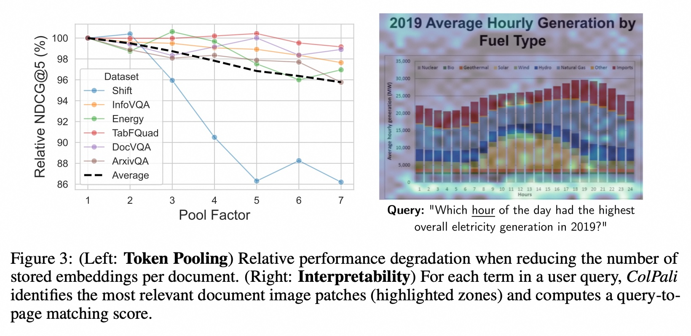

## AI论文解读 | ColPali: EFFICIENT DOCUMENT RETRIEVAL WITH VISION LANGUAGE MODELS
        
### 作者        
digoal        
        
### 日期        
2025-08-28       
        
### 标签        
PostgreSQL , PolarDB , DuckDB , AI , 论文解读        
        
----        
        
## 背景  
      
https://arxiv.org/pdf/2407.01449        
  
提示:          
```          
读懂《ColPali: EFFICIENT DOCUMENT RETRIEVAL WITH VISION LANGUAGE MODELS》这篇论文需要提前掌握哪些基础知识, 请使用中文通熟易懂的讲解这些基础知识, 可以引用论文中的图、表或使用Markdown支持的图形(text,mermaid等)增加解释性. 
  
使用中文通熟易懂的解读《ColPali: EFFICIENT DOCUMENT RETRIEVAL WITH VISION LANGUAGE MODELS》这篇论文, 其中的关键内容请着重讲解, 可以引用论文中的图、表或使用Markdown支持的图形(text,mermaid等)增加解释性. 
  
提取《ColPali: EFFICIENT DOCUMENT RETRIEVAL WITH VISION LANGUAGE MODELS》这篇论文中的重要术语, 使用中文对这些术语进行通熟易懂的讲解, 可以引用论文中的图、表或使用Markdown支持的图形(text,mermaid等)增加解释性. 
```     
  
## 1 前置知识 
  
要理解《ColPali: EFFICIENT DOCUMENT RETRIEVAL WITH VISION LANGUAGE MODELS》这篇论文，您需要先掌握一些基础知识，主要围绕文档检索、传统方法的问题以及新模型ColPali的创新点展开。

下面是对这些基础知识的通俗易懂的讲解。

### 1\. 文档检索（Document Retrieval）是什么？

文档检索是一种在大量文档库中，根据用户查询（Query）找到最相关文档的过程 。这就像搜索引擎一样，您输入一个关键词，它会返回一个按相关性排序的网页列表。在论文中，这个概念被缩小到 **“页面级检索”（page-level retrieval）** ，即给出一个查询，系统能否找到正确的文档页面 。

它在很多实际应用中都非常重要，比如**RAG（Retrieval Augmented Generation，检索增强生成）**，这是一种结合了检索和生成式人工智能的技术，可以帮助大型语言模型（LLMs）在回答问题时，从外部文档中获取准确信息 。

### 2\. 传统文档检索流程的挑战

传统的文档检索系统主要依赖从文档中提取的文本信息 。这个过程通常很繁琐，包含多个步骤 ：

1.  **PDF解析或OCR（光学字符识别）**：从文档页面中提取文字 。
2.  **版面检测（Layout Detection）**：识别段落、标题、表格、图片等页面元素 。
3.  **分块（Chunking）**：将相关联的文本段落组合成“块”，以便进行索引 。
4.  **图表描述（Captioning）**：有时甚至需要用语言模型来描述图片或表格等视觉元素，使其更适合文本模型进行处理 。

这个流程的缺点是耗时且脆弱。特别是当文档中包含大量图片、表格或复杂的版面时，仅仅依赖文本信息会遗漏很多关键的视觉线索 。

下图是论文中**图1**的简化版，清晰地对比了传统方法（上方）和ColPali方法（下方）的流程：    


正如您在图中和论文中看到的，传统方法需要多个步骤，处理速度慢（每页7.22秒），而ColPali直接使用视觉语言模型处理图片，流程更简单，速度更快（每页0.39秒） 。

### 3\. 视觉语言模型（Vision Language Models, VLMs）

VLMs 是一种能够同时理解图像和文本的模型 。与传统的仅处理文本的模型不同，VLMs 可以直接从文档的图像中理解信息，包括文本、布局、图表等所有视觉元素 。

ColPali 模型就是基于一种名为**PaliGemma-3B**的VLM，并对其进行了专门的训练，使其能够高效地进行文档检索 。

### 4\. 向量嵌入（Vector Embeddings）与检索

在现代检索系统中，文档和查询通常被转换成计算机可以理解的**向量**（一种数字列表） 。相关性是通过计算查询向量和文档向量之间的相似度来衡量的 。

  * **单向量嵌入（Single-Vector Embeddings）**：最常见的做法是将整个文档或其一个“块”编码成一个单独的密集向量。这种方法简单但可能无法捕捉文档中所有丰富的细节 。
  * **多向量嵌入（Multi-Vector Embeddings）**：ColPali 的核心创新之一。它不是为整个文档生成一个单一向量，而是为文档中的每个“令牌”（例如，每个词或每个图像块）生成一个独立的向量 。这使得模型能够更精细地理解文档的每个部分 。

### 5\. 延迟交互机制（Late Interaction）

**延迟交互（Late Interaction）**是这篇论文的另一个关键概念，源自ColBERT模型 。

  - **核心思想**：它结合了**Bi-encoder**（双编码器）和**Cross-encoder**（交叉编码器）的优点 。
      - **双编码器**：在离线阶段将文档编码成向量，在线阶段将查询也编码成向量，然后快速计算相似度 。
      - **交叉编码器**：将查询和文档拼接在一起，作为一个整体进行编码和打分，这更准确但速度慢 。
  - **延迟交互**：在**离线阶段**，ColPali 为文档的每个图像块和文本令牌生成多向量嵌入并建立索引 。在**在线阶段**，它将查询编码成一组向量，然后计算每个查询向量与文档中所有向量的**最大相似度**，并将这些最大值相加得到最终分数 。这个过程既保持了较高的准确性，又因为大部分计算都在离线完成而非常高效 。

该论文的**表2**通过各种基准测试展示了ColPali模型的优越性 。它在各种视觉复杂任务（如信息图表、科学图表和表格）上的表现尤其出色 。    

综上所述，要读懂这篇论文，您需要理解：

  - 文档检索的基本任务和RAG等应用。
  - 传统文本检索流程的繁琐之处。
  - 视觉语言模型如何直接处理文档图像。
  - 多向量嵌入和延迟交互机制如何让ColPali在保持高效率的同时，更好地利用文档的视觉信息。
  
## 2 解读论文 
  
好的，我们来一起深入解读这篇颇具开创性的论文《ColPali: EFFICIENT DOCUMENT RETRIEVAL WITH VISION LANGUAGE MODELS》。

这篇论文的核心思想可以概括为一句话：**抛弃传统繁琐的“文本提取”路线，让AI像人一样直接“看图识文档”，从而实现更高效、更精准的文档检索。**

-----

### 一、当前文档检索的痛点：为何需要新方法？

传统的文档检索系统在处理PDF这类富含视觉元素的文档时，通常遵循一个复杂且脆弱的流程。这篇论文指出，这个流程本身就是性能瓶颈。

**传统流程的弊端：**

1.  **复杂且耗时**：需要经过多个步骤，如光学字符识别（OCR）、版面分析、文本分块（Chunking）等 。整个流程非常缓慢，论文中提到，处理一页PDF平均需要**7.22秒** 。
2.  **信息损失严重**：这个流程主要关注文本，会丢弃大量的视觉信息，比如图表、表格的结构、页面布局、甚至是字体样式 。然而，这些视觉元素对于理解文档至关重要。
3.  **效果瓶颈**：研究发现，即使更换更强大的文本嵌入模型，检索性能的提升也十分有限。真正的瓶颈在于前期的数据处理流水线未能有效利用视觉信息 。

我们可以用一个流程图来直观地展示这个复杂的过程：


这个流程不仅慢，而且每一步都可能出错，导致最终检索效果不佳。

-----

### 二、ColPali的核心思想：化繁为简，直接“看”文档

面对上述痛点，ColPali提出了一种颠覆性的方法：**将文档的每一页都视为一张图片，直接输入给一个强大的视觉语言模型（Vision Language Model, VLM）进行理解和编码** 。

这种方法的优势是显而易见的：

  * **极致简化**：跳过了所有预处理步骤，直接端到端完成。
  * **信息完整**：完整保留了页面上所有的文本和视觉元素。
  * **速度飞跃**：索引（embedding）一页文档的速度提升了近**18倍**，仅需**0.39秒** 。

### 三、深入解析ColPali的技术实现

ColPali的成功主要依赖于两大关键技术：**PaliGemma视觉语言模型** 和 **ColBERT后期交互机制**。

#### 1\. 架构概览：新旧对比

我们可以通过引用论文中的核心图 (Figure 1) 来直观对比ColPali与传统方法的差异。   

| 特性 | 标准检索流程 (Standard Retrieval) | ColPali (论文方法) |
| :--- | :--- | :--- |
| **离线处理 (Offline)** | OCR、版面检测、分块、文本嵌入 | 直接用Vision VLM对页面图像进行编码 |
| **离线耗时/页** | **7.22秒**  | **0.39秒**  (快了约18.5倍) |
| **在线查询 (Online)** | 查询文本嵌入，向量相似度计算 | 查询文本嵌入，后期交互计算得分 |
| **在线耗时/查询** | 约22毫秒  | 约30毫秒  (速度相当) |
| **检索效果 (nDCG@5)** | **0.66**  | **0.81**  (性能大幅提升) |

   

**图 1**: ColPali与标准检索方法的对比 。ColPali在简化流程、提升速度的同时，取得了更强的性能 。

#### 2\. 关键技术1：视觉语言模型 (VLM) - PaliGemma

ColPali选用PaliGemma-3B作为其视觉语言大模型的主干 。VLM的强大之处在于它能同时理解图像和文本。在ColPali中，它的作用是：

  * 接收一整页文档的**图像**。
  * 将图像分割成多个小图块（patches）。
  * 将每个图块转换成一个**多维向量**（embedding）。这些向量不仅包含了图块的视觉信息，还通过模型的强大能力理解了图块中的文本内容。

#### 3\. 关键技术2：多向量表示与后期交互 (Multi-Vector & Late Interaction)

这是ColPali能取得卓越性能的另一个关键，其思想源于一个叫ColBERT的模型 。

  * **传统方法 (单向量)**：将一篇文档（或一个分块）压缩成**一个**单独的向量。这就像用一句话总结一整本书，会丢失很多细节。
  * **ColPali (多向量)**：一篇文档页由**多个**向量表示（每个图像块对应一个或多个向量） 。这好比用多个段落摘要来总结一本书，保留了更丰富的细节。
  * **后期交互 (Late Interaction)**：在查询时，用户的查询文本也被分解成多个词元向量。然后，用**查询的每一个词元向量**去和文档页的**所有图像块向量**进行比较，找出最匹配的一个。最后将所有查询词元的最大匹配得分相加，得到最终的相关性分数 。

这种“**局部对齐，精准匹配**”的方式，使得ColPali能够捕捉到查询和文档之间更细粒度的关联，尤其是在处理包含复杂图表的文档时效果显著。

### 四、实验与结果：ColPali效果如何？

为了验证模型的效果，论文作者首先构建了一个全新的、更贴近实际应用场景的评测基准——**ViDoRe** 。这个基准涵盖了多种领域（如医疗、商业、科技）、多种语言（英、法）和多种视觉元素（图表、表格、信息图）。

#### 1\. 性能对比：全面超越

在ViDoRe基准测试上，ColPali的表现非常出色，远超所有基线模型。

**ViDoRe 基准测试平均性能 (nDCG@5)** 

| 模型/方法 | 平均分 (Avg.) |
| :--- | :---: |
| Unstructured (纯文本) + BGE-M3 | 62.0 |
| Unstructured + OCR + BGE-M3 | 66.1 |
| Unstructured + **Captioning** (最佳基线) | 67.0 |
| SigLIP (强大的VLM) | 51.4 |
| **ColPali (本文方法)** | **81.3** |

从上表可以看出，ColPali的平均分（81.3）比当前最佳的、流程复杂的“文本提取+视觉描述(Captioning)”方法（67.0）高出超过14个点，优势巨大 。特别是在处理信息图（InfoVQA）、科学图表（ArxivQA）和表格（TabFQuAD）等视觉密集型任务时，ColPali的领先优势更为明显 。

#### 2\. 效率对比：索引速度的革命

如下图（Figure 2）所示，ColPali在文档索引阶段的效率优势是压倒性的。

   

**图 2**: ColPali的离线索引速度远快于标准方法 。传统方法（PDF Parser）的耗时主要在OCR和描述生成（Captioning）上，而ColPali直接编码，非常高效 。

### 五、ColPali的其他优势

1.  **端到端可训练**：整个模型可以针对特定的下游任务进行微调，从而在专业领域获得更好的性能 。
2.  **可解释性强**：由于后期交互机制，我们可以清晰地看到查询中的**每个词**与文档图像中的**哪些区域**最相关，这让模型不再是一个黑箱。如下图所示，查询词“hour”被准确地关联到了图表中的横轴（小时）和标题中的“Hourly” 。

   

**图 3 (右)**: ColPali的可视化解释，高亮区域显示了与查询词最相关的图像部分 。

### 六、总结与展望

**总结来说，ColPali这篇论文的贡献是：**

  * **提出了ViDoRe**，一个用于评估视觉丰富文档检索的综合基准。
  * **设计了ColPali**，一种创新的文档检索模型，它直接从文档图像中创建高质量的多向量嵌入。
  * **证明了新范式的优越性**：ColPali在性能和效率上都远超传统方法，解决了现代文档检索（尤其是RAG应用）中的许多痛点 。

作者展望，未来的工作可以将这种视觉检索系统与视觉问答（Visual QA）相结合，构建完全基于图像特征的端到端RAG系统，这可能成为文档处理领域新的工业标准 。
  
## 3 术语 
  
要理解《ColPali: EFFICIENT DOCUMENT RETRIEVAL WITH VISION LANGUAGE MODELS》这篇论文，掌握其中的核心术语至关重要。以下是对论文中几个重要术语的中文讲解，旨在帮助您通俗易懂地理解这些概念。

### 1. 视觉语言模型（Vision Language Models, VLMs）

**视觉语言模型（VLMs）**是一种能够同时处理和理解图像及文本数据的深度学习模型。传统的文档处理通常先将图片上的文字提取出来，然后用文本模型进行处理。而VLMs则能直接“看懂”整个文档的图像，包括文字、图片、表格、图表、布局和字体等所有视觉元素，并从中提取信息。

ColPali模型就是基于**PaliGemma-3B**这一视觉语言模型，并对其进行了专门的训练，使其能够高效地为文档页面生成向量表示。

---

### 2. 多向量嵌入（Multi-Vector Embeddings）

**多向量嵌入**是这篇论文最核心的创新点之一。

* **单向量嵌入**：在传统的检索方法中，通常将整个文档或文档的一个片段（chunk）编码成一个单一的向量。这种方法简单但可能丢失文档中的精细信息。
* **多向量嵌入**：与此不同，ColPali模型为文档页面上的每一个独立的“令牌”（例如一个词、一个图像区域或一个符号）都生成一个独立的向量。这就像给文档里的每个重要元素都贴上一个独一无二的“标签”向量。

这种方法使得模型能够更细粒度地理解和匹配查询，而不是将整个文档作为一个整体来处理。

---

### 3. 延迟交互机制（Late Interaction）

**延迟交互**是一种高效的检索匹配机制，它结合了**双编码器（Bi-encoder）**和**交叉编码器（Cross-encoder）**的优点。这部分内容在论文中与ColBERT模型密切相关。

* **双编码器**：查询和文档分别独立编码成向量。检索时，通过计算这两个向量的相似度来打分。速度快，但因为是独立编码，精度可能较低。
* **交叉编码器**：将查询和文档拼接在一起，作为一个整体进行编码和打分。这种方法能更好地理解查询与文档之间的细微关系，因此精度高，但速度慢。
* **延迟交互**：ColPali 的做法是：
    1.  **离线阶段**：使用多向量嵌入，为文档中的每个令牌预先生成并存储一个向量。
    2.  **在线阶段**：当有查询（Query）进来时，将其编码成一组向量。然后，计算这组查询向量与文档中所有向量的**最大相似度**，并将这些最大值相加得到最终分数。

这个过程将大部分计算量提前到离线阶段，从而实现了高效率，同时通过精细的“令牌”级匹配，保证了高准确度。

---

### 4. ViDoRe（Visual Document Retrieval Benchmark）

**ViDoRe**是这篇论文为了评估和比较不同文档检索模型而引入的**一个全新的视觉文档检索基准测试集**。

这个测试集包含来自多个领域的文档，例如公司报告、政府报告、科学论文和医疗保健文件，并且涵盖多种语言。它特别侧重于那些包含复杂视觉元素（如图表、表格和信息图）的文档，旨在更好地评估模型在处理这类文档时的性能。

---

### 5. 页面级检索（Page-level Retrieval）

**页面级检索**是论文中明确定义的一个特定任务。它的目标是：给定一个查询，从大量文档页面中检索出最相关的**单个页面**。

这个任务比传统的文档级检索（即找到整个文档）更具挑战性，因为它要求模型能够精确地定位到文档中包含关键信息的具体页面，这对处理长篇幅文档和RAG等应用尤为重要。
  
## 参考        
         
https://arxiv.org/pdf/2407.01449    
        
<b> 以上内容基于DeepSeek、Qwen、Gemini及诸多AI生成, 轻微人工调整, 感谢杭州深度求索人工智能、阿里云、Google等公司. </b>        
        
<b> AI 生成的内容请自行辨别正确性, 当然也多了些许踩坑的乐趣, 毕竟冒险是每个男人的天性.  </b>        
    
#### [期望 PostgreSQL|开源PolarDB 增加什么功能?](https://github.com/digoal/blog/issues/76 "269ac3d1c492e938c0191101c7238216")
  
  
#### [PolarDB 开源数据库](https://openpolardb.com/home "57258f76c37864c6e6d23383d05714ea")
  
  
#### [PolarDB 学习图谱](https://www.aliyun.com/database/openpolardb/activity "8642f60e04ed0c814bf9cb9677976bd4")
  
  
#### [PostgreSQL 解决方案集合](../201706/20170601_02.md "40cff096e9ed7122c512b35d8561d9c8")
  
  
#### [德哥 / digoal's Github - 公益是一辈子的事.](https://github.com/digoal/blog/blob/master/README.md "22709685feb7cab07d30f30387f0a9ae")
  
  
#### [About 德哥](https://github.com/digoal/blog/blob/master/me/readme.md "a37735981e7704886ffd590565582dd0")
  
  

  
