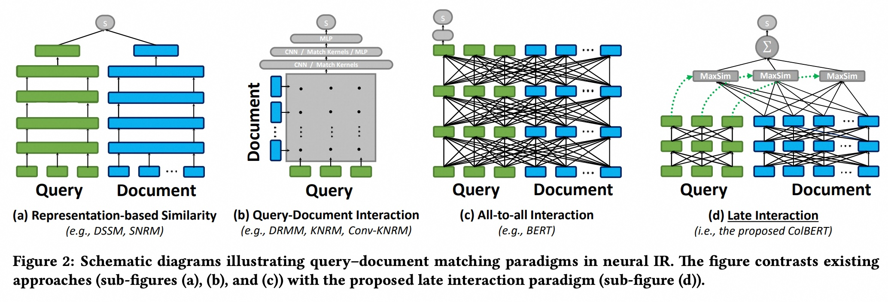
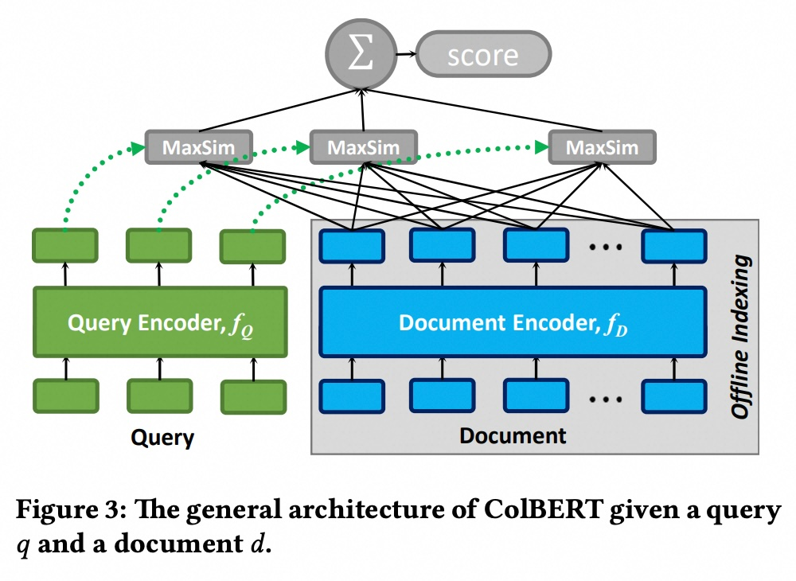
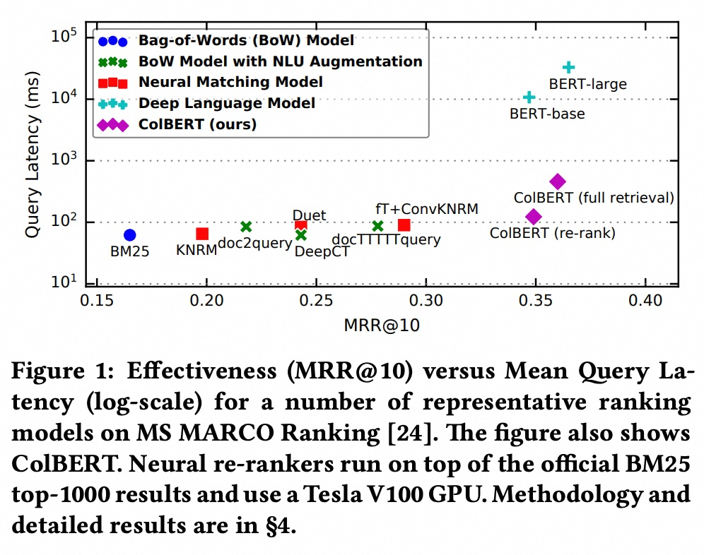
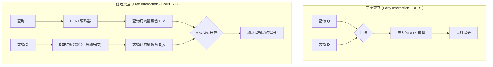
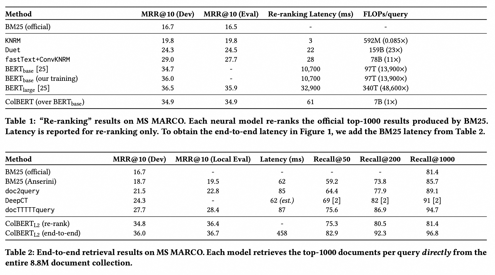

## AI论文解读 | ColBERT: Efficient and Effective Passage Search via Contextualized Late Interaction over BERT
        
### 作者        
digoal        
        
### 日期        
2025-08-28       
        
### 标签        
PostgreSQL , PolarDB , DuckDB , AI , 论文解读        
        
----        
        
## 背景  
      
https://arxiv.org/abs/2004.12832        
  
提示:          
```          
读懂《ColBERT: Efficient and Effective Passage Search via Contextualized Late Interaction over BERT》这篇论文需要提前掌握哪些基础知识, 请使用中文通熟易懂的讲解这些基础知识, 可以引用论文中的图、表或使用Markdown支持的图形(text,mermaid等)增加解释性. 
  
使用中文通熟易懂的解读《ColBERT: Efficient and Effective Passage Search via Contextualized Late Interaction over BERT》这篇论文, 其中的关键内容请着重讲解, 可以引用论文中的图、表或使用Markdown支持的图形(text,mermaid等)增加解释性. 
  
提取《ColBERT: Efficient and Effective Passage Search via Contextualized Late Interaction over BERT》这篇论文中的重要术语, 使用中文对这些术语进行通熟易懂的讲解, 可以引用论文中的图、表或使用Markdown支持的图形(text,mermaid等)增加解释性. 
```     
  
## 1 前置知识 
  
要读懂《ColBERT: Efficient and Effective Passage Search via Contextualized Late Interaction over BERT》这篇论文，您需要提前掌握以下几个核心基础知识。这篇论文主要解决的是如何平衡信息检索的**效果**（effectiveness）和**效率**（efficiency）问题，尤其是当使用像 BERT 这样的深度语言模型时。

-----

### 1\. 信息检索（IR）基础与传统方法

信息检索（Information Retrieval，简称 IR）是研究如何从海量文档中找到与用户查询相关的文档的学科。

  * **传统模型：** 像 **BM25** 这样的模型是基于 **词袋模型（Bag-of-Words，BoW）** 的 。它们将文档和查询看作是无序的词语集合，通过词频、逆文档频率等统计信息来计算相关性。这类模型速度快、计算量小，但无法理解词语的语义和上下文，因此效果有限 。

  * **痛点：** 传统模型的一大缺点是**词汇不匹配**（vocabulary mismatch）。例如，查询“汽车”和包含“轿车”的文档可能无法匹配，因为它们使用的词汇不同，但语义相关。

### 2\. 深度学习在信息检索中的应用与挑战

为了解决词汇不匹配的问题，研究人员开始使用深度学习模型。BERT 模型的出现极大地推动了这一领域的发展 。

  * **BERT 模型：** **BERT**（Bidirectional Encoder Representations from Transformers）是一种预训练的语言模型，能够捕捉词语在**上下文**中的语义 。它能有效理解查询和文档的深层语义，在各种检索任务中取得了最先进的效果 。

  * **BERT的挑战：** 尽管 BERT 的效果显著，但其计算成本非常高。通常，BERT 必须将**整个“查询-文档”对**（Query-Document Pair）作为一个整体输入模型来计算相关性得分 。这导致每次查询需要对每个文档进行大量的计算，响应延迟高达几千甚至几万毫秒 。这使得它在大型搜索引擎中难以大规模应用。

-----

### 3\. 不同的相关性匹配范式

论文的核心贡献之一是提出了一种新的匹配范式。理解这一点，需要区分几种不同的相关性计算方式，这在论文的 **图2** 中有直观的对比 。   

#### a) 基于表示的相似度（Representation-based Similarity）

  * **原理：** 查询和文档各自独立编码成一个**单一的向量**（Embedding），然后通过计算这两个向量的相似度（如余弦相似度）来得到相关性得分 。
  * **优缺点：** 文档向量可以离线预先计算并存储起来，查询时只需计算一次查询向量，然后进行快速的向量相似度搜索，效率非常高 。但由于将整个文档压缩成一个向量，损失了细粒度的信息，相关性匹配的效果通常较差。

#### b) 交互式相似度（Interaction-based Similarity）

  * **原理：** 模型对查询和文档中的**每个词**进行两两交互，形成一个交互矩阵，然后用神经网络（如卷积或注意力机制）来建模这些细粒度的关系 。
  * **优缺点：** 这类模型能捕捉词语间的细粒度关系，效果比基于表示的模型好。但由于需要实时计算查询和文档所有词语间的交互，计算量非常大，无法实现离线预计算，导致延迟高 。**BERT** 就属于这种范式，被称为 **“All-to-all Interaction”**  。

#### c) ColBERT 的创新：延迟交互（Late Interaction）

  * **原理：** **ColBERT** 结合了前两种范式的优点 。它首先使用 BERT **独立地**为查询和文档中的**每个词**生成一个**上下文嵌入向量**（contextual embeddings），然后在一个“廉价”的**延迟交互**步骤中，对这些嵌入向量进行细粒度的相似度匹配 。

  * **核心机制：** 延迟交互的核心是 **MaxSim**（Maximum Similarity）操作。它对查询中的每个词嵌入向量，在文档的所有词嵌入向量中寻找**最大**的相似度得分 。最后，将这些最大相似度得分相加作为总的相关性得分。这个过程可以理解为：“对于查询中的每个词，找到文档中与它最匹配的词，并将它们的匹配程度加起来” 。

用 **图3** 可以更好地理解 ColBERT 的架构 。   

*图3：ColBERT的整体架构图*

  * **优势：** 这种“延迟交互”的设计，使得**文档的嵌入向量可以离线预先计算并存储起来** 。在查询时，只需要对查询本身进行一次 BERT 编码，然后就可以在存储的文档嵌入库中进行快速的相似度计算 。

### 4\. 高效检索技术

ColBERT 能够在大型文档库中实现端到端检索，主要依赖于以下技术：

  * **离线预计算：** 文档的嵌入向量在查询之前就已经计算并保存好了 。
  * **向量相似度索引（Vector-Similarity Search Indexes）：** 像 **FAISS** 这样的库可以对海量的向量进行高效的索引和搜索 。这意味着在查询时，可以直接通过向量相似度搜索来快速找到最相关的文档，而无需遍历所有文档。

综上所述，要理解这篇论文，您需要具备以下背景知识：

  * **信息检索**的基本概念和传统模型（如 BM25） 。
  * **深度语言模型**（如 BERT）的工作原理，特别是它如何捕捉上下文语义 。
  * **向量化（Embedding）**的概念，即将文本转换成数值向量 。
  * 对**不同相关性匹配范式**的理解，尤其是 **“All-to-all Interaction”** 与 **“Representation-based”** 的优劣对比 。
  * 理解 **ColBERT 提出的“延迟交互（Late Interaction）”** 范式如何利用 **MaxSim** 操作，同时实现高效果和高效率 。
  * 对**向量相似度搜索**库（如 Faiss）有基本了解 。

掌握了这些基础，您就能更好地理解论文中 ColBERT 如何通过巧妙的架构设计，实现了 BERT 模型的强大效果与传统方法的高效查询速度的结合 。
  
## 2 解读论文 
  
好的，我们来一起用通俗易懂的中文解读一下《ColBERT》这篇在信息检索（IR）领域具有重要影响力的论文。

### 核心思想：在搜索领域的“速度”与“精度”之间搭起一座桥梁

想象一下，现代搜索引擎（比如谷歌、必应）都想用最先进的AI模型（比如BERT）来更精准地理解你的查询意图和海量文档的内容。但这里有一个巨大的矛盾：

  * **传统模型（如BM25）**：速度飞快，但理解能力有限，有时找不到最相关的结果，因为它主要看关键词匹配。
  * **先进的AI模型（如BERT）**：理解能力超强，能捕捉上下文和语义，精度很高。但它的计算方式是把 **“查询”和“每个文档”** 都拼接在一起，然后通过一个庞大而复杂的网络进行计算，这导致其速度极慢，成本极高。

**Figure 1** 这张图非常直观地展示了这个问题：   

> **图解读**：
>
>   * **横轴 (MRR@10)**：代表搜索的**精度**，越往右越好。
>   * **纵轴 (Query Latency)**：代表搜索的**耗时**（延迟），越往下越好。
>     \* 你可以看到，BERT-base和BERT-large模型虽然精度最高（在最右边），但延迟也是最高的（在最上面），比传统方法慢了成千上百倍 。而左下角的BM25等模型虽然快，但精度差了一大截。

ColBERT的目标就是，**既要拥有接近BERT的“高精度”，又要实现接近传统模型的“高效率”**。

### ColBERT的革命性理念：延迟交互 (Late Interaction)

为了解决上述矛盾，ColBERT提出了一个全新的架构，名为“**延迟交互**”。要理解这个创新，我们先看看其他模型是怎么做的。**Figure 2** 完美地解释了这一点。   

  * **(a) 基于表示的相似度 (Representation-based)**：先把查询和文档分别“压缩”成一个单独的向量（就像一个高度概括的摘要），然后计算这两个向量的相似度。**优点**是速度快，因为文档的向量可以提前算好。**缺点**是信息损失严重，精度不高 。
  * **(c) 完全交互 (All-to-all Interaction / Early Interaction)**：这是标准BERT的做法。把查询和文档拼接在一起，让模型内部的每个词都和其他所有词（无论来自查询还是文档）进行复杂的交互和计算 。**优点**是能捕捉到最细微的关联，精度极高。**缺点**是计算量巨大，且无法提前处理文档，因为每次交互都跟查询有关 。
  * **(d) 延迟交互 (Late Interaction)**：这就是ColBERT的核心。它走了一条中间路线：
    1.  **独立编码**：使用BERT分别独立地对查询和文档进行编码，但不是压缩成一个向量，而是为**每个词**都生成一个**带有上下文信息**的向量（词向量）。
    2.  **延迟交互**：直到最后一步，才用一种**廉价而高效**的方式对这两组词向量进行交互和评分 。

我们可以用下面的Mermaid图来更清晰地对比“完全交互”和“延迟交互”的流程：



### ColBERT架构拆解：它是如何工作的？

结合 **Figure 3**，我们可以看到ColBERT的具体实现：   

1.  **编码阶段 (Encoding)**

      * **文档编码器 ( $f\_D$ )**：这是可以**离线 (Offline)** 完成的。ColBERT会遍历所有文档，用BERT为每个文档生成一组词向量，并把它们存起来 。这一步虽然也耗时，但只需要做一次。同时，它会过滤掉标点符号的向量，以减少存储和计算量 。
      * **查询编码器 ( $f\_Q$ )**：当用户输入查询时，它会用同样的BERT模型实时地为查询生成一组词向量 。这里有一个关键技巧叫做**查询增强 (Query Augmentation)**：ColBERT会在较短的查询后面补充一些特殊的 `[mask]` 标记，让模型学习生成一些额外的、可能有助于匹配的“扩展”词向量，这被证明对提升效果至关重要 。

2.  **交互与评分阶段 (Interaction & Scoring)**

      * 这一步的核心是**MaxSim (Maximum Similarity)** 操作 。
      * **具体过程是**：对于查询中的**每一个词向量**，去文档的所有词向量中找到一个**最相似**的（通常是计算余弦相似度），并记录下这个最高的相似度分数 。
      * 最后，把查询中每个词向量算出的“最大相似度分”**全部加起来**，就得到了查询和文档的最终相关性得分 。
      * 这个`Sum of MaxSim`的设计非常巧妙，它既保留了词级别的细粒度匹配，又避免了复杂的网络计算，非常高效 。

### ColBERT的两种强大工作模式

ColBERT的架构赋予了它极大的灵活性，可以在两种场景下工作：

  

1.  **重排模式 (Re-ranking)**

      * 这是比较常见的用法。先用一个快速的传统模型（如BM25）从海量文档库中初步筛选出1000个候选文档。
      * 然后，ColBERT仅对这1000个文档进行精准的重排序，选出最终结果 。
      * **效果**：如 **Table 1** 所示，ColBERT (over $BERT\_{base}$) 的精度（MRR@10 34.9）与昂贵的 $BERT\_{large}$ (35.9) 相差无几，但速度快了**170多倍**，计算量（FLOPs）更是减少了**14000倍** 。这极大地弥合了效率和效果之间的鸿沟。

2.  **端到端检索模式 (End-to-end Retrieval)**

      * 这是ColBERT更具革命性的地方。由于文档都被表示成了词向量，我们可以把**所有文档的全部词向量**都存入一个专门用于向量搜索的索引库中（比如Faiss）。
      * 当一个查询来了，ColBERT不再需要BM25。它可以直接用查询的词向量去这个索引库里做高效的近似最近邻搜索，快速召回最可能相关的候选文档集，然后再进行精确评分 。
      * **效果**：如 **Table 2** 所示，端到端模式下的ColBERT（MRR@10 36.0）甚至比重排模式（34.8）**效果更好** 。因为它摆脱了BM25的限制，能够找到那些因为关键词不匹配而被BM25漏掉的相关文档，从而显著提升了**召回率 (Recall)** 。

### 论文关键结论总结

  * **提出了“延迟交互”新范式**：通过独立编码和廉价的MaxSim交互，成功地在保持高精度的同时，极大地提升了基于BERT的模型的检索效率 。
  * **性能卓越**：在重排任务上，比标准BERT模型快170多倍，计算量减少14000倍，同时效果远超所有非BERT模型 。
  * **支持端到端检索**：其架构天然支持向量检索引擎，可以实现高效的端到端检索，摆脱了对传统一级检索模型的依赖，并获得了更高的召回率和最终精度 。
  * **实用性强**：离线索引成本可控（在当年的硬件上，索引近900万文档仅需约3小时），且对存储空间要求灵活，可以通过调整向量维度和精度来平衡空间占用和模型效果 。

总而言之，ColBERT通过其创新的“延迟交互”架构，为如何在实际应用中部署昂贵但强大的深度学习模型提供了一个非常成功和有影响力的解决方案，是信息检索领域一个里程碑式的工作。
  
## 3 术语 
  
《ColBERT: Efficient and Effective Passage Search via Contextualized Late Interaction over BERT》这篇论文引入了几个关键的术语和概念，这些是理解其核心思想的关键。下面我将用通俗易懂的中文为您逐一讲解。

-----

### 1\. Late Interaction（延迟交互）

这是 **ColBERT** 论文中最核心的创新点。它是一种新的相关性匹配范式，旨在平衡效果和效率。

  * **通俗理解：** 想象你在图书馆找一本书，你不会把书架上的每一本书都和你的需求进行“深度讨论”，而是先快速浏览书名、摘要、目录等信息（粗略匹配），然后只对少数几本最相关的书进行仔细阅读（精细匹配）。
  * **技术解释：** 在 ColBERT 中，**“延迟交互”意味着模型不会在早期（Early Interaction）或全盘（Cross-Interaction）地将查询（Query）和文档（Passage）中的所有词语进行两两交互。相反，它先使用 BERT 独立地为查询和文档中的每个词生成一个独立的、带有上下文信息的向量（Embedding）。然后，它在一个相对简单、计算量小的后期步骤**中，才对这些预先计算好的向量进行细粒度的匹配。

这种设计使得文档向量可以离线预先计算并存储，大大加快了查询时的检索速度。

-----

### 2\. Contextualized Embeddings（上下文嵌入向量）

这个术语描述了 ColBERT 用 BERT 生成的词向量的特点。

  * **通俗理解：** 传统的词向量（如 Word2Vec）将“苹果”这个词都表示成同一个向量，无论它在句子中是作为水果还是作为公司名出现。而 **“上下文嵌入向量”** 则像一个聪明人，能根据句子中的上下文来理解同一个词的不同含义，并为它生成不同的向量。比如，“我想吃一个苹果”中的“苹果”和“我买了一台苹果电脑”中的“苹果”会得到不同的向量。
  * **技术解释：** ColBERT 利用 BERT 模型的强大能力，为查询和文档中的每个词都生成一个富含上下文信息的向量。这些向量是后续“延迟交互”步骤的基础。

-----

### 3\. MaxSim（最大相似度）

**MaxSim** 是“延迟交互”步骤中的核心操作，它定义了查询和文档向量之间的匹配方式。

  * **通俗理解：** 想象你的查询是“最新 iPhone”，文档中可能包含“苹果发布了新款手机”、“苹果公司推出了最新的 iPhone 15”等词句。MaxSim 的作用是，对于你查询中的每个词（比如“最新”），它会去文档中找到与之最相关、最匹配的那个词（比如“新款”或“最新”），并记录它们的相似度得分。

  * **技术解释：** ColBERT 通过 **MaxSim** 来计算查询和文档之间的相关性得分。它的具体计算公式为：

    $S(Q, D) = \\sum\_{q \\in Q} \\max\_{d \\in D} \\text{Sim}(E\_q, E\_d)$

      * $Q$ 和 $D$ 分别是查询和文档中的词。
      * $E\_q$ 和 $E\_d$ 分别是查询词和文档词的上下文嵌入向量。
      * $\\text{Sim}$ 是向量相似度函数，通常是余弦相似度。

    这个公式的意思是：对于查询中的每一个词向量，找到它在文档词向量集合中**相似度最大**的那个，然后把所有这些最大相似度得分**加起来**。这种方式既保留了细粒度的匹配信息，又避免了复杂的全交互计算。

-----

### 4\. Vector-Similarity Search Indexes（向量相似度搜索索引）

这是 ColBERT 实现高效端到端检索的重要技术。

  * **通俗理解：** 假设你的图书馆有上百万本书，你不可能每次都一本一本找。聪明的做法是，你根据书的类型、主题、作者等信息，将它们分门别类地放置在不同的区域，并建立索引。这样，你只需要先找到正确的区域，再进行局部搜索。**向量相似度搜索索引**就是数字世界的“图书索引”。
  * **技术解释：** 由于 ColBERT 能够将文档中的每个词都表示成一个向量，并且这些向量可以离线预计算，我们就可以使用专门的**向量索引库**（如 FAISS）来组织和存储这些海量向量。在查询时，模型只需计算查询向量，然后在索引中进行高效的向量相似度搜索，就能快速找到最相关的文档，而无需对每个文档进行昂贵的 BERT 推理，从而实现了大规模、低延迟的检索。

-----

### ColBERT的架构对比

通过下面的简图，您可以直观地理解 ColBERT 的 **“延迟交互”** 范式与其他方法的区别。

  * **左侧 (Early Interaction)：** 将查询和文档整体输入一个模型。
  * **中间 (Late Interaction / ColBERT)：** **独立**编码查询和文档，然后在后期进行 **MaxSim** 匹配。
  * **右侧 (Representation-based)：** 将整个查询和文档压缩成一个单一向量。
  
## 参考        
         
https://arxiv.org/abs/2004.12832    
        
<b> 以上内容基于DeepSeek、Qwen、Gemini及诸多AI生成, 轻微人工调整, 感谢杭州深度求索人工智能、阿里云、Google等公司. </b>        
        
<b> AI 生成的内容请自行辨别正确性, 当然也多了些许踩坑的乐趣, 毕竟冒险是每个男人的天性.  </b>        
    
#### [期望 PostgreSQL|开源PolarDB 增加什么功能?](https://github.com/digoal/blog/issues/76 "269ac3d1c492e938c0191101c7238216")
  
  
#### [PolarDB 开源数据库](https://openpolardb.com/home "57258f76c37864c6e6d23383d05714ea")
  
  
#### [PolarDB 学习图谱](https://www.aliyun.com/database/openpolardb/activity "8642f60e04ed0c814bf9cb9677976bd4")
  
  
#### [PostgreSQL 解决方案集合](../201706/20170601_02.md "40cff096e9ed7122c512b35d8561d9c8")
  
  
#### [德哥 / digoal's Github - 公益是一辈子的事.](https://github.com/digoal/blog/blob/master/README.md "22709685feb7cab07d30f30387f0a9ae")
  
  
#### [About 德哥](https://github.com/digoal/blog/blob/master/me/readme.md "a37735981e7704886ffd590565582dd0")
  
  

  
