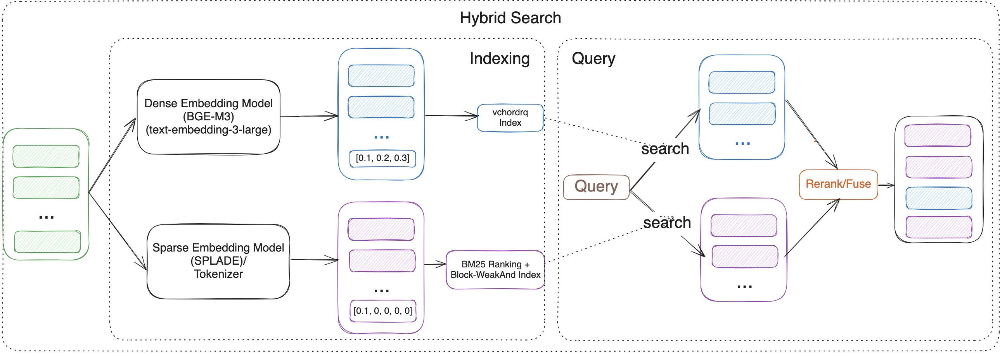

## 用PG构建RAG数据库, 除了向量插件, 还需要什么? VectorChord Suite: 构建RAG的完整套件!  
          
### 作者          
digoal          
          
### 日期          
2025-08-28         
          
### 标签          
PostgreSQL , PolarDB , DuckDB , RAG , GraphRAG , KAG , 向量 , FTS , 全文检索 , MaxSim , Multi-Vectors Search , 向量聚合 , 向量数组 , token , 句子 , 段落 , rerank , 图 , PGQ         
          
----          
          
## 背景    
要在数据库中构建高效的RAG, 除了向量搜索能力还需要什么?  
- FTS: 关键词(特征)检索  
- multi-vectors search: 支持细粒度相似性查询, 传统向量检索基于聚合向量(也就是句子中所有token的向量聚合成1个向量后进行检索, 将丢失token的特征; 这也是为什么混合搜索会兴起的原因之一!)  
    - [《不是混合搜索? 另一种解决方案提高向量搜索结果相关性! 使用 PostgreSQL 中的 ColBERT rerank 增强向量搜索》](../202508/20250827_05.md)    
- rerank: 重排, 提升返回结果与查询目标的相关性  
- 也许还需要图? 支撑KAG或graphrag!   
  
VectorChord Suite: 提供了在PG中构建RAG的完整套件(不包括图, 因为PG未来将支持PGQ语法 或 有其他插件已支持了!), 让我们一起来看看.    
  
以下内容翻译自: https://blog.vectorchord.ai/all-in-one-vectorchord-suite-building-production-ready-rag-solutions-directly-in-postgresql  
  
# VectorChord Suite: 构建RAG数据库的完整套件!   
检索增强生成 (RAG) 正在彻底改变我们与海量数据集和LLM的交互方式。RAG 系统通过先检索与“问题”相关的信息, 再结合这些“信息”和“问题”最终生成响应答案，提供更精准、更符合语境、更贴近当前世界的答案。然而，构建稳健、可扩展且高效的 RAG 流程仍面临诸多挑战，尤其是在生产环境中。  
  
许多解决方案架构复杂，向量搜索、关键词搜索和主数据存储均使用不同的数据库(类似以前使用MySQL用户的常见解决方案, 搜索或分析就通过binlog同步到elasticsearch和数仓, 也是架构相当复杂, 同步问题、一致性问题、同步错误等诸多问题, 还有异构查询+结果合并的效率问题、成本提升、运维复杂度提升等.)。这通常会导致数据同步挑战、基础设施复杂性增加以及运营成本上升。  
  
如果您可以在可信赖的 PostgreSQL 数据库中直接构建功能强大、可立即投入生产的 RAG 系统，情况会怎样？  
  
了解VectorChord Suite，它是一系列 PostgreSQL 扩展程序，旨在将高性能向量搜索、原生 BM25 排序和灵活的标记化(tokenization)功能直接引入 Postgres。让我们探索这些组件以及它们如何赋能下一代 RAG 解决方案。  
  
## 什么是 VectorChord Suite？  
该套件包含三个协同工作的关键 PostgreSQL 扩展：  
  
1、[VectorChord](https://github.com/tensorchord/VectorChord)：核心向量搜索引擎。它专为在 PostgreSQL 中实现可扩展、高性能且节省磁盘空间的向量相似性搜索而设计。  
  
2、[VectorChord-bm25](https://github.com/tensorchord/VectorChord-bm25)：此扩展直接在 PostgreSQL 内部实现了复杂的 BM25 排序算法，并利用了高效的 Block-WeakAnd 算法。BM25 是基于关键词频率和文档特征进行相关性排序的标准。  
  
3、[pg_tokenizer.rs](https://github.com/tensorchord/pg_tokenizer.rs)：提供有效全文检索所需的基本文本标记功能，实现对全文检索的文本处理方式的细粒度控制。  
  
通过结合这些扩展，您可以解锁在 PostgreSQL 中完整构建高级 RAG 系统的强大功能。  
  
## 如何使用 VectorChord Suite  
您可以使用该 `tensorchord/vchord-suite` docker 镜像运行 TensorChord 提供的多个扩展程序。该镜像基于 Postgres 官方镜像，包含以下扩展程序：  
  
```  
docker run   \
  --name vchord-suite  \
  -e POSTGRES_PASSWORD=postgres  \
  -p 5432:5432 \
  -d tensorchord/vchord-suite:pg17-latest
  
# If you want to use ghcr image,   
  you can change the image to   
  `ghcr.io/tensorchord/vchord-suite:pg17-latest`.  
  
# if you want to use the specific version,   
  you can use the tag `pg17-20250414`,   
  supported version can be found in the support matrix.  
```  
  
```  
CREATE EXTENSION IF NOT EXISTS vchord CASCADE;  
CREATE EXTENSION IF NOT EXISTS pg_tokenizer CASCADE;  
CREATE EXTENSION IF NOT EXISTS vchord_bm25 CASCADE;  
\dx  
pg_tokenizer | 0.1.0   | tokenizer_catalog | pg_tokenizer  
vchord       | 0.3.0   | public            | vchord: Vector database plugin for Postgres, written in Rust, specifically designed for LLM  
vchord_bm25  | 0.2.0   | bm25_catalog      | vchord_bm25: A postgresql extension for bm25 ranking algorithm  
vector       | 0.8.0   | public            | vector data type and ivfflat and hnsw access methods  
```  
  
## VectorChord Suite 的用例  
    
### 用例 1：使用原生 BM25 和 VectorChord 实现强大的混合搜索  
  
    
  
在 RAG 时代，有效的检索至关重要。单独的`关键字搜索`或`向量搜索`都不是完美的：  
  
- 关键词搜索（类似 BM25）：精准度高，能够查找关键词完全匹配的文档。它非常适合结构化查询和特定词条的搜索。然而，它在同义词、释义以及理解潜在含义或语义意图方面存在不足。（利用`VectorChord-bm25`和`pg_tokenizer`）。  
  
- 向量搜索：捕捉概念之间的深层语义和关系，即使没有精确的关键词也能找到相关信息。然而，对于需要特定术语匹配的查询，它有时可能不够精准。（利用`VectorChord`）。  
  
解决方案：混合搜索。VectorChord Suite 结合了 Postgres 中两种方法的优势，弥补了这一差距。您可以运行以下查询：  
  
- VectorChord-bm25（由 pg_tokenizer 提供支持）以确保关键字的精确性。  
  
- VectorChord 用于语义理解搜索。  
  
两者的结果可以智能地组合（例如，使用基于 `reciprocal rank fusion(RRF)` 的 rerank 或 基于LLM的rerank），从而生成比单独使用任何一种方法都更准确、更符合上下文、更具有语义感知的最终排序, 得到更具有相关性的结果。这将显著提升您的 RAG 应用程序的检索性能。  
  
### 用例 2：超越文本 - 使用 ColQwen2 和 VectorChord 的无 OCR RAG  
为 PDF 或扫描图像等文档构建 RAG 系统通常涉及繁琐的预处理流程。传统方法严重依赖光学字符识别 (OCR) 和版式分析来提取文本。此过程的问题包括：  
  
- 慢： OCR 的计算成本很高。  
  
- 容易出错： OCR 准确度随文档质量而有很大差异。  
  
- 有损：在文本提取过程中，表格、图形、格式和相对定位等关键的视觉内容经常会丢失。  
  
解决方案：无需 OCR 识别、直接使用视觉感知(Visually-Aware)的 RAG。如果您无需显式 OCR，就能根据文档的layout和内容进行查询，那会怎样？  
  
现在可以通过结合以下方法实现这一目标：  
  
1、多模态视觉语言模型 (VLM)：像 ColQwen2 这样的模型可以处理图像（文档页面）并生成捕获文本内容和视觉layout信息的embedding。  
  
2、VectorChord 的多向量(multi-vectors)功能： VectorChord 可以在 Postgres 中高效地存储和搜索每个文档的多向量 - 允许您在一个`vector[]`字段中存储代表不同方面（例如，文本内容、视觉布局）的embedding。(核心技术包括用于`vector[]`近似计算的MaxSim算子)  
  
通过此设置，您可以直接在 PostgreSQL 中使用视觉元素的prompt（“查找带有比较销售数据的条形图的文档”）或文本和视觉prompt的组合来查询文档数据库。这简化了您的 RAG技术栈，通过保留视觉上下文来潜在地提高检索准确性，并消除了与传统 OCR 流程相关的瓶颈。  
  
## 为什么要在 PostgreSQL 中构建 RAG？  
利用 Postgres 中的 VectorChord Suite 具有如下显著的优势：  
  
- 统一数据：将源数据、文本、元数据和向量embedding保存在一个地方。  
  
- 降低复杂性：无需单独的向量数据库和同步链路。  
  
- 利用现有基础设施：利用您现有的 Postgres 专业知识、工具和操作实践。  
  
- 事务完整性：受益于 PostgreSQL 强大的 ACID 保障。  
  
- 丰富的生态系统：访问 Postgres 生态系统中提供的各种工具和功能。  
  
## 结论  
VectorChord 套件将 PostgreSQL 转变为一个功能强大、可立即投入生产的平台，用于构建先进的 RAG 解决方案。通过集成高性能向量搜索 ( `VectorChord` )、关键字排名 ( `VectorChord-bm25` ) 和灵活的文本处理 ( `pg_tokenizer` ) 三大插件，您可以直接在数据库中实现混合搜索和无 OCR 多模态检索等尖端技术。使用 PostgreSQL 中的 VectorChord，简化您的架构、提高检索准确性并充分释放 RAG 的潜力。  
  
在我们之前的博客中，我们分享了一些用户案例，其中所有docker image都可以用 VectorChord Suite image 替换。  
  
[《不是混合搜索? 另一种解决方案提高向量搜索结果相关性! 使用 PostgreSQL 中的 ColBERT rerank 增强向量搜索》](../202508/20250827_05.md)    
  
[《使用 Postgres Native BM25 和 VectorChord 进行混合搜索》](https://blog.vectorchord.ai/hybrid-search-with-postgres-native-bm25-and-vectorchord)  
  
[《超越文本: 使用 Modal 和 PostgreSQL+VectorChord 解锁无 OCR 的 RAG, 无惧PDF、扫描文档等》](../202508/20250827_03.md)    
  
## 参考  
https://blog.vectorchord.ai/vectorchord-store-400k-vectors-for-1-in-postgresql  
  
https://blog.vectorchord.ai/vectorchord-bm25-revolutionize-postgresql-search-with-bm25-ranking-3x-faster-than-elasticsearch  
  
https://blog.vectorchord.ai/vectorchord-bm25-introducing-pgtokenizera-standalone-multilingual-tokenizer-for-advanced-search  
  
https://blog.vectorchord.ai/all-in-one-vectorchord-suite-building-production-ready-rag-solutions-directly-in-postgresql  
  
[《不是混合搜索? 另一种解决方案提高向量搜索结果相关性! 使用 PostgreSQL 中的 ColBERT rerank 增强向量搜索》](../202508/20250827_05.md)    
  
[《超越文本: 使用 Modal 和 PostgreSQL+VectorChord 解锁无 OCR 的 RAG, 无惧PDF、扫描文档等》](../202508/20250827_03.md)    
  
[《AGE要复活了? PG将内置PGQ(SQL:2023 Property-Graph Queries)》](../202507/20250725_06.md)    
  
[《图数据库赛道没了 | SQL:PGQ标准出炉, 还不懂PGQ图式查询用法? 用DuckDB将PGQ一次整明白》](../202507/20250727_01.md)    
  
[《还在为age图插件的停更惋惜? Postgres用GraphBLAS每秒处理数十亿条边》](../202507/20250723_08.md)    
  
[《AI论文解读 | RAG vs. GraphRAG: A Systematic Evaluation and Key Insights》](../202507/20250724_02.md)    
  
[《AI论文解读 | KAG: Boosting LLMs in Professional Domains via Knowledge Augmented Generation》](../202505/20250515_01.md)    
  
[《AI论文解读 | From Local to Global: A GraphRAG Approach to Query-Focused Summarization》](../202505/20250514_02.md)    
  
[《AI论文解读 | Retrieval-Augmented Generation with Graphs (GraphRAG)》](../202505/20250514_01.md)    
  
https://deepwiki.com/tensorchord/pg_tokenizer.rs  
  
    
#### [期望 PostgreSQL|开源PolarDB 增加什么功能?](https://github.com/digoal/blog/issues/76 "269ac3d1c492e938c0191101c7238216")
  
  
#### [PolarDB 开源数据库](https://openpolardb.com/home "57258f76c37864c6e6d23383d05714ea")
  
  
#### [PolarDB 学习图谱](https://www.aliyun.com/database/openpolardb/activity "8642f60e04ed0c814bf9cb9677976bd4")
  
  
#### [PostgreSQL 解决方案集合](../201706/20170601_02.md "40cff096e9ed7122c512b35d8561d9c8")
  
  
#### [德哥 / digoal's Github - 公益是一辈子的事.](https://github.com/digoal/blog/blob/master/README.md "22709685feb7cab07d30f30387f0a9ae")
  
  
#### [About 德哥](https://github.com/digoal/blog/blob/master/me/readme.md "a37735981e7704886ffd590565582dd0")
  
  

  
