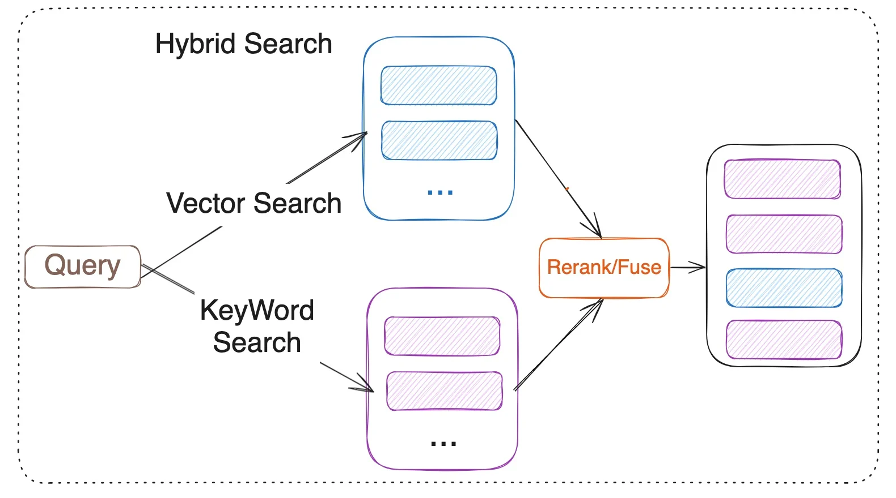
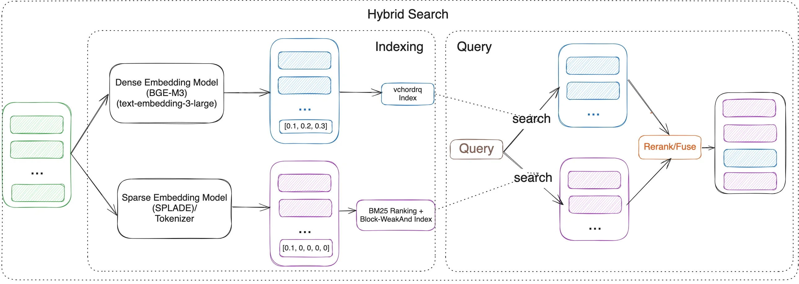
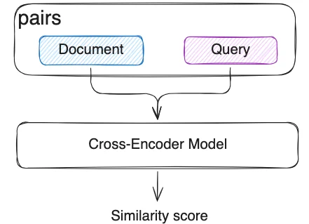

## 使用 Postgres Native BM25 和 VectorChord 进行混合搜索  
            
### 作者            
digoal            
            
### 日期            
2025-08-28           
            
### 标签            
PostgreSQL , PolarDB , DuckDB , RAG , GraphRAG , KAG , 向量 , FTS , 全文检索 , 词频 , 逆文档频率 , TF , IDF , token , rank , rerank , 图 , PGQ , BM25          
            
----            
            
## 背景    
假设你建了一个私有资料库, 包括文本、PDF、扫描图像、word、excel等等, 这些资料是大模型预训练和微调过程都没有用到的资料, 对大模型来说属于未知知识.  
  
AI Agent 在执行任务过程中可能需要根据需求不断搜索你的资料库, 然而搜索结果不理想.   
  
如果你只使用向量搜索, 那么以下是在生产中构建 AI Agent 系统时实际发生的情况：    
    
您的 AI 代码代理需要查找 `getUserById`。向量搜索会返回 10 个与 `getUserByName`、`getUserByEmail`、`updateUserById` 等类似的结果，因为它们在语义上相似。您确实需要 `getUserById`，但向量搜索会返回与 `getUserById` 最相似的 10 个结果。     
    
您需要精确的，但您得到的却是最相似的。     
    
您的用户会感到沮丧，因为人工智能“不理解”准确性。     
    
你的 AI 客服被问及“iPhone 15 Pro Max 256GB 深空黑”。向量搜索也返回“iPhone 15 Pro 128GB 深空黑”，因为它们的embedding值几乎完全相同(语义相似)。     
    
您的用户会感到沮丧，因为人工智能“不理解”准确性。     
    
您的 AI 电商搜索结果为 SKU“DQ4312-101”的数据时。由于数字相似，向量搜索返回“DQ4312-102”和“DQ4311-101”。    
    
您的用户会感到沮丧，因为人工智能“不理解”准确性。     
    
向量搜索可以给出相似性，但事实证明，用户实际上需要的是相关性。     
    
本文将详细介绍混合搜索(语义+关键字搜索+rerank)的背景和原理, 同样的, 它采用vectorchord suite.  
  
以下内容翻译自: https://blog.vectorchord.ai/hybrid-search-with-postgres-native-bm25-and-vectorchord  
  
# 使用 Postgres Native BM25 和 VectorChord 进行混合搜索  
在 RAG（检索增强生成）时代，高效地从海量数据集中检索相关数据对企业和开发者至关重要。传统的基于关键词的检索方法，例如使用BM25作为评分机制的方法，擅长基于词频(TF)和关键词精确匹配对文档进行排序。这使得它们对于结构化查询和关键词密集型内容非常有效。然而，它们难以理解同义词、语境细微差别和语义意图。相反，基于向量的检索能够捕捉深层语义，能够在各种查询中实现更好的泛化，但有时会牺牲关键词精确匹配的精度。混合搜索通过将 `BM25 的精度`与`向量搜索的语境理解`相结合，弥补了这一差距，从而提供更快、更准确且语义感知的结果。  
  
本文探讨如何在 Postgres 中实现混合搜索，使用[`VectorChord-bm25`](https://github.com/tensorchord/VectorChord-bm25)进行基于关键词的检索，并使用[`VectorChord`](https://github.com/tensorchord/VectorChord)进行语义搜索。通过利用 VectorChord-bm25 的 BM25 排序（采用Block-WeakAnd算法）以及 VectorChord 的向量相似度搜索功能，您可以构建一个强大的搜索系统，将`关键词精度`与`语义理解`无缝集成。无论您是构建`推荐引擎`、`文档检索系统`还是`企业搜索`解决方案，本指南都将引导您逐步释放混合搜索的全部潜力。  
  
所有相关的基准代码都可以在[这里](https://github.com/xieydd/vectorchord-hybrid-search)找到。  
  
## 什么是混合搜索  
  
  
`混合搜索`合并了`向量搜索`和`关键词搜索`的结果。向量搜索基于`查询`和`文档`之间的`语义相似度`，而关键词搜索依赖于 `BM25 排名算法`。但值得注意的是，BM25 本身仅负责对文档进行评分，而更广泛的关键词搜索过程还包括tokenization、indexing和query parsing等步骤。混合搜索通过reranker或fuses融合两种方法的结果。Fuses包括 RRF（Reciprocal Rank Fusion）或用于多种召回策略的加权评分。基于模型的reranker包括跨编码器模型（例如`bge-reranker-v2-m3`和multi-vectors表示模型 `ColBERT`) 。  
  
https://github.com/tensorchord/VectorChord  
  
  
## 什么是 VectorChord？  
您可能熟悉 [pgvector](https://github.com/pgvector/pgvector) ，这是一个适用于Postgres的开源向量相似性搜索扩展。然而，可扩展或性能至关重要的场景可能需要更高级的向量搜索解决方案。VectorChord是一个绝佳的选择。  
  
查看博客文章[“VectorChord：在 PostgreSQL 中以 1 美元的价格存储 400k 个向量”](https://blog.vectorchord.ai/vectorchord-store-400k-vectors-for-1-in-postgresql)以了解有关其动机和设计的更多信息。  
  
https://github.com/tensorchord/VectorChord-bm25  
  
  
## 什么是 VectorChord-BM25?  
VectorChord-BM25 是 PostgreSQL 的一个关键字搜索扩展插件。它不仅实现了 BM25 排序，还包含一个分词器(tokenizer)和一个 Block-WeakAnd 索引来提升速度。  
  
### BM25 是什么？  
BM25（Best Matching 25）是一种概率排序函数，用于信息检索，评估文档与查询的匹配程度。它基于词频 (TF) 和逆文档频率 (IDF) 计算相关性得分，同时应用文档长度归一化。该公式确保文档中频繁出现的词 (TF) 和语料库中罕见的词 (IDF) 获得适当的权重，从而提高搜索的准确性和相关性。IDF衡量一个词在文档集合中出现的频率。出现的次数越少，其值越高。TF表示查询中特定词在给定文档中出现的频率。TF 值越高，表示查询与文档之间的相关性越高。  
  
### 为什么Postgres 需要原生 BM25 排名实现？  
在我们之前的博文[《VectorChord-BM25: Revolutionizing PostgreSQL Search with BM25 Ranking — 3x Faster Than Elasticsearch》](https://blog.vectorchord.ai/vectorchord-bm25-revolutionize-postgresql-search-with-bm25-ranking-3x-faster-than-elasticsearch)中，我的同事 Allen 已经给出了详细且充分的讲解，可以参考。  
  
## 教程：使用 VectorChord-BM25 和 VectorChord 实现混合搜索  
    
  
在本教程中，我们将指导您完成在 PostgreSQL 中使用 VectorChord-BM25 和 VectorChord 实现混合搜索的步骤。  
  
我们将涵盖以下主题：  
  
- 使用 VectorChord 进行语义搜索  
  
- 使用 VectorChord-BM25 进行关键字搜索  
  
- 重新排序  
  
### 先决条件  
1、Postgres 与 VectorChord-BM25 和 VectorChord  
  
如果您想快速重现本教程，您可以使用该`tensorchord/vchord-suite` docker image 运行 TensorChord 提供的多个扩展。  
  
您可以运行以下命令使用 VectorChord-BM25 和 VectorChord 构建和启动 Postgres。  
```  
docker run   \         
  --name vchord-suite  \
  -e POSTGRES_PASSWORD=postgres  \
  -p 5432:5432 \
  -d tensorchord/vchord-suite:pg17-latest
  
# If you want to use ghcr image,     
  you can change the image to     
  `ghcr.io/tensorchord/vchord-suite:pg17-latest`.    
    
# if you want to use the specific version,     
  you can use the tag `pg17-20250414`,     
  supported version can be found in the support matrix.      
```  
  
```  
CREATE EXTENSION IF NOT EXISTS vchord CASCADE;  
CREATE EXTENSION IF NOT EXISTS pg_tokenizer CASCADE;  
CREATE EXTENSION IF NOT EXISTS vchord_bm25 CASCADE;  
\dx  
pg_tokenizer | 0.1.0   | tokenizer_catalog | pg_tokenizer  
vchord       | 0.3.0   | public            | vchord: Vector database plugin for Postgres, written in Rust, specifically designed for LLM  
vchord_bm25  | 0.2.0   | bm25_catalog      | vchord_bm25: A postgresql extension for bm25 ranking algorithm  
vector       | 0.8.0   | public            | vector data type and ivfflat and hnsw access methods  
```  
  
2、准备嵌入模型和数据  
  
对于嵌入(embedding)，我们可以使用预先训练的嵌入模型`BGE-M3`来为文档生成嵌入。`BGE-M3`是一种高质量的嵌入模型，以其多功能性、多语言性和多粒度的多功能性而闻名。  
  
为了进行验证，我们使用了[BEIR数据集](https://github.com/beir-cellar/beir)，这是一个用于信息检索的异构基准数据集。它易于使用，并允许您在 15 个以上不同的 IR 数据集上评估您的模型。  
  
首先，您需要将数据加载到 PostgreSQL 中。然后，您可以使用以下 SQL 查询为文档生成嵌入(embedding)。  
  
```  
with self.conn.cursor() as cursor:  
    cursor.execute(  
        f"CREATE TABLE IF NOT EXISTS {self.dataset}_corpus (id TEXT, text TEXT, emb vector({self.vector_dim}), bm25 bm25vector);"  
    )  
  
    for did, doc in tqdm(zip(doc_ids, docs), desc="insert corpus"):  
        emb = self.sentence_encoder.encode_doc(doc)  
        cursor.execute(  
            f"INSERT INTO {self.dataset}_corpus (id, text, emb) VALUES (%s, %s, %s)",  
            (did, doc, emb),  
        )  
```  
  
对于嵌入(embedding)：  
  
```  
from FlagEmbedding import BGEM3FlagModel  
class SentenceEmbedding:  
    def __init__(self, model_name: str = "BAAI/bge-m3"):  
        self.model = BGEM3FlagModel(  
            model_name,  
            use_fp16=True,  
        )  
    def encode_docs(self, documents: list[str]):  
        return self.model.encode(  
            documents,  
            batch_size=32,  
            max_length=8192,  
        )['dense_vecs']  
```  
  
数据处理和嵌入生成代码可以在[这里](https://github.com/xieydd/vectorchord-hybrid-search)找到。  
  
### 使用 VectorChord 进行语义搜索  
对于语义搜索，我们利用了在 PostgreSQL 扩展 VectorChord 中高度优化的[RabitQ算法](https://dev.to/gaoj0017/quantization-in-the-counterintuitive-high-dimensional-space-4feg)。RabitQ 是一种针对高维空间的量化算法，旨在提高高维数据（例如嵌入向量）的存储和检索效率。  
  
它通过将高维向量映射到低维离散空间，同时保留原始向量的相似性信息来实现这一点。此过程降低了存储需求和计算成本，同时保持了较高的检索准确率。  
  
```  
centroids = min(4 * int(self.num**0.5), self.num // 40)  
ivf_config = f"""  
residual_quantization = true  
[build.internal]  
lists = [{centroids}]  
build_threads = {workers}  
spherical_centroids = false  
"""  
with self.conn.cursor() as cursor:  
    cursor.execute(f"SET max_parallel_maintenance_workers TO {workers}")  
    cursor.execute(f"SET max_parallel_workers TO {workers}")  
    cursor.execute(  
        f"CREATE INDEX {self.dataset}_rabitq ON {self.dataset}_corpus USING vchordrq (emb vector_l2_ops) WITH (options = $${ivf_config}$$)"  
    )  
```  
  
如果您发现在自己的数据集上构建索引太慢，可以使用外部构建来加速此过程, 实际上就是用外部硬件计算k-means聚集点。有关更多详细信息，请参阅我们之前的博客：[在 VectorChord 中构建外部质心(centroids)的优势和步骤](https://blog.vectorchord.ai/benefits-and-steps-of-external-centroids-building-in-vectorchord) 。  
  
这篇文档有k-means详细介绍: [《残差矢量量化(RVQ) : 探索“神经音频编解码器”的核心技术》](../202508/20250827_04.md)    
  
索引建立后，可以使用以下SQL查询来搜索类似的文档：  
  
```  
probe = int(0.1 * min(4 * int(self.num**0.5), self.num // 40))  
with self.conn.cursor() as cursor:  
    cursor.execute(f"SET vchordrq.probes = {probe}")  
    cursor.execute(  
        f"select q.id as qid, c.id, c.score from {self.dataset}_query q, lateral ("  
        f"select id, {self.dataset}_corpus.emb <-> q.emb as score from "  
        f"{self.dataset}_corpus order by score limit {topk}) c;"  
    )  
```  
  
### 使用 VectorChord-BM25 进行关键词搜索  
对于关键词搜索，我们需要使用标记器(tokenizer)将文本转换为 `BM25 向量`，该向量可以理解为`词汇 ID`和`频率`的稀疏向量。  
  
```  
cursor.execute(  
    f"SELECT create_tokenizer('{self.dataset}_token', $$",  
    f"tokenizer = 'unicode'",  
    f"stopwords = 'nltk'",  
    f"table = '{self.dataset}_corpus'",  
    f"column = 'text'",  
    f"$$);"  
)  
cursor.execute(  
    f"UPDATE {self.dataset}_corpus SET bm25 = tokenize(text, '{self.dataset}_token')"  
)  
```  
  
让我详细解释一下这个操作。该`tokenize`函数用于使用指定的标记器(tokenizer)对文本进行标记。在本例中，我们使用了`Unicode 标记器`。该函数的输出 `tokenize` 是一个 `BM25 向量`，它是一个稀疏向量，存储文本中每个词汇的 `词汇 ID`和`频率`。例如，`1035:7`表示词汇表 ID 对应的单词 `1035` 在文本中出现了 `7` 次。  
  
```  
postgres=# select bm25 from fiqa_corpus limit 1;  
-- Output: {1035:7, 1041:1, 1996:1, 1997:1, 1999:3, 2010:3, 2015:7, 2019:1, 2022:1, 2028:4, 2036:2, 2041:1, 2051:2, 2054...  
```  
  
创建索引后，您可以计算`查询`和`向量`之间的 `BM25 得分`。请注意，`BM25 得分`为负数，这意味着得分越高，文档的相关性越高。我们特意将其设为负数，以便您可以使用默认值`ORDER BY`优先检索最相关的文档。  
  
```  
with self.conn.cursor() as cursor:  
    cursor.execute(  
        f"SELECT q.id AS qid, c.id, c.score FROM {self.dataset}_query q, LATERAL ("  
        f"SELECT id, {self.dataset}_corpus.bm25 <&> to_bm25query('{self.dataset}_text_bm25', q.text , '{self.dataset}_token') AS score "  
        f"FROM {self.dataset}_corpus "  
        f"ORDER BY score "  
        f"LIMIT {topk}) c;"  
    )  
```  
  
### 重新排序/融合 (Rerank/Fuse)  
一旦您从语义搜索和关键字搜索中获得结果，您就可以使用融合或重新排序来合并结果。  
  
1、融合（ Reciprocal Rank Fusion（RRF））  
  
RRF的优点在于它不依赖于具体的评分单元，而是基于排序进行融合，适合于不同评分标准的排序系统。  
  
$\text{RRF}(d) = \sum_{i=1}^{n} \frac{1}{k + \text{rank}_i(d)}$  
  
- `d` 是文档。  
- `n` 是排名系统的数量。  
- `rank` 是排序系统中的排名。  
- `k` 是可调整参数，该值通常为60（经验值），用于控制排名对分数的影响。  
  
```  
for rank, (query_id, doc_id, _) in enumerate(result, start=1):  
    if query_id not in rrf_scores:  
        rrf_scores[query_id] = {}  
    if doc_id not in rrf_scores[query_id]:  
        rrf_scores[query_id][doc_id] = 0  
    # Calculate and accumulate RRF scores  
    rrf_scores[query_id][doc_id] += 1 / (k + rank)  
```  
  
2、跨编码器模型重排序 (Cross-Encoder model Rerank)  
  
  
  
在语义搜索中，我们已经使用双编码器（Bi-Encoder）分别对`文档`和`查询`进行向量化。但这种独立的编码方式导致查询和文档之间缺乏交互。交叉编码器（Cross-Encoder）模型将`查询`和`文档`作为一个整体输入到模型中，模型会同时看到两者的内容，并通过 Transformer 层捕捉它们之间的细粒度语义关系。与 RRF 相比，交叉编码器模型可以捕捉查询和文档之间的细粒度语义关系，并且准确性更高，但速度较慢。  
  
可继续阅读: [《AI论文解读 | Efficient Nearest Neighbor Search for Cross-Encoder Models using Matrix Factorization》](../202506/20250629_02.md)    
  
```  
reranker = FlagReranker(  
    'BAAI/bge-reranker-v2-m3',   
    query_max_length=256,  
    passage_max_length=512,  
    use_fp16=True,  
    devices=["cuda:0"] # change ["cpu"] if you do not have gpu, but it will be very slow  
) # Setting use_fp16 to True speeds up computation with a slight performance degradation  
  
for query_id, docs in tqdm(results.items()):  
    scores = reranker.compute_score(pairs, normalize=True)   
    for i, doc_id in enumerate(docs):  
        bge_scores[query_id][doc_id] = scores[i]  
```  
  
### 评估  
我们在多个 BEIR 数据集上使用这些方法测试了`NDCG@10`。以下是前 10 个结果：  
  
数据集	| 向量语义搜索	| BM25 关键字搜索	| 跨编码器重新排序	| RRF 重排  
---|---|---|---|---  
FiQA-2018	|0.40343	|0.25301	|0.42706	|0.37632  
Quora	|0.88433	|0.78687	|0.89069	|0.87014  
SCIDOCS	|0.16055	|0.15584	|0.17942	|0.17299  
SciFact	|0.57631	|0.68495	|0.74635	|0.67855  
  
上表表明了几个结论：  
  
- 与单纯的 `BM25 关键字搜索` 和 `向量语义搜索` 相比，跨编码器模型 rerank 可以显著提高跨不同数据集的搜索性能(`文档`结果与`查询`的相关性)。  
  
- 在某些数据集上，RRF 可能会导致性能下降。请在决定是否使用 RRF 之前进行验证测试。如果有效，选择 RRF 将是一个非常经济的选择，因为它比使用跨编码器模型进行 reranking 的速度快得多，而且几乎没有资源消耗。  
  
所有相关的基准测试代码均可在[此处](https://github.com/xieydd/vectorchord-hybrid-search)找到。  
  
## 未来工作  
研究结果凸显了混合搜索方法的巨大潜力。未来，我们将重点关注以下几个方面，推进RAG的研究：  
  
- 改进重新排名方法：探索其他基于模型的重新排名，例如 `ColBERT` 或 `ColPali`，以增强重新排名性能(`文档`结果与`查询`的相关性)。  
  
- 集成图式搜索：研究使用`Apache AGE`扩展进行图搜索，并将其与混合搜索方法集成，以进一步提高搜索性能。  
  
图式搜索将和GraphRAG或KAG结合, 但是AGE已经停更, 而且PG未来有可能会内部提供PGQ的功能, 参考:  
- [《AGE要复活了? PG将内置PGQ(SQL:2023 Property-Graph Queries)》](../202507/20250725_06.md)      
- [《图数据库赛道没了 | SQL:PGQ标准出炉, 还不懂PGQ图式查询用法? 用DuckDB将PGQ一次整明白》](../202507/20250727_01.md)      
- [《还在为age图插件的停更惋惜? Postgres用GraphBLAS每秒处理数十亿条边》](../202507/20250723_08.md)      
  
  
参考  
  
https://github.com/tensorchord/vectorChord/  
  
https://github.com/tensorchord/VectorChord-bm25  
  
https://techcommunity.microsoft.com/blog/adforpostgresql/introducing-the-graphrag-solution-for-azure-database-for-postgresql/4299871  
  
https://www.pinecone.io/learn/hybrid-search-intro/  
  
https://www.pinecone.io/learn/series/rag/rerankers/  
  
https://blog.vespa.ai/improving-zero-shot-ranking-with-vespa-part-two/  
  
  
## 参考  
https://blog.vectorchord.ai/hybrid-search-with-postgres-native-bm25-and-vectorchord  
  
[《用PG构建RAG数据库, 除了向量插件, 还需要什么? VectorChord Suite: 构建RAG的完整套件!》](../202508/20250828_06.md)  
  
https://blog.vectorchord.ai/vectorchord-store-400k-vectors-for-1-in-postgresql  
  
https://blog.vectorchord.ai/vectorchord-bm25-revolutionize-postgresql-search-with-bm25-ranking-3x-faster-than-elasticsearch  
  
[《向量插件新贵 VectorChord(IVF+ RaBitQ量化), pgvector 和 milvus 都被秒杀了》](../202504/20250427_02.md)    
  
[《召回精度提升插件: pg_tokenizer + VectorChord-BM25 reranking》](../202504/20250427_04.md)    
     
[《PostgreSQL结合余弦、线性相关算法 在文本、图片、数组相似 等领域的应用 - 1 文本(关键词)分析理论基础 - TF(Term Frequency 词频)/IDF(Inverse Document Frequency 逆向文本频率)》](../201701/20170116_02.md)    
       
#### [期望 PostgreSQL|开源PolarDB 增加什么功能?](https://github.com/digoal/blog/issues/76 "269ac3d1c492e938c0191101c7238216")
  
  
#### [PolarDB 开源数据库](https://openpolardb.com/home "57258f76c37864c6e6d23383d05714ea")
  
  
#### [PolarDB 学习图谱](https://www.aliyun.com/database/openpolardb/activity "8642f60e04ed0c814bf9cb9677976bd4")
  
  
#### [PostgreSQL 解决方案集合](../201706/20170601_02.md "40cff096e9ed7122c512b35d8561d9c8")
  
  
#### [德哥 / digoal's Github - 公益是一辈子的事.](https://github.com/digoal/blog/blob/master/README.md "22709685feb7cab07d30f30387f0a9ae")
  
  
#### [About 德哥](https://github.com/digoal/blog/blob/master/me/readme.md "a37735981e7704886ffd590565582dd0")
  
  

  
