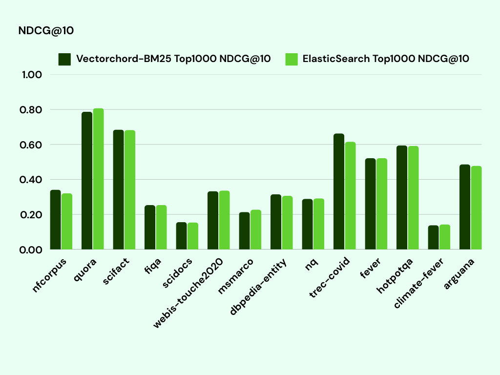

## VectorChord-BM25：通过 BM25 排名彻底提升 PostgreSQL 搜索性能和效果 — 甚至比 ElasticSearch 快 2.26 倍   
              
### 作者              
digoal              
              
### 日期              
2025-08-28             
              
### 标签              
PostgreSQL , PolarDB , DuckDB , RAG , GraphRAG , KAG , 向量 , FTS , 全文检索 , 词频 , 逆文档频率 , TF , IDF , token , rank , rerank , 图 , PGQ , BM25            
              
----              
              
## 背景      
VectorChord-BM25 是一款旨在增强 PostgreSQL 全文搜索功能的扩展插件。无论您是构建小型应用程序还是管理大型系统，此插件都能将高级 BM25 评分和 ranking 功能直接引入 PostgreSQL，让您的搜索更加智能、快捷。  
  
以下内容翻译自: https://blog.vectorchord.ai/vectorchord-bm25-revolutionize-postgresql-search-with-bm25-ranking-3x-faster-than-elasticsearch  
  
# VectorChord-BM25：通过 BM25 排名彻底提升 PostgreSQL 搜索性能和效果 — 甚至比 ElasticSearch 快 3 倍  
  
## VectorChord-BM25 带来了哪些新特性  
- BM25 评分和排名(ranking)：使用 BM25 获得更精确、更相关的搜索结果，帮助您找到最重要的内容。  
  
- 优化索引：得益于 Block WeakAnd 算法，即使对于大型数据集，搜索也更快、更高效。  
  
- 增强的标记化(Tokenization)：改进的词干(stemming)和停用词(stop word)处理意味着更好的准确性和更流畅的性能。  
  
我们构建的 VectorChord-BM25 简洁、强大，并与 PostgreSQL 完全集成 —— 因为我们相信优秀的插件应该让您的生活更轻松，而不是更复杂。  
  
https://github.com/tensorchord/VectorChord-bm25  
  
## BM25  
我们先来快速了解一下BM25，它是现代搜索引擎的强大算法。BM25 是一种概率排名函数，用于确定文档与搜索查询的相关程度。  
  
BM25 公式乍一看可能有点复杂，但为了便于理解，我们一步步分解一下。具体如下：  
  
$\text{score}(Q, D) = \sum_{q \in Q} \text{IDF}(q) \cdot \frac{f(q, D) \, (k_1 + 1)}{f(q, D) + k_1 \cdot \left(1 - b + b \cdot \frac{|D|}{\text{avgdl}}\right)}$  
   
词频 (TF) ：词频 `f(q,D)` 表示查询词`q`在文档`D`中出现的频率。某个词在文档中出现的次数越多，其相关性得分就越高。例如，如果“AI”在文档 A 中出现了 5 次，在文档 B 中出现了 2 次，那么文档 A 在该词上的得分就会更高。  
  
逆文档频率 (IDF)：`IDF(q)` 衡量词`q`在所有文档中的稀有度或常见度。稀有词（例如 “NVIDIA” , 很少文档提及这个词）比常见词（例如 “收入” , 很多文档都提及这个词）具有更高的权重。这确保了独特词对相关性得分的影响更大。  
  
文档长度归一化：术语 `∣D∣` 表示文档`D`的长度，而 `avgdl` 表示集合(全表所有记录)中所有文档的平均长度。公式的这一部分会根据文档长度调整分数，确保较短的文档不会受到不公平的惩罚。例如，一份简洁的报告不会被一份仅简要提及查询词的冗长报告所掩盖。  
  
可调整参数：参数`k1` 和`b`可用于微调公式。`k1` 控制词频对得分的影响程度，而`b` 则平衡文档长度归一化的影响。您可以调整这些参数，以优化特定数据集的结果。  
  
假设在财务报告数据库中搜索“特斯拉股票表现”。一份提及“特斯拉”十次的报告得分会高于仅提及两次的报告。然而，“股票”一词可能会出现在许多报告中，因此其权重低于更具体的“特斯拉”。此外，一份关于特斯拉股票表现的简短报告不会被一篇仅简短提及特斯拉的长篇报告所掩盖。  
  
## Postgres 中的现有解决方案  
了解完基础知识后，我们再来看看PostgreSQL现有的全文搜索解决方案。  
  
PostgreSQL 通过结合`tsvector`数据类型和 `GIN`（通用倒排索引）索引，内置了对全文搜索的支持。其工作原理如下：首先将文本转换为`tsvector`，并将内容标记为词素(lexemes, 类似词干) —— 标准化的词形，以提高搜索效率。然后，在`tsvector`列上创建 `GIN` 索引，从而显著提高查询性能，即使在处理大型文本字段时也能快速检索相关文档。这种文本处理和高级索引的集成，使 PostgreSQL 成为需要高效全文搜索的应用程序强大且可扩展的解决方案。  
  
```  
-- Create a table with a text column  
CREATE TABLE documents (  
    id SERIAL PRIMARY KEY,  
    content TEXT,  
    content_vector tsvector  
);  
  
-- Insert sample data with tsvector conversion  
INSERT INTO documents (content, content_vector) VALUES  
('PostgreSQL is a powerful, open-source database system.', to_tsvector(...)),  
('Full-text search in PostgreSQL is efficient and scalable.', to_tsvector(...)),  
('BM25 is a ranking function used by search engines.', to_tsvector(...));  
  
-- Create a GIN index on the tsvector column  
CREATE INDEX idx_content_vector ON documents USING GIN (content_vector);  
  
-- Query using tsvector, rank results with ts_rank, and leverage the GIN index  
SELECT id, content, ts_rank(content_vector, to_tsquery('english', 'PostgreSQL & search')) AS rank  
FROM documents  
WHERE content_vector @@ to_tsquery('english', 'PostgreSQL & search')  
ORDER BY rank DESC;  
```  
  
然而，PostgreSQL 有一个局限性：它缺乏像 BM25 这样的现代相关性评分机制。相反，它会返回所有匹配的文档，并依赖于对`ts_rank`它们进行重新排序，这可能效率低下。这使得用户很难快速识别最重要的结果，尤其是在处理大型数据集时。  
  
postgrespro 提供的 rum 插件可能是解决索引内部ts_rank的方案之一, 参考  
- [《PostgreSQL RUM 索引原理》](../202011/20201128_02.md)    
- [《PostgreSQL rum 索引结构 - 比gin posting list|tree 的ctid(行号)多了addition info》](../201907/20190706_01.md)    
  
  
另一个解决方案是 ParadeDB，它将全文搜索查询下推到 Tantivy 获取结果。它支持 BM25 评分和诸如否定词之类的复杂查询模式，旨在完全替代 ElasticSearch。然而，它使用自己独特的语法进行过滤和查询，并将过滤操作委托给 Tantivy，而不是直接依赖 Postgres。它的实现需要对 Postgres 的查询规划和存储进行多次挂钩，这可能会导致兼容性问题。  
  
参考:  
- [《Elasticsearch vs Paradedb pg_search - RAG绝配: PostgreSQL 混合搜索插件(全文检索+语义(向量)检索)》](../202409/20240918_04.md)    
- [《paradedb v0.7.0发布, 支持PostgreSQL数据湖插件pg_lakehouse 访问本地、远端对象存储的parquet,csv,json,avro,orc等文件》](../202405/20240520_01.md)    
- [《PostgreSQL pg_bm25(open source by paradedb)：Postgres 内部的弹性质量全文搜索 性能优于tsvector tsrank 20x》](../202310/20231016_03.md)    
  
相比之下，VectorChord-BM25 则采用了不同的方法。它专注于以轻量级和原生的方式将 BM25 ranking 功能引入 PostgreSQL。我们从零开始实现了 BM25 排序算法和 Block WeakAnd 技术，并将其构建为自定义运算符和索引（类似于`pgvector`），以加速查询。VectorChord-BM25 的设计直观高效，提供无缝的 API 来增强全文搜索和排序功能，同时与 PostgreSQL 生态系统完全集成。  
  
## VectorChord-BM25  
我们的实现引入了一种新方法，从头开始开发 BM25 索引和搜索算法，同时与 PostgreSQL 现有的开发接口无缝集成，以确保最大程度的兼容性。  
  
受 PISA 引擎、Tantivy 和 Lucene 的启发，我们引入了 BlockMax WeakAnd 算法，以实现高效的基于分数的筛选和排序。此外，我们使用位打包 (bitpacking) 进行 ID 压缩，以提高整体效率，并重新实现了基于用户数据的分词器，使其性能更接近 ElasticSearch 的性能。  
  
原理详见:  
- https://deepwiki.com/tensorchord/VectorChord-bm25  
  
下表比较了我们的实现与 ElasticSearch 在 [bm25-benchmarks](https://github.com/xhluca/bm25-benchmarks) 的各种数据集上的 `Top1000 查询的 QPS` —— 该指标用于衡量系统在每个查询返回前 1000  条记录时的qps性能：  
  
  
  
在所有测试数据集中，VectorChord-bm25 平均QPS比 ElasticSearch高出 3 倍，展现了其高效性和可扩展性。然而，单靠速度还不够 —— 我们更看重准确性。为了确保相关性，我们评估了`NDCG@10（Normalized Discounted Cumulative Gain at 10）`，这是评估排名质量的关键指标。  
  
> `NDCG@10（Normalized Discounted Cumulative Gain at 10）`是一种指标，用于评估排名列表前 10 位文档的相关性。它不仅强调每篇文档的相关性，还强调其排名，从而确保排名较高的相关文档对总分的贡献更大。  
下表比较了 VectorChord-BM25 和 ElasticSearch 在各种数据集上的 `NDCG@10` 分数：  
  
  
  
我们投入了大量精力，使 VectorChord-BM25 与 ElasticSearch 的行为保持一致，以确保公平准确的比较。如表所示，我们的实现在大多数数据集上实现了相当的 `NDCG@10` 分数，在某些情况下甚至超过了 ElasticSearch（例如 `trec-covid` 和 `scifact`）。  
  
我们将在后面的部分分享对齐工作的技术细节，包括我们如何处理标记化(tokenization)、评分以及其他关键组件以实现这些结果。在此之前，让我们先来探索如何在 PostgreSQL 中使用 VectorChord-BM25。  
  
## 快速启动  
为了帮助您快速上手 VectorChord-BM25，我们在[GitHub README](https://github.com/tensorchord/VectorChord-bm25/)中整理了一份详细的安装和配置指南。下方提供了一个完整的示例，演示如何在 Postgres 中使用 VectorChord-BM25 进行 BM25 全文搜索。每个 SQL 代码片段都附有清晰的解释，说明其功能及其用途。  
  
该扩展由三个主要组件组成：  
  
- Tokenizer：将文本转换为`bm25vector`，类似于存储`词汇ID`及其`频率`的稀疏向量。  
  
- bm25vector：表示适合 BM25 评分格式的tokenized文本类型。  
  
- bm25vector 索引：加快搜索和排名过程，使其更加高效。  
  
如果你想对一些文本进行分词，可以使用该tokenize函数。它接受两个参数：需要分词的`文本`和`分词器`的名称。  
  
```  
-- tokenize text with bert tokenizer  
SELECT tokenize('A quick brown fox jumps over the lazy dog.', 'Bert');  
-- Output: {2474:1, 2829:1, 3899:1, 4248:1, 4419:1, 5376:1, 5831:1}  
-- The output is a bm25vector, 2474:1 means the word with id 2474 appears once in the text.  
```  
  
BM25 分数的一个独特之处在于它依赖于全局文档频率。这意味着文档中某个单词的分数受该单词在集合中所有文档中出现的频率影响(所以创建索引最好是数据全部导入之后, 这样能得到更正确的IDF)。要计算 `bm25vector` 和 `query条件` 之间的 BM25 分数，首先需要一个文档集。准备好文档集后，即可使用`<&>`运算符进行计算。  
  
以下是一步步的示例。首先，创建一个表并插入一些文档：  
  
```  
-- Setup the document table  
CREATE TABLE documents (  
    id SERIAL PRIMARY KEY,  
    passage TEXT,  
    embedding bm25vector  
);  
  
INSERT INTO documents (passage) VALUES  
('PostgreSQL is a powerful, open-source object-relational database system. It has over 15 years of active development.'),  
('Full-text search is a technique for searching in plain-text documents or textual database fields. PostgreSQL supports this with tsvector.'),  
...  
('Effective search ranking algorithms, such as BM25, improve search results by understanding relevance.');  
```  
  
然后将其标记化  
```  
UPDATE documents SET embedding = tokenize(passage, 'Bert');  
```  
  
在 bm25vector 列上创建索引，以便我们可以收集全局文档频率。  
  
```  
CREATE INDEX documents_embedding_bm25 ON documents USING bm25 (embedding bm25_ops);  
```  
  
现在我们可以计算`查询`和`向量`之间的 BM25 得分。值得注意的是，BM25 得分为负数 —— 这是设计使然。得分越高（负数越小），文档相关性越高。我们特意将得分设为负数，以便您可以使用默认`ORDER BY`子句轻松地优先检索最相关的文档。  
  
```  
SELECT id, passage, embedding <&> to_bm25query('documents_embedding_bm25', 'PostgreSQL', 'Bert') AS rank  
FROM documents  
ORDER BY rank  
LIMIT 10;  
```  
  
## 其他标记器(Tokenizers)  
除了 `BERT` 之外，VectorChord-BM25 还支持`Tocken`和`Unicode`标记器。`Tocken`是基于`Unicode`在`wiki-103-raw`数据集上预训练的标记器，其最小频率（`min_freq`）为 10。由于它是一个预先训练的标记器，因此您可以像 `BERT` 一样使用它。  
  
```  
SELECT tokenize('A quick brown fox jumps over the lazy dog.', 'Tocken');  
```  
  
`Unicode` 是一个分词器，它会根据你的数据构建词汇表，类似于 Elasticsearch 和其他全文搜索引擎的标准行为。要启用此功能，你需要使用 `create_unicode_tokenizer_and_trigger(vocab_list_name, table_name, source_text_column, tokenized_vec_column)` 为你的数据创建一个特定的分词器。  
  
```  
CREATE TABLE documents (id SERIAL, text TEXT, embedding bm25vector);  
SELECT create_unicode_tokenizer_and_trigger('test_token', 'documents', 'text', 'embedding');  
  
INSERT INTO documents (text) VALUES ('PostgreSQL is a powerful, open-source object-relational database system.');  
CREATE INDEX documents_embedding_bm25 ON documents USING bm25 (embedding bm25_ops);  
SELECT id, text, embedding <&> to_bm25query('documents_embedding_bm25', 'PostgreSQL', 'test_token') AS rank  
    FROM documents  
    ORDER BY rank  
    LIMIT 10;  
```  
  
如果您想了解更多信息，请查看[标记器文档](https://github.com/tensorchord/VectorChord-bm25/blob/main/tokenizer.md)。  
  
## 比 ElasticSearch 更快（真的吗？）  
  
  
为了确保我们的新插件能够提供有意义且相关的结果，而不仅仅是更快的性能，我们使用[bm25-benchmarks](https://github.com/xhluca/bm25-benchmarks)对 `VectorChord-BM25` 进行了严格的评估。我们利用广受认可的 `BEIR` 信息检索基准，重点关注两个关键指标：`QPS`（每秒查询次数）用于衡量速度，`NDCG@10`（归一化折扣累积增益 10）用于评估相关性和排名准确性。  
  
在我们的初始版本中，我们很高兴地看到我们的系统实现了比 ElasticSearch高 3-5 倍的 QPS。然而，我们也注意到，在某些数据集上，我们的 `NDCG@10` 得分明显低于 ElasticSearch。经过彻底的分析，我们意识到这些差距并非由索引实现造成，而是由标记化(tokenization)方法的差异造成的。  
  
为了解决这个问题，我们投入了大量精力使我们的标记化过程与 ElasticSearch 保持一致，以确保更准确和公平的比较。  
  
### 问题 1：停用词列表  
  
> 停用词是在文本处理过程中被过滤掉的常见词，因为它没有什么意义，例如“the”、“is”和“at”等词。  
  
ElasticSearch 默认使用 Lucene 的标准分词器 (Standard Tokenizer)，它依赖于一个相对较短的停用词列表。相比之下，我们最初的实现使用了 NLTK 更全面的停用词列表。因此，ElasticSearch 的搜索会包含某些停用词，导致倒排索引列表更长，需要额外的扫描时间，最终影响性能。  
  
### 问题 2：词干提取(Stemming)  
  
> 词干分析器(stemmer)将单词简化为其基本形式，“running”和“ran”都变成“run”。  
  
我们最初使用 rust-stemmer 库中的 snowball 词干提取器来处理词汇变体，但我们发现与 ElasticSearch 的实现存在差异。经过调查，我们发现 rust-stemmer 的 snowball 版本已过时。根据官方 snowball 代码库的指导，我们使用最新版本重新生成了文件。  
  
当我们将系统与 ElasticSearch 的停用词列表和词干提取器对齐后，性能优势从 300% 下降到 40%。即便如此，在 `nq`、`fever` 和 `Climate-fever` 三个数据集上，性能差距仍然显著。更深入的比较揭示了一个微妙但关键的细节：在 bm25 基准测试中，ElasticSearch 的数据预处理方式与其他框架不同，这导致了下面这条差异。  
  
### 问题 3：数据预处理  
在 BEIR 数据集中，每个文档都包含一个标题和一个文本字段。虽然大多数框架会将这些字段连接成一个字符串进行索引，但 ElasticSearch 接受 JSON 输入，并分别对标题和文本进行索引。在查询过程中，ElasticSearch 会执行 multi_match 操作，分别搜索两个字段并合并它们的分数（使用较高分数加上较低分数的 0.5 倍）。这种方法可以获得明显更好的 `NDCG@10` 结果，但需要搜索两个单独的索引，这会显著影响(降低)性能。  
  
为了确保公平比较，我们通过连接标题和文本字段重新运行了 ElasticSearch 测试。经过此调整后，VectorChord-BM25 能够与 ElasticSearch 的结果匹敌。有趣的是，使用连接字段(即标题和文本字段内容合并)时，ElasticSearch 的QPS从 135 提升至 341，在 Top10 查询测试中比 VectorChord-BM25 的 271.91 QPS快 25%。然而，在 Top1000 测试中，VectorChord-BM25 的 QPS 为 112，而 ElasticSearch 为 49，这使得我们的实现速度提高了 2.26 倍。  
  
这次经历凸显了在不同的 BM25 全文搜索实现之间进行公平性能比较的挑战。分词器是一个非常复杂且影响深远的组件，而 ElasticSearch 复杂的默认设置又为评估过程增添了另一层复杂性。  
  
## 未来  
该项目尚处于早期阶段，我们已经确定了几个需要性能优化的领域。标记化本质上是一个复杂的过程 —— 即使对于英语，我们也面临着许多决策和权衡。我们的下一步是完全解耦标记化过程，将其转变为一个独立且可扩展的扩展。这将使我们能够支持多种语言，允许用户自定义标记化以获得更好的结果，甚至加入同义词处理等高级功能。  
  
我们的最终目标是让用户能够轻松地在 PostgreSQL 上执行高质量、基于相关性的全文搜索。结合 VectorChord，我们致力于为 RAG（检索增强生成）提供一流的数据基础架构。毕竟，选择 PostgreSQL 始终是一个明智的决定！  
  
https://github.com/tensorchord/VectorChord-bm25  
  
## 参考  
https://deepwiki.com/tensorchord/pg_tokenizer.rs  
  
https://blog.vectorchord.ai/vectorchord-bm25-revolutionize-postgresql-search-with-bm25-ranking-3x-faster-than-elasticsearch  
  
    
#### [期望 PostgreSQL|开源PolarDB 增加什么功能?](https://github.com/digoal/blog/issues/76 "269ac3d1c492e938c0191101c7238216")
  
  
#### [PolarDB 开源数据库](https://openpolardb.com/home "57258f76c37864c6e6d23383d05714ea")
  
  
#### [PolarDB 学习图谱](https://www.aliyun.com/database/openpolardb/activity "8642f60e04ed0c814bf9cb9677976bd4")
  
  
#### [PostgreSQL 解决方案集合](../201706/20170601_02.md "40cff096e9ed7122c512b35d8561d9c8")
  
  
#### [德哥 / digoal's Github - 公益是一辈子的事.](https://github.com/digoal/blog/blob/master/README.md "22709685feb7cab07d30f30387f0a9ae")
  
  
#### [About 德哥](https://github.com/digoal/blog/blob/master/me/readme.md "a37735981e7704886ffd590565582dd0")
  
  

  
