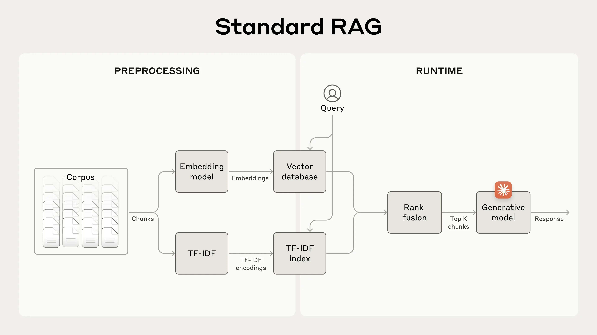
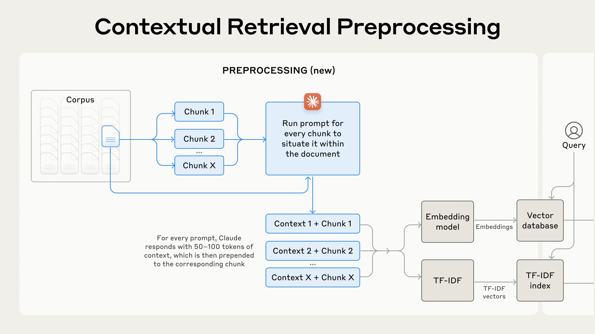
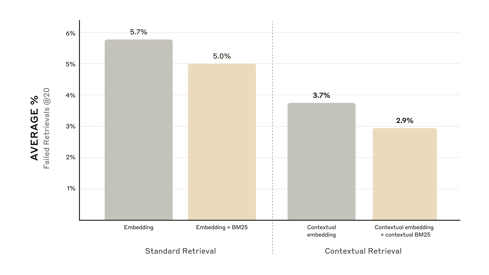
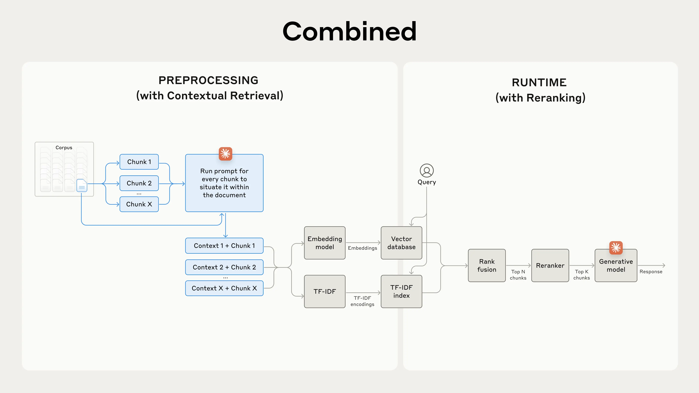
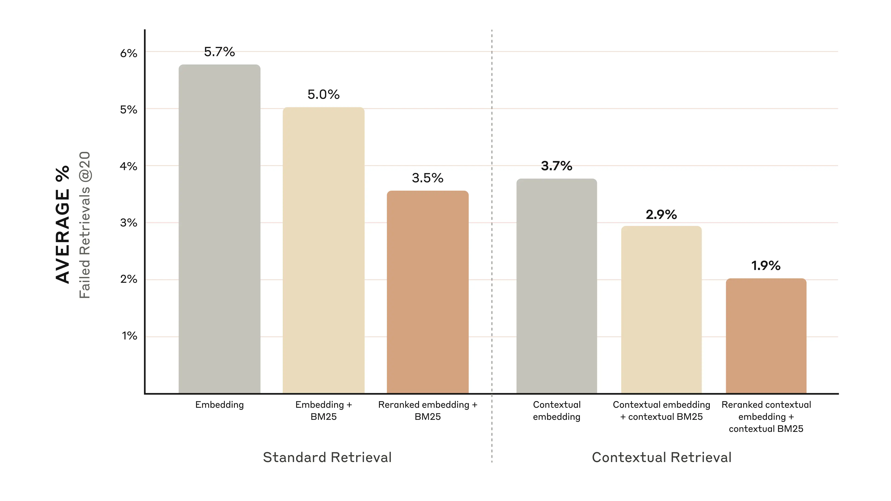
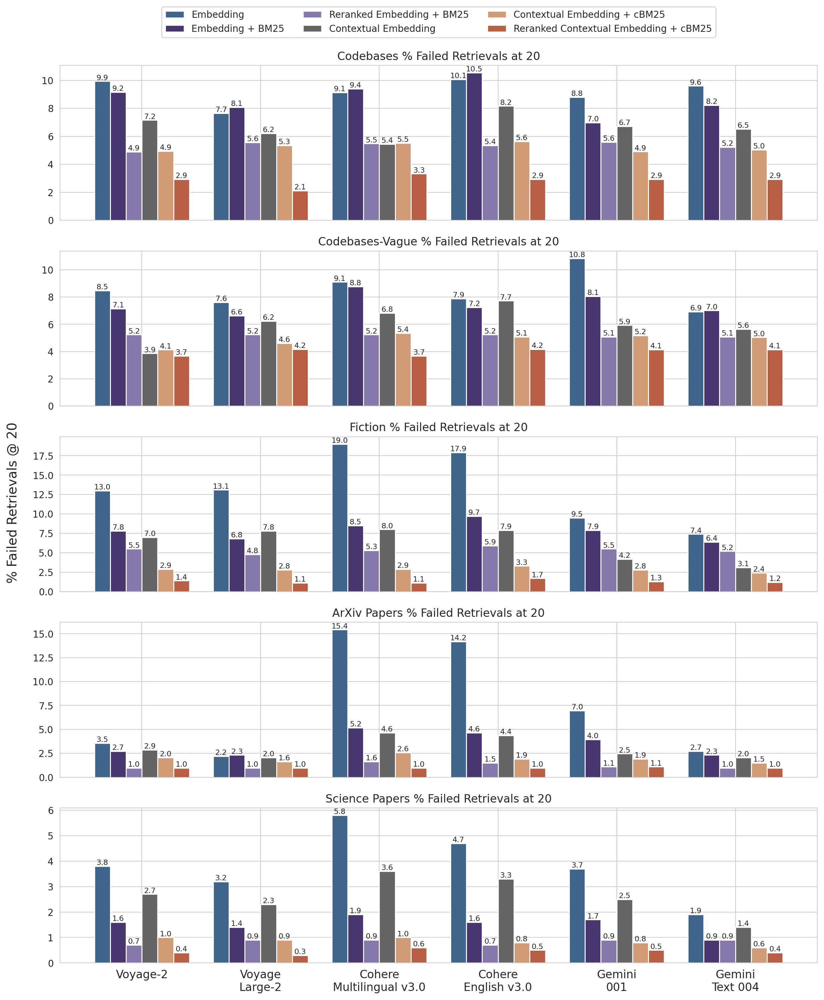

## 什么是上下文检索(contextual-retrieval)   
                
### 作者                
digoal                
                
### 日期                
2025-08-28               
                
### 标签                
PostgreSQL , PolarDB , DuckDB , RAG , GraphRAG , KAG , 向量 , 切片 , 上下文 , chunk , context , prompt caching , 上下文生成               
                
----                
                
## 背景     
构建RAG数据库过程中, 当需要将参考资料写入数据库之前, 由于模型支持的token数有限, 会先把文档进行切片(例如每500个token一片, 或者一句话一片等, 取决于切片算法.), 然后将切片以及对应的embedding存入数据库中.  
  
但是召回时会带来一个问题, 切片内容可能丢失上下文:  
  
例如，假设您的知识库中嵌入了一系列财务信息（例如，美国证券交易委员会文件），并且您收到以下问题：“ACME Corp 在 2023 年第二季度的收入增长是多少？”  
  
相关块可能包含这样的文本：“该公司的收入比上一季度增长了 3%。”然而，这一块本身并没有具体说明它指的是哪家公司或相关的时间段，这使得检索正确的信息或有效地使用信息变得困难。  
  
为了解决这个问题, 出现了很多相应的解决方案, 例如  
- 切片阶段, 两个相邻切片保持一定的重叠token, 从而减少上下文的丢失.  
- 召回阶段, 除了召回相关切片, 同时把相邻的N个切片一起召回.  
  
但是这样做还是不够完美, 因此有了本文的上下文检索.  
- 在生成了切片后, 使用模型再补充生成该切片的上下文信息. 同时存入向量数据库时, 以chunk+context的形式存入.  
  
以下内容翻译自: https://www.anthropic.com/news/contextual-retrieval  
  
# 什么是上下文检索(contextual-retrieval)  
  
为了使AI模型在特定情境中发挥作用，它通常需要获取背景知识。例如，客服聊天AI机器人需要了解其所服务的特定业务，而法律顾问AI机器人则需要了解大量的过往案例。  
  
开发人员通常使用检索增强生成 (RAG) 来增强 AI 模型的知识。RAG 是一种从知识库中检索相关信息并将其附加到用户提示中的方法，可以显著增强模型的响应能力。问题在于，传统的 RAG 解决方案在编码信息时会`删除上下文`，这通常导致系统无法从知识库中检索相关信息。  
  
在本文中，我们概述了一种显著改进 RAG 检索步骤的方法。该方法名为“上下文检索”，并运用两项子技术：`上下文 embedding` 和 `上下文 BM25`。该方法可将检索失败率减少 49%，与rerank结合使用时，可减少 67%。这显著提升了检索准确率，并直接转化为下游任务的更佳性能。  
  
您可以使用我们的[cookbook](https://github.com/anthropics/anthropic-cookbook/tree/main/skills/contextual-embeddings)轻松地与 Claude 一起部署您自己的`上下文检索`解决方案。  
  
## 关于简单使用long prompt的说明  
有时最简单的解决方案就是最好的。如果你的知识库小于 200,000 个词条（大约 500 页材料），你可以直接将整个知识库包含在你给模型的提示中，而无需使用 RAG 或类似的方法。  
  
几周前，我们发布了Claude 的[提示词缓存](https://docs.anthropic.com/en/docs/build-with-claude/prompt-caching)功能，这使得这种方法的速度显著提升，性价比更高。开发者现在可以在 API 调用之间缓存常用的提示，从而将延迟降低 2 倍以上，并将成本降低高达 90%（您可以阅读我们的[提示词缓存指南](https://github.com/anthropics/anthropic-cookbook/blob/main/misc/prompt_caching.ipynb)了解其工作原理）。  
  
然而，随着知识库的增长，您需要一个更具可扩展性的解决方案。这时，上下文检索就派上用场了。  
  
## RAG 入门：扩展到更大的知识库  
对于上下文窗口无法容纳的较大知识库，RAG 是典型的解决方案。RAG 的工作原理是使用以下步骤对知识库进行预处理：  
  
1、将知识库（文档的“语料库”）分解成更小的文本块(chunk)，通常不超过几百个标记(token)；  
  
2、使用嵌入模型(embedding model)将这些块转换为编码含义的向量嵌入(vector)；  
  
3、将这些嵌入(vector)存储在允许通过语义相似性(l2,余弦,内积等距离)进行搜索的向量数据库中。  
  
在运行时，当用户向模型输入查询时，向量数据库会根据与查询的语义相似度查找最相关的块。然后，最相关的块会被添加到发送给生成模型的提示中。  
  
虽然嵌入模型擅长捕捉语义关系，但它们可能会错过关键的精确匹配。幸运的是，有一种较老的技术可以解决这些问题。BM25（Best Matching 25）是一种排名函数，它使用词汇匹配来查找精确的单词或短语匹配。它对于包含准确标识或技术术语的查询尤其有效。  
  
BM25 的工作原理基于 TF-IDF（词频-逆文档频率）概念。TF-IDF 衡量一个词对文档集合中某个文档的重要程度。BM25 通过考虑文档长度并对词频应用饱和函数来改进这一方法，这有助于防止常见词汇占据主导地位。  
  
在语义嵌入失效的情况下，BM25 可以成功实现这一点：假设用户在技术支持数据库中查询“Error code TS-999”。嵌入模型可能会找到关于错误代码的一般内容，但可能会错过精确匹配的“TS-999”。BM25 会查找这个特定的文本字符串来识别相关文档。  
  
RAG 解决方案可以通过结合嵌入和 BM25 技术，更准确地检索最适用的块，具体步骤如下：  
  
1、将知识库（文档的“语料库”）分解成更小的文本块，通常不超过几百个标记；  
  
2、为这些块创建 TF-IDF 编码和语义嵌入；  
  
3、使用 BM25 根据精确匹配找到若干最相关的文本块；  
  
4、使用嵌入来根据语义相似性找到若干最相关的文本块；  
  
5、使用秩融合技术(rerank)，对 (3) 和 (4) 的结果进行合并和去重；  
  
6、将前 K 个相关文本块添加到提示中以生成响应。  
  
通过利用 BM25 和嵌入模型，传统 RAG 系统可以提供更全面、更准确的结果，在精确的术语匹配和更广泛的语义理解之间取得平衡。  
  
    
  
*标准检索增强生成 (RAG) 系统，使用嵌入(语义搜索)和BM25(关键词检索)来检索信息。TF-IDF（词频-逆文档频率）衡量词汇重要性，并构成 BM25 的基础。*  
  
这种方法可以让你经济高效地扩展到庞大的知识库，远远超出单个提示所能容纳的范围。但是，这些传统的 RAG 系统有一个明显的局限性：它们经常会破坏/丢失上下文。  
  
### 传统 RAG 中的上下文难题  
在传统的 RAG 中，文档通常会被拆分成更小的块以便高效检索。虽然这种方法对许多应用程序来说效果很好，但当单个块缺乏足够的上下文时，可能会导致问题。  
  
例如文章开头提到的，假设您的知识库中嵌入了一系列财务信息（例如，美国证券交易委员会文件），并且您收到以下问题：“ACME Corp 在 2023 年第二季度的收入增长是多少？”  
  
相关块可能包含这样的文本：“该公司的收入比上一季度增长了 3%。”然而，这一块本身并没有具体说明它指的是哪家公司或相关的时间段，这使得检索正确的信息或有效地使用信息变得困难。  
  
## 引入上下文检索  
上下文检索通过在嵌入（“上下文嵌入”）之前将特定于块的解释上下文添加到每个块并创建 BM25 索引（“上下文 BM25”）来解决此问题。  
  
让我们回到之前SEC文件收集的例子。下面是一个数据块如何转换的示例：  
  
```  
original_chunk = "The company's revenue grew by 3% over the previous quarter."  
  
contextualized_chunk = "This chunk is from an SEC filing on ACME corp's performance in Q2 2023; the previous quarter's revenue was $314 million. The company's revenue grew by 3% over the previous quarter."  
```  
  
值得注意的是，过去也曾提出过其他利用上下文来改进检索的方法。其他提案包括：[向块中添加通用文档摘要（我们进行了实验，但效果非常有限）](https://aclanthology.org/W02-0405.pdf)、[假设文档嵌入(hypothetical document embedding)](https://arxiv.org/abs/2212.10496)以及[基于摘要的索引（我们进行了评估，但性能不佳）](https://www.llamaindex.ai/blog/a-new-document-summary-index-for-llm-powered-qa-systems-9a32ece2f9ec)。这些方法与本文提出的方法不同。  
  
### 实现上下文检索  
当然，手动注释知识库中成千上万甚至数百万个词块的工作量实在太大。为了实现语境检索，我们采用了 Claude。我们编写了一个提示，指示模型提供简洁的、特定于词块的上下文，并使用整个文档的上下文来解释该词块。我们使用以下 Claude 3 Haiku 提示为每个词块生成上下文：  
```  
<document>   
{{WHOLE_DOCUMENT}}   
</document>   
Here is the chunk we want to situate within the whole document   
<chunk>   
{{CHUNK_CONTENT}}   
</chunk>   
Please give a short succinct context to situate this chunk within the overall document for the purposes of improving search retrieval of the chunk. Answer only with the succinct context and nothing else.   
```  
  
生成的上下文文本（通常为 50-100 个标记）在`计算块的embedding`以及`创建 BM25 索引`之前被添加到块的前面。  
  
实际的预处理流程如下：  
  
  
  
*上下文检索是一种提高检索准确性的预处理技术。*  
  
如果您有兴趣使用上下文检索，您可以从我们的[cookbook](https://github.com/anthropics/anthropic-cookbook/tree/main/skills/contextual-embeddings)开始。  
  
### 使用即时缓存来降低上下文检索的成本  
得益于我们上文提到的特殊prompt caching功能，Claude 能够以低成本实现上下文检索。使用即时缓存(prompt caching)，您无需为每个块传递参考文档。只需将文档加载到缓存中一次，然后引用之前缓存的内容即可。假设包含 800 个token块、8000 个token文档、50 个token上下文指令和 100 个上下文token，则生成上下文化块的一次性成本为每百万个文档token 1.02 美元。  
  
#### 方法论  
我们针对不同的知识领域（代码库、小说、ArXiv 论文、科学论文）、embedding模型、检索策略和评估指标进行了实验。[附录](https://assets.anthropic.com/m/1632cded0a125333/original/Contextual-Retrieval-Appendix-2.pdf)列出了针对每个领域使用的一些问题和答案的示例。  
  
下图展示了使用性能最佳的嵌入配置 (Gemini Text 004) 检索前 20 个块时，所有知识领域的平均性能。我们使用 1 减去 `recall@20` 作为评估指标，该指标衡量的是前 20 个块中未能检索到的相关文档的百分比。您可以在附录中查看完整结果 —— 在我们评估的每种嵌入-源组合中，语境化都能提升性能。  
  
### 性能改进  
我们的实验表明：  
  
- 上下文嵌入将前 20 个块检索失败率降低了 `35%（5.7% → 3.7%）`。  
- 结合上下文嵌入和上下文 BM25，前 20 个块检索失败率降低了 `49%（5.7% → 2.9%）`。  
  
  
  
*结合上下文嵌入和上下文 BM25，可将前 20 个块检索失败率降低 49%。*  
  
### 实施注意事项  
在实施上下文检索时，需要牢记以下几点注意事项：  
  
1、块边界：考虑如何将文档拆分成块。块大小、块边界和块重叠的选择会影响检索性能。参考  
- https://www.pinecone.io/learn/chunking-strategies/  
- https://research.trychroma.com/evaluating-chunking  
  
2、嵌入模型：尽管上下文检索能够提升我们测试的所有嵌入模型的性能，但某些嵌入模型的效果可能比其他模型更好。我们发现[Gemini](https://ai.google.dev/gemini-api/docs/embeddings)和[Voyage](https://www.voyageai.com/)嵌入尤其有效。  
  
3、自定义语境(context)提示：虽然我们提供的通用提示效果很好，但您可以使用针对特定领域或用例定制的提示来获得更好的结果（例如，包括可能仅在知识库中的其他文档中定义的关键术语词汇表）。  
  
4、块数：在上下文窗口中添加更多块可以增加包含相关信息的几率。但是，过多的信息可能会分散模型的注意力，因此需要限制。我们尝试了 5、10 和 20 个块，发现使用 20 个块的性能最佳（比较结果请参阅附录），但值得根据您的用例进行实验。  
  
始终运行 evals：可以通过传递合并但区分`上下文的块`和`原始块`的信息来改进生成效果。  
  
## 通过reranking进一步提升性能  
最后一步，我们可以将上下文检索与其他技术相结合，以进一步提升性能。在传统的上下文检索中，AI 系统会搜索其知识库以查找潜在相关的信息块。对于大型知识库，这种初始检索通常会返回大量（有时甚至数百个）具有不同相关性和重要性的块。  
  
reranking(重新排序)是一种常用的过滤技术，用于确保仅将最相关的数据块(chunk)传递给模型。重新排序可以提供更佳的响应，并降低成本和延迟，因为模型处理的信息更少。关键步骤如下：  
  
1、执行初始检索以获取最可能相关的块（我们使用了前 150 个）；  
  
2、将前 N 个块连同用户的查询一起传递到重新排名(reranking)模型；  
  
3、使用重新排序模型，根据每个块与提示的相关性和重要性为其评分，然后选择前 K 个块（我们使用了前 20 个）；  
  
4、将前 K 个块作为上下文传递到模型中以生成最终结果。  
  
  
  
*结合上下文检索和重新排序来最大化检索准确性。*  
  
## 性能改进  
市面上有多种重排序模型。我们使用[Cohere reranker](https://cohere.com/rerank)进行了测试。Voyage也提供了一个[重排序器](https://docs.voyageai.com/docs/reranker)，但我们没有时间测试。我们的实验表明，在各个领域，添加重排序步骤可以进一步优化检索。  
  
具体来说，我们发现重新排序的`上下文 embedding` 和`上下文 BM25` 将前 20 个块检索失败率降低了 `67%（5.7% → 1.9%）`。  
  
  
  
*重新排序的上下文嵌入和上下文 BM25 将前 20 个块的检索失败率降低了 67%。*  
  
### 成本和延迟考虑因素  
重新排序的一个重要考虑因素是其对延迟和成本的影响，尤其是在对大量数据块进行重新排序时。由于重新排序会在运行时增加一个额外的步骤，因此即使重新排序器并行对所有数据块进行评分，也不可避免地会增加少量延迟。为了获得更好的性能而重新排序更多数据块，与为了降低延迟和成本而重新排序更少数据块之间存在着内在的权衡。我们建议您根据具体用例尝试不同的设置，以找到合适的平衡点。  
  
vectorchord把重排做到了数据库内部, 可降低reranking的延迟, 可关注我的相关文章.  
  
## 结论  
我们进行了大量的测试，比较了上述所有技术的不同组合（嵌入模型、使用 BM25、使用上下文检索、使用重排序器以及检索出的 Top-K 个结果总数），测试涵盖了各种不同的数据集类型。以下是我们的测试结果摘要：  
  
1、Embeddings + BM25 比单独嵌入更好；  
  
2、在我们测试的模型中，Voyage 和 Gemini 的嵌入效果最好；  
  
3、将前 20 个块传递给模型比仅传递前 10 个或前 5 个块更有效；  
  
4、为块添加上下文可以大大提高检索准确性；  
  
5、重新排名总是比不重新排名好；  
  
所有这些好处都是叠加的：为了最大限度地提高性能，我们可以将上下文嵌入（来自 Voyage 或 Gemini）与上下文 BM25 相结合，再加上重新排序步骤，并将 20 个块添加到提示中。  
  
我们鼓励所有使用知识库的开发人员使用我们的[cookbook 手册](https://github.com/anthropics/anthropic-cookbook/tree/main/skills/contextual-embeddings)来尝试这些方法，以解锁新的性能水平。  
  
## 附录一  
以下是跨数据集、嵌入提供商、除嵌入之外的 BM25 的使用、上下文检索的使用以及对 `检索 @20` 的重新排序的使用的结果详细数据。  
  
请参阅[附录 II](https://assets.anthropic.com/m/1632cded0a125333/original/Contextual-Retrieval-Appendix-2.pdf)，了解检索 `@ 10` 和 `@ 5` 的细目分类以及每个数据集的示例问题和答案。  
  
  
  
*跨数据集和嵌入提供商的召回率数据: `1 - recall@20`。*  
  
    
  
## 参考  
https://www.anthropic.com/news/contextual-retrieval  
  
https://blog.vectorchord.ai/optimize-rag-with-contextual-retrieval-in-postgresql  
  
    
#### [期望 PostgreSQL|开源PolarDB 增加什么功能?](https://github.com/digoal/blog/issues/76 "269ac3d1c492e938c0191101c7238216")
  
  
#### [PolarDB 开源数据库](https://openpolardb.com/home "57258f76c37864c6e6d23383d05714ea")
  
  
#### [PolarDB 学习图谱](https://www.aliyun.com/database/openpolardb/activity "8642f60e04ed0c814bf9cb9677976bd4")
  
  
#### [PostgreSQL 解决方案集合](../201706/20170601_02.md "40cff096e9ed7122c512b35d8561d9c8")
  
  
#### [德哥 / digoal's Github - 公益是一辈子的事.](https://github.com/digoal/blog/blob/master/README.md "22709685feb7cab07d30f30387f0a9ae")
  
  
#### [About 德哥](https://github.com/digoal/blog/blob/master/me/readme.md "a37735981e7704886ffd590565582dd0")
  
  

  
