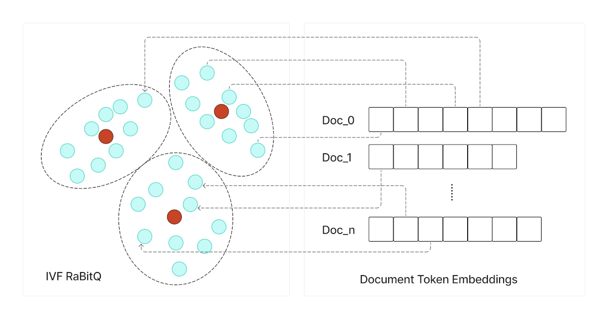
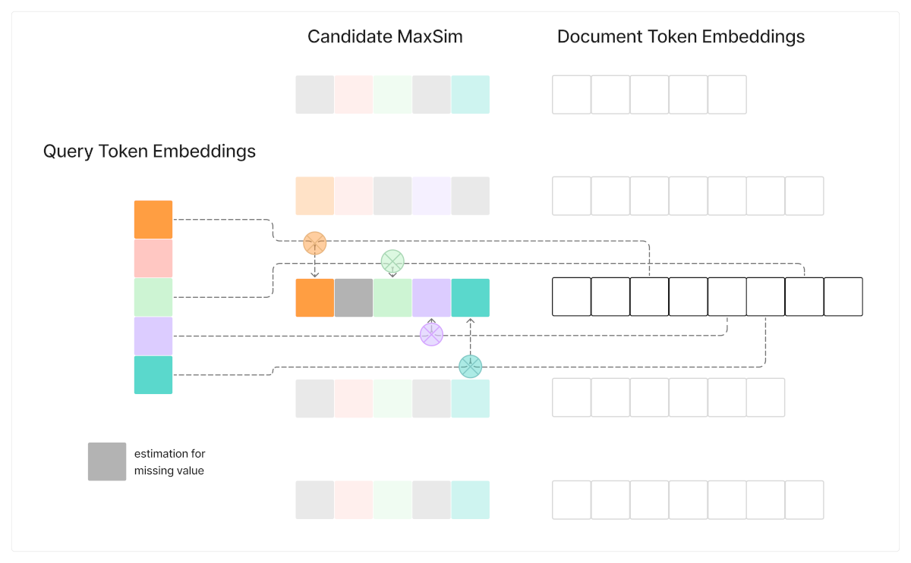

## 什么是多向量(multi-vector)相似搜索?   
                  
### 作者                  
digoal                  
                  
### 日期                  
2025-08-28                 
                  
### 标签                  
PostgreSQL , PolarDB , DuckDB , token embedding , chunk embedding , embedding 聚合 , embedding 数组 , multi-vector , MaxSim             
                  
----                  
                  
## 背景   
embedding模型可以将文本转换为向量(vector), 便于后期基于语义进行相似搜索.  
  
一句话可以转换为一个向量.  
  
一个token(单词或字)也可以转换为一个向量.  
  
一段文本(chunk)也可转换为一个向量.  
  
通常情况下是采用最后一种模式, 文本(chunk)向量. 但是可能导致一些问题, 由于是将这个chunk的所有token聚合的向量, chunk内的关键词特征可能被丢失或掩盖了. 导致RAG召回相关性不佳.  
  
因此就有了混合搜索+reranking解决方案.  
  
但其实还有一种解决方案, 那就是multi-vector搜索, 但是运算量激增, 为了解决运算量问题, vectorchord是怎么做的呢? 本文就来说说.  
  
multi-vector搜索的应用可参考另一篇文档:  
- [《不是混合搜索? 另一种解决方案提高向量搜索结果相关性! 使用 PostgreSQL 中的 ColBERT rerank 增强向量搜索》](../202508/20250827_05.md)    
  
以下内容翻译自: https://blog.vectorchord.ai/vectorchord-03-bringing-efficient-multi-vector-contextual-late-interaction-in-postgresql  
  
# 什么是多向量(multi-vector)相似搜索?   
  
我们非常高兴地宣布VectorChord 0.3正式发布，这是一个重要的里程碑，它显著提升了 Postgres 数据库中高级向量搜索技术的性能和适用性！0.2 版本引入了 ARM 支持和更快的索引速度，在此基础上，0.3 版本解决了现代检索领域最大的难题之一：高效的多向量搜索和后期交互(late interaction)。  
  
## 超越单向量：多向量为何如此重要  
多年来，向量搜索主要将整个文档或查询表示为单个密集向量。这种方法虽然功能强大，但需要将复杂信息平均化或压缩成一种表示形式，这不可避免地会导致细微差别的信息丢失。想象一下，如果试图用一句话概括一份详细的技术文档的全部含义，你会丢失细节！  
  
进入多向量表示和后期交互，由[ColBERT](https://github.com/stanford-futuredata/ColBERT)等模型率先提出。这些模型不再为每个项目生成一个向量，而是生成多个向量 —— 通常每个标记（token/单词或子词）一个。真正的魔力发生在搜索过程中：  
  
1、查询编码：您的搜索查询也被分解为多个标记向量（我们称之为 q1、q2、...、qN）。  
  
2、文档编码：类似地，文档由其标记(token)向量（d1，d2，... dM）表示。  
  
3、后期交互和 MaxSim 聚合：我们进行细粒度匹配，而非单次比较。其核心思想是最大相似度 (MaxSim)运算。对于每个查询标记(token)向量（例如 q_i），我们会在所有文档标记（d1 到 dM）中找到与其相似度（例如余弦相似度或点积）最高的文档标记向量 (d_j)。对每个查询标记（q1、q2、...、qN）重复此过程。然后，通过将每个查询标记获得的最大相似度值相加，计算出文档的最终相关性得分。此运算本质上是不对称的，其关注点在于查询的每个部分在文档中的表现程度。  
  
为什么这样更好？  
  
1、语境细微差别：与 MaxSim 的后期交互使模型能够捕捉细粒度的语义关系。它可以识别查询中的特定重要术语是否与文档的特定部分高度匹配，而不是依赖于可能被稀释的整体平均相似度。  
  
2、提升相关性：通过考虑集中的、标记级交互并汇总每个查询词的最佳匹配，像 ColBERT 这样的模型实现了一流的检索质量。这种细粒度的方法对于包含多个词的内容丰富的查询尤其有效，从而能够更好地理解用户意图。在[BEIR 基准测试](https://huggingface.co/answerdotai/ModernBERT-base#base-models)中，这转化为显著的性能提升：使用相同的[ModernBert模型](https://huggingface.co/answerdotai/ModernBERT-base)，Colbert 变体实现了 `51.6 NDCG@10` 得分，而密集向量变体得分是 `41.6`。  
  
我们之前的博客文章探讨了如何使用 ColBERT 进行重新排名，并展示了它的强大功能：  
- [在 PostgreSQL 中使用 ColBERT Rerank 增强向量搜索](https://blog.vectorchord.ai/supercharge-vector-search-with-colbert-rerank-in-postgresql)  
- [《不是混合搜索? 另一种解决方案提高向量搜索结果相关性! 使用 PostgreSQL 中的 ColBERT rerank 增强向量搜索》](../202508/20250827_05.md)    
  
## VectorChord 0.3：受 WARP 启发，为 Postgres 带来高效的 MaxSim  
VectorChord 0.3 直面后期交互的高计算成本。我们将高度优化的多向量后期交互 MaxSim 算子和索引集成到核心 Rust 引擎中，并从突破性的WARP 引擎中汲取灵感（论文：WARP：[一种高效的多向量检索引擎](https://arxiv.org/abs/2501.17788)，代码：[jlscheerer/xtr-warp](https://github.com/jlscheerer/xtr-warp)）。  
  
WARP 方法的精妙之处在于其基本原理：复杂的多向量 MaxSim 计算（将 N 个查询向量与 M 个文档向量进行比较）可以巧妙地分解为多个独立的单向量搜索过程。WARP 无需进行一次大规模的 N x M 比较，而是有效地针对索引文档向量执行 N 次单独的搜索（每个查询标记向量一次），以找到最佳匹配。  
  
  
  
我们对 VectorChord 0.3 版 MaxSim 扫描器的核心改进正是基于这一理念。我们通过利用和编排 VectorChord 现有的高度优化的单向量搜索基础架构实现了 MaxSim 。当使用索引执行 MaxSim 查询时，VectorChord 会使用我们底层的索引结构（ IVF 与 RaBitQ 相结合）执行多个单向量搜索，每个查询向量对应一个。然后，它会根据 MaxSim 求和规则高效地汇总结果。为了估算缺失值，我们采用了 WARP 的方法，使用到质心的距离和累积聚类大小来估算潜在候选集的 MaxSim 分数。  
  
  
  
重用我们优化的单向量搜索组件，确保 MaxSim 能够从现有的性能调优和稳定性中获益。更重要的是，它为用户提供了无缝的体验：您可以利用相同的熟悉索引类型（带有 RaBitQ 的 IVF）进行单向量和多向量 MaxSim 搜索，而无需单独的系统。VectorChord 0.3 自豪地成为首个提供这种高效、分解式 MaxSim 实现的 Postgres 扩展，使最先进的多向量检索能够直接在您的数据库中实现实用且高性能。  
  
## 解锁强大用例  
这种新的效率为尖端技术的实际应用打开了大门：  
  
1、高性能 ColBERT 重排序(reranking)：将 ColBERT 卓越的相关性排序应用于通过更快的第一阶段搜索（例如传统的向量搜索或关键字搜索）检索到的候选集，而不会产生过高的延迟损失。兼顾速度和质量。  
  
2、无 OCR 文档搜索 (ColPali/ColQwen)：想象一下，无需单独且容易出错的 OCR（光学字符识别）步骤，即可直接在扫描文档、PDF 或图像中进行搜索。像 ColPali 或 ColQwen 这样的模型可以直接从图像块生成标记嵌入。借助 VectorChord 0.3 高效的 MaxSim，您现在可以直接在 Postgres 中对这些可视化标记嵌入执行后期交互搜索，从而实现对以前纯文本方法无法访问的文档的强大搜索。  
  
参考: [《超越文本: 使用 Modal 和 PostgreSQL+VectorChord 解锁无 OCR 的 RAG, 无惧PDF、扫描文档等》](../202508/20250827_03.md)    
  
## 性能亮点  
我们在FiQA（金融观点挖掘和问答）数据集上测试了 VectorChord 0.3 新增的多向量 MaxSim 功能。该标准基准包含 57,000 份文档，累计约 1500 万个标记。  
  
我们使用由 VectorChord 优化引擎驱动的ColBERTv2进行的初步基准测试结果显示出良好的性能：  
  
1、相关性：我们的`NDCG@10` 得分为 `34.1`。这与原始 WARP 论文中针对同一数据集报告的 `33.6 NDCG@10` 相比，表现更为出色。  
  
2、速度：查询执行效率高，平均每个查询仅需 35 毫秒。  
  
虽然这些是基于单个数据集的初步结果，我们仍在持续优化，但它们展现了 VectorChord 0.3 的潜力。用户现在可以利用多向量搜索和后期交互的高级关联功能，以惊人的速度接近通常与更简单的单向量方法相关的延迟，所有这些都直接在他们的 Postgres 数据库中完成。  
  
## 开始使用 VectorChord 0.3  
先决条件：  
  
安装了 VectorChord v0.3 的 PostgreSQL 服务  
  
您可以使用我们的 VectorChord-Suite docker image：  
  
```  
docker run --rm --name vchord_db -d -e POSTGRES_PASSWORD=postgres -p 5432:5432 ghcr.io/tensorchord/vchord-postgres:pg17-v0.3.0  
```  
  
步骤 1：创建多向量数据表  
  
首先，定义一个表来存储数据。关键区别在于，向量列使用数组类型 ( `vector[]` )，这样每行可以容纳多个向量。  
  
```  
-- Define a table to store items (e.g., documents), each potentially having multiple vectors.  
-- Replace '128' with your actual vector dimensionality.  
CREATE TABLE doc (  
    id SERIAL PRIMARY KEY, -- A unique identifier for each item  
    vecs vector(128)[] -- The column storing an ARRAY of 128-dimensional vectors  
);  
```  
  
步骤 2：插入多向量数据  
  
将数据插入表中。`vecs` 列采用包含向量类型的 PostgreSQL 数组。  
  
```  
-- Insert sample data: one document with 2 vectors, another with 3.  
-- Ensure vector dimensions match your table definition (128 in this example).  
INSERT INTO doc (id, vecs) VALUES  
    (1, array[array[0.1, 0.2, ..., 0.9]::vector, array[0.8, 0.7, ..., 0.1]::vector]),  
    (2, array[array[0.5, 0.5, ..., 0.5]::vector, array[0.3, 0.4, ..., 0.7]::vector, array[0.9, 0.1, ..., 0.4]::vector]);  
-- Add more data as needed...  
```  
  
步骤 3：使用 MaxSim 支持创建`vchordrq`索引  
  
为了加速 MaxSim 搜索，请使用 `vchordrq` 方法创建索引并指定`vector_maxsim_ops`操作符类。这里的关键参数是`build.internal.lists`。  
  
- 计算 `n`：估计整个数据集中单个向量的总数。  
  
$n=N_{doc}*\text{avg}(N_{vector\_per\_doc})$  
  
- 设置 `lists`：建议的范围build.internal.lists是  
  
$4 * \sqrt n < \text{lists} < 8 * \sqrt n$  
  
选择此范围内的值（通常 2 的幂效果很好）。  
  
```  
-- Example Calculation:  
-- If you have 1,000,000 documents (rows) with an average of 5 vectors each:  
-- n = 1,000,000 * 5 = 5,000,000 sqrt(n) ≈ 2236   
-- Lower bound: 4 * 2236 ≈ 8944  
-- Upper bound: 8 * 2236 ≈ 17888  
-- A good value for 'lists' could be 16384 (power of 2).  
-- Assume the K-means clusters are balanced, each will have about 305 vectors.  
  
-- Create the index using vchordrq and vector_maxsim_ops  
CREATE INDEX doc_vecs_idx ON doc USING vchordrq (vecs vector_maxsim_ops)  
WITH (options = $$  
build.internal.lists = [16384] -- Adjust this value based on your calculation!  
$$);  
```  
  
步骤 4：配置搜索参数（可选但推荐）  
  
在查询之前，您可以调整运行时参数以提高性能和准确性：  
  
- `vchordrq.probes`：控制搜索过程中检查的索引列表（集群）数量。值越高，准确率（召回率）越高，但搜索速度越慢。查找前 10 个结果 ( `LIMIT 10` ) 的常见起始值为 32。  
  
- `vchordrq.maxsim_refine`：限制每个候选查询标记向量以原始精度（否则将使用位距离）重新计算的向量对的数量。这与 `probes` 相关，探测向量的 `20%` 的值就足够了。  
  
```  
-- Set runtime parameters for the current session/transaction  
SET vchordrq.probes = 32; -- Adjust based on desired recall vs. speed trade-off  
SET vchordrq.maxsim_refine = 2000; -- Adjust based on desired recall vs. speed trade-off  
```  
  
步骤 5：执行 MaxSim 相似性搜索  
  
现在，您可以使用`@#` MaxSim 运算符进行查询。请将查询向量作为 PostgreSQL 向量类型的数组提供。  
  
```  
-- Find the top 10 documents most similar to the given set of query vectors  
SELECT id FROM doc   
ORDER BY vecs @# ARRAY[array[0.4, 0.1, ..., 0.8]::vector, array[0.7, 0.2, ..., 0.3]::vector]  
LIMIT 10;  
```  
  
现在，您已成功建表，为其创建索引以进行多向量 MaxSim 搜索，并使用 VectorChord 0.3 的 MaxSim 运算符执行了您的第一个查询！请尝试使用`probes`和`max_maxsim_tuples`参数，以根据您的具体用例找到速度和准确性的最佳平衡。  
  
https://github.com/tensorchord/VectorChord  

## 参考  
https://blog.vectorchord.ai/vectorchord-03-bringing-efficient-multi-vector-contextual-late-interaction-in-postgresql  
    
[《不是混合搜索? 另一种解决方案提高向量搜索结果相关性! 使用 PostgreSQL 中的 ColBERT rerank 增强向量搜索》](../202508/20250827_05.md)    
    
#### [期望 PostgreSQL|开源PolarDB 增加什么功能?](https://github.com/digoal/blog/issues/76 "269ac3d1c492e938c0191101c7238216")
  
  
#### [PolarDB 开源数据库](https://openpolardb.com/home "57258f76c37864c6e6d23383d05714ea")
  
  
#### [PolarDB 学习图谱](https://www.aliyun.com/database/openpolardb/activity "8642f60e04ed0c814bf9cb9677976bd4")
  
  
#### [PostgreSQL 解决方案集合](../201706/20170601_02.md "40cff096e9ed7122c512b35d8561d9c8")
  
  
#### [德哥 / digoal's Github - 公益是一辈子的事.](https://github.com/digoal/blog/blob/master/README.md "22709685feb7cab07d30f30387f0a9ae")
  
  
#### [About 德哥](https://github.com/digoal/blog/blob/master/me/readme.md "a37735981e7704886ffd590565582dd0")
  
  

  
