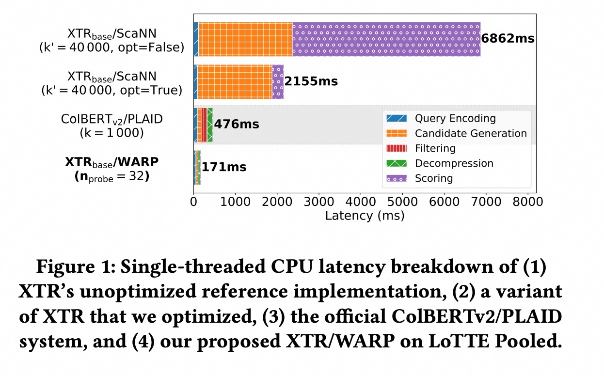

## AI论文解读 | WARP: An Efficient Engine for Multi-Vector Retrieval
        
### 作者        
digoal        
        
### 日期        
2025-08-30       
        
### 标签        
PostgreSQL , PolarDB , DuckDB , AI , 论文解读        
        
----        
        
## 背景  
      
https://arxiv.org/abs/2501.17788        
  
提示:          
```          
读懂《WARP: An Efficient Engine for Multi-Vector Retrieval》这篇论文需要提前掌握哪些基础知识, 请使用中文通熟易懂的讲解这些基础知识, 可以引用论文中的图、表或使用Markdown支持的图形(text,mermaid等)增加解释性. 
  
使用中文通熟易懂的解读《WARP: An Efficient Engine for Multi-Vector Retrieval》这篇论文, 其中的关键内容请着重讲解, 可以引用论文中的图、表或使用Markdown支持的图形(text,mermaid等)增加解释性. 
  
提取《WARP: An Efficient Engine for Multi-Vector Retrieval》这篇论文中的重要术语, 使用中文对这些术语进行通熟易懂的讲解, 可以引用论文中的图、表或使用Markdown支持的图形(text,mermaid等)增加解释性. 
```     
  
## 1 前置知识 
  
读懂《WARP: An Efficient Engine for Multi-Vector Retrieval》这篇论文需要您提前掌握一系列基础知识，这些知识主要集中在信息检索、自然语言处理和向量数据库领域。下面我将用通俗易懂的方式为您逐一讲解，并引用论文中的概念进行解释。

-----

### 1\. 信息检索与向量检索基础 (Information Retrieval & Vector Retrieval)

信息检索（IR）简单来说就是如何从海量数据中快速找到用户需要的信息。这篇论文讨论的是一种基于神经网络的 **密集检索 (Dense Retrieval)** 方法 。

  * **密集检索 (Dense Retrieval)**：与传统的**稀疏检索 (Sparse Retrieval)**（如TF-IDF、BM25，基于关键词匹配）不同，密集检索使用神经网络将查询（Query）和文档（Document）都转换成一个或多个**向量 (Vector)**，然后通过计算向量之间的相似度（如余弦相似度）来衡量它们的相关性。向量越接近，相似度越高。
  * **单向量 vs. 多向量 (Single-Vector vs. Multi-Vector)**：
      * **单向量方法**：将整个文档压缩成一个单一的向量。这种方式虽然效率高，但会丢失文档中的很多细节信息，难以捕捉复杂的文档结构 。
      * **多向量方法**：论文中提到的 **ColBERT**  和 **XTR**  属于多向量范式。它们将查询和文档都编码成多个向量，通常是每个“词元（token）”对应一个向量 。这种方式能更丰富地表示文档内容，捕捉更精细的语义信息，因此准确率更高。

### 2\. Transformer模型与后期交互 (Late Interaction)

  * **Transformer模型**：论文中提到的模型都基于预训练的 **Transformer** 模型 ，这是目前自然语言处理领域最流行的模型架构。您需要了解它能将文本转换成高维的向量表示。
  * **后期交互 (Late Interaction)**：这是这篇论文的核心思想。传统的密集检索方法通常在向量生成后就进行交互，而“后期交互”范式则将交互推迟到检索阶段 。
      * 在 ColBERT 中，查询向量和文档向量集进行“后期交互”，通过计算每个查询向量与所有文档向量之间的最大相似度来得到最终分数 。这种设计可以处理大规模文档集，并且易于并行化。

### 3\. ColBERT 与 XTR 框架 (ColBERT & XTR Frameworks)

WARP引擎正是为了优化这两种多向量检索框架而诞生的。

  * **ColBERT**: 论文提到，**ColBERTv2/PLAID** 是一个高效的 ColBERT 变体，它通过高效地修剪不相关的文档来加速检索 。
  * **XTR (Contextualized Token Retriever)**: 这是 ColBERT 的一个概念性优化版本 。它简化了评分过程，并**完全消除了“收集（gathering）”阶段** 。然而，论文指出，XTR的参考实现因依赖通用向量库和低效的Python数据结构，导致其端到端延迟仍然很高 。WARP 正是为了解决 XTR 的这些性能瓶颈而设计。

### 4\. 向量量化与压缩 (Vector Quantization & Compression)

为了解决存储和计算开销问题，多向量方法通常会对向量进行压缩。

  * **残差压缩 (Residual Compression)**：WARP 和 ColBERTv2 都使用残差压缩技术。它通过 **k-means 聚类**将文档向量分组，并仅存储每个向量与其最近聚类中心（centroid）的**残差 (residual)** 。
  * **隐式解压缩 (Implicit Decompression)**：这是 WARP 的一个关键创新 。传统的系统在计算相似度之前需要先将压缩向量完全解压。而 WARP 发现，评分函数可以分解成两部分，它在检索过程中直接利用查询-聚类中心相似度来计算最终分数，从而避免了耗时的显式解压缩步骤 。

### 5\. WARP 的核心优化 (WARP's Core Innovations)

论文的核心内容是 WARP 如何通过三大创新来大幅提升检索效率 。

1.  **WARPSELECT (动态相似度填充)**：在 XTR 中，有些文档词元可能没有被检索到，因此评分矩阵会存在“缺失值” 。WARPSELECT 提出了一种新的策略，利用聚类中心累积大小来动态估计这些缺失值，而不是简单地用最低分数来填充，从而在不影响准确率的情况下提升了效率 。
2.  **隐式解压缩 (Implicit Decompression)**：如上所述，WARP 在计算相似度时避免了向量的完全解压缩，直接利用数学分解来加速计算 。
3.  **两阶段归约过程 (Two-Stage Reduction Process)**：为了高效地聚合词元级别的分数并获得文档总分，WARP 采用了以下两步:
      * **词元级归约 (Token-level Reduction)**：对每个查询词元，通过取最大值 (Max) 操作来获得与每个文档相关的最高分数 。
      * **文档级归约 (Document-level Reduction)**：将所有查询词元的分数累加起来，得到每个文档的最终总分 。这个过程在处理缺失值时也会应用上面提到的动态相似度填充。

论文的图示清晰地展示了这些优化的效果：

  * **图1**：展示了 WARP 相对于 XTR 和 ColBERTv2/PLAID 在 CPU 上的端到端延迟分解 。可以看出，WARP 在“候选生成”和“评分”阶段耗时极少，总延迟仅为171毫秒，远低于其他框架 。

    

  * **图4**：展示了 WARP 的检索流程，清晰地将**查询编码 (Query Encoding)**、**WARPSELECT**、 **解压缩 (Decompression)** 和 **评分 (Scoring)** 四个步骤可视化，帮助读者理解每个模块的作用 。

    

  * **图5**：用一个直观的例子演示了 WARP 的两阶段归约过程，从词元分数如何通过取最大值和求和操作，最终得到文档总分并进行排序 。

    

希望这些解释能帮助您更顺利地阅读这篇论文。
  
## 2 解读论文 
  
好的，我们来一起通俗易懂地解读这篇关于高效检索系统WARP的论文。

### 论文标题：**《WARP: 一种用于多向量检索的高效引擎》** 

-----

### **一、核心问题：信息检索的“又好又快”难题**

想象一下，当你在搜索引擎里输入一个问题时，你希望它既能**精准**地找到你想要的答案，又能**飞快**地返回结果。在信息检索（IR）领域，这始终是一个核心的挑战。

近些年，出现了一类非常精准的“神经检索模型”，特别是像 **ColBERT** 和 **XTR** 这样的 **多向量检索（Multi-Vector Retrieval）** 模型 。

  * **什么是多向量检索？**

      * 传统的检索模型可能会把一篇长长的文档压缩成**一个**向量（可以理解为一个浓缩的“文档指纹”）。这样做虽然快，但信息损失很大，就像用一句话总结一部电影，很难概括所有细节。
      * 多向量模型则不同，它会把一篇文档和你的查询都分解成**多个**向量（比如，每个词或重要的短语都有自己的向量）。在匹配时，它会细致地计算查询中的每个小部分和文档中每个小部分之间的相似度，这种“精雕细琢”的方式极大地提升了准确率 。

  * **存在的问题：**
    这种精细的计算方式带来了巨大的计算开销，导致检索速度很慢。论文指出，XTR的原始实现处理一次查询可能需要**超过6秒** ，这在实际应用中是无法接受的。即便是优化过的ColBERTv2/PLAID引擎，也存在效率瓶颈 。

**一句话总结：我们有了一批很准但很慢的检索模型，现在的任务就是让它们变得飞快，同时还不能牺牲准确率。**

-----

### **二、现有方法的瓶颈分析**

论文作者首先分析了为什么现有的顶尖模型会慢。这里我们可以参考论文的图1，它清晰地展示了不同系统处理一次查询的时间都花在了哪里。


**图1: 不同系统的CPU延迟分解图**

  * **XTRbase/ScaNN (opt=False):** 这是XTR的原始实现，总耗时高达 **6862ms** 。可以看到，绝大部分时间（紫色部分）都花在了 **评分（Scoring）** 上。
  * **XTRbase/ScaNN (opt=True):** 这是作者优化后的XTR版本，总耗时缩短到 **2155ms** 。虽然快了不少，但瓶颈转移到了**候选生成（Candidate Generation）**（橙色部分）上。
  * **ColBERTV2/PLAID:** 这是一个业界领先的优化引擎，耗时 **476ms** 。它的主要开销在于**解压缩（Decompression）**（绿色部分）。
  * **XTRbase/WARP (本文主角):** 实现了惊人的 **171ms** ！几乎在所有阶段都表现优异。

通过这个分析，作者明确了优化的目标：必须解决候选生成、解压缩和评分这几个核心阶段的效率问题。

-----

### **三、WARP的核心技术创新：三板斧让检索“跃迁”**

WARP之所以能实现如此巨大的性能提升，主要归功于三个关键的创新设计：

#### **1. WARPSELECT：更智能的“缺失分数”估算方法**

  * **背景：** 在XTR的计算框架中，系统只会计算查询和文档之间最相关的一部分词元（token）的分数，而其他没被计算的“缺失部分”，需要给一个估算的分数 。XTR原来的方法比较粗暴，估算值和检索的候选数量（`k'`）紧密挂钩，想估算得准一些，就得检索更多候选，导致性能下降 。
  * **WARP的创新：** WARPSELECT是一种全新的动态估算方法。它不再依赖于检索大量的候选项，而是利用向量聚类后的“簇”的统计信息（比如簇的大小）来智能地估算出缺失分数 。
  * **优势：** 这种方法将估算过程和候选生成过程巧妙地融合在一起，几乎不增加额外计算量，而且效果更好，也更容易配置 。

#### **2. 隐式解压缩 (Implicit Decompression)：只算该算的，不做无用功**

  * **背景：** 为了节省存储空间，文档的向量都是以压缩形式（通常是原始向量与一个中心点的“残差”）存储的。在计算相似度时，像PLAID这样的引擎需要先把这些压缩的残差向量**解压**成完整的向量，然后再进行计算 。这个解压过程非常耗时（参考图1中PLAID的绿色部分）。 
  * **WARP的创新：** WARP发现，最终的相似度分数可以通过一个简单的数学分解，变成`(查询与中心点的分数) + (查询与残差的分数)` 。
      * 第一部分`(查询与中心点的分数)`在候选生成阶段就已经算好了，可以直接复用 。
      * 第二部分也可以通过高效的计算得出。
  * **优势：** 整个过程**完全不需要**将残差还原成完整的向量，而是直接计算出最终分数 。这就像你想知道一个压缩包里某个小文件的CRC校验码，你不需要把整个G的压缩包都解压出来，而是用一种更聪明的方式直接计算。这一创新极大地降低了解压缩阶段的延迟。

#### **3. 两阶段归约 (Two-Stage Reduction)：高效的评分聚合**

  * **背景：** 在计算总分时，需要将一个查询中的所有词元（token）与一个文档计算出的所有最大相似度分数进行累加。传统方法可能会在内存中构建一个巨大的中间矩阵来存储这些分数，然后进行聚合，这非常低效 。
  * **WARP的创新：** WARP设计了一个聪明的两阶段归约流程，我们可以通过论文中的图5来理解。 


```
* **第一阶段（词元级归约）：** 对于查询中的**每一个词元**，系统会计算它和所有候选文档之间的分数，并只保留每个文档的**最高分（max）** 。
* **第二阶段（文档级归约）：** 将上一步得到的每个文档的“各科最高分”**加起来（sum）**，得到这个文档最终的总分 。在这个阶段，它还会巧妙地处理缺失分数。
```

  * **优势：** 整个过程通过高度优化的C++内核实现 ，避免了构建庞大的中间数据结构，极大提升了评分聚合的效率。

-----

### **四、实验结果：WARP有多强？**

WARP的性能提升是惊人的，论文用详实的数据证明了其优越性。

  * **延迟大幅降低**

      * 与XTR的原始实现相比，WARP在LOTTE数据集上实现了 **41倍** 的端到端延迟降低（从超过6秒降至171毫秒） 。
      * 与目前顶尖的ColBERTv2/PLAID引擎相比，WARP也实现了 **3倍** 的速度提升 。

  * **准确率不降反升**
    如下表所示，WARP在大幅提升速度的同时，检索的成功率（Success@5）和nDCG@10（一个衡量排序质量的指标）等关键指标与优化后的XTR/ScaNN基线相比几乎持平，甚至略有提升 。

    | 数据集 (LOTTE) | 模型 | Success@5 | 平均延迟 (ms) |
    | :--- | :--- | :---: | :---: |
    | Pooled | XTR/ScaNN | 68.4 | 1530+ |
    | Pooled | **XTR/WARP** | **69.3** | **171** |

    

    ( 数据简化自表2 )

  * **更小的存储占用**
    WARP借鉴了ColBERTv2的压缩策略，相比XTR/ScaNN基线，其索引大小（可以理解为给所有文档建立的“字典”）减少了**2倍** ，相比未压缩的索引更是减少了**7.3倍** 。这使得WARP在资源有限的环境中也易于部署。

    | 数据集 (Pooled) | XTR/ScaNN索引大小 (GiB) | WARP (b=4)索引大小 (GiB) | 节省比例 |
    | :--- | :---: | :---: | :---: |
    | Pooled | 87.30 | 43.59 | **\~2x** |

    

    ( 数据来自表4 )

  * **出色的并行扩展能力**
    WARP能够很好地利用多核CPU进行并行计算。实验表明，使用16个线程时，可以获得约**3.1倍**的性能提升 ，这意味着它在现代服务器上拥有巨大的潜力。

-----

### **五、结论与展望**

**WARP** 通过在**缺失分数估算 (WARPSELECT)**、**向量解压缩 (隐式解压缩)** 和 **分数聚合 (两阶段归约)** 三个方面进行根本性的创新，成功地将高精度的多向量检索模型的性能提升到了一个新的高度。它不仅做到了极致的速度，还兼顾了检索质量和资源占用，是一个非常全面的工程杰作。

作者还提到，未来可以将WARP的设计与SIMD指令集（更底层的CPU加速技术）或GPU加速相结合，有望实现更进一步的性能飞跃 。
  
## 3 术语 
  
您好！根据《WARP: An Efficient Engine for Multi-Vector Retrieval》这篇论文，以下是其中几个重要的核心术语，我将用中文为您进行通俗易懂的讲解。

---

### **核心检索概念 (Core Retrieval Concepts)**

#### **1. 多向量检索 (Multi-Vector Retrieval)**

这是论文所基于的核心思想。在传统的文本检索中，我们通常将一篇文档或一个查询表示为一个单一的向量（就像给一本书打上一个“总标签”）。但这样会丢失很多细节。

**多向量检索**则更精细，它将文档拆解成多个部分（通常是每个词或词元），并为每个部分生成一个单独的向量。例如，一个文档可能被表示成一个包含100个向量的集合，而不是一个单独的向量。这就像给一本书的每一页甚至每一段都打上不同的标签。这样做的好处是，可以更准确地捕捉文档的细微语义，从而提高检索的准确性。

#### **2. 后期交互 (Late Interaction)**

这是多向量检索中一种非常重要的评分机制。

* **早期交互 (Early Interaction)**：在传统的模型中，查询和文档在编码阶段就进行交互，然后生成最终的向量。
* **后期交互 (Late Interaction)**：这种方法将交互推迟到检索阶段。具体来说，当查询和文档都被编码成各自的向量集合后，它们之间的相似度计算才会开始。这个过程通常涉及复杂的矩阵乘法和取最大值的操作，但它允许在检索时进行更精细的比较。WARP 引擎的创新点之一就是优化了这一“后期交互”的评分过程。

---

### **WARP 引擎的创新点 (WARP Engine's Innovations)**

WARP 引擎通过三个核心技术显著提升了检索效率，以下是这三个关键术语：

#### **1. WARPSELECT (动态相似度填充)**

在多向量检索中，如果一个查询词元（Query Token）在文档中没有对应的匹配项，那么它和该文档的相似度就无法直接计算。

* **传统方法**：通常会用一个最低的分数（如 0）来填充这个“缺失值”，但这可能会影响最终的排名。
* **WARPSELECT**：这是 WARP 的一种智能处理策略。它不会简单地用 0 填充，而是利用预先计算的**聚类中心**来动态地估计这个缺失值，从而在不影响准确率的情况下，跳过不必要的计算，极大地加速了检索过程。

#### **2. 隐式解压缩 (Implicit Decompression)**

为了节省存储空间，文档向量通常会被压缩。

* **传统方法**：在计算相似度之前，必须先将压缩的向量完全解压成原始大小，这是一个非常耗时的步骤。
* **WARP 的隐式解压缩**：这是 WARP 的一大亮点。它找到了一种巧妙的数学方法，可以直接在**压缩向量**和**查询向量**之间计算相似度，而不需要进行显式的解压缩。这就像你不需要拆开一个包裹就能知道里面是什么。这项技术大大减少了计算延迟。

#### **3. 两阶段归约 (Two-Stage Reduction)**

这是 WARP 对评分过程的优化，它将复杂的计算分解为两个更高效的阶段。你可以参考论文中的图5来理解这个过程： 

**第一阶段：词元级归约**
* **操作**：对于每个查询词元（Query Token），计算它与文档中所有词元向量的相似度。
* **结果**：选取这些相似度中的**最大值**作为该查询词元的最高分数。

**第二阶段：文档级归约**
* **操作**：将所有查询词元在第一阶段得到的分数**相加**。
* **结果**：这个总和就是该文档的最终分数。最终的文档排名就是根据这个分数来决定的。

这种分阶段的计算方式，配合隐式解压缩等技术，使得 WARP 能够极大地加速多向量检索的整个评分过程。

---

### **多向量检索模型 (Multi-Vector Retrieval Models)**

#### **ColBERT 和 XTR**

这两个是论文中提到的两种具体的、基于 Transformer 的**多向量检索模型**。

* **ColBERT**：一个经典的多向量检索模型，通过后期交互实现高准确率。
* **XTR (Contextualized Token Retriever)**：ColBERT 的一个变体，旨在进一步简化评分过程。

WARP 并不是一个独立的模型，而是一个**引擎 (Engine)**。它的作用是为像 **XTR** 这样的模型提供一个超高效的后端，负责处理海量向量的存储和检索计算，从而将这些模型从学术研究推向实际应用。你可以把 WARP 理解为一辆 F1 赛车（XTR 模型）所配备的定制化高性能发动机。
  
## 参考        
         
https://arxiv.org/abs/2501.17788    
        
<b> 以上内容基于DeepSeek、Qwen、Gemini及诸多AI生成, 轻微人工调整, 感谢杭州深度求索人工智能、阿里云、Google等公司. </b>        
        
<b> AI 生成的内容请自行辨别正确性, 当然也多了些许踩坑的乐趣, 毕竟冒险是每个男人的天性.  </b>        
    
#### [期望 PostgreSQL|开源PolarDB 增加什么功能?](https://github.com/digoal/blog/issues/76 "269ac3d1c492e938c0191101c7238216")
  
  
#### [PolarDB 开源数据库](https://openpolardb.com/home "57258f76c37864c6e6d23383d05714ea")
  
  
#### [PolarDB 学习图谱](https://www.aliyun.com/database/openpolardb/activity "8642f60e04ed0c814bf9cb9677976bd4")
  
  
#### [PostgreSQL 解决方案集合](../201706/20170601_02.md "40cff096e9ed7122c512b35d8561d9c8")
  
  
#### [德哥 / digoal's Github - 公益是一辈子的事.](https://github.com/digoal/blog/blob/master/README.md "22709685feb7cab07d30f30387f0a9ae")
  
  
#### [About 德哥](https://github.com/digoal/blog/blob/master/me/readme.md "a37735981e7704886ffd590565582dd0")
  
  

  
