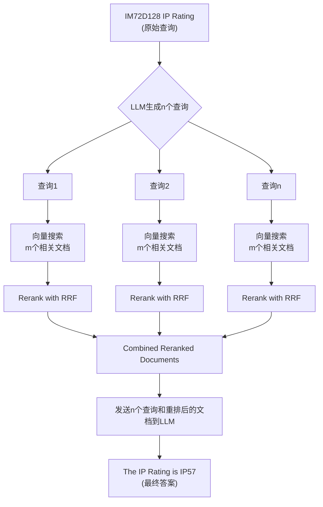

## AI论文解读 | RAG-FUSION: A NEW TAKE ON RETRIEVAL-AUGMENTED GENERATION
        
### 作者        
digoal        
        
### 日期        
2025-08-30       
        
### 标签        
PostgreSQL , PolarDB , DuckDB , AI , 论文解读        
        
----        
        
## 背景  
      
https://arxiv.org/pdf/2402.03367        
  
提示:          
```          
读懂《RAG-FUSION: A NEW TAKE ON RETRIEVAL-AUGMENTED GENERATION》这篇论文需要提前掌握哪些基础知识, 请使用中文通熟易懂的讲解这些基础知识, 可以引用论文中的图、表或使用Markdown支持的图形(text,mermaid等)增加解释性. 
  
使用中文通熟易懂的解读《RAG-FUSION: A NEW TAKE ON RETRIEVAL-AUGMENTED GENERATION》这篇论文, 其中的关键内容请着重讲解, 可以引用论文中的图、表或使用Markdown支持的图形(text,mermaid等)增加解释性. 
  
提取《RAG-FUSION: A NEW TAKE ON RETRIEVAL-AUGMENTED GENERATION》这篇论文中的重要术语, 使用中文对这些术语进行通熟易懂的讲解, 可以引用论文中的图、表或使用Markdown支持的图形(text,mermaid等)增加解释性. 
```     
  
## 1 前置知识 
  
好的，为了更好地理解《RAG-FUSION: A NEW TAKE ON RETRIEVAL-AUGMENTED GENERATION》这篇论文，你需要掌握以下几个核心基础知识。我会用通俗易懂的中文为你解释，并引用论文中的相关内容来帮助你理解。

-----

### 1\. 自然语言处理 (Natural Language Processing, NLP)

首先，你需要对**自然语言处理 (NLP)** 有基本的了解。简单来说，NLP 是人工智能的一个分支，旨在让计算机能够理解、解释和生成人类语言。论文中多次提到了 NLP，例如它指出 RAG-Fusion 的研究是“在人工智能（AI）和自然语言处理（NLP）应用方面取得的重大进展” 。

NLP 涉及很多任务，比如文本分类、情感分析、机器翻译和问答系统等。这篇论文的核心，即 RAG-Fusion 技术，就属于问答系统的一种应用。

### 2\. 大型语言模型 (Large Language Models, LLMs)

接下来是**大型语言模型 (LLMs)**，这是当今 AI 领域最热门的技术之一。LLMs 是在海量文本数据上训练出来的复杂神经网络，能够处理和生成文本 。它们可以用于各种任务，比如写文章、总结内容和进行对话。

然而，LLMs 有一个主要问题：它们有时会“**幻觉 (hallucination)**”，也就是生成听起来很像那么回事但实际上是错误或编造的信息 。这篇论文所介绍的 RAG 技术就是为了解决这个问题而诞生的。

### 3\. 检索增强生成 (Retrieval-Augmented Generation, RAG)

**检索增强生成 (RAG)** 是这篇论文的核心基础。它是一种结合了**文本生成**（来自 LLMs）和**文档检索**（从数据库中查找相关信息）的方法 。

你可以把传统的 RAG 想象成一个“**开放书本**”的考试作答过程：

1.  **用户提问 (Query)**：你提出一个问题，比如“MEMs 麦克风如何工作？”。
2.  **检索相关文档 (Retrieve)**：RAG 模型会根据你的问题，在预先准备好的文档数据库（比如产品手册、技术指南）中找到最相关的几份“参考书页” 。
3.  **结合信息生成答案 (Generate)**：然后，它会把你的问题和找到的参考资料一起发送给大型语言模型。LLM 就像一个聪明的学生，阅读这些参考资料，然后用它自己的语言组织和生成一个准确、相关且全面的答案 。

论文提到，Infineon 的虚拟助手就是基于这种框架构建的 。这种方法的好处是，它能显著减少 LLM 产生幻觉和错误信息的可能性 。

### 4\. 向量嵌入 (Vector Embeddings)

在 RAG 的“检索”步骤中，你需要理解**向量嵌入 (Vector Embeddings)**。这是一种将文本（如单词、句子或文档）转换为计算机可以理解的**数值表示**的方法 。简单来说，就是把文字变成一串数字。

这些数字的排列方式非常有意思：意思相近的文本，转换成的数字串在空间中的距离也更近。当 RAG 模型收到用户查询时，它会把查询也转换成向量，然后在文档数据库中寻找那些与查询向量距离最近（即最相关）的文档 。

### 5\. 互惠排名融合 (Reciprocal Rank Fusion, RRF)

最后，也是 RAG-Fusion 中“Fusion”的关键，是**互惠排名融合 (RRF)**。这是一种文档 **重排序（reranking）** 算法 。

为什么需要重排序？传统的 RAG 只是简单地根据向量距离找到“最相关”的文档。但如果有多份文档都与问题相关，或者问题的不同方面分散在不同的文档中，传统的排序方法可能不够好。

RRF 的工作原理如下：

  * 它会给**多个来源**的文档分配一个**互惠排名 (reciprocal rank)** 。
  * 排名越靠前的文档，得分越高。得分公式为：
    $$\text{rrfscore} = \frac{1}{\text{rank} + k}$$
    这里的 `rank` 是文档当前的排名，`k` 是一个平滑常数 。
  * 最后，RRF 会将所有来源的文档及其得分进行**融合**，生成一个最终的、经过重排的列表 。

论文中提到，RRF 的表现优于许多其他文档重排序方法 。

-----

### RAG-Fusion 的工作流程

现在，将这些概念串联起来，你就可以理解 **RAG-Fusion** 的工作流程了。这正是论文中的核心创新，也是它与传统 RAG 的主要区别。

你可以参考论文中的图1，以下是该图的简化版流程图：   


正如论文所述 ：

1.  **用户原始查询**：比如 "告诉我关于 MEMs 麦克风的信息。" 
2.  **LLM 生成新查询**：模型会把这个原始查询发送给 LLM，生成一系列新的、更具体的查询，比如 "什么是 MEMs 麦克风以及它们如何工作？" 和 "使用 MEMs 麦克风有哪些优点？" 
3.  **多重检索**：算法会用这些新生成的查询分别进行向量搜索，找到各自相关的文档 。
4.  **互惠排名融合 (RRF)**：不是直接把文档发送给 LLM，而是使用 RRF 算法对所有搜索到的文档进行重排序和融合 。
5.  **生成最终答案**：最后，模型会将**所有新生成的查询、原始查询**和**重排后的文档**一起发送给 LLM，由它来生成一个最终的、更全面和更有深度的答案 。

这就是 RAG-Fusion 的核心思想：通过生成多个查询来从不同角度理解用户的意图，并利用 RRF 算法将检索结果进行优化，最终提供一个比传统 RAG 更准确、更全面的答案 。
  
## 2 解读论文 
  
好的，我们来一起用通俗易懂的方式解读《RAG-FUSION: 一种检索增强生成的新视角》这篇论文。

### 论文核心思想解读

这篇论文主要介绍并评估了一种名为 **RAG-Fusion** 的新技术。您可以把它理解为传统**检索增强生成 (RAG)** 技术的“升级版”。

传统的RAG技术，就像一个“先搜索再回答”的机器人。当您提问时，它会：

1.  **检索(Retrieval):** 在一个庞大的资料库（比如公司的产品手册）中搜索与您问题最相关的信息。
2.  **增强(Augmented):** 把找到的这些信息和您的原始问题一起交给一个大型语言模型（LLM，比如GPT-4）。
3.  **生成(Generation):** LLM 参考这些信息，生成一个精准的答案。

这个方法很有效，可以大大减少大模型“胡说八道”（即产生幻觉）的概率 。

但是，**RAG-Fusion** 认为，只根据原始问题进行一次搜索可能不够全面。用户的提问方式有时比较模糊，或者一个问题背后可能隐藏着多个子问题。为了解决这个问题，RAG-Fusion 做了以下创新：

1.  **问题“分身术” (Query Generation):** 不直接搜索原始问题，而是先让LLM根据原始问题，生成多个角度不同、但相关的衍生问题。比如，您问“给我介绍一下MEMs麦克风”，它可能会生成：“MEMs麦克风是什么工作原理？”、“使用MEMs麦克风有什么优点？”、“有哪些推荐的MEMs麦克风型号？”等一系列问题 。

2.  **并行搜索 (Parallel Search):** 对每一个衍生问题都独立进行一次文档检索，这样就能从不同侧面搜集到更丰富的信息。

3.  **智能排序与融合 (Re-ranking and Fusion):** 这是最关键的一步。它使用一种叫做“**倒数排序融合 (Reciprocal Rank Fusion, RRF)**”的算法，对所有搜索结果进行重新计分和排序 。简单来说，一个文档如果在多个衍生问题的搜索结果中都排名靠前，那么它的最终得分就会很高，从而被优先选中。

4.  **最终生成答案:** 将经过智能排序融合后的文档，连同原始问题和所有衍生问题，一起交给LLM，生成一个更全面、更详尽的答案 。

### RAG-Fusion 流程图解

论文中的图1非常清晰地展示了这个过程。我们可以用Mermaid图简化地复现这个流程，让它更直观：   


### RAG-Fusion 的优势在哪里？

根据论文的评估，RAG-Fusion主要有以下几个显著优点：

  * **答案更全面、更准确:** 由于它从多个角度探索了原始问题，因此能够整合更多维度的信息，给出的答案不仅准确，而且上下文更丰富、更具深度 。例如，在回答“IM72D128的IP等级”这个问题时，它不仅给出了“IP57”这个答案，还详细解释了“5”和“7”分别代表的防尘和防水能力，以及这对其设计和耐用性的意义 。
  * **对不同用户群体更友好:** 论文测试了该技术在三种场景下的应用：
      * **工程师:** 能获得详细的技术解答 。
      * **销售经理:** 能获得产品的优势、价值主张和销售策略，帮助他们更好地向客户推销产品 。
      * **普通客户:** 能得到通俗易懂的产品介绍和应用建议，帮助他们判断产品是否符合需求 。
  * **能利用LLM的先验知识:** 当内部文档不充分时（例如，缺少特定场景的故障排除指南），RAG-Fusion可以结合LLM自身的通用知识，提供一些基础性的指导，尽管这些指导可能不够具体 。

### RAG-Fusion 面临的挑战与不足

当然，这项技术也并非完美，论文指出了它的几个主要挑战：

1.  **响应速度变慢:** 这是它最大的缺点。因为需要额外调用一次LLM来生成问题，并且要处理更多的文档，整个流程耗时更长 。论文中的测试数据显示，RAG-Fusion的平均响应时间（34.62秒）几乎是传统RAG（19.52秒）的 **1.77倍** 。

    | 运行次数 | RAG-Fusion 时间 (秒)  | RAG 时间 (秒)  |
    | :--- | :--- | :--- |
    | **平均** | **34.62**  | **19.52**  |

2.  **可能偏离主题:** 如果第一步生成的衍生问题与用户的原始意图不符，那么最终的答案虽然内容丰富，却可能“答非所问” 。这就要求用户在提问时需要更精准，即进行所谓的“提示词工程” (Prompt Engineering) 。

3.  **无法给出明确的否定答案:** 当数据库中完全没有相关信息时，它倾向于回答“根据现有资料无法确定”，而不是像专家那样直接给出“没有这个功能”的否定答案 。

4.  **评估困难:** 对于一些开放性问题（如销售策略），没有唯一的标准答案，因此很难用传统的自动化指标（如ROUGE, BLEU）来客观评价其回答质量，更多需要依赖人工评估 。

### 结论与未来展望

总的来说，这篇论文认为 **RAG-Fusion** 是一种非常有前途的技术，它通过模拟人类从不同角度思考问题的方式，显著提升了问答系统的准确性和全面性，尤其适用于需要深度信息的企业级应用场景 。

未来的研究方向包括：

  * **优化性能:** 减少响应延迟，例如通过本地部署LLM来降低网络调用开销 。
  * **多语言支持:** 将其扩展到中文、日文等更多语言，以服务全球用户 。
  * **改进评估方法:** 探索更适合RAG系统的自动化评估框架 。
  * **集成提示词工程:** 将提示词优化的工作从用户端转移到系统内部，让用户提问更轻松 。
  
## 3 术语 
  
这篇名为《RAG-FUSION: A NEW TAKE ON RETRIEVAL-AUGMENTED GENERATION》的论文主要探讨了如何改进传统的聊天机器人，使其能更准确、更全面地回答问题 。为了理解这篇论文，你需要了解几个关键术语：

-----

### **1. 检索增强生成 (Retrieval-Augmented Generation, RAG)**

RAG 是一种将大型语言模型 (LLM) 的文本生成能力与文档检索功能相结合的方法 。你可以把它想象成一个拥有“参考资料库”的智能问答系统。当用户提问时，传统的 RAG 聊天机器人会执行以下步骤：

1.  **收集文档**：从数据库中收集产品文档，如数据表或产品选择指南 。
2.  **创建向量嵌入**：将文本转换成算法可以理解的数值表示，并存储在向量数据库中 。
3.  **检索文档**：通过向量搜索找到与用户原始查询最相关的几份文档 。
4.  **生成回答**：将查询和检索到的文档发送给 LLM，生成最终回答 。

这种方法能有效减少 LLM 产生错误信息（即“幻觉”）的问题 。

-----

### **2. 互惠排名融合 (Reciprocal Rank Fusion, RRF)**

RRF 是一种用于文档重排序的算法，它能将来自多个来源的文档进行融合，并根据其排名分配一个互惠分数 。这个分数通过以下公式计算：

$$\text{rrfscore} = \frac{1}{\text{rank} + k}$$

其中，`rank` 是文档的当前排名，`k` 是一个平滑常数，用于调整现有排名的权重 。论文指出，RRF 在文档重排序方面的表现优于许多其他方法 。

-----

### **3. RAG-Fusion**

RAG-Fusion 是论文作者开发的一种新型聊天机器人模型，它结合了传统的 **RAG** 和 **RRF** 技术 。与传统 RAG 的主要区别在于，RAG-Fusion 会在接收到用户查询后，先让 LLM 生成多个新的、更具体的查询 。

论文中的图 1 详细展示了这个过程：   



如上图所示，当用户询问“IM72D128 的 IP 等级”时，RAG-Fusion 不仅会使用原始查询，还会生成多个新查询，例如“IP 等级是什么以及它是如何影响 IM72D128 的？” 。然后，它会对所有新查询检索到的文档进行 RRF 重排和融合 。最终，将所有查询和重排后的文档一起发送给 LLM，以生成一个更全面、更具上下文的回答 。

-----

### **4. 向量嵌入 (Vector Embeddings)**

向量嵌入是 RAG 和 RAG-Fusion 模型中的一个基础概念 。它指的是将文本转换为算法可以理解的**数值表示** 。你可以将这些数值想象成文本在多维空间中的坐标。意义相近的词语或句子，它们对应的向量在空间中的距离也会更近 。这样，系统就可以通过计算向量距离，快速找到与用户查询最相关的文档。

-----

### **5. 大型语言模型 (Large Language Models, LLMs)**

LLM 是指那些在大量数据上训练过的、用于处理和生成文本的先进自然语言处理系统 。它们是 RAG 和 RAG-Fusion 聊天机器人的核心“大脑”，负责理解查询、生成新的查询和组织最终的答案 。

需要注意的是，虽然 LLM 非常强大，但它们并非万能。论文指出，如果文档数据库中没有相关信息，LLM 可能会用其预先训练的知识来补充，但这可能导致答案过于笼统或不准确 。这也是为什么 RAG 和 RAG-Fusion 需要高质量文档数据库来提供准确信息的原因 。
  
## 参考        
         
https://arxiv.org/pdf/2402.03367    
        
<b> 以上内容基于DeepSeek、Qwen、Gemini及诸多AI生成, 轻微人工调整, 感谢杭州深度求索人工智能、阿里云、Google等公司. </b>        
        
<b> AI 生成的内容请自行辨别正确性, 当然也多了些许踩坑的乐趣, 毕竟冒险是每个男人的天性.  </b>        
    
#### [期望 PostgreSQL|开源PolarDB 增加什么功能?](https://github.com/digoal/blog/issues/76 "269ac3d1c492e938c0191101c7238216")
  
  
#### [PolarDB 开源数据库](https://openpolardb.com/home "57258f76c37864c6e6d23383d05714ea")
  
  
#### [PolarDB 学习图谱](https://www.aliyun.com/database/openpolardb/activity "8642f60e04ed0c814bf9cb9677976bd4")
  
  
#### [PostgreSQL 解决方案集合](../201706/20170601_02.md "40cff096e9ed7122c512b35d8561d9c8")
  
  
#### [德哥 / digoal's Github - 公益是一辈子的事.](https://github.com/digoal/blog/blob/master/README.md "22709685feb7cab07d30f30387f0a9ae")
  
  
#### [About 德哥](https://github.com/digoal/blog/blob/master/me/readme.md "a37735981e7704886ffd590565582dd0")
  
  

  
