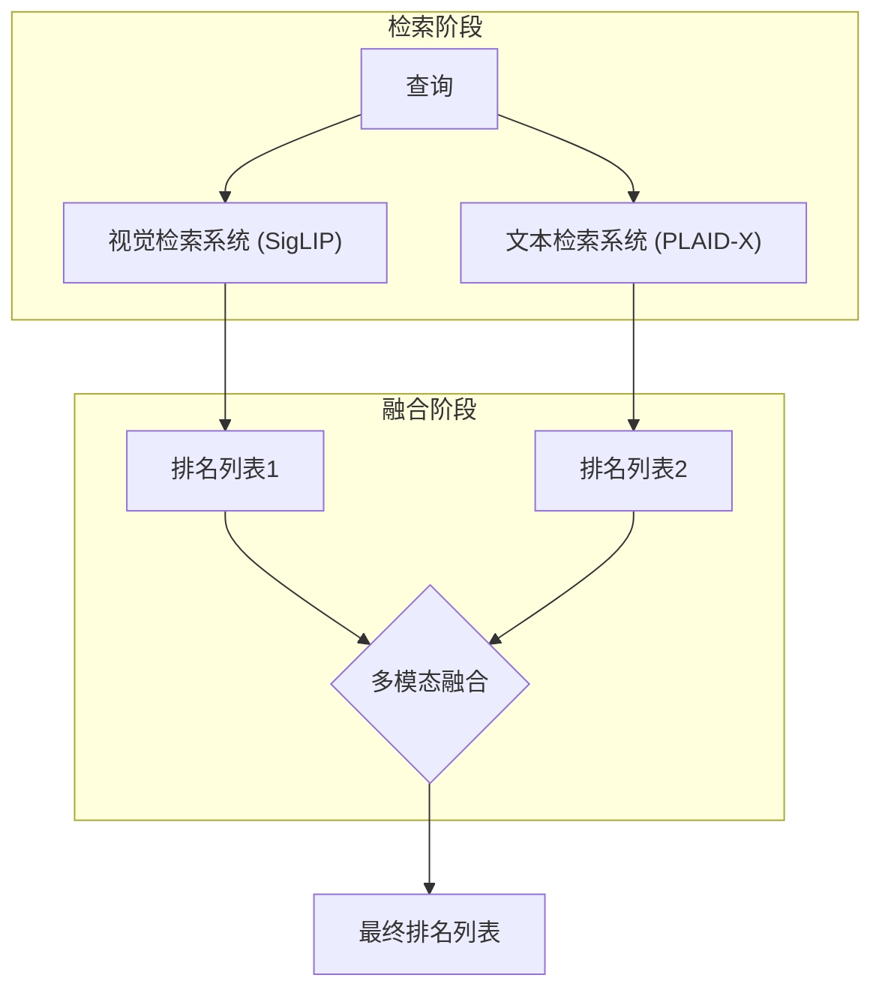
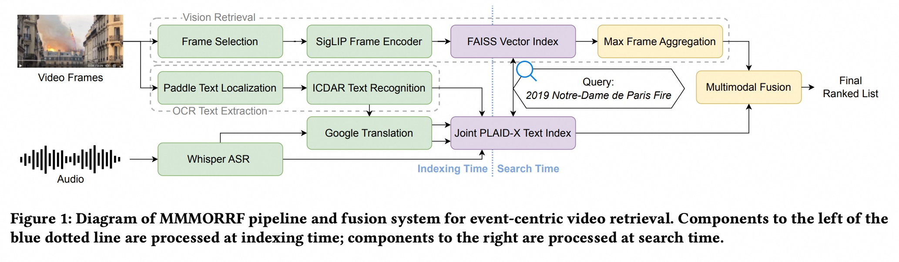
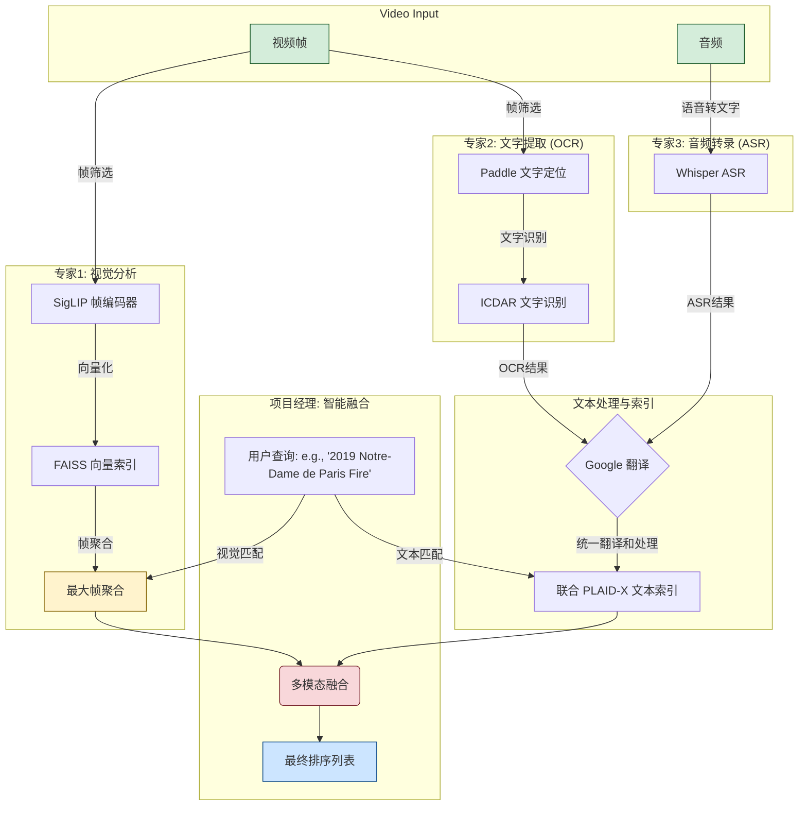
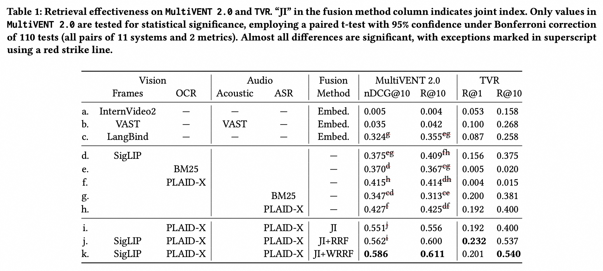
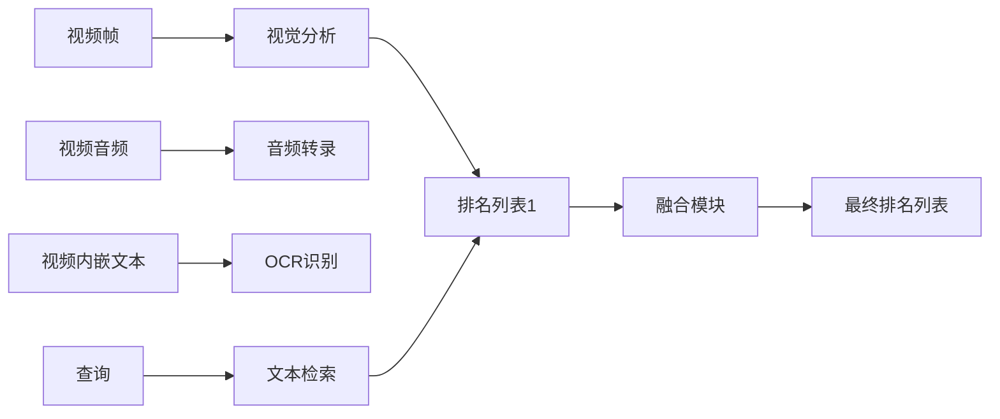

## AI论文解读 | MMMORRF: Multimodal Multilingual MOdularized Reciprocal Rank Fusion
        
### 作者        
digoal        
        
### 日期        
2025-08-30       
        
### 标签        
PostgreSQL , PolarDB , DuckDB , AI , 论文解读        
        
----        
        
## 背景  
      
https://arxiv.org/pdf/2503.20698        
  
提示:          
```          
读懂《MMMORRF: Multimodal Multilingual MOdularized Reciprocal Rank Fusion》这篇论文需要提前掌握哪些基础知识, 请使用中文通熟易懂的讲解这些基础知识, 可以引用论文中的图、表或使用Markdown支持的图形(text,mermaid等)增加解释性. 
  
使用中文通熟易懂的解读《MMMORRF: Multimodal Multilingual MOdularized Reciprocal Rank Fusion》这篇论文, 其中的关键内容请着重讲解, 可以引用论文中的图、表或使用Markdown支持的图形(text,mermaid等)增加解释性. 
  
提取《MMMORRF: Multimodal Multilingual MOdularized Reciprocal Rank Fusion》这篇论文中的重要术语, 使用中文对这些术语进行通熟易懂的讲解, 可以引用论文中的图、表或使用Markdown支持的图形(text,mermaid等)增加解释性. 
```     
  
## 1 前置知识 
  
根据论文《MMMORRF: Multimodal Multilingual Modularized Reciprocal Rank Fusion》的内容，要理解这篇论文，你需要掌握以下几个关键的基础知识。

-----

### 1\. 信息检索 (Information Retrieval, IR)

信息检索是这篇论文的核心主题。简单来说，它是一种从大量非结构化数据（如文本、图片、视频等）中找到用户所需信息的技术。

  * **查询 (Query):** 用户为了寻找信息而输入的请求，比如“2019 Notre-Dame de Paris Fire” 。
  * **文档 (Document):** 包含信息的载体。在这篇论文中，文档是视频 。
  * **排名 (Ranking):** 信息检索系统根据相关性对文档进行排序，将最相关的文档排在前面，生成一个最终的排名列表 。

这篇论文的独特之处在于，它专注于“事件中心”的视频检索，这意味着系统需要理解查询背后所代表的事件，而不仅仅是视频中出现的物体或场景 。

### 2\. 多模态 (Multimodality)

多模态指的是数据包含多种不同的形式或“模态”。视频就是一种典型的多模态数据，它包含：

  * **视觉 (Visual):** 视频画面本身，比如人物、地点、事件等 。
  * **音频 (Audio):** 视频中的声音，包括语音、背景音乐和环境音等 。
  * **文本 (Text):** 视频中嵌入的文字，比如新闻字幕、街道路牌等 。

传统的检索系统可能只关注单一模态，比如只用视频标题进行搜索 。这篇论文则提出，需要综合利用这多种模态的信息来提高检索效果 。

### 3\. 多语言 (Multilingual)

多语言指的是系统需要能够处理和检索多种语言的数据 。这篇论文强调，在处理真实世界的在线视频时，多语言能力至关重要 。

这篇论文中提到的两个相关概念：

  * **多语言信息检索 (Multilingual Information Retrieval, MLIR):** 使用一种语言的查询来检索多种语言的文档 。
  * **跨语言信息检索 (Cross-language Information Retrieval, CLIR):** 一种特殊情况，语料库是单语言的，但查询可以是另一种语言 。

### 4\. 融合 (Fusion) 技术

当有多个检索系统（或“模态”）分别生成自己的排名列表时，如何将它们的结果结合起来，生成一个最终的、更优的排名列表？这就是“融合”技术要解决的问题。

这篇论文使用了两种主要的融合方法：

  * **倒数排名融合 (Reciprocal Rank Fusion, RRF):** 一种基本的融合方法 。它通过计算每个文档在所有排名列表中的倒数排名总和来得到最终分数。倒数排名意味着排名越靠前的文档分数越高。
  * **加权倒数排名融合 (Weighted Reciprocal Rank Fusion, WRRF):** 这是论文提出的**创新点** 。它在 RRF 的基础上增加了“权重”。这个权重是根据视频本身的特点来决定的，比如一个视频看起来像专业的新闻报道，那么它的音频和嵌入文本信息可能更可靠，因此在融合时会给予更高的权重 。

如下图所示，MMMORRF 系统在搜索时会将视觉和文本检索系统生成的排名列表，通过多模态融合（Multimodal Fusion）结合起来，最终生成一个排名列表 。



### 5\. 模块化 (Modularized) 架构

这篇论文提出了一种“管道式”或“模块化”的系统架构 。这意味着整个系统不是一个单一、巨大的模型，而是由多个独立的、功能明确的“模块”串联而成。

以论文的图1为例，你可以看到整个系统被分成了不同的部分 ：   

  * **视觉处理模块:** 包括“帧选择”和“SigLIP 帧编码器” 。
  * **OCR 文本提取模块:** 包括“文本定位”和“文本识别” 。
  * **音频转录模块:** 使用 **Whisper ASR** 将音频转成文字 。
  * **文本检索模块:** 使用 **PLAID-X** 对提取的文本进行检索 。
  * **融合模块:** 将各个模块的检索结果进行融合 。

这种模块化设计的好处是，你可以随时用一个更先进的模块来替换旧的模块，而无需重新训练整个系统。这使得系统更加灵活和高效 。

### 6\. 性能评估指标

为了评估一个检索系统的好坏，需要使用一些客观的指标。这篇论文主要使用了以下几个：

  * **Recall@K (R@K):** 在排名前 K 的结果中，有多少相关文档被找到了 。R@10 表示在排名前10的文档中，相关文档的召回率 。
  * **nDCG@K (normalized Discounted Cumulative Gain):** 这个指标不仅看相关文档有没有被找到，还看它们的排名是否靠前 。排名越靠前，分数越高。nDCG@10 是一个更能反映排名质量的指标 。
  * **查询延迟 (Query Latency):** 从输入查询到获得结果所需的时间 。这关系到用户体验。论文提到，其系统的延迟约为 300 毫秒，对于实际应用来说非常实用 。
  
## 2 解读论文 
  
好的，我们来一起用通俗易懂的方式解读《MMMORRF: 多模态多语言模块化倒数排序融合》这篇论文。

### **一、核心思想：视频搜索的“多管齐下”策略**

想象一下，当你在YouTube或抖音上搜索一个视频时，比如“2019年巴黎圣母院大火”，你是希望系统仅仅“看懂”视频画面，还是希望它能同时“听懂”新闻播报的语音，“读懂”视频里出现的文字（比如标题、路牌）？

传统的视频搜索系统，很多时候更偏向于分析视频的画面（视觉信息），而忽略了声音和文字等多重信息。这篇论文的核心思想就是：**要做好视频搜索，必须“多管齐下”，同时利用视频的“画面、声音、文字”这三种信息（即“多模态”），并用一种更聪明的方式将这些信息融合起来，从而实现更精准、更高效的搜索。**

论文提出的这个新系统，就叫做 **MMMORRF**。

### **二、MMMORRF系统是如何工作的？**

我们可以把MMMORRF系统想象成一个团队，团队里有三个各有所长的专家，最后由一位聪明的项目经理来汇总报告。我们可以借助论文中的图1来理解这个流程：   



这个流程图清晰地展示了MMMORRF系统的三大模块和最终的融合步骤：

1.  **视觉检索模块（专家1）** ：

      * **工作内容**：这个模块负责“看懂”视频画面。它会从视频中抽取一些代表性的帧（比如每秒抽一帧），然后使用一个叫做 **SigLIP** 的先进模型将这些图片转化成计算机能理解的“向量”（可以想象成图片的数学指纹）。
      * **技术亮点**：利用FAISS技术，可以极快地在海量的图片指纹库中找到和用户查询最匹配的那些 。

2.  **文字提取与音频转录模块（专家2和3）**：

      * **OCR（光学字符识别）** ：负责识别视频画面中出现的文字，比如新闻标题、街边的路牌等。它首先用 **PaddleOCR** 找到文字的位置，然后再进行识别 。
      * **ASR（自动语音识别）** ：负责“听懂”视频中的声音。这里用的是 OpenAI 大名鼎鼎的 **Whisper** 模型，它可以把视频里的语音（支持多种语言）转换成文字 。

3.  **文本检索模块**：

      * **工作内容**：将从OCR和ASR获取的所有文字（包括用谷歌翻译统一处理后的文本） 汇集起来，使用一个叫做 **PLAID-X** 的系统建立文本索引 。这个系统非常擅长进行跨语言的文本匹配。

4.  **多模态融合（项目经理的决策）** ：

      * **这是论文最关键的创新点！** 单纯把视觉和文本的搜索结果简单相加效果并不好。MMMORRF采用了一种名为 **“加权倒数排序融合”（WRRF）** 的智能方法 。
      * **核心思想**：系统会先对每个视频进行“预判”，判断它更像是一个“新闻报道”还是一个“风景视频”。
          * 如果视频看起来像新闻报道，那么系统会认为它的语音和字幕文字更重要，所以在最终排序时会给予**文本搜索结果更高的权重** 。
          * 反之，如果视频更侧重画面，则会给予**视觉搜索结果更高的权重**。
      * 这种根据视频自身特点进行动态加权的方法，极大地提升了融合效果 。

### **三、实验结果：MMMORRF到底有多强？**

口说无凭，论文用详实的数据证明了MMMORRF的强大。我们可以关注下表1中的关键数据：   

| 模型/方法 | 数据集 | nDCG@10 (越高越好) |
| :--- | :--- | :--- |
| VAST | MultiVENT 2.0 | 0.035 |
| LanguageBind | MultiVENT 2.0 | 0.324 |
| **MMMORRF (完整版)** | **MultiVENT 2.0** | **0.586** |
| 单纯用视觉 (SigLIP) | MultiVENT 2.0 | 0.375 |
| 单纯用文本 (OCR+ASR) | MultiVENT 2.0 | 0.551 |

*表格根据论文Table 1简化，展示核心对比。*

从表格中我们可以得出几个关键结论：

  * **吊打业界先进模型**：相较于VAST和LanguageBind等先进的视觉语言模型，MMMORRF的性能取得了碾压性的优势。在更接近真实世界应用场景的MultiVENT 2.0数据集上，它的效果比最好的视觉语言模型提升了81% 。
  * **“多管齐下”效果显著**：只用文本（0.551）或只用视觉（0.375）的效果，都远不如将它们智能融合后的最终结果（0.586）。这证明了多模态融合的必要性。
  * **智能融合是关键**：使用简单的结果相加（RRF，得分0.562）和使用论文提出的智能加权融合（WRRF，得分0.586）相比，后者有显著的性能提升 。这说明了“聪明的融合”至关重要。

### **四、实用性：不仅效果好，而且速度快**

一个模型效果再好，如果搜一次要等半天，那也是无法实际应用的。MMMORRF在效率上也表现出色：

  * **预处理**：处理一个视频的平均时间约为37秒（主要是文字和语音识别比较耗时，但这些可以并行处理）。
  * **搜索响应**：**每次查询的延迟大约为300毫秒** 。这个速度对于用户来说几乎是感觉不到延迟的，完全满足了真实世界搜索应用的需求 。

### **总结**

总的来说，这篇论文为我们展示了一个**既强大又实用**的现代视频搜索系统框架。它最大的贡献在于：

1.  **证明了模块化组合的力量**：它没有去训练一个庞大而复杂的“全能模型”，而是巧妙地将各个领域最成熟的工具（如Whisper, SigLIP, PaddleOCR）组合起来，取得了“1+1+1 \> 3”的效果。
2.  **提出了智能的融合策略**：其核心的“加权倒数排序融合”（WRRF）方法，能够根据视频的自身特点动态调整不同信息来源的权重，是实现卓越性能的关键。
3.  **贴近真实应用**：它在一个更接近真实用户搜索行为的大规模、多语言数据集（MultiVENT 2.0）上验证了方法的有效性，并确保了系统的高效率，为构建下一代视频搜索引擎铺平了道路 。
  
## 3 术语 
  
根据你提供的《MMMORRF: Multimodal Multilingual Modularized Reciprocal Rank Fusion》论文，下面是一些关键术语及其通俗易懂的中文解释。

-----

### 1\. MMMORRF

**全称**: Multimodal Multilingual Modularized Reciprocal Rank Fusion（多模态、多语言、模块化倒数排名融合）。
**解释**: 这是论文中提出的一个视频搜索系统的名称。你可以把它想象成一个“超级视频搜索引擎”。它之所以叫这个名字，是因为它结合了以下几个核心理念：

  * **多模态 (Multimodal)**: 它能理解视频里的多种信息，包括图像、声音和文本字幕 。
  * **多语言 (Multilingual)**: 它能处理多种语言的视频和搜索请求 。
  * **模块化 (Modularized)**: 它的设计像积木一样，每个功能（比如视频转文字、图片分析）都是一个独立的“模块”，可以轻松替换和升级 。
  * **倒数排名融合 (Reciprocal Rank Fusion)**: 它有一个特别的“融合”技术，能把不同模块的搜索结果智能地结合起来，得到最终最好的排名列表 。

### 2\. 管道式（Pipeline）

**解释**: 这是一个描述系统架构的术语，指整个系统像一条生产线。在 MMMORRF 中，当一个视频进入系统时，它会按顺序经过一系列处理步骤，就像下图所示：



正如论文图1所展示的，MMMORRF 的处理流程被分为不同的“模块” 。这种设计让系统在处理每种模态（视觉、音频、文本）时都能使用最成熟、最专业的工具，从而获得更好的效果 。   

### 3\. 加权倒数排名融合（WRRF）

**全称**: Weighted Reciprocal Rank Fusion。
**解释**: 这是论文中提出的一个核心创新点 。它是一种将多个搜索结果列表合并成一个最终列表的技术。想象一下，你有两个朋友给你推荐餐馆，一个擅长中餐，一个擅长西餐。WRRF 就像一个聪明的决策者，它会根据你这次想吃什么（查询）和每个餐馆（视频）本身的特点来决定听谁的。

具体来说，WRRF 会给每个排名列表赋予一个**权重**。比如，如果一个视频看起来像新闻广播，那么它的音频和内嵌文本通常更可靠，所以系统会给这些模态的排名结果更高的权重 。这个权重是根据视频的特性独立于查询来计算的 。这种自适应的权重策略让系统能更好地利用每种模态的优势 。

### 4\. 事件中心视频检索（Event-centric Video Retrieval）

**解释**: 这是论文中探讨的一种视频搜索任务 。与传统的“描述性查询”（例如“一只小狗在草地上玩耍”）不同，事件中心查询更注重寻找特定的、有时间地点背景的“事件”，比如“2019 Notre-Dame de Paris Fire”（2019年巴黎圣母院大火） 。

这种查询更符合用户在真实世界中的信息需求，因此对搜索引擎提出了更高的要求，它不能只依赖于视频的视觉画面，还需要理解视频中的语音、字幕等文本信息 。

### 5\. 单模态 vs. 多模态

  * **单模态检索（Single-modality Retrieval）**: 只使用一种信息（如文本或视觉）进行搜索。论文中的 **SigLIP**（只用视觉）和 **PLAID-X**（只用文本）就属于单模态检索 。
  * **多模态检索（Multimodal Retrieval）**: 结合多种信息进行搜索 。论文证明，MMMORRF 这种多模态系统比单一模态的检索效果要好得多 。在 MultiVENT 2.0 数据集上，MMMORRF 的 nDCG@10 指标比表现最好的单模态系统高出 37% 。

### 6\. 视觉-语言模型（VLM）

**全称**: Vision-Language Model。
**解释**: 这是一类可以直接处理图像和文本信息，并将它们映射到同一空间的深度学习模型 。论文中提到了 InternVideo2、VAST 和 LanguageBind 。

这篇论文认为，这些模型在像 MultiVENT 2.0 这样的现实任务上表现不佳，因为它们过于依赖视觉信息，并且在训练时使用了不贴近真实搜索场景的小型数据集 。论文的实验结果也证实了这一点：MMMORRF 在 MultiVENT 2.0 上的 nDCG@10 远超这些 VLM 模型，高出 81% 。
  
## 参考        
         
https://arxiv.org/pdf/2503.20698    
        
<b> 以上内容基于DeepSeek、Qwen、Gemini及诸多AI生成, 轻微人工调整, 感谢杭州深度求索人工智能、阿里云、Google等公司. </b>        
        
<b> AI 生成的内容请自行辨别正确性, 当然也多了些许踩坑的乐趣, 毕竟冒险是每个男人的天性.  </b>        
    
#### [期望 PostgreSQL|开源PolarDB 增加什么功能?](https://github.com/digoal/blog/issues/76 "269ac3d1c492e938c0191101c7238216")
  
  
#### [PolarDB 开源数据库](https://openpolardb.com/home "57258f76c37864c6e6d23383d05714ea")
  
  
#### [PolarDB 学习图谱](https://www.aliyun.com/database/openpolardb/activity "8642f60e04ed0c814bf9cb9677976bd4")
  
  
#### [PostgreSQL 解决方案集合](../201706/20170601_02.md "40cff096e9ed7122c512b35d8561d9c8")
  
  
#### [德哥 / digoal's Github - 公益是一辈子的事.](https://github.com/digoal/blog/blob/master/README.md "22709685feb7cab07d30f30387f0a9ae")
  
  
#### [About 德哥](https://github.com/digoal/blog/blob/master/me/readme.md "a37735981e7704886ffd590565582dd0")
  
  

  
