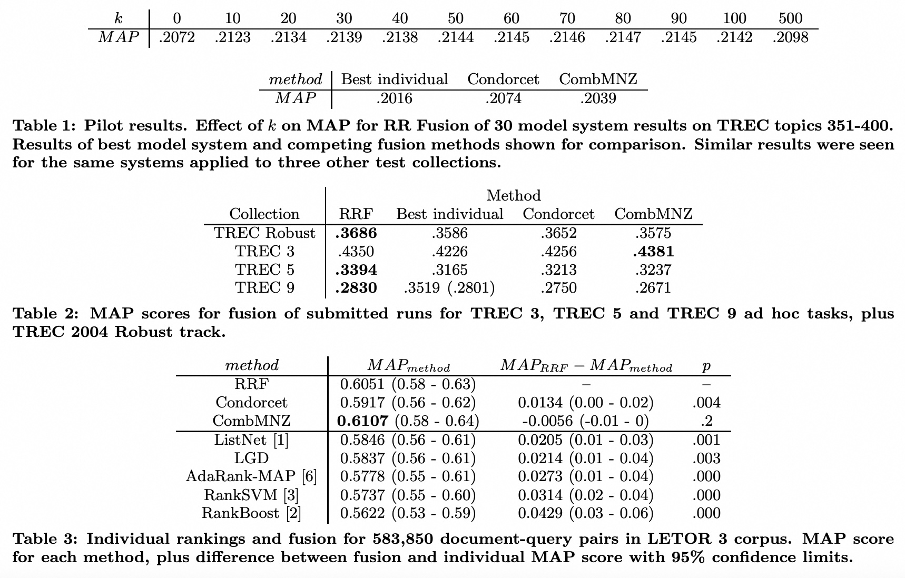

## AI论文解读 | Reciprocal Rank Fusion outperforms Condorcet and individual Rank Learning Methods
        
### 作者        
digoal        
        
### 日期        
2025-08-30       
        
### 标签        
PostgreSQL , PolarDB , DuckDB , AI , 论文解读        
        
----        
        
## 背景  
      
https://cormack.uwaterloo.ca/cormacksigir09-rrf.pdf        
  
提示:          
```          
读懂《Reciprocal Rank Fusion outperforms Condorcet and individual Rank Learning Methods》这篇论文需要提前掌握哪些基础知识, 请使用中文通熟易懂的讲解这些基础知识, 可以引用论文中的图、表或使用Markdown支持的图形(text,mermaid等)增加解释性. 
  
使用中文通熟易懂的解读《Reciprocal Rank Fusion outperforms Condorcet and individual Rank Learning Methods》这篇论文, 其中的关键内容请着重讲解, 可以引用论文中的图、表或使用Markdown支持的图形(text,mermaid等)增加解释性. 
  
提取《Reciprocal Rank Fusion outperforms Condorcet and individual Rank Learning Methods》这篇论文中的重要术语, 使用中文对这些术语进行通熟易懂的讲解, 可以引用论文中的图、表或使用Markdown支持的图形(text,mermaid等)增加解释性. 
```     
  
## 1 前置知识 
  
好的，为了帮助你读懂《Reciprocal Rank Fusion outperforms Condorcet and individual Rank Learning Methods》这篇论文，我会用通俗易懂的中文，为你梳理一些需要提前了解的基础知识。这篇论文主要讨论的是 **信息检索（Information Retrieval, IR）** 中的一个核心问题：如何把多个搜索结果列表融合起来，得到一个更好的结果。

这篇论文的作者是G. V. Cormack, C. L. A. Clarke和Stefan Büttcher，发表于2009年的SIGIR会议。

### 1. 信息检索与排名融合

首先，你需要理解什么是**信息检索**。简单来说，信息检索就是你使用搜索引擎时所发生的过程。你输入一个查询（query），搜索引擎返回一个按相关性排序的文档列表。

而**排名融合（Rank Fusion）**，也叫**元排名（Metaranking）**，是信息检索领域的一个重要技术。想象一下，你有多个不同的搜索引擎，比如Google、Bing和百度，它们都对同一个查询返回了各自的搜索结果列表。每个列表中的文档顺序都不一样。排名融合的目的就是把这几个列表结合起来，生成一个综合的、比任何一个单独列表都更好的新列表。

这篇论文的核心就是介绍一种名为 **“倒数排名融合”（Reciprocal Rank Fusion, RRF）** 的简单方法，并证明它比其他一些传统方法（如Condorcet Fuse和CombMNZ）更有效。

### 2. 排名融合的几种方法

论文中提到了几种排名融合方法，你需要了解它们的基本原理，才能理解为什么RRF是更好的。

#### a. 倒数排名融合 (RRF)

**RRF** 是这篇论文的重点。它的思想非常简单：给每个文档一个分数，然后根据这个分数进行排序。RRF 的得分公式如下：

$$RRFscore(d) = \sum_{r \in R} \frac{1}{k + r(d)}$$

这个公式看起来有点复杂，但拆解开来就很好懂：

* $d$：代表一个文档。
* $R$：代表所有要融合的排名列表的集合（比如来自多个搜索引擎的排名）。
* $r(d)$：代表文档 $d$ 在某个特定排名列表 $r$ 中的位置。比如，一个文档在某个列表中排在第1位， $r(d)$ 就是1；排在第10位， $r(d)$ 就是10。
* $k$：一个常数。论文中通过实验确定 $k=60$ 是一个不错的选择 。这个常数的作用是“平滑”高排名文档的分数，防止某个系统偶然给一个文档很高的排名，就导致它在最终列表里排名过高 。
* $\frac{1}{k + r(d)}$：这就是**倒数排名**。排名越靠前（ $r(d)$ 越小），这个值就越大；排名越靠后， $r(d)$ 越大，这个值就越小。

**RRF的工作原理**就是把一个文档在所有输入排名列表中的**倒数排名分数**加起来，得到它的最终分数。最后，所有文档根据这个RRF分数从高到低排序，就得到了最终的融合排名列表。

#### b. Condorcet Fuse

**Condorcet Fuse** 是一种基于“多数投票”的融合方法 。它的工作方式是，对于每两个文档 $d_1$ 和 $d_2$，它会统计在所有输入排名列表中，哪个文档的排名更靠前。排名靠前的次数多的一方获胜。最终，它通过这种两两比较的多数投票结果来确定文档的最终排名 。

论文中指出，Condorcet Fuse 的一个缺点是，它可能会被少数几个排名列表中的“弱偏好”（weak preferences）所左右，而忽略了其他列表中非常强烈的偏好 。

#### c. CombMNZ

**CombMNZ** 也是一种融合方法，它结合了文档的分数和排名 。简单来说，它的得分公式是：将一个文档在所有系统中给出的得分加起来，然后乘以它出现在多少个排名列表里 。

论文中提到，CombMNZ 的结果波动性比较大，有时候比RRF好，有时候又比Condorcet Fuse差 。这可能是因为它的效果高度依赖于各个系统给出的原始分数，而这些分数之间是“未经校准”的，没有统一的标准 。

### 3. 评估指标：MAP

理解了这些方法，你还需要知道如何衡量一个排名列表的好坏。论文中主要使用一个叫做 **MAP (Mean Average Precision)** 的指标 。

**MAP** 是信息检索中衡量系统性能的一个常用指标。简单来说，它衡量的是一个系统找到相关文档的能力和找到这些文档的顺序。MAP 的值越高，说明系统的性能越好。

论文中的表格（如**表1**、**表2**和**表3**）都使用了MAP值来比较不同方法的性能 。例如，**表2**中可以看到，在TREC Robust、TREC 3、TREC 5和TREC 9这四个数据集上，RRF的MAP值都比Condorcet Fuse高 。   

---

### 4. 论文中提到的其他概念

* **TREC**：全称是**Text REtrieval Conference**。这是一个大型的国际信息检索评测会议，提供了很多标准化的数据集（如TREC Robust、TREC 3等）和评测任务，用于评估不同的信息检索系统 。论文中的大部分实验都是基于TREC数据集进行的 。
* **LETOR 3**：一个用于“**学习排名（learning to rank）**”的数据集 。**学习排名**是一种监督式方法，它需要大量的训练数据来学习如何对文档进行排序 。论文中也用RRF对LETOR 3数据集进行了实验，发现RRF的表现比一些复杂的监督学习方法还要好 。
* **P值（p-value）**：这是一个统计学概念，用来判断一个实验结果是否具有统计学意义。**P值**越小，说明结果越不可能只是偶然发生的 。论文中提到，RRF的性能提升在统计学上是显著的（p值很小）。

希望这些基础知识能帮助你更好地理解这篇论文。简而言之，这篇论文的核心结论是：**RRF** 是一种简单、有效且不需要训练的排名融合方法，它在绝大多数情况下都比单个最好的系统以及其他一些复杂的融合方法表现得更好 。
  
## 2 解读论文 
  
好的，這就為您通俗易懂地解讀《Reciprocal Rank Fusion outperforms Condorcet and individual Rank Learning Methods》這篇經典論文。

### 論文核心思想概覽

這篇論文提出了一種名為 **倒數排序融合 (Reciprocal Rank Fusion, RRF)** 的新方法 。它的核心作用是將多個不同搜尋或排序系統給出的結果列表「融合」成一個更優的列表 。

想像一下，您想搜尋一個問題，用了三個不同的搜尋引擎（比如 Google、Bing、DuckDuckGo）。每個引擎都會給您一個它認為最相關的網頁排名列表。我們很自然地會想：「能不能把這三個列表的智慧結合起來，得到一個比任何單一引擎都更好的結果列表呢？」RRF 就是解決這個問題的一種簡單而高效的方法。

論文的主要結論是：
* **RRF 效果拔群**：它不僅 consistently (持續地) 勝過任何單一的參與排名的系統，也優於當時流行的其他融合方法，如 Condorcet Fuse 。
* **RRF 非常簡單**：它不需要複雜的訓練過程，是一種無監督 (unsupervised) 方法，拿來就能用 。

---

### 關鍵內容深度解析

#### 1. 什麼是倒數排序融合 (RRF)？

RRF 的核心是一個非常直觀的計分公式。對於任何一個需要被排序的文件（比如一個網頁），它的最終分數由所有參與排名的系統共同決定。

**RRF 計分公式** ：
$$RRFscore(d) = \sum_{r \in R} \frac{1}{k + rank_r(d)}$$

* $d$：代表某一個文件（例如，某個網頁）。
* $R$：代表所有參與排名的系統集合（例如，三個不同的搜尋引擎）。
* $rank_r(d)$：代表文件 $d$ 在系統 $r$ 的排名列表中的位置。例如，排第 1，這個值就是 1。
* $k$：是一個常數，論文中作者透過實驗發現設定為 **60** 效果不錯 。

**通俗解釋**：
這個公式的思想是，每個系統都來為文件「投票」。一個文件在某個系統中的**排名越高**（`rank`值越小），它從該系統獲得的**分數就越高**（因為分母越小）。

**為什麼要加一個常數 `k`？**
作者解釋說，這個 `k` 值的作用是**減輕「異常值」系統的影響** 。比如，某個不太靠譜的搜尋引擎偶爾將一個無關的網頁排到了第 1 位。如果沒有 `k`，這個第 1 名會給它帶來巨大的分數優勢。加入了 `k=60` 後，即使排第 1，它獲得的分數是 `1/61`，雖然依舊很高，但不至於過分主導總分，從而讓結果更加穩定。

#### 2. RRF 與其他方法的比較

論文將 RRF 與當時已有的幾種主流方法進行了比較：

* **單一最佳系統 (Best individual)**：就是直接從所有參與排名的系統中，找出那個本身表現最好的系統。
* **Condorcet Fuse**：一種基於「投票」的融合方法。對於任意兩個文件 A 和 B，它會看在所有排名列表中，有多少個列表認為 A 比 B 好，又有多少認為 B 比 A 好，然後遵循「少數服從多數」的原則來決定最終 A 和 B 的相對順序 。
* **CombMNZ**：一種同時考慮排名和原始分數的加權融合方法 。

論文的實驗結果清晰地表明了 RRF 的優越性。

#### 3. 實驗與結果

作者進行了多組實驗來驗證 RRF 的效果，其中最核心的是在 TREC（一個國際權威的資訊檢索評測會議）和 LETOR（一個用於學習排序研究的數據集）上的實驗。

##### **TREC 數據集實驗**

作者使用了多個 TREC 任務的數據集，將參與者提交的各種搜尋系統的結果進行融合。下表是論文中 Table 2 的簡化版，展示了在不同數據集上，各種方法的 MAP (Mean Average Precision，一種衡量搜尋排序質量的核心指標，越高越好) 得分。   

| 數據集 (Collection) | **RRF** | 單一最佳 (Best individual) | Condorcet | CombMNZ |
| :--- | :---: | :---: | :---: | :---: |
| TREC Robust | **.3686** | .3586 | .3652 | .3575 |
| TREC 3 | **.4350** | .4226 | .4256 | .4381 |
| TREC 5 | **.3394** | .3165 | .3213 | .3237 |
| TREC 9 | .2830 | **.3519** (.2801) | .2750 | .2671 |

**表格解讀**:
* 可以看到，在絕大多數情況下，RRF 的 MAP 分數都是最高的 。
* 唯一的例外是 TREC 9，這裡的「單一最佳」系統 (.3519) 是一個有人工干預的結果 。如果排除這個人工系統，只看自動化系統，其最佳結果是 .2801，RRF (.2830) 仍然勝出 。
* RRF 全面優於 Condorcet Fuse 。

##### **LETOR 數據集實驗**

作者進一步將 RRF 應用於融合多個「學習排序 (Learning to Rank)」模型的結果。這些模型本身就是透過機器學習訓練出來的排序高手。

以下是論文 Table 3 的核心數據簡化版，展示了 RRF 與多種頂級學習排序算法的比較。   

| 方法 (Method) | MAP 分數 | 與 RRF 的差距 |
| :--- | :---: | :---: |
| **RRF (融合後)** | **0.6051** | - |
| CombMNZ (融合後) | 0.6107 | -0.0056 (差距微小) |
| Condorcet (融合後) | 0.5917 | +0.0134 |
| ListNet (單一模型) | 0.5846 | +0.0205 |
| AdaRank-MAP (單一模型) | 0.5778 | +0.0273 |
| RankSVM (單一模型) | 0.5737 | +0.0314 |

**表格解讀**:
* 將多個先進的學習排序模型用 RRF 融合後，得到的 MAP 分數 (0.6051) 比幾乎所有單一模型都要高出一截 。
* 這個結果非常驚人，意味著 **RRF 可以作為一種「元學習器 (meta-learner)」**，站在巨人（各種學習排序模型）的肩膀上，取得更好的成績 。
* 在這個實驗中，CombMNZ 的表現略好於 RRF，但作者指出其差距在統計上並不顯著，且 CombMNZ 的表現不穩定 。

#### 4. 為什麼 RRF 效果這麼好？

作者推測了幾個原因：

1.  **善於利用多樣性**：Condorcet 的「少數服從多數」原則可能會壓制少數系統的「遠見」。比如，有 5 個系統，其中 3 個平庸的系統都認為 A > B，而 2 個非常優秀的系統認為 B >> A (B 遠好於 A)。Condorcet 會選擇 A > B。而 RRF 則能讓這 2 個優秀系統給 B 的高排名帶來巨大的分數加成，從而可能讓 B 的總分超過 A 。
2.  **簡單且魯棒**：RRF 不關心每個系統內部打分的具體數值是多少，只關心最終的「排名」，這使得它可以輕鬆融合各種異構的系統 。同時，它的計算非常高效，可以逐個系統進行分數累加，無需將所有排名列表都載入內存 。

### 結論與啟示

這篇論文雖然篇幅短小，但影響深遠。它告訴我們：

* **簡單即是美**：一個簡單、無需訓練的公式，在很多場景下效果卻能超越複雜的機器學習模型和融合策略。
* **融合的力量**："三個臭皮匠，頂個諸葛亮"。將多個不同系統的結果進行有效融合，往往能得到 `1+1>2` 的效果。
* **RRF 的實用價值**：由於其簡單和高效，RRF 在工業界和學術界的各種排名任務中得到了廣泛應用，例如搜尋引擎、推薦系統、競賽中的模型融合等。

總而言之，這篇論文為我們提供了一個強大而優雅的工具——**Reciprocal Rank Fusion**，它證明了透過巧妙地結合多個信息來源的排名，我們可以顯著提升整體的排序質量。
  
## 3 术语 
  
这篇论文的核心是介绍一种名为 **倒数排名融合（Reciprocal Rank Fusion, RRF）** 的技术，并将其与其它方法进行比较 。为了更好地理解这篇论文，下面我们来解释一下其中几个重要的术语。

### 排名融合（Rank Fusion）

排名融合是一种将多个信息检索（IR）系统或不同查询结果列表的文档排名合并为一个更优的新排名列表的方法 。这篇论文的核心在于，作者提出了一种简单而有效的方法——RRF，并证明了它在结合多个IR系统结果时，性能优于任何单一系统 。

### 倒数排名融合（Reciprocal Rank Fusion, RRF）

RRF是一种简单、无需训练的排名融合方法 。它的核心思想是，根据一个文档在多个排名列表中的位置，计算其总分。RRF的得分公式如下：

$$RRFscore(d\in D)=\sum_{r\in R}\frac{1}{k+r(d)}$$

* $d$：待排名的文档。
* $r(d)$：文档 $d$ 在特定排名列表 $r$ 中的位置（即排名）。例如，如果一个文档在某个列表中排名第1，那么 $r(d)$ 就是1；如果排名第10，那么 $r(d)$ 就是10。
* $k$：一个固定的常数，用于平滑排名得分 。论文通过实验确定 $k=60$ 是一个较优的选择，并且这个值的选取并非非常关键 。 $k$ 的作用是减轻异常值系统给出极高排名的影响 。
* $\frac{1}{k+r(d)}$：这就是**倒数排名分数**。排名越靠前（ $r(d)$ 越小），这个分数就越大；排名越靠后， $r(d)$ 越大，这个分数就越小，但其重要性并不会像指数函数那样迅速消失 。

RRF通过简单地将一个文档在所有输入排名列表中的倒数排名分数相加，来确定其最终排名 。

### Condorcet Fuse

Condorcet Fuse是另一种融合方法，它通过对文档进行两两比较来确定最终排名 。对于任意两个文档 $d_1$ 和 $d_2$，Condorcet Fuse会通过在所有输入排名中进行多数投票，来决定哪个文档的排名更靠前 。

论文指出，RRF之所以优于Condorcet Fuse，是因为RRF能够更好地利用不同排名列表之间的多样性 。一个或两个系统给出的高排名可以显著提高某个文档的最终排名，而Condorcet Fuse则可能因为简单的多数弱偏好而忽略掉这些重要信息 。

### CombMNZ

CombMNZ是一种需要借助每个系统给出的原始分数进行融合的方法 。它的得分计算是：将文档在每个系统中的原始分数相加，然后乘以该文档出现的排名列表数量 。

论文认为，CombMNZ的结果波动性较大，有时表现稍好于RRF，有时则远逊于Condorcet Fuse 。这可能是因为它的效果受未校准的原始分数影响很大 。

### 性能指标：MAP

MAP，即**平均精度均值（Mean Average Precision）**，是论文中用于衡量排名系统性能的主要指标 。MAP值越高，说明系统的性能越好 。

通过论文中的表格，我们可以直观地看到RRF的优势。例如：   

* 在**表1**中，展示了不同 $k$ 值对RRF性能（MAP）的影响，并将其与最佳单一系统、Condorcet Fuse和CombMNZ进行了比较 。可以看出，当 $k=60$ 时，RRF的MAP值最高 。
* 在**表2**中，对TREC 3、TREC 5、TREC 9 和 TREC 2004 Robust track 这四个数据集进行了实验 。结果显示，RRF的MAP值在所有情况下都超过了Condorcet Fuse，并且在除一个例外（TREC 9，因为使用了人工干预）的情况下，都超过了CombMNZ 。这表明RRF在大多数情况下优于这两种竞争方法 。
  
## 参考        
         
https://cormack.uwaterloo.ca/cormacksigir09-rrf.pdf    
        
<b> 以上内容基于DeepSeek、Qwen、Gemini及诸多AI生成, 轻微人工调整, 感谢杭州深度求索人工智能、阿里云、Google等公司. </b>        
        
<b> AI 生成的内容请自行辨别正确性, 当然也多了些许踩坑的乐趣, 毕竟冒险是每个男人的天性.  </b>        
    
#### [期望 PostgreSQL|开源PolarDB 增加什么功能?](https://github.com/digoal/blog/issues/76 "269ac3d1c492e938c0191101c7238216")
  
  
#### [PolarDB 开源数据库](https://openpolardb.com/home "57258f76c37864c6e6d23383d05714ea")
  
  
#### [PolarDB 学习图谱](https://www.aliyun.com/database/openpolardb/activity "8642f60e04ed0c814bf9cb9677976bd4")
  
  
#### [PostgreSQL 解决方案集合](../201706/20170601_02.md "40cff096e9ed7122c512b35d8561d9c8")
  
  
#### [德哥 / digoal's Github - 公益是一辈子的事.](https://github.com/digoal/blog/blob/master/README.md "22709685feb7cab07d30f30387f0a9ae")
  
  
#### [About 德哥](https://github.com/digoal/blog/blob/master/me/readme.md "a37735981e7704886ffd590565582dd0")
  
  

  
