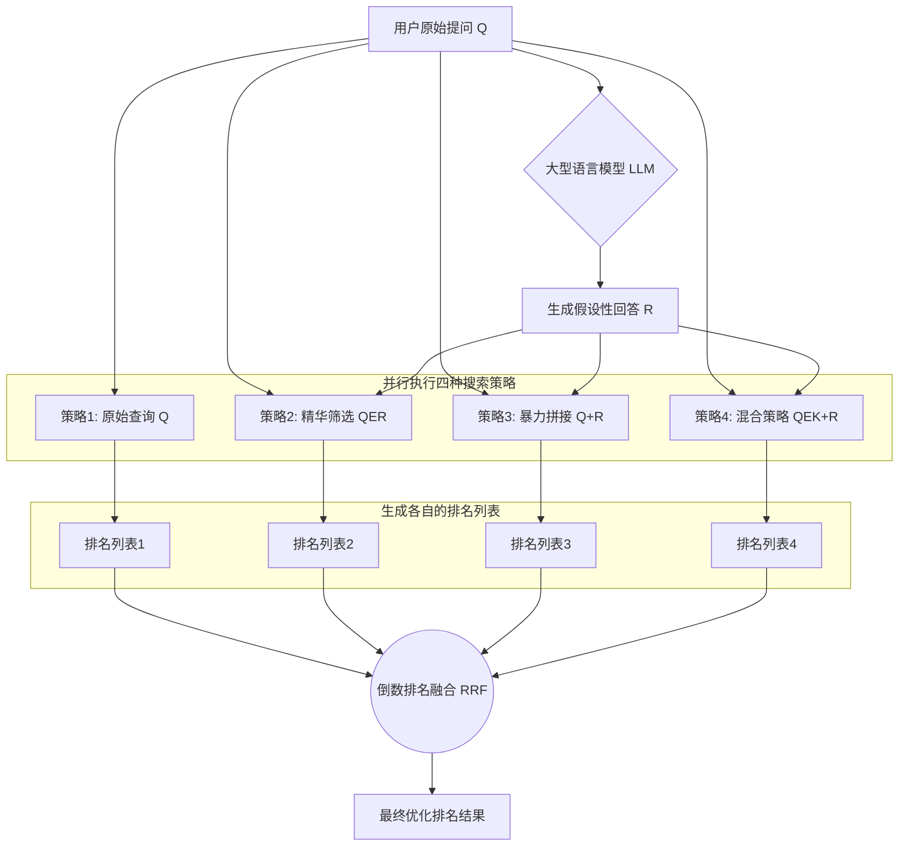
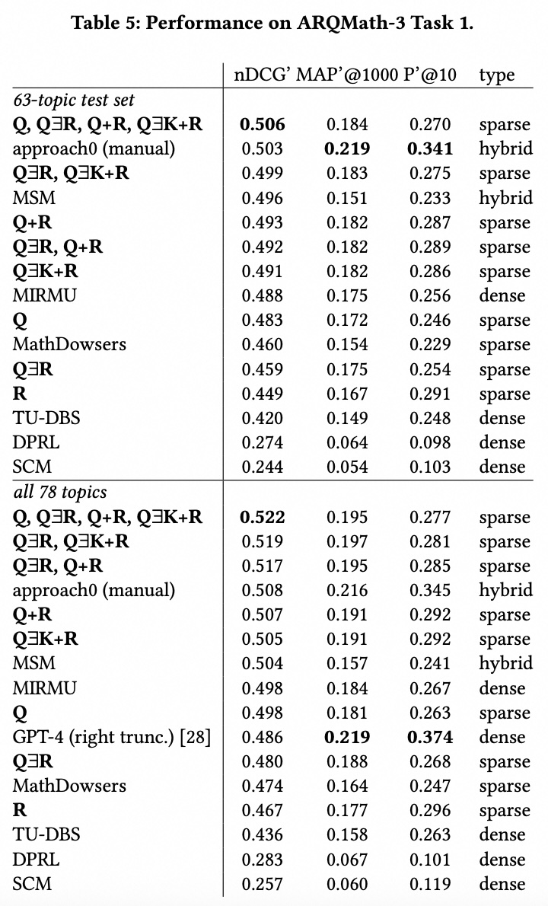
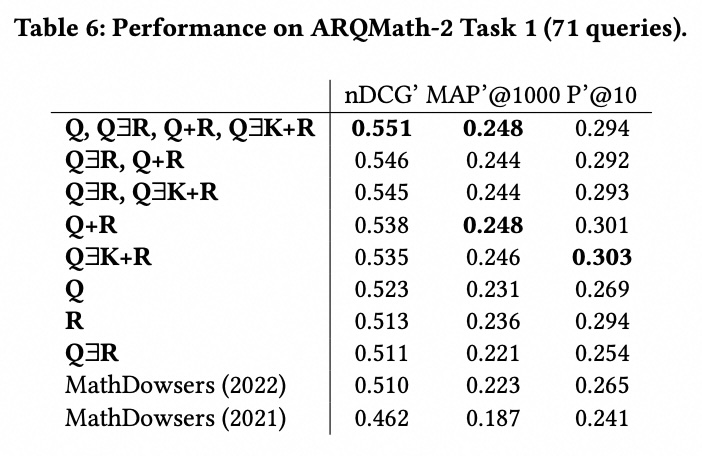

## AI论文解读 | Exploiting Query Reformulation and Reciprocal Rank Fusion in Math-Aware Search Engines
        
### 作者        
digoal        
        
### 日期        
2025-08-30       
        
### 标签        
PostgreSQL , PolarDB , DuckDB , AI , 论文解读        
        
----        
        
## 背景  
      
https://dl.acm.org/doi/pdf/10.1145/3704268.3742687        
  
提示:          
```          
读懂《Exploiting Query Reformulation and Reciprocal Rank Fusion in Math-Aware Search Engines》这篇论文需要提前掌握哪些基础知识, 请使用中文通熟易懂的讲解这些基础知识, 可以引用论文中的图、表或使用Markdown支持的图形(text,mermaid等)增加解释性. 
  
使用中文通熟易懂的解读《Exploiting Query Reformulation and Reciprocal Rank Fusion in Math-Aware Search Engines》这篇论文, 其中的关键内容请着重讲解, 可以引用论文中的图、表或使用Markdown支持的图形(text,mermaid等)增加解释性. 
  
提取《Exploiting Query Reformulation and Reciprocal Rank Fusion in Math-Aware Search Engines》这篇论文中的重要术语, 使用中文对这些术语进行通熟易懂的讲解, 可以引用论文中的图、表或使用Markdown支持的图形(text,mermaid等)增加解释性. 
```     
  
## 1 前置知识 
  
---

要读懂《Exploiting Query Reformulation and Reciprocal Rank Fusion in Math-Aware Search Engines》这篇论文，您需要提前掌握以下几个核心基础知识。这些知识将帮助您理解论文的研究背景、方法和贡献。

### 1. 信息检索（Information Retrieval, IR）基础
这篇论文的核心领域是信息检索，特别是针对数学内容的检索。因此，您需要理解以下基本概念：

* **什么是信息检索？** 它是一个寻找与用户需求相关的文档、信息资源或数据集合的过程。简单来说，就是搜索引擎的工作原理。
* **传统信息检索模型：** 论文中提到了“传统（稀疏）搜索系统”  和 **BM25** 模型 。这是一种经典的词袋模型（bag-of-words model），它通过计算查询词在文档中的频率（TF）和在整个文档集中的稀有度（IDF）来评估文档与查询的相关性。简单地说，一个词在文档中出现得越多，在整个文档集中出现得越少，它对这个文档的重要性就越高。

    * **TF（Term Frequency，词频）：** 某个词在文档中出现的次数。
    * **IDF（Inverse Document Frequency，逆文档频率）：** 衡量一个词在整个文档集中的稀有程度。
    * **BM25：** 一种常用的排名函数，结合了词频和逆文档频率来为文档打分。

### 2. 数学信息检索（Mathematical Information Retrieval, MIR）
数学信息检索是信息检索的一个子领域，主要处理包含数学公式和符号的文档。论文中提到，数学公式给标准的信息检索方法带来了复杂性 。

* **为什么数学检索很特别？**
    * **语义与语法差异：** 论文指出，在数学领域，语义相似的公式可能在外观上完全不同，而外观相似的公式可能表达完全不同的数学意义 。例如，$y=\frac{a+bx}{b-x}$ 和 $x=\frac{a+by}{b-y}$ 语法相似但语义不同。
    * **公式与自然语言的结合：** 论文强调，数学公式本身包含“搜索项”，而旁边的自然语言文本也部分地从公式中获得其意义，反之亦然 。

### 3. 查询重写/重构（Query Reformulation/Rewriting）
查询重构是本论文的核心研究内容。它指的是在执行搜索前，通过修改、扩展或精简原始查询来提高搜索效果的技术 。

* **为什么要进行查询重构？**
    * **词汇不匹配：** 用户使用的词语可能与文档中的相关词语不一致。
    * **查询不明确：** 原始查询可能缺乏足够的信息或包含无关内容。
* **重构方法：** 论文探讨了三种基于大型语言模型（LLM）的重构策略 ：
    * **术语选择（Term Selection）：** 从原始查询中识别并保留关键的、有用的术语，同时去除不相关或误导性的内容。
    * **术语扩充（Term Augmentation）：** 向原始查询中添加新的、有信息量的词语。这篇论文特别使用了LLM生成的内容来扩充查询。
    * **术语重新加权（Term Re-weighting）：** 调整查询中不同术语的重要性。

### 4. 倒数排序融合（Reciprocal Rank Fusion, RRF）
RRF 是一种用于结合多个检索结果列表的有效方法，论文使用它来整合不同查询重构策略的搜索结果 。

* **基本原理：** 假设你有来自不同搜索引擎或不同查询的多个排名列表，RRF 对每个列表中的文档进行评分。
* **计算方式：**
    * 如果一个文档在某个排名列表中的位置是 `rank`，那么它的倒数排名分数是 $1 / (k + rank)$。这里的 **k** 是一个常数，用于调整不同排名列表的分数。论文没有明确给出k的定义，但在图表中有所体现。
    * 最终，一个文档的总分数是它在所有列表中的倒数排名分数之和。
* **优点：** 论文提到，这种方法能够将来自不同方法的多个评分结果结合起来，从而提高最终的排名效果 。

### 5. 大型语言模型（Large Language Model, LLM）
论文利用 LLM 进行查询重构，因此了解其作用至关重要。

* **LLM 在本文中的角色：**
    * LLM 不用于直接回答问题，而是用于生成“假设文档” 。这些假设文档使用的词汇和短语与原始查询在语义上相似，但可能有助于更好地匹配语料库中的相关文档 。
    * 论文使用 LLM 生成的响应来替换或扩充原始查询，以改善传统搜索系统的排名性能 。

### 6. ARQMath 基准测试（Benchmark）
这篇论文的实验是基于 **ARQMath Lab** 的任务1基准测试进行的 。

* **ARQMath 是什么？** 这是一个专门针对数学问答的基准测试，它使用了来自 Math Stack Exchange（MSE）的真实世界数据 。
* **评估指标：** 论文中提到的评估指标（例如 **nDCG'@1000**、**MAP'@1000** 和 **P'@10**）都是信息检索领域用于衡量搜索系统性能的标准指标 。了解这些指标可以帮助您判断论文结果的有效性。

掌握了以上这些基础知识，您将能够更轻松地理解论文的动机、方法和实验结果，并深入分析其在数学信息检索领域的贡献。
  
## 2 解读论文 
  
好的，我们来通俗易懂地解读一下这篇关于数学搜索的学术论文。

### 论文标题

**《在数学感知搜索引擎中利用查询重构和倒数排名融合》**
*Exploiting Query Reformulation and Reciprocal Rank Fusion in Math-Aware Search Engines*

### 一句话总结

这篇论文的核心思想是：为了让计算机更准确地在专业的数学问答网站（如Math Stack Exchange）上找到问题的答案，我们不应该直接使用用户输入的“问题”去搜索，而是应该**利用大型语言模型（LLM，例如GPT）生成一个“假想的答案”，再把这个问题和这个假想答案结合起来，形成一个更丰富、更有效的查询**。最后，通过融合多种不同的查询策略，可以得到最佳的搜索结果。

-----

### 1\. 面临的挑战：为什么数学搜索这么难？

在专业的数学问答社区，一个问题通常包含：

  * **自然语言描述**：比如“如何找到这个方程的所有整数解？” 
  * **复杂的数学公式**：例如 $y=\\frac{a+bx}{b-x}$ 
  * **冗长的背景信息和上下文**：提问者可能会描述自己的解题思路和遇到的困难。 

传统的搜索引擎依赖关键词匹配，但在这里会失灵，因为：

1.  **语义鸿沟**：同一个数学概念可以用完全不同的词语或公式来表达。例如，一个问题和它的最佳答案可能在字面上几乎没有共同之处。 
2.  **公式难题**：公式本身就是一种语言，搜索引擎需要“看懂”公式的结构和含义，而不仅仅是里面的字母。 
3.  **信噪比低**：问题中常常包含很多与核心疑问无关的“噪音”信息，干扰搜索。 

**一个例子**
论文中的图1非常直观地展示了这个问题。   

  * **(a) 用户的提问**：寻找方程 $y=\\frac{a+bx}{b-x}$ 的整数解。 
  * **(b) 中等相关的答案**：这个答案虽然在解一个形式略有不同的方程，但其推导过程和思路对原问题有启发性。 
  * **(c) 无关的答案**：虽然也包含a, b, c, d等变量，但讨论的是一个完全不相关的公式。 
  * **(d) 低相关度的答案**：解的是另一个著名的丢番图方程，形式相似但解法不同。 

> 图1：一个MSE问题及其不同相关度的答案示例 

这就引出了本文的核心研究方向：如何“升级”用户的原始提问，让它变成一个更强大的“搜索指令”？

-----

### 2\. 核心方法：两大“神器”

#### 神器一：查询重构 (Query Reformulation)

“查询重构”就是改造原始查询的过程。论文没有采用传统的方法，而是巧妙地利用了大型语言模型（LLM）。

**核心思路**：向LLM输入用户的原始问题，并让它生成一个详细的解答。我们并不关心这个解答是否100%正确，而是要利用这个解答中的 **“高质量词汇和公式”** 。 

为什么这么做？因为一个好的“答案”的用词和表达方式，往往比“问题”本身更接近于数据库里其他高质量答案的风格。 

**具体怎么用LLM生成的回答呢？** 论文探索了多种策略，我们可以把它们想象成不同的“配方”：

| 策略代号 | 中文解释 | 操作方法 |
| :--- | :--- | :--- |
| **Q** | **原始查询 (Baseline)** | 直接使用用户的问题去搜索。 |
| **R** | **完全替换** | 扔掉用户的问题，只用LLM生成的回答去搜索。  |
| **Q+R** | **暴力拼接** | 把用户的问题和LLM的回答拼在一起，形成一个超长的查询。  |
| **QER** | **精华筛选 (Term Selection)** | 只保留原始问题中，同时也在LLM回答里出现的词。相当于用LLM做过滤器，去掉噪音。  |
| **QUR** | **查漏补缺 (Term Augmentation)** | 保留原始问题的所有词，并把LLM回答中出现的新词补充进来。  |
| **QEK+R** | **混合策略** | 一种更复杂的组合，例如对关键词进行筛选，对公式进行拼接等。 |

通过实验，论文发现简单地将原始问题与LLM的回答拼接起来（**Q+R**）就已经能带来不错的提升。 

#### 神器二：倒数排名融合 (Reciprocal Rank Fusion, RRF)

既然上面有那么多不同的“配方”，哪个是最好的呢？实验发现，没有一个配方能在所有情况下都胜出。

于是，作者想到了一个“三个臭皮匠，顶个诸葛亮”的方法——**融合**。

RRF是一种简单而高效的融合算法 。它的工作流程可以这样理解：

1.  **并行搜索**：同时运行多种最好的查询策略（比如，同时运行Q, QER, Q+R, QEK+R这四种）。 
2.  **各自排名**：每种策略都会得到一个自己的搜索结果排名列表。
3.  **投票合并**：RRF会综合考虑一个文档在所有列表中的排名，给出一个最终的综合分数，并据此生成一个全新的、更可靠的排名。

这个过程可以用下面的流程图来表示：



-----

### 3\. 实验结果与结论

论文在两个大型的真实世界数学问答数据集（ARQMath-2和ARQMath-3）上进行了验证。 

**核心发现：**

1.  **LLM确实有效**：使用LLM重构查询，尤其对于那些原本搜索效果很差的问题，性能提升非常显著。 
2.  **拼接优于替换**：将LLM的回答与原始问题拼接（Q+R），比单独使用任何一方效果都好。 
3.  **融合是王道**：**最终的赢家是融合了四种策略（原始查询Q、精华筛选QER、暴力拼接Q+R、混合策略QEK+R）的方法**。 

**最终成绩**
如论文的表5和表6所示，这种四策略融合的方法在所有自动搜索系统中，取得了**最高的nDCG'分数**（这是衡量搜索排名前后顺序有多好的核心指标）。     

具体来说，相比仅使用原始问题，该方法在多个关键指标上取得了显著提升：

  * **nDCG'@1000 提升了 5%**
  * **MAP'@1000 提升了 7%**
  * **P'@10 提升了 9% 以上** 

这证明了通过“LLM重构 + 多策略融合”的思路，可以实实在在地提高复杂数学问题的搜索准确率。

### 总结

这篇论文为我们展示了一个非常聪明且有效的提升专业领域（尤其是数学）搜索质量的范式。它告诉我们，强大的LLM不仅能直接回答问题，还能作为一种“催化剂”，通过生成高质量的中间文本来优化传统的搜索引擎，而将多种优化策略进行融合，则能发挥出“1+1\>2”的强大威力。
  
## 3 术语 
  
要理解《Exploiting Query Reformulation and Reciprocal Rank Fusion in Math-Aware Search Engines》这篇论文，掌握以下几个核心术语至关重要。我将用中文为您通俗地讲解，并结合论文内容进行阐释。

---

### **1. 数学信息检索 (Mathematical Information Retrieval, MIR)**

* **通俗解释：** 想象一下你在网上搜索一个复杂的数学公式或问题。普通的搜索引擎可能只会把公式当作一串无意义的字符。数学信息检索就是专门为了解决这个问题而存在的领域。它让计算机“理解”数学公式的结构和含义，从而能找到包含相关数学内容的文档。
* **在论文中的意义：** 论文指出，数学公式有其特殊性。例如，同一个数学概念可以用不同的符号或表达形式来表示，而外观相似的公式可能代表完全不同的意义。这使得传统的文本检索方法无法直接有效应用。该论文正是为了解决数学检索中的“公式与文本”混合匹配难题。

### **2. 查询重构 (Query Reformulation) / 查询重写 (Query Rewriting)**

* **通俗解释：** 你的原始搜索词可能不够精准。查询重构就是**自动帮你优化和改进你的搜索词**，让它更可能找到你想要的结果。这就像你问一个聪明的朋友问题，他不仅理解你的问题，还能帮你把问题问得更清楚，从而更容易找到答案。
* **在论文中的三种策略：** 论文使用了大型语言模型（LLM）来重构查询，具体分为三种方式：
    * **术语选择 (Term Selection)：** 挑选出原始查询中最有用的关键词，去掉那些不相关的部分。
    * **术语扩充 (Term Augmentation)：** 在原始查询的基础上，增加新的、相关的词语。例如，如果你搜索“二元函数求导”，系统可能会帮你增加“偏导数”或“多元微积分”等术语。
    * **术语重新加权 (Term Re-weighting)：** 调整查询中不同词语的重要性。比如，让公式中的核心符号比普通的文本词语拥有更高的权重。

### **3. 倒数排序融合 (Reciprocal Rank Fusion, RRF)**

* **通俗解释：** 假设你有多个独立的搜索引擎，每个都为你提供一份搜索结果列表。倒数排序融合就是一种**将这些不同列表的排名结果高效地结合起来**的方法，从而生成一份更全面、更准确的最终排名。它不像简单的投票或求平均值，而是更聪明地利用了“排名靠前的结果更重要”这一事实。
* **工作原理：** RRF 的基本思想是，一个文档的排名越靠前，它获得的分数就越高。
    * 它为每个文档在每个列表中的排名分配一个分数：$1 / (k + rank)$。
    * $rank$ 是文档在列表中的排名（从1开始）。
    * $k$ 是一个平滑常数，用来防止排名第一的文档得分过高。
    * 最后，将一个文档在所有列表中的分数加起来，得到它的最终得分。
* **在论文中的应用：** 论文中使用了多种查询重构策略来生成不同的搜索结果列表，然后利用 RRF 将这些列表融合，从而提升了最终的检索效果。

### **4. 大型语言模型 (Large Language Model, LLM)**

* **通俗解释：** LLM（如 ChatGPT）是一种强大的 AI 模型，它能理解并生成人类语言。它不仅仅是简单的词语匹配，还能理解语义和上下文。
* **在论文中的作用：** 论文巧妙地将 LLM 作为辅助工具，而不是直接用它来搜索。LLM 的主要任务是：
    * **生成“假设文档”：** LLM 根据用户的查询生成一段语义相关的文本，这段文本可能包含原始查询中没有但与主题相关的词语。
    * **辅助查询重构：** 论文利用 LLM 生成的这些文本来实施“术语扩充”等重构策略，从而帮助传统的搜索引擎更好地工作。

---

### **5. ARQMath 基准测试 (Benchmark)**

* **通俗解释：** 在计算机科学领域，基准测试就像一个“标准考试”。它提供了一套预先定义好的问题和对应的正确答案，用来公平地测试和比较不同算法或系统的性能。
* **在论文中的意义：** 论文中的所有实验结果都是基于 **ARQMath Lab** 这个专门针对数学问答的基准测试集。这意味着论文的成果是可验证和可复现的。论文中提到的 **nDCG'@1000** 等评估指标，就是衡量在这个“标准考试”中，系统表现有多好的分数。
  
## 参考        
         
https://dl.acm.org/doi/pdf/10.1145/3704268.3742687    
        
<b> 以上内容基于DeepSeek、Qwen、Gemini及诸多AI生成, 轻微人工调整, 感谢杭州深度求索人工智能、阿里云、Google等公司. </b>        
        
<b> AI 生成的内容请自行辨别正确性, 当然也多了些许踩坑的乐趣, 毕竟冒险是每个男人的天性.  </b>        
    
#### [期望 PostgreSQL|开源PolarDB 增加什么功能?](https://github.com/digoal/blog/issues/76 "269ac3d1c492e938c0191101c7238216")
  
  
#### [PolarDB 开源数据库](https://openpolardb.com/home "57258f76c37864c6e6d23383d05714ea")
  
  
#### [PolarDB 学习图谱](https://www.aliyun.com/database/openpolardb/activity "8642f60e04ed0c814bf9cb9677976bd4")
  
  
#### [PostgreSQL 解决方案集合](../201706/20170601_02.md "40cff096e9ed7122c512b35d8561d9c8")
  
  
#### [德哥 / digoal's Github - 公益是一辈子的事.](https://github.com/digoal/blog/blob/master/README.md "22709685feb7cab07d30f30387f0a9ae")
  
  
#### [About 德哥](https://github.com/digoal/blog/blob/master/me/readme.md "a37735981e7704886ffd590565582dd0")
  
  

  
