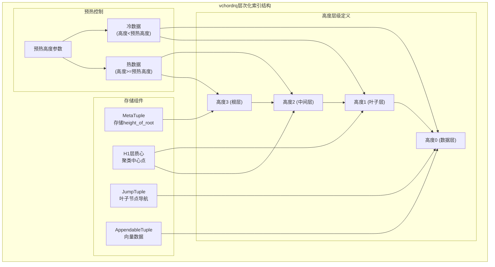

## PG vectorchord 向量索引预热(prewarm)原理    
                                
### 作者         
digoal                                
                                
### 日期                                
2025-08-29                               
                                
### 标签                                
PostgreSQL , PolarDB , DuckDB , vectorchord , 向量索引 , 索引结构 , 内存 , 索引预热 , 索引层级            
                                
----                                
                                
## 背景   
当从PG数据库访问数据时, shared buffer中没有被访问的数据, 需要从数据文件所在的存储(例如磁盘)中读取数据块, 加载到shared buffer中, 以便下一次加速访问.  
  
数据库运行一段时间后, 通常shared_buffer里面已经存在大量热数据(经常被访问的数据), 性能会比较平稳.   
  
但是, 一旦数据库重启, shared_buffer将被清空, 如果业务高峰期发生主动重启或被动重启(例如oom、HA等原因), 可能出现严重的性能下降/抖动, 甚至触发数据库雪崩效应.  
  
为了解决这个问题, PG提供了数据预热插件pg_prewarm, 结合pg_buffercache(可通过这个插件定期将buffer 内的数据块ID存到表中), 在应用程序访问数据库之前, 先根据存储的数据块ID预热到shared buffer中. 杜绝抖动问题.  
  
向量数据库呢?   
  
向量索引也可以预热, 但是向量索引通常都比较大, 容易把shared buffer打满.  
  
实际上没有必要把整个索引都预热进来, 也能保障性能. 为什么呢?  
  
因为向量索引通常是层次结构的, 例如rabitq+ivf的向量索引, 通常是有多层的. hnsw向量索引也是多层结构(越靠近搜索开端的层, 越稀疏, 就像地图, 最稀疏层可能只包含国家级别的数据, 然后逐层细化.).  
  
vectorchord提供了向量索引预热接口函数, 同时考虑到向量索引的层级结构, 只需要把靠近搜索端的某些层级加热到shared buffer即可提升访问性能.  
  
## vectorchord 向量索引预热例子  
对于向量索引，索引大小通常远大于内存大小。向量索引的设计使得索引数据被分成两部分：一小部分是热数据，另一部分是冷数据。向量索引只需要内存中的热数据即可实现合理的性能。因此，存在一个专门的预热函数，它只将索引的热数据加载到内存中。  
  
rabitq+ivf的例子  
  
```  
SELECT vchordrq_prewarm('items_embedding_idx');  
```  
  
即使索引大小远大于内存大小，它也能很好地运行。  
  
## 预热原理  
  
`vchordrq_prewarm`和`vchordg_prewarm`是VectorChord中两种不同索引访问方法的预热函数，它们通过将索引的热数据部分加载到内存中来提升查询性能。  
  
### 函数接口差异  
  
两个预热函数在PostgreSQL中的接口定义有所不同  ：  
  
- `vchordrq_prewarm(regclass, integer default 0)`：接受索引关系和高度参数  
- `vchordg_prewarm(regclass)`：只接受索引关系参数    
  
### 实现原理  
  
两个函数都遵循相同的验证和调用模式  ：  
  
1. **索引验证**：验证传入的关系ID是否为对应类型的有效索引  
2. **关系打开**：使用`AccessShareLock`打开索引关系  
3. **操作族获取**：获取索引的操作族信息以确定向量类型和距离函数  
4. **算法调用**：调用相应的底层预热算法  
  
### 底层算法调用  
  
#### vchordrq预热算法  
  
`vchordrq_prewarm`根据向量类型和距离函数分发到不同的算法实现  ：  
  
- 支持`VectorKind::Vecf32`和`VectorKind::Vecf16`两种向量类型  
- 支持`DistanceKind::L2S`和`DistanceKind::Dot`两种距离函数  
- 使用`MakeH0PlainPrefetcher`作为预取器  
- 调用`vchordrq::prewarm()`函数，传入索引、高度参数和预取器  
  
#### vchordg预热算法  
  
`vchordg_prewarm`使用类似的分发模式但不需要高度参数  ：  
  
- 支持相同的向量类型和距离函数组合  
- 直接调用`vchordg::prewarm()`函数，只传入索引参数  
  
### 预热策略差异  
  
基于背景信息中提到的热/冷数据分离设计，两种索引方法采用不同的预热策略：  
  
- **vchordrq**：基于RaBitQ + IVF算法，使用高度参数控制预热的层级深度，只加载指定高度以上的热数据部分  
- **vchordg**：基于图遍历算法，预热整个图结构的关键连接部分，不需要层级控制  
  
### Notes  
  
两个预热函数都通过`crates/vchordg/src/lib.rs`和对应的vchordrq crate中的`prewarm`模块实现具体的预热逻辑  。这些函数在基准测试脚本中被调用以优化查询性能  。  
  
### 向量索引层级原理  
  
在vchordrq索引中，高度（height）是层次化IVF结构中的核心概念，定义在`MetaTuple`的存储结构中  。  
  
### 高度的存储定义  
  
高度信息存储在索引的元数据结构中：  
  
- `height_of_root`字段定义了整个索引树的根节点高度    
- 在`MetaTupleHeader`结构体中作为`u32`类型存储    
  
### 层次化索引结构  
  
vchordrq使用多层聚类结构，每一层都有对应的高度值：  
  

  
### 高度在构建过程中的确定  
  
在索引构建时，高度通过层次化聚类过程确定  ：  
  
1. **内部构建**：通过k-means聚类逐层构建，每层对应一个高度级别    
2. **外部构建**：通过DFS遍历计算每个节点的高度    
  
### 预热中的高度使用  
  
在搜索和预热过程中，高度参数控制遍历深度：  
  
- 搜索时验证`height_of_root`与探针数量的匹配    
- 预热函数接受高度参数来限制加载的层级范围    
- 通过`step`函数逐层遍历，从根节点向下到指定高度    
  
### 高度与热数据的关系  
  
预热过程中，高度参数决定了哪些层级被视为"热数据"：  
  
- 高度越高的层级包含的数据越少，访问频率越高  
- 预热时只加载高于指定高度的层级，避免加载大量的叶子节点数据  
- 这种设计符合IVF算法的特性：上层质心用于快速定位，下层数据用于精确计算  
  
### Notes  
  
高度概念在vchordrq中是层次化IVF结构的核心，与传统B树索引的高度概念类似但应用于向量聚类场景。外部构建模式还支持从用户提供的层次结构表中构建索引，此时高度通过树遍历算法计算得出。  
  
  
## 参考  
  
https://docs.vectorchord.ai/vectorchord/usage/prewarm.html  
  
https://deepwiki.com/search/vchordrqprewarmvchordgprewarm_f3958251-a8d8-41b8-b8ea-96c27128f5ff  
  
  
    
#### [期望 PostgreSQL|开源PolarDB 增加什么功能?](https://github.com/digoal/blog/issues/76 "269ac3d1c492e938c0191101c7238216")
  
  
#### [PolarDB 开源数据库](https://openpolardb.com/home "57258f76c37864c6e6d23383d05714ea")
  
  
#### [PolarDB 学习图谱](https://www.aliyun.com/database/openpolardb/activity "8642f60e04ed0c814bf9cb9677976bd4")
  
  
#### [PostgreSQL 解决方案集合](../201706/20170601_02.md "40cff096e9ed7122c512b35d8561d9c8")
  
  
#### [德哥 / digoal's Github - 公益是一辈子的事.](https://github.com/digoal/blog/blob/master/README.md "22709685feb7cab07d30f30387f0a9ae")
  
  
#### [About 德哥](https://github.com/digoal/blog/blob/master/me/readme.md "a37735981e7704886ffd590565582dd0")
  
  

  
