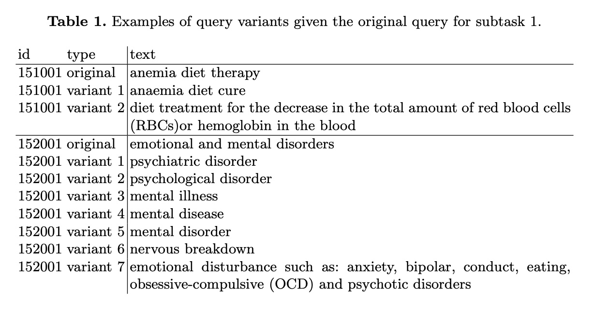
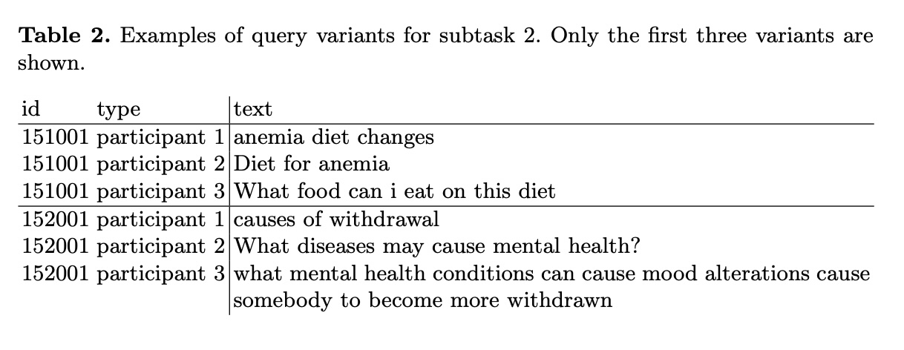
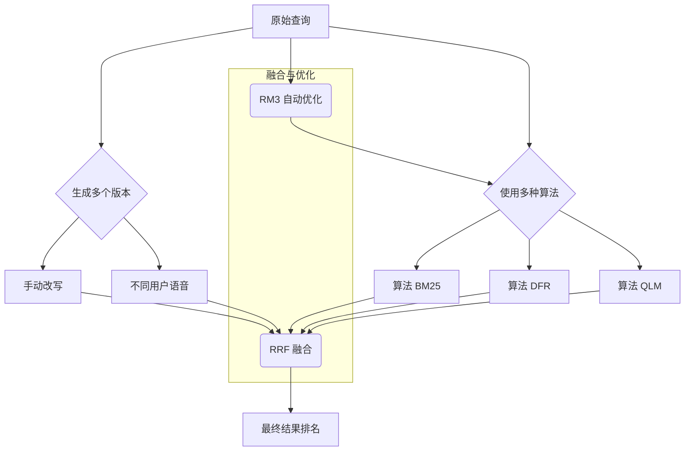
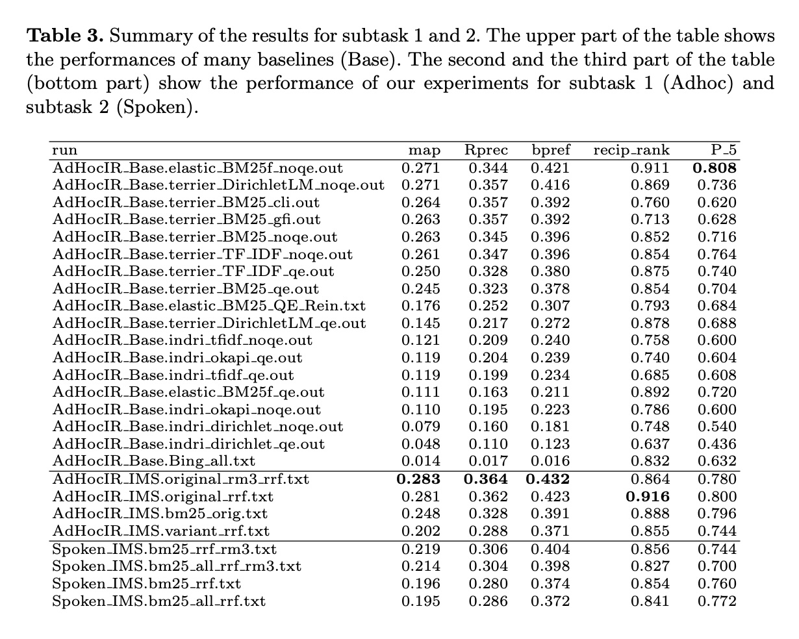

## AI论文解读 | A Study on Reciprocal Ranking Fusion in Consumer Health Search
        
### 作者        
digoal        
        
### 日期        
2025-08-30        
        
### 标签        
PostgreSQL , PolarDB , DuckDB , AI , 论文解读        
        
----        
        
## 背景  
      
https://ceur-ws.org/Vol-2696/paper_128.pdf        
  
提示:          
```          
读懂《A Study on Reciprocal Ranking Fusion in Consumer Health Search》这篇论文需要提前掌握哪些基础知识, 请使用中文通熟易懂的讲解这些基础知识, 可以引用论文中的图、表或使用Markdown支持的图形(text,mermaid等)增加解释性. 
  
使用中文通熟易懂的解读《A Study on Reciprocal Ranking Fusion in Consumer Health Search》这篇论文, 其中的关键内容请着重讲解, 可以引用论文中的图、表或使用Markdown支持的图形(text,mermaid等)增加解释性. 
  
提取《A Study on Reciprocal Ranking Fusion in Consumer Health Search》这篇论文中的重要术语, 使用中文对这些术语进行通熟易懂的讲解, 可以引用论文中的图、表或使用Markdown支持的图形(text,mermaid等)增加解释性. 
```     
  
## 1 前置知识 
  
---
这篇文章的中文翻译如下：

要读懂《A Study on Reciprocal Ranking Fusion in Consumer Health Search》这篇论文，你需要了解以下几个核心的基础概念：信息检索（Information Retrieval, IR）、排序融合（Ranking Fusion）和伪相关反馈（Pseudo-Relevance Feedback, PRF）。

### 1. 信息检索 (Information Retrieval, IR)

信息检索是一个研究如何从海量文档（比如网页、书籍或论文）中，根据用户的查询（query）找到相关文档的领域 。这篇论文的任务就是在一个医疗健康领域的文档集合上，为消费者健康搜索提供支持 。

在信息检索中，有两个重要的概念：

* **查询 (Query):** 用户为了表达信息需求而输入的词语或句子。论文提到了两种类型的查询：
    * **Ad-hoc IR (即时查询):** 这种查询是预先定义的，并且可以手动进行改写或扩展。例如，在论文中，原始查询 "anemia diet therapy"（贫血饮食疗法）被专家手动改写成了 “anaemia diet cure”（贫血饮食治疗）和“diet treatment for the decrease in the total amount of red blood cells...”等多个变体 。

    * **Spoken queries (口语查询):** 这种查询源于用户的口述，通常包含口语化的表达，并可能因不同人的发音和表达方式而产生多个版本。论文中展示了“anemia diet changes”（贫血饮食改变）和“What food can i eat on this diet”（这种饮食我能吃什么食物）等不同参与者提出的查询变体 。

* **检索模型 (Retrieval models):** 检索模型是用来衡量文档与查询相关性，并对文档进行排序的算法。论文提到了三种常用的模型：
    * **Okapi BM25:** 这是一种基于概率的排名模型，被认为是信息检索领域的基准 。它通过计算查询词在文档中的频率、文档长度以及其他参数来评估相关性 。
    * **Divergence from randomness (DFR):** 这是一种基于“偏离随机性”的检索模型 。它的核心思想是，如果一个词在文档中的出现频率远高于其在整个文档集合中的平均频率，那么这个词对该文档就很重要。
    * **Language model using Dirichlet priors (LMDirichlet):** 这是一种基于语言模型的检索模型，它通过估计文档的“语言模型”来评估文档和查询的匹配程度 。

---

### 2. 排序融合 (Ranking Fusion)

排序融合是一种将多个不同的检索结果列表（ranking lists）合并成一个更优的单一列表的技术 。其目的是通过结合不同检索模型或不同查询变体的优点，来提高整体的检索效果 。

这篇论文主要研究了**倒数排序融合 (Reciprocal Ranking Fusion, RRF)** 方法 。RRF 的基本原理是，一个文档在多个检索模型中排名越靠前，它的最终得分就越高。

你可以将 RRF 理解为一个投票系统：

* **输入：** 多个检索模型（如 BM25、DFR、LMDirichlet）针对同一查询，各自返回的排名列表。
* **计算：** RRF 为每个文档计算一个分数，公式如下：
    $$Score_d = \sum_{r \in R} \frac{1}{k + rank_{d,r}}$$
    其中， $d$ 代表文档， $R$ 是所有排名列表的集合， $rank_{d,r}$ 是文档 $d$ 在排名列表 $r$ 中的位置， $k$ 是一个常数（通常为60）。这个公式意味着，文档在排名列表中的位置越靠前（即 $rank$ 越小），其分母越小，得分就越高。
* **输出：** 一个新的、融合后的排名列表，其中的文档是根据 $Score_d$ 从高到低排序的。

论文中的实验结果也印证了这一点：当结合使用伪相关反馈时，排序融合的平均表现是最好的 。

---

### 3. 伪相关反馈 (Pseudo-Relevance Feedback, PRF)

伪相关反馈是一种自动化的查询扩展技术，它可以在不依赖用户显式反馈的情况下，通过对初始检索结果进行分析来优化查询 。

论文中使用的 **RM3** 模型就是一种伪相关反馈策略 。它的工作流程如下：

1.  **初始检索：** 使用原始查询，例如 "anemia diet therapy"，进行一次初步搜索。
2.  **选择相关文档：** 从初步搜索结果中，选择排名最靠前的 **10 个文档**，并假设它们是相关的 。
3.  **提取关键词：** 从这 10 个文档中，选择最相关的 **10 个词语** 。
4.  **查询扩展：** 将这些新提取的词语添加到原始查询中，形成一个“扩展后的查询” 。
5.  **重新加权：** 扩展后的查询中的原始词语被赋予 **1.0** 的权重，而新添加的词语则被赋予 **0.5** 的权重 。
6.  **最终排名：** 使用这个扩展后的查询进行第二次检索，产生最终的排名列表 。

从论文的实验结果来看，使用 RM3 伪相关反馈模型能有效提升检索性能 。

---

### 总结

掌握了以上概念，你就能更好地理解这篇论文的实验设计和结果分析：

* **目的：** 评估在消费者健康搜索中，倒数排序融合（RRF）与伪相关反馈（PRF）结合使用的效果 。
* **方法：** 在两个子任务（Ad-hoc IR 和 Spoken queries retrieval）上，对比了不同的查询变体和检索模型组合，并特别测试了 RRF 和 PRF 的效果 。
* **结论：** 论文的初步结果表明，结合伪相关反馈的排序融合方法在大多数情况下都优于基准模型 。
  
## 2 解读论文 
  
好的，我们来通俗易懂地解读一下这篇关于消费者健康搜索的研究论文。

### 论文标题：《消费者健康搜索中的倒数排名融合研究》 (A Study on Reciprocal Ranking Fusion in Consumer Health Search) 

-----

### 一、这篇论文要解决什么问题？

想象一下，当你在网上搜索“贫血吃什么好”时，你希望搜索引擎能快速、准确地返回最相关、最可靠的健康信息。但这其实很难，因为：

1.  **提问方式多样**：你可能搜“贫血食疗”，朋友可能搜“吃什么补血”，医生可能会用“缺铁性贫血的饮食干预”这样的专业术语。
2.  **搜索算法各有利弊**：不同的搜索技术（算法）有不同的强项，有的擅长匹配关键词，有的擅长理解长句子。

这篇论文的研究者们参加了一个名为“CLEF eHealth 2020”的科研挑战赛 ，目的就是探索如何优化搜索引擎，让普通大众（消费者）能更好地找到自己需要的健康信息 。

他们主要研究了两个场景：

  * **普通文本搜索** (Ad-hoc IR) 
  * **语音提问搜索** (Spoken queries retrieval) 

-----

### 二、研究者们的核心方法是什么？

他们的核心武器可以概括为两点：**“群策群力”** 和 **“自动优化”**。

#### 1\. 核心技术：倒数排名融合 (Reciprocal Ranking Fusion, RRF)

这就是所谓的 **“群策群力”** 。

这个方法听起来很专业，但原理很简单：**不要只依赖一个搜索结果，而是把来自不同搜索源的多个结果排名列表智能地合并成一个更好的最终排名**。

就好比你想找一家好餐厅，你不会只问一个朋友的意见，而是会问好几个朋友，然后综合他们的推荐来做决定。RRF就是用一种数学方法来做这件事，它能综合不同来源的结果列表，生成一个更可靠的最终列表 。

#### 2\. 他们融合了哪些“不同来源”？

研究者们通过以下三种方式来产生多个不同的结果列表，然后再用RRF技术将它们融合起来：

  * **① 不同的查询方式 (Query Variants)** 
      * **文本搜索**：他们请医学术语专家，将一个原始的搜索查询，手动改写成多个不同但意思相近的版本 。
          * **示例**：如下表所示，原始查询“anemia diet therapy”（贫血饮食疗法），被专家改写为“anaemia diet cure”（贫血饮食治疗）和一句更详细的描述 。

| 编号 | 类型 | 英文原文 | 中文解释 |
| :--- | :--- | :--- | :--- |
| 151001 | original | anemia diet therapy | 原始查询：贫血饮食疗法 |
| 151001 | variant 1 | anaemia diet cure | 变体1：贫血饮食治疗 |
| 151001 | variant 2 | diet treatment for the decrease in the total amount of red blood cells... | 变体2：针对血液中红细胞或血红蛋白总量减少的饮食治疗（详细描述） |

  

*基于论文中的 Table 1*


* **语音搜索**：直接使用6个不同用户用语音提问同一个问题时，被识别成的不同文本 。
    * **示例**：对于同一个关于贫血饮食的问题，不同的人问法差异很大，有的直接，有的口语化 。


| 编号 | 提问者 | 英文原文 | 中文解释 |
| :--- | :--- | :--- | :--- |
| 151001 | participant 1 | anemia diet changes | 贫血饮食改变 |
| 151001 | participant 2 | Diet for anemia | 贫血的饮食 |
| 151001 | participant 3 | What food can i eat on this diet | 这种饮食我能吃什么食物 |

  

*基于论文中的 Table 2*

  * **② 不同的搜索算法 (Retrieval Models)**

      * 在文本搜索任务中，他们用了三种主流的搜索算法（BM25, DFR, Language Model）来同时处理同一个查询 。每个算法都会给出一份自己的结果排名，这就又多了几个可以融合的来源。

  * **③ 是否进行伪相关反馈 (Pseudo-Relevance Feedback)**

      * 这就是所谓的 **“自动优化”**。他们使用了一种叫做 **RM3** 的技术 。
      * **工作原理**：搜索引擎先用原始查询进行一次初步搜索，然后假设排名最靠前的几篇文档（比如前10篇）是相关的。接着，系统会自动从这些文档里提取出一些新的、重要的关键词，把它们补充到原始查询中，形成一个更丰富、更精确的“扩展查询”，最后再用这个新查询去进行一次最终的、更精准的搜索 。

-----

### 三、实验与关键结果

研究者们设计了多组实验（在论文中称为“runs”）来对比不同策略的效果。

#### 他们的实验策略可以用下图来理解：



*上图展示了研究者的主要思路：通过“生成多个查询版本”和“使用多种算法”产生多个结果列表，然后使用“RRF融合”技术，并且在搜索过程中加入了“RM3自动优化”步骤。*

#### 关键发现：

研究者通过对比一系列评价指标（如MAP, P@5等，你可以简单理解为搜索结果的“准确率”），得出了几个重要结论：

1.  **“自动优化”效果显著**：无论是在文本搜索还是语音搜索中，使用了RM3伪相关反馈技术后，搜索效果都得到了明显提升 。

2.  **“群策群力” + “自动优化” = 最佳组合**：对于文本搜索任务，将多种搜索算法的结果进行RRF融合，并且再加上RM3自动优化（实验名为 `IMS.original.rm3.rrf`），取得了最好的成绩，在多项指标上都超过了主办方提供的所有基准系统 。

3.  **单纯增加“人工查询版本”帮助有限**：令人意外的是，仅仅使用专家手动改写的多个查询版本进行融合（实验名为 `IMS.variant_rrf`），在准确率这类标准指标上并没有带来显著提升 。

4.  **意外收获：人工改写的查询可能让结果更“易读”**：虽然人工改写的查询在准确率上不占优，但在另一项名为“可理解性”（rRBP）的评估中，它的得分更高 。这暗示着，虽然机器自动优化的查询更准，但人类专家智慧改写的查询，可能搜出来的结果对普通人来说更容易阅读和理解 。这是一个非常有价值的发现，值得未来继续研究 。

下面是论文核心结果表的简化版，我们可以清晰地看到这一点：

  * `map` 值越高代表准确率越好。
  * 加粗行为研究者的实验结果。

| 任务类型 | 实验/基准名称 | map (准确率) | 备注 |
| :--- | :--- | :--- | :--- |
| 文本搜索 | Base.elastic.BM25f (一个很强的基准) | 0.271 | 基准系统 |
| **文本搜索** | **IMS.original.rm3.rrf.txt** | **0.283** | **最佳组合：RRF融合 + RM3自动优化** |
| **文本搜索** | IMS.original.rrf.txt | 0.281 | 只用RRF融合，无自动优化 |
| **文本搜索** | IMS.bm25\_orig.txt | 0.248 | 单纯的BM25搜索，无融合无优化 |
| **文本搜索** | IMS.variant\_rrf.txt | 0.202 | 只用人工改写版本进行融合 |
| **语音搜索** | **IMS.bm25\_rrf\_rm3.txt** | **0.219** | **语音搜索中，融合+自动优化效果最好** |
| **语音搜索** | IMS.bm25\_rrf.txt | 0.196 | 语音搜索中，仅融合 |

*数据简化自论文中的 Table 3*

  

从上表可以直观地看到，标有 `rm3`（即自动优化）的实验 (`0.283` 和 `0.219`) 在各自的任务中都取得了最高的准确率。

-----

### 四、总结

这篇论文通过实验证明，在复杂的消费者健康搜索领域，**将多种搜索策略的结果进行融合（RRF），并结合查询自动优化技术（如RM3），是一种非常有效的提升搜索效果的方法** 。它告诉我们，与其依赖单一的“最佳”算法，不如聪明地将多个“还不错”的方案组合起来，往往能取得1+1\>2的效果。
  
## 3 术语 
  
-----

本文旨在提取并解释《A Study on Reciprocal Ranking Fusion in Consumer Health Search》这篇论文中的重要术语，帮助读者更好地理解其核心内容。

### 1\. 消费者健康搜索（Consumer Health Search）

这个术语指的是帮助普通消费者（非专业医疗人员）寻找医疗健康信息。这项任务的挑战在于，消费者使用的查询词可能不专业、不精确，且可能包含口语化的表达。论文的第二部分（第2页）展示了两个示例查询，从中可以看出查询的多样性和复杂性：

  * **查询 151001：** 原始查询是“anemia diet therapy”（贫血饮食疗法），但其变体可以是“diet treatment for the decrease in the total amount of red blood cells...”这种长而复杂的句子 。
  * **查询 152001：** 原始查询是“emotional and mental disorders”（情绪和精神障碍），其变体则包括“psychiatric disorder”、“nervous breakdown”等多种口语化或更专业的表达 。

### 2\. 倒数排序融合（Reciprocal Ranking Fusion, RRF）

**倒数排序融合**是一种将多个不同的检索结果列表融合成一个单一、更优的列表的方法 。论文的核心就是评估这种方法的效果。

**工作原理：**
假设你有多个不同的检索系统或查询变体，它们各自生成一个排名列表。RRF 通过给每个文档打分来融合这些列表，分数的计算公式为：
$Score\_d = \\sum\_{r \\in R} \\frac{1}{k + rank\_{d,r}}$
其中， $rank\_{d,r}$ 是文档 $d$ 在列表 $r$ 中的排名位置。
这个公式的精妙之处在于，一个文档在多个列表中排名越靠前，它的得分就越高。这有助于突出那些被多个检索系统都认为是相关的文档，从而提高整体检索效果。

论文中的实验表明，结合了伪相关反馈的排序融合方法（如 `IMS.original.rm3.rrf.txt`）在大多数性能指标上表现最佳 。

### 3\. 伪相关反馈（Pseudo-Relevance Feedback, PRF）

**伪相关反馈**是一种自动优化查询的技术，它通过分析初步的检索结果来扩展原始查询，从而提高后续检索的准确性 。

**论文中使用的具体方法（RM3模型）如下：**

1.  **初始检索：** 使用原始查询进行首次检索。
2.  **选择文档：** 选取排名最靠前的 **10 个**文档，并假定它们是相关的 。
3.  **提取术语：** 从这10个文档中提取 **10 个**最相关的术语 。
4.  **查询扩展：** 将这些新提取的术语添加到原始查询中 。
5.  **重新加权：** 原始查询中的词语权重设为1.0，新添加的词语权重则设为0.5 。
6.  **最终检索：** 使用扩展后的查询再次进行检索，得到最终结果。

论文中的结果表（见下表）显示，带有RM3伪相关反馈的运行（`IMS.original.rm3.rrf.txt`）通常比没有反馈的运行（`IMS.original.rrf.txt`）表现更好 。

```
| run                     | map  | Rprec | bpref | P5    |
| ----------------------- | ---- | ----- | ----- | ----- |
| AdHocIR IMS.original.rm3.rrf.txt | 0.283| 0.364 | 0.432 | 0.780 |
| AdHocIR IMS.original.rrf.txt   | 0.281| 0.362 | 0.423 | 0.800 |
```

  

*表：摘自论文表3，对比带有和不带RM3伪相关反馈的Ad-hoc IR任务结果。*

### 4\. 评估指标（Evaluation Measures）

为了衡量检索系统的性能，研究人员使用了一系列评估指标。论文中提到了以下几个重要指标：

  * **MAP (Mean Average Precision)：** 衡量系统在所有查询上的平均准确度，更关注排名靠前的文档的准确性 。
  * **Rprec (R-Precision)：** 衡量系统在返回与相关文档数量（R）相同数量的文档时的准确率 。
  * **bpref (Binary Preference)：** 在存在不完整相关性判断（即并非所有相关文档都被标记）的情况下，衡量系统性能的指标 。
  * **P@5 (Precision at 5)：** 衡量检索系统返回的前5个文档中相关文档的比例。对于口语查询，这个指标尤其重要 。
  * **rRBP (Readability Biased Precision)：** 用于衡量检索结果的**可读性**或**可理解性** 。
  * **cRBP (Credibility Biased Precision)：** 用于衡量检索结果的**可信度** 。

论文指出，在可读性（rRBP）方面，手动查询变体的运行（`AdHocIR IMS.variant_rrf.txt`）似乎比使用原始查询的运行表现更好 。这表明为消费者健康搜索手动创建查询变体是值得探索的方向。
  
## 参考        
         
https://ceur-ws.org/Vol-2696/paper_128.pdf    
        
<b> 以上内容基于DeepSeek、Qwen、Gemini及诸多AI生成, 轻微人工调整, 感谢杭州深度求索人工智能、阿里云、Google等公司. </b>        
        
<b> AI 生成的内容请自行辨别正确性, 当然也多了些许踩坑的乐趣, 毕竟冒险是每个男人的天性.  </b>        
  
  
