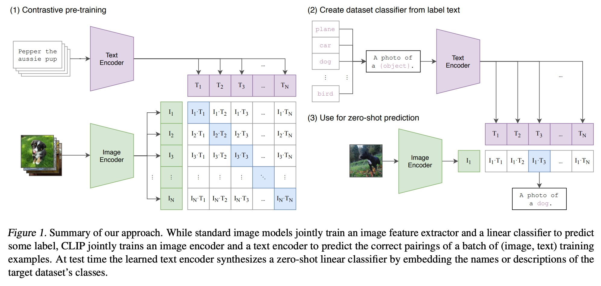
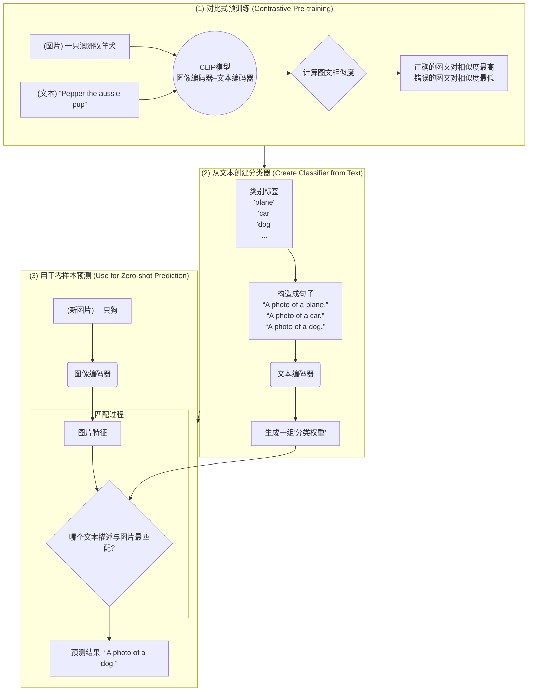
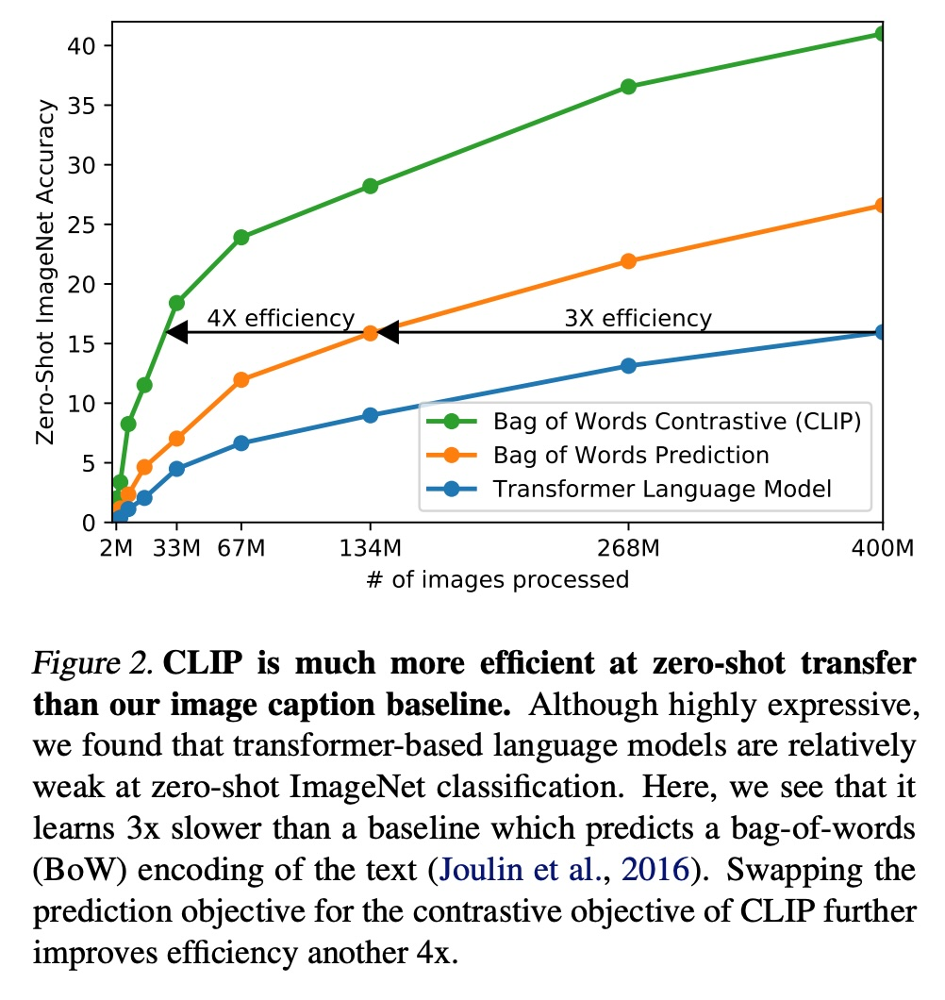
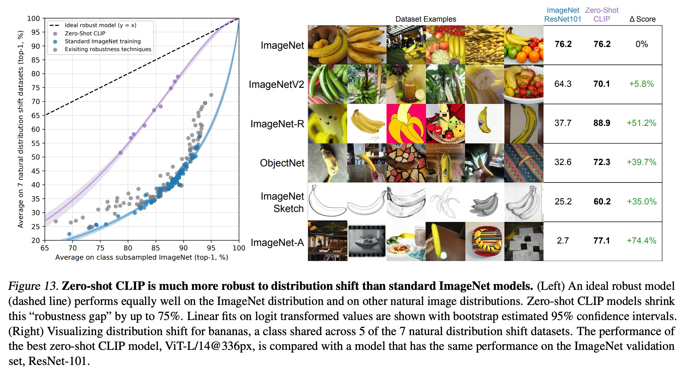
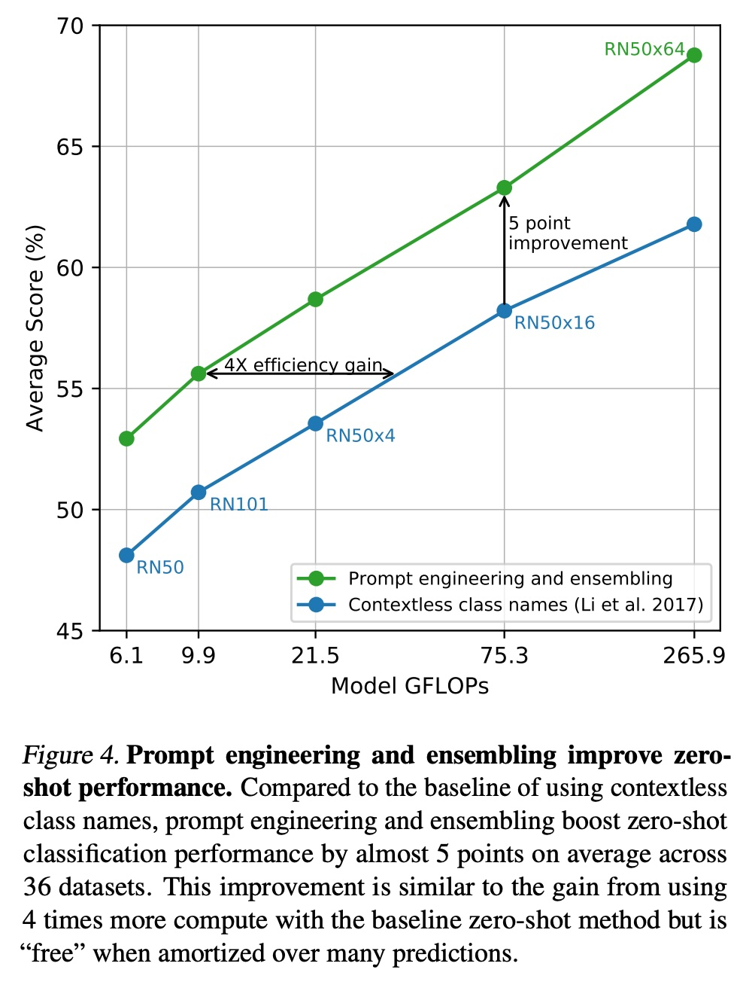
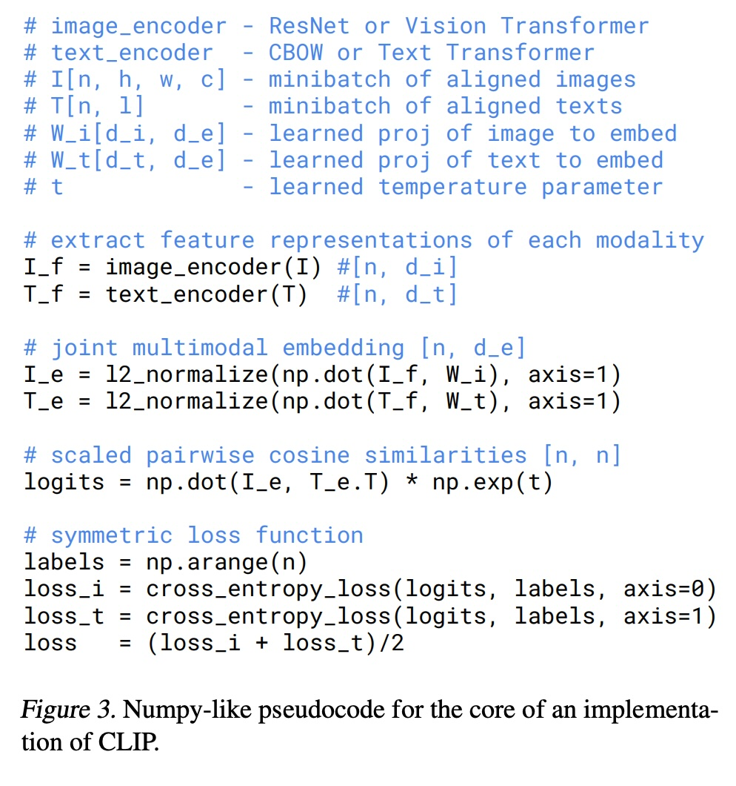

## AI论文解读 | Learning Transferable Visual Models From Natural Language Supervision
        
### 作者        
digoal        
        
### 日期        
2025-08-30       
        
### 标签        
PostgreSQL , PolarDB , DuckDB , AI , 论文解读        
        
----        
        
## 背景  
      
https://arxiv.org/pdf/2103.00020        
  
提示:          
```          
读懂《Learning Transferable Visual Models From Natural Language Supervision》这篇论文需要提前掌握哪些基础知识, 请使用中文通熟易懂的讲解这些基础知识, 可以引用论文中的图、表或使用Markdown支持的图形(text,mermaid等)增加解释性. 
  
使用中文通熟易懂的解读《Learning Transferable Visual Models From Natural Language Supervision》这篇论文, 其中的关键内容请着重讲解, 可以引用论文中的图、表或使用Markdown支持的图形(text,mermaid等)增加解释性. 
  
提取《Learning Transferable Visual Models From Natural Language Supervision》这篇论文中的重要术语, 使用中文对这些术语进行通熟易懂的讲解, 可以引用论文中的图、表或使用Markdown支持的图形(text,mermaid等)增加解释性. 
```     
  
## 1 前置知识 
  
好的，为了完全理解《Learning Transferable Visual Models From Natural Language Supervision》这篇开创性的论文（也就是 CLIP 模型），您需要掌握以下几个核心领域的知识。

我将用通俗易懂的中文为您逐一讲解，并结合论文中的图表示例来帮助理解。

### 核心基础知识概览

要读懂这篇论文，您需要了解以下几个关键概念：

1.  **人工智能的基本范式**：预训练 (Pre-training) 与迁移学习 (Transfer Learning)。
2.  **“零样本”学习 (Zero-Shot Learning)**：CLIP 模型最核心的亮点。
3.  **对比学习 (Contrastive Learning)**：模型学习的核心驱动力。
4.  **多模态与嵌入空间 (Multimodal & Embedding Space)**：如何连接图像和文字。
5.  **模型架构**：编码器 (Encoder) 与 Transformer。

-----

### 1\. AI 核心概念：预训练与迁移学习

想象一下培养一个学生的过程。我们不会直接让他去解决一个非常专业的难题，而是会先让他阅读大量的书籍、文章，掌握广泛的通用知识。

  * **预训练 (Pre-training)**：这个过程就像是让学生“博览群书”。在深度学习中，我们先用一个巨大、通用的数据集来训练一个模型。这个数据集不需要有非常精确的、针对某个特定任务的标签。论文中提到，他们从互联网上收集了 **4 亿个（图片，文本）对** 来进行预训练 。这个过程非常耗时耗力，但目的是让模型学到非常广泛和通用的“知识”。

  * **迁移学习 (Transfer Learning)**：学生掌握了通用知识后，再让他去学习一个具体的专业领域（比如物理或历史），他会学得非常快。这就是迁移学习。我们把在海量数据上预训练好的模型，应用到一个新的、更具体的任务上。通常这个新任务的数据量会小很多。

传统的迁移学习通常还需要一个**微调 (Fine-tuning)** 的步骤，即在新任务的数据上继续训练模型，调整其参数。但这篇论文的亮点在于，它的模型在很多任务上**不需要微调**，可以直接“零样本”地解决问题。

-----

### 2\. “零样本”学习 (Zero-Shot Learning)

这是理解 CLIP 最关键的概念。

  * **什么是“零样本”学习？**
    通常，要让一个模型识别猫，你需要给它看成千上万张“猫”的图片。但在零样本学习中，你**一张“猫”的训练图片都不给**，只告诉它“猫是一种毛茸茸的四足宠物”。然后，模型就能在一张新图片中认出猫来。

  * **CLIP 如何实现零样本学习？**
    CLIP 通过在海量的图文数据上进行预训练，学会了将**视觉概念**（图片里的内容）和**语言概念**（描述这些内容的文字）关联起来。

    当面临一个新任务时，比如在一个数据集中分类“狗”、“猫”、“汽车”，我们不需要用这些类别的图片去训练模型。我们只需要把这些类别的名字（比如 "dog", "cat", "car"）转换成描述性的句子，例如：

      * "a photo of a dog."
      * "a photo of a cat."
      * "a photo of a car."

    然后，将一张待分类的图片输入模型，同时把上面这几个描述性句子也输入模型。模型会判断这张图片和哪个句子的**匹配度最高**，匹配度最高的那个句子对应的类别，就是模型的预测结果。

    论文中的**图 1** 完美地展示了这个过程：   

    ```mermaid
    graph TD
        subgraph "(1) 对比预训练"
            A[图片: 一只狗] --> B(图像编码器);
            C["文本: 'Pepper the aussie pup'"] --> D(文本编码器);
            B --> E{计算相似度};
            D --> E;
            E --> F[学习目标: 让匹配的图文对相似度最高];
        end

        subgraph "(2) 为新任务创建分类器"
            G["文本: 'plane'"] --> H(文本编码器);
            I["文本: 'car'"] --> H;
            J["文本: 'dog'"] --> H;
            K["..."] --> H;
            H --> L[生成一组文本特征];
        end

        subgraph "(3) 进行零样本预测"
            M[新图片: 一只狗] --> N(图像编码器);
            N --> O{与所有文本特征进行匹配};
            L --> O;
            O --> P["预测结果: 'A photo of a dog'"];
        end

        style F fill:#cde,stroke:#333,stroke-width:2px
        style P fill:#cde,stroke:#333,stroke-width:2px
    ```

      * **步骤 (1)**：在预训练阶段，模型学习如何正确配对大量的图片和文本。
      * **步骤 (2) 和 (3)**：在测试（或应用）阶段，我们利用学到的能力。将一张新图片编码，然后看它与哪个“文本标签”的编码最相似，从而完成分类，整个过程不需要任何针对新任务的训练样本 。

-----

### 3\. 对比学习 (Contrastive Learning)

这是 CLIP 预训练阶段所使用的“学习方法”或“驱动力”。

  * **什么是对比学习？**
    它的核心思想很简单：“**拉近相似的，推远不相似的**”。

    在一个训练批次（batch）中，假设我们有 N 张图片和它们对应的 N 段文本。这就构成了 N 个正确的 **(图片, 文本)** 配对。同时，也构成了 $N \\times N - N$ 个不正确的配对。

    模型的任务就是：

    1.  **对于正确的配对**：调整模型参数，让图片编码和其对应文本编码的相似度尽可能高。
    2.  **对于不正确的配对**：调整模型参数，让它们的相似度尽可能低。

    **图 1** 中的那个网格就形象地说明了这一点 ：模型的目标是让对角线上的值（正确的图文对）最大化，而让所有非对角线上的值（错误的图文对）最小化。   

    ```mermaid
    graph TD
        subgraph 对比学习示意
            direction LR
            Img[图片 A]
            TextA["文本 A (正确描述)"]
            TextB["文本 B (错误描述)"]
            TextC["文本 C (错误描述)"]

            Img -- "正样本 (拉近)" --> TextA
            Img -- "负样本 (推远)" --> TextB
            Img -- "负样本 (推远)" --> TextC
        end
    ```

    通过在 4 亿个图文对上反复进行这样的“对比”，模型逐渐学会了什么样的视觉模式对应什么样的文本描述。

-----

### 4\. 多模态与嵌入空间

  * **多模态 (Multimodal)**：指的是同时处理和理解多种不同类型的数据。在这里，就是**图像**（视觉模态）和**文本**（语言模态）。CLIP 是一个典型的多模态模型。

  * **嵌入空间 (Embedding Space)**：这是一个比较抽象但很重要的概念。你可以把它想象成一个巨大的、高维度的“地图”或“空间”。

      * **编码器 (Encoder)** 的作用就是把输入的图片或文字，转换成这个“地图”上的一个**坐标点**（这个坐标点在数学上被称为“嵌入向量”或 "Embedding Vector"）。
      * CLIP 的训练目标，就是学习一种映射方法，使得一张图片和描述它的文字，能被映射到这个空间中**相同或非常接近**的位置。

    当模型训练好后，一张狗的图片和句子 "a photo of a dog" 在这个空间中的坐标就会非常接近。而这张狗的图片和句子 "a photo of a car" 的坐标就会离得很远。我们用来衡量“远近”的工具通常是**余弦相似度 (Cosine Similarity)**。

-----

### 5\. 模型架构：编码器与 Transformer

CLIP 模型主要由两部分组成，如 **图 1** 所示 ：   

1.  **图像编码器 (Image Encoder)**：负责“看懂”图片。它的作用是接收一张图片作为输入，然后输出一个向量（列表），这个向量就是图片在嵌入空间中的坐标。论文中尝试了两种主流的图像编码器：

      * **ResNet**：一种非常经典的卷积神经网络 (CNN)。
      * **Vision Transformer (ViT)**：一种更新的、将 Transformer 架构应用于图像识别的模型 。

2.  **文本编码器 (Text Encoder)**：负责“读懂”文字。它的作用是接收一段文本作为输入，然后也输出一个向量，即文本在嵌入空间中的坐标。论文中使用了标准的 **Transformer** 模型作为文本编码器 。

    ```mermaid
    graph TD
        A[图片输入] --> ImgEncoder(图像编码器);
        B[文本输入] --> TxtEncoder(文本编码器);
        ImgEncoder --> ImgVec[图像向量];
        TxtEncoder --> TxtVec[文本向量];

        subgraph 嵌入空间
            direction LR
            ImgVec -- 计算余弦相似度 --> TxtVec
        end
    ```

### 总结

将以上知识点串联起来，你就可以理解 CLIP 的工作流程了：

1.  **目标**：创建一个能理解图像和文本之间关联的模型，从而实现强大的**零样本**识别能力。
2.  **方法**：使用**对比学习**的策略。
3.  **架构**：通过一个**图像编码器**和一个**文本编码器**，将图片和文字映射到同一个**多模态嵌入空间**中。
4.  **训练**：在一个包含 **4 亿图文对**的巨大数据集上进行**预训练**，让匹配的图文对在嵌入空间中位置靠近，不匹配的则疏远。
5.  **应用**：对于一个新任务，只需提供类别名称的文本描述，模型就能通过计算图片与哪个描述最“靠近”来进行分类，无需任何新的图片训练数据。

掌握了这些基础知识后，您再去阅读论文原文，就会对其中的动机、方法和实验结果有更深刻的理解。
  
## 2 解读论文 
  
好的，我们来一起用通俗易懂的方式解读这篇开创性的论文——《从自然语言监督中学习可迁移的视觉模型》。这篇论文介绍了一个非常著名的模型：**CLIP** (Contrastive Language-Image Pre-training)，即**对比式语言-图像预训练**。

### **核心思想：让AI像人一样，通过描述来理解世界**

想象一下，我们是如何认识一个新事物，比如“斑马”的？我们可能没亲眼见过，但有人告诉我们“斑马是一种像马一样，但身上有黑白条纹的动物”。有了这个**语言描述**，当我们第一次看到斑马的**图片**时，就能立刻认出来。

传统的人工智能模型做不到这一点。你要想让它认识斑-马，就必须给它成千上万张标注好“这是斑马”的图片进行训练。这个过程成本高、效率低，而且模型只能认识它训练过的东西，通用性很差 。

CLIP的核心思想就是模仿人类的这种学习方式：**直接从海量的“图片 + 描述文字”中进行学习，让模型自己建立视觉和语言之间的联系** 。

### **CLIP是如何实现的？三大关键步骤**

论文提出的方法主要分为三个阶段，我们可以通过论文的图1来清晰地理解：   



**第一步：对比式预训练 (Contrastive Pre-training)**

这是CLIP学习的“核心动力”。

  * **数据**：研究者们从互联网上收集了一个巨大的数据集，包含了 **4亿个 (图片, 文本) 对** 。这些文本不是干净的标签，而是图片周围的任何文字，比如文章、描述、标题等。
  * **方法**：在训练时，模型会一次性看到一批（比如N个）图文对。对于其中任意一张图片，它对应的文本就是**正样本**，而其他所有N-1个文本都是**负样本**。
  * **目标**：模型需要学习一个**图像编码器**和一个**文本编码器**，将图片和文本都转换成一种数学表达（向量）。学习的目标非常简单：
      * 让正样本（正确的图文对）的向量在空间中尽可能**靠近**（相似度高）。
      * 让负样本（错误的图文对）的向量在空间中尽可能**远离**（相似度低） 。

通过在4亿个样本上进行这种“找朋友，推开陌生人”的游戏，CLIP逐渐掌握了丰富的视觉概念与语言描述之间的深刻联系 。

**第二步：创建零样本分类器 (Create Dataset Classifier)**

这是CLIP最巧妙和强大的地方。当我们需要让它做一个全新的分类任务时，比如识别1000种不同的物体，我们不需要找这1000种物体的图片去训练它。

我们只需要把这1000个类别的名字（比如 "yacht", "car", "dog"）变成描述性的句子，论文中发现使用 "A photo of a {label}." （一张关于{标签}的照片）这样的模板效果很好 。然后，将这些句子输入到已经训练好的**文本编码器**中，生成一组代表这些类别的向量。这一组向量就成了我们的“动态分类器”的权重 。

**第三步：进行零样本预测 (Use for zero-shot prediction)**

现在，拿来一张需要分类的新图片，执行以下操作：

1.  将图片输入到训练好的**图像编码器**，生成图片向量 。
2.  计算这个图片向量与第二步中生成的所有类别文本向量的**余弦相似度**（可以理解为匹配程度） 。
3.  哪个文本向量与图片向量的相似度最高，模型就认为这张图片属于哪个类别 。

这个过程完全没有使用新任务的任何一张训练图片，因此被称为“**零样本 (Zero-shot)**” 。

### **为什么CLIP如此高效和强大？**

1.  **训练效率的革命**：传统的模型是“生成式”的，比如看一张图，去预测它的描述文字是什么。这个任务非常困难，因为一个图片可以有无数种正确的描述 。而CLIP采用的“对比式”任务则简单得多，只需要判断“是不是”匹配就行，不需要生成具体的词 。论文中的**图2**明确指出，对比学习（绿线）的训练效率远高于预测式学习（橙线和蓝线），快了整整**4倍** 。   

2.  **惊人的零样本性能**：CLIP的零样本能力远超以往的模型。例如，在经典的ImageNet图像分类任务上，之前的零样本模型准确率只有11.5%，而CLIP在**没有使用任何一张ImageNet训练样本**的情况下，准确率达到了**76.2%**，这已经和当时一个经过完整监督训练的ResNet-50模型的性能相当了 。

3.  **更好的通用性和鲁棒性**：

      * **通用性**：因为它从自然语言中学习，所以它能识别各种各样的概念，包括动作、场景，甚至是抽象的艺术风格，而不仅仅是ImageNet中常见的物体名词 。
      * **鲁棒性 (Robustness)**：传统模型在训练集上表现很好，但如果测试图片的风格、角度或环境发生变化（即分布偏移），性能会急剧下降。而零样本的CLIP因为它没有“过拟合”到某个特定数据集的“套路”上，所以对这种变化的抵抗力要强得多 。**图13**显示，标准ImageNet模型在面对分布偏移时，性能差距很大，而CLIP则能将这个“鲁棒性差距”缩小多达**75%** 。   

### **CLIP的局限性**

尽管CLIP非常强大，但论文也坦诚地指出了它的不足之处：

  * **对某些任务仍然乏力**：在一些非常**细粒度**的分类任务（如区分不同型号的汽车或不同种类的花 ）和**抽象**任务（如数一张图里有多少个物体 ）上，CLIP的零样本表现不佳。
  * **性能上限**：虽然零样本性能惊艳，但与在特定任务上用海量数据进行监督训练的SOTA（state-of-the-art）模型相比，通常仍有10%-25%的差距 。
  * **数据偏见**：由于训练数据来自未经筛选的互联网，模型不可避免地会学到其中的社会偏见、刻板印象甚至是攻击性内容 。例如，模型可能会将某些人群与负面词汇（如犯罪）联系起来 。

### **总结**

《从自然语言监督中学习可迁移的视觉模型》这篇论文通过提出CLIP模型，成功地将在自然语言处理领域被验证的“大规模、弱监督预训练”范式迁移到了计算机视觉领域 。它利用**对比学习**作为桥梁，高效地连接了视觉和语言两大模态，实现了惊人的**零样本迁移能力**，为构建更通用、更鲁棒的视觉模型开辟了一条全新的道路。
  
## 3 术语 
  
好的，我们来一起梳理并讲解《Learning Transferable Visual Models From Natural Language Supervision》这篇论文中的核心术语。

### 1\. 自然语言监督 (Natural Language Supervision)

  * **讲解**：这是一种机器学习的训练方式，指的是模型直接从与图像配对的自然语言文本（如标题、描述、文章）中学习，而不是依赖于传统的、需要人工标注的固定类别标签（如“猫”、“狗”）。这种方法的优势在于可以利用互联网上几乎无限的、现成的图文数据，让模型学习更广泛、更丰富的视觉概念 。
  * **论文中的体现**：整个CLIP模型的基础就是利用从互联网收集的4亿个 (图片, 文本) 对进行训练，这就是自然语言监督的直接应用 。

### 2\. 零样本迁移/学习 (Zero-Shot Transfer/Learning)

  * **讲解**：这指的是模型在没有见过某个特定任务的任何一个训练样本的情况下，就能直接在该任务上进行预测和分类的能力 。就好比你只听过“水豚是一种长得像巨大豚鼠的动物”的描述，从未见过图片，但下次看到水豚时就能认出来。

  * **论文中的体现**：CLIP的核心亮点就是其强大的零样本迁移能力。例如，在ImageNet分类任务上，它不需要查看任何ImageNet的训练图片，仅通过类别名称（如“狗”）构成的描述性文本（如“a photo of a dog”），就能达到与完全监督训练的ResNet-50相媲美的准确率 。论文中的**图1**完整地展示了这一过程。   

    ```mermaid
    graph TD
        subgraph "零样本预测流程"
            A["新图片 (未见过)"] --> B(图像编码器);
            C["类别文本描述<br>'a photo of a cat'<br>'a photo of a dog'"] --> D(文本编码器);
            B --> E["图片特征向量"];
            D --> F["文本特征向量集"];
            E & F --> G{计算相似度};
            G --> H["预测结果: 相似度最高的类别"];
        end
    ```

### 3\. 对比学习 (Contrastive Learning)

  * **讲解**：这是一种自监督学习的方法，其核心思想是“拉近相似的，推远不相似的”。在CLIP中，对于一个训练批次里的N张图片和N段文本，与某张图片正确配对的文本是“正样本”，其他所有文本都是“负样本”。模型的目标就是学习一个表示空间，在这个空间里，正样本对的相似度尽可能高，而负样本对的相似度尽可能低 。
  * **论文中的体现**：CLIP的全称就是**Contrastive** Language-Image Pre-training。它通过一个对称的交叉熵损失函数来优化N×N个可能的图文对的相似度得分，最大化正确配对（对角线）的得分，同时最小化错误配对（非对角线）的得分 。

### 4\. 多模态嵌入空间 (Multi-modal Embedding Space)

  * **讲解**：这是一个抽象的数学空间，不同的“模态”（如图像和文本）的数据都被映射（或称“嵌入”）到这个空间里的向量。CLIP的目标就是学习一个统一的嵌入空间，在这个空间里，语义相关的图像和文本的向量位置非常接近 。
  * **论文中的体现**：CLIP通过联合训练一个图像编码器和一个文本编码器来实现这一点。这两个编码器将各自的输入转换到同一个嵌入空间中，然后通过计算向量间的余弦相似度来判断图文是否匹配 。

### 5\. 提示工程 (Prompt Engineering)

  * **讲解**：这是一个在使用预训练模型（尤其是零样本场景下）时很重要的技巧。指的是通过设计或优化输入给模型的文本提示（Prompt），来更好地引导模型完成特定任务。
  * **论文中的体现**：研究者发现，直接使用类别名（如“dog”）作为文本提示，效果不如使用一个句子模板，如“A photo of a {label}.”（一张关于{标签}的照片） 。使用这个简单的提示模板，在ImageNet上的准确率就提升了1.3% 。他们还发现，针对不同任务定制化提示（如对于宠物数据集使用“A photo of a {label}, a type of pet.”）和集成多个提示的结果，能显著提升性能，在ImageNet上总共提升了近5% 。**图4**直观地展示了提示工程和集成带来的巨大性能增益。   

### 6\. 图像编码器 (Image Encoder) & 文本编码器 (Text Encoder)

  * **讲解**：这是CLIP模型的两个核心组件。
      * **图像编码器**：负责接收一张图片，并将其转换成一个能代表其内容的特征向量 。
      * **文本编码器**：负责接收一段文本，并将其转换成一个能代表其语义的特征向量 。
  * **论文中的体现**：论文中为图像编码器测试了两种主流架构：**ResNet** 和 **Vision Transformer (ViT)** 。文本编码器则使用了标准的 **Transformer** 架构 。**图3**中的伪代码清晰地展示了这两个编码器如何工作并计算最终的损失。   

### 7\. 鲁棒性 (Robustness)

  * **讲解**：在机器学习中，鲁棒性通常指模型在面对与训练数据分布不同的、有噪声的或有变化的测试数据时，维持其性能表现的能力。
  * **论文中的体现**：论文花费大量篇幅论证了零样本CLIP比在ImageNet上进行监督训练的模型具有更强的鲁棒性。当在ImageNet的各种“变体”测试集（如ImageNet-Sketch, ImageNet-R等自然分布偏移数据集）上进行测试时，传统模型的准确率会大幅下降，而零样本CLIP的性能下降得少得多，能将这个“鲁棒性差距”缩小高达75% 。这一结论在**图13**中有非常直观的展示。   
  
## 参考        
         
https://arxiv.org/pdf/2103.00020    
        
<b> 以上内容基于DeepSeek、Qwen、Gemini及诸多AI生成, 轻微人工调整, 感谢杭州深度求索人工智能、阿里云、Google等公司. </b>        
        
<b> AI 生成的内容请自行辨别正确性, 当然也多了些许踩坑的乐趣, 毕竟冒险是每个男人的天性.  </b>        
  
  
  
