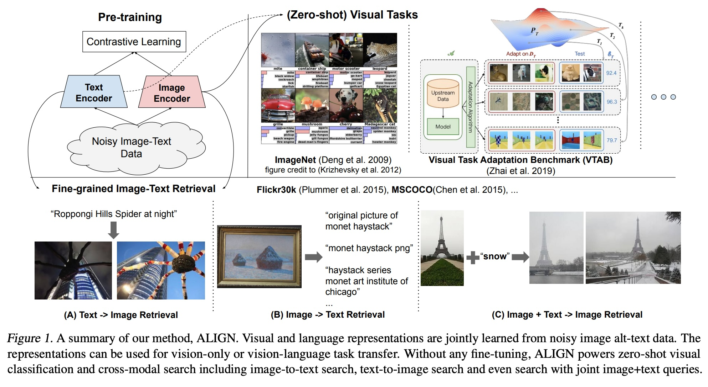
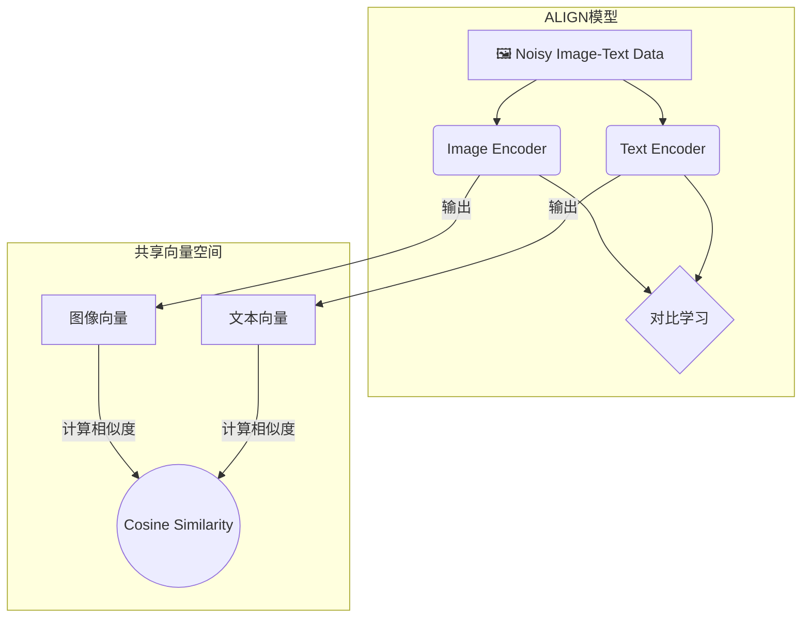
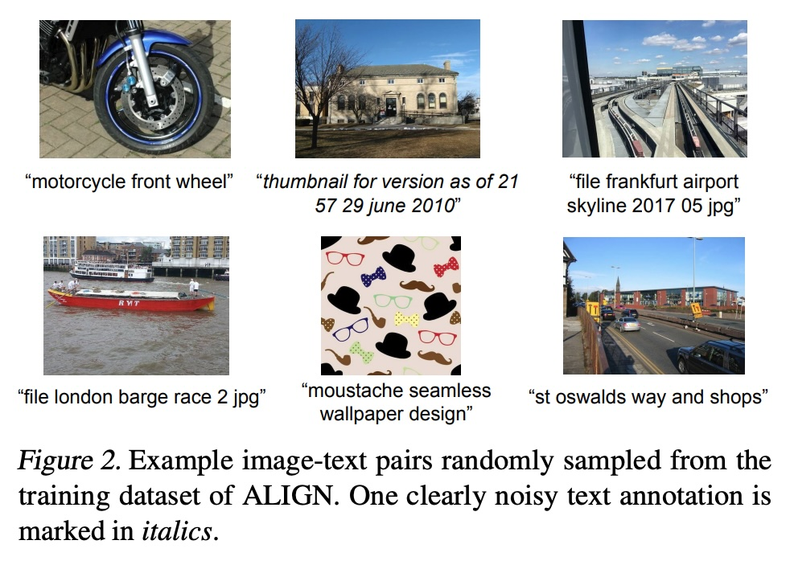
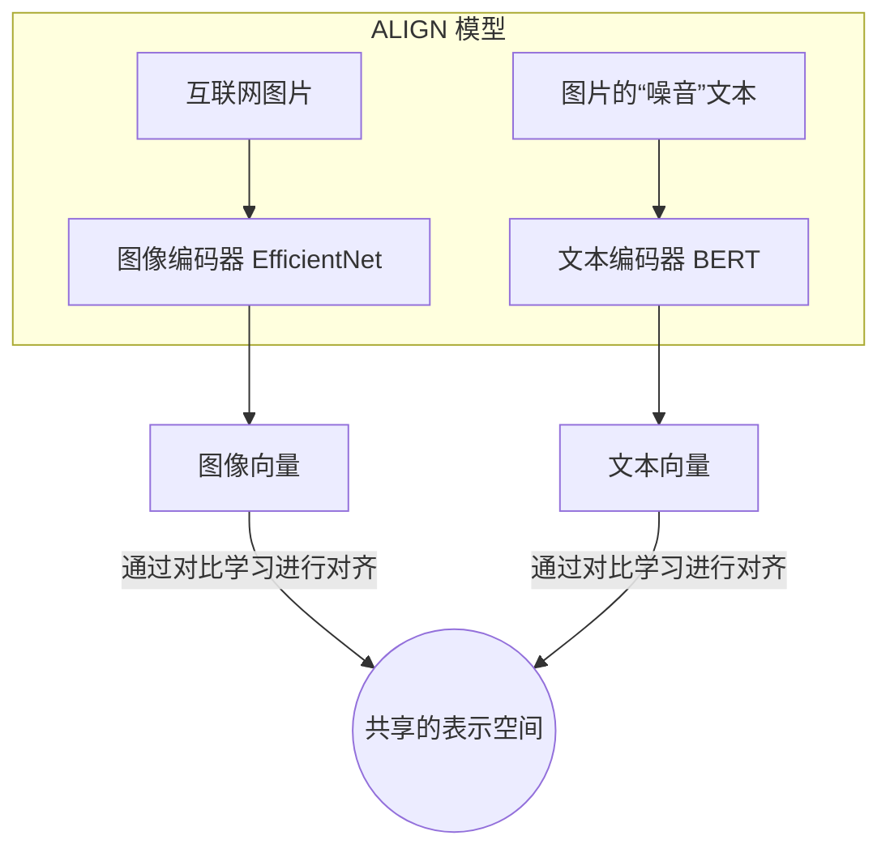
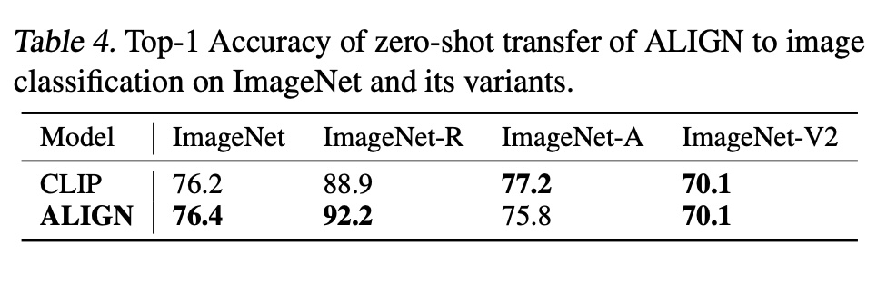
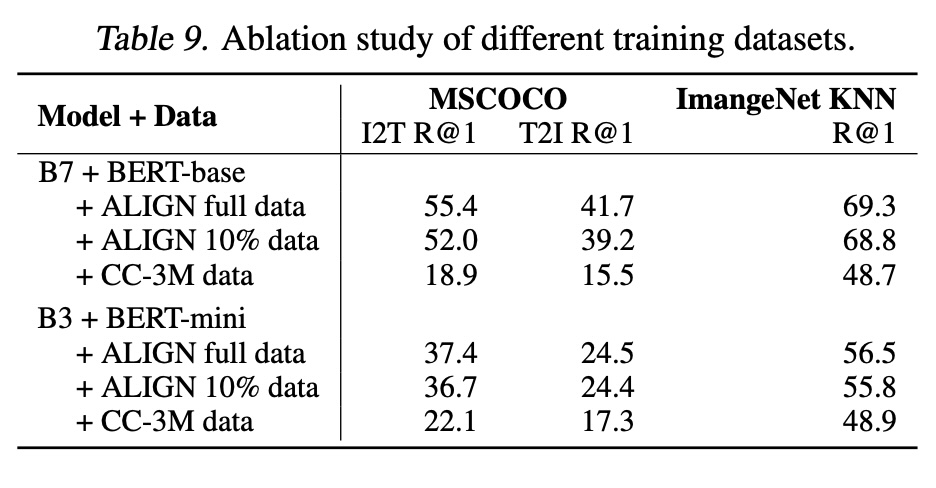
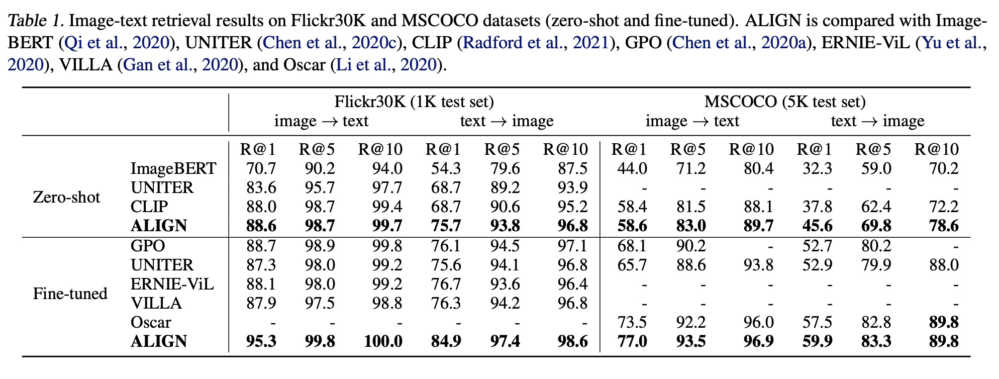
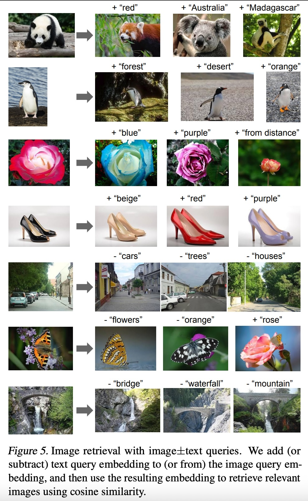

## AI论文解读 | Scaling Up Visual and Vision-Language Representation Learning With Noisy Text Supervision
        
### 作者        
digoal        
        
### 日期        
2025-08-30        
        
### 标签        
PostgreSQL , PolarDB , DuckDB , AI , 论文解读        
        
----        
        
## 背景  
      
https://arxiv.org/pdf/2102.05918        
  
提示:          
```          
读懂《Scaling Up Visual and Vision-Language Representation Learning With Noisy Text Supervision》这篇论文需要提前掌握哪些基础知识, 请使用中文通熟易懂的讲解这些基础知识, 可以引用论文中的图、表或使用Markdown支持的图形(text,mermaid等)增加解释性. 
  
使用中文通熟易懂的解读《Scaling Up Visual and Vision-Language Representation Learning With Noisy Text Supervision》这篇论文, 其中的关键内容请着重讲解, 可以引用论文中的图、表或使用Markdown支持的图形(text,mermaid等)增加解释性. 
  
提取《Scaling Up Visual and Vision-Language Representation Learning With Noisy Text Supervision》这篇论文中的重要术语, 使用中文对这些术语进行通熟易懂的讲解, 可以引用论文中的图、表或使用Markdown支持的图形(text,mermaid等)增加解释性. 
```     
  
## 1 前置知识 
  
好的，为了完全理解《Scaling Up Visual and Vision-Language Representation Learning With Noisy Text Supervision》这篇论文（我们称之为ALIGN模型），您需要先掌握一些机器学习和深度学习领域的基础知识。

下面我将用通俗易懂的中文，结合论文中的图表，为您讲解这些核心概念。

### 核心基础知识概览

要读懂这篇论文，您需要了解以下几个关键概念：

1.  **表征学习 (Representation Learning) 与词嵌入 (Embeddings)**：计算机如何“理解”图片和文字？
2.  **多模态学习 (Multimodal Learning)**：如何让模型同时处理不同类型的数据（如视觉和语言）？
3.  **模型架构：双编码器 (Dual-Encoder)**：ALIGN模型的核心结构是什么样的？
4.  **训练方法：对比学习 (Contrastive Learning)**：模型是如何通过“找不同”来学习的？
5.  **核心理念：用海量“噪音”数据进行监督学习**：为什么这篇论文强调“Noisy Text Supervision”？
6.  **下游任务：零样本学习 (Zero-Shot Learning) 与图文检索 (Image-Text Retrieval)**：学会之后能用来做什么？

-----

### 1\. 表征学习 (Representation Learning) 与 词嵌入 (Embeddings)

想象一下，我们如何向计算机描述“猫”和“狗”？我们不能直接把图片或文字塞给它。计算机只懂数字。

**表征学习** 的目标就是把现实世界中的复杂数据（比如一张图片、一段文字）转换成一个由数字组成的向量（Vector），这个向量被称为**嵌入 (Embedding)**。

  * **核心思想**：这个转换过程不是随机的，而是要让转换后的向量能够抓住原始数据的**核心语义**。比如：
      * 在向量空间中，“猫”的向量和“虎”的向量会比较接近。
      * 一张包含“落日”的图片，其向量会和“黄昏”、“夕阳”等词的文本向量在空间中位置相近。

简单来说，就是**用数学向量来表达万事万物**，并且让意思相近的东西在数学空间里的距离也相近。这篇论文的目标就是学习出高质量的图像表征和文本表征 。

### 2\. 多模态学习 (Multimodal Learning)

“模态”指的是数据的类型，比如视觉、听觉、文本等都是不同的模态。**多模态学习**就是让一个模型能够同时理解和处理来自不同模态的信息。

这篇论文研究的是**视觉-语言 (Vision-Language)** 这一经典的多模态任务 。它的核心目标是**对齐 (Align)** 两种模态的表征。也就是说，模型需要学会将一张图片和描述它的文字映射到同一个共享的向量空间中 ，使得“一只狗在草地上奔跑”的图片向量和这句话的文本向量尽可能地靠近。

### 3\. 模型架构：双编码器 (Dual-Encoder)

为了实现上述的“对齐”，论文采用了一种简洁而高效的**双编码器 (Dual-Encoder)** 架构 。我们可以把它想象成两个并行的“大脑”，分别处理不同的任务。

  * **图像编码器 (Image Encoder)**：一个专门负责“看图”的大脑。它接收一张图片作为输入，然后输出一个代表这张图片内容的向量 。论文中使用了强大的图像识别模型 EfficientNet 。
  * **文本编码器 (Text Encoder)**：一个专门负责“读文字”的大脑。它接收一段文本作为输入，然后输出一个代表这段文本含义的向量 。论文中使用了自然语言处理领域著名的 BERT 模型 。

这两个编码器把不同模态的数据转换到**同一个维度**的向量空间里，这样它们的输出向量才能进行比较 。

下面是论文中图1的简化示意图，清晰地展示了这个结构：   



### 4\. 训练方法：对比学习 (Contrastive Learning)

有了模型结构，我们该如何训练它呢？论文使用了**对比学习 (Contrastive Learning)** 的方法 。这个思想非常直观，就像我们教孩子认东西一样：

**核心原则：拉近“正样本”，推远“负样本”。**

  * **正样本 (Positive Pair)**：一张图片和它对应的描述文字，是“天生一对” 。比如 (一张猫的图片, "一只可爱的猫")。
  * **负样本 (Negative Pair)**：一张图片和不相关的文字，是“八竿子打不着”的组合 。比如 (一张猫的图片, "一辆蓝色的汽车")。

在训练过程中，模型的目标是：

1.  让**正样本对**的图像向量和文本向量在空间中的**距离越来越近**。
2.  让**负样本对**的图像向量和文本向量在空间中的**距离越来越远**。

通过在一个批次 (batch) 的数据中不断进行这种“配对”和“拆散”的练习，两个编码器逐渐学会了如何准确地捕捉图像和文本的深层语义，并将它们对齐到共享空间中 。

### 5\. 核心理念：用海量“噪音”数据进行监督学习

传统上，训练这种模型需要高质量、人工标注过的数据集，比如 MSCOCO 。这些数据集非常昂贵且规模有限（通常在百万或千万级别） 。

这篇论文反其道而行之，它认为**数据的规模比质量更重要**。

  * **数据来源**：直接从互联网上获取了超过**十亿**级别的图片和其对应的“alt-text”（网页上对图片的描述文字） 。
  * **“噪音”的含义**：这些 alt-text 质量参差不齐，很多可能是无意义的文件名（如 "file frankfurt airport skyline 2017 05 jpg" ），或者非常笼统的描述 。
  * **核心洞见**：尽管数据很“脏”，但由于其数量极其庞大（18亿对 ），模型在学习过程中能够自动过滤掉大部分噪音，抓住图像和文本之间反复出现的、真正相关的模式。最终，**规模的优势弥补了噪音的劣势** 。

论文中的图2就展示了这些真实的、带有噪音的训练数据样本 。   

> 图中 "thumbnail for version as of 21 57 29 june 2010" 就是一个典型的噪音文本 。

### 6\. 下游任务：零样本学习 (Zero-Shot Learning) 与图文检索 (Image-Text Retrieval)

当模型训练好后，它强大的表征能力可以被应用在很多下游任务上，最典型的就是论文中提到的：

  * **图文检索 (Image-Text Retrieval)**：这是最直接的应用。

      * **文搜图**：输入一段文字，模型将其编码为文本向量，然后在海量图片库中寻找图像向量最接近的图片 。
      * **图搜文**：输入一张图片，模型将其编码为图像向量，然后寻找与之最匹配的文本描述 。
      * **图+文搜图**：甚至可以做更复杂的搜索，比如输入一张“埃菲尔铁塔”的图片，再加上“雪”这个词，模型可以找到“雪中的埃菲尔铁塔”图片 。

  * **零样本分类 (Zero-Shot Classification)**：这是更“惊艳”的能力。假设模型在训练时**从未见过**“斑马”这个类别的标注。我们如何让它识别斑马？

    1.  拿一张斑马的图片，用**图像编码器**生成其向量 `V_image`。
    2.  将所有可能的类别标签（如 "a photo of a cat", "a photo of a dog", "a photo of a zebra"）用**文本编码器**生成对应的文本向量 `V_cat`, `V_dog`, `V_zebra`。
    3.  比较 `V_image` 和哪个文本向量最接近。如果和 `V_zebra` 最近，模型就成功“零样本”地识别出了斑马 。

论文在 ImageNet 等多个数据集上验证了其强大的零样本分类能力 。

### 总结

要读懂 ALIGN 这篇论文，您可以带着以下问题去阅读：

1.  **目标是什么？** -\> 学习一个统一的视觉-语言表征空间。
2.  **用什么方法？** -\> 双编码器架构 + 对比学习。
3.  **数据有何不同？** -\> 使用了十亿级别的、从网络上爬取的、充满噪音的图文对。
4.  **核心论点是什么？** -\> 证明了超大规模的“脏”数据足以训练出顶尖的模型，其效果甚至超过了用“干净”小数据训练的模型。
5.  **效果如何？** -\> 在零样本分类和图文检索等任务上取得了当时最先进的成果。

掌握了这些基础知识，您在阅读论文原文时，就能更好地理解作者的研究动机、技术细节和贡献所在。
  
## 2 解读论文 
  
好的，我们来一起用通俗易懂的方式解读《Scaling Up Visual and Vision-Language Representation Learning With Noisy Text Supervision》这篇重要的论文。

这篇论文的核心思想非常直接：**只要数据量足够大，哪怕数据质量不高（充满“噪音”），也能训练出非常强大的模型**。研究人员将这个模型命名为 **ALIGN** (A Large-scale ImaGe and Noisy-text embedding) 。

-----

### 1\. 论文解决了什么问题？——“贵”且“小”的数据集限制了模型的发展

在 ALIGN 出现之前，训练视觉（图像）和视觉-语言模型通常依赖于高质量、人工精选的数据集，例如 ImageNet 或 MSCOCO 。

  * **制作成本高**：这些数据集需要大量的人工标注、清洗和筛选，费时费力 。
  * **规模受限**：由于成本高，这些优质数据集的规模通常在几百万到上千万的级别，这远远小于NLP（自然语言处理）领域动辄使用整个互联网文本的规模 。

这种对“干净”数据的依赖，限制了更大、更强模型的训练和发展 。

### 2\. ALIGN 的核心方法是什么？——拥抱海量“噪音”数据

为了打破上述瓶颈，ALIGN 采取了一个简单却大胆的策略：**牺牲数据质量，换取前所未有的数据规模**。

#### **A. 海量但“嘈杂”的数据集**

研究者们从互联网上收集了**超过 18 亿**的“图像-文本”对，这比之前常用的 Conceptual Captions 数据集大了两个数量级 。他们没有进行复杂昂贵的清洗过程，只做了非常基础的过滤，例如 ：

  * 过滤掉色情图片 。
  * 移除尺寸过小的图片 。
  * 丢弃太短、太长或包含罕见词语的文本 。

这样得到的数据集虽然庞大，但也充满了“噪音”。如下图所示，很多文本描述并非我们想象中的优美句子，而可能是文件名、日期或其他不相关的文字 。

> 图中 "thumbnail for version as of 21 57 29 june 2010" 和 "file frankfurt airport skyline 2017 05 jpg" 就是典型的“噪音”文本 。

#### **B. 简洁而强大的模型架构：双编码器 (Dual-Encoder)**

ALIGN 的模型结构非常简洁，它由两个独立的部分组成 ：

1.  **图像编码器 (Image Encoder)**：负责“看图”。它将输入的图片转换成一个数学向量（Embedding），这个向量代表了图片的核心内容。论文中使用了 EfficientNet 模型 。
2.  **文本编码器 (Text Encoder)**：负责“读文字”。它将图片的文本描述也转换成一个数学向量，代表文本的语义。论文中使用了 BERT 模型 。

这两个编码器就像两条独立的流水线，最终产出维度相同的向量，以便进行后续比较。



#### **C. 核心训练方法：对比学习 (Contrastive Learning)**

模型如何知道一张图片和一个文本是不是匹配的呢？ALIGN 使用了**对比学习**的方法，其原理可以概括为 **“拉近配对的，推远不配对的”** 。

在一个训练批次中：

  * **正样本**：一张图片和它自带的文本描述是“正样本对”。模型的目标是让它们的向量在数学空间中尽可能**靠近** 。
  * **负样本**：这张图片和批次内所有其他图片的文本描述，都组成“负样本对”。模型的目标是让它们的向量尽可能**远离** 。

通过这种持续的“拉近”与“推远”，模型逐渐学会了将语义相关的图像和文本映射到向量空间中的相近位置，实现了跨模态的“对齐” 。

-----

### 3\. ALIGN 的惊人效果如何？——规模战胜了噪音

尽管训练数据质量不高，但凭借其巨大的规模，ALIGN 模型在多个任务上取得了顶尖（State-of-the-art, SOTA）的成果。

#### **A. 强大的零样本图像分类能力 (Zero-Shot Classification)**

“零样本”意味着模型在没有见过的类别上进行分类。例如，模型训练时没有专门学习过“ImageNet”数据集，但可以直接在该数据集上进行测试。

ALIGN 的方法是：

1.  将 ImageNet 的类别名称（如 "panda"）放入一个句子模板中（如 "A photo of a {classname}"） 。
2.  用文本编码器计算出每个类别名称的文本向量 。
3.  当输入一张待分类的图片时，用图像编码器计算其图像向量 。
4.  比较这个图像向量和所有类别的文本向量的相似度，选择最相似的那个作为分类结果 。

**结果**：ALIGN 在 ImageNet 数据集上取得了 **76.4%** 的 Top-1 准确率，这个成绩在当时与经过精心设计和数据筛选的 CLIP 模型相当，证明了其强大的泛化能力 。

| 模型 | ImageNet | ImageNet-R | ImageNet-A | ImageNet-V2 |
| :--- | :--- | :--- | :--- | :--- |
| CLIP | 76.2 | 88.9 | 77.2 | 70.1 |
| **ALIGN** | **76.4** | **92.2** | **75.8** | **70.1** |

  

> 表4：零样本图像分类 Top-1 准确率对比  

#### **B. 在图文检索任务上超越复杂模型**

在 Flickr30K 和 MSCOCO 这两个经典的图文检索基准测试中，ALIGN 同样表现出色。无论是零样本测试还是在特定任务上进行微调（fine-tuned），ALIGN 都大幅超越了之前更复杂的模型（例如使用跨模态注意力机制的模型） 。

以 Flickr30K 数据集为例，微调后的 ALIGN 在“文搜图”（Text→Image）任务的 R@1 指标上达到了 **84.9%**，在“图搜文”（Image→Text）上达到了 **95.3%**，全面刷新了当时的记录 。

#### **C. 图像特征的强大迁移能力**

即使只使用 ALIGN 的图像编码器部分，将其作为预训练模型应用到其他视觉任务上，也表现出极强的性能 。例如，在 ImageNet 数据集上进行微调后，其 Top-1 准确率达到了 **88.64%**，优于当时很多在 ImageNet 上专门训练的模型 。

-----

### 4\. 论文的关键启示

  * **规模的重要性**：论文通过实验证明，当训练数据达到足够大的规模时（本例中为18亿），可以有效弥补数据本身存在的噪音问题 。如下图的消融实验所示，使用完整的 ALIGN 数据训练的模型，其性能远超使用小规模、更干净的 Conceptual Captions (CC-3M) 数据训练的模型 。

| 模型 + 数据 | MSCOCO (I2T R@1) | ImageNet KNN (R@1) |
| :--- | :--- | :--- |
| B7+BERT-base + **ALIGN full data** | **55.4** | **69.3** |
| B7+BERT-base + ALIGN 10% data | 52.0 | 68.8 |
| B7+BERT-base + CC-3M data | 18.9 | 48.7 |

  

> 表9节选：不同训练数据集的消融研究 。

  * **方法的简洁性**：ALIGN 表明，复杂的模型架构并非总是必需的。一个简单的双编码器模型，在海量数据的支持下，其性能可以超过结构更复杂的跨注意力模型 。
  * **新的可能性**：这种从网络原始数据中学习的方法，为构建更大、更通用的多模态模型开辟了道路，降低了对昂贵人工标注数据的依赖 。

**总而言之，ALIGN 论文的核心贡献在于，它用一种非常“简单粗暴”但极其有效的方式证明了：在深度学习的“大数据”时代，数据的“量”在很大程度上可以战胜“质”的不足。**
  
## 3 术语 
  
好的，我们来一起解读《Scaling Up Visual and Vision-Language Representation Learning With Noisy Text Supervision》这篇论文中的核心术语。

这篇论文的核心贡献在于提出了一个名为 **ALIGN** 的模型 ，它证明了使用海量的、未经精细清洗的（即“嘈杂的”）网络图文数据，通过一个相对简单的模型架构，也能够训练出顶级的视觉和视觉语言表征模型，其效果甚至超过了那些使用昂贵、高质量标注数据集训练的复杂模型 。

以下是论文中的一些重要术语及其通俗易懂的讲解：

-----

### 1\. ALIGN 模型 (A Large-scale ImaGe and Noisy-text embedding)

  * **中文全称**：大规模图像和嘈杂文本嵌入模型。

  * **通俗讲解**：
    ALIGN是这篇论文提出的模型的名字 。你可以把它想象成一个“超级翻译官”，但它翻译的不是语言，而是“概念”。它能将一张图片和一个描述这段图片的文字，都“翻译”成同一一种“思想语言”（即嵌入向量）。如果一张图片和一段文字描述的是同一个东西，那么它们翻译后的“思想”在数学上就非常接近。

  * **论文中的应用**：
    该模型的核心架构是一个双编码器 ，通过对比学习的方法，在一个包含超过10亿张图片和其对应“嘈杂”描述文本的数据集上进行训练 。

    ```text
    [图片]      -----> [图像编码器] -----> 图像嵌入 (一段数字)
                                             |
                                          (拉近/推远)
                                             |
    [文本描述]  -----> [文本编码器] -----> 文本嵌入 (一段数字)
    ```

-----

### 2\. 嘈杂的文本监督 (Noisy Text Supervision)

  * **通俗讲解**：
    这是指用来训练模型的数据质量。传统的模型训练，就像是请专业的作家给每一张图片配上精准、优美的描述（这叫“干净”数据）。而“嘈杂的文本监督”则像是直接从互联网上把图片和它旁边的任何文字（比如文件名、alt-text¹等）都抓过来，不管这些文字是否准确、相关 。比如，一张猫的图片，它的“嘈杂”描述可能是“cat.jpg”、“首页大图”、“2021年6月上传的缩略图”等。

    > ¹**alt-text (替代文本)**: 网页上图片的文字描述，当图片加载失败时显示。它原本是为了可访问性设计的，但成了获取图文对数据的重要来源。

  * **论文中的应用**：
    论文的最大亮点就是“变废为宝”。作者们没有使用昂贵的人工标注数据集，而是用了18亿个从网上爬取的、充满噪声的图文对 。他们认为，只要数据量足够大，模型自己就能学会从海量噪声中提取出有用的信号 。论文中的 **图2** 就展示了一些训练数据样本，其中一个样本的描述是完全不相关的“*thumbnail for version as of 21 57 29 june 2010*” 。   

-----

### 3\. 双编码器架构 (Dual-Encoder Architecture)

  * **通俗讲解**：
    这个架构就像是有两个独立的专家。

    1.  **图像专家 (Image Encoder)**：专门负责看图，并把图片的内容转化成一串数字（嵌入向量）。
    2.  **文本专家 (Text Encoder)**：专门负责读文字，并把文字的含义也转化成一串数字（嵌入向量）。
        这两个专家在各自工作时互不干扰，只有在最后一步，才会把他们的产出（两串数字）放在一起进行比较 。这种结构非常高效，特别适合做大规模的检索任务 。

  * **论文中的应用**：
    ALIGN模型采用了这种架构。具体来说，图像专家是 **EfficientNet** ，文本专家是 **BERT** 。论文的 **图1** 左上角清晰地展示了这一结构，图片和文本分别通过各自的编码器，然后通过对比学习进行训练 。   

    ```mermaid
    graph TD
        A[图片数据] --> B(图像编码器 Image Encoder);
        C[文本数据] --> D(文本编码器 Text Encoder);
        B --> E{对比学习 Contrastive Learning};
        D --> E;
    ```

-----

### 4\. 对比学习 (Contrastive Learning)

  * **通俗讲解**：
    这是一种训练方法，核心思想是“**拉近对的，推远错的**”。
    在训练过程中，模型会拿到一个正确的图文对（比如一张狗的照片和“一只狗在草地上跑”的文字），这被称为“正样本”。同时，它还会拿到很多不匹配的图文对（比如狗的照片和“一只猫在睡觉”的文字），这些被称为“负样本”。
    学习的目标就是：在数学空间中，让正样本的图像和文本的嵌入向量尽可能地靠近，同时让负样本的图像和文本的嵌入向量尽可能地远离 。

  * **论文中的应用**：
    ALIGN模型使用对比损失函数（具体为归一化的softmax损失）来实现这一点 。在一个训练批次（batch）中，匹配的图文对被视为正样本，而该批次内所有其他可以随机组合的图文对都被视为负样本 。通过这种方式，模型学会了如何精确地对齐图像和文本的语义。

-----

### 5\. 零样本分类 (Zero-shot Classification)

  * **通俗讲解**：
    “零样本”意味着模型能够识别出它在训练中从未见过的类别，完全不需要为这个新类别提供任何训练样本。
    这怎么做到呢？比如，ALIGN模型虽然没见过“水豚”的图片，但它理解“水豚”这个词的含义。当给它一张水豚的图片时，我们可以同时给它几个候选的文字描述，如“一张猫的图片”、“一张狗的图片”、“一张水豚的图片”。模型会分别计算图片嵌入和这几个文字嵌入的相似度，它会发现图片和“一张水豚的图片”在语义上最接近，从而做出正确分类。

  * **论文中的应用**：
    ALIGN模型展现了强大的零样本分类能力。它可以在完全没有使用ImageNet训练数据的情况下，直接在ImageNet分类任务上达到76.4%的Top-1准确率 。**表4** 详细比较了ALIGN和CLIP模型在ImageNet及其变体上的零样本分类性能 。   

-----

### 6\. 跨模态检索 (Cross-modal Retrieval)

  * **通俗讲解**：
    “模态”指的是信息的类型，比如图像是一种模态，文本是另一种模态。“跨模态检索”就是用一种模态的信息去搜索另一种模态的信息。

      * **以文搜图 (Text-to-Image)**：输入一句话，比如“埃菲尔铁塔在下雪”，模型会返回最匹配的图片。
      * **以图搜文 (Image-to-Text)**：输入一张画作，模型返回描述这幅画的文字，如“莫奈的《干草堆》”。

  * **论文中的应用**：
    这是ALIGN模型的核心能力之一。因为它能将图像和文本映射到同一个语义空间，所以检索就变成了简单的“找最近邻居”问题。**图1** 的下半部分就生动地展示了(A)以文搜图、(B)以图搜文，甚至(C)图+文的混合搜索 。**表1** 显示，无论是在零样本还是微调（fine-tuned）设置下，ALIGN在Flickr30K和MSCOCO这两个权威的图文检索基准上都取得了当时最好的（SOTA）成绩 。     

-----

### 7\. 嵌入 (Embedding)

  * **通俗讲解**：
    嵌入（Embedding）就是一个高维向量（可以想象成一个很长的数字列表），用来代表一个复杂的、非结构化的数据（如图片、文字）。编码器（Encoder）的工作就是把输入的图片或文字“压缩”成这样一个嵌入向量。
    这个向量的奇妙之处在于它抓住了输入数据的“语义”。比如，“国王”的嵌入向量减去“男人”的嵌入向量，再加上“女人”的嵌入向量，得到的结果会非常接近“女王”的嵌入向量。

  * **论文中的应用**：
    ALIGN训练出的图像和文本嵌入向量具有非常好的组合性。论文中的 **图5** 展示了一个非常酷的应用：嵌入向量的算术运算 。例如：   

      * `熊猫`的图片嵌入 + `“红色”`的文本嵌入 ≈ `小熊猫`的图片
      * `街景`的图片嵌入 - `“汽车”`的文本嵌入 ≈ `没有汽车的街景`的图片
        这证明了ALIGN模型学习到的嵌入空间不仅对齐了不同模态，还形成了一种富有逻辑的语义结构 。
  
## 参考        
         
https://arxiv.org/pdf/2102.05918    
        
<b> 以上内容基于DeepSeek、Qwen、Gemini及诸多AI生成, 轻微人工调整, 感谢杭州深度求索人工智能、阿里云、Google等公司. </b>        
        
<b> AI 生成的内容请自行辨别正确性, 当然也多了些许踩坑的乐趣, 毕竟冒险是每个男人的天性.  </b>        
  
