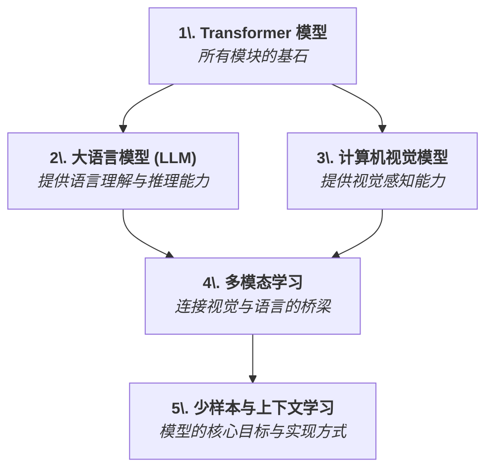
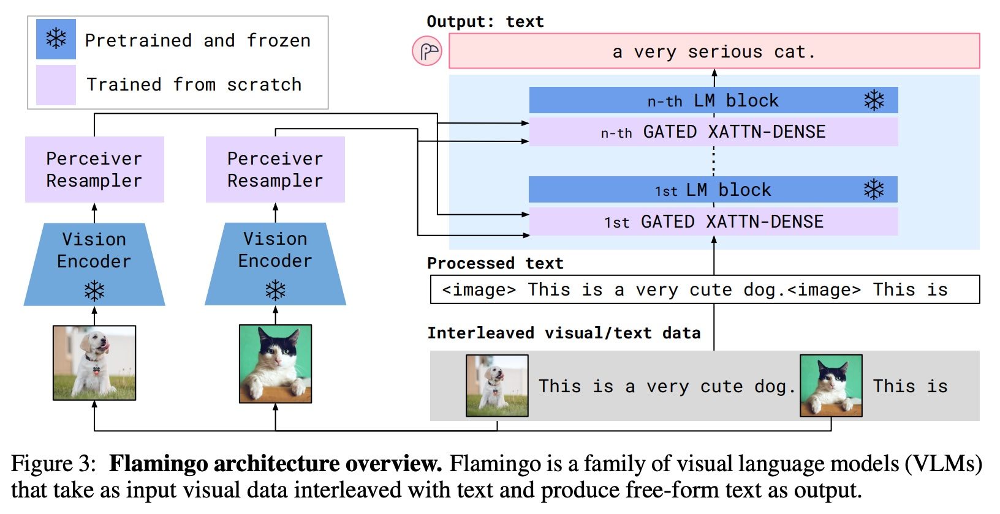
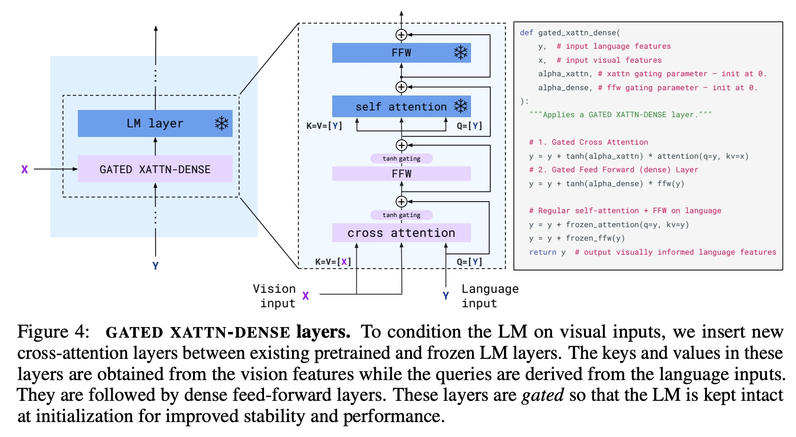
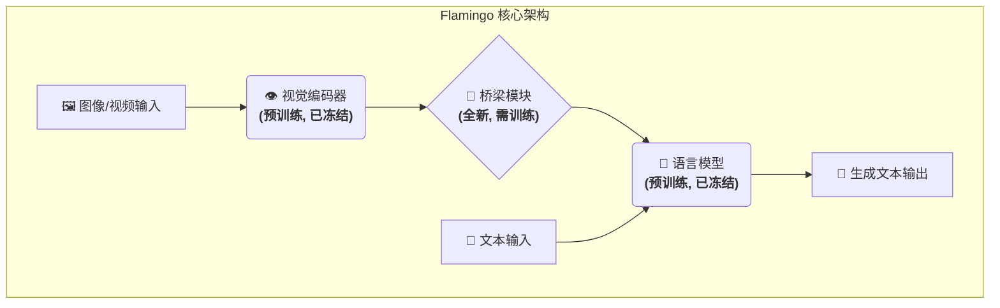
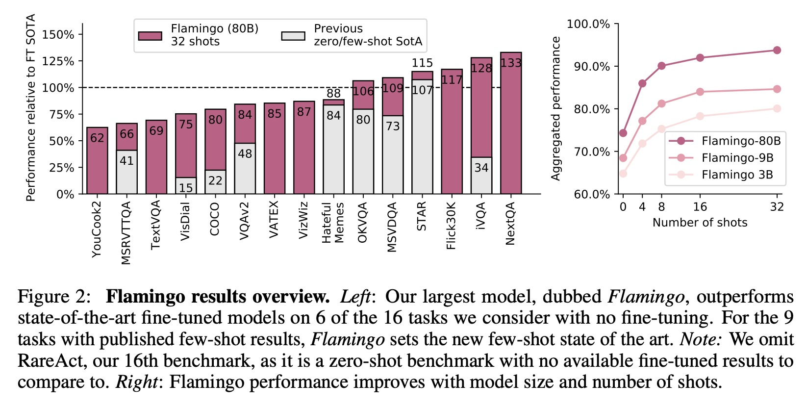
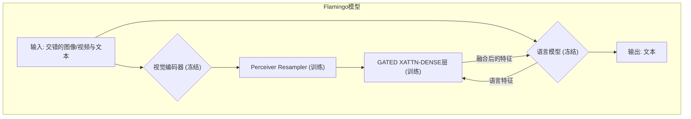

## AI论文解读 | Flamingo: a Visual Language Model for Few-Shot Learning
        
### 作者        
digoal        
        
### 日期        
2025-08-30        
        
### 标签        
PostgreSQL , PolarDB , DuckDB , AI , 论文解读        
        
----        
        
## 背景  
      
https://arxiv.org/pdf/2204.14198        
  
提示:          
```          
读懂《Flamingo: a Visual Language Model for Few-Shot Learning》这篇论文需要提前掌握哪些基础知识, 请使用中文通熟易懂的讲解这些基础知识, 可以引用论文中的图、表或使用Markdown支持的图形(text,mermaid等)增加解释性. 
  
使用中文通熟易懂的解读《Flamingo: a Visual Language Model for Few-Shot Learning》这篇论文, 其中的关键内容请着重讲解, 可以引用论文中的图、表或使用Markdown支持的图形(text,mermaid等)增加解释性. 
  
提取《Flamingo: a Visual Language Model for Few-Shot Learning》这篇论文中的重要术语, 使用中文对这些术语进行通熟易懂的讲解, 可以引用论文中的图、表或使用Markdown支持的图形(text,mermaid等)增加解释性. 
```     
  
## 1 前置知识 
  
好的，为了完全理解《Flamingo》这篇论文，你需要对深度学习，特别是自然语言处理（NLP）和计算机视觉（CV）领域的一些核心概念有扎实的了解。下面我将用通俗易懂的中文，结合论文中的图表，为你讲解这些必备的基础知识。

### 核心知识地图

要读懂 Flamingo，我们可以把所需知识分为五个关键模块。它们就像拼图的五个部分，组合在一起就构成了 Flamingo 的完整图像。



-----

### 1\. Transformer 模型：一切的基础

Transformer 是近年来深度学习领域最具革命性的模型结构，它完全基于一种叫做 **“自注意力机制” (Self-Attention)** 的理念。

  * **核心思想**：当我们处理一个句子时，每个词的重要性并不是均等的。为了理解当前词的含义，模型需要“关注”句子中其他相关的词。例如，在“一只黑色的猫在追逐一只白色的老鼠”这句话里，要理解“追逐”，模型需要同时关注“猫”和“老鼠”。
  * **为什么重要**：自注意力机制使得模型能够捕捉长距离的依赖关系，并且可以高效地并行计算，远超之前的循环神经网络（RNN）。
  * **与 Flamingo 的关系**：Flamingo 的语言模型部分和视觉处理部分都深度依赖于 Transformer 架构 。不理解 Transformer，就无法理解 Flamingo 内部的信息流动方式。

-----

### 2\. 大语言模型 (Large Language Models, LLMs)：赋予模型“大脑”

LLM 是指在海量文本数据上预训练的、参数规模巨大的 Transformer 模型，例如 GPT-3、Chinchilla 等。

  * **核心能力**：它们通过学习预测文本中的下一个词，从而获得了强大的语言生成、理解和一定程度的推理能力 。
  * **关键概念：预训练 (Pre-training) 与冻结 (Freezing)**
      * **预训练**：在一个通用的、巨大的数据集上进行训练，让模型学习到普适的知识。这非常耗时耗力。
      * **冻结**：在构建新模型时，直接利用已经预训练好的模型权重，并且在训练新任务时**保持这些权重不变**。
  * **与 Flamingo 的关系**：Flamingo 的一个巧妙之处在于，它并没有从零开始训练一个语言模型，而是直接采用了已经非常强大的、**预训练好且被冻结的** Chinchilla 语言模型 。这样做的好处是：
    1.  **继承能力**：直接获得了顶级 LLM 的语言和推理能力。
    2.  **防止“灾难性遗忘”**：避免在学习新的视觉任务时，破坏掉已经学到的宝贵语言知识 。
    3.  **训练高效**：只需训练新加入的“桥梁”部分，大大减少了计算开销。

在论文的图3中，蓝色的 `LM block` 就代表被“冻结”的预训练大语言模型部分 。   

*图 3 节选：标有雪花❄️的蓝色模块（如 Vision Encoder 和 LM block）代表它们是“预训练并冻结的” 。*

-----

### 3\. 计算机视觉模型：赋予模型“眼睛”

为了让模型理解图像，需要一个能将图像像素转换为机器可以理解的数字特征（即特征向量）的模块。这个模块通常被称为 **视觉编码器 (Vision Encoder)**。

  * **核心任务**：从图像或视频帧中提取关键的视觉信息。
  * **训练方式：对比学习 (Contrastive Learning)**
      * 这是一种强大的自监督学习方法。模型会同时看到大量的（图片，文字描述）配对数据。
      * 学习目标是：让匹配的图片和文字在特征空间中尽可能“靠近”，不匹配的则尽可能“远离”。通过这种方式，模型学会了将视觉内容与语义概念相关联。
  * **与 Flamingo 的关系**：Flamingo 同样使用了一个**预训练并冻结的**视觉编码器（一个名为 NFNet 的模型） 。这个编码器通过对比学习进行了预训练，因此它已经具备了强大的视觉识别能力 。

-----

### 4\. 多模态学习：搭建视觉与语言的桥梁

这是 Flamingo 的核心创新所在。它如何让被冻结的“眼睛”（Vision Encoder）和被冻结的“大脑”（LLM）协同工作？Flamingo 设计了两个关键的、需要从头训练的“桥梁”模块（在图3中用紫色表示 ）。   

  * **模块一：Perceiver Resampler (感知器重采样器)**

      * **问题**：视觉编码器输出的特征数量庞大且随图片尺寸变化，直接输入给语言模型会造成巨大的计算负担 。
      * **解决方案**：Perceiver Resampler 像一个“信息压缩器”，它从大量的视觉特征中提取出固定数量的、最具代表性的几个“视觉令牌” (visual tokens) 。这极大地降低了后续处理的复杂度。
      * 你可以把它理解为：看完一张高清大图后，用几个关键的词语（视觉令牌）来概括图片的核心内容。

  * **模块二：Gated Cross-Attention (门控交叉注意力)**

      * **问题**：如何将这些“视觉令牌”注入到冻结的语言模型中，让其在生成文本时能够“看到”图片内容？
      * **解决方案**：在语言模型的各层之间，插入新的、可训练的“门控交叉注意力”层 。
      * **交叉注意力 (Cross-Attention)**：允许语言模型在处理文本时，去“关注”和查询视觉令牌，从而将视觉信息融入到文本生成过程中。
      * **门控 (Gated)**：这是一个精巧的设计。在训练初期，这个“门”是关闭的，视觉信息无法流入，模型就等同于原始的 LLM，保证了训练的稳定性。随着训练的进行，这个“门”会慢慢打开，让视觉信息平滑地融入进来 。

论文的 **图4** 详细展示了 `GATED XATTN-DENSE` 层的内部结构。   
*图 4：展示了新插入的紫色模块（Gated Cross-Attention）如何从视觉输入（X）和语言输入（Y）中获取信息，并将其整合到冻结的蓝色 LM 层中 。*

-----

### 5\. 少样本学习 (Few-Shot Learning) 与 上下文学习 (In-Context Learning)

这是 Flamingo 要实现的核心目标：模型仅通过“看”几个例子，就能学会一个新的任务，而无需重新训练。

  * **少样本学习 (Few-Shot Learning)**：用极少量的标注样本（比如少于32个）来学习任务。
  * **上下文学习 (In-Context Learning)**：这是一种特殊的少样本学习方式，也是 Flamingo 所采用的方式。它不是通过梯度下降来更新模型参数，而是直接将“例子”作为输入提示 (Prompt) 的一部分，喂给模型 。模型通过理解上下文中的示例格式，来模仿并完成新的查询。

论文的 **图1** 是对上下文学习最直观的展示。   
*图 1：展示了 Flamingo 如何通过少样本提示来工作 。*

  * **以第一行为例** ：
    1.  **输入提示 (Input Prompt)**: 研究人员先给模型看一张龙猫图片，并告诉它：“这是一只龙猫。它们主要在智利被发现。” 。
    2.  接着，又给模型看一张柴犬图片，告诉它：“这是一只柴犬。它们在日本很受欢迎。” 。
    3.  最后，研究人员只给模型看一张火烈鸟的图片，并给出提示：“这是” 。
    4.  **模型补全 (Completion)**: Flamingo 理解了上下文的模式（识别动物并介绍），于是它生成了：“一只火烈鸟。它们在加勒比海和南美洲被发现。” 。

整个过程中，模型的权重**没有发生任何改变**。它仅仅通过“上下文”就学会了如何执行“看图说话”这个新任务。Flamingo 的强大之处在于，它能处理这种图文交错的复杂上下文 。

### 总结

掌握了以上五个方面的知识后，你就可以轻松地理解 Flamingo 的工作了：

它巧妙地将一个**冻结的视觉模型**和一个**冻结的大语言模型**通过精心设计的**桥梁模块 (Perceiver Resampler + Gated Cross-Attention)** 连接起来，使得模型能够处理图文交错的输入，并通过**上下文学习**的方式，在只有极少量样本的情况下，就能出色地完成各种新的视觉语言任务。
  
## 2 解读论文 
  
好的，我们来一起用通俗易懂的方式解读一下《Flamingo》这篇重要的多模态论文。

### **Flamingo 论文解读：让AI学会“看图举一反三”**

想象一下，你教一个孩子认识新事物。你可能只需要指着几张不同的图片告诉他：“这是猫，那是狗”，很快，他就能认识新的猫和狗，甚至还能描述它们。传统的AI模型往往需要成千上万张标注好的图片才能学会，而《Flamingo》这篇论文的核心目标，就是**让AI模型具备这种“举一反三”（即少样本学习）的能力，只需看几个例子，就能学会新的视觉任务** 。

Flamingo是一个**视觉语言模型 (Visual Language Model, VLM)** ，它能像处理纯文本一样，处理图文并茂的输入，并生成相应的文字回答 。

-----

### **核心思想：嫁接“强大的眼睛”和“智慧的大脑”**

Flamingo最巧妙的设计思想是“**强强联合，只造桥梁**”。它没有从零开始训练一个庞大的模型，而是利用了两个已经非常强大的预训练模型：

1.  **强大的眼睛 (Vision Encoder)**：一个经过预训练的、专门用来理解图像的模型 。它的任务是把图片转换成计算机能理解的数字特征。
2.  **智慧的大脑 (Language Model)**：一个大规模的、预训练好的语言模型（论文中使用了DeepMind的Chinchilla模型）。它拥有强大的文本理解、推理和生成能力。

关键在于，Flamingo在训练时将这两个模型 **“冻结” (frozen)** ，即不改变它们原有的参数 。这样做的好处是完整地保留了它们强大的“视觉能力”和“语言能力”，避免了在学习新知识时忘记旧知识的“灾难性遗忘”问题 。

Flamingo团队的核心工作，就是设计高效的“**桥梁**”结构，将“眼睛”看到的信息，无缝地传递给“大脑”进行思考和回答 。



-----

### **两大关键技术：“桥梁”是如何搭建的？**

这个连接“眼睛”和“大脑”的桥梁由两个核心技术组成，都非常精妙。

#### **1. Perceiver Resampler (感知器重采样器)：高效的视觉信息压缩器**

  * **问题**：一张高分辨率图片或一段视频包含巨量的信息。如果把这些信息一股脑全丢给语言模型，计算量会爆炸，模型也难以处理 。
  * **解决方案**：Perceiver Resampler模块就像一个高效的“信息摘要”工具。它会从视觉编码器输出的海量视觉特征中，**提取出固定数量的、最重要的几个“视觉令牌” (visual tokens)** 。
  * **好处**：无论输入是多大的图片还是多长的视频，最终都只输出固定数量（如64个）的视觉令牌 。这大大降低了后续语言模型处理视觉信息的计算负担，非常高效 。

你可以将它想象成，你看完一部电影后，不是复述每一帧画面，而是用几个关键场景（视觉令牌）来向朋友概括整部电影。   

*论文图3展示了整体架构，左侧的 `Vision Encoder` 将图片处理后，交由 `Perceiver Resampler` 生成视觉令牌，再送入右侧的语言模型中 。*

#### **2. Gated Cross-Attention (门控交叉注意力)：将视觉信息注入语言模型**

  * **问题**：现在有了浓缩的“视觉令牌”，如何让语言模型在生成文字时“参考”这些视觉信息呢？
  * **解决方案**：研究人员在“冻结”的语言模型层与层之间，插入了新的、可训练的“门控交叉注意力”层 。
      * **交叉注意力 (Cross-Attention)**：允许语言模型在处理每个文本词元时，回头去“看一看”相关的视觉令牌，从而让生成的文字与图片内容保持一致 。
      * **门控 (Gated)**：这是一个非常聪明的稳定训练技巧。在训练刚开始时，这个“门”是关上的，视觉信息流不进去，模型表现和原来的语言模型一样 。随着训练的进行，“门”会逐渐打开，让视觉信息平滑地融入，避免了模型在初期“胡言乱语”，从而提升了最终性能和稳定性 。

  

*论文图4详细描绘了这一结构。语言信息作为查询(Q)，视觉信息作为键(K)和值(V)，通过交叉注意力机制，将视觉信息融入语言处理流程中 。*

-----

### **核心能力：强大的上下文少样本学习 (In-Context Few-Shot Learning)**

Flamingo最令人惊艳的能力，就是它能通过“上下文学习”来快速适应新任务 。用户不需要为新任务重新训练模型，只需要在**输入提示 (Prompt)** 中给出几个例子即可。

这在论文的图1中得到了完美的展示：   

*论文图1展示了多种任务下的少样本学习能力 。*

  * **看图识别** (第1行):

      * **例子1**: 输入\<龙猫图片\>，并附上文字“这是一只龙猫...”。
      * **例子2**: 输入\<柴犬图片\>，并附上文字“这是一只柴犬...”。
      * **提问**: 输入\<火烈鸟图片\>，附上文字“这是”。
      * **回答**: 模型理解了上下文的模式，自动补全“a flamingo. They are found in the Caribbean and South America.”（一只火烈鸟。它们被发现于加勒比和南美洲）。

  * **视觉问答 (VQA)** (第2行):

      * 通过给出几个“图片-问题-答案”的例子，模型就能学会回答关于新图片的问题，比如画作的名称或地点 。

  * **多模态对话** (底部):

      * 模型甚至可以进行连续的、图文并茂的对话 。用户可以发一张图片，问一个问题，然后基于模型的回答继续追问，模型能够持续理解对话的上下文和新出现的图片。

这种能力的关键在于Flamingo可以处理**任意交错的视觉和文本序列** ，这是它与之前许多模型的重要区别。

-----

### **性能表现：超越微调模型，树立新标杆**

Flamingo的性能非常出色。论文中的图2展示了其与当时最先进（SOTA）模型的对比结果。   

*论文图2展示了Flamingo在多个基准测试上的性能 。*

  * **左图**: 在16个公开基准测试中，Flamingo仅用32个样本（32-shot），就在其中6个任务上**超越了为该任务专门进行大量数据微调 (Fine-tuned) 的SOTA模型** 。这意味着Flamingo用极少的数据就达到了比“题海战术”更好的效果。
  * **右图**: 模型的性能随着模型规模（参数量）的增大和样本数量（Number of shots）的增多而提升 。这表明模型越大、见过的例子越多，学得越好，这与大语言模型的发展趋势一致 。

### **总结**

《Flamingo》这篇论文的贡献是里程碑式的，它展示了一条构建通用多模态AI的有效路径：

1.  **复用已有成果**：通过冻结强大的预训练视觉和语言模型，节约了巨大的计算资源，并继承了它们的卓越能力 。
2.  **专注高效连接**：设计的Perceiver Resampler和Gated Cross-Attention模块成功地在冻结的模型之间建立了高效、稳定的信息桥梁 。
3.  **实现灵活学习**：赋予了模型处理任意图文交错序列的能力，使其能够通过上下文学习，用极少的样本快速适应各种开放式或封闭式的视觉语言任务，在多个 benchmarks 上取得了当时的最佳（SOTA）少样本学习成绩 。

简而言之，Flamingo证明了，只要连接方式得当，我们就能让AI像人类一样，通过看几个例子就掌握新技能，向更通用的AI迈出了坚实的一步。
  
## 3 术语 
  
好的，这是从《Flamingo：一种用于少样本学习的视觉语言模型》这篇论文中提取的关键术语，并为您提供通俗易懂的中文讲解。

### 1\. 视觉语言模型 (Visual Language Models, VLM)

**讲解:**
视觉语言模型（VLM）是一种能够同时理解图像/视频和文本的人工智能模型 。想象一下，你可以给一个AI看一张图片，然后问它“这只狗在做什么？”，它不仅能“看到”图片，还能用流畅的语言“回答”你的问题。Flamingo就是这样一种强大的VLM，它能够处理任意交错的视觉和文本信息，并生成相应的文本输出 。

### 2\. 少样本学习 (Few-Shot Learning) / 情境学习 (In-context Learning)

**讲解:**
少样本学习是指让模型在只“学习”了极少量（比如几个或几十个）新任务的标注样本后，就能快速适应并执行该任务的能力 。这极大地模仿了人类的学习方式——我们通常不需要成千上万个例子才能学会一个新概念。

Flamingo通过“情境学习”来实现这一点：我们只需要在输入中提供几个“问题-答案”的范例，模型就能举一反三，解决新的、类似的问题 。

**示例 (参考论文图 1):**

  

如下图所示，为了让模型识别并描述火烈鸟，我们先给它看了两个例子：

1.  **输入图片 (山猫)** -\> **输出描述:** “这是一只山猫。它们主要在智利被发现。” 
2.  **输入图片 (柴犬)** -\> **输出描述:** “这是一只柴犬。它们在日本很受欢迎。” 

然后，当我们给它一张新的**火烈鸟图片**并提示“这是”时，模型就能基于前面的例子，自动补完描述：“一只火烈鸟。它们在加勒比海和南美洲被发现。” 。

```text
+-------------------+      +-------------------+      +-----------------+
|   [山猫图片]      |       |   [柴犬图片]       |      |  [火烈鸟图片]     |
| "这是一只山猫..."  | ---> | "这是一只柴犬..."   | --->  |  "这是一..."    |
+-------------------+      +-------------------+      +-----------------+
      范例1                    范例2                      待解决的问题

                                                            |
                                                            V
                                                 +---------------------+
                                                 | 模型输出:            |
                                                 | "一只火烈鸟..."      |
                                                 +---------------------+
```

### 3\. Interleaved Visual/Text Data (交错的视觉/文本数据)

**讲解:**
这是Flamingo训练数据的核心特点。传统的图文数据通常是一张图片对应一段描述。而“交错数据”指的是文本和图像在同一个文档流中自然地混合在一起，就像我们浏览的网页一样，一段文字后可能跟着一张图片，然后又是一段文字 。

通过在這種包含4300万网页的大规模`M3W`数据集上训练，Flamingo学会了理解上下文，并将视觉信息无缝地融入到其语言理解和生成过程中 。

### 4\. Frozen Models (冻结的预训练模型)

**讲解:**
“冻结”在机器学习中意味着在训练过程中保持模型的某些部分参数不变。Flamingo的一个关键创新是它没有从零开始训练一个巨大的模型，而是巧妙地“嫁接”了两个已经非常强大的预训练模型，并将它们大部分“冻结”起来 ：

  * **冻结的视觉编码器 (Vision Encoder):** 一个强大的、预训练好的图像识别模型（如NFNet），负责从图像或视频中提取视觉特征 。它的任务是“看懂”图像。
  * **冻结的语言模型 (Language Model, LM):** 一个大规模的、预训练好的语言模型（如Chinchilla），负责处理文本和进行逻辑推理 。它的任务是“理解和生成”语言。

这样做的好处是巨大的：

1.  **节省计算资源:** 无需重新训练这两个大模型，大大降低了成本 。
2.  **防止灾难性遗忘 (Catastrophic Forgetting):** 保证了语言模型不会在学习处理图像的过程中，忘记其原有的强大语言能力 。

### 5\. Perceiver Resampler (感知器重采样器)

**讲解:**
这是连接“冻结的视觉编码器”和“冻结的语言模型”的第一个关键桥梁。

  * **作用:** 无论输入的图像分辨率多大，或者视频有多少帧，视觉编码器都会产生大量的视觉特征。Perceiver Resampler能将这些数量不固定的特征，高效地压缩成一个固定数量的、更精炼的“视觉令牌” (visual tokens) 。
  * **好处:** 这大大降低了后续处理的计算复杂度，使得语言模型可以更轻松地“消化”这些视觉信息 。

可以把它想象成一个高效的“视觉信息摘要生成器”。

### 6\. GATED XATTN-DENSE (门控交叉注意-稠密层)

**讲解:**
这是连接视觉信息和语言模型的第二个，也是更深层次的桥梁。

  * **作用:** 这些特殊设计的、从零开始训练的层被巧妙地插入到“冻结的语言模型”的各个层之间 。它们允许语言模型在处理每个文本词元时，都能“回头看一眼”由Perceiver Resampler生成的视觉令牌。
  * **门控 (Gated) 机制:** 这里的“门控”非常关键。在训练初期，这个“门”是关闭的（通过一个初始化为0的参数控制），使得视觉信息不会干扰到语言模型原有的稳定状态。随着训练的进行，这个“门”会逐渐打开，让视觉信息平稳地融入，从而保证了训练的稳定性和最终性能 。

**整体架构流程图 (简化版，参考论文图3):**

  



如上图所示，视觉信息（图像/视频）和文本信息分别进入两条路径。视觉信息经过**视觉编码器**和**Perceiver Resampler**处理后，通过**GATED XATTN-DENSE层**与**语言模型**的内部状态进行融合，最终生成文本输出。其中核心的视觉编码器和语言模型是**冻结**的，只训练连接它们的“桥梁”部分。

这些术语共同构成了Flamingo模型的核心，使其在几乎不进行任何任务特定微调的情况下，仅通过少量样本就能在16个不同的多模态任务上达到或超越当时最先进的水平 。
  
## 参考        
         
https://arxiv.org/pdf/2204.14198    
        
<b> 以上内容基于DeepSeek、Qwen、Gemini及诸多AI生成, 轻微人工调整, 感谢杭州深度求索人工智能、阿里云、Google等公司. </b>        
        
<b> AI 生成的内容请自行辨别正确性, 当然也多了些许踩坑的乐趣, 毕竟冒险是每个男人的天性.  </b>        
  
  
  
#### [期望 PostgreSQL|开源PolarDB 增加什么功能?](https://github.com/digoal/blog/issues/76 "269ac3d1c492e938c0191101c7238216")
  
  
#### [PolarDB 开源数据库](https://openpolardb.com/home "57258f76c37864c6e6d23383d05714ea")
  
  
#### [PolarDB 学习图谱](https://www.aliyun.com/database/openpolardb/activity "8642f60e04ed0c814bf9cb9677976bd4")
  
  
#### [PostgreSQL 解决方案集合](../201706/20170601_02.md "40cff096e9ed7122c512b35d8561d9c8")
  
  
#### [德哥 / digoal's Github - 公益是一辈子的事.](https://github.com/digoal/blog/blob/master/README.md "22709685feb7cab07d30f30387f0a9ae")
  
  
#### [About 德哥](https://github.com/digoal/blog/blob/master/me/readme.md "a37735981e7704886ffd590565582dd0")
  
  

  
