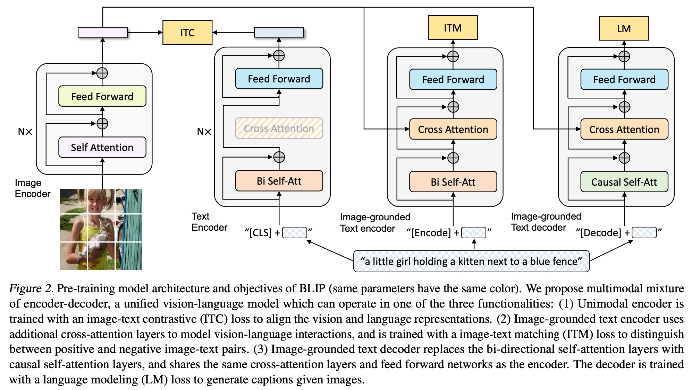
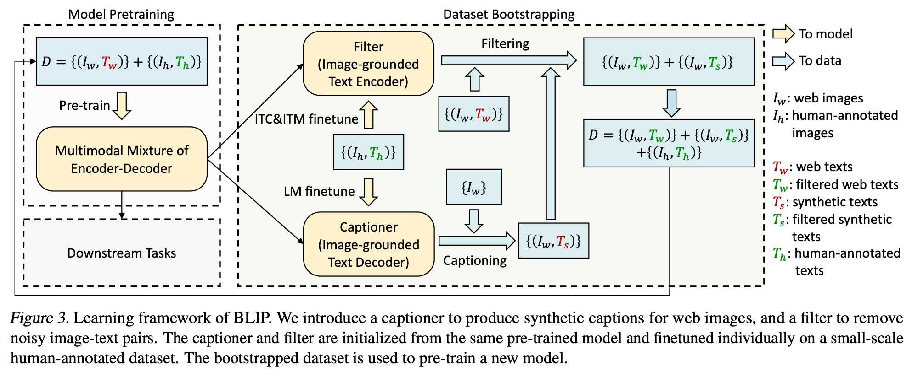
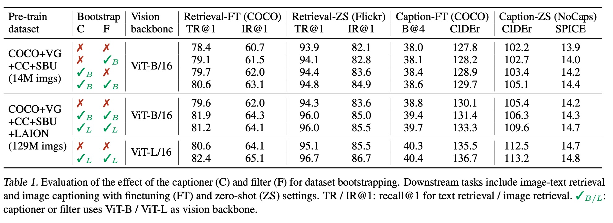

## AI论文解读 | BLIP: Bootstrapping Language-Image Pre-training for Unified Vision-Language Understanding and Generation
        
### 作者        
digoal        
        
### 日期        
2025-08-30        
        
### 标签        
PostgreSQL , PolarDB , DuckDB , AI , 论文解读        
        
----        
        
## 背景  
      
https://arxiv.org/pdf/2201.12086        
  
提示:          
```          
读懂《BLIP: Bootstrapping Language-Image Pre-training for Unified Vision-Language Understanding and Generation》这篇论文需要提前掌握哪些基础知识, 请使用中文通熟易懂的讲解这些基础知识, 可以引用论文中的图、表或使用Markdown支持的图形(text,mermaid等)增加解释性. 
  
使用中文通熟易懂的解读《BLIP: Bootstrapping Language-Image Pre-training for Unified Vision-Language Understanding and Generation》这篇论文, 其中的关键内容请着重讲解, 可以引用论文中的图、表或使用Markdown支持的图形(text,mermaid等)增加解释性. 
  
提取《BLIP: Bootstrapping Language-Image Pre-training for Unified Vision-Language Understanding and Generation》这篇论文中的重要术语, 使用中文对这些术语进行通熟易懂的讲解, 可以引用论文中的图、表或使用Markdown支持的图形(text,mermaid等)增加解释性. 
```     
  
## 1 前置知识 
  
好的，为了完全理解《BLIP: Bootstrapping Language-Image Pre-training for Unified Vision-Language Understanding and Generation》这篇论文，你需要掌握以下几个核心的基础知识。我会用通俗易懂的语言，并结合论文中的图示来解释它们。

### 1\. 什么是“视觉语言预训练” (Vision-Language Pre-training, VLP)？

想象一下我们教一个孩子看图说话。我们不会只教他“这是一只猫”，然后又单独教他认字“猫”。我们会把一张猫的图片和“猫”这个词联系起来，让他同时理解图像和文字的关联。

**视觉语言预训练 (VLP)** 就是在做类似的事情，不过是针对AI模型。它的核心思想是：

  * **目标**：训练一个通用的大模型，让它能同时理解图片和与图片相关的文字描述。
  * **方法**：给模型“喂”海量的图片-文本对（例如，一张海滩的图片和它的描述“阳光下的沙滩和蓝色的大海”）。模型通过学习这些数据，就能掌握视觉信息和语言信息之间的对应关系。
  * **价值**：这个预训练好的模型就像一个掌握了“看图说话”基础能力的“大脑”，可以被微调（fine-tune）去完成各种更具体的任务，例如：
      * **图像检索**：输入一句话，找到最匹配的图片。
      * **图片配文 (Image Captioning)**：输入一张图，生成一句描述。
      * **视觉问答 (VQA)**：输入一张图和一个问题，模型给出答案。

论文中提到，现有VLP模型的一大挑战是数据来源——它们大多使用从网上爬取的图片和文本，但这些文本质量参差不齐，充满了“噪声”（比如一张城堡的图片，网页上的文字却是“我在奥地利的旅行照片” ），这会误导模型的学习。BLIP的核心贡献之一就是为了解决这个数据噪声问题。

### 2\. “Transformer”是什么？它是如何工作的？

Transformer是近年来AI领域（尤其是自然语言处理和计算机视觉）最核心、最基础的模型架构。你可以把它理解为一种非常强大的信息处理器。

它的“独门绝技”是 **自注意力机制 (Self-Attention)**。

  * **通俗理解**：当你在阅读一句话时，比如“小猫在追赶一个滚动的红色的毛线球”，为了理解“它”（如果后面有这个词），你的大脑会自动关注到“毛线球”这个词。自注意力机制就是模拟这个过程，它能计算一句话中每个词对于其他所有词的“重要性”或“关联度”。

**核心架构**：一个Transformer模块通常由一个自注意力层和一个前馈神经网络层组成。模型通过堆叠多个这样的模块来深度处理信息。


Transformer基础模块示意图

BLIP的整个模型架构都是基于Transformer构建的。

### 3\. 理解VLP领域的几种核心模型架构

基于Transformer，VLP领域主要有两类模型架构，BLIP则巧妙地将它们融合了。

#### A. 编码器 (Encoder) 架构

  * **代表作**：BERT (用于文本)、ViT (Vision Transformer, 用于图像)。
  * **工作方式**：像一个阅读理解高手，它可以同时看到全部输入信息（比如整句话或整张图的所有图块），然后深入理解它们，并输出一个包含丰富信息的“特征表示”。它擅长**理解型**任务。
  * **ViT 的原理**：ViT的创新之处在于，它把一张图片切成很多个小方块（patches），然后把这些小方块当作一个个“单词”输入到Transformer编码器里。这样，处理文本的强大模型就可以用来理解图像了。论文图2左侧的“Image Encoder”就是ViT 。   

#### B. 编码器-解码器 (Encoder-Decoder) 架构

  * **工作方式**：像一个翻译家。编码器（Encoder）先完整地阅读并理解源信息（例如一张图片），然后解码器（Decoder）根据编码器的理解，一个词一个词地生成目标文本（例如图片的描述）。它擅长**生成型**任务。

**BLIP的创新之处：MED模型**

之前的模型要么只擅长理解，要么只擅长生成 。BLIP提出的**多模态编码器-解码器混合体 (MED, Multimodal mixture of Encoder-Decoder)**  非常灵活，它可以根据任务需要，切换三种工作模式，而且**大部分参数是共享的** ，非常高效。

我们可以借助论文中的图2来理解这三种模式：   

论文图2: BLIP预训练模型架构和目标

1.  **单模态编码器 (Unimodal Encoder)**：独立地处理图像和文本，用于**图像-文本对比学习 (ITC)** 。
2.  **图像引导的文本编码器 (Image-grounded Text Encoder)**：结合图像和文本信息，判断它们是否匹配，用于**图像-文本匹配 (ITM)** 。
3.  **图像引导的文本解码器 (Image-grounded Text Decoder)**：根据图像信息，生成文本描述，用于**语言模型 (LM)** 。

### 4\. 理解三种核心的“预训练任务” (Pre-training Objectives)

这三种任务是训练BLIP模型的“课程”，让模型学会不同的能力。同样对应图2中的三个分支。

1.  **图像-文本对比学习 (ITC - Image-Text Contrastive Loss)** 

      * **目标**：让模型学会区分“匹配的”和“不匹配的”图文对。
      * **方法**：在同一个表示空间里，把匹配的图文对的特征“拉近”，把不匹配的图文对的特征“推远”。这就像一个配对游戏，让模型把正确的图片和描述放在一起。

2.  **图像-文本匹配 (ITM - Image-Text Matching Loss)** 

      * **目标**：比ITC更精细，它要对一个图文对做出“是/否”匹配的判断。
      * **方法**：将图像特征和文本特征深度融合后，通过一个分类器判断这对图文是正样本（匹配）还是负样本（不匹配）。这能让模型学习到更细粒度的图文对齐关系。

3.  **语言模型 (LM - Language Modeling Loss)** 

      * **目标**：让模型具备“看图说话”的生成能力。
      * **方法**：给定一张图片和一段描述的开头，让模型预测下一个词是什么。通过这种“完形填空”式的训练，模型就学会了如何生成流畅、连贯的句子。

### 5\. 理解BLIP的核心创新：“自举” (Bootstrapping) 和 CapFilt

这是BLIP最关键的贡献，用来解决前面提到的网络数据噪声问题。这个过程被称为 **CapFilt (Captioning and Filtering)** 。

我们可以通过论文中的图3来理解这个流程：   

论文图3: BLIP的学习框架，核心是数据集自举过程

整个过程分为两步，最终目的是创造一个更高质量的数据集。

**第一步：微调两个“专家”模块** 

1.  **微调一个“字幕生成器” (Captioner)**：拿一个预训练好的MED模型，在高质量的人工标注数据集（如COCO）上进行微调，让它专门负责“看图写话”（使用LM任务）。它现在是一个精良的描述生成器。
2.  **微调一个“过滤器” (Filter)**：同样拿一个预训练好的MED模型，在高质量数据集上微调，让它专门负责判断“图文是否匹配”（使用ITC和ITM任务）。它现在是一个严格的质量检查员。

**第二步：清洗和扩充数据集**

1.  **生成 (Captioning)**：让“字幕生成器”为海量的网络图片生成新的、更高质量的**合成描述 (synthetic texts, $T\_s$)** 。
2.  **过滤 (Filtering)**：让“过滤器”对所有的文本进行审查，包括：
      * 原始的网络文本 ( $T\_w$ )
      * 新生成的合成文本 ( $T\_s$ )
        如果过滤器认为文本和图片不匹配，就将其丢弃 。
3.  **组合新数据集**：将通过审查的（原始文本 + 合成文本）和高质量的人工标注文本组合起来，形成一个全新的、更大、更干净的“自举数据集” 。

最后，用这个全新的高质量数据集，从头开始训练一个最终的BLIP模型 。这个过程就像“先培养出优秀的老师（Captioner和Filter），再让老师去筛选和创造出更好的教材，最后用新教材教出最优秀的学生（最终的BLIP模型）”。

-----

**总结一下**，在阅读这篇论文前，你需要掌握的基础知识可以概括为：

  * **基本概念**：了解视觉语言预训练（VLP）的目标和挑战。
  * **核心架构**：理解Transformer，特别是它如何通过ViT处理图像，以及编码器和编码器-解码器架构的区别。
  * **训练方法**：熟悉对比学习（ITC）、匹配分类（ITM）和语言模型（LM）这三种主流的预训练任务。
  * **数据思维**：认识到数据质量的重要性，并理解BLIP是如何通过**生成和过滤（CapFilt）** 这一“自举”策略来创造更好训练数据的。

掌握了这些，你就能轻松地理解BLIP的动机、模型设计、训练方法及其取得卓越成果的原因了。
  
## 2 解读论文 
  
好的，我们来一起用通俗易懂的方式解读一下《BLIP》这篇在视觉语言（Vision-Language）领域非常重要的论文。

### **核心思想：BLIP要解决什么问题？**

在BLIP出现之前，视觉语言模型（VLP）领域面临两大痛点：

1.  **模型不统一（Model Perspective）**：当时的主流模型要么是“理解型”的编码器（Encoder-based），擅长做图像文本检索、分类等任务；要么是“生成型”的编码器-解码器（Encoder-Decoder），擅长做图片配文（Image Captioning）等任务 。很少有模型能同时“精通”这两类任务 。
2.  **数据太嘈杂（Data Perspective）**：为了追求更好的性能，研究者们开始使用从网上爬取的海量图文数据 。但这些网络数据的文本描述质量很差，充满了噪声，比如一张风景照的配文可能是“我的假期留念”，这对于模型学习精确的图文对应关系是有害的 。

**BLIP的目标就是，设计一个统一的框架，既能解决模型不统一的问题，又能有效利用这些嘈杂的网络数据。**

-----

### **BLIP的两大创新**

为了实现上述目标，BLIP提出了两个核心创新点：

1.  **模型层面：多模态编码器-解码器混合体 (MED)**
2.  **数据层面：字幕生成和过滤 (CapFilt)**

接下来我们逐一深入讲解。

#### **1. 模型创新：MED (Multimodal Mixture of Encoder-Decoder)**

MED是一个巧妙且灵活的统一模型架构，它可以根据不同的任务，切换成三种不同的工作模式，同时最大化地共享参数以提高效率 。

我们可以通过论文中的图2来直观理解：   

图2: BLIP预训练模型架构和目标 

MED的三种工作模式分别对应三个预训练任务：

  * **模式一：单模态编码器 (Unimodal Encoder)**

      * **任务**：图像-文本对比学习 (ITC) 。
      * **作用**：分别编码图像和文本，然后计算它们的相似度。目标是让匹配的图文对在特征空间中更接近，不匹配的则相互远离 。这能让模型对图文关系有一个宏观、整体的理解。

  * **模式二：图像引导的文本编码器 (Image-grounded Text Encoder)**

      * **任务**：图像-文本匹配 (ITM) 。
      * **作用**：在文本编码器中加入了“跨注意力层 (Cross Attention)”，使得文本特征在编码时能“看到”图像特征 。然后判断这对图文是否“匹配”。这是一个更精细的任务，迫使模型学习图文之间细粒度的对应关系 。

  * **模式三：图像引导的文本解码器 (Image-grounded Text Decoder)**

      * **任务**：语言模型 (LM) 。
      * **作用**：将模型变成一个生成器。它根据图像信息，以自回归的方式（一个词一个词地）生成文本描述 。这赋予了模型强大的文本生成能力。

> **精妙之处**：这三种模式中的文本编码器和解码器共享了除“自注意力层 (Self-Attention)”外的所有参数 。因为编码需要双向理解上下文，而解码生成需要单向预测未来，这两种需求的核心差异正好体现在自注意力层上 。这种设计既保证了模型的多功能性，又提升了训练效率和多任务学习的效果 。

#### **2. 数据创新：CapFilt (Captioning and Filtering)**

CapFilt是BLIP的“点睛之笔”，它是一种全新的数据集“自举 (Bootstrapping)”方法，旨在清洗并优化嘈杂的网络数据 。

整个流程可以参考论文中的图3：   

图3: BLIP的学习框架，核心是数据集自举过程 

CapFilt分为两个关键模块和一个核心流程：

  * **模块一：字幕生成器 (Captioner)**

      * 它是一个图像引导的文本**解码器** 。
      * 先用预训练好的BLIP模型，在高质量的人工标注数据集（如COCO）上进行微调，让它成为一个专业的“看图写话”专家 。

  * **模块二：过滤器 (Filter)**

      * 它是一个图像引导的文本**编码器** 。
      * 同样用预训练好的BLIP模型，在高质量数据集上微调，让它成为一个判断“图文是否匹配”的专家 。

**核心流程如下**：

1.  **生成 (Captioning)**：对于海量的网络图片( $I\_w$ )，让“字幕生成器”为每张图片生成一条新的、高质量的**合成描述** ( $T\_s$ ) 。
2.  **过滤 (Filtering)**：让“过滤器”对**所有**文本进行审查，包括**原始的网络文本** ( $T\_w$ ) 和新**生成的合成文本** ( $T\_s$ ) 。如果“过滤器”认为文本与图片不匹配，就将其丢弃 。
3.  **重组 (Re-training)**：将过滤后保留下来的图文对与高质量的人工标注数据混合，形成一个全新的、更大、更干净的数据集 。最后，用这个优化过的数据集**从头开始**训练一个最终的BLIP模型 。

这个过程就像是：**先培养出“写作老师(Captioner)”和“审稿老师(Filter)”，然后让他们去批改和重写海量的网络作文，最后用这些精选和重写后的优质作文来教出一个更优秀的学生（最终的BLIP模型）。**

-----

### **实验效果怎么样？**

BLIP通过扎实的实验证明了其方法的有效性。

#### **CapFilt真的有效吗？**

答案是肯定的。从下表可以看出，单独使用Captioner或Filter都能带来提升，而两者结合使用效果最好，并且这种提升在更大的数据集（129M）和更强的模型（ViT-L）上依然有效，证明了其良好的扩展性 。

表1. Captioner (C) 和 Filter (F) 对数据集自举效果的评估    

| Pre-train dataset | Bootstrap C F | Vision backbone | Retrieval-FT (COCO) TR@1 IR@1 | Caption-FT (COCO) CIDEr |
| :--- | :--- | :--- | :--- | :--- |
| 14M imgs | | ViT-B/16 | 78.4 / 60.7 | 127.8 |
| 14M imgs | ✓ | ViT-B/16 | 79.1 / 61.5 | 128.2 |
| 14M imgs | ✓ | ViT-B/16 | 79.7 / 62.0 | 128.9 |
| **14M imgs** | **✓ ✓** | **ViT-B/16** | **80.6 / 63.1** | **129.7** |

#### **为什么生成的文本越“多样”越好？**

研究发现，使用随机性更强的“核采样 (Nucleus sampling)”生成的文本，比确定性的“束搜索 (Beam search)”效果更好 。尽管核采样产生的文本“噪声率”更高（25% vs 19%），但因为它能生成更多样、更有信息量的描述，从而为模型提供了更丰富的知识，效果反而更优 。

#### **下游任务表现**

BLIP在各项下游任务中都取得了当时（state-of-the-art）的顶尖水平，大幅超越了之前的模型 。

  * **图文检索**：在COCO数据集上，使用相同14M数据量，BLIP的平均Recall@1比之前的最佳模型ALBEF高出2.7% 。
  * **图像配文**：在COCO Caption任务上，CIDEr分数达到129.7，大幅领先于同量级数据训练的模型 。
  * **视觉问答 (VQA)**：在VQA 2.0测试集上，准确率比ALBEF高出1.6% 。
  * **零样本视频任务迁移**：BLIP甚至在没有看过任何视频数据的情况下，直接迁移到视频问答和视频检索任务上，也取得了惊人的SOTA效果，展现了其强大的泛化能力 。

### **总结**

《BLIP》这篇论文的核心贡献可以概括为：

1.  **统一而灵活的模型 (MED)**：通过巧妙的参数共享策略，设计了一个能同时胜任理解与生成任务的统一架构。
2.  **创新而有效的数据策略 (CapFilt)**：首次提出通过“生成”与“过滤”相结合的方式，极大地改善了嘈杂网络数据的质量，为视觉语言预训练提供了一种全新的、更优的数据处理范式。

BLIP的成功告诉我们，在视觉语言领域，模型的进步不仅来源于架构的创新，同样也依赖于如何更聪明地利用和优化海量但充满噪声的数据 。
  
## 3 术语 
  
好的，我们来提取并讲解《BLIP》这篇论文中的核心术语。

### 1\. VLP (Vision-Language Pre-training) - 视觉语言预训练

  * **讲解**：这是一种AI模型训练方法，旨在让模型同时理解图像和与之相关的文本 。它通过在海量的“图片-文字”对上进行预先训练，让模型学习到视觉信息和语言信息之间的内在联系 。经过VLP训练的模型，可以被进一步微调，以完成各种具体的下游任务，如看图说话或根据文字找图 。

### 2\. MED (Multimodal Mixture of Encoder-Decoder) - 多模态编码器-解码器混合体

  * **讲解**：这是BLIP提出的新型模型架构，其特点是**统一**和**灵活** 。同一个模型可以根据任务需求，切换成三种不同的工作模式，从而同时胜任理解型和生成型任务 。这三种模式共享大部分参数，从而提升了训练效率 。

    我们可以通过论文中的图2来理解这三种模式：   
    
    图2: BLIP预训练模型架构和目标 

      * **单模态编码器 (Unimodal Encoder)**：分别处理图像和文本，用于计算图文的整体相似度 。
      * **图像引导的文本编码器 (Image-grounded Text Encoder)**：结合图像信息来理解文本，判断图文是否匹配 。
      * **图像引导的文本解码器 (Image-grounded Text Decoder)**：根据图像信息来生成文本描述 。

### 3\. CapFilt (Captioning and Filtering) - 字幕生成和过滤

  * **讲解**：这是BLIP为解决网络数据噪声问题而提出的核心数据处理方法 。它通过“自举 (Bootstrapping)”的方式，为大规模但嘈杂的网络图文数据进行清洗和优化 。

    整个流程如下图3所示，包含两个关键模块 ：   
    
    图3: BLIP的学习框架 

      * **字幕生成器 (Captioner)**：一个经过微调的解码器，负责为网络图片生成新的、高质量的合成描述 ( $T\_s$ ) 。
      * **过滤器 (Filter)**：一个经过微调的编码器，负责判断原始的网络文本 ( $T\_w$ ) 和新生成的合成文本 ( $T\_s$ ) 是否与图片匹配，并剔除不匹配的噪声数据 。

    通过CapFilt处理后的高质量数据集，被用来从头训练一个最终性能更强的BLIP模型 。

### 4\. Pre-training Objectives - 预训练目标/任务

预训练目标是指导MED模型在训练过程中具体学习什么内容的三门“课程”。

#### a. ITC (Image-Text Contrastive Loss) - 图像-文本对比损失

  * **讲解**：这是一个用于对齐图像和文本**整体表示**的任务 。在训练中，模型需要将匹配的图文对在特征空间里“拉近”，同时将不匹配的图文对“推远” 。这个任务由**单模态编码器**完成 。

#### b. ITM (Image-Text Matching Loss) - 图像-文本匹配损失

  * **讲解**：这是一个判断图文**是否精确匹配**的二分类任务 。它会深度融合图像和文本的特征，从而学习到比ITC更细粒度的对应关系 。该任务由**图像引导的文本编码器**完成 。

#### c. LM (Language Modeling Loss) - 语言模型损失

  * **讲解**：这是一个**文本生成**任务 。模型需要根据给定的图像和一段文本的开头，预测下一个最可能的词是什么 。通过这个任务的训练，模型获得了看图说话的能力 。该任务由**图像引导的文本解码器**完成 。

### 5\. Bootstrapping - 自举

  * **讲解**：在BLIP论文的语境中，“自举”特指通过CapFilt机制，利用模型自身（经过微调的Captioner和Filter）来生成和筛选数据，从而创造出一个质量更优、规模更大的新数据集，并用这个新数据集来训练一个全新的、更强的模型的过程 。

    下面的Mermaid图可以简化这个概念：

    ```mermaid
    graph TD;
        A["原始网络数据 (图+噪声文本)"] --> B(Captioner\n生成新文本);
        A --> C{Filter};
        B --> C;
        C -- 保留优质图文对 --> D[高质量自举数据集];
        D --> E(训练最终的BLIP模型);
    ```

    CapFilt自举流程示意图
  
## 参考        
         
https://arxiv.org/pdf/2201.12086    
        
<b> 以上内容基于DeepSeek、Qwen、Gemini及诸多AI生成, 轻微人工调整, 感谢杭州深度求索人工智能、阿里云、Google等公司. </b>        
        
<b> AI 生成的内容请自行辨别正确性, 当然也多了些许踩坑的乐趣, 毕竟冒险是每个男人的天性.  </b>        
  
  
  
#### [期望 PostgreSQL|开源PolarDB 增加什么功能?](https://github.com/digoal/blog/issues/76 "269ac3d1c492e938c0191101c7238216")
  
  
#### [PolarDB 开源数据库](https://openpolardb.com/home "57258f76c37864c6e6d23383d05714ea")
  
  
#### [PolarDB 学习图谱](https://www.aliyun.com/database/openpolardb/activity "8642f60e04ed0c814bf9cb9677976bd4")
  
  
#### [PostgreSQL 解决方案集合](../201706/20170601_02.md "40cff096e9ed7122c512b35d8561d9c8")
  
  
#### [德哥 / digoal's Github - 公益是一辈子的事.](https://github.com/digoal/blog/blob/master/README.md "22709685feb7cab07d30f30387f0a9ae")
  
  
#### [About 德哥](https://github.com/digoal/blog/blob/master/me/readme.md "a37735981e7704886ffd590565582dd0")
  
  

  
