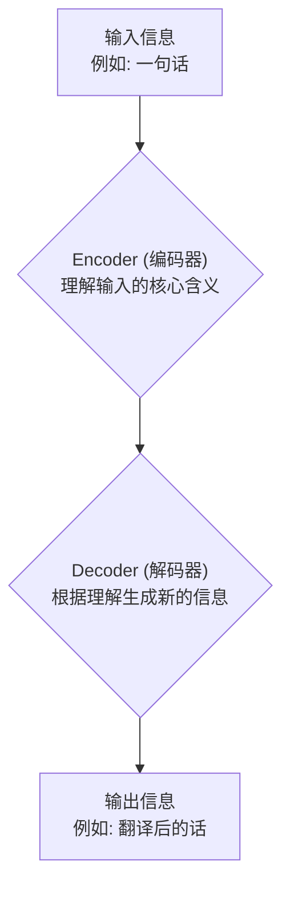
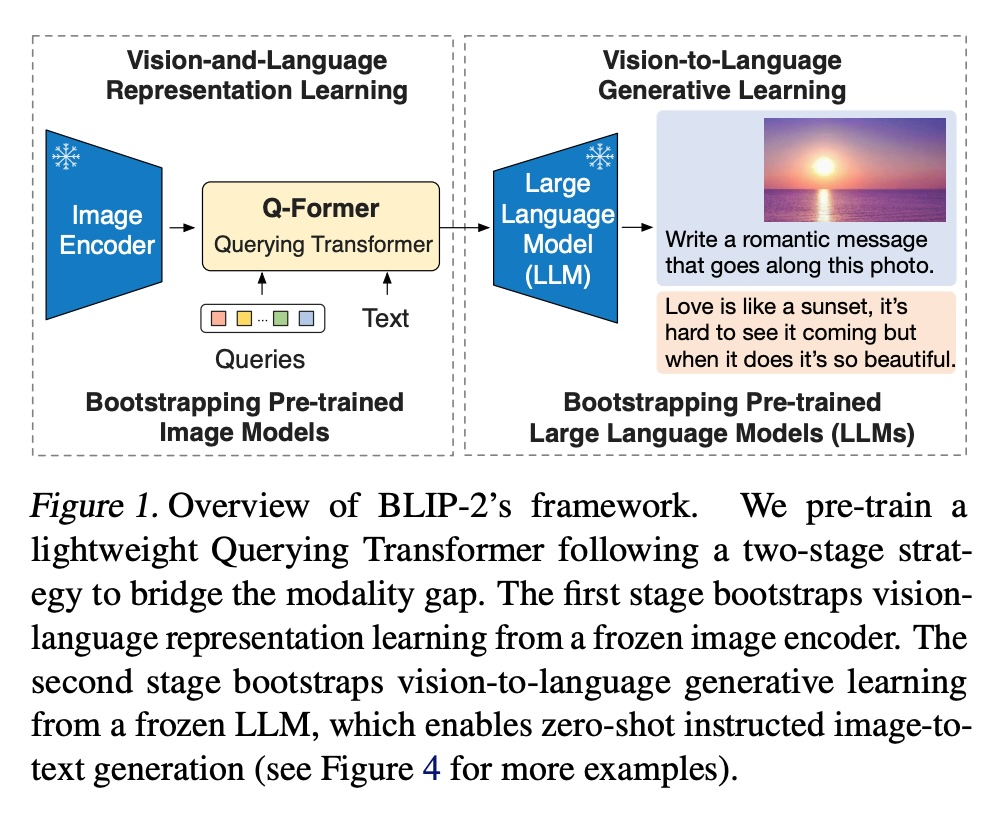
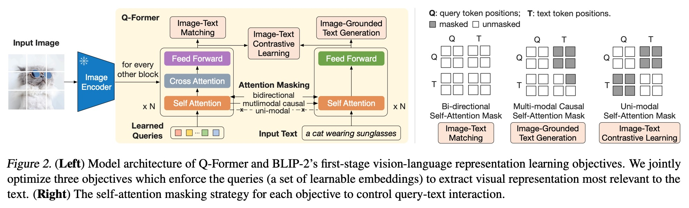
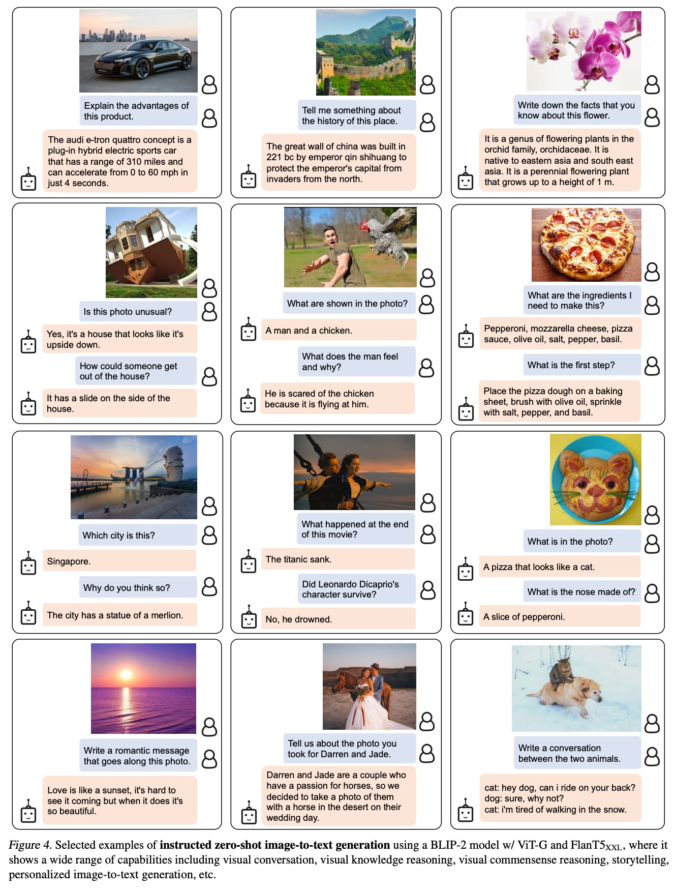
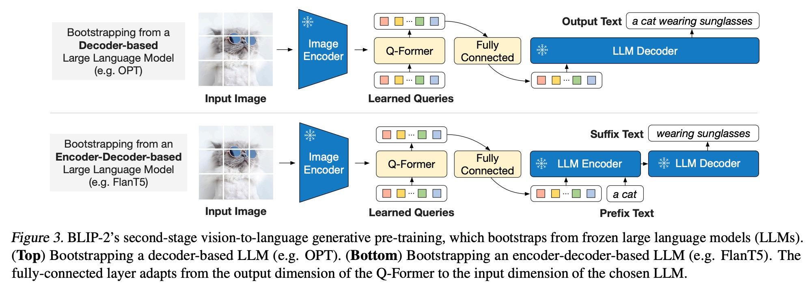
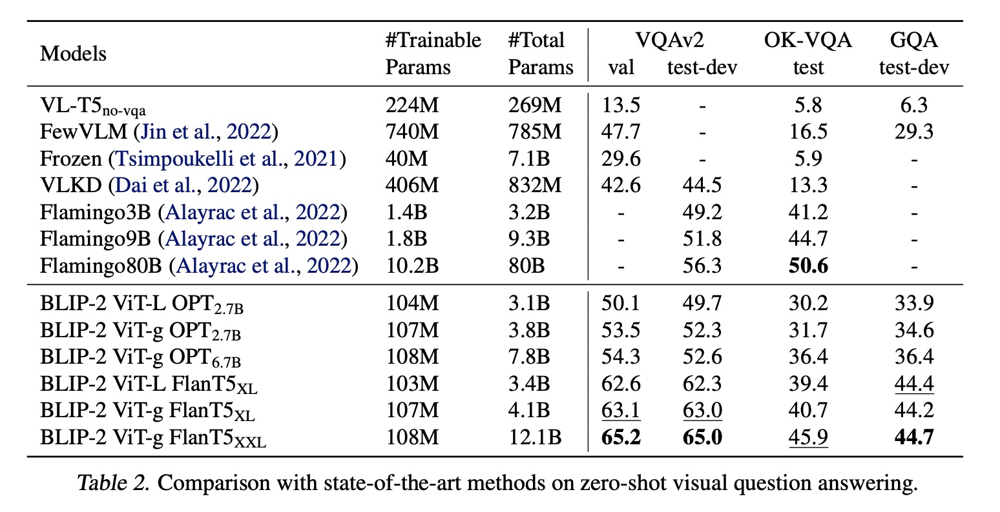
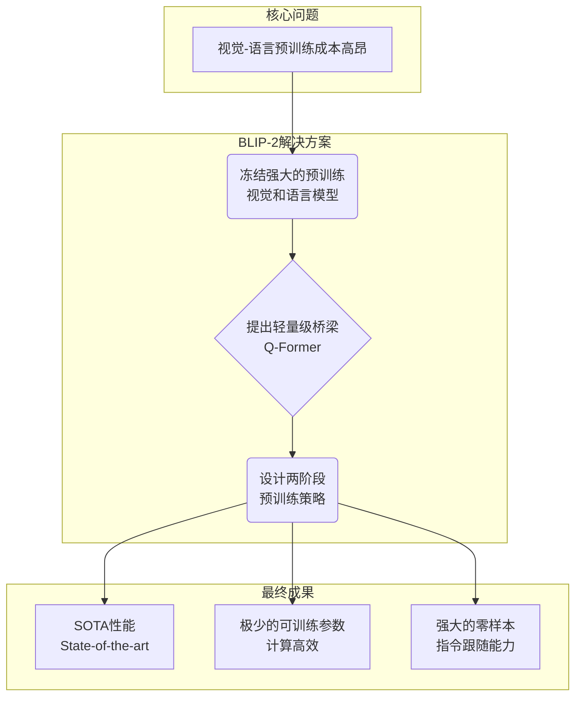

## AI论文解读 | BLIP-2: Bootstrapping Language-Image Pre-training with Frozen Image Encoders and Large Language Models
        
### 作者        
digoal        
        
### 日期        
2025-08-31        
        
### 标签        
PostgreSQL , PolarDB , DuckDB , AI , 论文解读        
        
----        
        
## 背景  
      
https://proceedings.mlr.press/v202/li23q/li23q.pdf        
  
提示:          
```          
读懂《BLIP-2: Bootstrapping Language-Image Pre-training with Frozen Image Encoders and Large Language Models》这篇论文需要提前掌握哪些基础知识, 请使用中文通熟易懂的讲解这些基础知识, 可以引用论文中的图、表或使用Markdown支持的图形(text,mermaid等)增加解释性. 
  
使用中文通熟易懂的解读《BLIP-2: Bootstrapping Language-Image Pre-training with Frozen Image Encoders and Large Language Models》这篇论文, 其中的关键内容请着重讲解, 可以引用论文中的图、表或使用Markdown支持的图形(text,mermaid等)增加解释性. 
  
提取《BLIP-2: Bootstrapping Language-Image Pre-training with Frozen Image Encoders and Large Language Models》这篇论文中的重要术语, 使用中文对这些术语进行通熟易懂的讲解, 可以引用论文中的图、表或使用Markdown支持的图形(text,mermaid等)增加解释性. 
```     
  
## 1 前置知识 
  
好的，为了完全理解《BLIP-2》这篇论文，你需要对深度学习，特别是自然语言处理（NLP）和计算机视觉（CV）领域的一些核心概念有扎实的了解。下面我将用通俗易懂的中文，为你梳理这些必备的基础知识。

### 核心脉络

理解BLIP-2的关键在于明白它的**核心目标**：如何**高效地**让一个擅长“看图”的模型（视觉模型）和一个擅长“读书”的模型（语言模型）协同工作，从而实现看图说话、看图问答等高级任务。

为了实现这个目标，BLIP-2采取了一种“**站在巨人肩膀上**”的策略，它不从头训练一个巨大的模型，而是利用现有的、已经非常强大的视觉模型和语言模型，并用一个巧妙的“**桥梁**”将它们连接起来。

这篇论文的知识点可以分解为以下几个层面：

1.  **基础架构：Transformer**
2.  **“巨人”们：预训练模型（语言大模型LLM和视觉模型ViT）**
3.  **核心策略：冻结模型与模态鸿沟**
4.  **“桥梁”模块：Q-Former**
5.  **训练方法：多任务预训练与零样本学习**

-----

### 1\. 基础架构：Transformer

Transformer是近年来深度学习领域最核心的模型架构，无论是后面要讲的语言模型（LLM）还是视觉模型（ViT），其底层都是Transformer。

  * **它是什么？**
    你可以把它想象成一个极其强大的信息处理工厂。你给它一串数据（比如一句话里的所有词），它能够同时处理这些词，并精准地捕捉到每个词与其他所有词之间的关系和重要性。

  * **核心机制：注意力机制（Attention Mechanism）**
    这是Transformer的精髓。比如在处理句子“小猫在毯子上睡觉”时，注意力机制能让模型在理解“睡觉”这个词时，更多地关注“小猫”，而不是“毯子”。它懂得信息有主次之分。

      * **自注意力（Self-Attention）**: 在**同一个**模态内部（比如只在文本内部），计算各个部分之间的关联性。
      * **交叉注意力（Cross-Attention）**: 用于连接**两个不同**的模态（比如文本和图像），让文本中的词去关注图像中的相关区域。这在BLIP-2中至关重要。

你可以通过下面这个简化的流程图理解Transformer的基本构成：



> **为什么需要懂这个？**
> 因为BLIP-2提出的核心模块**Q-Former**，以及它所连接的**语言大模型（LLM）和视觉模型（ViT）**，本质上都是基于Transformer架构的。不理解Transformer，就无法理解它们的工作原理。

-----

### 2\. “巨人”们：预训练模型（Pre-trained Models）

BLIP-2的创新之处在于它巧妙地利用了“预训练模型”，而不是一切从零开始。

  * **它是什么？**
    预训练模型就像一个已经读完博士、知识渊博的专家。研究人员先用海量的数据（比如整个互联网的文本和图片）对一个巨大的模型进行长时间的训练，这个过程就叫“预训练”。训练好的模型就包含了关于世界的大量通用知识。

  * **BLIP-2用到的两类“专家”：**

    1.  **大型语言模型 (Large Language Models, LLM)**:

          * **作用**: 擅长理解和生成人类语言。
          * **例子**: GPT系列、论文中提到的OPT 、FlanT5 等。
          * **特点**: 你给它一句话，它能写出下一句话；你给它一个问题，它能生成答案。它拥有强大的语言逻辑和世界知识。

    2.  **视觉模型 (Image Encoder)**:

          * **作用**: 擅长“看懂”图片，将图片转化成计算机能理解的数字特征（向量）。
          * **例子**: Vision Transformer (ViT)、CLIP的视觉编码器 。
          * **特点**: 它能识别出图片里有什么物体、场景是怎样的，并提取出关键的视觉信息。

-----

### 3\. 核心策略：冻结模型与模态鸿沟

  * **“冻结” (Frozen) 是什么意思？**
    在BLIP-2的训练过程中，上述两个“专家”（LLM和视觉模型）的内部参数是**固定不变**的，即“冻结” 。这就像是请来了两位专家，但不让他们再学习新知识，只利用他们已有的能力。

      * **好处**: 极大地降低了计算成本 ，并防止模型忘记其原有的强大能力（即“灾难性遗忘” ）。

  * **带来的挑战：模态鸿沟 (Modality Gap)**
    问题来了：一个只懂图像的“视觉专家”和一个只懂语言的“语言专家”，它们之前从未合作过，语言不通，怎么对话？视觉模型输出的是一堆数字（视觉特征），而语言模型需要的是文字信息。这就是“模态鸿沟” 。

    **BLIP-2的核心任务就是解决这个鸿沟。**

-----

### 4\. “桥梁”模块：Q-Former (Querying Transformer)

Q-Former是BLIP-2为了解决“模态鸿沟”而设计的核心模块，它就是那座沟通“视觉专家”和“语言专家”的**智能桥梁** 。

可以参考论文中的这张图来理解它的位置和作用：   

> *图片来源：论文 Figure 1* 

  * **工作原理**:

    1.  **信息提取**: Q-Former  并非直接把庞大的图像信息全部丢给语言模型。相反，它生成一组“**可学习的查询** (Learned Queries)” ，主动去向“视觉专家”（Image Encoder ）提问，只提取与文本最相关的、最精华的视觉信息。
    2.  **信息瓶颈**: 这个过程像一个“信息瓶颈” ，过滤掉了无关的视觉噪音，将复杂的图像信息压缩成一段简短但信息量丰富的“摘要”。
    3.  **语言对齐**: 这份“摘要”的格式是“语言专家”（LLM ）能够理解的，从而成功地将视觉信息转化为了语言信息。

  * **Q-Former的训练方式 (第一阶段)**:
    为了让Q-Former学会如何高效提取信息，论文作者设计了三个任务同时训练它，这在**论文图2**中有详细描绘 。   

    1.  **图像-文本对比学习 (ITC)**: 让匹配的图像和文本在特征空间中更接近，不匹配的则更疏远。就像把正确的图片和图说放在一起。
    2.  **图像-文本匹配 (ITM)**: 判断给定的图片和文本是否匹配。这是一个“是/否”的判断题。
    3.  **图像引导的文本生成 (ITG)**: 根据图片生成对应的描述文本。这强迫Q-Former必须提取到足够详细的视觉信息才能完成任务。

-----

### 5\. 训练方法：多任务预训练与零样本学习

  * **两阶段预训练 (Two-stage Pre-training)**:
    BLIP-2的整个训练过程分为两步，非常清晰：

    1.  **第一阶段 (视觉-语言表示学习)**: 连接“视觉专家”和Q-Former 。目标是训练Q-Former，让它学会如何从冻结的视觉模型中提取对文本有用的信息。
    2.  **第二阶段 (视觉到语言生成学习)**: 将**训练好**的Q-Former连接到“语言专家”（LLM）上 。目标是让LLM学会在Q-Former提供的视觉“摘要”的引导下，生成符合要求的文本。

  * **零样本学习 (Zero-shot Learning)**:
    这是衡量模型泛化能力的一个重要指标。指的是模型在**没有经过任何针对性训练**的情况下，直接完成新任务的能力。

      * **例子**: 模型在训练时只学习了“描述图片”，但我们可以直接向它提问：“这张图片里的猫是什么颜色的？”或者“请为这张日落图片写一句浪漫的话” 。
      * BLIP-2在这方面表现非常出色，论文的**图4**  展示了大量惊艳的零样本生成案例，证明了模型不仅仅是死记硬背，而是真正具备了一定的推理和创作能力。   

### 总结

要读懂BLIP-2，你需要掌握的基础知识可以总结为：

| 核心概念 | 通俗解释 | 在BLIP-2中的作用 |
| :--- | :--- | :--- |
| **Transformer** | 一种强大的信息处理架构，核心是“注意力机制”。 | 构成了ViT、LLM和Q-Former的基础。 |
| **预训练模型** | 已经用海量数据训练好的“专家模型”（如ViT和LLM）。 | BLIP-2的基础组件，提供了强大的视觉和语言能力。 |
| **冻结模型** | 训练时不更新“专家模型”的参数。 | 大幅降低了训练成本，是BLIP-2高效性的关键。 |
| **模态鸿沟** | 视觉信息和语言信息格式不统一，无法直接交互。 | BLIP-2要解决的核心问题。 |
| **Q-Former** | 一个轻量级的、可学习的“查询转换器”。 | 论文的核心创新，作为“桥梁”连接两大模态。 |
| **零样本学习** | 无需额外训练就能执行新任务的能力。 | 证明了BLIP-2模型强大的泛化和推理能力。 |

当你理解了这些基本概念后，再回过头去看论文中的架构图、表格数据和各种术语，就会发现它的逻辑非常清晰：**用一个轻巧的Q-Former，以极高的效率，成功地让两个强大的、被“冻结”的单模态专家模型实现了完美的跨界合作**。
  
## 2 解读论文 
  
好的，我们来一起用通俗易懂的方式解读一下《BLIP-2》这篇重要的多模态论文。

### **核心思想：站在巨人的肩膀上，搭建一座智能的桥梁**

想象一下，我们有两个非常厉害但彼此独立的“专家”：

1.  **一位“图像鉴赏家”**：它能看懂世界上几乎所有的图片，比如CLIP或EVA-CLIP中的视觉模型（Image Encoder）。
2.  **一位“语言大师”**：它精通人类语言，能写诗、能对话、能答题，比如GPT系列的OPT或谷歌的FlanT5等大语言模型（LLM）。

过去的办法通常是把这两个专家拉到一起，让他们从头开始磨合、共同训练，但这非常耗时耗力，成本极高 。

BLIP-2提出了一种更聪明、更高效的办法：**不改变这两位专家（保持模型“冻结”），而是在他们之间搭建一座名为Q-Former的“智能桥梁”** 。这座桥梁的任务就是把“图像鉴赏家”看到的画面，精准地翻译成“语言大师”能听懂的语言摘要，从而实现高效的图文交互。

这篇论文的整体框架可以用其首页的图1来概括：   

> *图片来源：论文 Figure 1*

整个过程分为两个阶段来“建桥”和“通车”：

1.  **第一阶段**：训练“桥梁”（Q-Former）学会如何与“图像鉴赏家”沟通，高效地提取图像精髓 。
2.  **第二阶段**：将训练好的“桥梁”连接到“语言大师”，让它学会利用这些图像精髓来创作文字 。

-----

### **关键技术一：智能桥梁 Q-Former (Querying Transformer)**

Q-Former是BLIP-2的绝对核心，它本身是一个轻量级的Transformer模型 。它的工作方式非常巧妙，并非被动接收所有图像信息，而是主动去“查询”。

  * **工作机制**：
    1.  Q-Former内部有一组固定的、可学习的“查询向量”（Queries） 。
    2.  当一张图片经过“图像鉴赏家”（冻结的Image Encoder）处理后，Q-Former会派出这些“查询向量”，通过交叉注意力机制（Cross-Attention）去主动“询问”图像特征，只把与文本最相关的信息提取出来 。
    3.  这个过程就像一个高效的**信息过滤器或信息瓶颈** 。它避免了将庞大、冗余的图像信息直接灌输给语言模型，而是提炼出一份简短但信息量丰富的“摘要” 。

这个设计使得Q-Former成为了连接两大冻结模型的理想桥梁，它可训练的参数量很小（论文中提到为188M），非常高效 。

-----

### **关键技术二：两阶段预训练策略**

为了让Q-Former这座桥梁搭建得又快又好，BLIP-2设计了循序渐进的两阶段训练法。

#### **第一阶段：视觉-语言表示学习 (Representation Learning)**

这个阶段的目标是让Q-Former学会**如何看图说话**。具体来说，它通过三个任务来联合优化，强迫Q-Former的“查询向量”学会提取与文本高度相关的视觉特征 。

这三个任务如下图2所示：   

> *图片来源：论文 Figure 2*

1.  **图像-文本对比学习 (Image-Text Contrastive Learning)**：让匹配的图文对的相似度更高，不匹配的更低 。这让Q-Former学会提炼最能代表图片核心内容的特征。
2.  **图像引导的文本生成 (Image-Grounded Text Generation)**：在看到图片信息后，预测相应的文本描述 。这迫使Q-Former必须提取足够丰富的细节，才能生成完整的句子。
3.  **图像-文本匹配 (Image-Text Matching)**：判断一张图片和一段文本是否匹配，这是一个二分类任务，用于学习更细粒度的图文对齐 。

完成第一阶段后，我们就得到了一个合格的“翻译官”Q-Former，它能高效地将图像信息转译成摘要。

#### **第二阶段：视觉到语言生成学习 (Generative Learning)**

这个阶段的目标是**教会“语言大师”听懂“翻译官”的话**。我们将训练好的Q-Former连接到冻结的大语言模型（LLM）上，如下图3所示。   

> *图片来源：论文 Figure 3*

Q-Former输出的视觉“摘要”被当作一种“软提示”（soft visual prompts），拼接到输入文本的前面，一同送给LLM 。然后，我们训练Q-Former（有时也包括一个简单的全连接层），让LLM在理解了这段视觉提示后，能够生成正确的文本 。

这个阶段相当于在“语言大师”强大的知识基础上，额外赋予了它理解图像的能力。

-----

### **效果与亮点**

BLIP-2的这种高效策略取得了惊人的成果。

1.  **极高的效率和性能**：

      * BLIP-2在多种视觉语言任务上达到了业界顶尖（state-of-the-art）的性能 。
      * 与之前的大型模型（如Flamingo80B）相比，它在zero-shot VQAv2任务上性能**提升了8.7%**，而可训练的参数量却**少了54倍**！。这充分证明了其架构的优越性和高效性。   

    | 模型 | 可训练参数量 | Zero-shot VQAv2 (test-dev) |
    | :--- | :---: | :---: |
    | Flamingo80B | 10.2B | 56.3 |
    | **BLIP-2 ViT-g FlanT5XXL** | **108M (0.108B)** | **65.0** |

    > *数据来源：论文 Table 2*

2.  **强大的零样本（Zero-shot）指令跟随能力**：
    由于LLM本身强大的指令跟随能力被完整保留了下来，BLIP-2展现出了惊人的“现学现卖”能力。用户可以用自然语言下达各种指令，让模型完成各种复杂的图文生成任务，而这些任务模型之前从未见过 。

    论文中的图4展示了许多生动的例子，比如：   

      * **视觉对话**：对一张图片进行多轮问答。
      * **故事创作**：根据图片讲述一个故事。
      * **个性化生成**：为新婚夫妇的照片写一段专属的祝福语。
      * **知识推理**：解释图中奥迪车的优点，或者长城的历史。

    > *图片来源：论文 Figure 4 (部分示例)*

### **总结**

BLIP-2论文的核心贡献可以归纳为以下几点：



总而言之，BLIP-2为多模态领域的发展提供了一个**通用且高效的范式** 。它证明了我们不必每次都从零开始构建庞大的模型，而是可以通过巧妙的设计，将现有最强大的模型能力进行组合和迁移，以更低的成本实现更强的性能，是通向多模态通用人工智能的重要一步 。
  
## 3 术语 
  
好的，这是对《BLIP-2》论文中关键术语的提取与通俗化讲解。

### **BLIP-2 关键术语解析**

-----

#### 1\. **Bootstrapping (引导/自举)**

  * **通俗讲解**：这个词在计算机领域通常指“自我启动”或“自我完善”的过程。在本论文中，它的意思是“**借助已有的强大工具来构建新的、更强的工具**” 。BLIP-2并非从零开始，而是利用（Bootstrapping from）现成的、预训练好的图像模型和语言模型来构建自身 。

  * **在论文中的作用**：这是论文方法论的核心思想。整个BLIP-2框架都是建立在“引导”这个概念上，即利用冻结的（Frozen）模型，只训练一个轻量级的模块来连接它们，从而实现高效的预训练 。

-----

#### 2\. **Frozen Image Encoders and Large Language Models (冻结的图像编码器和大型语言模型)**

  * **通俗讲解**：“冻结”意味着在BLIP-2的训练过程中，这些已经非常强大的图像模型（如ViT-L）和语言模型（如OPT、FlanT5）的内部参数是固定不变的 。就像是请来了两位各领域的专家，但只让他们发挥现有知识，而不让他们再学习或改变自己。

  * **在论文中的作用**：

      * **降低成本**：这是BLIP-2计算效率高的关键原因 。因为绝大部分参数（来自这两个“大家伙”）都不需要训练，所以训练速度快，资源消耗少 。
      * **防止遗忘**：可以有效避免“灾难性遗忘”问题，即防止这些强大的模型在学习新任务时忘记了它们宝贵的通用知识 。

-----

#### 3\. **Modality Gap (模态鸿沟)**

  * **通俗讲解**：指不同类型信息（模态）之间的“语言障碍”。图像编码器输出的是一堆代表视觉特征的数字向量，而大型语言模型能理解的是文本信息 。这两种信息格式完全不同，无法直接沟通，它们之间存在一条巨大的“鸿沟”。

  * **在论文中的作用**：**弥合模态鸿沟是BLIP-2的核心任务** 。论文中提出的所有设计，特别是Q-Former和两阶段预训练，都是为了解决这个问题 。

-----

#### 4\. **Querying Transformer (Q-Former, 查询变换器)**

  * **通俗讲解**：这是BLIP-2的**核心创新**，一个轻量级的Transformer模型 。它不被动地接收全部图像信息，而是像一个主动的“记者”，带着一组可学习的“问题”（Learned Queries），去“采访”冻结的图像编码器，只提取出对生成文本最有用的视觉信息 。

  * **在论文中的作用**：

      * **担当桥梁**：它充当了冻结的图像编码器和冻结的LLM之间的桥梁 。
      * **信息瓶颈**：它作为一个信息瓶颈，过滤掉无关的视觉噪声，将高维的图像特征压缩成一小段包含关键信息的、LLM能够理解的表征 。

    

    ```mermaid
    graph TD
        A["冻结的图像编码器<br>(视觉专家)"] -- 海量视觉特征 --> B{"Q-Former<br>(智能桥梁/记者)"};
        B -- 主动查询/提取 --> A;
        B -- 精炼的视觉摘要 --> C["冻ged LLM<br>(语言大师)"];
    ```

-----

#### 5\. **Two-Stage Pre-training (两阶段预训练)**

  * **通俗讲解**：指BLIP-2训练Q-Former和连接LLM的总过程，分为清晰的两步 。第一步是教Q-Former如何理解图像，第二步是教LLM如何理解Q-Former传递过来的图像信息。

  * **在论文中的作用**：这是论文提出的高效预训练策略，通过分阶段学习，逐步解决模态鸿沟问题 。

      * **第一阶段：Vision-Language Representation Learning (视觉-语言表示学习)**

          * **目标**：训练Q-Former，让它学会从冻结的图像编码器中提取与文本最相关的视觉特征 。
          * **方法**：通过三个联合任务来优化，具体可参考论文图2 。   
            1.  **Image-Text Contrastive Learning (ITC)**：图文对比学习。让匹配的图文对更“亲近”，不匹配的更“疏远” 。
            2.  **Image-grounded Text Generation (ITG)**：图像引导的文本生成。强迫Q-Former提取足够详细的视觉信息来生成文本描述 。
            3.  **Image-Text Matching (ITM)**：图文匹配。判断图文是否匹配的二分类任务，学习更细粒度的对齐 。

      * **第二阶段：Vision-to-Language Generative Learning (视觉到语言生成学习)**

          * **目标**：将训练好的Q-Former连接到冻结的LLM，让LLM利用Q-Former提供的视觉信息来生成文本 。
          * **方法**：Q-Former输出的视觉特征会作为一种“软提示”（soft prompts）输入给LLM，引导其生成 。论文图3展示了如何适配两种不同类型（Decoder-based和Encoder-Decoder-based）的LLM 。   

-----

#### 6\. **Instructed Zero-shot Image-to-Text Generation (指令驱动的零样本图文生成)**

  * **通俗讲解**：“Zero-shot”（零样本）指模型在没有经过任何针对性训练的情况下，直接去完成一项新任务的能力 。而“Instructed”（指令驱动）意味着我们可以用自然语言向BLIP-2下达各种指令来控制生成的内容 。

  * **在论文中的作用**：这是BLIP-2最亮眼的能力之一，展示了其强大的泛化性和实用性 。由于LLM强大的指令跟随能力被完好地保留了下来，BLIP-2可以完成各种开放式的图文任务 。例如，在论文的图4中，研究者们展示了让模型进行视觉对话、根据图片讲故事、解释图片中的知识等多种指令驱动的零样本生成任务 。   
  
## 参考        
         
https://proceedings.mlr.press/v202/li23q/li23q.pdf    
        
<b> 以上内容基于DeepSeek、Qwen、Gemini及诸多AI生成, 轻微人工调整, 感谢杭州深度求索人工智能、阿里云、Google等公司. </b>        
        
<b> AI 生成的内容请自行辨别正确性, 当然也多了些许踩坑的乐趣, 毕竟冒险是每个男人的天性.  </b>        
  
  
