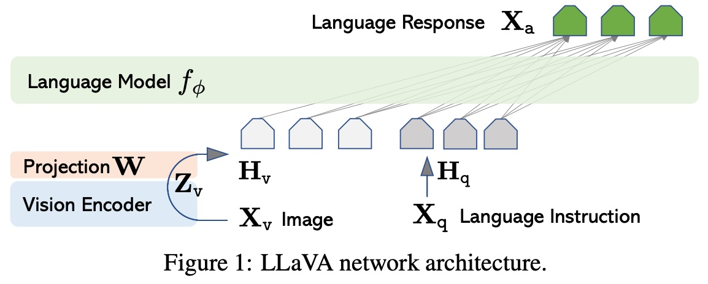
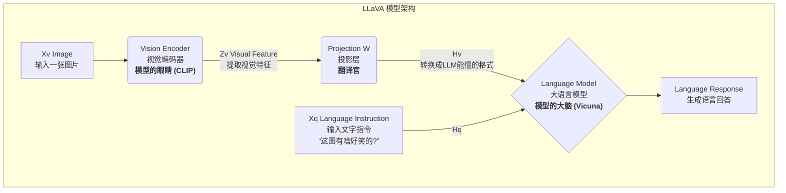
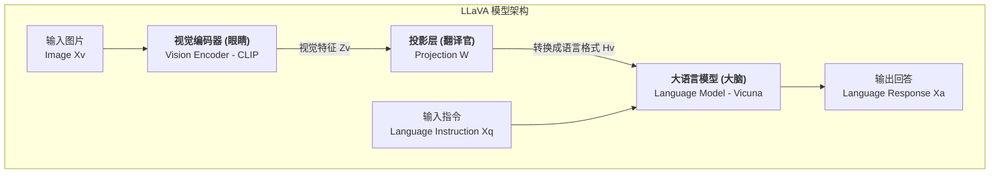
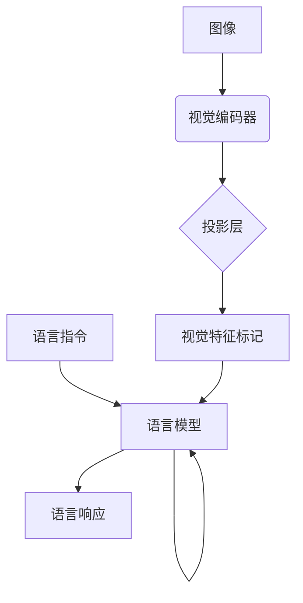
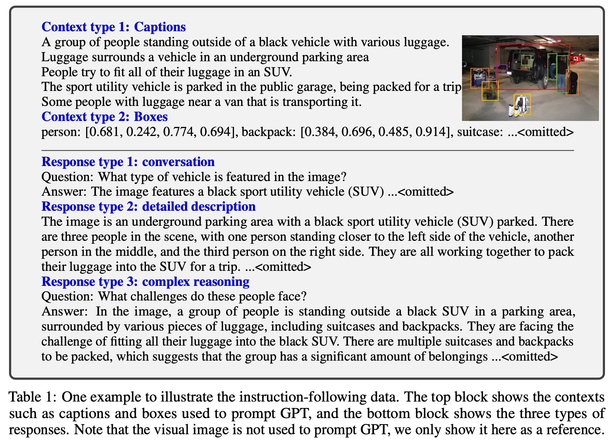

## AI论文解读 | Visual Instruction Tuning
        
### 作者        
digoal        
        
### 日期        
2025-08-31        
        
### 标签        
PostgreSQL , PolarDB , DuckDB , AI , 论文解读        
        
----        
        
## 背景  
      
https://arxiv.org/pdf/2304.08485        
  
提示:          
```          
读懂《Visual Instruction Tuning》这篇论文需要提前掌握哪些基础知识, 请使用中文通熟易懂的讲解这些基础知识, 可以引用论文中的图、表或使用Markdown支持的图形(text,mermaid等)增加解释性. 
  
使用中文通熟易懂的解读《Visual Instruction Tuning》这篇论文, 其中的关键内容请着重讲解, 可以引用论文中的图、表或使用Markdown支持的图形(text,mermaid等)增加解释性. 
  
提取《Visual Instruction Tuning》这篇论文中的重要术语, 使用中文对这些术语进行通熟易懂的讲解, 可以引用论文中的图、表或使用Markdown支持的图形(text,mermaid等)增加解释性. 
```     
  
## 1 前置知识 
  
好的，为了完全理解《Visual Instruction Tuning》这篇论文（也就是 LLaVA 模型），您需要对以下几个核心概念有基本的认识。我会用通俗易懂的中文为您讲解，并引用论文中的图表来帮助理解。

这篇论文的核心目标是**创建一个能像人一样看图聊天的 AI 助手**。为了实现这个目标，作者们把两个领域的最强技术巧妙地结合了起来。因此，我们需要了解的基础知识也主要来自这两个领域：自然语言处理（NLP）和计算机视觉（CV）。

### 基础知识一：大语言模型 (Large Language Models, LLMs)

可以把大语言模型（LLM）想象成一个**超级聪明的“文字接龙”大脑**。

  * **它是什么？** 通过学习海量的书籍、网页和文章，LLM 掌握了语言的规律、事实知识、甚至一定的推理能力。它的核心任务是：给定一段文字，预测下一个最可能出现的词是什么。通过不断地预测，它就能生成完整的句子和段落。
  * **它能做什么？** 当模型规模变得巨大（比如有数百亿甚至上千亿参数）时，它就涌现出了惊人的能力，比如：回答问题、写文章、翻译、写代码、进行对话等。我们熟知的 ChatGPT 就是一个典型的大语言模型。
  * **在 LLaVA 中扮演什么角色？** 在 LLaVA 模型中，LLM 是负责**思考和回答**的“大脑”。论文中提到，他们选择了 **Vicuna** ，这是一个当时表现非常出色的开源 LLM。但是，这个“大脑”天生只能处理文字，看不懂图片。

-----

### 基础知识二：视觉编码器与 CLIP 模型 (Vision Encoder & CLIP)

如果 LLM 是大脑，那么视觉编码器就是**模型的“眼睛”**。

  * **它是什么？** 视觉编码器是一种深度学习模型，它的任务是“看”一张图片，然后把它转化成一串计算机能够理解的数字，我们称之为“特征（Features）”。这串数字浓缩了图片里的关键信息，比如有什么物体、物体的样子、场景的风格等等。
  * **什么是 CLIP 模型？** CLIP 是 OpenAI 开发的一个革命性的视觉语言模型。它的训练方式很特别：它同时学习了大量的“图片-文字描述”对（比如，一张猫的照片和一句话“这是一只可爱的猫”）。通过这种学习，CLIP 的视觉编码器学会了提取与语言概念高度相关的视觉特征。简单来说，**CLIP 的“眼睛”看到的图像特征，是 LLM 这个“大脑”更容易理解的**。
  * **在 LLaVA 中扮演什么角色？** LLaVA 用 CLIP 的视觉编码器 ViT-L/14  作为“眼睛”。这只“眼睛”负责从输入的图片中提取出最精华的视觉信息，然后准备传递给“大脑”。

-----

### 基础知识三：多模态模型 (Multimodal Models)

理解了“大脑”和“眼睛”之后，下一个问题就是：**如何把它们连接起来？** 这就引出了多模态模型的概念。多模态就是指模型能同时处理多种类型的信息（模态），比如文字、图像、声音等。

LLaVA 就是一个典型的视觉-语言多模态模型。它最关键的结构设计，就是如何让只能处理文字的 LLM“大脑”理解来自视觉编码器“眼睛”的图像信息。论文中的图1完美地展示了这个过程：   

Figure 1: LLAVA network architecture.



让我们一步步解析这个流程：

1.  **输入图片 (Image $X\_v$)**: 用户上传一张图片 。
2.  **视觉编码器 (Vision Encoder)**: LLaVA 的“眼睛”（CLIP）看到这张图片，并将其转换为一组浓缩的视觉特征向量 $Z\_v$ 。
3.  **投影层 (Projection W)**: 这是最关键的“**翻译官**”。视觉特征 $Z\_v$ 是一串数字，而 LLM 的输入是文字。这个投影层（一个简单的线性层）的作用就是把这串代表图像的数字“翻译”成 LLM 能够理解的格式，就像把视觉信号转码成一种特殊的“文字” $H\_v$ 。
4.  **语言模型 (Language Model)**: LLM“大脑”（Vicuna）现在接收两部分信息：一部分是经过“翻译”的图像信息 $H\_v$，另一部分是用户的文字指令 $X\_q$ （比如“这张图里有什么不寻常的地方？”）。
5.  **生成回答 (Language Response $X\_a$)**: “大脑”会综合图像信息和文字问题，然后像一个人类一样，用自然语言生成最终的回答 。

-----

### 基础知识四：指令微调 (Instruction Tuning)

现在我们有了连接好的“眼睛”和“大脑”，但它还只是一个“半成品”。它虽然能看、能说，但还不够“听话”，不知道如何像一个助手一样遵循我们的指令进行回答。这就需要进行“指令微调”。

  * **它是什么？** 指令微调是一种特殊的训练方法。我们不再让模型做简单的“文字接龙”，而是给它大量的“指令-回答”样本对，让它学习如何根据指令完成任务。
      * 例如，给它看一张图，指令是“详细描述这张图片”，然后给它一个标准的高质量回答。
      * 通过学习成千上万这样的例子，模型就学会了“听话”，成为了一个真正有用的助手。
  * **LLaVA 的核心创新：** 这篇论文最大的贡献就是**首次将指令微调应用到了视觉-语言多模态领域**，也就是所谓的 **Visual Instruction Tuning** 。
  * **数据从哪来？** 创建大量的“图像-指令-回答”数据非常昂贵。作者们想出了一个绝妙的办法：**用 GPT-4 来自动生成这些数据** 。他们并不直接给 GPT-4 看图片（因为当时 GPT-4 还不能直接看图），而是把一张图的**文字信息**（比如已有的标题、图中物体的坐标框等）喂给 GPT-4，然后让 GPT-4 围绕这些文字信息创造出三种类型的对话数据：
    1.  **一问一答 (Conversation)** 
    2.  **详细描述 (Detailed Description)** 
    3.  **复杂推理 (Complex Reasoning)** 

通过在这个 GPT-4 生成的高质量数据集上进行微调，LLaVA 学会了强大的视觉对话和推理能力。

### 总结

掌握了以上四个基础知识点，您就可以轻松读懂这篇论文了：

1.  **大语言模型 (LLM)**：提供了强大的语言理解和生成能力，是模型的“大脑”。
2.  **视觉编码器 (CLIP)**：提供了强大的视觉理解能力，是模型的“眼睛”。
3.  **多模态架构**：通过一个巧妙的“翻译官”（投影层），将“眼睛”和“大脑”连接起来。
4.  **指令微调**：通过“特训”让模型学会听从人类指令，成为一个有用的视觉助手。

LLaVA 的成功在于它开创性地证明了，**借助已有的大语言模型和视觉模型，通过视觉指令微调，可以高效地创建一个强大的、能理解图像并进行流畅对话的通用视觉助手**。
  
## 2 解读论文 
  
好的，这篇名为《Visual Instruction Tuning》的论文介绍了一个名为 LLaVA (Large Language and Vision Assistant) 的模型 ，是多模态AI领域的一项开创性工作。下面我将用通俗易懂的方式为您解读其核心内容。

### 论文解决的核心问题是什么？

在 LLaVA 出现之前，AI 领域已经有了像 ChatGPT 这样非常擅长通过文字指令进行对话的大语言模型（LLMs）。但它们是“盲人”，无法理解图像。当时的AI世界缺少一个能像人一样，既能看懂图片又能根据你的指令进行智能对话的通用助手 。这篇论文的核心目标就是**创建这样一个能看图会聊天的通用视觉助手** 。

### 关键内容一：LLaVA 的“三位一体”架构

LLaVA 的设计思路非常巧妙，它没有从零开始造一个新模型，而是将当时最优秀的“眼睛”和“大脑”连接起来，再通过一个“翻译官”进行沟通。论文中的图1清晰地展示了这一点 。   



1.  **“眼睛” - 视觉编码器 (Vision Encoder)**

      * LLaVA 使用了预训练好的 **CLIP 视觉编码器 (ViT-L/14)** 来作为模型的“眼睛” 。
      * 它的作用是接收一张图片，并从中提取出最关键的视觉信息，将其压缩成一组计算机能理解的数字，即“视觉特征” ( $Z\_v$ ) 。

2.  **“大脑” - 大语言模型 (LLM)**

      * 模型的大脑是当时一个非常出色的开源对话模型 **Vicuna** 。
      * 它拥有强大的语言理解、逻辑推理和对话能力，但本身只能处理文字 。

3.  **“翻译官” - 投影层 (Projection W)**

      * 这是连接“眼睛”和“大脑”的桥梁，也是架构上的一个关键点 。
      * 由于“眼睛”输出的视觉特征（数字）和“大脑”能理解的语言（文字）格式不同，作者设计了一个简单的线性层作为“翻译官” 。
      * 它的任务是将视觉特征 $Z\_v$ “翻译”成“大脑”可以理解的语言嵌入格式 $H\_v$ 。这个过程非常轻量且高效 。

### 关键内容二：用 GPT-4 自动生成“教学数据”

要让模型学会看图聊天，就需要大量的“图片-指令-回答”格式的教学数据。但在当时，这类高质量数据非常稀少和昂贵 。

为此，作者们提出了一个极具创意的解决方案：**用一个纯语言模型 GPT-4 来生成多模态的指令数据** 。

  * **如何实现？** 他们并不直接给 GPT-4 看图（当时还做不到），而是将一张图片的**文字信息**作为输入，包括：
      * **图像描述 (Captions)**：比如“一群人站在一辆黑色汽车外” 。
      * **物体边界框 (Bounding boxes)**：比如“person: [0.681, 0.242, 0.774, 0.694]” 。
  * **生成什么？** 基于这些文字信息，他们引导 GPT-4 创造出三种不同类型的指令问答数据 ：
    1.  **日常对话 (Conversation)**：模拟用户和助手之间关于图片内容的多轮问答 。
    2.  **详细描述 (Detailed Description)**：生成对图片全面而细致的描述 。
    3.  **复杂推理 (Complex Reasoning)**：提出需要深层逻辑思考才能回答的问题，比如“图中这些人可能面临什么挑战？” 。

通过这种方法，他们最终生成了约 **15.8万** 条高质量的语言-图像指令数据 。

### 关键内容三：两阶段训练策略

为了让模型高效地学习，作者设计了一个循序渐进的两阶段训练流程 。

  * **第一阶段：特征对齐预训练 (Pre-training for Feature Alignment)**

      * **目标**：让“翻译官”（投影层 W）先学会如何正确地将“眼睛”看到的视觉信息转换成“大脑”能懂的语言格式 。
      * **做法**：在这一阶段，模型的“眼睛”（CLIP）和“大脑”（Vicuna）的参数都被**冻结**，只训练中间的“翻译官” 。
      * **数据**：使用一个包含约 59.5 万个图像-文本对的过滤数据集 。

  * **第二阶段：端到端微调 (Fine-tuning End-to-End)**

      * **目标**：在对齐的基础上，进一步提升模型遵循指令进行对话的能力。
      * **做法**：“眼睛”的参数仍然**冻结**，但“翻译官”和“大脑”的参数**一起**进行训练和更新 。
      * **数据**：使用上一部分提到的由 GPT-4 生成的 15.8 万条高质量指令数据 。

### 实验效果与结论

LLaVA 的表现非常出色，证明了“视觉指令微调”这一想法的有效性。

  * **对话能力惊艳**：LLaVA 展现了令人印象深刻的多模态聊天能力，在某些情况下其行为与多模态 GPT-4 相似 。它能准确理解用户指令，而不仅仅是简单描述图片内容 。
  * **性能超越对手**：在一个专门评估指令遵循能力的基准测试（LLaVA-Bench）上，LLaVA 的得分（67.3%）远超同类模型 BLIP-2（+29%）和 OpenFlamingo（+48%）。
  * **刷新SOTA记录**：在科学问答数据集 ScienceQA 上，LLaVA 与 GPT-4 的组合取得了 **92.53%** 的准确率，创造了当时该领域的最先进水平（State-of-the-Art）。

**总而言之，这篇论文的核心贡献是：**

1.  **提出了 LLaVA**，一个结合了预训练视觉编码器和大型语言模型的强大视觉助手 。
2.  **开创了视觉指令微调 (Visual Instruction Tuning)** 这一新范式，证明了其在提升多模态模型通用能力上的有效性 。
3.  **设计了一种巧妙、低成本的数据生成流程**，利用语言模型 GPT-4 创建了大规模、高质量的视觉指令数据集 。
4.  **向社区开源了模型、代码和数据**，极大地推动了后续多模态大模型的研究 。
  
## 3 术语 
  
以下是对《Visual Instruction Tuning》这篇论文中几个重要术语的中文讲解，并引用论文中的图和概念来增加解释性。

-----

### **1. 视觉指令微调 (Visual Instruction Tuning)**

**视觉指令微调**是论文提出的核心思想，旨在将大型语言模型（LLM）的“指令遵循”能力扩展到多模态（视觉-语言）领域 。简单来说，就像对LLM进行指令微调可以提升其在零样本任务上的能力一样，**视觉指令微调**就是通过使用机器自动生成的高质量多模态数据，来训练一个模型，使其能够理解并遵循包含视觉内容的复杂指令，成为一个通用的“视觉助手” 。

-----

### **2. LLaVA 模型 (Large Language and Vision Assistant)**

**LLaVA**（大型语言与视觉助手）是论文中提出的模型，它是一个端到端训练的大型多模态模型 。它的设计非常精巧，将一个视觉编码器（Vision Encoder）和一个大型语言模型（LLM）连接起来，实现了通用的视觉和语言理解能力 。

它的工作原理可以用以下简化图来表示，这与论文中的图1（LLAVA network architecture）相符：   



  * **视觉编码器 (Vision Encoder)**：负责将输入的图像 ( $X\_v$ ) 转化为视觉特征 ( $Z\_v$ ) 。论文使用了预训练的 CLIP 视觉编码器 。
  * **投影层 (Projection)**：这是一个可训练的线性层，它的作用是将视觉编码器提取的图像特征 ( $Z\_v$ ) 转换为与语言模型词嵌入空间维度相同的语言嵌入标记 ( $H\_v$ ) 。这就像一座“桥梁”，让语言模型能够理解视觉信息。
  * **大型语言模型 (LLM)**：负责处理语言指令和生成语言响应 。论文中选择 Vicuna 作为LLM，因为它在指令遵循能力方面表现出色 。

-----

### **3. 多模态指令遵循数据 (Multimodal Instruction-following Data)**

这是实现**视觉指令微调**的关键。由于现有的高质量视觉-语言指令数据稀缺，论文提出了一种创新方法，使用 GPT-4 自动将图像-文本对转换为多模态指令遵循数据 。

论文生成了三种类型的数据，以覆盖不同的任务和能力 ：

  * **对话 (Conversation)**：包含多轮问答，模拟人类与助手的自然交互 。问题多样，涵盖了物体类型、数量、动作、位置等 。
  * **详细描述 (Detailed description)**：要求模型对图像内容进行全面而丰富的描述 。
  * **复杂推理 (Complex reasoning)**：包含需要分步推理和严密逻辑才能回答的深度问题 。

**表1** (Table 1) 提供了这些数据类型的示例，展示了如何根据图像的上下文（如字幕和边界框）来生成不同类型的指令和响应 。   

-----

### **4. 训练方法 (Training Procedure)**

LLaVA 的训练分为两个阶段，非常高效 。

1.  **阶段一：预训练以对齐特征 (Pre-training for Feature Alignment)**：

      * 此阶段的目标是让视觉特征与冻结的LLM词嵌入空间对齐 。
      * 模型使用过滤后的 CC3M 数据集进行训练 。
      * 在训练过程中，视觉编码器和LLM的权重是冻结的，只训练连接它们的投影层 。

2.  **阶段二：端到端微调 (Fine-tuning End-to-End)**：

      * 此阶段使用 GPT-4 生成的 **多模态指令遵循数据** 进行训练 。
      * 视觉编码器权重保持冻结，但投影层和LLM的权重都会被更新 。
      * 这个阶段使 LLaVA 能够掌握在各种任务中遵循指令的能力，例如多模态聊天和科学问答等 。
  
## 参考        
         
https://arxiv.org/pdf/2304.08485    
        
<b> 以上内容基于DeepSeek、Qwen、Gemini及诸多AI生成, 轻微人工调整, 感谢杭州深度求索人工智能、阿里云、Google等公司. </b>        
        
<b> AI 生成的内容请自行辨别正确性, 当然也多了些许踩坑的乐趣, 毕竟冒险是每个男人的天性.  </b>        
  
  
  
#### [期望 PostgreSQL|开源PolarDB 增加什么功能?](https://github.com/digoal/blog/issues/76 "269ac3d1c492e938c0191101c7238216")
  
  
#### [PolarDB 开源数据库](https://openpolardb.com/home "57258f76c37864c6e6d23383d05714ea")
  
  
#### [PolarDB 学习图谱](https://www.aliyun.com/database/openpolardb/activity "8642f60e04ed0c814bf9cb9677976bd4")
  
  
#### [PostgreSQL 解决方案集合](../201706/20170601_02.md "40cff096e9ed7122c512b35d8561d9c8")
  
  
#### [德哥 / digoal's Github - 公益是一辈子的事.](https://github.com/digoal/blog/blob/master/README.md "22709685feb7cab07d30f30387f0a9ae")
  
  
#### [About 德哥](https://github.com/digoal/blog/blob/master/me/readme.md "a37735981e7704886ffd590565582dd0")
  
  

  
