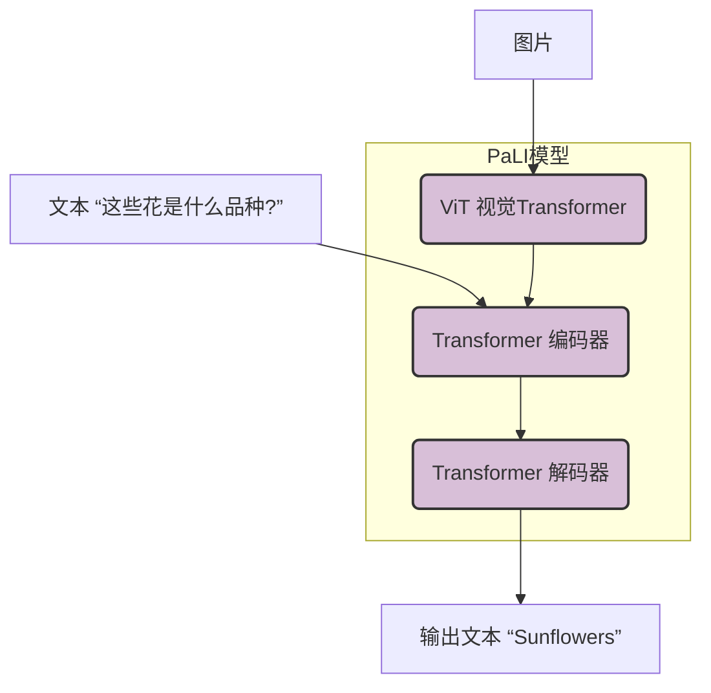
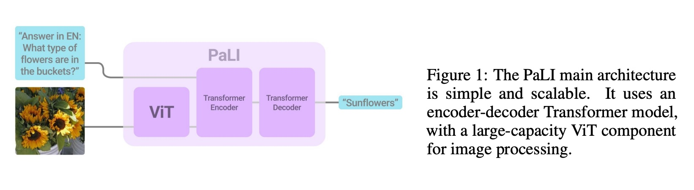
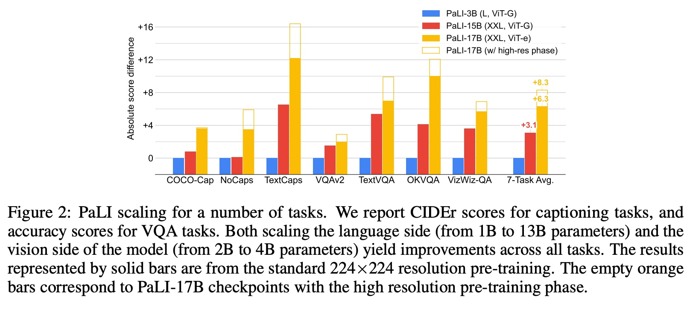
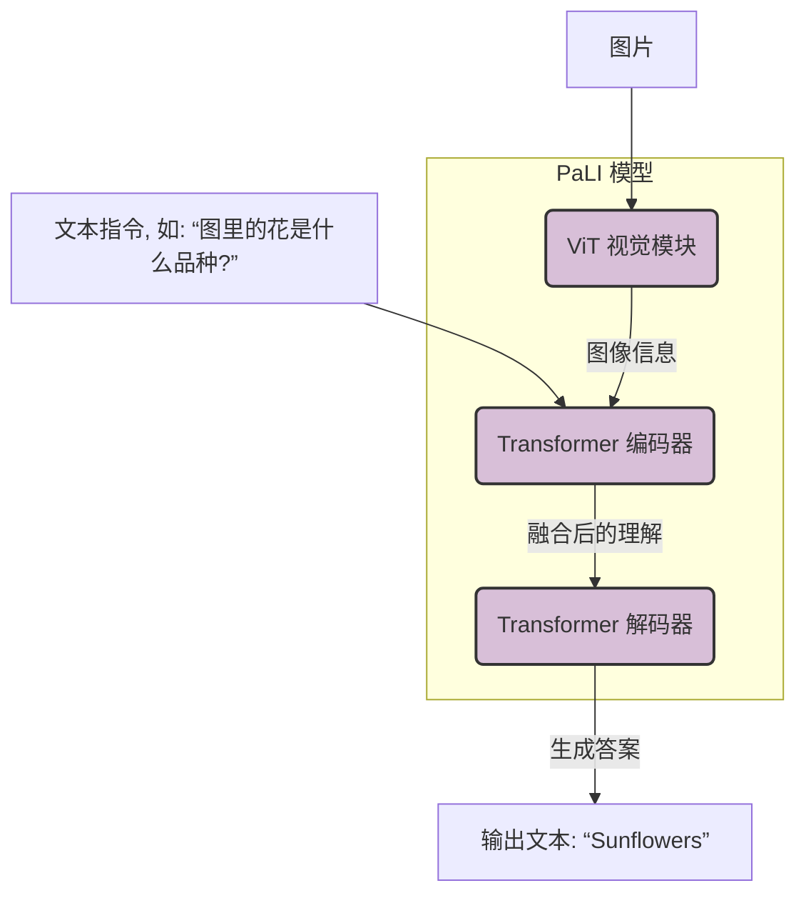
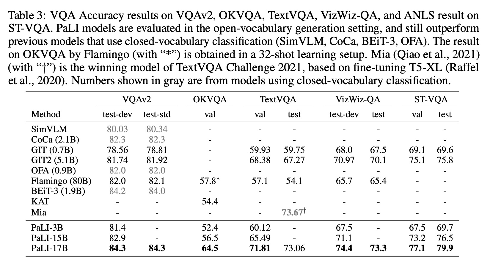
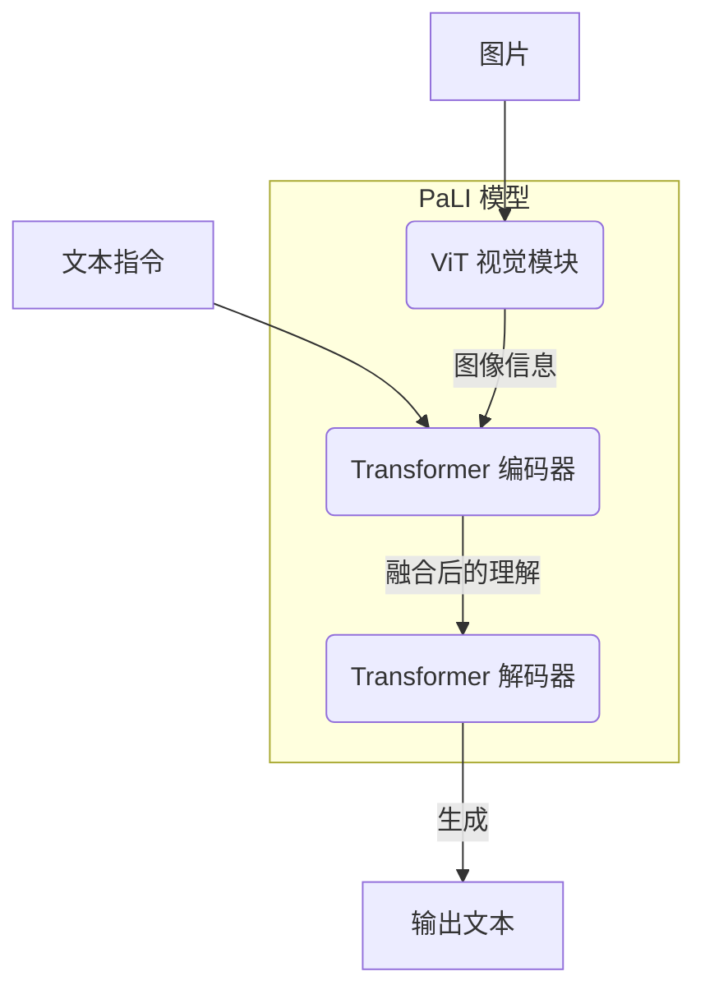

## AI论文解读 | PALI: A JOINTLY-SCALED MULTILINGUAL LANGUAGE-IMAGE MODEL
        
### 作者        
digoal        
        
### 日期        
2025-08-31        
        
### 标签        
PostgreSQL , PolarDB , DuckDB , AI , 论文解读        
        
----        
        
## 背景  
      
https://arxiv.org/pdf/2209.06794        
  
提示:          
```          
读懂《PALI: A JOINTLY-SCALED MULTILINGUAL LANGUAGE-IMAGE MODEL》这篇论文需要提前掌握哪些基础知识, 请使用中文通熟易懂的讲解这些基础知识, 可以引用论文中的图、表或使用Markdown支持的图形(text,mermaid等)增加解释性. 
  
使用中文通熟易懂的解读《PALI: A JOINTLY-SCALED MULTILINGUAL LANGUAGE-IMAGE MODEL》这篇论文, 其中的关键内容请着重讲解, 可以引用论文中的图、表或使用Markdown支持的图形(text,mermaid等)增加解释性. 
  
提取《PALI: A JOINTLY-SCALED MULTILINGUAL LANGUAGE-IMAGE MODEL》这篇论文中的重要术语, 使用中文对这些术语进行通熟易懂的讲解, 可以引用论文中的图、表或使用Markdown支持的图形(text,mermaid等)增加解释性. 
```     
  
## 1 前置知识 
  
好的，为了完全理解《PALI：一个联合缩放的多语言语言-图像模型》这篇论文，你需要了解一些人工智能领域的基础概念。我会用通俗易懂的方式为你讲解，并引用论文中的图表来帮助理解。

这篇论文的核心目标是创建一个像人一样，既能“看”懂图片，又能理解多种语言文字，并能用文字进行回答或描述的强大AI模型。

-----

### 核心知识点 1: Transformer 与编码器-解码器架构 (AI的语言引擎)

想象一下一个专业的同声传译员。当他听到一种语言（例如，中文）时，他首先会在脑中理解这句话的完整含义（编码过程），然后再用另一种语言（例如，英文）准确地表达出来（解码过程）。

Transformer就是当前AI领域处理序列信息（如语言）最核心的架构，它也由两部分组成：

  * **编码器 (Encoder)**: 负责“阅读”和“理解”输入的信息。它会把输入的文字序列（或者后面会提到的“图像块”序列）转换成一种富含上下文信息的数学表示（向量）。论文中提到，PaLI的编码器会同时接收文本和图像的输入 。
  * **解码器 (Decoder)**: 负责根据编码器的“理解”，一步一步地生成目标文字序列，也就是最终的答案或描述 。

PaLI模型的核心就是一个Transformer编码器-解码器，它重用了谷歌一个非常强大的预训练语言模型mT5 ，相当于给PaLI直接装上了一个精通多国语言的“语言大脑”。

### 核心知识点 2: 视觉 Transformer (ViT) - 让AI“看”懂图片 (AI的眼睛)

传统上，让计算机理解图片通常用卷积神经网络（CNN）。但Transformer的成功启发了研究者：我们能不能也用Transformer来“阅读”图片呢？视觉Transformer（ViT）就此诞生。

它的核心思想非常巧妙：**把图片切成小块，当成单词来读**。

1.  **图像分块 (Image Patching)**: 将一张完整的图片切成若干个固定大小的小方块（Patches），就像把一幅画拆成很多块拼图 。
2.  **序列化**: 将这些小方块按从左到右、从上到下的顺序排成一个序列。
3.  **输入Transformer**: 把这个“图像块”序列像一句话一样，输入到Transformer模型中进行理解。

这样一来，处理图片和处理语言就用了同一种技术，极大地促进了图文的融合。PaLI模型的前端就使用了一个强大的ViT来充当它的“眼睛”，负责处理输入的图像 。

下图是论文中的模型架构图，清晰地展示了ViT和Transformer编码器-解码器是如何协同工作的：



  

*图解：一张向日葵图片和一段文字问题被分别输入到PaLI模型中。ViT负责“看”图，然后将理解后的信息与文字信息一起送入Transformer编码器进行综合理解，最后由解码器生成答案“Sunflowers”。（示意图改编自论文Figure 1 ）*

### 核心知识点 3: 多模态学习 (视觉与语言的融合)

“模态”（Modality）指信息的来源渠道，比如视觉、听觉、文本等。人类天生就擅长处理多模态信息：我们可以一边看电影画面（视觉），一边听台词（听觉），一边阅读字幕（文本）。

**多模态学习**就是让AI模型也具备这种能力，能够同时理解和关联来自不同模态的信息 。PaLI就是一个典型的多模态模型，它专门处理**视觉**和**文本**这两种模态。

### 核心知识点 4: 迁移学习：预训练与微调 (先通识教育，再专业深造)

从头开始训练一个超大规模的AI模型，既耗时又昂贵。于是研究者们借鉴了人类的学习方式，发明了“预训练-微调”范式。

1.  **预训练 (Pre-training)**: 这相当于“通识教育”。让模型在海量的、多样化的数据上进行学习，掌握关于这个世界的通用知识。例如，PaLI在一个包含100亿张图片和100多种语言文本的庞大数据集`WebLI`上进行预训练 。通过这个过程，模型学会了基本的语法、常识以及图片中物体的普遍样貌。
2.  **微调 (Fine-tuning)**: 这相当于“专业深造”。在预训练好的通用模型基础上，用一个规模小得多、但针对性很强的任务数据集进行二次训练，让模型适配特定任务 。比如，用一个专门的“看图问答”数据集对PaLI进行微调，它就能成为这个领域的专家。

这种方法的巨大优势在于，预训练的成本虽然高，但只需要一次。之后，研究者可以基于这个强大的预训练模型，快速微调出能解决各种具体任务的模型，大大节省了资源 。

### 核心知识点 5: 模型缩放定律 (Bigger is Better，但要均衡发展)

在深度学习领域有一个普遍被验证的规律，即**模型缩放定律 (Scaling Laws)**：模型的参数量越大（可以理解为“脑容量”越大）、训练的数据越多，其性能通常就越好。

这篇论文的一个核心贡献是**验证了在多模态领域，模型的视觉和语言两个部分需要“联合缩放”** 。过去很多模型可能有一个超大的语言模型，但视觉部分相对较小。PaLI的研究者们反其道而行之，他们专门训练了一个当时最大的视觉模型ViT-e（40亿参数），并证明了这一点：

  * **只扩大语言模型有效**：语言能力更强。
  * **同时扩大视觉模型更有效**：对图像的理解更深刻，最终在各项任务上性能提升更明显。

论文中的 **Figure 2** 非常直观地展示了这一点：

  

*图解（改编自论文 Figure 2）：此图展示了不同大小的PaLI模型在7个任务上的平均性能提升。*

  * *蓝色条 (PaLI-3B)* 是基准。
  * *红色条 (PaLI-15B)* 表示将语言模型从10亿参数提升到130亿参数，性能有所提升。
  * *黄色条 (PaLI-17B)* 表示在红色条的基础上，进一步将视觉模型从20亿参数提升到40亿参数，性能获得了比之前更显著的增长 。
    这证明了给AI一双“更锐利的眼睛”和给它一个“更聪明的大脑”同等重要。

### 核心知识点 6: 统一的任务接口 (一招鲜，吃遍天)

传统的AI开发模式是“一个任务，一个模型”。比如开发一个模型用于图片描述，再开发另一个模型用于看图问答。

PaLI采用了一种更优雅、更通用的方式：**统一的任务接口** 。所有不同的任务都被转换成同一种形式：“**输入图片 + 文本指令，输出文本**” 。

  * **想让它描述图片？** 输入图片和文字 "请描述这张图片"。
  * **想让它回答问题？** 输入图片和文字 "图片里有多少只猫？"。
  * **想让它识别文字？** 输入图片和文字 "图片里的文字是什么？"。

通过改变输入的文本“指令”（Prompt），同一个PaLI模型就可以完成各种不同的多模态任务，这让它变得异常灵活和强大 。

-----

总结一下，要读懂PaLI这篇论文，你需要掌握以上六个基础知识。简单来说，PaLI就是将一个**强大的语言引擎 (Transformer)** 和一双**锐利的眼睛 (ViT)** 结合在一起，通过在海量数据上进行**通识教育 (预训练)**，并验证了**均衡发展 (联合缩放)** 的重要性，最终打造出一个能够通过**统一接口**灵活完成各种图文任务的**多模态**AI模型。
  
## 2 解读论文 
  
好的，这是一份对《PALI：一个联合缩放的多语言语言-图像模型》这篇论文的通俗易懂的中文解读。

### 核心思想概览

简单来说，这篇论文介绍了一个名为 **PaLI (Pathways Language and Image model)** 的新模型 。它的目标是创建一个像人类一样，既能“看”懂图片，又能理解并生成超过100种语言文字的AI模型 。PaLI的强大之处在于它能用一个统一的、灵活的接口完成各种复杂的图文任务，比如为图片生成描述（图像描述）、回答关于图片的问题（视觉问答）以及识别图片中的文字等 。

-----

### 关键内容深度解读

#### 1\. 简洁且强大的模型架构

PaLI的架构设计遵循了“大道至简”的原则，它将两个在各自领域已经非常成熟的模块巧妙地组合在了一起：

  * **一只“锐利的眼睛”——视觉Transformer (ViT)**：负责处理和理解输入的图像 。它把图片切成一个个小块，然后像阅读单词一样来“阅读”这些图像块 。
  * **一个“博学的语言大脑”——Transformer编码器-解码器**：负责处理文字信息并生成最终的文本答案 。PaLI直接重用了谷歌强大的多语言模型mT5，使其天生就具备了强大的语言能力 。

工作流程如下图所示：



*图解：当用户输入一张图片和一个文本问题时，ViT模块先对图片进行分析，然后将分析结果与文本问题一起送入编码器进行综合理解。最后，解码器基于这份理解，生成最终的文本答案 。*

#### 2\. “联合缩放”：视觉和语言能力要齐头并进

这是本篇论文最重要的发现之一。研究者们认为，要让一个多模态模型变得更强大，不能只“偏科”地提升其语言能力，**必须同时提升它的视觉理解能力** 。

为了证明这一点，他们专门训练了一个当时规模最大的视觉模型，名为 **ViT-e (“enormous”的缩写)**，拥有40亿参数 。然后他们对比了不同配置的模型：

  * **PaLI-3B**: 较小的语言模型 (10亿) + 强大的视觉模型 (ViT-G, 20亿)
  * **PaLI-15B**: 超大的语言模型 (130亿) + 强大的视觉模型 (ViT-G, 20亿)
  * **PaLI-17B**: 超大的语言模型 (130亿) + **最顶级的视觉模型 (ViT-e, 40亿)** 

结果如论文中的图2所示，当视觉模型从ViT-G升级到ViT-e后 (从PaLI-15B到PaLI-17B)，模型的综合性能获得了巨大提升，其提升幅度甚至超过了将语言模型参数增加120亿所带来的效果 。

  

*图2解读：这张柱状图清晰地展示了“联合缩放”的效果。对比红色柱(PaLI-15B)和黄色柱(PaLI-17B)，虽然总参数量只增加了约13%，但因为这部分增长来自更强大的视觉模块ViT-e，使得模型在各项任务上的平均分（7-Task Avg.）获得了显著的飞跃 。*

#### 3\. 海量且多样的训练数据：WebLI数据集

为了训练PaLI这样的大模型，研究者们构建了一个名为 **WebLI** 的超大规模多语言图文数据集 。

  * **规模**：包含约100亿张图片，以及来自超过100种语言的文本描述 。
  * **来源**：数据从公开的网页中自动收集和筛选而来 。
  * **特点**：除了网页上的图文配对外，还利用OCR（光学字符识别）技术提取了图片中包含的文字，进一步丰富了训练数据 。

正是有了这个庞大且多样化的数据集，PaLI才得以学习到丰富的世界知识，并具备了强大的多语言能力 。

#### 4\. “万能”的任务接口：以不变应万变

传统AI模型通常是“专才”，一个模型对应一个任务。而PaLI则是一个“通才”，它采用了一个统一的 **“图片+文本 -\> 文本”** 的交互模式 。这意味着，无论是多么不同的任务，都可以通过向PaLI输入不同的“文本指令”（Prompt）来完成。

  * **图像描述**：输入图片 + 指令 "请描述这张图片"。
  * **视觉问答**：输入图片 + 指令 "图中最高的建筑是什么？"。
  * **场景文字识别**：输入图片 + 指令 "牌子上写的什么？"。

这种设计极大地简化了模型的使用，让同一个模型无需任何结构改动就能灵活地解决各种新问题 。

#### 5\. 卓越的性能表现

得益于先进的架构、联合缩放策略和海量的多语言数据，PaLI在多个权威的公开评测中都取得了当时最先进（State-of-the-Art, SOTA）的成绩。

  * **COCO图像描述**：在一项经典的图像描述任务中，PaLI取得了149.1的CIDEr高分，超越了当时所有同类模型 。
  * **VQAv2视觉问答**：在无需选择题选项、完全开放式生成答案的模式下，PaLI的准确率达到了84.3%，同样刷新了纪录 。
  * **多语言任务**：在跨语言的图像描述和视觉问答任务中，PaLI也大幅领先于之前的SOTA模型，展现了其出色的多语言理解能力 。

**下表展示了PaLI在多项英文视觉问答任务上的优异表现：**

| 任务 (评测集) | SimVLM (分类) | CoCa (分类) | Flamingo (生成) | **PaLI-17B (生成)** |
| :--- | :---: | :---: | :---: | :---: |
| VQAv2 (准确率) | 80.03  | 82.3  | 82.0  | **84.3**  |
| OKVQA (准确率) | - | - | 57.8 (少样本)  | **64.5**  |
| TextVQA (准确率) | - | 59.93  | - | **73.06**  |

  

*表格节选自论文Table 3，展示了PaLI即使在更困难的开放式生成设定下，其性能依然超越了许多在固定选项中做选择（分类）的模型 。*

### 总结

《PALI》这篇论文的核心贡献在于：

1.  **提出并验证了“联合缩放”策略**：证明了视觉和语言组件的均衡发展对于提升多模态大模型性能至关重要。
2.  **构建了强大的PaLI模型**：通过融合顶级的ViT和语言模型，并在海量多语言数据上进行训练，打造了一个在多项图文任务上达到SOTA水平的通用模型。
3.  **提供了未来研究方向**：PaLI的成功为后续更大、更强的多模态基础模型的研发提供了一个清晰且可扩展的路线图 。
  
## 3 术语 
  
好的，以下是对《PALI: A JOINTLY-SCALED MULTILINGUAL LANGUAGE-IMAGE MODEL》这篇论文中关键术语的通俗化中文讲解。

-----

### 1\. PaLI (Pathways Language and Image model)

PaLI是这篇论文提出的模型的名字，是一个能够同时理解图像和多种语言的AI模型 。你可以把它想象成一个“博览群书”且“阅图无数”的智能助手，它能根据你给出的图片和文字指令，用文字作出相应的回答或描述 。

### 2\. Vision Transformer (ViT) / ViT-e (视觉Transformer)

这是PaLI模型的“眼睛”，一种专门用于理解图像的神经网络架构 。

  * **工作原理**：它不像人眼一样一次性看完整张图，而是先把图片切成一个个小方块（Patches），然后像读一句话里的单词一样，按顺序“阅读”这些图像块，从而理解整张图片的内容 。
  * **ViT-e**：为了让PaLI的视觉能力更上一层楼，研究者们专门训练了一个当时规模最大的ViT版本，并命名为ViT-e（e代表enormous，意为“巨大的”），它拥有40亿参数 。

### 3\. Encoder-Decoder Transformer (编码器-解码器架构)

这是PaLI模型的“语言大脑”，负责处理所有文本信息并生成最终的文字输出 。

  * **编码器 (Encoder)**：负责“阅读”和“理解”输入的信息。在PaLI中，它会同时接收文本指令和来自ViT的图像信息，并将两者融合，形成一个综合的理解 。
  * **解码器 (Decoder)**：在编码器理解的基础上，像写文章一样，一个词一个词地生成最终的答案或描述 。

整个模型的协同工作流程可以简化为下图：



*图解：PaLI的核心架构由ViT视觉模块和Transformer编码器-解码器语言模块构成 。*

### 4\. Joint Scaling (联合缩放)

这是论文的核心论点和发现，指的是**必须同时、均衡地扩大（Scaling）模型的视觉组件和语言组件的规模**，才能获得最佳性能 。过去的研究可能更侧重于扩大语言模型，而PaLI的研究证明，拥有一双“更锐利的眼睛”（更大的ViT）和拥有一个“更聪明的大脑”（更大的语言模型）同等重要 。

论文中的图2完美地证明了这一点：

  

*图2解读：对比红色柱（PaLI-15B）和黄色柱（PaLI-17B），当语言模型规模不变（均为130亿参数），仅将视觉模型从20亿参数的ViT-G升级到40亿参数的ViT-e后，模型在各项任务上的性能获得了巨大提升 。*

### 5\. WebLI Dataset (WebLI数据集)

为了有效地训练PaLI，研究者们构建了一个名为WebLI的全新、超大规模的图文数据集 。

  * **规模**：包含约100亿张图片，以及从超过100种语言的网页中收集的文本描述 。
  * **多语言特性**：这个数据集的“多语言”特性是PaLI能够理解和生成多种语言的关键 。

### 6\. Unified Interface (统一任务接口)

指PaLI采用的一种“以不变应万变”的交互方式 。所有不同的任务，无论是图像描述、视觉问答还是物体识别，都被统一为 **“输入图片 + 文本指令 → 输出文本”** 的格式 。用户只需改变输入的文本指令（Prompt），就能让同一个模型执行不同的任务，极大地提升了模型的灵活性和通用性 。

### 7\. Pre-training and Fine-tuning (预训练与微调)

这是训练PaLI这类大模型的标准两阶段流程：

  * **预训练 (Pre-training)**：好比“通识教育”。让模型在海量的WebLI数据集上进行广泛学习，掌握关于世界的基本、通用的知识 。
  * **微调 (Fine-tuning)**：好比“专业深造”。在预训练好的通用模型基础上，再用一个针对特定任务（如COCO图像描述）的小型数据集进行训练，让模型成为该领域的专家 。

### 8\. Open-vocabulary Setting (开放词汇设定)

这是一种更具挑战性的模型评测方式，尤其在视觉问答（VQA）任务中 。

  * **传统方式（固定词汇/分类）**：模型只需从一个预设的答案列表（比如3000个常见答案）中选出一个正确答案即可，类似做选择题 。
  * **开放词汇设定（生成）**：模型必须像人一样，自己组织语言生成一个文本答案，类似做问答题 。这种方式难度更大，因为模型生成的答案必须与标准答案在文本上完全匹配才算正确，但它也更能反映模型真实的语言生成能力 。PaLI正是在这种更严格的设定下取得了优异的成绩 。
  
## 参考        
         
https://arxiv.org/pdf/2209.06794    
        
<b> 以上内容基于DeepSeek、Qwen、Gemini及诸多AI生成, 轻微人工调整, 感谢杭州深度求索人工智能、阿里云、Google等公司. </b>        
        
<b> AI 生成的内容请自行辨别正确性, 当然也多了些许踩坑的乐趣, 毕竟冒险是每个男人的天性.  </b>        
  
  
