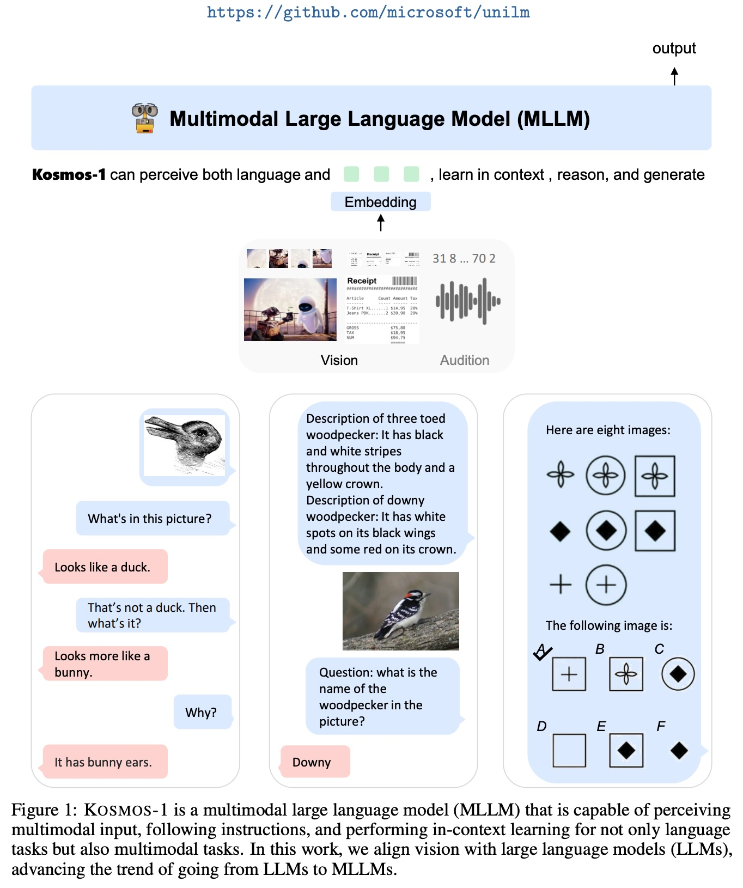
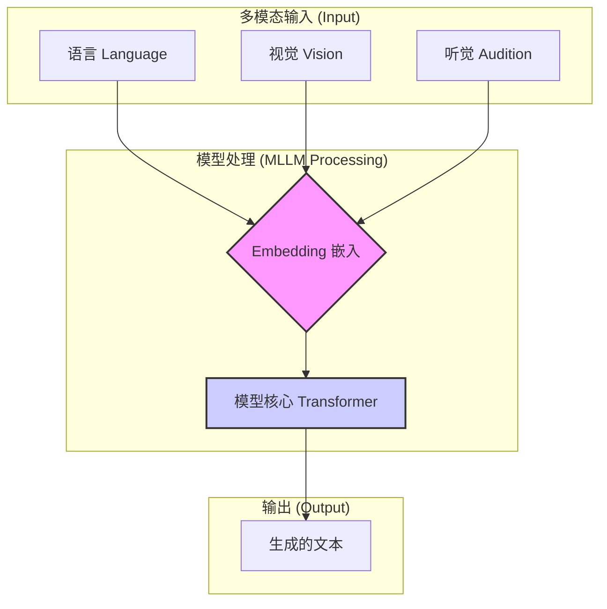
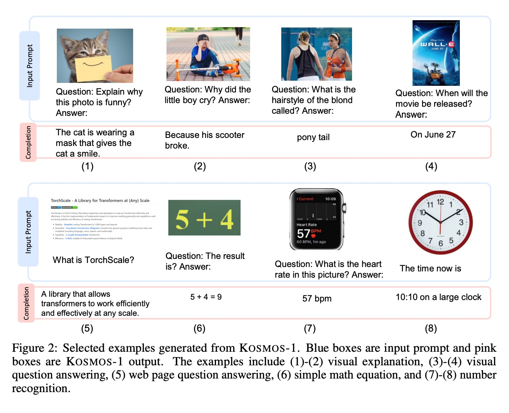
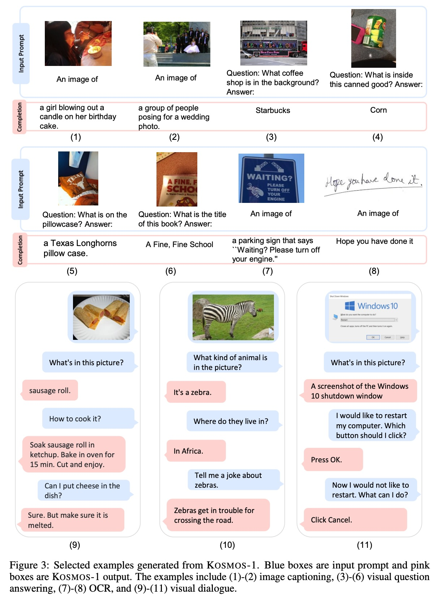
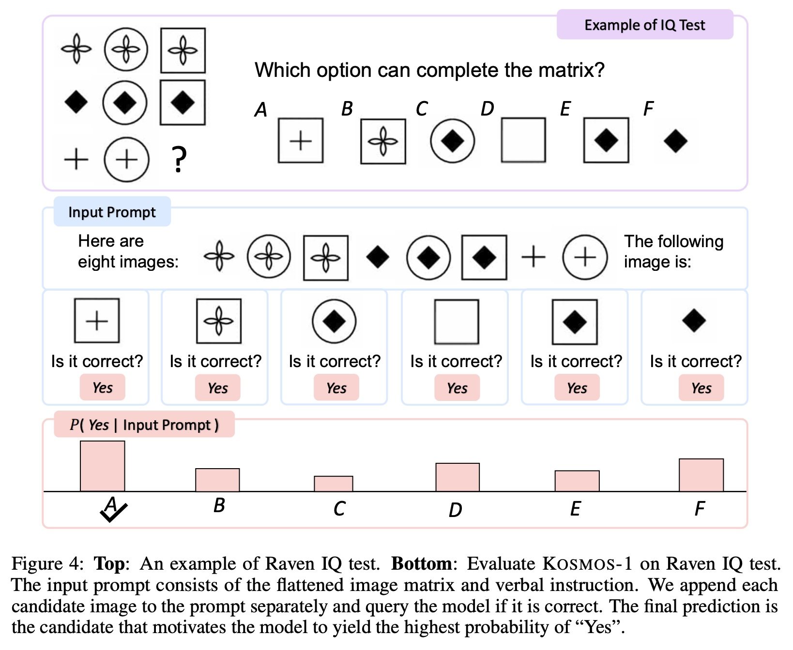
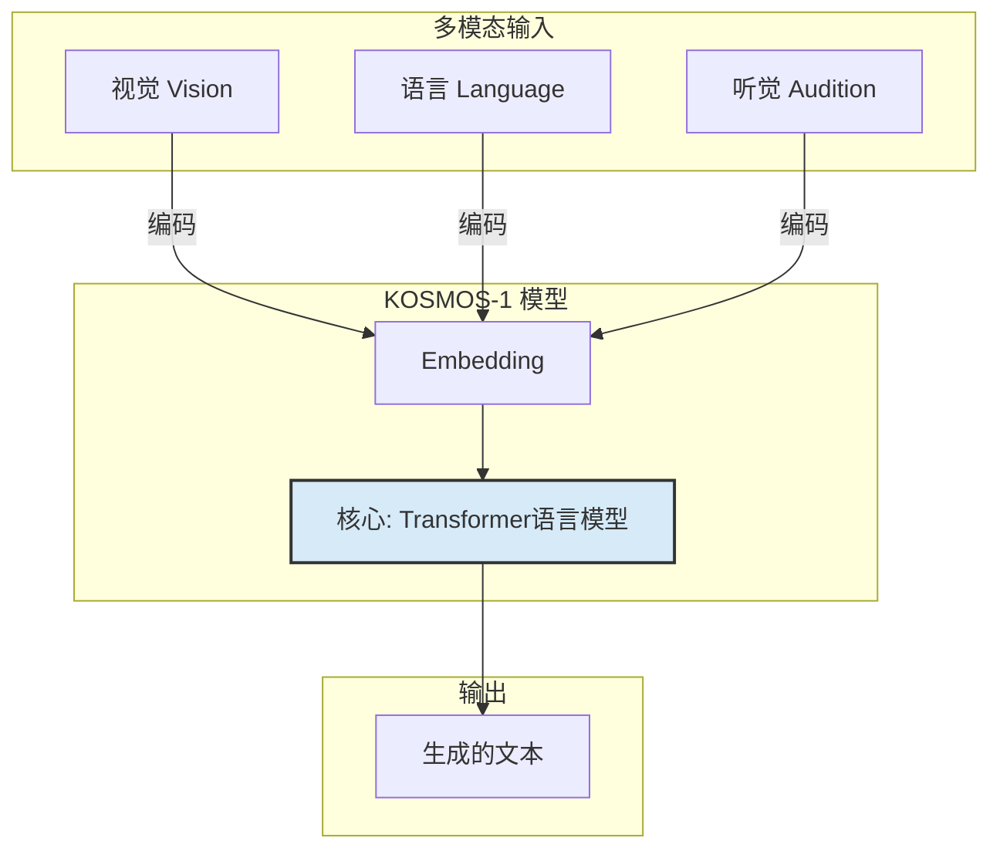
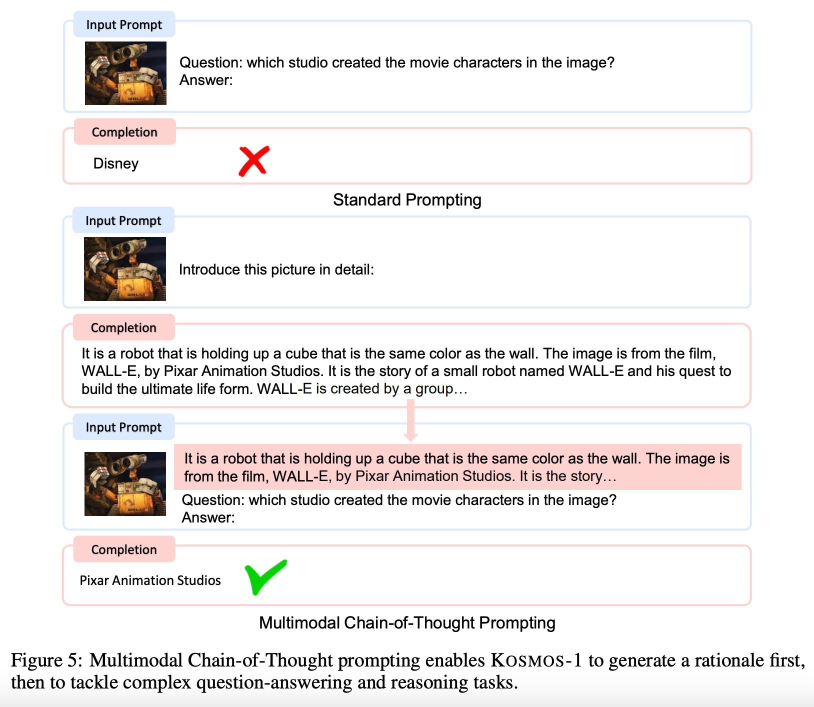
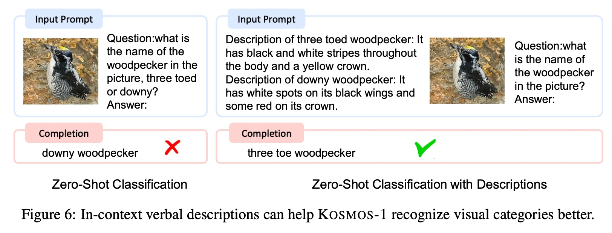
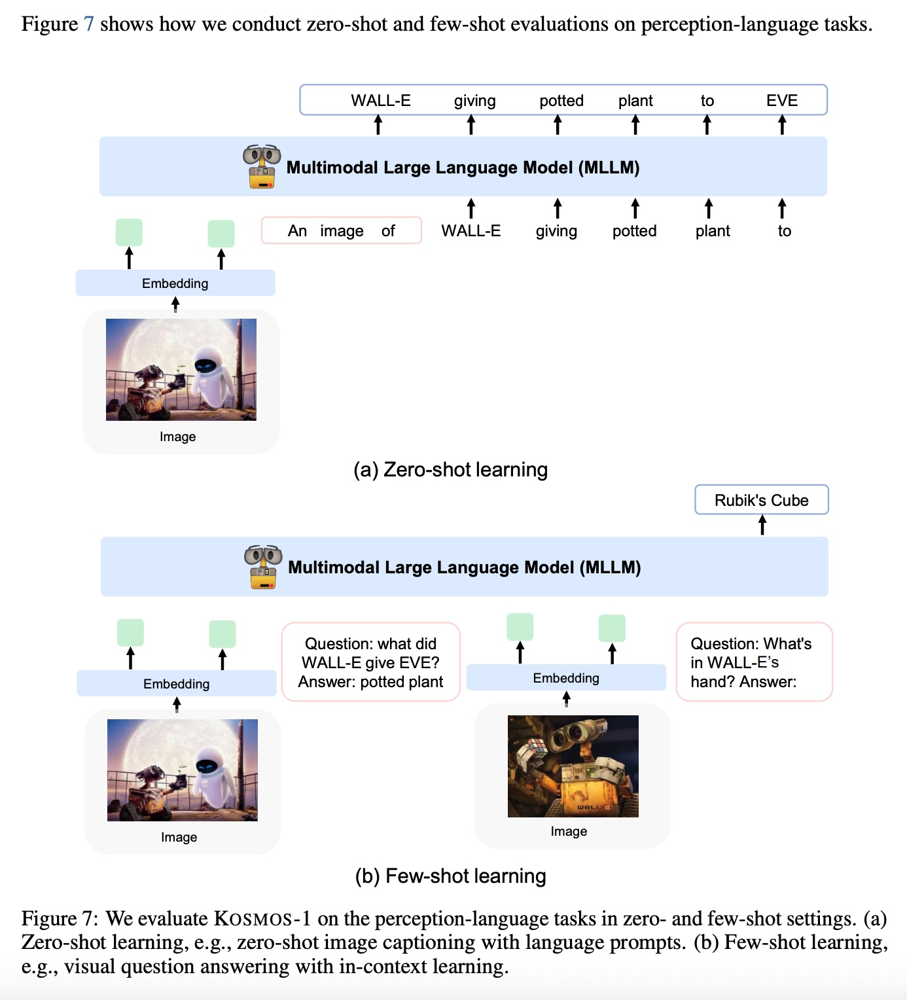

## AI论文解读 | Language Is Not All You Need: Aligning Perception with Language Models
        
### 作者        
digoal        
        
### 日期        
2025-08-31        
        
### 标签        
PostgreSQL , PolarDB , DuckDB , AI , 论文解读        
        
----        
        
## 背景  
      
https://arxiv.org/pdf/2302.14045        
  
提示:          
```          
读懂《Language Is Not All You Need: Aligning Perception with Language Models》这篇论文需要提前掌握哪些基础知识, 请使用中文通熟易懂的讲解这些基础知识, 可以引用论文中的图、表或使用Markdown支持的图形(text,mermaid等)增加解释性. 
  
使用中文通熟易懂的解读《Language Is Not All You Need: Aligning Perception with Language Models》这篇论文, 其中的关键内容请着重讲解, 可以引用论文中的图、表或使用Markdown支持的图形(text,mermaid等)增加解释性. 
  
提取《Language Is Not All You Need: Aligning Perception with Language Models》这篇论文中的重要术语, 使用中文对这些术语进行通熟易懂的讲解, 可以引用论文中的图、表或使用Markdown支持的图形(text,mermaid等)增加解释性. 
```     
  
## 1 前置知识 
  
好的，为了更好地理解《Language Is Not All You Need: Aligning Perception with Language Models》这篇论文，我们需要先掌握一些人工智能领域的基础知识。这篇论文介绍了一个名为 KOSMOS-1 的“多模态大语言模型 (Multimodal Large Language Model, MLLM)”，可以把它想象成一个既能理解文字又能“看见”图片，并能根据这些信息进行思考和回答的“超级大脑”。

下面我将用通俗易懂的中文，结合论文中的图表，为您讲解理解这篇论文所需的核心基础知识。

### 1\. 什么是大语言模型 (Large Language Models, LLMs)？

您可以将大语言模型（LLM）想象成一个饱读诗书、知识渊博的“语言大师”。通过在海量的文本数据（例如整个互联网的网页、所有的书籍）上进行学习，它掌握了语言的规律、事实知识以及一定的推理能力。

  * **核心能力**：LLM 的核心任务是“预测下一个词”。比如，当您输入“今天天气很好，我们一起去...”时，模型会根据它学到的知识，预测出下一个最可能的词是“公园”、“散步”或者“吃饭”。通过不断地预测下一个词，它就能生成完整的句子、段落甚至文章。
  * **通用接口**：正因为这种强大的文本生成能力，LLM 成为了一个“通用任务接口” 。无论您想让它做翻译、写总结、回答问题还是写代码，都可以通过文字指令（即“提示词”，Prompt）的方式来实现，而不需要为每个任务都单独训练一个新模型 。

### 2\. 什么是“多模态” (Multimodal)？

“模态”指的是信息的类型。我们人类通过多种模态感知世界：

  * **视觉模态**：眼睛看到的图像、视频。
  * **听觉模态**：耳朵听到的声音、语音。
  * **语言模态**：阅读和书写的文字。

传统的 LLM 只能处理文字这一种模态，就像一个只能通过阅读来学习的“书呆子”。而**多模态学习**，就是要让模型能够像人一样，同时理解和处理来自不同模态的信息。

这篇论文的核心就是将 LLM 从“单模态”升级为“多模态”，特别是加入了**视觉模态** 。这样一来，模型 KOSMOS-1 不仅能“阅读”，还能“看见”。

从论文的图1中，我们可以直观地看到 KOSMOS-1 如何处理多模态输入。它不仅能接收语言（Language）输入，还能接收视觉（Vision）和听觉（Audition）输入，并将这些不同类型的信息统一处理 。   



  * **图解**：上图展示了多模态模型的基本流程。不同模态的信息（文字、图片、声音）首先被转换成模型能够理解的数学表示（这个过程叫作 Embedding），然后一起送入模型的核心进行处理，最终生成统一的输出（通常是文本）。

### 3\. “在情境中学习” (In-context Learning) 是什么意思？

“在情境中学习” (In-context Learning) 是大语言模型一项非常神奇的能力。简单来说，就是**你不需要重新训练模型，只要在输入时给它几个例子（shots），它就能立刻学会如何完成类似的任务**。

  * **Zero-shot (零样本学习)**：不给任何例子，直接下达指令，考验模型对任务的“天然”理解能力。

      * **例子**：直接给 KOSMOS-1 一张图片，然后问：“图片里有什么？” 这就是 Zero-shot 。

  * **Few-shot (少样本学习)**：在指令中提供一两个或几个完整的例子，引导模型按照你期望的格式或逻辑来回答。

      * **例子**：在论文图2中5的“视觉问答”部分，我们可以这样实现 Few-shot 学习：   

        > **输入**：
        > （图片1：一只猫）
        > **问**：这是什么动物？ **答**：猫。
        > （图片2：一只狗）
        > **问**：这是什么动物？ **答**：狗。
        > （一张新的图片：一只鸟）
        > **问**：这是什么动物？ **答**：

        模型在看到前面两个例子后，就能理解任务模式，并正确回答“鸟”。KOSMOS-1 强大的地方在于，它不仅能在语言任务上进行 Few-shot 学习，还能在图文结合的多模态任务上这样做 。

### 4\. 什么是 Transformer 架构？

Transformer 是目前几乎所有大语言模型（包括 KOSMOS-1）的基础架构 。你可以把它想象成一个高效的信息处理工厂。它的核心是“注意力机制” (Attention Mechanism)。

  * **注意力机制**：当模型处理一句话时，注意力机制能让它判断句子中哪些词更重要，或者哪些词之间关系更紧密。在多模态场景下，这种机制还能帮助模型建立**文字和图片关键区域之间的联系**。例如，当问题是“图片中那个穿着红色衣服的男孩在做什么？”时，注意力机制会帮助模型重点关注图片中的“男孩”和他的“红色衣服”，并将这部分视觉信息与问题中的文字关联起来。

KOSMOS-1 使用的是一个仅包含 **Transformer 解码器 (Decoder)** 的因果语言模型 (Causal Language Model) 。这意味着它的工作方式严格遵循“从左到右”的顺序，根据已经出现的所有信息（无论是文字还是图片），来生成下一个词 。

### 5\. 论文中提到的几个关键任务

理解了以上基础知识后，我们来看看 KOSMOS-1 在论文中展示了哪些惊人的能力，这能帮助我们更好地理解其技术突破。

  * **视觉问答 (Visual Question Answering, VQA)**：看图回答问题。例如在图2中，模型能回答出“小男孩为什么哭？”是因为“他的滑板车坏了” 。   
  * **图像描述 (Image Captioning)**：用一句话描述图片内容。如图3所示，模型能生成“一个女孩在她生日蛋糕上吹蜡烛”的描述 。  
  * **OCR-Free 文本理解**：无需传统的 OCR (光学字符识别) 技术，直接“读取”并理解图片中的文字内容。如图2的例子（7），模型能直接从智能手表的图片中读出心率是“57 bpm” 。
  * **非语言推理 (Nonverbal Reasoning)**：这是一项更高阶的智能体现。论文用**瑞文智商测试 (Raven IQ test)** 来评估模型的能力。如图1右下角的例子，模型需要观察前8个图形的变化规律，从A-F六个选项中选出最后一个“？”处的正确图形 。这表明模型不仅能看懂具体事物，还能理解抽象的逻辑关系。  

        

| 任务类型 | 论文中的例子 (图号) | 任务描述 |
| :--- | :--- | :--- |
| **视觉问答** | 图2 (2), (3), (4) | 根据图片内容回答开放式问题 。 |
| **图像描述** | 图3 (1), (2) | 为图片生成准确的文字描述 。 |
| **OCR-Free** | 图2 (5), (7), (8) | 直接从图片中识别并理解文字或数字 。 |
| **非语言推理** | 图1 (右下), 图4 | 在不依赖语言的情况下，解决基于图形的逻辑推理问题 。 |

  * **表格总结**：上表总结了 KOSMOS-1 解决的几种核心多模态任务。

### 总结

要读懂《Language Is Not All You Need》这篇论文，您需要掌握以下几个关键概念：

1.  **大语言模型 (LLM)**：一个强大的文本生成工具，是模型智能的基础。
2.  **多模态 (Multimodal)**：让模型能够像人一样，同时处理文本、图像等多种信息。这是 KOSMOS-1 的核心创新。
3.  **在情境中学习 (In-context Learning)**：通过提供少量例子（Few-shot）或不提供例子（Zero-shot），让模型快速适应新任务，而无需重新训练。
4.  **Transformer 架构**：支撑 LLM 的核心技术，其注意力机制是关联不同信息（如文字和图像）的关键。

掌握了这些知识，您就可以更好地理解 KOSMOS-1 是如何通过将“感知”（视觉）与强大的“语言模型”相结合，从而在各种复杂的任务中展现出惊人能力的。
  
## 2 解读论文 
  
好的，这篇论文《Language Is Not All You need: Aligning Perception with Language Models》（语言并非你所需的全部：将感知与语言模型对齐）介绍了一项突破性的工作——一个名为 **KOSMOS-1** 的新型人工智能模型。

简单来说，这篇论文的核心思想是：**仅靠语言本身不足以实现通用人工智能 (AGI)，模型需要像人一样拥有感知世界的能力（比如视觉），才能变得更强大、更聪明 。** KOSMOS-1 正是朝着这个方向迈出的重要一步，它是一个**多模态大语言模型 (MLLM)**，能够同时理解文本和图像，并在此基础上进行推理和生成内容 。

下面，我将为您深入解读这篇论文的关键内容。

### 1\. 什么是 KOSMOS-1？—— 从“书呆子”到“全能选手”

传统的大语言模型 (LLMs) 就像一个博览群书但双目失明的“书呆子”，它们只能处理文本信息 。而 KOSMOS-1 则是一个“全能选手”，它不仅能“读万卷书”（处理语言），还能“行万里路”（感知视觉世界） 。

**核心定义**：KOSMOS-1 是一个多模态大语言模型 (MLLM)，它能够：

  * **感知多种模态**：接收文本、图像等多种输入信息 。
  * **在情境中学习 (In-context Learning)**：通过少量示例（Few-shot）甚至零示例（Zero-shot）快速学会新任务 。
  * **遵循指令 (Instruction Following)**：理解并执行人类用自然语言下达的命令 。

如下面的流程图所示，KOSMOS-1 将各种模态的输入（如视觉、听觉）统一转换（Embedding）成语言模型能理解的格式，然后由一个强大的基于 Transformer 的语言模型进行处理，最终生成文本输出 。



  * **图解**：这个流程展示了 KOSMOS-1 如何将视觉等感知信息与语言信息融合，实现“所见即可说、所见即可答” 。

### 2\. KOSMOS-1 是如何训练的？—— 海量数据的“喂养”

为了让 KOSMOS-1 具备强大的多模态能力，研究人员使用了网络规模的多模态语料库对其进行从零开始的训练 。这些数据主要分为三类：

| 数据类型 | 描述 | 作用 |
| :--- | :--- | :--- |
| **纯文本语料库** | 来自 The Pile 和 Common Crawl 的海量网页文本和书籍 。 | 训练模型强大的语言理解、生成、上下文学习和指令遵循能力 。 |
| **图像-文本对** | 包含数十亿级别的图片及其对应的文字描述，如 LAION-2B 数据集 。 | 建立视觉和语言之间的基础对齐，让模型知道“图片A”和“文字B”描述的是同一件事 。 |
| **图文交错数据** | 从网页中收集的包含文本和图像任意穿插的文档 。 | 让模型学会在复杂的上下文中理解图文关系，提升其少样本学习能力 。 |

训练的目标很简单，就是**预测下一个词 (Next-token Prediction)** 。无论是处理纯文本还是图文混排内容，模型要做的永远是根据之前看到的所有信息（包括图片），来生成下一个最合适的文本词元 。

### 3\. KOSMOS-1 带来了哪些新能力？—— 不仅仅是看图说话

通过将感知与语言对齐，KOSMOS-1 展现了许多传统 LLM 不具备的、令人惊艳的新能力。

#### **(1) 非语言推理能力：通过瑞文智商测试**

这是论文的一大亮点。瑞文推理测验 (Raven's Progressive Matrices) 是衡量人类流体智商（即抽象逻辑推理能力）的经典方法 。KOSMOS-1 是**首个能够在该任务上进行零样本测试 (Zero-shot) 的模型** 。

如下图（源自论文图4）所示，模型需要观察一个 3x3 矩阵中前 8 个图形的规律，并从 6 个选项中选出最后一个缺失的图形 。

  

*图片来源：论文 Figure 4*

**结果**：KOSMOS-1 的准确率达到了 **22% - 26%**，显著高于 17% 的随机猜测基线 。这表明它初步具备了理解抽象视觉模式并进行逻辑推理的能力，这是迈向更高层次智能的重要标志 。

#### **(2) OCR-Free：直接“阅读”图片中的文字**

传统方法需要先用 OCR 工具提取图片中的文字，再交给语言模型处理。KOSMOS-1 则可以**跳过 OCR，直接从像素层面理解图像中的文本含义** 。

在 Rendered SST-2 任务中，句子被渲染成图片，模型需要直接判断图片中句子的情感 。结果显示，KOSMOS-1 的表现优于 Flamingo-9B 等其他模型，并且它并未像 Flamingo 那样在输入中额外提供 OCR 提取的文本 。

#### **(3) 多模态思维链 (Multimodal Chain-of-Thought)**

思维链 (CoT) 提示能让模型通过生成中间推理步骤来解决复杂问题 。KOSMOS-1 将这一能力扩展到了多模态领域 。

如下图（源自论文图5）所示，模型可以分两步走：

1.  **生成理由 (Rationale)**：先用一个提示（如“详细介绍这张图片”）引导模型生成对图片内容的详细描述 。
2.  **最终回答**：将第一步生成的描述作为上下文，再提出具体问题，从而得到更准确的答案 。

  

*图片来源：论文 Figure 5*

**结果**：在 Rendered SST-2 任务上，使用多模态 CoT 将准确率从 **67.1%** 大幅提升至 **72.9%** 。这证明通过引导模型先“看懂”再“思考”，可以显著增强其复杂推理能力 。

#### **(4) 用自然语言描述来指导图像分类**

传统的图像分类是给一张图，输出一个标签（如“猫”）。KOSMOS-1 可以做得更精细、更灵活：**通过提供详细的文字描述来定义分类规则** 。

例如，要区分两种外形相似的鸟，可以像下图（源自论文图6）一样，向模型提供它们的特征描述。

  * **三趾啄木鸟**：“全身有黑白条纹，头顶有黄色羽毛” 。
  * **绒啄木鸟**：“黑色翅膀上有白点，头顶有红色羽毛” 。

  

*图片来源：论文 Figure 6*

**结果**：在有描述的情况下，分类准确率从 **61.7%** 飙升至 **90.0%** 。这表明 KOSMOS-1 能够深刻理解语言指令，并将语言概念与视觉特征精确地对应起来 。

### 4\. 什么是跨模态迁移 (Cross-modal Transfer)？

这是 KOSMOS-1 另一个非常重要的特性，指的是**在一个模态上学到的知识或能力可以“迁移”到另一个模态上** 。

  * **从语言迁移到多模态**：论文发现，仅使用**纯文本指令数据**对模型进行微调（Language-Only Instruction Tuning），就能显著提升其在**多模态任务**（如视觉问答）上的表现 。这意味着模型从语言中学到的“遵循指令”的能力，成功地泛化到了处理图像的任务上 。

  * **从多模态迁移到语言**：反之，多模态的训练也让模型在**纯语言任务**上变得更强，尤其是在**视觉常识推理**方面 。例如，当被问到“沙发和猫哪个更大？”或“天空是什么颜色？”这类不提供图片的问题时，KOSMOS-1 的表现显著优于只用文本数据训练的同规模 LLM 。这是因为它通过看大量的图片，学到了关于真实世界物体的颜色、大小等物理常识，而这些知识在纯文本中可能没有被充分描述 。

### 结论

《Language Is Not All You Need》通过 KOSMOS-1 的成功实践，有力地证明了**将感知（尤其是视觉）与大语言模型对齐是通往更通用、更强大人工智能的关键路径** 。

KOSMOS-1 不仅在传统的图文任务上表现出色，更在非语言推理、OCR-Free 理解、多模态思维链等多个方面展现了开创性的能力。它证明了 MLLM 可以学习和迁移跨模态的知识，从而获得单一模态模型无法企及的深度理解和推理能力。这为未来构建能够与真实世界进行更复杂交互的 AI 系统（如机器人、文档智能）打开了新的大门 。
  
## 3 术语 
  
好的，这篇论文《Language Is Not All You Need: Aligning Perception with Language Models》引入了多个重要的人工智能术语。下面我将提取其中的核心术语，并用通俗易懂的中文进行讲解，同时引用论文中的图表来帮助理解。

### 1\. 多模态大语言模型 (Multimodal Large Language Model, MLLM)

  * **讲解**：
    您可以把传统的大语言模型（LLM）想象成一个只通过阅读学习的“学霸”，它只能处理文字。而**多模态大语言模型 (MLLM)** 则是一个更全面的“超级学霸”，它不仅能阅读文字，还能“看见”图像、“听见”声音，并将这些不同类型的信息（即“模态”）融合在一起进行理解和思考 。KOSMOS-1 就是一个典型的 MLLM，它致力于将视觉感知能力与强大的语言模型对齐 。

  * **图解** (源自论文图1)：   
    下图直观地展示了 MLLM 的工作原理。不同模态（如视觉、听觉、语言）的输入被统一编码（Embedding）后，送入一个核心的语言模型进行处理，最终生成统一的输出（通常是文本） 。

    ```mermaid
    graph TD
        subgraph "输入 (Input)"
            A[视觉 Vision]
            B[语言 Language]
            C[听觉 Audition]
        end
        subgraph "MLLM 处理"
            A --> D{Embedding 嵌入}
            B --> D
            C --> D
            D --> E["核心处理单元<br>(Transformer Language Model)"]
        end
        subgraph "输出 (Output)"
            E --> F[生成的文本]
        end
    ```

### 2\. 在情境中学习 (In-context Learning)

  * **讲解**：
    这是大语言模型一项非常强大的能力，指的是模型可以**在不更新自身参数（即无需重新训练）的情况下，仅通过输入时提供的一些例子（上下文情境）来学习并完成新任务** 。它主要分为以下两种形式：

      * **零样本学习 (Zero-shot Learning)**：不给模型任何示例，直接下达指令，考验它的泛化能力 。例如，直接给 KOSMOS-1 一张图片问“这张图为什么好笑？”，模型需要自行理解并回答 。
      * **少样本学习 (Few-shot Learning)**：在输入中提供一个或多个完整的“问题-答案”示例，引导模型模仿这些示例的模式来解决新问题 。

  * **图解** (源自论文图)：
    如下图所示，少样本学习就像是给模型“打个样”。通过提供几个图文问答的例子，模型就能学会如何回答关于一张新图片的问题。   

    *图片来源：论文 Figure 7(b)*

### 3\. OCR-Free 语言理解

  * **讲解**：
    OCR (Optical Character Recognition, 光学字符识别) 是传统的将图片中的文字转换成可编辑文本的技术。而 **OCR-Free** 意味着模型可以**跳过这个步骤，直接从图像的像素中“读取”并理解文字的含义** 。这是一种更高级的视觉理解能力。

  * **示例** (源自论文图2)：   
    在图2的示例 (7) 和 (8) 中，KOSMOS-1 直接从智能手表和时钟的图片中识别出了心率“57 bpm”和时间“10:10” 。这表明它并非依赖外部 OCR 工具，而是内化了这种识别能力 。

### 4\. 非语言推理 (Nonverbal Reasoning)

  * **讲解**：
    这是一种不依赖语言文字，仅通过观察和分析图形、符号等抽象概念来解决问题的能力，是衡量高级智能的重要指标 。为了评测这项能力，论文引入了**瑞文智商测试 (Raven's Progressive Matrices)** 。

  * **示例** (源自论文图1和图4)：       
    在瑞文测试中，模型需要观察一个 3x3 矩阵中的 8 个图形，找出其中的逻辑规律，并从多个选项中选出能填补最后一个空白位置的正确图形 。KOSMOS-1 是首个能够在此类任务上进行零样本测试的模型 。

### 5\. 多模态思维链提示 (Multimodal Chain-of-Thought Prompting)

  * **讲解**：
    “思维链”(Chain-of-Thought, CoT) 是一种引导语言模型通过生成一系列中间推理步骤来解决复杂问题的方法 。**多模态思维链**则将这一技术应用于图文任务 。它将一个复杂的多模态问题分解为两步：

    1.  **生成理由 (Rationale)**：首先，引导模型对图片内容进行详细的文字描述 。
    2.  **最终回答**：然后，将生成的描述作为上下文，再提出具体问题，让模型基于更丰富的信息得出最终答案 。

  * **结果**：
    论文在 Rendered SST-2（一个 OCR-Free 情感分类任务）上验证了该方法。结果表明，使用多模态思维链提示，模型的准确率得到了显著提升，比标准提示方式高出 5.8 个百分点 。这证明了先引导模型“看懂”再“思考”的有效性 。

### 6\. 跨模态迁移 (Cross-modal Transfer)

  * **讲解**：
    指的是模型将在一种模态（如语言）上学到的知识和能力，成功地应用或“迁移”到另一种模态（如视觉）的任务上，反之亦然 。

  * **论文中的发现**：

    | 迁移方向 | 描述 | 效果 |
    | :--- | :--- | :--- |
    | **语言 → 多模态** | 仅用**纯文本**的指令数据对模型进行微调 。 | 显著提升了模型在**视觉问答**等图文任务上的表现 。这说明模型从语言中学到的“指令遵循”能力泛化到了多模态场景 。 |
    | **多模态 → 语言** | 通过观看大量图片进行多模态训练 。 | 提升了模型在**纯文本**的视觉常识推理任务上的性能 。例如，模型能更好地回答“天空是什么颜色”这类问题，因为它通过看图学到了真实世界的知识 。 |
  
## 参考        
         
https://arxiv.org/pdf/2302.14045    
        
<b> 以上内容基于DeepSeek、Qwen、Gemini及诸多AI生成, 轻微人工调整, 感谢杭州深度求索人工智能、阿里云、Google等公司. </b>        
        
<b> AI 生成的内容请自行辨别正确性, 当然也多了些许踩坑的乐趣, 毕竟冒险是每个男人的天性.  </b>        
  
  
