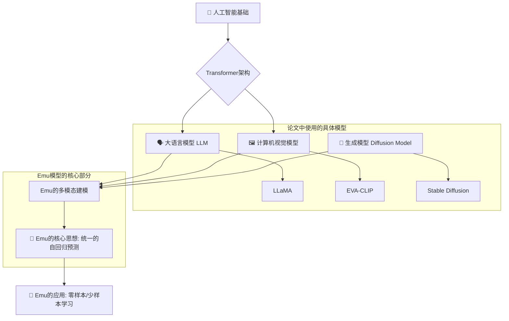
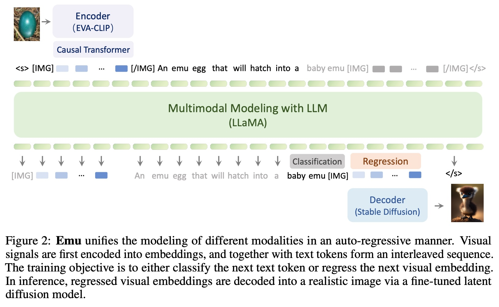
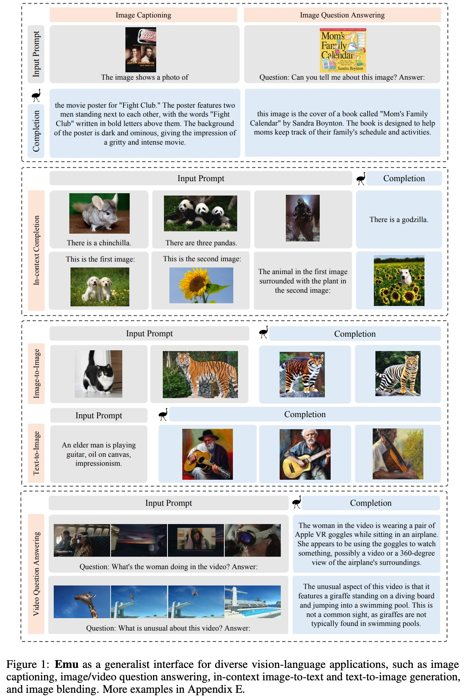
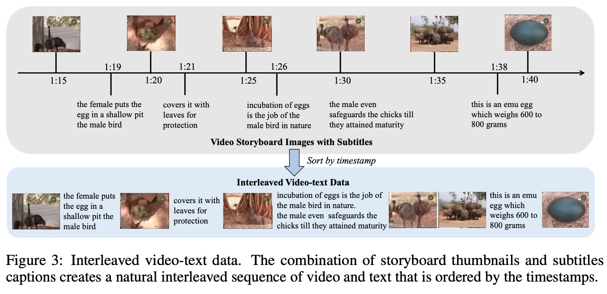
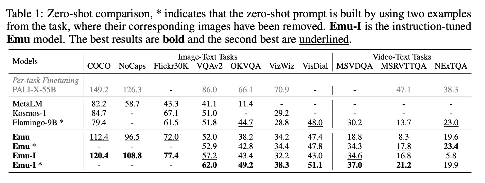
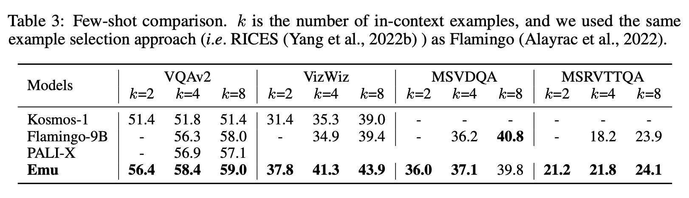
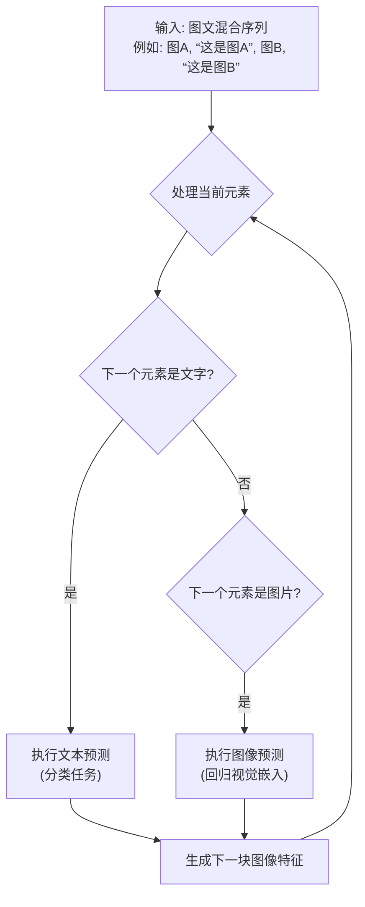

## AI论文解读 | EMU: GENERATIVE PRETRAINING IN MULTIMODALITY
        
### 作者        
digoal        
        
### 日期        
2025-08-31        
        
### 标签        
PostgreSQL , PolarDB , DuckDB , AI , 论文解读        
        
----        
        
## 背景  
      
https://arxiv.org/pdf/2307.05222        
  
提示:          
```          
读懂《EMU: GENERATIVE PRETRAINING IN MULTIMODALITY》这篇论文需要提前掌握哪些基础知识, 请使用中文通熟易懂的讲解这些基础知识, 可以引用论文中的图、表或使用Markdown支持的图形(text,mermaid等)增加解释性. 
  
使用中文通熟易懂的解读《EMU: GENERATIVE PRETRAINING IN MULTIMODALITY》这篇论文, 其中的关键内容请着重讲解, 可以引用论文中的图、表或使用Markdown支持的图形(text,mermaid等)增加解释性. 
  
提取《EMU: GENERATIVE PRETRAINING IN MULTIMODALITY》这篇论文中的重要术语, 使用中文对这些术语进行通熟易懂的讲解, 可以引用论文中的图、表或使用Markdown支持的图形(text,mermaid等)增加解释性. 
```     
  
## 1 前置知识 
  
好的，为了完全理解《EMU: GENERATIVE PRETRAINING IN MULTIMODALITY》这篇论文，你需要掌握一些人工智能领域的基础知识。我会用通俗易懂的中文为你讲解，并结合论文中的图表来帮助理解。

### 核心概念地图

在深入细节之前，我们可以先把需要了解的基础知识想象成一块块积木，Emu模型就是用这些积木搭建起来的。



下面我们来逐一讲解这些“积木”。

-----

### 1\. Transformer架构：AI模型的“瑞士军刀”

Transformer是这篇论文乃至当今大多数高级AI模型（包括ChatGPT）的底层核心架构。你可以把它理解成一个极其强大的信息处理工厂。

  * **核心能力**：处理序列数据。无论是一段文字、一段代码，还是一系列图片特征，只要能表示成一个序列，Transformer就能处理。
  * **关键技术**：“注意力机制”（Attention Mechanism）。这个机制允许模型在处理一个序列时，动态地判断哪些部分的信息更重要，应该“多加注意”。比如，在翻译“The cat sat on the mat”时，模型在处理“sat”（坐）这个词时，会特别关注主语“cat”（猫），因为是猫发出的动作。

Emu模型从头到尾都贯穿着Transformer架构，用它来理解文字、分析图像特征，并将两者融合 。

### 2\. 大语言模型 (LLM - Large Language Model)

LLM是专门用来处理和生成文本的模型，近年来取得了巨大突破。

  * **训练方式**：**自回归 (Autoregressive)**。这听起来复杂，但原理很简单，就是“接龙”。给模型一句话的前半部分，让它预测下一个词是什么。比如，输入“今天天气真”，模型可能会预测出“好”。它通过在海量文本数据（比如整个互联网的文字）上反复做这种“接龙”游戏，学会了语法、知识甚至一定程度的推理能力 。
  * **论文中的应用**：Emu的多模态建模部分，就使用了一个强大的开源LLM——**LLaMA** 。Emu的目标就是让这个原本只会“文字接龙”的模型，学会“图文混合接龙”。

### 3\. 计算机视觉模型 (Vision Model)

这类模型用于让计算机“看懂”图片或视频。

  * **工作流程**：模型接收一张图片（由像素点构成），通过复杂的计算，将其转换成一串数字，这串数字被称为 **“特征嵌入” (Embeddings)** 。这串数字就像是图片内容的“DNA”，浓缩了图片的核心信息（比如图片里有一只猫，背景是草地等）。
  * **论文中的应用**：Emu使用了一个名为 **EVA-CLIP** 的视觉模型作为它的“眼睛” 。当Emu看到一张图片时，EVA-CLIP会先把这张图片转换成浓缩的数字信息（视觉嵌入），然后再交给后续的模型进行处理 。

### 4\. 生成模型 (Generative Model) - 尤其是 Diffusion Model

生成模型是AI绘画的核心技术，它的任务和视觉模型相反：不是“看懂”图片，而是“画出”图片。

  * **Diffusion Model (扩散模型) 原理**：可以想象成一个“去噪”的过程。
    1.  先给一张清晰的图片，然后不断地往上加噪点，直到它变成一片完全随机的雪花。
    2.  训练一个模型，让它学习如何从满是噪点的雪花图中，一步步把噪点去掉，还原出原始的清晰图片。
    3.  学会这个“去噪”本领后，我们就可以给它一张纯粹由随机噪点构成的图，再给一些文字指令（比如“一只正在弹吉他的猫”），模型就能“照着”指令，把噪点变成符合描述的全新图片。
  * **论文中的应用**：Emu的**视觉解码器 (Visual Decoder)** 部分，使用了著名的AI绘画模型 **Stable Diffusion** 。当Emu决定要生成一张图片时，它会先生成对应的“视觉嵌入”（图片DNA），然后把这个“DNA”交给Stable Diffusion，由它来完成具体的绘画工作 。

### 5\. Emu的核心思想：统一的自回归预测 (Unified Autoregressive Objective)

这是理解这篇论文**最关键**的一点。

传统的多模态模型通常只在文本上做“接龙”游戏。它们看到一张图，然后根据图去预测接下来该说什么话 。但它们不会去“预测”图片本身。

Emu的创新之处在于，它把**图片也变成了“接龙”游戏的一部分**。

  * **Emu的训练过程**：
    1.  将输入的文本和图片（通过EVA-CLIP转换成视觉嵌入）混合成一个统一的序列 。
    2.  模型从左到右处理这个序列，在每个位置，它都要预测**下一个元素**是什么。
    3.  如果上一个元素是文本，它就用“分类”的方式预测下一个词（从词典里选一个）。
    4.  如果上一个元素是图片的一部分（视觉嵌入），它就用“回归”的方式预测下一个视觉嵌入（生成一串连续的数字）。

我们可以通过论文的**图2**来直观理解这个过程：   

  * **输入 (Input)**：序列的开头是一张鸸鹋蛋的图片 `[IMG]...[/IMG]`，后面跟着文字“An emu egg that will hatch into a baby emu”（一个将孵化成小鸸鹋的鸸鹋蛋），最后又是一个图片占位符 `[IMG]...[/IMG]` 。
  * **处理 (Processing)**：LLaMA模型依次读取这个序列。
  * **预测 (Prediction)**：
      * 当它读完文字后，它需要预测下一个元素。因为后面是图片占位符 `[IMG]`，所以它开始预测图片的“视觉嵌入” 。
      * 对文字部分，它做的是**分类 (Classification)** 任务 。
      * 对图片部分，它做的是**回归 (Regression)** 任务 。

通过这种统一的训练方式，Emu不仅能理解图文，还能在任意图文序列的后面，继续生成文字**或者**生成图片，成为了一个真正的“通才” 。

### 6\. 零样本/少样本学习 (Zero-shot / Few-shot Learning)

这是评估强大AI模型能力的一种方式。

  * **零样本 (Zero-shot)**：在没有任何示例的情况下，直接让模型完成一个新任务。比如，模型从未专门训练过“看图回答冷知识问题”，但你给它一张蒙娜丽莎的画像，问“这幅画的作者是谁？”，它能答出“达芬奇”，这就是零样本能力 。
  * **少样本 (Few-shot)**：在执行任务前，给模型看一两个（或很少量）的例子作为“示范”，让它照着学。比如，在论文**图1**的“In-context Completion”部分，你给它“chinchilla(龙猫图) -\> There is a chinchilla.” 和 “pandas(熊猫图) -\> There are three pandas.” 两个例子，然后给它一张哥斯拉的图，它就能模仿着生成“There is a godzilla.” 。

Emu在这两方面都表现出色（如**表1**和**表3**所示），证明了其强大的泛化和上下文学习能力 。

        

### 总结

要读懂Emu这篇论文，你需要提前了解：

1.  **Transformer架构**：它是模型处理信息的基础框架。
2.  **大语言模型 (LLM)**：理解模型如何通过“接龙”（自回归）学习和生成文本。
3.  **视觉模型**：理解模型如何将图片转换成可处理的数字“嵌入”。
4.  **Diffusion模型**：理解模型如何根据指令从无到有地“画”出图片。
5.  **Emu的核心创新**：将图片和文字统一纳入一个“万物皆可接龙”的自回归框架中，实现了真正的图文双向生成。
6.  **零/少样本学习**：这是衡量模型智能程度和泛化能力的重要标尺。

掌握了这些基础知识后，你就能更好地理解Emu是如何巧妙地将这些技术融合在一起，打造出一个强大的多模态通用模型的。
  
## 2 解读论文 
  
好的，我们来通俗易懂地解读一下《EMU: GENERATIVE PRETRAINING IN MULTIMODALITY》这篇重磅论文。

简单来说，这篇论文发布了一个名为 **Emu** 的多模态大模型。你可以把它想象成一个既会看、又会说、还会画画的“全能AI”。它最大的特点是**只用一个模型、一种训练方法**，就同时学会了理解图文（看图说话、回答问题）和生成图文（写文章、AI绘画）这两件看似不同的事情 。

-----

### 一、Emu要解决的核心问题是什么？

在Emu之前，很多多模态模型是“偏科生”。比如，一些模型（如Flamingo）很擅长“看图说话”，你给它一张图片，它能生成详细的描述或回答相关问题。但你让它根据文字画一张图，它就无能为力了。而且，它们在训练时，通常只学习预测文字，视觉部分的能力是固化不变的，这限制了模型的潜力 。

Emu的目标就是打破这种壁垒，培养一个不偏科的“通才”，让一个模型就能处理所有和图文相关的输入输出任务 。

### 二、关键突破：统一的“万物皆可接龙”训练法

这是Emu最核心、最巧妙的创新。传统语言模型（比如GPT）的训练方式是“文字接龙”，即根据前面的文字预测下一个词。Emu则提出了一种更广义的“接龙”游戏：**一个混合了文字和图像的序列，模型要做的永远是预测下一个元素是什么** 。

这个过程可以用论文中的**图2**清晰地展示：   

我们来分解一下这个“接龙”游戏是怎么玩的：

1.  **统一序列化**：模型接收到的不再是单纯的文字，而是一个图文混排的序列 。比如上图的输入是 `[一张鸸鹋蛋图片]` + `文字描述` + `[一个图片占位符]`。
2.  **预测下一个元素**：模型从左到右处理这个序列，在每一步都进行预测 。
      * 当它处理到文字“...baby emu”时，它发现下一个是图片占位符`[IMG]`，于是它就开始**生成（回归）代表图像信息的“视觉嵌入”** 。
      * 当它处理到图片时，它会预测下一段文字是什么，这时它执行的是**预测（分类）下一个文本单词**的任务 。

这个训练目标可以用下面的流程图来简化理解：



通过这种方式，Emu在一个统一的框架下，自然而然地学会了两种能力：

  * **理解能力**：当输入是图片，输出是文字时，它就在做“看图说话”。
  * **生成能力**：当输入是文字，输出是“视觉嵌入”时，它就在为“AI绘画”做准备 。

### 三、Emu的“三驾马车”：模型架构解读

为了实现上述目标，Emu的架构由几个预训练好的强大组件“组装”而成，各司其职 ：

1.  **视觉编码器 (眼睛) - EVA-CLIP**：负责将输入的图片或视频帧转换成计算机能理解的一串数字，即“视觉嵌入” 。
2.  **多模态建模 (大脑) - LLaMA**：这是一个强大的大语言模型，是Emu的核心。它负责处理混合了文字和视觉嵌入的序列，并进行“万物接龙”的预测任务 。
3.  **视觉解码器 (画笔) - Stable Diffusion**：当大脑（LLaMA）生成了代表新图像的“视觉嵌入”后，这个组件负责将这些抽象的数字“翻译”成一张我们能看到的、逼真的图片 。

此外，还有一个关键的“适配器”叫**Causal Transformer**，它能将视觉编码器产生的2D图像特征，转换成更适合LLaMA处理的1D因果序列，确保图像信息能被顺利地整合进“接龙”游戏里 。

### 四、Emu的“食物”：丰富多样的训练数据

一个强大的模型离不开海量且多样化的数据。Emu的强大能力很大程度上归功于它“吃”了各种形式的多模态数据 ：

  * **常规图文对**：如LAION-2B数据集，包含图片和其网络描述文字 。
  * **图文交错文档**：如网页和在线文章，图片和文字自然地穿插在一起，这对于学习上下文理解至关重要 。
  * **视频与文本**：Emu还创新性地利用了视频数据。它引入了一个名为**YT-Storyboard-1B**的数据集，这个数据集包含了YouTube视频的故事板（关键帧截图）和对应的字幕 。

如论文**图3**所示，视频的故事板和字幕按时间戳排序后，天然地形成了一个高质量的图文交错序列，为模型提供了带有时间顺序、因果关系的丰富学习材料 。   

### 五、Emu能做什么？—— 全能的通用接口

得益于其独特的训练方式和多样化的数据，Emu展现出了惊人的“通才”能力。论文的**图1**就像是Emu的能力展示板：   

  * **基础任务**：高质量的图像描述和视觉问答 。
  * **上下文学习**：能根据你给出的几个例子，领悟任务意图并举一反三。例如，你给它看“龙猫图 -\> 这是龙猫”，它就能学会看图识物 。
  * **图生图/文生图**：既能根据文字生成图片，也能参照一张图片生成另一张风格或内容相关的图片 。
  * **视频理解**：能够回答关于视频内容的问题，例如视频里的人在做什么，或者视频里有什么不寻常的地方 。

在各项标准测试中，Emu的表现也远超之前的模型。例如，在**表1**的零样本（即不给任何例子直接测试）评估中，Emu在COCO图像描述任务上获得了112.4的CIDEr分数，大幅领先Flamingo-9B的79.4分 。   

### 总结

Emu论文的核心贡献可以概括为以下几点：

1.  **一个统一的目标**：通过“预测下一个元素”（无论是文字还是图像特征）的统一自回归目标，将多模态的理解和生成任务无缝整合到一个模型中 。
2.  **一个通用的接口**：构建了一个既能处理图文输入，也能生成图文输出的通用模型，在图像描述、视觉问答和文生图等多个任务上都表现出色 。
3.  **一种新的数据源**：有效利用了带有时间戳的视频故事板和字幕，为多模态预训练提供了一种规模庞大且信息丰富的交错数据源 。

简而言之，Emu为构建更通用、更强大的多模态AI基础模型提供了一个简洁而有效的范式，是该领域一个重要的里程碑。
  
## 3 术语 
  
好的，这里是论文《EMU: GENERATIVE PRETRAINING IN MULTIMODALITY》中一些重要术语的中文解读，旨在帮助您更轻松地理解其核心概念。

-----

### 1\. 多模态基础模型 (Multimodal Foundation Model)

  * **中文讲解**：这是一个“全能型”的AI基础模型，能够同时处理和理解多种不同类型的信息（模态），比如文字、图像、视频等 。它不像一些专门处理文本或专门处理图像的模型，Emu的目标是成为一个可以无缝生成图像和文本的“通才” 。
  * **通俗比喻**：可以把它想象成一个既懂多国语言（文字），又能欣赏和创作艺术画作（图像）的人。你可以用中文和他交流，他能用画画来回应你，反之亦然。

### 2\. 统一自回归目标 (Unified Autoregressive Objective)

  * **中文讲解**：这是Emu模型训练方法的核心。所谓“自回归”就像玩“句子接龙”，模型根据前面的内容预测下一个内容 。Emu的创新之处在于，它玩的不是单纯的“文字接龙”，而是一个“图文混合接龙” 。无论序列中上一个元素是文字还是图像的一部分，它都统一地去预测下一个元素 。

      * 如果下一个元素是文本，模型会执行**分类**任务，从词汇表中选择最合适的词 。
      * 如果下一个元素是图像，模型则执行**回归**任务，生成代表图像特征的连续数字（视觉嵌入） 。

  * **图解**：论文中的**图2**完美诠释了这一过程。模型在处理完文本后，开始“回归”生成代表下一张图像的视觉嵌入。   

    *上图展示了Emu模型如何在一个序列中，对文本部分进行分类预测，对图像部分进行回归预测 。*

### 3\. 图文视频交错数据 (Interleaved Image, Text and Video)

  * **中文讲解**：这指的是一种数据格式，其中图像、视频帧和文本自然地混合穿插在一起，形成一个连贯的序列 。这种数据格式非常符合网页、书籍或带有字幕的视频等真实世界场景 。Emu通过学习这种交错数据，获得了强大的上下文理解和推理能力 。   

  * **图解**：论文的**图3**展示了如何将YouTube视频的故事板（关键帧）和字幕按时间戳排序，制作成一种高质量的图文交错数据 。 

### 4\. 视觉嵌入 (Visual Embeddings)

  * **中文讲解**：简单来说，这是图像或视频帧的一种“数字化身” 。AI模型无法直接处理像素，因此需要一个视觉编码器（如Emu使用的EVA-CLIP）先将视觉信号转换成一串浓缩了核心信息的数字向量 。这串数字就是视觉嵌入，它代表了图像的内容、风格和特征，后续模型可以直接处理这些数字 。

### 5\. 因果变换器 (Causal Transformer)

  * **中文讲解**：这是一个专门为Emu设计的模块，用于解决图像数据的一个根本问题：图像本身是2D的，不像文字那样有天然的从左到右的顺序（因果关系） 。这个模块的作用就是将2D的图像特征（视觉嵌入）转换成一个具有因果依赖关系的1D序列 。
  * **通俗比喻**：它就像一个翻译官，把一张完整的画作“翻译”成一段连贯的描述性句子，这样语言模型（LLaMA）就能像读句子一样“读懂”这幅画了。

### 6\. 通用多模态接口 (Generalist Multimodal Interface)

  * **中文讲解**：由于Emu采用了统一的训练目标，它最终成为了一个非常灵活的通用工具或“接口” 。这意味着用户可以向它提供任意形式的多模态输入（如文字、图片、视频或它们的组合），它都能理解并生成相应的多模态输出（文字或图片） 。
  * **图解**：论文的**图1**生动地展示了Emu作为通用接口的多种应用场景，包括图像描述、视觉问答、上下文补全、文生图和视频问答等 。   

### 7\. 零样本/少样本学习 (Zero-shot / Few-shot Learning)

  * **中文讲解**：这是评估AI模型泛化和学习能力的重要方式。
      * **零样本 (Zero-shot)**：在没有任何特定任务训练样本的情况下，直接让模型去完成一个新任务 。例如，直接让Emu去回答一个它从未见过的复杂视觉问题。
      * **少样本 (Few-shot)**：在执行任务前，给模型提供一两个（或极少数）“范例”，让它模仿这些范例来完成任务 。这考验的是模型的“上下文学习”或“举一反三”的能力 。
  * **数据支撑**：论文中的**表1**和**表3**分别展示了Emu在零样本和少样本场景下超越其他主流模型的出色表现 。     

### 8\. 指令微调 (Instruction Tuning)

  * **中文讲解**：这是一种让预训练好的大模型更好地理解和遵循人类指令的“对齐”技术 。通过在大量“指令-回答”格式的数据上进行微调，模型可以学会如何作为一个有用的AI助手与人互动 。经过指令微调后，Emu能够更有效地遵循用户的多模态指令，表现得更像一个智能助手 。
  
## 参考        
         
https://arxiv.org/pdf/2307.05222    
        
<b> 以上内容基于DeepSeek、Qwen、Gemini及诸多AI生成, 轻微人工调整, 感谢杭州深度求索人工智能、阿里云、Google等公司. </b>        
        
<b> AI 生成的内容请自行辨别正确性, 当然也多了些许踩坑的乐趣, 毕竟冒险是每个男人的天性.  </b>        
  
