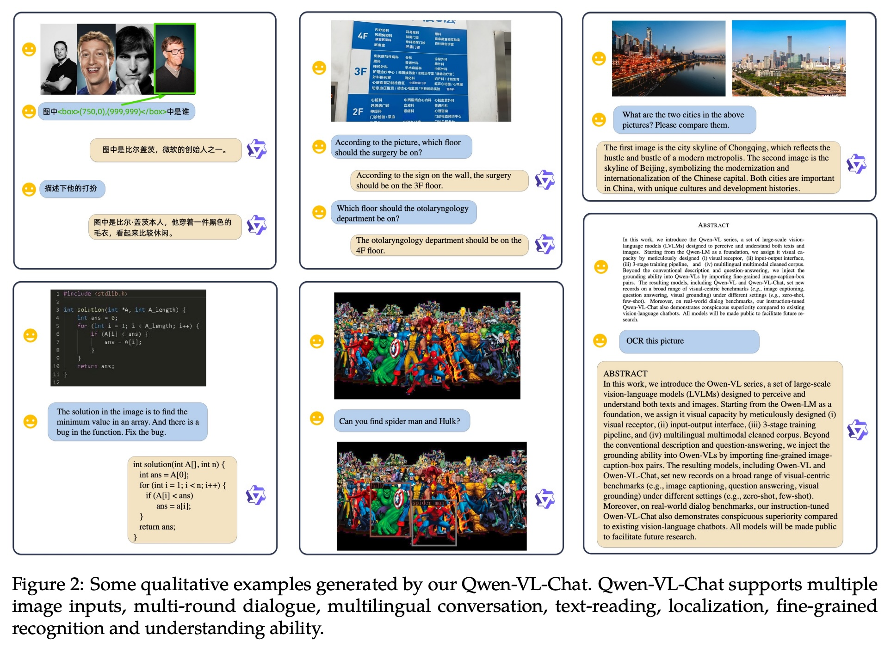

## AI论文解读 | Qwen-VL: A Versatile Vision-Language Model for Understanding, Localization, Text Reading, and Beyond
        
### 作者        
digoal        
        
### 日期        
2025-08-31        
        
### 标签        
PostgreSQL , PolarDB , DuckDB , AI , 论文解读        
        
----        
        
## 背景  
      
https://arxiv.org/pdf/2308.12966        
  
提示:          
```          
读懂《Qwen-VL: A Versatile Vision-Language Model for Understanding, Localization, Text Reading, and Beyond》这篇论文需要提前掌握哪些基础知识, 请使用中文通熟易懂的讲解这些基础知识, 可以引用论文中的图、表或使用Markdown支持的图形(text,mermaid等)增加解释性. 
  
使用中文通熟易懂的解读《Qwen-VL: A Versatile Vision-Language Model for Understanding, Localization, Text Reading, and Beyond》这篇论文, 其中的关键内容请着重讲解, 可以引用论文中的图、表或使用Markdown支持的图形(text,mermaid等)增加解释性. 
  
提取《Qwen-VL: A Versatile Vision-Language Model for Understanding, Localization, Text Reading, and Beyond》这篇论文中的重要术语, 使用中文对这些术语进行通熟易懂的讲解, 可以引用论文中的图、表或使用Markdown支持的图形(text,mermaid等)增加解释性. 
```     
  
## 1 前置知识 
  
要完全理解《Qwen-VL：一个用于理解、定位、文本阅读等功能的多功能视觉语言模型》这篇论文，你需要对人工智能，特别是深度学习领域的一些核心概念有所了解。这篇论文介绍了一个名为 Qwen-VL 的强大模型，它能同时理解图像和文字。

以下我将用通俗易懂的中文，为你讲解理解这篇论文所需的基础知识，并结合论文中的图表进行说明。

### 1\. 核心概念：什么是大模型？

首先，你需要了解两个基本概念：

  * **大语言模型 (Large Language Models, LLMs)**：你可以把它想象成一个“超级大脑”，通过学习海量的文本数据（比如整个互联网上的文章和书籍），掌握了语言的规律，从而能够像人一样理解和生成文本 。比如，你问它问题，它能回答；你让它写故事，它能创作。这篇论文中提到的 Qwen-7B 就是一个拥有70亿参数的大语言模型，也是 Qwen-VL 的基础 。

  * **视觉语言模型 (Vision-Language Models, VLMs)**：如果说 LLM 是一个只能“读”和“写”的“文科生”，那么 VLM 就是一个既能“看图”又能“识字”的“全能生”。它不仅学习了文本，还学习了大量的图片和与图片相关的描述，从而能理解图像内容 。Qwen-VL 就是这样一个模型，它能看懂图片并用文字回答关于图片的问题。

### 2\. Qwen-VL 是如何实现“看图说话”的？—— 模型架构

Qwen-VL 的神奇能力源于其巧妙的架构设计，主要由三个部分组成 ：

1.  **视觉编码器 (Visual Encoder)**：这是模型的“眼睛”。它采用了一种叫做 **Vision Transformer (ViT)** 的技术 。你可以这样理解 ViT 的工作原理：

      * 首先，它把一张完整的图片切成很多个小方块（patches），就像拼图一样 。
      * 然后，它会分析每一个小方块的内容，并理解它们之间的位置关系。
      * 最终，它将整张图片的信息转换成一串数字（特征序列），这串数字就代表了模型对这张图片的“视觉理解” 。

2.  **大语言模型 (Large Language Model, LLM)**：这是模型的“大脑”，也就是之前提到的 Qwen-7B 。它负责处理所有的语言逻辑、推理和生成任务。

3.  **视觉-语言适配器 (Vision-Language Adapter)**：这是连接“眼睛”和“大脑”的“桥梁”。视觉编码器产生的图片信息（数字序列）非常长，如果直接全部丢给“大脑”处理，会非常耗费计算资源 。因此，适配器通过一种叫做**交叉注意力 (Cross-Attention)** 的机制，将冗长的视觉信息压缩，提取出最精华的部分（压缩到长度为256的序列），然后再交给大语言模型处理 。

### 3\. Qwen-VL 是如何“炼成”的？—— 三阶段训练流程

一个强大的模型不是天生就如此，而是需要经过严格的“训练”。Qwen-VL 的训练过程分为三个主要阶段，就好像一个学生的成长历程。

我们可以参考论文中的**图3**来理解这个过程：   

**图解：Qwen-VL 的三阶段训练流程 **


  * **第一阶段：预训练 (Pre-training) - “打基础”**

      * **目标**：让模型建立起对图像和文本的基本联系。
      * **方法**：使用海量的、从网络上爬取的“图片-文字”配对数据进行训练 。在这个阶段，模型的“大脑”（LLM）是被冻结的，只训练“眼睛”（ViT）和“桥梁”（Adapter），让它们学会如何把图片内容准确地传递给大脑 。输入的图片分辨率较低（ $224 \\times 224$ ） 。

  * **第二阶段：多任务预训练 (Multi-task Pre-training) - “学技能”**

      * **目标**：提升模型在具体任务上的专业能力，比如看图问答、识别图中文字（OCR）和定位物体（Grounding） 。
      * **方法**：使用更高质量、更多样化的数据，同时解锁整个模型进行训练 。输入的图片分辨率也更高（ $448 \\times 448$ ），以便模型看清更多细节 。

  * **第三阶段：监督微调 (Supervised Fine-tuning) - “学对话”**

      * **目标**：让模型学会像聊天机器人一样，遵循人类的指令进行对话 。
      * **方法**：使用精心构造的对话数据进行训练，让模型从一个只会“做题”的“学生”变成一个能与人流畅交流的“智能助手”，最终得到 Qwen-VL-Chat 模型 。

### 4\. 关键技术点：模型如何理解更精细的指令？

为了让 Qwen-VL 不仅能看懂图像大概，还能精确地定位到图中的某个物体，研究者们引入了一些特殊的设计：

  * **边界框 (Bounding Box) 的表示**：当需要模型指出图中某个物体的位置时，会使用坐标的形式 `(左上角X, 左上角Y):(右下角X, 右下角Y)` 来表示一个矩形框 。这些坐标会被转换成文本字符串，并用特殊的标记 `<box>` 和 `</box>` 包裹起来，这样模型就能像处理普通文字一样来理解和生成位置信息了 。

### 总结

要读懂 Qwen-VL 这篇论文，你需要掌握以下基础知识：

1.  **基本概念**：了解什么是大语言模型 (LLM) 和视觉语言模型 (VLM)。
2.  **核心架构**：知道模型主要由视觉编码器 (ViT)、大语言模型 (LLM) 和一个连接它们的适配器组成。
3.  **关键技术**：理解 Vision Transformer (ViT) 如何将图片转换为数字信息，以及交叉注意力 (Cross-Attention) 如何压缩信息。
4.  **训练流程**：熟悉模型通过“预训练”、“多任务预训练”和“监督微调”这三个阶段，从一个基础模型逐步成长为强大的多功能助手。

掌握了这些知识后，你再去看论文中的具体实验、数据和结果（例如论文首页的雷达图，展示了 Qwen-VL 在多项任务上超越了其他模型 ），就会豁然开朗了。
  
## 2 解读论文 
  
好的，我们来通俗易懂地解读一下阿里巴巴这篇关于其多模态大模型 **Qwen-VL (通义千问-VL)** 的重磅论文。

简单来说，这篇论文介绍了一个既能“看懂”图片，又能理解文字，并能就此进行交流的AI模型——Qwen-VL。它不仅仅是简单地描述图片里有什么，还能完成更精细、更复杂的任务，比如**在图片中精确定位物体**、**识别和阅读图片里的文字**等。

-----

### 核心亮点：Qwen-VL 强在哪里？

这篇论文开篇就用一张“雷达图”展示了Qwen-VL的强大实力，它的性能（红色线）在各项任务上都全面领先于当时其他的通用模型。

  

图1: 性能雷达图。Qwen-VL (红线) 在多项视觉语言任务上，性能全面超越了当时的同类模型。

根据论文，Qwen-VL系列模型主要有四大特点 ：

1.  **性能卓越**：在多个行业标准的视觉理解基准测试中，达到了同等规模模型里的顶级水平 。
2.  **精通多语言**：由于训练数据中包含了大量的中文和英文内容，它天生就能流畅地使用中英双语进行交流 。
3.  **支持多图输入**：你可以一次性输入多张图片，让模型进行比较、分析和推理，这在很多实际应用中非常有用 。
4.  **强大的细粒度理解**：这是它的“杀手锏”。得益于高分辨率输入和高质量的训练数据，它在**目标定位 (Grounding)** 和 **文字识别 (OCR)** 相关任务上表现非常出色 。

-----

### 模型架构揭秘：Qwen-VL 是如何“看见”和“思考”的？

我们可以把Qwen-VL的内部结构想象成一个由三部分组成的团队：

| 组成部分 | 角色 | 作用 |
| :--- | :--- | :--- |
| **视觉编码器 (Vision Encoder)** | **眼睛** | 采用ViT架构，负责接收图片并将其“看”到的内容转化成计算机能理解的数字信号（特征） 。 |
| **大语言模型 (LLM)** | **大脑** | 基于Qwen-7B（通义千问70亿参数模型），这是思考和决策的核心，负责理解问题、进行推理并生成文字答案 。 |
| **视觉-语言适配器 (VL Adapter)** | **翻译官/桥梁** | 这是连接“眼睛”和“大脑”的关键。它能高效地将“眼睛”看到的庞大视觉信息，压缩并“翻译”成一段固定长度（256个单位）的精华报告，再交给“大脑”处理 。 |

这个团队的总参数量约为96亿（视觉编码器19亿 + 适配器0.8亿 + 大语言模型77亿） 。

-----

### 关键技术：三步炼成“火眼金睛”的训练流程

Qwen-VL的强大能力并非一蹴而就，而是源于一个精心设计的“三阶段训练流程” 。我们可以把它理解为一个AI的“学习三部曲”。

  

图2: Qwen-VL的三阶段训练流程 

#### **第一阶段：广泛预训练 (Pre-training)**

  * **目标**：建立对世界的初步认知，让模型知道图片和文字的基本对应关系。
  * **方法**：使用从网络上爬取的数十亿级别的“图片-文字”数据对进行粗略学习 。比如，给模型看一张猫的图片，并告诉它这对应文字“一只猫”。
  * **特点**：
      * 这个阶段，“大脑”（LLM）是“冻结”的，只训练“眼睛”（ViT）和“桥梁”（Adapter） 。
      * 为了效率，使用低分辨率图片（ $224 \\times 224$ ） 。

#### **第二阶段：多任务预训练 (Multi-task Pre-training)**

  * **目标**：从“通才”向“专才”转变，学习各种精细的视觉技能。
  * **方法**：引入了7大类高质量、多样化的数据，让模型同时学习多种任务，包括看图问答(VQA)、目标定位(Grounding)、光学字符识别(OCR)等 。
  * **特点**：
      * “大脑”被“解冻”，整个模型的所有部分都参与训练 。
      * 为了看清细节，图片分辨率提升到了 $448 \\times 448$ 。
      * 正是在这个阶段，模型学会了理解和生成**边界框 (Bounding Box)**，这是实现目标定位的关键 。

#### **第三阶段：监督微调 (Supervised Fine-tuning)**

  * **目标**：让模型变得“更懂礼貌”、更会“聊天”，能更好地理解和遵循人类的指令。
  * **方法**：使用人工标注或模型生成的对话式数据对模型进行“精修”和“调教”，最终产出了我们熟知的聊天模型 **Qwen-VL-Chat** 。
  * **特点**：这个阶段主要优化“大脑”和“桥梁”，而“眼睛”部分则被固定下来 。

-----

### 实际应用展示：它到底能做什么？

论文中展示了Qwen-VL-Chat强大的实际应用能力，远超简单的看图说话。

  

图3: Qwen-VL-Chat能力展示 

从上图可以看出，它可以：

  * **多图对话**：同时分析北京和重庆的城市风光图，并进行对比描述 。
  * **中英双语交流**：无论是中文提问“描述下他的打扮”，还是英文提问，都能对答如流 。
  * **读取图中文字 (OCR)**：能准确识别图片中的楼层指示牌，并回答“耳鼻喉科在几楼？”这类问题 。
  * **细粒度的目标定位**：在复杂的“漫威英雄”合照中，准确地识别并用红框标出用户指定的蜘蛛侠（Spider-Man） 。
  * **代码理解**：甚至能读懂图片中的代码，并指出其中的逻辑错误 。

### 总结

《Qwen-VL》这篇论文不仅是展示了一个强大的多模态模型，更重要的是，它为社区提供了一套完整且有效的构建高性能视觉语言模型的方法论。其核心在于**精巧的适配器设计**和**系统化的三阶段训练流程**，这使得模型在保持强大通用能力的同时，在目标定位、文字识别等细粒度理解任务上取得了突破，为多模态技术的应用开辟了更广阔的前景。
  
## 3 术语 
  
根据您提供的论文《Qwen-VL: A Versatile Vision-Language Model for Understanding, Localization, Text Reading, and Beyond》，我为您提取并整理了以下重要术语及其中文解释。

-----

### Qwen-VL 系列 (Qwen-VL Series)

**Qwen-VL** 是一个大型多模态模型家族，其基础是通义千问（Qwen-LM）大语言模型 。该系列模型被设计用来同时理解和处理图像与文本信息 。

  - **Qwen-VL**: 经过多任务预训练后的基础模型 。它具备感知和理解视觉输入、根据提示生成响应以及执行各种视觉-语言任务（如图像描述、视觉问答、视觉定位等）的能力 。
  - **Qwen-VL-Chat**: 在 Qwen-VL 的基础上，通过监督微调（SFT）训练而成的交互式视觉-语言聊天机器人 。它能与用户进行多轮对话，具备更强的指令遵循能力 。

### 模型架构核心组件

Qwen-VL 模型的整体网络架构由三个主要部分组成，其参数细节在论文的表1中有展示 。   

1.  **大语言模型 (Large Language Model, LLM)**: 作为 Qwen-VL 的基础组件 。它使用预训练的 Qwen-7B 模型的权重进行初始化 。
2.  **视觉编码器 (Visual Encoder)**: 负责处理图像输入 。它采用 Vision Transformer (ViT) 架构 ，通过将图像分割成小块来提取图像特征 。
3.  **位置感知视觉-语言适配器 (Position-aware Vision-Language Adapter)**: 这是一个关键的连接模块 。它使用一个单层的交叉注意力机制，将视觉编码器生成的长序列图像特征压缩到固定长度（256）的序列 。它还加入了二维绝对位置编码，以保留图像中的位置信息，这对于细粒度的图像理解至关重要 。

这是一个简化的模型架构图，您可以将其与论文中的图3进行对照：  


  

### 三阶段训练流程

Qwen-VL 的训练过程分为三个精心设计的阶段（如论文图3所示），这使其在多项任务上表现出色 。

1.  **第一阶段：预训练 (Pre-training)**: 主要使用大规模、弱标注的网络爬取图像-文本对进行训练 。在这一阶段，大语言模型是冻结的，仅优化视觉编码器和适配器 。
2.  **第二阶段：多任务预训练 (Multi-task Pre-training)**: 引入高质量的细粒度标注数据 。模型同时在7个任务上进行训练，包括图像描述、视觉问答（VQA）、视觉定位（Grounding）等 。这阶段的图像输入分辨率更高，且解锁了整个大语言模型进行训练 。
3.  **第三阶段：监督微调 (Supervised Fine-tuning, SFT)**: 通过指令微调来增强模型的指令遵循和对话能力 。这阶段主要用于创建 Qwen-VL-Chat 模型 。

### 核心能力与任务

除了传统的图像描述和视觉问答，Qwen-VL 还具备以下关键能力：

  - **视觉定位 (Visual Grounding)**: 根据文本描述在图像中准确找到并定位目标对象的能力 。这对于细粒度的视觉理解至关重要 。
  - **文本阅读 (Text Reading)**: 从图像中识别和理解文本的能力 。这使得模型能够处理与图像中文字相关的视觉问答任务 。
  - **边界框输入和输出 (Bounding Box Input and Output)**: Qwen-VL 可以输入和输出标准的边界框坐标 。这使得它能够执行精确的视觉定位任务 。边界框的坐标被归一化并转换为特定的字符串格式，并使用 `<box>` 和 `</box>` 特殊标记进行区分 。
  - **多图理解 (Multi-image Understanding)**: 在训练阶段，模型支持任意交错的图像-文本数据作为输入 。这使得 Qwen-VL-Chat 能够理解和分析多张图片，并进行比较 。

如果还有其他问题，请随时提出。
  
## 参考        
         
https://arxiv.org/pdf/2308.12966    
        
<b> 以上内容基于DeepSeek、Qwen、Gemini及诸多AI生成, 轻微人工调整, 感谢杭州深度求索人工智能、阿里云、Google等公司. </b>        
        
<b> AI 生成的内容请自行辨别正确性, 当然也多了些许踩坑的乐趣, 毕竟冒险是每个男人的天性.  </b>        
  
