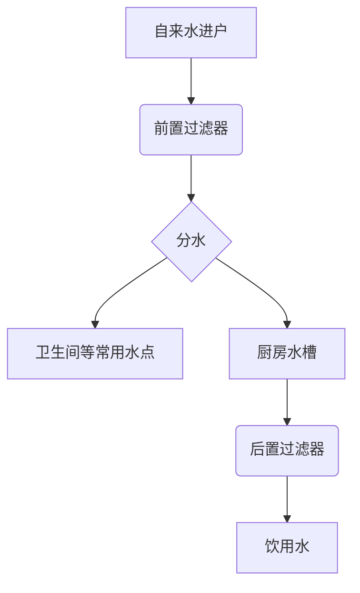
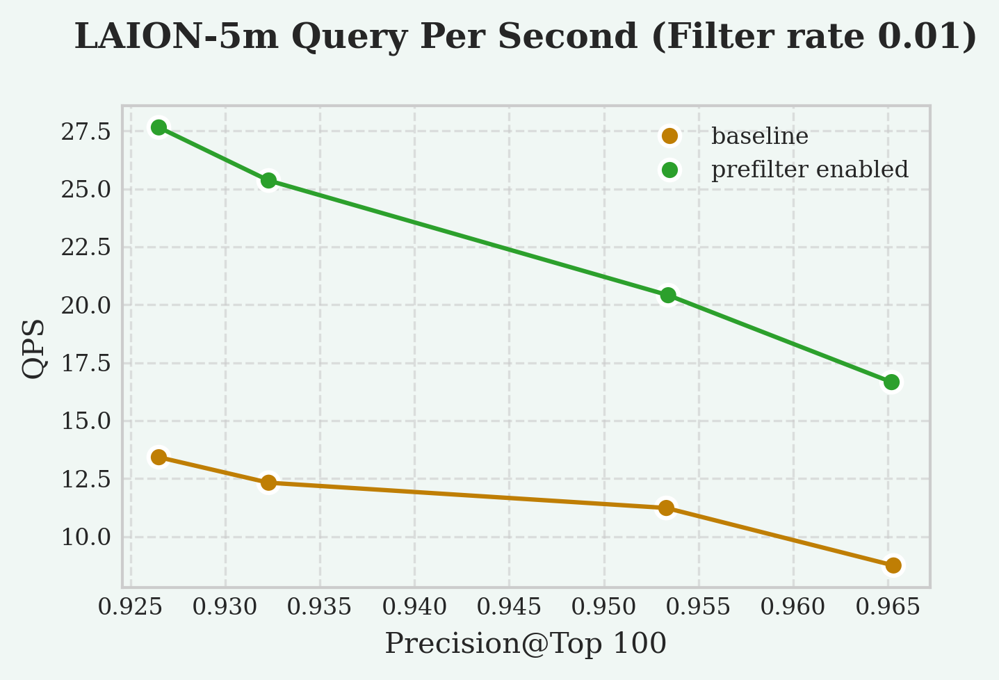

## 又涨知识了, 向量索引前置/预过滤器    
                                  
### 作者           
digoal                                  
                                  
### 日期                                  
2025-09-01                                 
                                  
### 标签                                  
PostgreSQL , PolarDB , DuckDB , vectorchord , 向量索引 , 索引扫描 , 索引条件 , 非索引条件 , filter , prefilter , 后置过滤 , 前置过滤 , 预过滤 , 选择性 , CPU , IO , 代价 , 分区表 , include index , partial index , index only scan , 残差量化 , 量化 , 初筛 , 剪枝 , 精排               
                                  
----                                  
                                  
## 背景    
在聊索引扫描的前置过滤器时, 先举个例子.  
  
家里装过自来水过滤器的朋友一定知道, 过滤器分前置过滤器和后置过滤器, 前置过滤器一般装在入户的位置, 主要是过滤大颗粒杂质, 保障所有其他出水口不容易被堵塞. 后置过滤器主要用于过滤细粒度杂质, 例如厨房可能回安装直饮水过滤器.   
  
如果把前置过滤器拿掉, 可能有好处, 也可能带来坏处, 和水质有关.  
  
水质差, 大颗粒多, 拿掉肯定不好.  
  
水质好, 拿掉可能有好处. 过滤器毕竟是影响水流量量多, 拿掉前置过滤器水通量可能变大.   
  

  
下面我们来看看索引扫描的前置过滤和后置过滤.  
  
很多人只知道索引扫描的后置过滤, 那么我们就来看看什么是索引扫描的后置过滤.  
  
这条SQL的索引是`items_pkey`, 索引扫描到符合条件的记录后, 回表, 判断tuple可见性, 并且对可见tuple获得embedding字段的值, 再输入到后置过滤器得到满足`vector_norm(embedding) < 0.5`的tuple.   
  
```  
EXPLAIN (COSTS FALSE)  
SELECT * FROM items WHERE id <= 5000 AND vector_norm(embedding) < 0.5;  
                          QUERY PLAN                            
--------------------------------------------------------------  
 Index Scan using items_pkey on items  
   Index Cond: (id <= 5000)  
   Filter: (vector_norm(embedding) < '0.5'::double precision)  
```  
  
什么是索引前置过滤呢? 只有索引扫描过程中需要多步计算时可能会用到前置过滤. 例如为了减少内存使用、加速裁剪等, 采用了rabitq量化和残差量化(rvq)分层结构的向量索引vectorchord, 这类索引扫描通常分多个步骤, 初筛、剪枝/精排等最后输出最终结果.  
  
剪枝/精排可能涉及较大的向量计算运算量, 如果向量结果中很多tuple是不符合非索引条件(其他where条件)的tuple, 那么就可以考虑使用索引扫描的前置过滤器.  
  
例如这条SQL  
```  
EXPLAIN (COSTS FALSE)   
SELECT * FROM items WHERE id % 97 = 0 ORDER BY embedding <-> '[0, 0, 0]' LIMIT 10;  
                     QUERY PLAN                        
-----------------------------------------------------  
 Limit  
   ->  Index Scan using items_embedding_idx on items  
         Order By: (embedding <-> '[0,0,0]'::vector)  
         Filter: ((id % '97'::bigint) = 0)  
```  
  
索引扫描前置过滤器可能是这样的:  
```mermaid  
graph TD  
    A[SQL语句执行] --> B{查询优化器};  
    B --> C[选择索引扫描路径];  
    C --> D[初筛];  
    D --> E[通过ctid回表];  
    E --> F{过滤非向量条件 “WHERE id % 97 = 0”, 大量tuple不满足这个条件}  
    F --> G["索引计算(剪枝/精排)"];  
    G --> L[回表访问获取完整行数据];  
    L --> M[返回最终结果集];  
  
    subgraph IDX[向量索引扫描]  
        subgraph FIL[前置过滤器]  
          E  
          F  
        end  
        D  
        G  
        L  
    end  
```  
  
注意它依旧是索引扫描的行为, 并不是通过全表扫描去获取非向量字段的值.  
  
为什么上面这条SQL要采用前置过滤器呢?  
  
因为大量tuple不满足`WHERE id % 97 = 0`条件, 并且"索引计算(剪枝/精排)"这个步骤的运算量极大, 消耗大量cpu.  
  
那么是不是所有的索引都支持前置过滤功能呢? 非也, 其实这个功能来自vectorchord插件.   
  
下面的内容翻译自: https://docs.vectorchord.ai/vectorchord/usage/prefilter.html  
  
# prefilter (前置过滤器/预过滤器)  
在索引扫描过滤中，索引首先执行扫描，然后 PostgreSQL 检查是否满足过滤条件。“过滤器”指的是 PostgreSQL 查询计划中索引扫描节点上的过滤器。这通常由SQL 语句中的WHERE子句构成。过滤器不需要具有特定的形式。  
  
```  
EXPLAIN (COSTS FALSE)  
SELECT * FROM items WHERE id <= 5000 AND vector_norm(embedding) < 0.5;  
                          QUERY PLAN                            
--------------------------------------------------------------  
 Index Scan using items_pkey on items  
   Index Cond: (id <= 5000)  
   Filter: (vector_norm(embedding) < '0.5'::double precision)  
```  
  
然而，对向量搜索来说, 这并不总是最有效的方法。考虑以下查询。  
  
```  
EXPLAIN (COSTS FALSE)   
SELECT * FROM items WHERE id % 97 = 0 ORDER BY embedding <-> '[0, 0, 0]' LIMIT 10;  
                     QUERY PLAN                        
-----------------------------------------------------  
 Limit  
   ->  Index Scan using items_embedding_idx on items  
         Order By: (embedding <-> '[0,0,0]'::vector)  
         Filter: ((id % '97'::bigint) = 0)  
```  
  
假设ID分布均匀, 由于`id % 97 = 0`这个条件的存在, 检索10条满足过滤条件的向量，索引扫描大约要放大97倍, 也就是索引需要扫描970行。这表明索引执行了大量的冗余计算。如果索引可以利用过滤条件进行剪枝，计算量将显著减少。向量索引提供了一个 GUC 参数`vchordrq.prefilter`，允许根据过滤条件对搜索空间进行剪枝。  
  
```  
SET vchordrq.prefilter = on;  
```  
  
预过滤使向量索引能够根据过滤器执行搜索。这会精简搜索空间，而较小的搜索空间可以提高搜索效率。然而，检查过滤条件是否满足也会带来开销。因此，仅当过滤条件严格（剔除大量行）且计算成本低廉（计算成本远低于计算向量距离）时才建议使用预过滤。为了帮助理解，我们提供了两个错误的使用示例：  
  
`id % 97 > 0`：这个过滤器不太耗cpu, 但是大多数是满足条件的. 用在前置过滤是不可取的.  
`email ~ '^([a-zA-Z]+)*$'`：这个过滤器是正则匹配, 可能比较耗费cpu(但是相比向量计算的cpu也许还好), 但是满足条件的tuple非常少. 所以用于前置过滤是可取的.  
  
适合前置过滤的是:  
- 满足前置过滤条件的tuple很少  
- 前置过滤where条件对应的运算量不高(相比向量计算)  
  
根据我们的实验结果，不同选择性下的 QPS 加速如下：  
- 选择性 `1%` 时加速 `200%`  
- 选择性 `10%` 时加速 `5%`  
  
  
  
ps: vchordg不支持此功能。仅vchordrq支持预过滤.   
  
参数  
```  
vchordrq.prefilter   
```  
  
`vchordrq.prefilter` GUC 参数允许在计算距离之前先进行条件评估。例如，在查询`SELECT * FROM items WHERE id % 2 = 0 ORDER BY embedding <-> '[3,1,2]' LIMIT 5`中，索引通常会先计算所有有用的`embedding <-> '[3,1,2]'`向量距离，然后将行传递给 PostgreSQL，后者会过滤掉符合条件`id % 2 != 0`的行。此参数允许索引在计算距离之前预先评估条件并丢弃不匹配的行，从而提高查询效率。  
  
  
## 更多改进思考  
  
前置过滤节省了向量计算的CPU开销, 确没有节省其他条件计算带来的cpu开销和回表带来的IO.  
  
其实还可以继续优化.  
  
如果非索引条件是必选条件, 可能存在的更好方法是  
- 分区表, 例如前面提到的ID过滤, 可以使用分区表, 在符合条件的分区中进行向量搜索, 效率更高.  
- partial index, 与分区表类似, 通常存在于查询某些特定状态的记录(例如状态字段为激活和非激活, 属于2种经常查询的条件.)  
- include index, 把非向量索引条件的字段, 放到向量索引叶子节点, 可减少回表IO. 例如轨迹查询, TID和时间字段通常是索引条件, 其他字段是被查询字段, 采用index only scan和include index可大幅度减少回表IO.  
  
  
## 参考  
https://deepwiki.com/search/set-vchordrqprefilter-on-true_8b1a7b21-b2b0-41b8-b7e2-0e4f9eabc495  
  
https://docs.vectorchord.ai/vectorchord/usage/prefilter.html  
  
[《重新发现PostgreSQL之美 - 8 轨迹业务IO杀手克星index include(覆盖索引)》](../202105/20210530_02.md)    
  
[《PostgreSQL index include - 类聚簇表与应用(append only, IoT时空轨迹, 离散多行扫描与返回)》](../201905/20190503_03.md)     
  
  
      
#### [期望 PostgreSQL|开源PolarDB 增加什么功能?](https://github.com/digoal/blog/issues/76 "269ac3d1c492e938c0191101c7238216")
  
  
#### [PolarDB 开源数据库](https://openpolardb.com/home "57258f76c37864c6e6d23383d05714ea")
  
  
#### [PolarDB 学习图谱](https://www.aliyun.com/database/openpolardb/activity "8642f60e04ed0c814bf9cb9677976bd4")
  
  
#### [PostgreSQL 解决方案集合](../201706/20170601_02.md "40cff096e9ed7122c512b35d8561d9c8")
  
  
#### [德哥 / digoal's Github - 公益是一辈子的事.](https://github.com/digoal/blog/blob/master/README.md "22709685feb7cab07d30f30387f0a9ae")
  
  
#### [About 德哥](https://github.com/digoal/blog/blob/master/me/readme.md "a37735981e7704886ffd590565582dd0")
  
  

  
