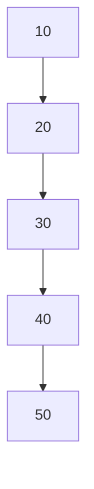
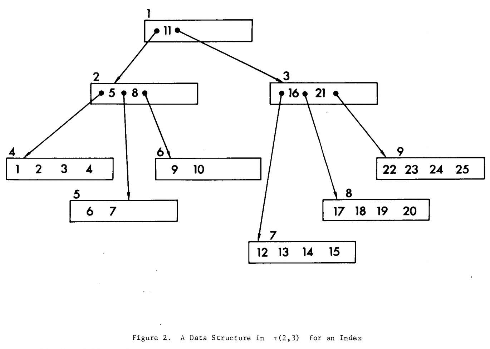
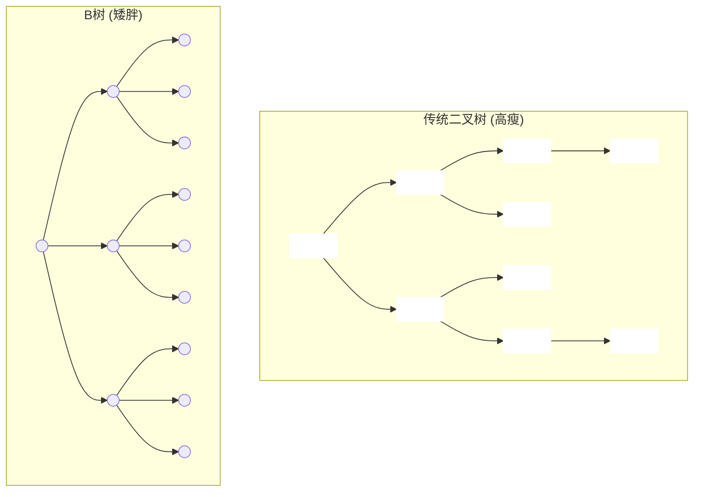
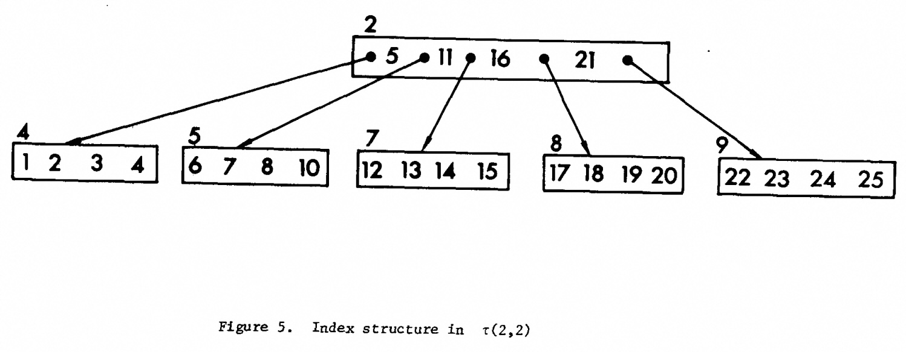

## AI论文解读 | ORGANIZATION AND MAINTENANCE OF LARGE ORDERED INDICES
        
### 作者        
digoal        
        
### 日期        
2025-09-02       
        
### 标签        
PostgreSQL , PolarDB , DuckDB , AI , 论文解读        
        
----        
        
## 背景  
      
https://dl.acm.org/doi/pdf/10.1145/1734663.1734671        
  
提示:          
```          
读懂《ORGANIZATION AND MAINTENANCE OF LARGE ORDERED INDICES》这篇论文需要提前掌握哪些基础知识, 请使用中文通熟易懂的讲解这些基础知识, 可以引用论文中的图、表或使用Markdown支持的图形(text,mermaid等)增加解释性. 
  
使用中文通熟易懂的解读《ORGANIZATION AND MAINTENANCE OF LARGE ORDERED INDICES》这篇论文, 其中的关键内容请着重讲解, 可以引用论文中的图、表或使用Markdown支持的图形(text,mermaid等)增加解释性. 
  
提取《ORGANIZATION AND MAINTENANCE OF LARGE ORDERED INDICES》这篇论文中的重要术语, 使用中文对这些术语进行通熟易懂的讲解, 可以引用论文中的图、表或使用Markdown支持的图形(text,mermaid等)增加解释性. 
```     
  
## 1 前置知识 
  
好的，为了完全理解这篇开创性的论文《ORGANIZATION AND MAINTENANCE OF LARGE ORDERED INDICES》，也就是B树的发明之作，您需要先掌握一些核心的基础知识。这篇论文的精髓在于，它提出了一种专门为磁盘等慢速、块存储设备设计的数据结构，以高效地支持对大规模数据的增、删、改、查操作。

下面我将用通俗易懂的方式，结合论文中的图表，为您讲解这些必备的基础知识。

-----

### 1\. 核心问题：内存与外存（磁盘）的速度鸿沟

这是理解B树设计初衷的最关键背景。

  * **内存 (Main Store)**：速度极快，CPU可以直接访问，但价格昂贵、容量小，且断电后数据会丢失。
  * **外存 (Backup Store)**：论文中特指磁盘（disc）或磁鼓（drum）。它的速度远慢于内存，访问一次磁盘的时间可能是访问一次内存的成千上万倍。但是它价格便宜、容量大，可以永久存储数据。

**关键矛盾**：我们需要处理的数据量非常大（论文中提到多达10万甚至150万个索引项 ），远远超过了内存的容量，因此绝大部分数据（索引）必须存放在磁盘上 。

**磁盘I/O是性能瓶颈**：当程序需要磁盘上的数据时，不能一个字节一个字节地读取，而是以“页”（Page）或“块”（Block）为单位进行读取 。每次读取一页（例如4KB）的操作称为一次“磁盘I/O”。由于磁盘寻道和旋转的机械动作，这个过程非常耗时。

**结论**：一个好的外存数据结构，其首要目标是**尽可能减少磁盘I/O的次数**。哪怕在内存中需要进行更多计算，也比多一次磁盘I/O要划算得多。

### 2\. 什么是索引 (Index)？

想象一下一本很厚的书，如果没有目录，你要找特定内容就得从头翻到尾。书的目录就是一种“索引”。

在数据库中，索引也是类似的作用。论文中定义，索引是由许多`(key, alpha)`键值对组成的集合 。

  * `key` (键)：用于唯一标识一条记录，例如用户ID、订单号等。
  * `alpha` (关联信息)：通常是一个指针，指向磁盘上存储着完整数据记录的地址 。

有了索引，我们就可以根据`key`快速定位到完整数据，而无需扫描整个文件。

### 3\. 数据结构的演进：为什么传统结构不适用？

在B树出现之前，已经有很多用于查找的数据结构。理解它们的优缺点，才能明白B树的巧妙之处。

#### a. 有序数组 + 二分查找

  * **优点**：查找速度快，时间复杂度为 $O(log N)$。
  * **缺点**：插入和删除操作极其低效。因为为了保持数组有序，插入或删除一个元素可能需要移动大量后续元素。这在磁盘上意味着大量的读写操作，是不可接受的。

#### b. 二叉搜索树 (Binary Search Tree, BST)

  * **优点**：在理想情况下，插入、删除、查找的平均时间复杂度都是 $O(log N)$，且插入删除不需要移动大量元素。
  * **缺点**：在最坏情况下，如果插入的数据是基本有序的，树会退化成一个链表，查找效率变为 $O(N)$。如下图所示，它变得“又高又瘦”。




#### c. 平衡二叉搜索树 (Balanced BST, 如AVL树)

  * **优点**：通过旋转等操作，强制让树保持平衡，解决了BST退化的问题，确保了最坏情况下的查找效率也是 $O(log N)$。
  * **缺点（致命的）**：它为**内存**设计，没有考虑磁盘I/O的成本。
    1.  **树的高度太高**：对于百万级别的数据，平衡二叉树的高度也可能达到几十。由于每个节点只存一个`key`，从根节点查找到叶子节点，最坏可能需要几十次磁盘I/O。这太慢了！
    2.  **I/O浪费**：磁盘一次读取一整“页”，但一个平衡二叉树的节点只包含一个`key`和两个指针，信息量很小。读取一页4KB的数据，却只用上了其中的几十个字节，效率极低。

### 4\. B树的诞生：为磁盘I/O而生的“矮胖树”

理解了以上问题，B树的设计思想就呼之欲出了。B树是一种**平衡多路搜索树**，它通过以下设计完美地解决了上述问题：

**1. 节点（页）内存储多个键 (key)**
B树不再是“一个节点一个key”，而是一个节点（即一个“页”）可以存储大量的`key` 。论文中定义，每个页可以存储 `k` 到 `2k` 个键 。这里的 `k` 是一个可配置的参数，可以很大（例如上百）。

**2. “矮胖”的树形结构**
由于每个节点存储了多个`key`，它也就可以有多个子节点（分支）。一个包含 `l` 个key的节点，会有 `l+1` 个子节点指针 。这使得B树的“扇出”（fan-out）非常大，树的形态不再是“高瘦”，而是“矮胖”。

下面我们用论文中的 **Figure 2** 来直观感受一下（这里k=2，即每个节点最少2个key，最多4个key）：   

  * **根节点 (Page 1)**: 包含一个键 `11`。所有小于`11`的键都在左子树 (Page 2)，所有大于`11`的键都在右子树 (Page 3)。
  * **内部节点 (Page 2, 3)**: 以 Page 2 为例，它包含键 `5` 和 `8`。它有三个子节点指针，分别指向 Page 4 (键 \< 5)、Page 5 (5 \< 键 \< 8)、Page 6 (键 \> 8)。
  * **叶子节点 (Page 4, 5, 6, 7, 8, 9)**: 存储着具体的键值。

**3. 保证平衡**
B树通过节点的分裂（split）和合并/重分配（catenation/underflow）机制，来维持树的平衡。关键的一点是，**它保证所有叶子节点都在同一高度（深度）** 。这确保了任何一次查找，所经过的磁盘I/O次数都是相同的，且这个次数非常少。

### 5\. 对数复杂度 ( $log\_k I$ ) 的直观理解

论文中反复强调，B树的操作时间与 $log\_k I$ 成正比 ，这里的 `I` 是索引的总大小，`k` 就是我们前面提到的参数。

  * 对于平衡二叉树，查找次数与 $log\_2 I$ 相关。如果 I = 1,000,000，则 $log\_2 I \\approx 20$。
  * 对于B树，假设 `k`=100，查找次数与 $log\_{101} I$ 相关。如果 I = 1,000,000，则 $log\_{101} I = log(1,000,000) / log(101) = 6 / 2 \\approx 3$。

这意味着，对于百万级的数据，平衡二叉树可能需要20次磁盘I/O，而B树**只需要大约3次**！这就是B树性能优势的核心来源。

-----

### 总结：需要预先掌握的知识点清单

| 知识点 | 解释 | 为何重要 |
| :--- | :--- | :--- |
| **内存 vs. 外存** | 内存快而小，外存（磁盘）慢而大。磁盘I/O是主要性能瓶颈。 | 这是B树设计的根本出发点，所有设计都是为了减少磁盘I/O。 |
| **索引 (Index)** | 是一种辅助数据结构，用于加速数据检索，通常是(key, pointer)对。 | B树就是一种高效实现索引的数据结构。 |
| **树形数据结构** | 了解二叉搜索树、平衡二叉搜索树的原理、优点和缺点。 | B树是在它们的思想基础上，针对外存环境进行改造和优化的产物。 |
| **时间复杂度** | 理解 $O(log N)$ 的含义，知道对数（logarithm）运算的意义。 | 用于理解和衡量B树的性能为什么如此高效，特别是`log`的底数`k`为何重要。 |
| **块存储 (Block Storage)** | 知道磁盘是以“页”或“块”为单位读写数据的。 | 这是B树节点（页）为何要设计得比较大，以匹配磁盘I/O单位的原因。 |

当您理解了“磁盘I/O很慢”这一核心矛盾，并了解了传统树形结构为何无法有效解决这个问题后，您就能深刻体会到B树将节点变大、让树变“矮胖”的设计是多么地巧妙和高效。带着这些知识，您再去阅读论文中关于插入（split）、删除（catenation）等具体操作的细节，就会豁然开朗。
  
## 2 解读论文 
  
好的，这篇由 R. Bayer 和 E. McCreight 在1970年发表的论文 **《ORGANIZATION AND MAINTENANCE OF LARGE ORDERED INDICES》** 是一篇在计算机科学领域具有里程碑意义的著作。它首次提出了B树（B-tree）这种数据结构，从根本上解决了如何在磁盘等慢速存储设备上高效管理大规模动态索引的难题。直到今天，B树及其变体（如B+树）仍然是几乎所有现代数据库和文件系统的核心技术。

下面，我将为您通俗易懂地解读这篇论文的关键内容。

### 核心思想：为磁盘I/O设计的“矮胖”树

在B树出现之前，学者们已经设计出AVL树等平衡二叉树，它们在内存中表现优异。但论文的作者敏锐地指出，当数据量大到必须存放在磁盘上时，这些数据结构就水土不服了。

**根本矛盾**：内存访问速度极快，而磁盘访问（I/O）由于涉及机械寻道和旋转，速度要慢上成千上万倍。因此，算法的性能瓶颈不再是CPU计算，而是**访问磁盘的次数** 。

传统二叉树“又高又瘦”，每个节点只存一个数据。查找一个数据可能需要从根节点到叶子节点访问很多次，每一次都可能对应一次昂贵的磁盘I/O。

B树的核心思想就是**减少磁盘I/O次数**，其解决方案是构建一棵 **“矮胖”的树** 。



### B树的关键结构特性

论文定义了一种全新的树结构，称为B树，它具备以下几个关键特性：

1.  **节点即页 (Node as a Page)**：B树的每个节点被设计成与磁盘的一个“页”（Page）或“块”（Block）大小相对应 。这意味着一次磁盘I/O就可以读取一个完整的节点信息。

2.  **多键值节点 (Multi-key Nodes)**：一个节点内可以存储多个键（key）以及指向子节点的指针 。论文将一个可容纳最多 `2k` 个键的页（节点）作为基础，其中 `k` 是一个可根据设备性能选择的参数 。

3.  **平衡性 (Balanced)**：B树通过一套精巧的动态调整机制，严格保证**每个叶子节点都处于相同的高度（深度）** 。这确保了B树的查找性能是稳定且可预测的，不会出现退化成链表的情况。

4.  **阶数与填充率 (Order and Fill Rate)**：

      * 除了根节点，每个节点至少有 `k+1` 个子节点（即至少有 `k` 个键）。
      * 每个节点最多有 `2k+1` 个子节点（即最多有 `2k` 个键）。
      * 根节点要么是叶子，要么至少有两个子节点 。
      * 这个特性保证了磁盘空间的利用率至少为50% 。

让我们通过论文中的 **Figure 2** 来直观地看一下一个 `k=2` 的B树实例。在这个例子中，每个节点最少有2个键，最多有4个键。   

  * **结构**：这是一棵高度为3的B树。根节点是Page 1，它只有一个键 `11`。第二层是Page 2和Page 3。第三层是所有的叶子节点。
  * **有序性**：节点内的键是升序排列的。同时，整个树也维持着全局有序性。例如，Page 2中的键 `5` 和 `8`，其左边指针指向的子树中所有的键都小于5，中间指针指向的子树中所有的键都介于5和8之间，右边指针指向的子树中所有的键都大于8 。

### B树的核心操作与维护

B树的精髓不仅在于其静态结构，更在于其动态维护的算法，确保在频繁的插入和删除后，树依然保持平衡。

#### 1\. 检索 (Retrieval)

检索操作非常直观。从根节点开始，通过比较目标键与节点内键的大小，确定下一步应该访问哪个子节点，逐层向下，直到在某个节点找到该键或在叶子节点层也未找到。

由于树是“矮胖”的，其高度 `h` 非常小。对于一个拥有 `I` 个键的索引，其高度约等于 $log\_k I$ 。这意味着，即使在百万甚至上亿条数据中查找，也仅仅需要几次（例如3-5次）磁盘I/O。

#### 2\. 插入 (Insertion) 与节点分裂 (Page Split)

插入是B树最巧妙的操作之一。

1.  首先，像检索一样，找到应该插入该键的叶子节点。
2.  如果该叶子节点未满（键数量 \< `2k`），则直接插入。
3.  如果该叶子节点已满（键数量 = `2k`），则需要进行**分裂 (Split)** 。
      * 将该节点的 `2k+1` 个键（`2k`个旧键 + 1个新键）从中间分开，中间那个键被提升到父节点中。
      * 原节点保留前 `k` 个键，并创建一个新兄弟节点，存储后 `k` 个键 。
      * 这个分裂过程可能会向上传播，如果父节点也满了，父节点也要继续分裂，最坏情况下会一直传播到根节点 。
      * **当根节点分裂时，会创建一个新的根节点，树的高度就增加了1。这是B树长高的唯一方式** 。

论文通过一个例子生动地说明了这个过程：将键 `9` 插入到下图（Figure 5）所示的B树中，会导致Page 5分裂，并将中间值 `8` 提升到父节点Page 2。但Page 2也满了，于是Page 2继续分裂，将 `11` 提升，最终形成了一个新的根，得到了我们之前看到的Figure 2的结构 。     

#### 3\. 删除 (Deletion) 与节点合并 (Catenation / Underflow)

删除操作比插入要复杂一些。

1.  首先找到包含该键的节点。
2.  如果该键在叶子节点，直接删除。
3.  如果该键在内部节点，则需要用其后继键（即其右子树中最小的键）来替换它，然后删除那个后继键。最终，删除操作总是会转化成在叶子节点上删除一个键。
4.  删除后，如果该叶子节点的键数量少于 `k`，就破坏了B树的性质。此时需要调整：
      * **下溢 (Underflow)**：如果其相邻的兄弟节点比较“富裕”（键数量 \> `k`），可以从兄弟节点“借”一个键过来，并通过父节点进行调整，使两个节点重新满足要求 。
      * **合并 (Catenation)**：如果相邻的兄弟节点也刚好只有 `k` 个键，无法出借，则会将该节点、其兄弟节点以及父节点中分隔它们的键合并成一个新节点 。
      * 合并操作同样可能导致父节点的键数量不足，从而引发向上传播的连锁合并反应 。

论文同样用了一个例子：从Figure 2中删除键 `9`，会导致Page 6只有一个键，不满足 `k=2` 的要求。它会和兄弟节点Page 5进行合并，最终变回Figure 5的结构 。

### 性能与实验

论文不仅提出了理论，还进行了详尽的成本分析和实验验证。

  * **成本分析**：作者分析了在不同操作（检索、插入、删除）下，最好、最坏以及平均情况下的磁盘读写次数（`f`代表读取页数，`w`代表写入页数）。这些分析为B树的性能提供了坚实的理论依据 。
  * **存储利用率**：理论上保证了最低50%的利用率，论文还提出了一种 **溢出（Overflow）** 技术，即在分裂前尝试将键移动到兄弟节点，可以将最差利用率提高到约66% 。
  * **实验结果**：作者在当时的IBM 360/44计算机和2311磁盘上进行了实验 。对于一个大小为15,000的索引，在混合了插入、删除、检索的场景下，每秒可以处理约9个事务 。对于一个100,000的索引，每秒可以处理至少4个事务 。这些在当时看来非常出色的性能数据，有力地证明了B树的实用价值。

### 结论与影响

《ORGANIZATION AND MAINTENANCE OF LARGE ORDERED INDICES》这篇论文的贡献是革命性的。它提出的B树完美地平衡了查找、插入和删除操作的效率，其核心思想——**通过增大节点大小来构建“矮胖”的树，从而最小化磁盘I/O**——已成为设计外存数据结构的基本原则。这篇论文不仅为后来的数据库和文件系统（如ext4, NTFS, Oracle, PostgreSQL等）奠定了理论基础，也为处理海量数据存储与检索问题提供了一个优雅且高效的通用范式。
  
## 3 术语 
  
好的，这篇论文引入了数据库和文件系统领域一些非常核心的术语。下面我将对这些重要术语进行提取，并结合论文原文和图示，用中文为您做通俗易懂的讲解。

-----

### 1\. 索引 (Index)

  * **讲解**：
    索引就像一本书的目录，它是一个独立于主数据的文件，能够帮助我们快速定位到想要查找的数据，而无需从头到尾扫描整个主文件 。论文中定义，一个索引是由许多“索引元素”（index elements）组成的集合，每个元素都是一个 `(x, a)` 对，其中 `x` 是**键 (key)**，用于唯一识别数据，而 `a` 是**关联信息 (associated information)**，通常是指向磁盘上完整数据记录的指针 。

  * **示例**：
    在一个用户数据库中，索引可以是 `(用户ID, 用户数据在磁盘上的地址)` 的集合。

### 2\. 页 (Page)

  * **讲解**：
    由于磁盘等外部存储设备的速度远慢于内存，数据在它们之间传输时，不是一个字节一个字节地进行，而是以一个固定大小的“块”为单位，这个单位在论文中被称为**页 (Page)** 。在B树的结构中，**树的每一个节点都对应着一个页** 。算法设计的核心目标之一，就是通过优化树的结构来减少需要读写的“页”的数量。

### 3\. B树 (B-tree)

  * **讲解**：
    B树是这篇论文提出的核心数据结构，它是一种为磁盘等外部存储设计的**平衡多路搜索树** 。它的设计目标是在保持数据有序的同时，让插入、删除和查找操作的磁盘I/O次数尽可能少。

    其关键特征如下：

      * **所有叶子节点都在同一层**：这保证了任何查找操作的路径长度都相同，性能稳定 。
      * **节点容量大**：每个节点（页）可以存放多个键 。
      * **分支多（矮胖结构）**：因为节点容量大，所以树的“扇出”（分支数量）很多，这使得树的高度非常低，从而极大地减少了查找时需要访问的节点（页）数量 。

  * **图示**：
    论文中的 Figure 2 就是一个典型的B树结构，它高度为3，根节点只有一个键`11`，第二层节点有两个键，所有叶子节点都在第三层 。   

### 4\. 参数 k

  * **讲解**：
    `k` 是B树的一个核心自然数参数，它由存储设备的特性决定，并直接影响树的性能 。`k` 定义了每个节点（页）的容量和填充率：
      * **容量**：每个节点最多可以存储 `2k` 个键 。
      * **最低填充率**：除了根节点，每个节点必须至少存储 `k` 个键 。
      * 选择一个合适的 `k` 值至关重要。如果 `k` 太小，树会变高，I/O次数增多；如果 `k` 太大，单次I/O传输的数据量过大，也可能不是最优。论文第10节专门讨论了如何根据磁盘的寻道时间 (`α`) 和传输速率 (`β`) 来计算一个近似最优的`k`值 。

### 5\. 页分裂 (Splitting a Page)

  * **讲解**：
    这是B树在**插入**操作中维持平衡的关键机制 。当试图向一个已经存满 `2k` 个键的节点插入一个新键时，该节点会发生分裂：

    1.  将这个包含 `2k+1` 个键的有序序列从中间分开。
    2.  中间那个键被“提升”到父节点中。
    3.  剩下的键分裂成两个新的节点，每个节点各包含 `k` 个键 。
        这个过程可能会像多米诺骨牌一样向上传播，如果父节点也满了，就会继续分裂，直到根节点。当根节点分裂时，树的高度会增加1 。

  * **图示**：
    一个简单的分裂过程如下所示（假设k=1，即节点最多2个键）：

    ```mermaid
    graph TD
        subgraph "分裂前 (父节点P, 子节点C已满)"
            P --> C["'2', '5'"]
        end

        subgraph "向C插入'3', C分裂"
            P_New["'3'"] --> C_New["'2'"]
            P_New --> C_Sibling["'5'"]
        end
    ```

### 6\. 页合并 (Catenation)

  * **讲解**：
    页合并是**删除**操作中与“分裂”相对应的机制，用于维持节点的最低填充率 。当从一个节点删除一个键后，如果其键数量少于 `k`，并且其相邻的兄弟节点也只有 `k` 个键时，就会发生合并：

    1.  将这两个兄弟节点合并。
    2.  同时，将父节点中分隔这两个兄弟节点的键也“降级”下来，一起并入新合并的节点中 。
        这个过程同样可能向上传播，导致父节点因失去一个键而变得不满足要求，从而引发连锁合并 。

  * **示例**：
    论文中提到，从Figure 2中删除键`9`，会导致包含`[6, 7]`和`[10]`的两个叶子节点合并，最终形成Figure 5的结构 。     

### 7\. 下溢/上溢 (Underflow / Overflow)

  * **下溢 (Underflow)**：
    在**删除**后，如果一个节点的键数量少于 `k`，但其兄弟节点比较“富裕”（键数量大于`k`），此时不必合并，而是可以进行一种称为“下溢”的再平衡操作 。简单说就是从富裕的兄弟节点那里“借”一个键过来，通过父节点进行旋转，使两个节点的键数量都重新满足大于等于`k`的条件 。下溢操作的成本比合并要低，因为它不会向上传播 。

  * **上溢 (Overflow)**：
    这是在**插入**时，为了提高存储利用率而采用的一种优化策略 。当一个节点满了，它不立即分裂，而是先检查其兄弟节点是否有空间。如果有，就将部分键移动到兄弟节点，重新在它们之间均匀分配键，从而避免了一次分裂操作 。只有当所有相邻兄弟都满了，分裂才是唯一选择 。
  
## 参考        
         
https://dl.acm.org/doi/pdf/10.1145/1734663.1734671    
        
<b> 以上内容基于DeepSeek、Qwen、Gemini及诸多AI生成, 轻微人工调整, 感谢杭州深度求索人工智能、阿里云、Google等公司. </b>        
        
<b> AI 生成的内容请自行辨别正确性, 当然也多了些许踩坑的乐趣, 毕竟冒险是每个男人的天性.  </b>        
    
#### [期望 PostgreSQL|开源PolarDB 增加什么功能?](https://github.com/digoal/blog/issues/76 "269ac3d1c492e938c0191101c7238216")
  
  
#### [PolarDB 开源数据库](https://openpolardb.com/home "57258f76c37864c6e6d23383d05714ea")
  
  
#### [PolarDB 学习图谱](https://www.aliyun.com/database/openpolardb/activity "8642f60e04ed0c814bf9cb9677976bd4")
  
  
#### [PostgreSQL 解决方案集合](../201706/20170601_02.md "40cff096e9ed7122c512b35d8561d9c8")
  
  
#### [德哥 / digoal's Github - 公益是一辈子的事.](https://github.com/digoal/blog/blob/master/README.md "22709685feb7cab07d30f30387f0a9ae")
  
  
#### [About 德哥](https://github.com/digoal/blog/blob/master/me/readme.md "a37735981e7704886ffd590565582dd0")
  
  

  
