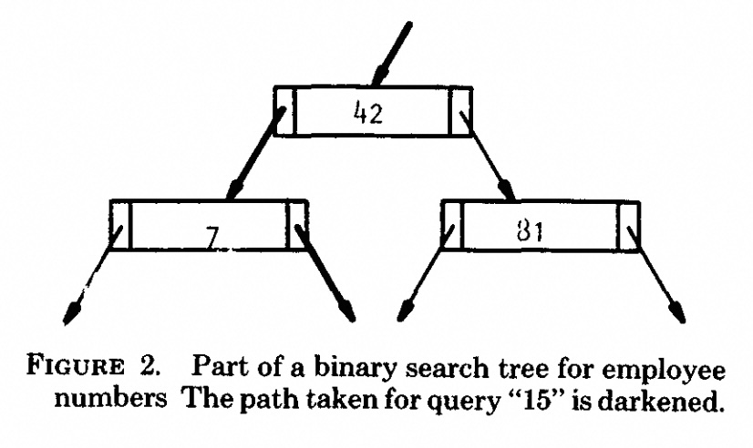
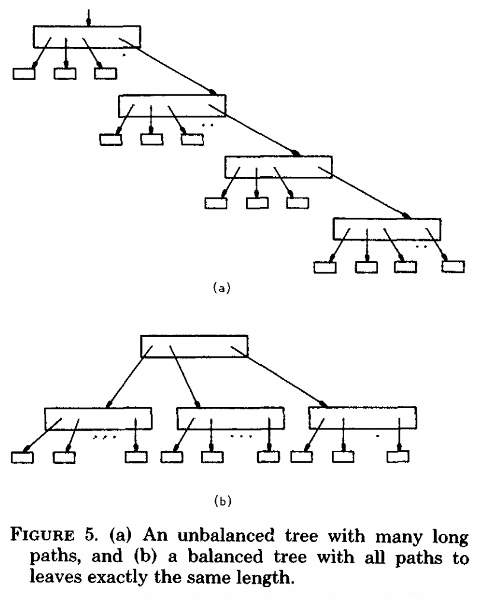
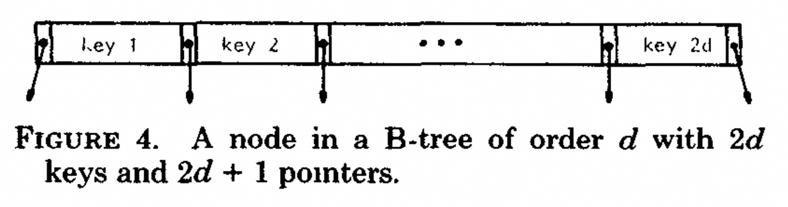
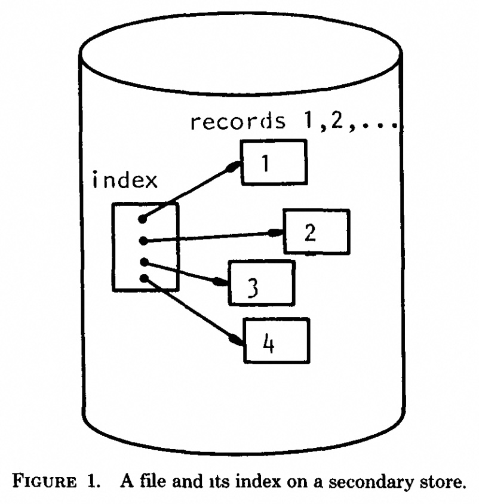
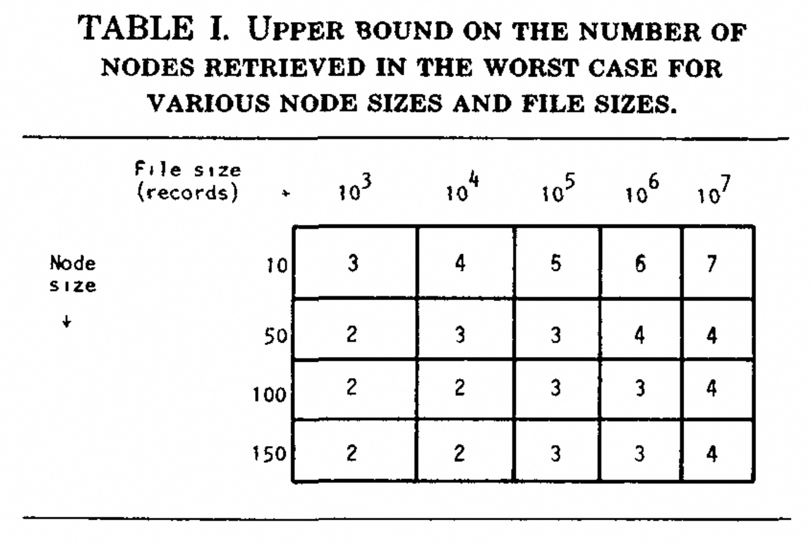
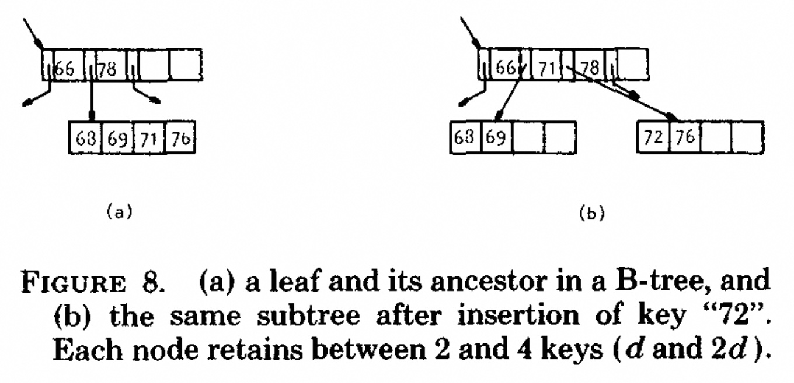
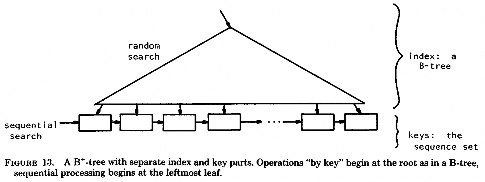
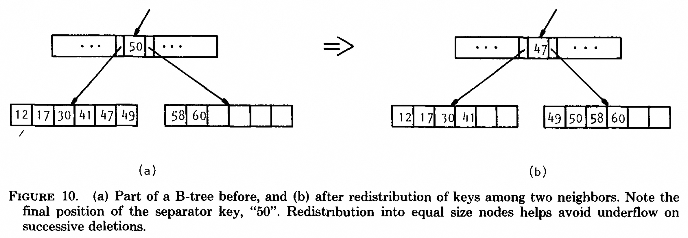
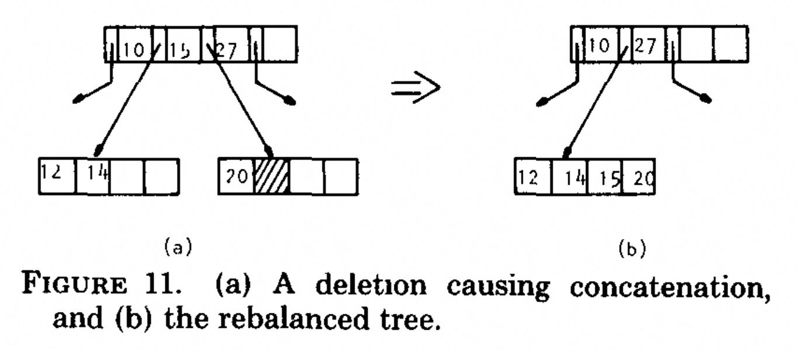

## AI论文解读 | The Ubiquitous B-Tree
        
### 作者        
digoal        
        
### 日期        
2025-09-02       
        
### 标签        
PostgreSQL , PolarDB , DuckDB , AI , 论文解读        
        
----        
        
## 背景  
      
https://carlosproal.com/ir/papers/p121-comer.pdf        
  
提示:          
```          
读懂《The Ubiquitous B-Tree》这篇论文需要提前掌握哪些基础知识, 请使用中文通熟易懂的讲解这些基础知识, 可以引用论文中的图、表或使用Markdown支持的图形(text,mermaid等)增加解释性. 
  
使用中文通熟易懂的解读《The Ubiquitous B-Tree》这篇论文, 其中的关键内容请着重讲解, 可以引用论文中的图、表或使用Markdown支持的图形(text,mermaid等)增加解释性. 
  
提取《The Ubiquitous B-Tree》这篇论文中的重要术语, 使用中文对这些术语进行通熟易懂的讲解, 可以引用论文中的图、表或使用Markdown支持的图形(text,mermaid等)增加解释性. 
```     
  
## 1 前置知识 
  
好的，为了帮助您更好地理解道格拉斯·科默（Douglas Comer）的这篇经典论文《The Ubiquitous B-Tree》（无处不在的B树），我们来梳理一下阅读前需要掌握的基础知识。我会用通俗易懂的方式，并结合论文中的图表示例来解释。

-----

### 核心预备知识

在深入B树之前，您至少需要掌握以下几个核心概念：

1.  **树形数据结构 (Tree Data Structures)**
2.  **二叉搜索树 (Binary Search Tree - BST)**
3.  **“平衡”的重要性与平衡树 (The Concept of Balance)**
4.  **计算机存储体系 (Storage Hierarchy)**
5.  **文件与索引 (Files and Indexes)**
6.  **对数复杂度 (Logarithmic Complexity - $log\_d n$)**

下面我们逐一详细解释。

#### 1\. 树形数据结构 (Tree Data Structures)

这是最基础的概念。在计算机科学中，“树”是一种模拟层级关系的数据结构。

  * **节点 (Node)**: 树的基本组成单位，用来存放数据。
  * **根节点 (Root)**: 树最顶端的节点，没有“父节点”。
  * **边 (Edge)**: 连接两个节点的线。
  * **父节点 (Parent) / 子节点 (Child)**: 如果一个节点A直接连接到另一个节点B的下方，那么A是B的父节点，B是A的子节点。
  * **叶子节点 (Leaf)**: 没有任何子节点的节点，位于树的末端。

论文中明确提到了这些术语 。一个简单的树结构如下所示：

```text
      (根节点 Root)
       /       \
 (子节点 Child)  (子节点 Child)
   /
(叶子节点 Leaf)
```

B树本质上就是一种特殊的、更复杂的树。

#### 2\. 二叉搜索树 (Binary Search Tree - BST)

这篇论文明确指出，B树的讨论是从“二叉搜索树”开始的 。因此，理解BST至关重要。

BST是一种特殊的树，它遵循一个简单的规则：

  * 对于任意一个节点，其左边子树上所有节点的值都**小于**该节点的值。
  * 其右边子树上所有节点的值都**大于**该节点的值。
  * 每个节点最多有两个子节点（“二叉”的由来）。

**例如，论文中的图2就是一个二叉搜索树的一部分 ：**

  

> **图解**：这是论文中的图2 。如果要查找数字“15”，从根节点“42”开始，因为15 \< 42，所以往左走到节点“7”。因为15 \> 7，所以再往右走。这个过程非常高效。

**BST的问题**: 如果插入的数据是基本有序的（例如 1, 2, 3, 4, 5...），BST就会退化成一个链表，变得非常“不平衡”，如论文中图5(a)所示 。这时，查找效率会从高效的树形查找退化为低效的线性查找。

  

#### 3\. “平衡”的重要性与平衡树 (The Concept of Balance)

“平衡”是B树存在的核心原因之一。

  * **什么是平衡？** 一棵平衡的树，意味着从根节点到任何一个叶子节点的路径长度都大致相等。这样的树看起来比较“矮胖”或“繁茂”(bushy) 。论文中的图5(b)就展示了一棵平衡的树 。

  * **为什么平衡很重要？** 因为树的高度决定了查找一个数据最多需要访问多少个节点。树越平衡、越矮，查找次数就越少，性能就越高 。

B树最美妙的地方在于，它有一套自动维护平衡的插入和删除算法 。无论你怎么增删数据，它都能保证自己永远是平衡的，从而提供稳定的高性能。

#### 4\. 计算机存储体系 (Storage Hierarchy)

理解B树为什么是为“外部存储”设计的，需要了解计算机的存储体系。

  * **内存 (Main Memory, RAM)**: 速度极快，但容量小，断电后数据会丢失。CPU可以直接访问。
  * **外存 (Secondary Storage, 如磁盘/SSD)**: 速度远慢于内存，但容量大，可以永久保存数据 。

**核心矛盾**: 我们要处理的数据量通常非常大，无法全部放入内存 。因此，大部分数据和索引都必须存放在磁盘上。

**成本衡量**: 访问一次磁盘（称为一次I/O）的耗时是访问内存的上万甚至百万倍。因此，**算法的性能好坏，关键在于减少磁盘的访问次数** 。

B树的设计哲学就是为了**最小化磁盘I/O次数**。它的节点很大，一个节点内可以存放很多个“键”(keys)和“指针”(pointers)，如论文图4所示 。这样做的好处是，我们从磁盘读取一个节点（一次I/O）到内存后，可以在内存中进行多次比较，从而大大减少了需要读取的节点总数（即磁盘访问总数）。

  

#### 5\. 文件与索引 (Files and Indexes)

B树通常不直接存储文件数据本身，而是作为文件的**索引 (index)** 来使用 。

  * **文件 (File)**: 想象成一个巨大的表格，包含很多行记录 。
  * **索引 (Index)**: 为了快速找到文件中的某条记录，我们创建的一个辅助性数据结构。

论文中用了一个非常形象的比喻：**文件柜** 。

  * 整个文件柜里的所有文件夹是你的**文件**。
  * 文件柜抽屉上的标签（如 "A-G", "H-R"）和每个文件夹上的标签（如员工姓名）就是**索引**。

如果没有索引，你要找一个叫 "J. Smith" 的员工，就得翻遍所有文件夹。有了索引，你可以直接去 "H-R" 抽屉，然后找到 "Smith" 文件夹，速度快得多 。论文的图1直观地展示了文件和其索引的关系 。   

B树就是一种组织这种“标签”（索引）的极其高效的方式。

#### 6\. 对数复杂度 (Logarithmic Complexity - $log\_d n$)

这是衡量B树性能的关键指标。您不需要深入理解数学推导，但需要有一个直观概念。

  * **什么是对数增长？** 它意味着数据量增长得非常快，但查找所需的时间（或磁盘访问次数）增长得极其缓慢。

  * **类比**: 在一本1000页的字典里查一个单词。你不会从第一页开始翻。你会先翻到中间（第500页），判断单词在哪一半，然后对那一半再取中间... 每次都将搜索范围缩小一半。即使字典增加到100万页，你需要的翻动次数也增加得非常少。这就是对数级别的效率。

  * B树中的 $log\_d n$:

      * $n$ 是文件中的记录总数。
      * $d$ 是树的阶数，可以理解为每个节点的分叉能力。由于一个B树节点可以有很多分叉（远不止2个），所以它的底数 $d$ 很大。
      * $log\_d n$ 的值因此非常小，代表了树的高度 。

**论文中的表1  完美地说明了这一点**：

| 文件记录数 (n) | 节点大小 50 (d≈25) |
| :------------- | :------------------ |
| 1,000,000      | 4次访问              |
| 10,000,000     | 4次访问              |

  

> **表格解读**: 即使文件记录从一百万增加到一千万（10倍），在最坏情况下，查找一个数据所需的磁盘访问次数也只是4次。这就是对数复杂度的威力。

### 总结

掌握了以上这些基础知识后，您就可以顺利地阅读《The Ubiquitous B-Tree》了。论文接下来会深入探讨：

  * B树具体的插入（伴随**分裂 Split**操作）和删除（伴随**合并 Concatenation**操作）算法来维持平衡。
  * B树的各种变体，如为优化顺序访问而生的 $B^+$ 树，以及为提高空间利用率的 $B^\*$ 树。
  * B树在真实世界系统（如数据库）中的应用，例如并发控制（多用户同时访问）和IBM的VSAM文件系统 。

希望这些解释能为您扫清障碍，祝您阅读愉快！
  
## 2 解读论文 
  
好的，我们来一起通俗易懂地解读这篇数据库领域的奠基性论文——《The Ubiquitous B-Tree》（无处不在的B树）。

这篇论文由道格拉斯·科默（Douglas Comer）于1979年发表，系统性地回顾了B树及其各种变体，并解释了为什么它能成为文件和数据库系统中索引的标准实现。

### 核心思想：为什么需要B树？

在计算机中，数据存储在速度差异巨大的不同设备上：

  * **内存 (RAM)**：速度飞快，但昂贵且断电即失。
  * **外存 (磁盘/SSD)**：速度慢得多，但便宜、容量大且能永久存储。

大多数数据都庞大到只能放在外存（磁盘）上 。当我们需要处理数据时，必须先把它从磁盘读取到内存 。磁盘读取（I/O）是整个流程中最耗时的瓶颈。

**因此，一个优秀文件组织结构的核心目标是：尽可能减少访问磁盘的次数** 。

传统的**二叉搜索树**虽然高效，但每个节点只存一个键值，且在数据有序插入时容易退化成链表（如下图a），导致树变得很高，查询时需要多次磁盘访问 。   

> **图解 (源自论文图5)**：(a) 是一棵不平衡的树，从根到叶子的路径有长有短，最坏情况下查询效率很低。(b) 是一棵平衡树，所有叶子节点都在同一深度，确保了稳定高效的查询性能 。

B树正是为了解决以上问题而设计的，它通过两种方式实现了“矮胖”且高效的结构：

1.  **多路查找 (Multiway)**：每个节点可以存储多个键值和指向子节点的指针 。这大大增加了树的“宽度”。
2.  **动态平衡 (Balanced)**：通过一套精巧的插入和删除算法，B树能始终保持所有叶子节点在同一深度，确保了树的高度维持在极低的水平 。

### 1\. 基础B树 (The Basic B-Tree)

B树是一种自平衡的树，它有几个关键特性：

  * 所有叶子节点都处于同一层级 。
  * 除根节点和叶子节点外，每个节点包含的键值数量在 `d` 到 `2d` 之间（`d` 称为B树的阶）。
  * 节点中的数据是**有序**的。

一个B树节点大致如下图所示：

  

> **图解 (源自论文图4)**：一个B树节点可以容纳多达 `2d` 个键和 `2d+1` 个指针 。当从磁盘读取一个节点到内存后，可以通过多次内存中的比较来决定下一步要去哪个子节点，从而避免了多次磁盘读取。

#### 关键操作：如何维持平衡？

B树的精髓在于它如何通过**分裂 (Split)** 和 **合并 (Concatenation)/再分配 (Redistribution)** 来自动维持平衡。

  * **插入 (Insertion) 与分裂**

    1.  查找要插入的位置，这个位置总是在叶子节点。
    2.  如果该叶子节点未满，直接插入。
    3.  如果节点已满（已有 `2d` 个键），就会发生**分裂**：
          * 将 `2d+1` 个键（包含新插入的键）的中间一个键**提升**到父节点中 。
          * 剩下的 `2d` 个键平分成两个新的子节点 。

    

      * 如果父节点也满了，则继续向上传播分裂，最坏情况下会一直分裂到根节点，使树的高度增加1 。   

    > **图解 (源自论文图8)**：当向一个已满的叶子节点 `[68, 69, 71, 76]` 插入 `72` 时，节点分裂。中间值 `71` 被提升到父节点，叶子节点则分裂为 `[68, 69]` 和 `[72, 76]` 两个。

  * **删除 (Deletion) 与合并/再分配**

    1.  首先定位到要删除的键。
    2.  如果删除后，节点中的键数量仍然满足最小数量要求（`d` 个），则操作完成。
    3.  如果少于 `d` 个键，发生**下溢 (underflow)** ，此时：
          * 优先尝试从相邻的兄弟节点**借**一个键过来（称为**再分配**），并调整父节点中的分隔键 。
          * 如果兄弟节点也“不富裕”，无法出借，则会将该节点与一个兄弟节点以及父节点中的分隔键**合并**成一个新节点 。

    

      * 合并操作可能会导致父节点也发生下溢，并向上传播，最坏情况下可能导致树的高度减1 。

### 2\. 操作成本 (The Cost of Operations)

B树的性能极高，其成本主要体现在磁盘访问次数上。由于B树的高度被严格控制在 $log\_d n$ 级别（`d`是阶数，`n`是记录总数），因此查找、插入和删除操作的成本都与树的高度成正比，即 $O(log\_d n)$ 。

论文中的 **表1** 极具说服力地展示了B树的威力：   

> **引用论文表1数据**: 对于一个存储**一百万**条记录的文件，如果使用阶数为50的B树（即每个节点至少50路分支），在最坏的情况下也只需要**4次**磁盘访问就能找到目标数据 。如果记录数增长到**一千万**，访问次数依然是4次 。

这充分证明了B树在处理大规模数据时的卓越性能。

### 3\. B树的变体 (B-Tree Variants)

基础B树非常优秀，但也存在一些可以优化的地方。论文重点介绍了几种重要的变体。

#### $B^+$树 (B+-Tree)

这是**最重要、最流行**的B树变体，现代数据库系统（如MySQL的InnoDB）普遍采用此结构。它对基础B树做了两个关键改动：

1.  **所有数据都只存在于叶子节点**：非叶子节点（索引层）只存储键值的副本作为路标，用于指引查找方向 。
2.  **所有叶子节点通过指针相连**：形成一个有序的双向链表，这部分被称为“顺序集”(sequence set) 。

  

> **图解 (源自论文图13)**：$B^+$树将索引（上层B树）和数据（底层顺序集）清晰地分离开 。随机查找从根节点开始，而顺序扫描则只需遍历底层的链表即可。

$B^+$ 树的优势：

  * **高效的范围查询和顺序处理**：由于叶子节点是相连的，当需要进行“从A到B”这样的范围查找或遍历整个文件时，只需定位到第一个叶子节点，然后顺着链表依次访问即可，不再需要反复遍历上层索引树 。这极大地优化了顺序处理的性能 。
  * **更稳定的查询效率**：因为所有数据都在叶子节点，所以任何一次查询都必须从根走到叶子，查询路径长度固定，性能更加稳定。
  * **更高的扇出（分支数）**：由于内部节点不存储完整数据，只存键值，因此同样大小的节点可以容纳更多的键，使得树更加“矮胖”，进一步减少了查询时的磁盘I/O次数。

#### 其他变体

  * $B^*$ 树 (B\*-Tree)：Knuth定义的一种B树，它要求节点至少**2/3满**，而不是基础B树的1/2满 。它通过在节点满时优先与兄弟节点进行键值再分配，而不是立即分裂，从而提高了空间利用率 。
  * **前缀B树 (Prefix B+-Tree)**：在索引节点中不使用完整的键，而是使用能区分左右子树的**最短前缀**作为分隔符 。例如，要区分"computer"和"electronic"，只需要用"e"作为分隔符即可 。这大大节省了索引节点的空间，让树更矮。
  * **虚拟B树 (Virtual B-Tree)**：利用操作系统的虚拟内存（分页）机制来实现B树 。每个B树节点被映射到一个内存页，当访问一个不在内存中的节点时，系统会自动从磁盘调入 。根节点等常用节点会倾向于留在内存中，从而提高性能 。

### 4\. 真实世界的应用与挑战

#### 多用户环境下的并发控制

在数据库这样的多用户系统中，多个用户可能同时对B树进行读写，如果缺乏控制，会导致数据不一致。论文介绍了通过**锁协议 (locking protocols)** 来解决这个问题 。

  * **读取者 (Reader)**：在向下遍历树时，只需锁定当前节点和父节点，离开父节点时即可释放锁 。
  * **更新者 (Updater)**：情况更复杂，因为更新可能向上传播（分裂或合并）。更新者在向下遍历时会先对路径上的节点设置“预留锁”，待确定更新范围后，再将预留锁升级为排他性的“绝对锁”进行修改 。

#### IBM的VSAM：一个经典的工业实现

论文最后以IBM的**VSAM (Virtual Storage Access Method)** 作为B树应用的典范 。VSAM就是一个基于 $B^+$ 树构建的通用文件访问方法，它充分利用了 $B^+$ 树的优点，实现了高效的随机和顺序访问 。VSAM还将许多性能增强技术付诸实践，例如：

  * 键和指针的压缩技术 。
  * 将索引和数据存放在不同的物理设备上以实现并行访问 。
  * 巧妙地将系统中的文件目录（元数据）本身也组织成一个VSAM文件，实现了统一和自举的管理方式 。

### 总结

《The Ubiquitous B-Tree》这篇论文精辟地阐述了B树为何能成为现代文件和数据库系统索引技术的事实标准。其核心优势在于：

  * **性能高且稳定**：通过多路分支和动态平衡，将磁盘访问次数控制在极低的对数水平 。
  * **高效的空间利用**：保证至少50%的空间利用率，并能根据数据增删动态分配和释放空间 。
  * **无需定期重组**：无论经过多少次增删改查，B树都能维持其平衡结构，无需像早期ISAM等方法那样需要代价高昂的离线重组 。
  * **通用性强**：以 $B^+$ 树为代表的变体同时支持高效的随机查找和顺序扫描，能适应多样化的应用场景 。

这篇论文虽然写于大型机时代，但其揭示的基本原理和设计思想至今仍在指导着现代数据系统的构建。
  
## 3 术语 
  
已查阅您提供的《The Ubiquitous B-Tree》论文，以下是根据论文内容提取并用通俗中文解释的重要术语。

---

### B-树 (B-Tree)
**定义与目的**: B-树是一种用于文件索引的外部存储数据结构 。与传统的二叉搜索树不同，B-树的每个节点可以包含多个键（key）和多个子节点指针 。由于其多路分支的特性，它能显著减少访问磁盘等二级存储设备的次数，从而提高数据检索效率 。论文中提到，B-树的设计使其成为了数据库系统中索引的**事实标准** 。

**核心特性**：
- **平衡性 (Balancing)**: B-树最大的优点在于其自我平衡机制 。这意味着所有叶子节点（树的末端）都位于同一深度 。这保证了在最坏情况下，查找、插入和删除操作的成本都与树的高度成对数关系，即 `logd(n)` 。论文中的图5(b)展示了这种所有叶子都在同一深度的平衡结构 。   
- **阶 (Order)**: B-树的阶 `d` 定义了其每个节点的容量 。一个阶为 `d` 的B-树节点最多包含 `2d` 个键和 `2d+1` 个指针 。除了根节点外，所有节点都至少有 `d` 个键，这确保了每个节点至少有50%的填充率 。

---

### B-树的变体 (B-Tree Variants)

#### B+树 (B+-Tree)
**核心思想**: B+树是B-树最流行的一种变体，其核心区别在于：
1. **所有键都存储在叶子节点中** 。内部节点只充当索引或“路线图”的角色，用于快速导航到正确的叶子节点 。
2. **叶子节点之间通过指针链接在一起**，形成一个“序列集” 。

**优势**: 这种设计使得B+树非常适合需要进行**随机查找**和**顺序处理**的应用 。由于所有叶子节点都已链接，顺序遍历整个文件只需访问一次每个节点 。

**插入与删除**:
- **插入**: 当叶子节点分裂时，B+树会将中间键的**副本**提升到父节点，但键本身仍然保留在叶子节点中 。
- **删除**: 删除键时，只需从叶子节点中移除 。即使该键的副本存在于索引部分，也可以保留下来作为分隔符，不影响查找功能 。

#### $B^*$ 树 (B\*-Tree)
**核心思想**: B*树是B-树的另一种变体，其主要目标是提高存储利用率 。
**特性**: B*树要求每个节点至少有 **2/3** 的填充率（而B-树是1/2） 。通过将键的插入操作延迟到两个相邻兄弟节点都满时，再将两个节点的内容分摊到三个新节点中，可以保证更高的空间利用率 。

---

### B-树操作中的重要概念 (Key Concepts in B-Tree Operations)

#### 节点分裂 (Splitting)
- **概念**: 当一个节点的键数量达到其最大容量 (`2d`) 后，如果需要插入新键，该节点就会发生分裂 。
- **过程**: 节点被一分为二，最小的 `d` 个键放在一个新节点中，最大的 `d` 个键放在另一个新节点中，中间的那个键则被提升（promote）到父节点，作为分隔符 。如果父节点也满了，这个分裂过程会继续向上层传播，最坏情况下可能一直到根节点，从而增加树的高度 。

#### 节点合并 (Concatenation) / 再分配 (Redistribution)
- **概念**: 当一个键被删除后，如果节点中的键数量少于下限 (`d`)，就会发生**下溢 (underflow)** 。为了恢复树的平衡性，需要进行键的再分配或合并.
- **再分配**: 从相邻的兄弟节点借一个键来填充当前节点 。论文中的图10展示了这种再分配过程 。    
- **合并**: 如果相邻的兄弟节点也无法提供足够的键，两个节点就会合并成一个，同时父节点中的分隔键也会被移除并添加到新合并的节点中 。论文中的图11展示了合并操作 。   

---

这些核心概念构成了B-树高效的底层机制，使其能够处理大规模数据集，并保证随机存取和顺序遍历的性能。
  
## 参考        
         
https://carlosproal.com/ir/papers/p121-comer.pdf    
        
<b> 以上内容基于DeepSeek、Qwen、Gemini及诸多AI生成, 轻微人工调整, 感谢杭州深度求索人工智能、阿里云、Google等公司. </b>        
        
<b> AI 生成的内容请自行辨别正确性, 当然也多了些许踩坑的乐趣, 毕竟冒险是每个男人的天性.  </b>        
  
#### [期望 PostgreSQL|开源PolarDB 增加什么功能?](https://github.com/digoal/blog/issues/76 "269ac3d1c492e938c0191101c7238216")
  
  
#### [PolarDB 开源数据库](https://openpolardb.com/home "57258f76c37864c6e6d23383d05714ea")
  
  
#### [PolarDB 学习图谱](https://www.aliyun.com/database/openpolardb/activity "8642f60e04ed0c814bf9cb9677976bd4")
  
  
#### [PostgreSQL 解决方案集合](../201706/20170601_02.md "40cff096e9ed7122c512b35d8561d9c8")
  
  
#### [德哥 / digoal's Github - 公益是一辈子的事.](https://github.com/digoal/blog/blob/master/README.md "22709685feb7cab07d30f30387f0a9ae")
  
  
#### [About 德哥](https://github.com/digoal/blog/blob/master/me/readme.md "a37735981e7704886ffd590565582dd0")
  
  

  
