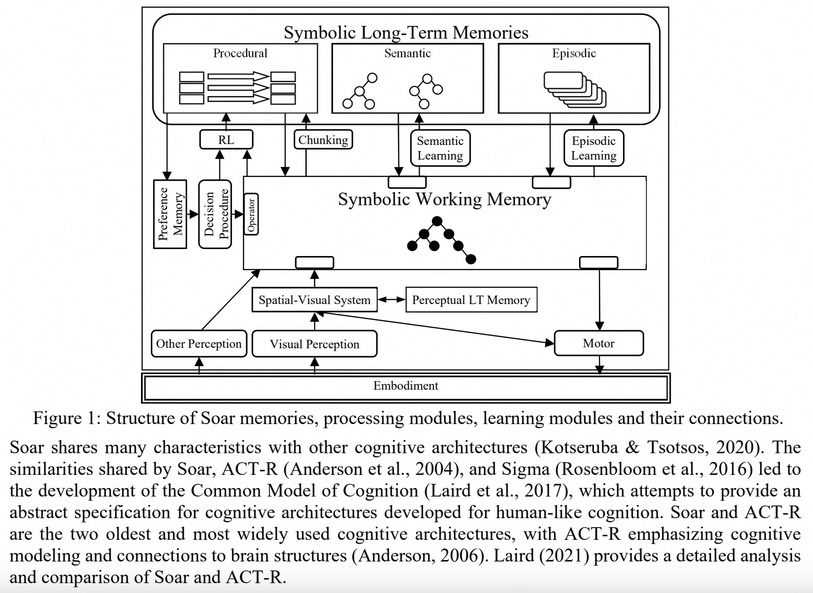
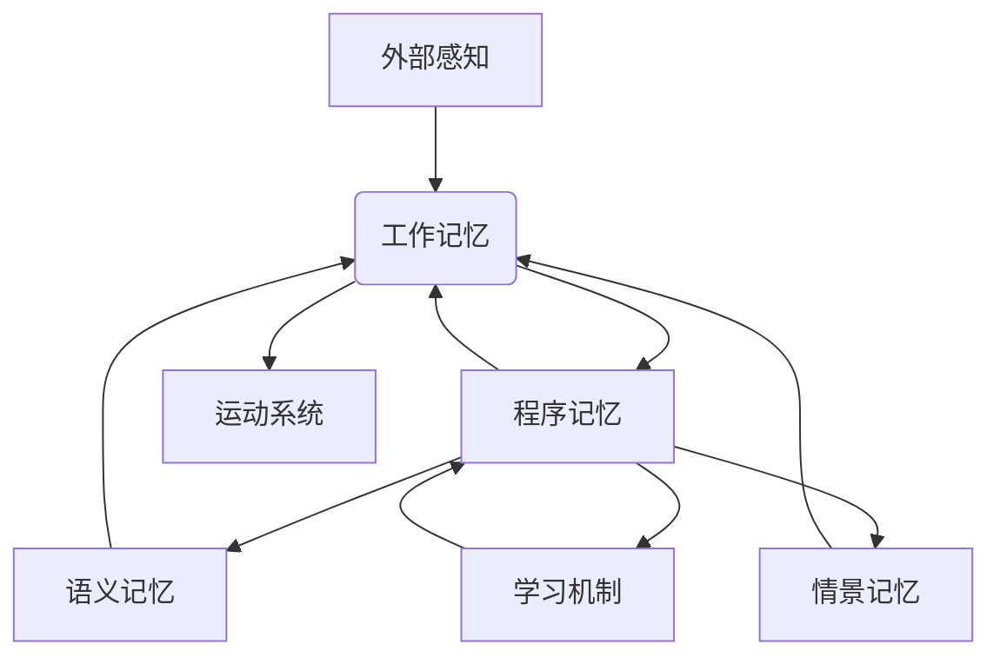
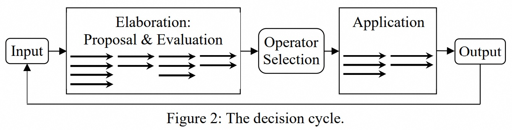
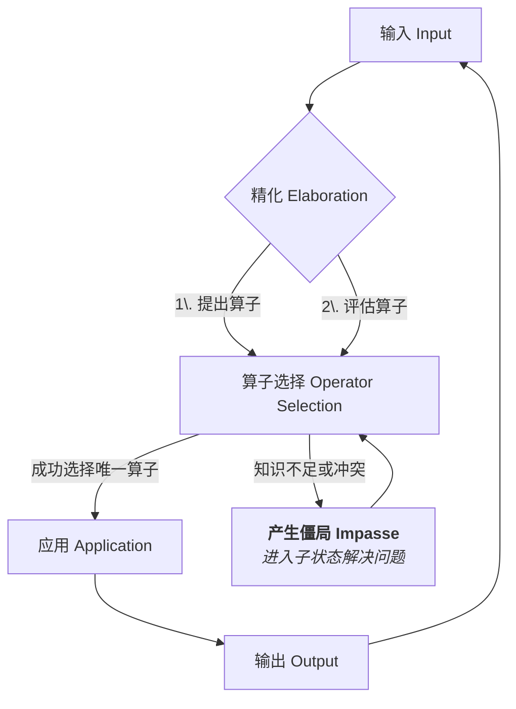
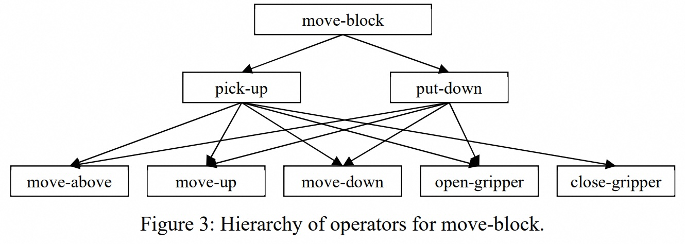
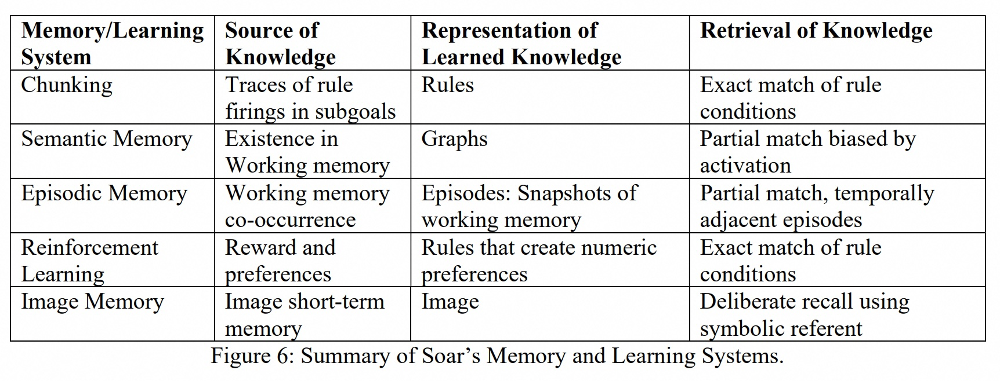
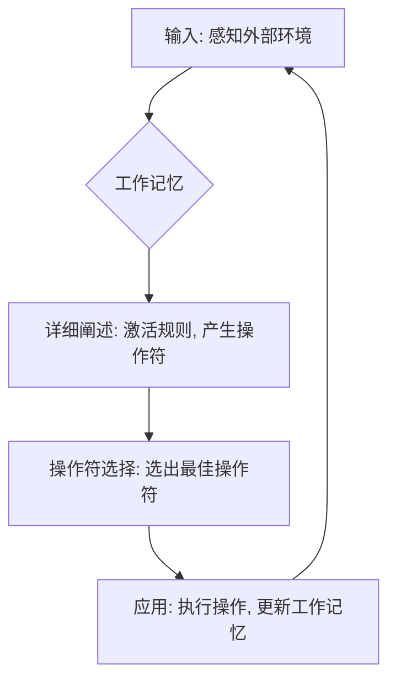

## AI论文解读 | Introduction to the Soar Cognitive Architecture
        
### 作者        
digoal        
        
### 日期        
2025-09-03       
        
### 标签        
PostgreSQL , PolarDB , DuckDB , AI , 论文解读        
        
----        
        
## 背景  
      
https://arxiv.org/pdf/2205.03854        
  
提示:          
```          
读懂《Introduction to the Soar Cognitive Architecture》这篇论文需要提前掌握哪些基础知识, 请使用中文通熟易懂的讲解这些基础知识, 可以引用论文中的图、表或使用Markdown支持的图形(text,mermaid等)增加解释性. 
  
使用中文通熟易懂的解读《Introduction to the Soar Cognitive Architecture》这篇论文, 其中的关键内容请着重讲解, 可以引用论文中的图、表或使用Markdown支持的图形(text,mermaid等)增加解释性. 
  
提取《Introduction to the Soar Cognitive Architecture》这篇论文中的重要术语, 使用中文对这些术语进行通熟易懂的讲解, 可以引用论文中的图、表或使用Markdown支持的图形(text,mermaid等)增加解释性. 
```     
  
## 1 前置知识 
  
读懂《Introduction to the Soar Cognitive Architecture》这篇论文，需要掌握一些核心基础知识。这篇论文本身就是一篇很好的入门读物，但理解以下概念会让你更容易理解Soar的设计理念和工作原理。

-----

### 1\. 什么是认知架构（Cognitive Architecture）？

首先，你需要理解“认知架构”这个核心概念。论文中提到 ，它不是一个解决特定问题的单一算法，而是一个与具体任务无关的基础设施，它能够学习、编码和应用知识来产生行为 。你可以把它想象成一个“通用大脑”，它提供固定的计算模块（比如记忆、决策机制等），然后通过这些模块来构建能够像人类一样思考和行动的人工智能。

### 2\. Soar的模块化结构

Soar的核心是其模块化的结构，就像人脑的不同区域各司其职一样。论文的图1（Figure 1）清晰地展示了Soar的各个组成部分，我将用通俗的方式解释其中最重要的几个：   

  * **符号工作记忆（Symbolic Working Memory）**: 这是Soar的短期记忆 。它就像你的“意识”或“工作台”，存储着当前任务的感知输入、推理中间结果、活跃目标和假设状态等信息 。它会实时更新，用来反映代理（agent）的当前情景。

  * **符号长期记忆（Symbolic Long-Term Memories）**: 这是Soar的长期记忆 ，包含三种类型：

      * **程序记忆（Procedural Memory）**: 这是Soar的“如何做”的知识库，存储的是技能和处理过程。它包含一套规则，当工作记忆中的内容匹配这些规则时，它就会被激活并做出修改工作记忆或执行操作的决定 。
      * **语义记忆（Semantic Memory）**: 这是Soar的“事实知识”库，存储关于世界和代理本身的事实 。比如，“天是蓝的”或“苹果是一种水果”之类的知识。
      * **情景记忆（Episodic Memory）**: 这是Soar的“经历记忆” ，存储的是过去经历的快照，可以用来回溯和回顾。



**图：Soar核心模块的简化交互流程**

### 3\. 决策循环（The Decision Cycle）

Soar的行为由一个被称为“决策循环”的连续过程驱动。这就像你的大脑处理信息、做出决定的最小单位。论文的图2（Figure 2）展示了这个循环，它主要分为四个阶段 ：   

1.  **输入（Input）**: 从感知、视觉系统和长期记忆中获取数据，并将其添加到工作记忆中 。
2.  **详细阐述（Elaboration）**: 这个阶段，所有相关的程序记忆规则都会并行触发，根据工作记忆的内容进行推理，并提出可能的“操作符”（Operators）。
3.  **操作符选择（Operator Selection）**: 基于详细阐述阶段提出的操作符和偏好（Preferences），Soar的决策程序会选择一个最佳的操作符来执行 。
4.  **应用（Application）**: 一旦操作符被选择，相关的应用规则就会被激活，执行这个操作符所代表的内部或外部动作 。

### 4\. 僵局与子状态（Impasses and Substates）

这是理解Soar最关键和独特的部分。当Soar的知识不足以在决策循环中做出一个明确的决定时，就会发生“僵局”（impasse）。

有三种主要类型的僵局 ：

  * **状态无变化（State no-change）**: 没有操作符被提出 。
  * **操作符冲突（Operator tie/conflict）**: 提出了多个操作符，但没有足够的偏好来选择一个 。
  * **操作符无变化（Operator no-change）**: 选定的操作符在多个周期内没有执行完成 。

为了解决僵局，Soar会创建一个“子状态”（substate），这就像一个“内部问题解决空间” 。Soar会进入这个子状态，并使用同样的决策循环和操作符来解决当前的问题，比如进行规划或从记忆中检索更多信息 。一旦僵局被解决，子状态就会被终止，Soar会返回到原来的任务中 。

-----

### 5\. 分块（Chunking）

分块是Soar的核心学习机制 。当Soar通过解决子状态中的僵局获得一个结果时，分块机制会自动将被动的、串行的推理过程编译成新的规则，并将其存储到程序记忆中 。这意味着，下一次遇到类似的情况时，Soar可以直接使用新学习的规则，而不需要再进入子状态去进行耗时的推理。

简单来说，分块把“刻意思考”的过程自动化，变成了“本能反应” 。

希望这些解释能帮助你更好地阅读和理解这篇论文。
  
## 2 解读论文 
  
好的，我们来一起深入浅出地解读《Introduction to the Soar Cognitive Architecture》这篇论文。

Soar 是一种认知架构，您可以把它想象成一个用于构建人工智能（AI）“大脑”的通用蓝图或操作系统 。它的目标不是解决某个特定问题，而是提供一套固定的、任务无关的计算模块，用来模拟和实现接近人类水平的智能行为 。

这篇解读将按照论文的结构，从核心结构、工作原理、学习机制等方面，为您揭示 Soar 的奥秘。

### 第一部分：Soar的核心结构——AI大脑的组成

Soar 的结构设计灵感来源于人类心智 ，由一系列独立但相互协作的模块构成，如下图1所示。我们可以把它比作一个信息处理工厂。

  

**图1：Soar 结构图** 

这张图是理解 Soar 的关键，我们可以将其主要部分划分为：

1.  **短期记忆 (Short-Term Memory)**:

      * **符号工作记忆 (Symbolic Working Memory)**: 这是 Soar 的“意识”或“桌面” 。所有当前的信息，比如从环境中感知到的情况、推理的中间结果、当前的目标等，都在这里处理 。

2.  **长期记忆 (Long-Term Memories)**: 这里存储着 AI 体的全部知识。

      * **程序性记忆 (Procedural Memory)**: 存储“如何做”的知识，以“如果...那么...”的规则形式存在 。这是驱动 Soar 行为的核心引擎 。
      * **语义记忆 (Semantic Memory)**: 存储“是什么”的知识，即关于世界和自身的客观事实，像一本百科全书 。例如，“苹果是红色的”。
      * **情景记忆 (Episodic Memory)**: 存储“发生了什么”的知识，即 AI 体的个人经历和记忆，像一本按时间排序的日记 。例如，“我昨天在这个房间看到了一个苹果”。

3.  **感知与运动系统 (Perception & Motor Systems)**:

      * **空间视觉系统 (Spatial-Visual System, SVS)**: 一个特殊的模块，用于处理非符号化的空间和视觉信息，支持心理意象等功能 。
      * **感知 (Perception)** 和 **运动 (Motor)**: 连接外部世界的接口，负责接收信息和执行动作 。

4.  **学习机制 (Learning Mechanisms)**:

      * Soar 拥有多种学习机制，如**组块化 (Chunking)**、**强化学习 (RL)** 等，它们会自动地从经验中学习和优化知识 。

**信息如何流动？**
论文中举了一个非常生动的例子 ：
想象一下，你听到指令“想象单词 WOW”。

1.  **感知**: “其他感知”模块将声音转化为符号化的文字 。
2.  **理解**: 程序性记忆中的语言理解规则被激活，解析指令，并从**语义记忆**中检索“WOW”的含义和视觉形象 。
3.  **心理意象**: 指令被发送到**空间视觉系统 (SVS)**，在“脑海”中形成“WOW”的图像 。
4.  **执行操作**: 接着指令是“把它旋转180度”。程序性知识再次解析指令，并命令 SVS 执行旋转操作 。
5.  **新发现**: SVS 旋转后的图像变成了“MOM” 。
6.  **记忆检索**: 最后的指令是“说出你上次见到这个人的姐姐是什么时候”。程序性知识首先从**语义记忆**中查找“MOM”（母亲）的“姐姐”（姨妈）是谁 ，然后用这个信息作为线索，从**情景记忆**中检索最近一次见到姨妈的记忆，并生成回答 。

这个例子完美展示了 Soar 各个模块是如何协同工作的。

-----

### 第二部分：Soar如何“思考”和“行动”——决策周期

Soar 的核心运作机制是一个不断循环的**决策周期 (Decision Cycle)**，如下图2所示。这个周期决定了 AI 体在每一时刻选择做什么。

  

**图2：决策周期** 

我们可以用一个 Mermaid 流程图来更清晰地展示这个过程：



这个周期的关键步骤是：

1.  **输入阶段 (Input Phase)**: 从感知系统（如摄像头、麦克风）和长期记忆（语义、情景记忆）中获取最新信息，并更新到工作记忆中 。

2.  **精化阶段 (Elaboration Phase)**: 这是“头脑风暴”阶段。程序性记忆中所有与当前情况匹配的规则都会被**并行激活** 。这些规则主要做三件事：

      * **情景精化**: 对当前情况进行推理和补充，得出新的结论（例如，“看到一个物体离我不到8英寸” -\> “这个物体可以被抓取”）。
      * **算子提议 (Operator Proposal)**: 根据当前目标和情况，提议所有可能采取的行动。这里的“算子 (Operator)”可以是一个外部动作（如“向前走”），也可以是一个内部心智活动（如“从记忆中检索信息”）。
      * **算子评估 (Operator Evaluation)**: 对所有被提议的算子进行评估，给出它们的偏好（如“A比B好”、“C是最佳选择”等）。

3.  **算子选择阶段 (Operator Selection Phase)**: Soar 的决策程序会根据精化阶段产生的所有偏好信息，选择一个最终要执行的算子 。

4.  **应用阶段 (Operator Application Phase)**: 一旦某个算子被选中，相关的规则就会被激活，执行这个算子，从而改变工作记忆或者向运动系统发送指令 。

5.  **输出阶段 (Output Phase)**: 将运动指令发送到外部执行器（如机器人的手臂）。

这个循环不断进行，使得 Soar 能够持续地对环境做出反应。

-----

### 第三部分：当知识不足时怎么办？——僵局与子状态

这是 Soar 架构中最具独创性和强大的部分。在现实世界中，我们常常会遇到知识不足的情况，比如“不知道下一步该做什么”或者“有多个选项，不知道选哪个好”。

当 Soar 在**算子选择阶段**无法做出明确决定时，就会产生一个**僵局 (Impasse)** 。常见的僵局类型有：

  * **状态无变化 (State no-change)**: 没有任何算子被提议，不知道能做什么 。
  * **算子冲突/平局 (Operator tie/conflict)**: 提议了多个算子，但偏好信息不足以决定选哪个 。
  * **算子无变化 (Operator no-change)**: 一个算子被选中了，但不知道如何具体执行它 。

Soar 的应对方法非常巧妙：**当遇到僵局时，它会创建一个“子状态 (Substate)”** 。可以把这理解为“把当前问题暂停，先去解决这个选择难题”。

在子状态中，Soar 的目标就是**解决导致僵局的问题**。它会像处理主任务一样，在子状态里进行完整的决策周期，提议、选择和应用新的算子 。例如：

  * **处理“算子冲突”**: AI 可能会在子状态中进行**前瞻性规划 (look-ahead planning)**，模拟执行每个选项后的结果，然后评估哪个结果更好，从而为主状态中的选择提供依据 。
  * **处理“算子无变化”**: 如果一个抽象的算子（如“打扫房间”）无法直接执行，Soar 会在子状态中将其分解为一系列更具体的子任务（如“找到垃圾”、“拿起垃圾”、“扔进垃圾桶”），这自然地形成了**层级任务分解 (Hierarchical Task Decomposition)** 。如下图3所示，`move-block`（移动积木）这个抽象算子被分解成了更小的步骤。

  

**图3：`move-block` 算子的层级分解** 

这种机制使得 Soar 能够从快速、自动的并行处理（规则激活）无缝切换到更深思熟虑、有条不紊的串行推理（在子状态中解决问题）。

-----

### 第四部分：Soar如何学习？——多样化的学习机制

学习是智能的核心。Soar 拥有多种学习机制，其中最核心的是**组块化 (Chunking)**。

#### 关键学习机制：组块化 (Chunking)

组块化与僵局和子状态机制紧密相连。当一个子状态成功解决了僵局并产生了结果后，**组块化机制会自动分析子状态中的推理过程，并将其编译成一条新的规则（即一个“组块”）** 。

这条新规则的“如果”部分，是导致问题解决的关键条件；“那么”部分，则是子状态最终得出的结果 。

**效果**: 下次再遇到类似的情况，AI 不再需要进入子状态进行复杂的推理，而是可以直接激活这条新学会的规则，一步到位地解决问题 。这就像我们初学驾驶时需要思考每一个步骤（挂挡、踩油门、看后视镜），但熟练后这些都变成了一个下意识的、自动化的动作。

组块化是一种非常强大的通用学习机制，它可以学习所有类型的程序性知识，包括：

  * 学习新的算子提议规则 
  * 学习更精确的算子评估知识（即决策启发）
  * 学习如何应用和执行算子 

#### 其他学习机制

  * **强化学习 (Reinforcement Learning)**: 通过接收外部或内部的奖励/惩罚信号，来调整算子评估规则中的**数值偏好**，从而优化决策，使得 AI 倾向于选择能带来长期最大化奖励的行动 。
  * **情景学习 (Episodic Learning)**: 自动记录 AI 在顶层状态经历的每一个决策瞬间，形成一连串的记忆快照 。这些记忆可以用于事后回顾、学习行为模型等 。
  * **语义学习 (Semantic Learning)**: 目前 Soar 还没有自动的语义学习机制，但 AI 体可以通过程序性知识主动地将新信息存储到语义记忆中 。

  

**图6：Soar 记忆与学习系统总结** 

| 记忆/学习系统 | 知识来源 | 学习知识的表示 | 知识检索方式 |
| :--- | :--- | :--- | :--- |
| **组块化 (Chunking)** | 子目标中的规则激活轨迹 | 规则 | 规则条件的精确匹配 |
| **语义记忆 (Semantic Memory)** | 工作记忆中的存在 | 图结构 | 基于激活度的部分匹配 |
| **情景记忆 (Episodic Memory)** | 工作记忆共现 | 情景：工作记忆快照 | 部分匹配，时间上相邻 |
| **强化学习 (RL)** | 奖励和偏好 | 产生数值偏好的规则 | 规则条件的精确匹配 |

-----

### 第五部分：总结与评价

Soar 是一个功能强大且全面的认知架构，它整合了符号处理、多种记忆系统、灵活的决策机制和多样的学习方法。

**核心优势**:

  * **统一性**: 试图用一套统一的机制（决策周期、僵局、子状态）来解释广泛的认知现象，从快速反应到深思熟虑的规划 。
  * **灵活性和适应性**: 能够根据环境变化实时、灵活地调整行为 。
  * **强大的学习能力**: 通过组块化，能将深思熟虑的推理过程转化为高效的自动化技能 。

**当前局限**:
论文作者 John E. Laird 也坦诚地指出了 Soar 仍存在的不足 。尽管在很多方面取得了进展，但在以下方面仍有较大差距：

  * **自我意识和自我模型 (Sense of self)**: Soar 智能体没有一个关于“自我”的明确表征 。
  * **核心与常识知识 (Core and commonsense knowledge)**: 缺乏人类与生俱来的核心知识和大量的常识，导致 AI 在开放环境中表现脆弱 。
  * **自主引导 (Bootstrapping)**: 现有的 Soar 智能体仍然需要大量的人工知识编码，无法像人类一样从零开始，通过与环境的互动自主地学习和成长为一个全能的智能体 。

总而言之，这篇论文为我们提供了一个关于 Soar 认知架构全面而清晰的概览。Soar 不仅仅是一个软件系统，更是一个关于智能如何运作的计算理论，它为我们探索通用人工智能的实现路径提供了宝贵的思路和强大的工具。
  
## 3 术语 
  
好的，根据《Introduction to the Soar Cognitive Architecture》这篇论文的内容，我为你整理并解释了几个重要的核心术语。理解了这些，你就基本掌握了Soar架构的设计理念。

-----

### 1\. 认知架构（Cognitive Architecture）

**通俗解释：** 认知架构就像一个“通用大脑”的蓝图。它不是一个用来解决特定问题的具体程序（比如下棋或翻译），而是一套固定的、与任务无关的基础计算模块，这些模块能够学习、存储知识，并用这些知识来产生行为。你可以把Soar看作是一个通用的AI平台，你可以在上面构建各种智能体（agent），让它们拥有像人类一样的认知能力。

### 2\. 工作记忆（Working Memory）

**通俗解释：** 工作记忆是Soar的**短期记忆**。它就像你大脑里的一个“工作台”，存放着当前正在处理的所有信息。比如，你正在看的一张图片、你正在思考的目标、刚刚得出的一个结论，都会暂时存储在这里。工作记忆会不断更新，反映出代理在环境中的最新状态。

### 3\. 长期记忆（Long-Term Memories）

**通俗解释：** 长期记忆是Soar的“知识仓库”，它存储着代理永久性的知识。论文中将它分为三种类型，每种类型对应一种不同的知识：

  * **程序记忆（Procedural Memory）**: 存储的是 **“如何做”** 的知识，也就是技能或规则。比如，“如果看到红灯，就停车”就是一条程序规则。Soar用这种记忆来做出决策。
  * **语义记忆（Semantic Memory）**: 存储的是 **“是什么”** 的事实知识。比如，“猫是一种动物”，“巴黎是法国的首都”。
  * **情景记忆（Episodic Memory）**: 存储的是 **“曾发生过什么”** 的经历。这是一种按时间顺序排列的记忆，可以用来回顾过去的事件。

### 4\. 决策循环（The Decision Cycle）

**通俗解释：** 这是Soar运作的核心机制。它是一个持续的、不可中断的过程，就像一个永不停歇的思考机器。每完成一次循环，Soar就会做出一个微小的决策。

这个循环主要有四个步骤：

1.  **输入（Input）**: 从外部环境或长期记忆中获取信息，并放入工作记忆。
2.  **详细阐述（Elaboration）**: 激活所有相关的程序记忆规则，进行推理，并生成可能的“操作符”。
3.  **操作符选择（Operator Selection）**: 从上一步生成的候选中，根据“偏好”（preferences）选择一个最佳的“操作符”。
4.  **应用（Application）**: 执行被选择的“操作符”，更新工作记忆或执行外部动作。




**图：Soar决策循环流程图**

### 5\. 操作符（Operator）

**通俗解释：** “操作符”是Soar解决问题的基本单位，代表着一个意图、一个目标或一个行动。它可以是外部动作（如“移动手臂”），也可以是内部认知动作（如“规划路径”）。在一个决策循环中，Soar会选择一个操作符来执行。

### 6\. 僵局与子状态（Impasses and Substates）

**通俗解释：** 这是Soar处理复杂问题的方法。当Soar的决策循环卡住，无法做出一个明确的决定时，就会进入 **“僵局”** （Impasse）。比如：

  * 不知道该做什么（没有操作符）
  * 有很多选择，不知道选哪个（多个操作符）
  * 选定的操作符无法执行

当出现僵局时，Soar会立即创建一个 **“子状态”** （Substate）。你可以把它看作是在原问题内部开辟了一个“思考空间”或“子任务”，让Soar可以专注于解决导致僵局的这个小问题。一旦子状态里的问题解决了，Soar就会回到原来的任务中。

### 7\. 分块（Chunking）

**通俗解释：** **分块是Soar的核心学习机制。** 当Soar通过解决子状态中的僵局找到了一个新方法时，它会把这个解决过程自动“编译”成一个新的规则，并把它存储到**程序记忆**中。

这样做的目的是将“刻意思考”的过程自动化，变成“本能反应”。下次再遇到类似问题时，Soar可以直接使用新学习的规则，而不需要再次进入子状态去慢慢解决，从而提高了效率。
  
## 参考        
         
https://arxiv.org/pdf/2205.03854    
        
<b> 以上内容基于DeepSeek、Qwen、Gemini及诸多AI生成, 轻微人工调整, 感谢杭州深度求索人工智能、阿里云、Google等公司. </b>        
        
<b> AI 生成的内容请自行辨别正确性, 当然也多了些许踩坑的乐趣, 毕竟冒险是每个男人的天性.  </b>        
    
#### [期望 PostgreSQL|开源PolarDB 增加什么功能?](https://github.com/digoal/blog/issues/76 "269ac3d1c492e938c0191101c7238216")
  
  
#### [PolarDB 开源数据库](https://openpolardb.com/home "57258f76c37864c6e6d23383d05714ea")
  
  
#### [PolarDB 学习图谱](https://www.aliyun.com/database/openpolardb/activity "8642f60e04ed0c814bf9cb9677976bd4")
  
  
#### [PostgreSQL 解决方案集合](../201706/20170601_02.md "40cff096e9ed7122c512b35d8561d9c8")
  
  
#### [德哥 / digoal's Github - 公益是一辈子的事.](https://github.com/digoal/blog/blob/master/README.md "22709685feb7cab07d30f30387f0a9ae")
  
  
#### [About 德哥](https://github.com/digoal/blog/blob/master/me/readme.md "a37735981e7704886ffd590565582dd0")
  
  

  
