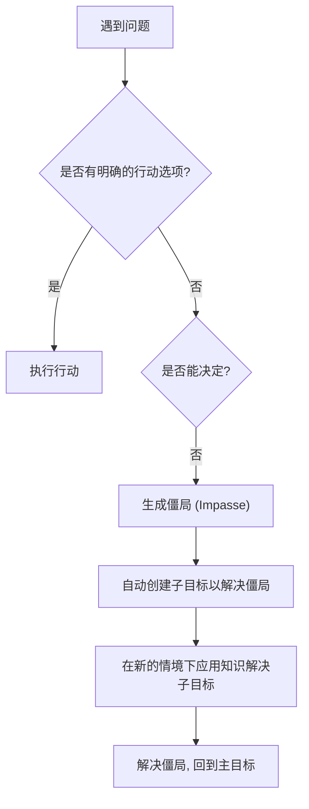
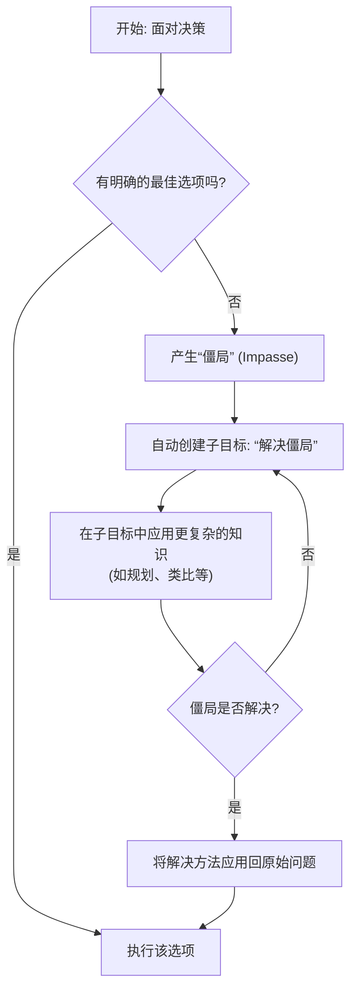

## AI论文解读 | Soar: A Functional Approach to General Intelligence
        
### 作者        
digoal        
        
### 日期        
2025-09-03       
        
### 标签        
PostgreSQL , PolarDB , DuckDB , AI , 论文解读        
        
----        
        
## 背景  
      
https://web.eecs.umich.edu/~soar/sitemaker/docs/misc/SoarFunctionalOverview.pdf        
  
提示:          
```          
读懂《Soar: A Functional Approach to General Intelligence》这篇论文需要提前掌握哪些基础知识, 请使用中文通熟易懂的讲解这些基础知识, 可以引用论文中的图、表或使用Markdown支持的图形(text,mermaid等)增加解释性. 
  
使用中文通熟易懂的解读《Soar: A Functional Approach to General Intelligence》这篇论文, 其中的关键内容请着重讲解, 可以引用论文中的图、表或使用Markdown支持的图形(text,mermaid等)增加解释性. 
  
提取《Soar: A Functional Approach to General Intelligence》这篇论文中的重要术语, 使用中文对这些术语进行通熟易懂的讲解, 可以引用论文中的图、表或使用Markdown支持的图形(text,mermaid等)增加解释性. 
```     
  
## 1 前置知识 
  
为了更好地理解《Soar: A Functional Approach to General Intelligence》这篇论文，你需要先了解一些基础概念。这篇论文将 Soar 描述为一种理论，同时也是一种软件架构，旨在描述并实现智能的基本功能组件 。它源于计算机科学和认知心理学在问题解决和学习方面的研究 。

以下是一些帮助你理解这篇论文的关键基础知识：

### 1\. 认知架构 (Cognitive Architecture)

Soar 是一种认知架构，它的核心思想是：智能可以被分解成一系列核心机制，这些机制共同工作以产生智能行为 。你可以把认知架构想象成一个“大脑”的蓝图。它不是一个完整的、现成的智能系统，而是提供了一个框架，让开发者可以在此基础上构建具体的智能代理（agent）。

### 2\. 符号主义 (Symbolism)

Soar 是一种符号主义人工智能（Symbolic AI）的典范。这意味着它主要通过符号（symbols）来处理知识和信息，而不是像神经网络那样处理数字和矩阵。例如，在论文中提到的飞行员代理，它可能会用一个符号来表示“敌机”，另一个符号表示“朝向我方”，然后通过规则来推断出“敌机对我方有威胁” 。

这种方法的优点是知识是可解释的，你可以清楚地看到系统是如何做出决策的。

### 3\. 基于规则的系统 (Rule-based Systems)

Soar 的核心知识库由规则组成 。这些规则遵循“如果-那么”（If-Then）的逻辑。例如，一个规则可能是：“**如果**当前目标是拦截，**并且**目标进入武器射程，**那么**发射武器。”

当系统运行时，它会不断地将当前情境（如环境感知、内部状态等）与知识库中的规则进行匹配。任何匹配成功的规则都会被激活，并可能导致进一步的推理或行动 。

### 4\. 几个核心机制

论文详细介绍了 Soar 的几个核心功能机制 。理解它们是理解 Soar 工作原理的关键。

#### a. 并行、联想记忆 (Parallel, associative memory)

Soar 使用一种高效的模式匹配器，将当前情境与知识库中的规则进行比较 。这个过程是并行的，这意味着可以同时激活许多相关的知识 。这使得一个 Soar 代理可以在处理一个问题时，同时考虑多种解决方案，比如问题分解、类比或实验 。你可以想象它像一个超级高效的图书馆管理员，当你问一个问题时，他能立刻找出所有可能相关的书籍（规则），而不是一本一本去查。

#### b. 信念维护 (Belief maintenance)

由于 Soar 代理通常处于动态环境中，它需要不断更新对世界的认知 。这就像一个飞行员，需要实时更新敌机的位置和状态 。Soar 采用了一种计算量较小的真值维护算法，可以自动更新信念 。这使得开发者无需手动编写复杂的代码来管理信念的变化 。

#### c. 基于偏好的决策 (Preference-based deliberation)

当一个 Soar 代理面临多个选择时，它不会“自动”做出决定 。相反，它会使用额外的知识来对这些选择进行**偏好**排序 。例如，在面对多个目标时，它可能会根据威胁程度来判断哪个是首要目标 。Soar 的决策程序会根据这些偏好来选择最佳行动 。

#### d. 自动子目标生成 (Automatic subgoaling)

当一个 Soar 代理遇到“僵局”（impasse）时，例如没有可行的选项，或者多个选项之间存在冲突，Soar 会自动生成一个**子目标**来解决这个僵局 。

你可以用一个简单的流程图来理解这个过程：



这个机制使得 Soar 代理具备了元级别推理能力，即能够“思考如何思考” 。

#### e. 经验泛化与学习 (Adaptation via generalization of experience)

当一个僵局被解决后，Soar 会将解决该问题所用的推理过程进行总结和泛化，形成新的知识 。这些新的知识可以帮助代理在将来遇到类似情况时避免再次陷入僵局 。

这篇论文的核心在于，Soar 通过一个小型且通用的机制集合，试图实现所有类型的智能行为 。它不像其他一些 AI 系统那样，为特定任务（如规划）提供现成的强大功能，而是提供了一个统一的底层架构，允许开发者将不同类型的知识（如规划、语言理解、类比推理）整合在一起 。这种“灵活性换取强大功能”的权衡，正是 Soar 架构的关键所在 。
  
## 2 解读论文 
  
好的，我们来一起解读《Soar：一种实现通用智能的功能性方法》这篇论文。

这篇论文主要介绍了 Soar 这个认知架构（Cognitive Architecture）。你可以把 Soar 理解为一个理论框架，也是一套软件系统。它的目标非常宏大：**试图找出并实现一套足以支撑所有智能行为的、最精简的核心功能机制** 。

为了验证这些机制是否真的“足够”，研究人员不断地将 Soar 应用于各种复杂的实际问题中，以此来发现其理论和软件实现的不足之处，并持续改进它 。论文中反复提及的一个核心实例是 **TacAir-Soar** ，这是一个用于模拟美国海军固定翼飞机飞行员在复杂战术环境下进行决策和操作的智能系统，这充分体现了 Soar 在真实、复杂场景下的应用能力 。

-----

### **Soar 的核心功能机制**

论文着重介绍了构成 Soar 的几个关键功能组件，正是这些组件的协同工作，使得 Soar 能够表现出复杂的智能行为。

#### 1\. **并行、联想式记忆 (Parallel, associative memory)**

Soar 的知识都存储在一个巨大的“知识库”中。当面对一个具体情境时，它不是像传统程序那样按顺序一条一条地执行指令，而是通过一种高效的**符号模式匹配器 (symbolic pattern matcher)**，将当前的情境与知识库中所有知识的“激活条件”进行并行比较 。

  * **核心思想**：所有相关的知识会被同时“激活”并被提取出来，共同作用于当前的问题 。
  * **优势**：这种并行联想机制使得 Soar 在解决一个问题时，可以同时考虑多种不同的解法，比如问题分解、类比推理、实验探索等，而不是局限于单一的思路 。Soar 的控制流是由记忆中的关联性决定的，而非写死的程序逻辑 。

#### 2\. **信念维持 (Belief maintenance)**

智能体（Agent）通常处在动态变化的环境中 。Soar 内部有一个计算开销很低的**真值维护系统 (truth maintenance algorithm)**，能够根据环境的变化自动更新自己的信念 。

  * **举例**：论文中提到，一个飞行员智能体可能根据敌机的朝向数据，得出了“敌机正瞄准我”的信念 。一旦外部传感器传来敌机改变航向的新数据，这个系统会自动修正或撤销“被瞄准”这个信念，无需开发者编写额外的代码来处理这种逻辑 。
  * **作用**：这确保了智能体能够对环境变化做出快速响应，保持状态的真实性 。

#### 3\. **基于偏好的审议 (Preference-based deliberation)**

光有对环境的快速反应是不够的，智能体还需要能够设定并坚持长远的目标 。Soar 通过一种“审议”机制来平衡反应性和目标导向性 。

当面临多个可选的目标或行动时，Soar 不会“自动”做出选择 。它会利用更多的知识来评估每个选项，并为它们设定**偏好 (preferences)** 。

  * **举例**：一个飞行员智能体可能同时发现了多个攻击目标 。它会利用已有的知识（例如，哪个目标威胁最大、哪个武器射程最远、哪个目标距离最近等）来为不同的目标赋予偏好，然后 Soar 的决策程序会根据这些偏好做出最终决定 。
  * **核心思想**：决策过程是由智能体自身的知识驱动的，而不是一个固化的选择逻辑 。

#### 4\. **自动子目标 (Automatic subgoaling)**

这是 Soar 最具特色的机制之一。在决策过程中，如果智能体遇到以下情况，就会陷入 **“僵局” (impasse)** ：

  * 不知道下一步该做什么（没有可用选项） 。
  * 无法在多个选项中做出选择（例如，偏好冲突） 。
  * 知道目标，但不知道如何具体执行 。

一旦出现僵局，Soar 会**自动创建一个子目标 (subgoal)**，这个子目标的目的就是“解决这个僵局” 。

  * **举例（冲突僵局）**：假设飞行员的知识告诉它，应该优先攻击“武器射程最远”的目标，同时又应该优先攻击“距离最近”的目标 。如果这两个目标不是同一个，就产生了冲突，Soar 会立即创建一个子目标，专门用来解决“到底先打谁”这个问题 。
  * **解决方式**：在子目标这个新的问题情境中，智能体可以调用更深层次的知识，比如进行规划推演（如果我先攻击A会怎样？先攻击B又会怎样？），或者进行类比推理（我以前遇到类似情况是怎么处理的？），从而找到解决僵局的办法 。

这个机制赋予了 Soar 一种**元认知能力**，即“对自身思考过程的思考” 。

我们可以用一个简单的流程图来理解这个过程：



#### 5\. **通过问题空间进行分解 (Decomposition via problem spaces)**

当智能体知道目标（例如“拦截敌机”），但没有直接的、单一的操作可以完成时，也会产生僵局 。此时，自动创建的子目标就起到了**任务分解**的作用 。

  * **举例**：“拦截敌机”是一个高层次目标。为了实现它，Soar 会进入一个子目标。在这个子目标里，智能体只需要考虑与拦截相关的操作，比如“接近目标”、“锁定武器”等，而暂时忽略更高层次的“执行巡逻任务”或更低层次的“具体如何操作舵面”等问题 。
  * **优势**：这种分解将一个可能指数级复杂的决策过程，分解成一系列更小、更易于管理的选择集合，极大地提高了计算效率，并让智能体能聚焦于当前最重要的问题上 。这背后是 Soar 的一个核心理论基础——**问题空间假说 (problem space hypothesis)** 。

#### 6\. **通过经验泛化进行适应 (Adaptation via generalization of experience)**

Soar 的学习机制与“僵局”紧密相连。僵局的出现，本质上是因为缺少能直接处理当前状况的知识 。

当智能体通过在子目标中一番“深思熟虑”最终解决了僵局后，Soar 会自动将解决这个僵局的整个推理过程进行**总结和泛化 (summarizes and generalizes)**，并形成一条新的知识（规则） 。

  * **效果**：当下一次遇到类似的情境时，这条新知识就会被直接激活，智能体就能直接做出决策，从而**避免了再次陷入同样的僵局** 。
  * **学习方式**：这个看似简单的泛化机制非常强大，研究表明它可以实现多种不同风格的学习，比如学习新概念、新流程，甚至通过环境反馈来纠正错误的知识 。

-----

### **Soar 的优势与挑战**

#### **优势：**

  * **高度集成与灵活性**：Soar 提供了一套统一的底层机制，能够自然地将规划、执行、自然语言理解、类比推理等多种智能行为无缝集成在一起 。它不像许多专用的 AI 系统，在集成不同模块时会遇到巨大困难 。Soar 用强大的灵活性换取了在特定任务上可能不如专用系统强大的性能 。
  * **效率和性能**：尽管不是理论的核心，但 Soar 的研究社区一直致力于工程优化，以实现极高的运行效率和性能，确保智能体能够快速响应 。

#### **挑战：**

  * **知识工程的瓶颈**：Soar 自身只提供了一套非常通用的底层机制 。一个智能体的绝大部分能力来源于开发者为其编写的知识（即规则集） 。这意味着，要构建一个强大的 Soar 智能体，需要投入大量精力进行知识编码 。例如，虽然 Soar 可以用来构建规划系统，但它本身不提供现成的规划语言或算法，这些都需要开发者自己来实现 。

### **总结**

Soar 是一个雄心勃勃的项目，它试图通过一套精简、通用的功能组件来解释和实现通用人工智能。它的核心在于**通过并行联想记忆激活知识，通过偏好进行审议决策，并在遇到“僵局”时自动创建子目标来驱动深度思考、任务分解和学习**。虽然构建一个知识丰富的 Soar 智能体极具挑战，但它在实现高度集成、行为灵活复杂的智能系统方面，展现了巨大的潜力和成功，TacAir-Soar 就是最好的证明 。
  
## 3 术语 
  
Soar 是一套旨在实现通用智能的理论和软件架构，它描述并实现了智能的基本功能组件 。为了更好地理解这篇论文，掌握其中的核心术语至关重要。

---

### 1. 认知架构 (Cognitive Architecture)
Soar 是一个认知架构 。它不是一个具体的智能系统，而是一个框架，提供了实现智能行为所需的一系列基本机制 。你可以将认知架构想象成一个“大脑的蓝图”或者“智能系统的操作系统”，它定义了如何组织知识以及如何进行推理，而具体的“智能”则由开发者在这个框架上通过编写知识库来实现 。

### 2. 并行、联想记忆 (Parallel, associative memory)
这是 Soar 用来识别并利用与当前问题相关的知识的机制 。Soar 的知识库包含大量规则，一个高效的符号模式匹配器会将当前情境（即“推理上下文”）与这些规则的激活条件进行比较 。任何相关的知识都会被激活，从而进一步丰富当前情境 。这个过程可以同时发生，因为许多关联可以独立进行 。例如，一个 Soar 代理可以同时考虑问题分解、类比或实验等多种解决方案 。

### 3. 信念维护 (Belief maintenance)
Soar 代理通常处于复杂且动态的环境中 。信念维护是一种计算成本较低的算法，用于自动更新代理对世界的信念 。例如，一个飞行员代理可能相信一架敌机正朝着它飞来，这个信念源于敌机的航向等环境输入 。当敌机的航向改变时，代理会自动更新其信念 。这个机制使得代理能对环境变化迅速做出反应 。

### 4. 偏好 (Preferences)
偏好是 Soar 用来在多个可能的目标或行动中进行选择的显式表示 。当一个代理面临多种选择时，它会运用额外的知识来断言对不同目标的偏好 。例如，面对多个拦截目标，代理会使用各种衡量标准来确定主要威胁，并基于此做出决策 。重要的是，Soar 的选择不是“自动”的，而是通过代理的知识来达成的 。

### 5. 自动子目标生成 (Automatic subgoaling)
当 Soar 代理遇到“僵局”（impasse）时——例如，找不到可行的行动选项，或无法在不同选项间做出决定时 ——它会自动创建一个子目标来解决这个僵局 。这个过程会生成一个新的问题情境，代理可以在此基础上应用新知识进行推理 。比如，代理可能会使用规划知识来推演未来，或通过类比来做出选择 。自动子目标生成赋予了 Soar 代理元级别推理能力，即“对自身推理进行推理的能力” 。

### 6. 问题空间 (Problem spaces)
问题空间是 Soar 用来实现任务分解的一种方法 。当代理知道要做什么，但没有立即实现该目标的行动时，也会发生僵局 。这种僵局会创建一个新的目标，例如“执行任务”或“拦截目标” 。这个过程允许代理将一个大任务分解成更小的步骤，并在每一步只关注与该级别相关的知识，从而将潜在的庞大选择集缩小到更小、更易于管理的集合 。这种聚焦于当前问题的做法是“问题空间假设”的核心，也是 Soar 的理论基础之一 。

### 7. 经验泛化 (Generalization of experience)
这是 Soar 的适应机制 。当一个僵局被解决后，Soar 会对解决过程进行总结和泛化，从而产生新的知识 。这些新知识将帮助代理在将来遇到类似情况时避免再次陷入僵局 。通过这个机制，Soar 可以学习新的概念、新程序，甚至在获得经验反馈后纠正其知识 。

---

这些术语共同构成了 Soar 架构的核心机制。它们相互协作，使得 Soar 能够处理复杂、动态的环境，并展现出适应和学习能力。
  
## 参考        
         
https://web.eecs.umich.edu/~soar/sitemaker/docs/misc/SoarFunctionalOverview.pdf    
        
<b> 以上内容基于DeepSeek、Qwen、Gemini及诸多AI生成, 轻微人工调整, 感谢杭州深度求索人工智能、阿里云、Google等公司. </b>        
        
<b> AI 生成的内容请自行辨别正确性, 当然也多了些许踩坑的乐趣, 毕竟冒险是每个男人的天性.  </b>        
    
#### [期望 PostgreSQL|开源PolarDB 增加什么功能?](https://github.com/digoal/blog/issues/76 "269ac3d1c492e938c0191101c7238216")
  
  
#### [PolarDB 开源数据库](https://openpolardb.com/home "57258f76c37864c6e6d23383d05714ea")
  
  
#### [PolarDB 学习图谱](https://www.aliyun.com/database/openpolardb/activity "8642f60e04ed0c814bf9cb9677976bd4")
  
  
#### [PostgreSQL 解决方案集合](../201706/20170601_02.md "40cff096e9ed7122c512b35d8561d9c8")
  
  
#### [德哥 / digoal's Github - 公益是一辈子的事.](https://github.com/digoal/blog/blob/master/README.md "22709685feb7cab07d30f30387f0a9ae")
  
  
#### [About 德哥](https://github.com/digoal/blog/blob/master/me/readme.md "a37735981e7704886ffd590565582dd0")
  
  

  
