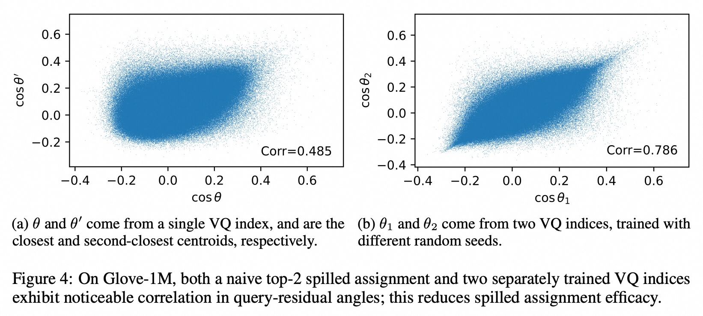
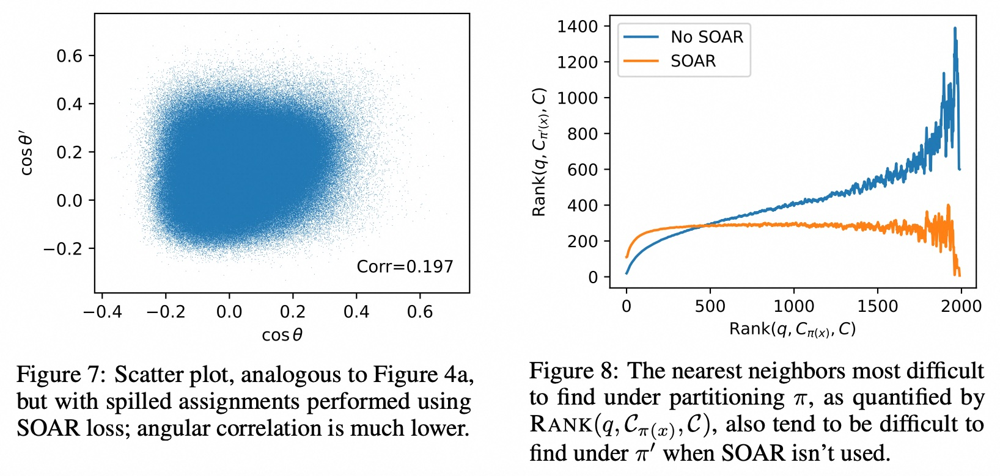

## AI论文解读 | SOAR: Improved Indexing for Approximate Nearest Neighbor Search
        
### 作者        
digoal        
        
### 日期        
2025-09-03       
        
### 标签        
PostgreSQL , PolarDB , DuckDB , AI , 论文解读        
        
----        
        
## 背景  
      
https://arxiv.org/pdf/2404.00774        
  
提示:          
```          
读懂《SOAR: Improved Indexing for Approximate Nearest Neighbor Search》这篇论文需要提前掌握哪些基础知识, 请使用中文通熟易懂的讲解这些基础知识, 可以引用论文中的图、表或使用Markdown支持的图形(text,mermaid等)增加解释性. 
  
使用中文通熟易懂的解读《SOAR: Improved Indexing for Approximate Nearest Neighbor Search》这篇论文, 其中的关键内容请着重讲解, 可以引用论文中的图、表或使用Markdown支持的图形(text,mermaid等)增加解释性. 
  
提取《SOAR: Improved Indexing for Approximate Nearest Neighbor Search》这篇论文中的重要术语, 使用中文对这些术语进行通熟易懂的讲解, 可以引用论文中的图、表或使用Markdown支持的图形(text,mermaid等)增加解释性. 
```     
  
## 1 前置知识 
  
根据您提供的论文《SOAR: Improved Indexing for Approximate Nearest Neighbor Search》内容，要读懂这篇论文，您需要提前掌握以下几个核心基础知识。这些概念是理解论文中提出的SOAR（Spilling with Orthogonality-Amplified Residuals）技术如何工作的关键。

### 1. 最近邻搜索 (k-NN) 与近似最近邻搜索 (ANN)
* **什么是最近邻搜索 (k-NN)**：这是论文讨论的根本问题。给定一个数据集，其中包含很多高维向量（例如，深度学习模型生成的词向量或图像向量），以及一个查询向量，k-NN的目标是找到数据集中与查询向量最相似的**k个**向量 。相似性通常通过距离来衡量，比如欧氏距离或内积。
* **为什么要近似最近邻搜索 (ANN)**：当数据集非常庞大（例如，论文中提到现在的数据集动辄十亿个向量，每个向量有数百个维度）时 ，精确的k-NN搜索（线性扫描）会变得计算量巨大、无法实现 。这就是“**维度诅咒**”带来的挑战 。因此，我们需要ANN，它牺牲了一点点搜索精度，来换取搜索速度的显著提升 。

### 2. 向量量化 (Vector Quantization, VQ)
向量量化是实现ANN的一种常见方法。它的核心思想是通过聚类来简化搜索空间 。
* **什么是向量量化**：VQ会把原始数据集`X`中的每个高维向量，映射到一组数量更少、预先定义的“**聚类中心**”（也被称为“**码本**”`C`）中的一个 。这个过程类似于对数据进行“分区” 。
* **如何加速搜索**：有了聚类中心后，我们可以创建一个**倒排文件索引 (IVF)** 。在搜索时，我们首先找出与查询向量最相似的几个聚类中心，然后只在这些聚类中心所对应的分区中，进行精确的暴力搜索 。这大大减少了需要搜索的数据量，从而提高了效率 。

### 3. 残差向量 (Residual Vector)
这是理解SOAR技术中“Residuals”的关键概念。
* **什么是残差**：对于数据集中的一个向量`x`，它与其被量化后的聚类中心`C_π(x)`之间的差值，就被定义为**残差向量**`r`，即`r = x - C_π(x)` 。残差向量代表了向量`x`在被量化后所损失的信息。
* **残差与搜索难度**：论文指出，**查询向量`q`与残差向量`r`之间的内积**`⟨q,r⟩`，直接决定了搜索的难度 。当这个内积值很高时，意味着量化后的近似结果与真实结果偏差较大，导致算法需要搜索更多的分区才能找到正确的最近邻 。

### 4. SOAR的核心思想：正交性与多重分配
SOAR技术正是为了解决残差向量带来的搜索难题。
* **问题的核心**：仅仅使用一个聚类中心可能会在某些情况下导致搜索困难 。一种朴素的解决方案是为每个数据点分配多个聚类中心（即“spilling”，溢出），这为搜索提供了“第二次机会” 。然而，如果这些额外的分配与原始分配具有**相关性**（例如，分配的聚类中心彼此距离很近），那么它们提供的帮助就会很有限，因为它们在同样的情况下都会失败 。
* **SOAR的创新**：SOAR通过引入一个新颖的**损失函数**，来解决这种相关性问题 。这个损失函数不仅考虑量化误差，还特别施加了惩罚，以确保新选择的聚类中心所产生的**残差向量`r'`与原始残差向量`r`尽可能地正交**（即垂直，内积接近于零）。
* **为何正交性重要**：当两个残差向量正交时，它们与查询向量形成的夹角彼此独立，从而大大降低了它们同时导致高搜索难度的可能性 。这正是SOAR名称“Orthogonality-Amplified Residuals”（正交性增强残差）的由来 。通过这种方式，SOAR可以显著降低不同聚类中心分配之间的失败相关性，从而提高整体搜索效率 。

希望这些基础知识能帮助您更好地理解这篇论文。如果您有其他问题，或者想进一步讨论论文中的特定部分，请随时告诉我。
  
## 2 解读论文 
  
好的，我们来通俗易懂地解读一下《SOAR: Improved Indexing for Approximate Nearest Neighbor Search》这篇论文。

简单来说，这篇论文提出了一种名为 **SOAR** 的新技术，旨在让我们在海量数据（例如数十亿张图片或文本）中进行“找相似”的操作时，能够**更快、更准、也更省钱**。

-----

### 一、核心问题：为什么“向量搜索”需要提速？

在现代AI应用中，我们经常需要处理“向量”（vector）。你可以把向量想象成一个高维空间中的点，用来代表一张图片、一段文字或一个用户的兴趣。**向量搜索**（或称“最近邻搜索”）的核心任务就是：给定一个查询向量（比如一张猫的图片），从数据库里成千上万的向量中，找出和它最“像”（距离最近）的几个。

这个技术是许多应用的核心，比如：

  * **推荐系统**：找到与你喜欢的商品相似的其他商品 。
  * **以图搜图**：找到与你上传图片内容相似的图片 。
  * **大语言模型（LLM）**：从庞大的知识库中检索最相关的段落来回答问题 。

当数据量达到数十亿级别时，一个一个地去比较（即“暴力搜索”）是不现实的，太慢了。因此，**近似最近邻（ANN）** 搜索技术应运而生，它牺牲一点点精度，来换取几十甚至几百倍的搜索速度提升 。

目前，一类主流的ANN方法叫做**向量量化（Vector Quantization, VQ）**。

#### VQ的工作原理

你可以把整个数据空间想象成一个国家，所有数据点就是这个国家的居民。VQ做的事情就是：

1.  **划分区域**：在国家里设立几千个“社区中心”（即分区中心，Centroids）。
2.  **居民归属**：让每个居民（数据点）都归属于离他最近的那个社区中心。
3.  **快速检索**：当一个“访客”（查询向量）到来时，不用去拜访每个居民，而是先看看离他最近的几个“社区中心”是哪些，然后只在这些社区中心所管辖的区域内进行精确查找。

> 这种方法极大地缩小了搜索范围，从而实现了加速 。

然而，VQ方法有个痛点：有时候，一个查询的真正“邻居”所属的那个“社区中心”离查询本身并不近，导致排名很靠后。为了找到它，算法不得不搜索大量的“社区”，这使得搜索效率大大降低。

-----

### 二、问题剖析：搜索效率为什么会降低？

论文作者深入研究了导致搜索变慢的根本原因，并发现了一个关键指标：**量化得分误差（Quantized Score Error）** 。

  * **什么是量化得分误差？** 它是指“查询向量”与“真实数据点”的相似度，和“查询向量”与“数据点所属的分区中心”的相似度之间的差值。
  * **残差（Residual）**：这个误差可以表示为查询向量 `q` 和**残差向量** `r` 的内积，其中 `r` 是真实数据点 `x` 与其分区中心 `C` 的差值 (`r = x - C`) 。

**核心发现：** 当这个误差值很大时，意味着分区中心“骗”了我们，它让我们以为这个分区不重要，从而导致我们忽略了这个分区，增加了找到真正邻居的难度 。

论文通过 **图1** 直观地展示了这一点：横轴是找到某个邻居的难度（分区中心的排名，越高越难找），纵轴是平均的量化得分误差。可以看到，**越难找的邻居，其对应的误差也越大**。

  

> *论文中的 Figure 1 表明，当分区中心的排名（Rank）很高时（意味着搜索难度大），量化得分误差 `(q, r)` 也相应较高 。*

进一步分析发现，这个误差主要由查询向量和残差向量之间的夹角余弦 `cos θ` 决定，而不是残差向量的长度 `||r||` 。如 **图2** 所示，`cos θ` 与误差的相关性高达0.986，而 `||r||` 与误差的相关性仅为0.457 。

  

-----

### 三、朴素的解决方案及其缺陷

一个很自然的想法是：既然一个分区不可靠，那就给每个数据点多分配几个分区，提供“多重保障”。这个想法被称为**溢出（Spilling）** 。

然而，简单的“溢出”策略效果并不好。

1.  **选择第二近的分区**：这种方法看似合理，但如果第二近的分区中心和第一近的在同一个方向上，那么它们的残差向量也是高度相关的。如 **图3** 所示，选择 `C2` 提供的帮助微乎其微，因为它和 `C1` 几乎是“一伙的”，无法在 `C1` 犯错时提供有效补充 。   
2.  **独立训练两个索引**：用不同的随机种子训练两套独立的VQ索引，然后让数据点在两个索引中分别有归属。实验表明，这种方式产生的两个分区 assignments 仍然存在很强的相关性（见 **图4b**, 相关性高达0.786） 。   

**根本缺陷在于“相关性”**：如果你的“备胎”和你原来的选择思维方式一样，那么在原来选择出错的情况下，“备胎”大概率也会跟着错。我们需要一个思维方式完全不同的“备胎”。

-----

### 四、SOAR 的核心思想：强制“备胎”不一样

SOAR（Spilling with **Orthogonality-Amplified** Residuals）的核心思想就是强制第二个分区选择（备胎）要和第一个“唱反调”。

它的名字已经揭示了其精髓——**带有正交性放大的残差**。

  * **正交性（Orthogonality）** 在这里可以通俗理解为“垂直”或“不相关”。
  * SOAR在为数据点选择第二个“溢出”分区时，不再仅仅看哪个分区中心离它近，而是引入了一个新的**损失函数** 。

这个新的损失函数有一个**惩罚项**：如果备选分区产生的**新残差向量 `r'`** 和**原始的残差向量 `r`** 方向太接近（即不够“正交”），就会受到惩罚 。

我们可以用下面的示意图来理解这个过程：


> 这个图展示了，即使`C2`在距离上可能比`C3`更近，但由于`X`到`C2`的残差方向与原始残差`r`太相似，朴素方法会选择它，但收效甚微。而SOAR会倾向于选择`C3`，因为`X`到`C3`的残差方向与`r`更加“垂直”（正交），从而能够更有效地弥补主分区的不足。

**效果如何？**

  * **图7** 显示，使用了SOAR后，主分区和溢出分区的误差相关性从0.485（图4a）急剧下降到了0.197 。      
  * **图8** 更直观地展示了其价值：当主分区表现很差时（横轴数值高），没有SOAR的溢出分区也跟着表现很差（蓝线）；而SOAR能确保溢出分区始终表现优异（橙线保持在低位），成功“救场” 。 

-----

### 五、实验结果：SOAR 真的又快又好吗？

答案是肯定的。论文通过一系列实验证明了SOAR的优越性。

1.  **索引质量更高**：如 **图6** 所示，在多个数据集上，SOAR（绿线）能用更少的搜索量（访问更少的数据点）达到同样高的召回率，这意味着搜索效率更高 。   

2.  **端到端性能领先**：将SOAR技术集成到顶尖的ScaNN系统中后，性能得到了进一步提升。从 **图11** 可以看到，`ScaNN-SOAR`（紫红色线）在相同的召回率下，每秒查询速度（QPS）远超其他算法 。   

3.  **性价比极高**：在大规模基准测试平台 `big-ann-benchmarks.com` 上，SOAR在“吞吐量/硬件成本”和“吞吐量/云服务月费”两个性价比指标上都取得了第一名的成绩（**图12**） 。这意味着用户可以用更少的钱来支撑同样规模的搜索服务。   

4.  **额外开销极小**：

      * **内存**：SOAR带来的额外内存开销很小，通常在7%到17%之间（**表1**）。这是因为它只复制了数据的高度压缩表示，而非原始数据 。
      * **计算**：查询时的CPU开销和构建索引的时间开销增加也微乎其微 。

| 数据集 | 无SOAR内存占用 | 有SOAR内存占用 | 增幅 |
| :--- | :--- | :--- | :--- |
| Glove-1M | 453.5 MB | 488.4 MB | +7.7% |
| Microsoft Turing-ANNS | 120.03 GB | 140.23 GB | +16.8% |
| Microsoft SPACEV | 120.85 GB | 141.80 GB | +17.3% |

  

> *根据论文中的 Table 1，SOAR带来的内存增长是完全可接受的 。*

### 总结

**SOAR** 是一种非常巧妙且实用的ANN索引优化技术。它精准地定位了现有VQ方法的性能瓶颈——**分区误差的相关性**，并设计了一套创新的、基于**残差正交性**的损失函数来解决这个问题。最终，SOAR在几乎不增加额外开销的情况下，显著提升了ANN搜索的速度和性价比，达到了业界顶尖水平。
  
## 3 术语 
  
根据《SOAR: Improved Indexing for Approximate Nearest Neighbor Search》这篇论文，以下是理解其核心思想需要掌握的重要术语，我将使用通俗易懂的方式为您讲解。

-----

### 1\. 近似最近邻搜索 (ANN)

**什么是ANN？**
想象一下，您有一个巨大的图书馆，里面有数亿本书。当您想找一本内容相似的书时，您不可能一页一页地翻遍所有书。ANN就像是一个智能图书管理员，它能快速地帮您找到“看起来最像”的那几本书，即使它们可能不是最精确的，但也足够接近，这大大节省了时间。

在计算机领域，这个“图书馆”就是海量的高维向量数据集，每本书就是其中的一个向量。ANN的目标就是牺牲一点点精度，来换取在海量数据中极速找到最相似向量的能力。

### 2\. 向量量化 (Vector Quantization)

**什么是向量量化？**
这是一种缩小搜索范围的技术。它像是在图书馆里先给所有书贴上“类别”标签。

  * 首先，我们从数据集中选出一些具有代表性的向量，把它们作为“**聚类中心**”（像图书管理员定义的“类别”）。
  * 然后，把数据集中的每个向量，都分配到离它最近的那个聚类中心去。

这样一来，当您要搜索一本书时，您只需要先找到与您查询目标最相似的几个类别，然后只在这些类别里进行精确搜索。这比搜索整个图书馆要快得多得多。

### 3\. 残差向量 (Residual Vector)

**什么是残差？**
当我们将一个原始向量 `x` 分配到它的聚类中心 `c` 后，会产生一个“**残差**”，这代表了原始向量和它所在的聚类中心之间的**差距**。

用一个简单的公式来表示：`残差向量 (r) = 原始向量 (x) - 聚类中心 (c)`。

这个残差向量非常重要，因为它代表了向量量化过程中损失的信息。如果两个向量的残差向量非常大，意味着它们在量化后失真严重，这会增加搜索的难度。论文的核心，就是如何处理这些残差。

### 4\. 溢出与多重分配 (Spilling & Redundant Representations)

**什么是溢出？**
正如前面所说，当一个向量被量化到某个聚类中心时，信息会损失。为了弥补这个缺陷，一种常见的方法是“溢出”，也就是为每个向量分配**多个**聚类中心。

这就像是给一本书贴上多个“类别”标签，比如一本既可以归为“科幻小说”，又可以归为“历史小说”的书。这样，当您以“科幻”为标签搜索时，如果没找到，还可以用“历史”再试一次，从而增加找到它的机会。

-----

### 5\. 正交性增强残差 (Orthogonality-Amplified Residuals) - 论文核心创新

**什么是正交性？**
在向量空间中，“正交”可以理解为**垂直**。两个正交的向量彼此独立，它们之间的内积为零。

**SOAR的创新之处是什么？**
传统的“溢出”方法存在一个问题：如果分配的多个聚类中心彼此非常相似，那么它们提供的“第二次机会”价值很小，因为它们都可能在同一种查询场景下失败。

SOAR通过引入一个特殊的损失函数，强制让一个向量的“**第二个残差**”与它的“**第一个残差**”尽可能地**正交**。

如下图所示，假设 `r1` 是原始残差向量。SOAR技术会找到一个新的聚类中心，使得新的残差 `r2` 与 `r1` 彼此正交。


**为什么这很重要？**
如果两个残差向量正交，意味着它们捕捉了原始向量在不同方向上的信息。当一个残差方向上的信息没有被很好地搜索到时，另一个正交方向上的信息可以提供全新的视角来找到正确的最近邻。这种方法大大降低了多重分配之间的失败相关性，从而显著提高了整体搜索的成功率和效率。这就是SOAR论文名称中“Orthogonality-Amplified”（正交性增强）的精髓所在。
  
## 参考        
         
https://arxiv.org/pdf/2404.00774    
        
<b> 以上内容基于DeepSeek、Qwen、Gemini及诸多AI生成, 轻微人工调整, 感谢杭州深度求索人工智能、阿里云、Google等公司. </b>        
        
<b> AI 生成的内容请自行辨别正确性, 当然也多了些许踩坑的乐趣, 毕竟冒险是每个男人的天性.  </b>        
    
#### [期望 PostgreSQL|开源PolarDB 增加什么功能?](https://github.com/digoal/blog/issues/76 "269ac3d1c492e938c0191101c7238216")
  
  
#### [PolarDB 开源数据库](https://openpolardb.com/home "57258f76c37864c6e6d23383d05714ea")
  
  
#### [PolarDB 学习图谱](https://www.aliyun.com/database/openpolardb/activity "8642f60e04ed0c814bf9cb9677976bd4")
  
  
#### [PostgreSQL 解决方案集合](../201706/20170601_02.md "40cff096e9ed7122c512b35d8561d9c8")
  
  
#### [德哥 / digoal's Github - 公益是一辈子的事.](https://github.com/digoal/blog/blob/master/README.md "22709685feb7cab07d30f30387f0a9ae")
  
  
#### [About 德哥](https://github.com/digoal/blog/blob/master/me/readme.md "a37735981e7704886ffd590565582dd0")
  
  

  
