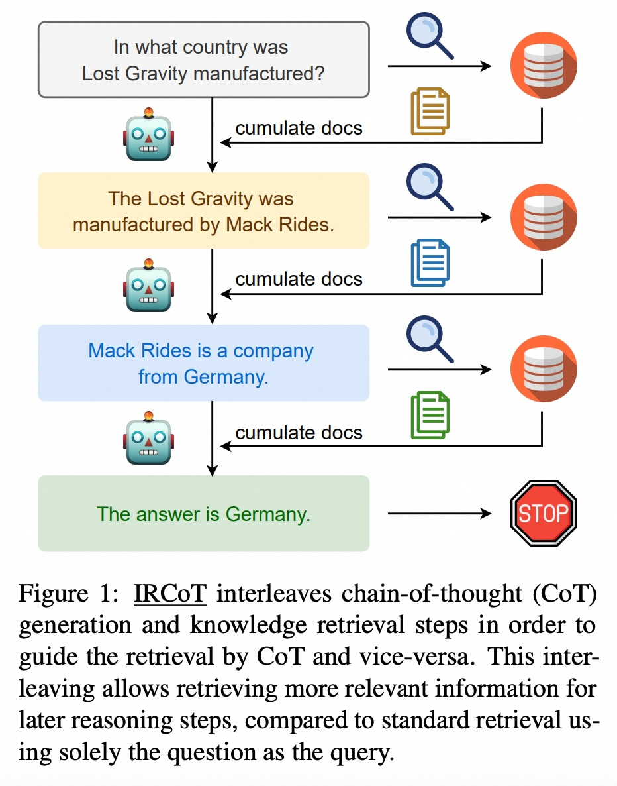
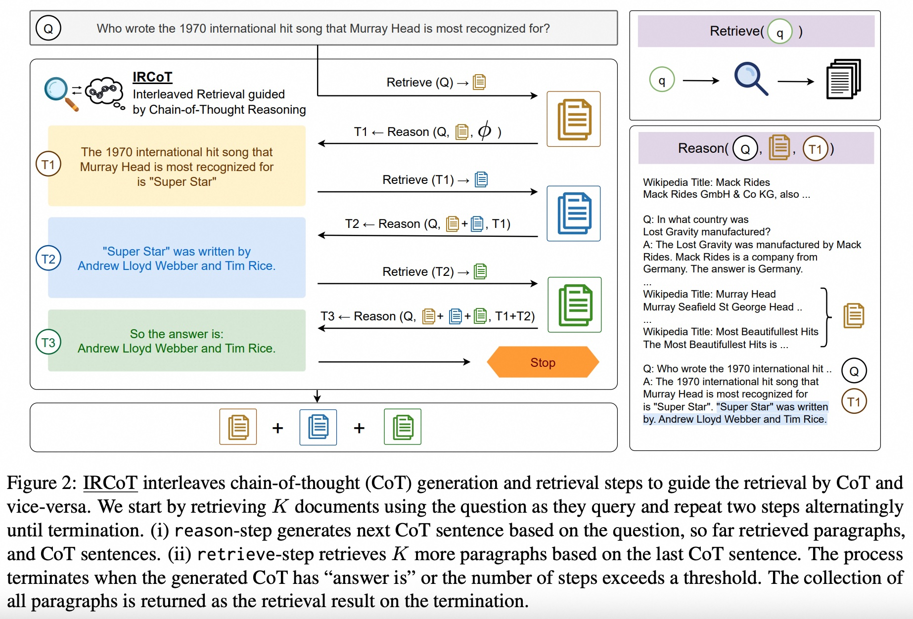
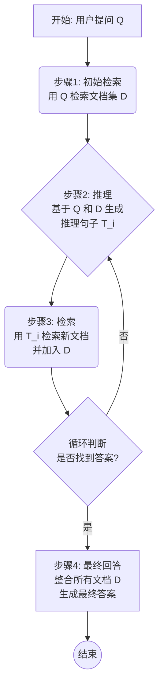
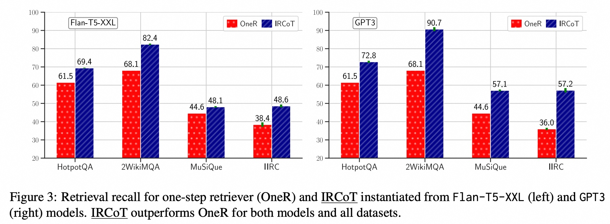
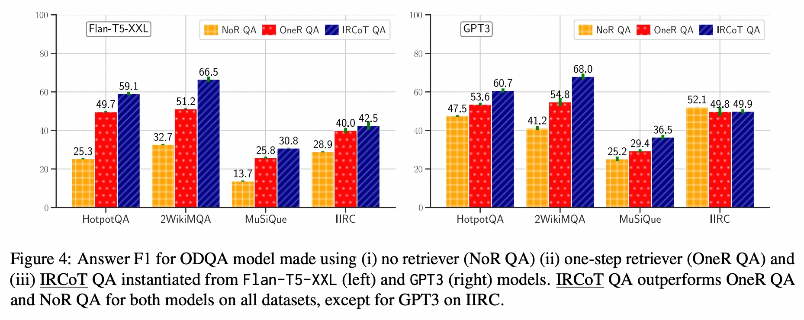
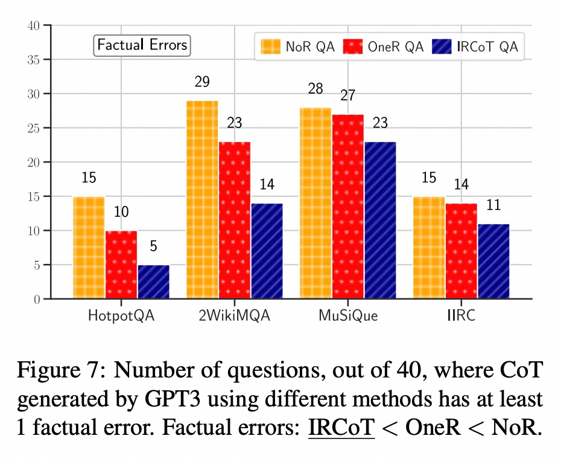
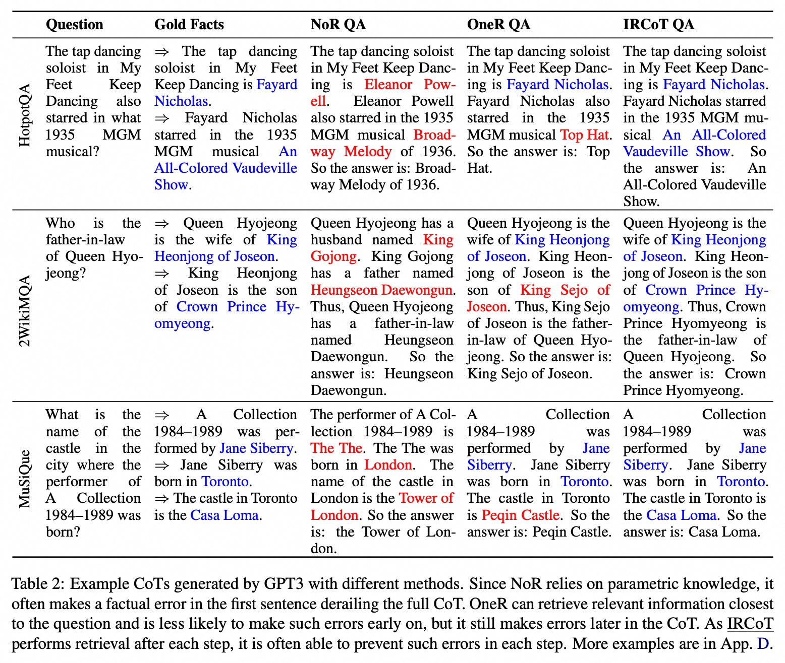
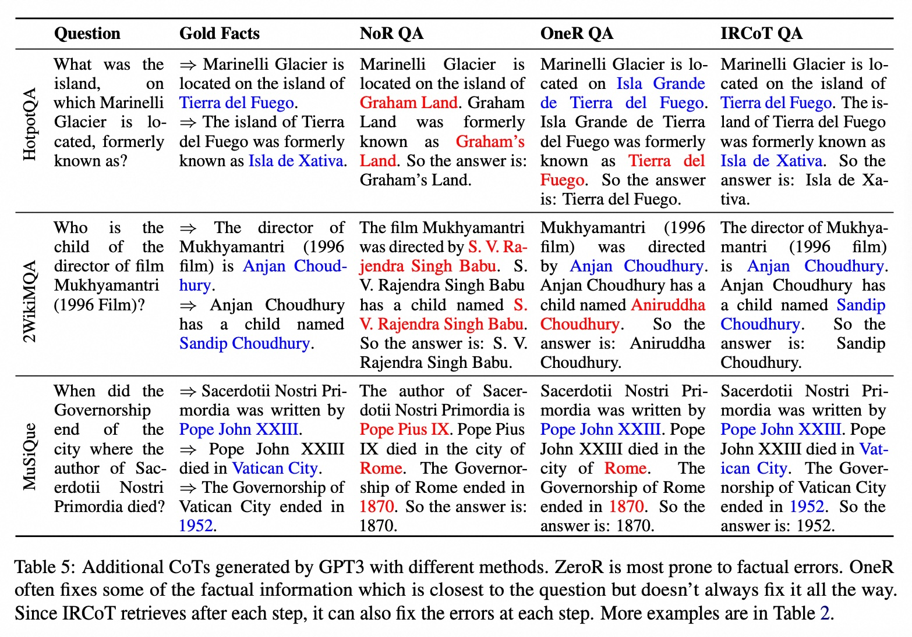

## AI论文解读 | Interleaving Retrieval with Chain-of-Thought Reasoning for Knowledge-Intensive Multi-Step Questions
        
### 作者        
digoal        
        
### 日期        
2025-09-03       
        
### 标签        
PostgreSQL , PolarDB , DuckDB , AI , 论文解读        
        
----        
        
## 背景  
      
https://arxiv.org/pdf/2212.10509        
  
提示:          
```          
读懂《Interleaving Retrieval with Chain-of-Thought Reasoning for Knowledge-Intensive Multi-Step Questions》这篇论文需要提前掌握哪些基础知识, 请使用中文通熟易懂的讲解这些基础知识, 可以引用论文中的图、表或使用Markdown支持的图形(text,mermaid等)增加解释性. 
  
使用中文通熟易懂的解读《Interleaving Retrieval with Chain-of-Thought Reasoning for Knowledge-Intensive Multi-Step Questions》这篇论文, 其中的关键内容请着重讲解, 可以引用论文中的图、表或使用Markdown支持的图形(text,mermaid等)增加解释性. 
  
提取《Interleaving Retrieval with Chain-of-Thought Reasoning for Knowledge-Intensive Multi-Step Questions》这篇论文中的重要术语, 使用中文对这些术语进行通熟易懂的讲解, 可以引用论文中的图、表或使用Markdown支持的图形(text,mermaid等)增加解释性. 
```     
  
## 1 前置知识 
  
您好，根据您提供的论文内容，要读懂《Interleaving Retrieval with Chain-of-Thought Reasoning for Knowledge-Intensive Multi-Step Questions》这篇论文，您需要提前掌握以下几个核心基础知识：

### 1\. 大型语言模型（LLMs）与Prompting

该论文的核心是利用大型语言模型（LLMs）的能力来解决问题 。您需要了解：

  * **什么是LLMs**：例如GPT3、Flan-T5等，它们是经过海量文本训练的强大模型，能够理解和生成人类语言 。
  * **什么是Prompting（提示工程）**：这是一种与LLMs交互的方式。不是对模型进行微调（training），而是通过向模型提供精心设计的输入（即“提示”），来引导它完成特定任务 。

-----

### 2\. 思维链（Chain-of-Thought，CoT）

该论文的另一个关键概念是思维链（CoT） 。

  * **什么是CoT**：它指的是LLMs在回答复杂问题时，生成的一系列自然语言推理步骤 。这就像我们解数学题时写下每一步的计算过程一样，CoT让模型将复杂的、多步骤的问题分解成简单的、可管理的步骤，从而提高回答的准确性 。
  * **CoT的作用**：
      * **解决多步问题**：对于需要多步推理的问题，CoT能够帮助模型逐步推导，而不是直接给出答案 。
      * **减少“幻觉”**：当模型缺乏最新或特定知识时，CoT步骤可能会产生不准确的事实性错误（"hallucination"） 。而这篇论文的IRCoT方法就是为了解决这个问题。

-----

### 3\. 检索增强（Retrieval-Augmentation）

该论文引入了“检索”（Retrieval）的概念，即从外部知识库中获取信息 。

  * **为什么需要检索**：LLMs的参数中包含的知识可能不是最新的，或者不完整 。通过检索，模型可以访问外部的、最新的知识源（如维基百科），来弥补自身知识的不足 。
  * **检索与问答（QA）的关系**：该论文遵循“检索-阅读”（retrieve-and-read）范式，即先用检索器从知识源中检索文档，然后问答模型（reader）再结合检索到的文档和问题来生成最终答案 。
  * **论文中的检索器**：该论文使用的基础检索器是**BM25**，这是一种基于词频-逆文档频率（TF-IDF）的传统检索算法，用于根据查询词来匹配并排序相关文档 。

-----

### 4\. IRCoT方法的核心思想

理解了上述基础，您就可以进入论文的核心——**IRCoT（Interleaving Retrieval with Chain-of-Thought Reasoning）**。顾名思义，它将“检索”和“思维链推理”交织在一起 。

  * **与传统方法的区别**：传统的“一步式检索-阅读”方法（One-step retrieve-and-read）只用原始问题进行一次检索 。然而，对于复杂的多步问题，这往往是不够的，因为后续的推理步骤需要基于前面推理得出的中间事实来检索新的信息 。
  * **IRCoT的工作流程**：如下图所示，IRCoT是一个迭代过程，它交替进行“推理”（Reason）和“检索”（Retrieve）这两个步骤，直到得到答案 。

下图是论文中的示例图（图1），清晰地展示了IRCoT的工作原理：

  

1.  **初始检索**：首先，使用原始问题“在哪个国家制造了失重过山车？”进行检索，得到相关的基础文档 。
2.  **第一次推理（Reason）**：LLM结合问题和已有的文档进行推理，得出一个中间步骤：“失重过山车由Mack Rides制造。” 。
3.  **第二次检索（Retrieve）**：使用刚刚推理出的中间结果（“Mack Rides制造”）作为新的查询，去检索更多文档 。
4.  **第二次推理（Reason）**：LLM再结合所有文档进行推理，得到下一个中间步骤：“Mack Rides是一家德国公司。” 。
5.  **循环直到答案**：继续这个过程，直到CoT中出现“答案是：德国”这样的句子，整个流程终止 。

简而言之，IRCoT的核心在于**用思维链的推理步骤来指导下一步的检索，同时用检索到的事实来确保推理的准确性，两者相互促进** 。这种交替进行的方式，使得模型能够像人一样，边思考边寻找线索，最终解决复杂的多步问答任务。
  
## 2 解读论文 
  
好的，我们来一起深入解读这篇名为《通过链式思维推理与检索的交错执行解决知识密集型多步问题》的论文。我会用通俗易懂的中文，为你剖析其核心思想、方法和重要结论。

### 核心思想一句话总结

这篇论文提出了一种名为 **IRCoT** 的新方法，它模仿了人类解决复杂问题的思考模式——**“边想边搜、迭代求精”**。它不再是一次性把问题扔给搜索引擎，而是将“思考”（生成推理步骤）和“查找”（检索信息）这两个动作交错进行，用上一步的思考结果指导下一步的资料查找，从而更精准、更深入地解决需要多步推理的复杂问题。

### 1\. 问题背景：大语言模型（LLM）在复杂问题上的“知识短板”

我们知道，像GPT-3这样的大语言模型（LLM）很擅长通过一种叫做“链式思维”（Chain-of-Thought, CoT）的方式，一步步生成推理过程来回答问题 。比如你问它一个数学题，它能把解题步骤写出来。

但是，LLM 有一个天生的弱点：它的知识都存储在训练时的参数里，这些知识可能**不够新、不够全，或者不准确** 。对于那些需要外部世界最新知识或非常专业领域知识才能回答的“知识密集型问题”，LLM 就容易“一本正经地胡说八道”，也就是产生所谓的**幻觉**（Hallucination）。

### 2\. 传统方法的局限性：“一问一搜”为什么不够好？

为了解决 LLM 的知识短板，一个常见的办法是“检索增强生成”（Retrieval-Augmented Generation, RAG），也就是先用用户的问题去外部知识库（比如维基百科）里搜一堆相关资料，然后把这些资料和原始问题一起打包发给 LLM，让它基于这些资料来回答。我们称这种方法为 **“一步式检索”（One-step Retrieval）** 。

这种“一问一搜”的方法对简单的事实性问题很有效。但对于需要**多步推理**的复杂问题，它就捉襟见肘了。

**关键痛点在于：** 在解决复杂问题时，我们一开始往往**不知道需要检索哪些中间信息** 。

让我们来看论文中的这个经典例子（图1）：   

> **问题：** "Lost Gravity" 这个过山车是在哪个国家制造的？ 

如果你用 “Lost Gravity 制造国家” 这个查询词去搜索，很可能找不到直接答案 。正确的解决路径是：

1.  **第一步推理/检索：** 首先需要查到 "Lost Gravity" 是由哪家公司制造的。答案是 "Mack Rides" 公司 。
2.  **第二步推理/检索：** 然后，再去查 "Mack Rides" 这家公司是哪个国家的。答案是德国 。
3.  **最终答案：** 德国 。

你看，第二步的检索内容（"Mack Rides"）完全依赖于第一步的推理结果。传统“一问一搜”的方法无法完成这样动态的、依赖中间步骤的检索过程。

### 3\. 核心解决方案：IRCoT - 边想边搜，迭代求精

为了解决上述问题，论文提出了 **IRCoT (Interleaved Retrieval with Chain-of-Thought)** 方法，它的核心就是**交错执行** 。

下面是 IRCoT 的工作流程，我们可以通过论文中的图2来理解：   

*对论文图2的简化和中文解释*

**具体步骤如下：**

1.  **初始检索 (Retrieve(Q))：**

      * 用原始问题 (Q) 作为查询词，从知识库中检索出一批初始的、最相关的文档 。

2.  **进入“推理-检索”循环：**

      * **推理 (Reason) 步骤：** LLM 读取原始问题 (Q) 和**当前已收集到的所有文档**，生成推理链条 (CoT) 的**下一个句子 (T1)** 。例如，生成 "The 1970 international hit song that Murray Head is most recognized for is 'Super Star'" 。
      * **检索 (Retrieve) 步骤：** 将刚刚生成的这个新句子 (T1) 作为**新的查询词**，去知识库里检索更多相关的文档，并把它们加入到已收集的文档集合中 。
      * **循环往复：** 不断重复“推理”和“检索”这两个步骤。上一步生成的推理句子（T2、T3...）会作为下一步检索的依据，而新检索到的信息又会帮助 LLM 更准确地生成再下一步的推理 。

3.  **终止条件：**

      * 当 LLM 生成的推理中包含了明确的答案标识（如 "The answer is: ..."）或者达到了预设的最大推理步数时，循环终止 。

4.  **最终问答：**

      * 将整个循环过程中收集到的所有文档作为最终的上下文，让一个“问答模型”（QA Reader）基于这些最全面的信息来生成最终答案 。

我们可以用一个 Mermaid 图来更清晰地展示这个迭代循环的过程：



### 4\. 实验与结果：IRCoT 效果如何？

论文通过在四个主流的多步问答数据集（HotpotQA, 2WikiMultihopQA, MuSiQue, IIRC）上的实验，证明了 IRCoT 的强大效果。

#### 关键结论：

1.  **检索更准（更高的召回率）：**

      * 相比传统“一步式”检索（OneR），IRCoT 能找到更多解决问题所必需的“黄金文档”。从图3可以看出，无论是在 Flan-T5-XXL 模型还是 GPT-3 模型上，蓝色条（IRCoT）都显著高于红色条（OneR） 。在 GPT-3 上，提升最高可达 **22.6个点** 。   

      * 
        *论文图3（右）的中文标注版，展示了在GPT3模型上，IRCoT（蓝色）相比OneR（红色）在四个数据集上的检索召回率优势。*

2.  **回答更对（更高的F1分数）：**

      * 更准的检索带来了更准确的最终答案。图4显示，IRCoT QA（蓝色条）的性能全面优于 OneR QA（红色条）和不使用任何检索的 NoR QA（黄色条） 。在 GPT-3 上，F1 分数的提升最高达到了 **13.2个点** 。   

3.  **幻觉更少（事实性错误显著降低）：**

      * 这是 IRCoT 一个非常重要的优点。因为它每一步推理都有检索到的新信息作为依据，所以大大减少了模型凭空捏造信息的可能性。

      * 图7的统计显示，在40个问题样本中，NoR QA（无检索）出现了大量事实错误，OneR QA（一步检索）有所改善，而 **IRCoT QA 的事实错误数量最少** 。例如，在 HotpotQA 数据集上，IRCoT 将事实错误率降低了 **50%** 。   

      * 
        *论文图7的中文标注版，展示了不同方法生成推理链中的事实错误数量，IRCoT（深蓝色）表现最好。*

      * 论文的表2和表5给出了生动的例子。例如，在回答“Queen Hyojeong 的公公是谁？”这个问题时 ：     

          * **NoR QA (无检索):** 完全搞错，虚构了人物关系。
          * **OneR QA (一步检索):** 找到了正确的第一步关系（丈夫是King Heonjong），但在第二步（找丈夫的父亲）时出错。
          * **IRCoT QA (边想边搜):** 完美地完成了两步推理，找到了正确的答案（Crown Prince Hyomyeong）。

4.  **对小模型同样有效：**

      * 一个惊人的发现是，IRCoT 的价值不仅体现在大模型上。实验证明，IRCoT 即使与较小的模型（如 Flan-T5 3B）结合，其问答效果**甚至能超过使用传统一步检索方法的、规模大58倍的 GPT-3 (175B) 模型** 。这说明一个更聪明的“检索策略”比单纯增大模型尺寸更具效费比。

### 5\. 论文的主要贡献

  * **提出 IRCoT 框架：** 首次将链式思维（CoT）生成和外部知识检索进行**深度交错和迭代**，有效解决了知识密集型多步问答的难题 。
  * **显著提升性能：** 在多个数据集上，无论是在检索准确率还是最终问答性能上，都取得了大幅提升 。
  * **减少模型幻觉：** 通过步步为营的信息检索，生成的推理过程事实性更强，错误更少 。
  * **普适性强：** 该方法无需额外训练，并且对从大到小各种规模的语言模型都有效，展示了其良好的通用性 。

### 6\. 局限性

论文同样也指出了该方法的一些局限性：

  * **依赖模型的CoT能力：** IRCoT 的效果有赖于基础语言模型本身具备一定的零样本或少样本链式思维能力 。
  * **需要长上下文支持：** 由于需要将多轮检索到的文档都放入模型的上下文中，这对模型的输入长度有一定要求 。
  * **计算成本更高：** 相较于一次性检索，IRCoT 需要多次调用语言模型进行推理，计算开销更大 。

### 总结

总而言之，这篇论文提出了一个非常直观且强大的思想：让大语言模型像人一样，在遇到复杂问题时，能够“边思考、边查证”，通过一个动态的、迭代的“思考-检索”循环，逐步逼近最终答案。IRCoT 不仅显著提升了模型解决复杂问题的能力和回答的准确性，还为如何更有效地结合 LLM 的推理能力与外部知识库的广度提供了全新的、富有启发性的思路。
  
## 3 术语 
  
要读懂这篇论文，需要掌握以下几个重要的术语：

---

### **1. Chain-of-Thought (CoT) Reasoning**

* **中文解释**：**思维链推理**。这是指大型语言模型（LLMs）在回答问题时，通过生成一系列连贯的、自然语言的推理步骤来逐步得出结论。这就像人类在解决一个复杂问题时，会写下详细的解题步骤，而不是直接给出答案。
* **论文中的作用**：CoT方法能让LLMs将复杂的多步问答（multi-step QA）问题分解成更简单的步骤，从而提高回答的准确性。然而，论文指出，当模型自身知识不足或过时时，CoT推理步骤可能会产生不准确的“幻觉”（hallucination）内容。

---

### **2. Knowledge-Intensive Multi-Step Questions**

* **中文解释**：**知识密集型多步问题**。这类问题无法通过单一的事实或简单的推理来回答，它要求模型综合多个知识点，并通过多步推理才能得出最终答案。
* **论文中的例子**：论文中提到的例子很典型：“在哪个国家制造了失重过山车？”。要回答这个问题，模型需要先知道“谁制造了失重过山车”（第一步），然后才知道“这个制造商是哪个国家的”（第二步），最后才能得出答案。

---

### **3. Interleaving Retrieval**

* **中文解释**：**交织式检索**。这是该论文提出的核心创新点。它是一种动态的检索方法，不再是像传统方法那样只在问题开始时进行一次检索，而是在推理过程中，根据每一步新生成的中间推理步骤，交替地进行多次检索。
* **论文中的原理**：如下图所示，IRCoT（Interleaving Retrieval with Chain-of-Thought）方法就是将**推理（Reason）**和**检索（Retrieve）**这两个过程交织起来。每次模型生成一个中间推理步骤后，就会用这个新生成的步骤作为查询去外部知识源（如维基百科）进行新的检索，以获取更相关的最新信息。   

---

### **4. One-step Retrieve-and-read**

* **中文解释**：**一步式检索-阅读**。这是一种传统的问答范式。它只在最开始用原始问题进行一次检索，获取到相关文档后，模型就必须仅基于这些文档来回答问题。
* **论文中的不足**：论文指出，对于多步问题，这种方法往往是**不足的**。因为最初的检索可能无法获取到回答所有中间步骤所需的知识。例如，如果最初只用“失重过山车”这个词进行检索，可能无法找到“Mack Rides”是德国公司这个关键信息。IRCoT就是为了解决这个局限而提出的。

---

### **5. CoT Guided Retrieval**

* **中文解释**：**由CoT引导的检索**。这是IRCoT方法中的一个关键机制。它指的是将大型语言模型在CoT推理过程中生成的**中间步骤**（如“失重过山车由Mack Rides制造”）作为新的查询，去指导和执行下一次的检索。
* **作用**：这种方式使得检索更加精准和有针对性，因为它不再依赖于模糊的原始问题，而是依赖于模型已经推理出的具体事实。通过这种方式，检索器能够获取到完成下一步推理所必需的、更精确的知识。

---

### **6. Retrieval Augmented Generation (RAG)**

* **中文解释**：**检索增强生成**。这是一个广义的概念，指的是将外部知识检索与大型语言模型的生成能力相结合，以提高模型回答的准确性和时效性。
* **与论文的关系**：IRCoT可以被看作是RAG范式的一种更高级、更动态的应用。它不再是静态的一次性检索，而是将检索能力深度融入到模型的思维链推理过程中，实现了两者之间的动态交互。
  
## 参考        
         
https://arxiv.org/pdf/2212.10509    
        
<b> 以上内容基于DeepSeek、Qwen、Gemini及诸多AI生成, 轻微人工调整, 感谢杭州深度求索人工智能、阿里云、Google等公司. </b>        
        
<b> AI 生成的内容请自行辨别正确性, 当然也多了些许踩坑的乐趣, 毕竟冒险是每个男人的天性.  </b>        
    
#### [期望 PostgreSQL|开源PolarDB 增加什么功能?](https://github.com/digoal/blog/issues/76 "269ac3d1c492e938c0191101c7238216")
  
  
#### [PolarDB 开源数据库](https://openpolardb.com/home "57258f76c37864c6e6d23383d05714ea")
  
  
#### [PolarDB 学习图谱](https://www.aliyun.com/database/openpolardb/activity "8642f60e04ed0c814bf9cb9677976bd4")
  
  
#### [PostgreSQL 解决方案集合](../201706/20170601_02.md "40cff096e9ed7122c512b35d8561d9c8")
  
  
#### [德哥 / digoal's Github - 公益是一辈子的事.](https://github.com/digoal/blog/blob/master/README.md "22709685feb7cab07d30f30387f0a9ae")
  
  
#### [About 德哥](https://github.com/digoal/blog/blob/master/me/readme.md "a37735981e7704886ffd590565582dd0")
  
  

  
