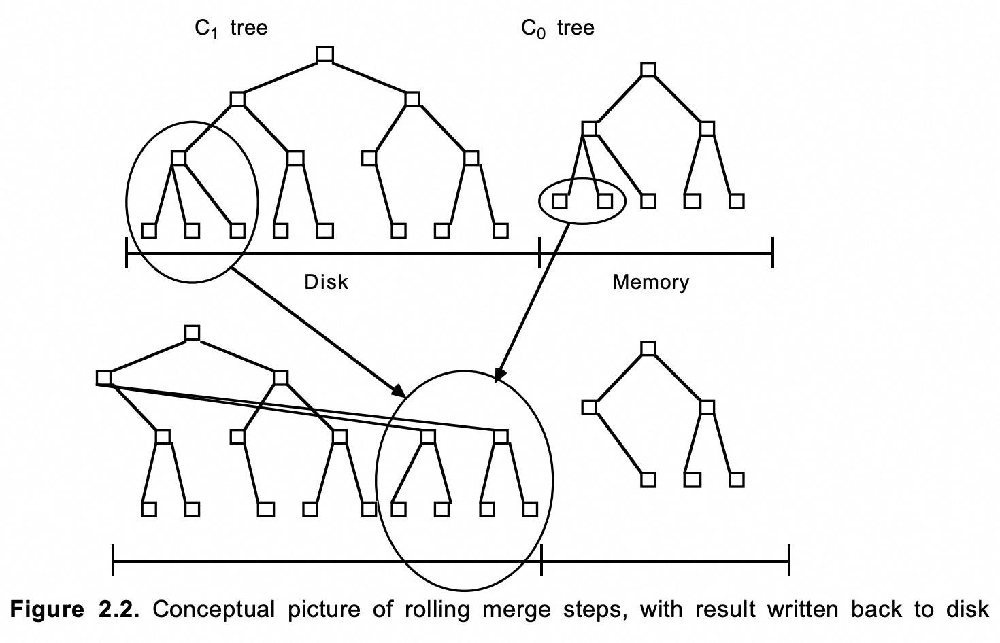
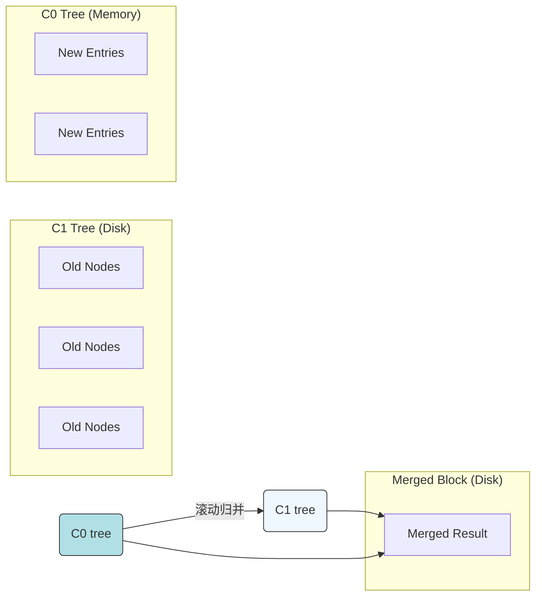
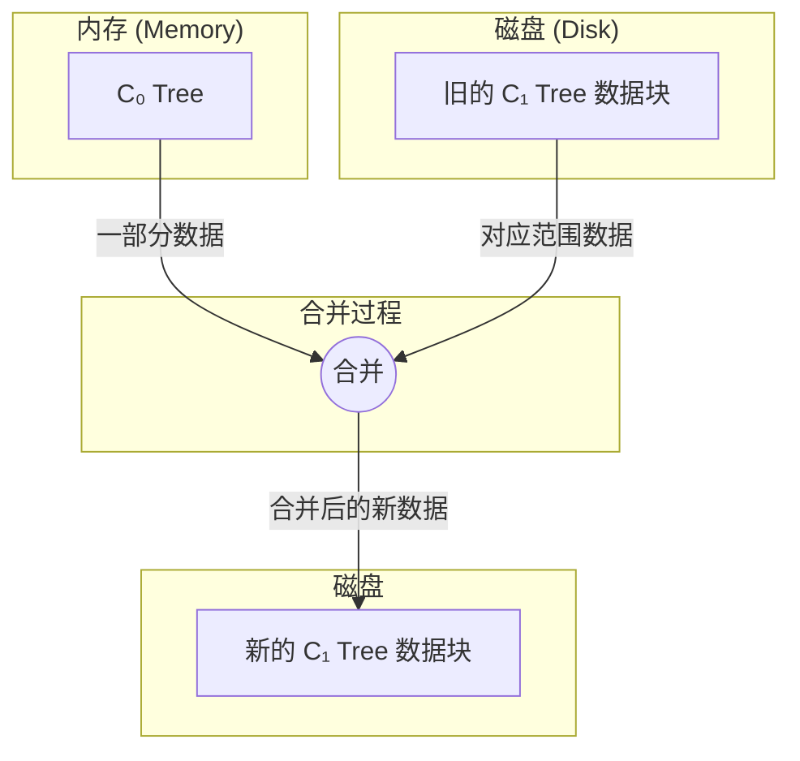
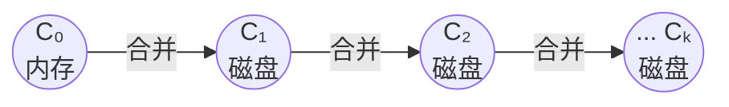
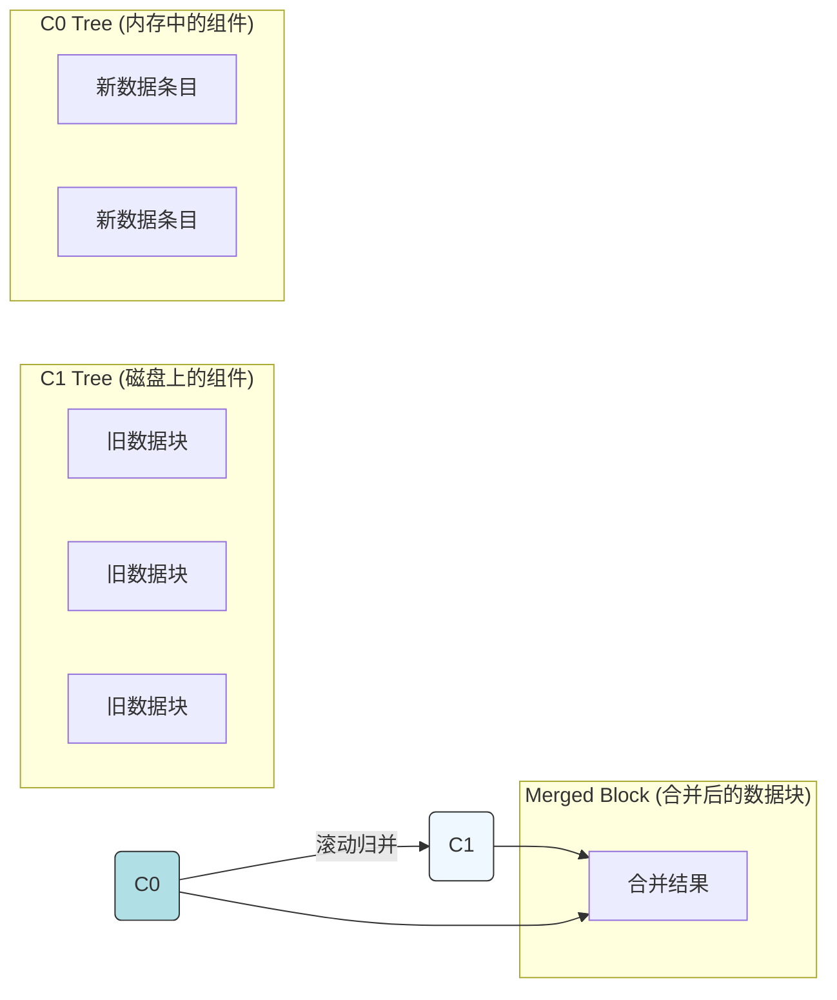

## AI论文解读 | The Log-Structured Merge-Tree (LSM-Tree)
        
### 作者        
digoal        
        
### 日期        
2025-09-03       
        
### 标签        
PostgreSQL , PolarDB , DuckDB , AI , 论文解读        
        
----        
        
## 背景  
      
https://www.cs.umb.edu/%7Eponeil/lsmtree.pdf        
  
提示:          
```          
读懂《The Log-Structured Merge-Tree (LSM-Tree)》这篇论文需要提前掌握哪些基础知识, 请使用中文通熟易懂的讲解这些基础知识, 可以引用论文中的图、表或使用Markdown支持的图形(text,mermaid等)增加解释性. 
  
使用中文通熟易懂的解读《The Log-Structured Merge-Tree (LSM-Tree)》这篇论文, 其中的关键内容请着重讲解, 可以引用论文中的图、表或使用Markdown支持的图形(text,mermaid等)增加解释性. 
  
提取《The Log-Structured Merge-Tree (LSM-Tree)》这篇论文中的重要术语, 使用中文对这些术语进行通熟易懂的讲解, 可以引用论文中的图、表或使用Markdown支持的图形(text,mermaid等)增加解释性. 
```     
  
## 1 前置知识 
  
读懂《The Log-Structured Merge-Tree (LSM-Tree)》这篇论文，您需要提前掌握以下几个方面的基础知识，这些知识是理解LSM-Tree设计理念和工作原理的关键：

### 1\. 数据库和数据结构基础

这篇论文讨论的是一种用于高性能事务系统的索引结构 ，因此，您需要了解以下核心概念：

  * **索引（Index）：** 索引的作用是提高数据查询效率，类似于书的目录。论文中反复提及为“History”表（历史表）建立索引 。
  * **B-树（B-Tree）：** B-树是一种平衡树，是传统数据库中最常见的磁盘索引结构 。论文将LSM-Tree与B-树进行对比，并指出B-树在面对高并发插入时，I/O开销会增加一倍 。理解B-树的工作方式（如节点如何分裂、数据如何插入）是理解LSM-Tree优越性的前提。
  * **其他内存树结构：** 论文提到，LSM-Tree的内存组件（`C₀`树）可以采用诸如 (2,3)-树 或 AVL-树等结构 ，这些都是内存中的平衡二叉树，用于高效地进行插入和查找。

### 2\. 计算机体系结构与存储介质

论文的核心思想在于优化**磁盘I/O（输入/输出）**，因此理解内存与磁盘的性能差异至关重要：

  * **磁盘I/O成本：** 磁盘的读写速度远低于内存。特别是随机I/O（随机读写）需要磁头频繁移动，会产生大量的寻道时间（seek time）和旋转延迟（rotational latency），从而成为系统性能瓶颈 。
  * **“五分钟规则”（The Five Minute Rule）：** 论文引用了这一规则 。该规则旨在衡量在何种情况下，通过购买内存来缓存磁盘页面以避免I/O是更经济的选择 。简单来说，就是如果一个磁盘页面被访问的频率足够高（超过每60秒一次），那么将它保留在内存中是划算的。LSM-Tree的设计正是为了在高插入场景下，避免因为B-树的随机I/O而产生的巨大磁盘成本 。

### 3\. 排序算法：归并排序 (Merge Sort)

LSM-Tree的名字和其核心工作方式都与**归并排序**紧密相关 。

  * **归并排序原理：** 归并排序通过将两个或多个有序列表合并成一个新的有序列表来实现排序。LSM-Tree正是借鉴了这一思想，通过“滚动归并”（rolling merge）过程，将内存中的数据批量地、有序地归并到磁盘中的数据结构中 。

论文中的图2.2清晰地展示了这一过程：   



  * **滚动归并（Rolling Merge）：** 这是一种持续的、后台进行的归并操作。当内存中的 `C₀` 组件达到设定的阈值时 ，系统会启动归并过程，将 `C₀` 中有序的条目段与磁盘中 `C₁` 组件对应位置的条目段进行合并，并将合并后的结果写入磁盘的新位置 。这一过程是LSM-Tree高效率的关键，因为它将随机写入转化为**顺序写入**，从而大幅减少了磁盘I/O的开销。

### 4\. 日志结构化文件系统 (Log-Structured File System, LFS)

LSM-Tree的名称来源于日志结构化文件系统（LFS）。

  * **LFS原理：** LFS将磁盘视为一个连续的日志，所有写入操作都追加到日志末尾，从而避免了随机写入。LSM-Tree也采用了类似的设计思想，在归并过程中，新的合并数据块总是被写入磁盘的新位置，而不是覆盖旧数据 。这种设计使得 LSM-Tree 擅长处理**写多读少**的场景 。
  
## 2 解读论文 
  
好的，我们来一起通俗易懂地解读这篇经典的数据库论文——《The Log-Structured Merge-Tree (LSM-Tree)》。

这篇论文介绍了一种名为“日志结构合并树”（LSM-Tree）的数据结构，旨在为那些写入（插入、删除）操作极其频繁的文件提供低成本、高效率的索引 。如今，LSM-Tree 已经成为许多知名NoSQL数据库（如 Google Bigtable, Cassandra, RocksDB, LevelDB）的核心存储引擎。

### 核心问题：为什么需要LSM-Tree？

想象一个系统，比如银行的交易系统或网站的用户行为记录系统。这类系统会以极高的速度产生大量的历史记录或日志数据 。为了能快速查询某个账户的历史交易或某个用户的历史行为，我们需要对这些快速增长的数据表建立索引 。

传统的关系型数据库通常使用 **B-Tree**（或其变种 B+Tree）作为索引结构。B-Tree 在读写均衡的场景下表现优异，但在写入操作远多于读取操作的场景下，会遇到严重的性能瓶ALE 。

**B-Tree 的写入痛点：**

1.  **随机I/O：** 每当有新数据插入时，B-Tree 为了维持其有序和平衡的结构，需要找到磁盘上对应的“叶子节点”页。由于新插入数据的索引键（如账户ID）通常是随机的，这会导致磁盘臂在盘片上进行大量的随机寻道（Seek）和旋转等待（Rotational Latency） 。
2.  **高昂的I/O成本：** 一次简单的索引插入，通常至少需要一次读（将目标页加载到内存）和一次写（将修改后的页写回磁盘），这相当于两次磁盘I/O 。
3.  **成本翻倍：** 论文以TPC-A基准测试为例，指出为一个高写入量的历史表（History table）维护一个B-Tree索引，所需的I/O开销几乎与更新主账户表的开销相当，这使得整个系统的磁盘成本几乎翻了一番 。

**核心矛盾：** 磁盘的顺序读写速度远快于随机读写。B-Tree 的写入模式是随机的，而LSM-Tree的设计思想就是**将随机写操作转化为顺序写操作**，从而大幅降低写入成本。

-----

### 关键内容精讲

#### 1\. LSM-Tree的核心架构：内存与磁盘的协作

LSM-Tree 不是单一的树，而是一个由多个组件构成的层次化结构 。最基础的版本包含两个组件，如下图所示：

```text
+-------------------------------------------------------------+
|                                                             |
|   +-----------+          +-------------------------------+  |
|   |           |          |                               |  |
|   |  C₀ tree  |          |            C₁ tree            |  |
|   | (内存中)  |          |            (磁盘上)             |  |
|   |           |          |                               |  |
|   +-----------+          +-------------------------------+  |
|                                                             |
|      MEMORY                            DISK                 |
+-------------------------------------------------------------+
```

  * **C₀ tree (C-zero 组件):** 这是一个完全驻留在**内存**中的小组件 。它可以是任何高效的内存数据结构，如AVL树或2-3树 。所有新的索引条目首先被插入到 C₀ 中 。因为操作完全在内存中进行，所以写入速度极快，没有任何磁盘I/O开销 。

  * **C₁ tree (C-one 组件):** 这是一个驻留在**磁盘**上的大组件，其结构类似于B-Tree 。它包含了绝大部分历史索引数据。

#### 2\. 核心机制：滚动合并 (Rolling Merge)

当内存中的 C₀ 组件大小增长到一定阈值时，系统需要将数据“刷”到磁盘上的 C₁ 组件中，以释放内存空间。LSM-Tree 采用了一种非常高效的方式来完成这个过程，称为**滚动合并** 。

这个过程可以理解为一个后台的、持续进行的归并排序操作：

1.  **触发合并：** 当 C₀ 大小达到上限时，合并进程启动 。
2.  **批量迁移：** 系统会从 C₀ 中取出一部分**连续的**、有序的索引条目。
3.  **归并写入：** 将这批来自 C₀ 的条目与 C₁ 中对应范围的条目进行合并（Merge），然后将合并后的结果**顺序地**写入到磁盘上新的位置 。

论文中的 `Figure 2.2` 形象地展示了这个过程：   



**滚动合并的巨大优势：**

  * **顺序I/O：** 合并后的新数据块是整块地、顺序地写入磁盘的（使用多页块I/O），这极大地利用了磁盘的高带宽，避免了随机写的开销 。
  * **延迟和批量化：** 索引的变更被延迟和批量处理。C₀ 在内存中累积了大量更新，使得每一次磁盘I/O操作都能处理多个索引条目，摊薄了单次插入的成本 。

#### 3\. 性能分析：LSM-Tree为什么快？

论文在第3章详细分析了LSM-Tree的成本优势。其相对于B-Tree的性能提升主要来自两个“批量效应” ：

1.  **多页块I/O的效率 ( $COST\_{\\pi}/COST\_{P}$ ):**

      * $COST\_{P}$ 代表一次随机页面I/O的成本（高）。
      * $COST\_{\\pi}$ 代表在一次大的多页块顺序读写中，单个页面的平均I/O成本（低） 。
      * 论文引用数据指出，这个比值大约是 **1/10** 。这意味着顺序写的效率是随机写的10倍。

2.  **合并的批量效应 (1/M):**

      * `M` 指的是在滚动合并期间，平均每个 C₁ 的磁盘页会融入多少个来自 C₀ 的新条目 。
      * 例如，如果 C₀ 的大小是 C₁ 的1/40，且每个C₁页能容纳200个条目，那么 M 大约等于 `(200 * 1/40) = 5`。这意味着，C₁ 的一个页在一次“读-合并-写”的周期中，一次性处理了5个新的插入操作 。
      * 而在B-Tree中，通常一次插入就要对一个页进行一次读写，相当于 M=1。

综合这两个因素，LSM-Tree单次插入的成本 `COST_LSM-ins` 与 B-Tree 的 `COST_B-ins` 的比率为：
$$COST_{LSM-ins} / COST_{B-ins} \approx K \cdot (COST_{\pi}/COST_{P}) \cdot (1/M)$$
这个公式清晰地表明，通过将随机写变成高效的顺序写，并利用内存进行批量处理，LSM-Tree 能够将写入成本降低一到两个数量级 。

#### 4\. 扩展架构：多组件LSM-Tree (Multi-Component LSM-Tree)

对于一个非常大的索引，如果只有两层（C₀ 和 C₁），为了维持一个合理的合并批量效应 `M`，内存中的 C₀ 组件需要非常大，这会导致内存成本过高 。

解决方案是引入更多的中间层，形成一个多组件的LSM-Tree，其结构如下：



  * 数据像瀑布一样，从最小的内存组件 C₀ 逐级向下合并到越来越大的磁盘组件 C₁, C₂, ..., Cₖ 。
  * 每一级合并都利用了批量效应，从而可以用一个很小的 C₀ 组件来支撑一个巨大无比的总索引 。
  * 论文通过数学推导证明，为了最小化总I/O成本，各相邻组件的大小比例 `Si / Si-1` 应该是一个近似的常数 `r`，即组件大小成几何级数增长 。

#### 5\. 其他操作与权衡 (Trade-offs)

  * **读取 (Finds):** 这是LSM-Tree的主要短板。一次精确查找请求，必须**从 C₀ 开始，依次查询 C₁, C₂, 直到 Cₖ**，因为要找的数据可能存在于任何一个组件中 。如果组件层数很多，读取操作可能需要多次磁盘I/O，性能劣于B-Tree 。因此，LSM-Tree 最适合**写多读少**的场景。

  * **删除 (Deletes):** 删除操作同样可以被延迟和批量处理。系统不会立即去磁盘上找到并删除条目，而是在 C₀ 中插入一个特殊的“删除标记” 。这个标记会随着滚动合并过程向下层迁移，当它在合并过程中遇到真正的条目时，两者便会“相互抵消”，从而完成删除 。

### 结论与启示

LSM-Tree 的核心贡献在于，它通过**延迟（defer）和批量化（batch）处理，巧妙地将大量消耗性能的随机写**转换为了高效的**顺序写**。

它将一个逻辑上访问“热”的（高频写入）索引，在物理层面转换为了一个访问“温”的甚至“冷”的（低频物理I/O）数据结构，从而在写入密集型应用中获得了巨大的成本和性能优势 。这篇论文的思想深刻地影响了后续几十年高性能存储系统的设计，至今仍是许多现代数据库的基石。
  
## 3 术语 
  
以下是《The Log-Structured Merge-Tree (LSM-Tree)》这篇论文中的几个重要术语，它们的理解是掌握LSM-Tree核心思想的关键。

-----

### **1. LSM-Tree（日志结构合并树）**

**LSM-Tree** 是一种为应对高并发写入（插入、更新、删除）而设计的磁盘数据结构。与传统数据库常用的B-树不同，LSM-Tree的核心思想是**将随机写入转化为顺序写入**，从而大幅减少磁盘I/O开销，特别适合那些数据量持续快速增长的场景，如日志记录或历史表（History table）。

### **2. 滚动归并（Rolling Merge）**

这是LSM-Tree的**核心工作机制**。该算法将数据修改操作（插入、删除等）分批次地、从内存到磁盘，再从磁盘到磁盘，进行**级联式（cascading）合并**。

这个过程可以理解为：

1.  所有新写入的数据首先被批量缓存在内存中的一个有序组件中，这部分就是 **C₀ 组件**。
2.  当 **C₀ 组件** 的数据量达到一定阈值时，一个后台进程启动，将 **C₀** 中的数据与磁盘上的 **C₁ 组件** 中的数据进行合并。
3.  这个合并过程（归并排序）是高效的，因为它将两个有序的数据集合合并为一个新的有序集合，并将结果写入磁盘的新位置，而不是在原地修改。
4.  同样地，当 **C₁** 的数据量也达到阈值时，它会与 **C₂** 组件进行合并，以此类推，形成一个数据的“滚动”归并流。

论文中图2.2展示了这一过程：   



这一过程使得LSM-Tree始终保持“日志结构化”的特性，即写入操作主要都是**追加（append-only）**，极大地优化了写入性能。

### **3. B-树（B-Tree）**

**B-树** 是传统数据库中应用最广泛的磁盘索引结构。它是一种平衡树，能够保证数据查询的效率。然而，论文指出，在高并发插入场景下，B-树为了保持平衡，可能会导致频繁的节点分裂和合并，从而产生大量的**随机磁盘I/O**。这种随机I/O的成本是巨大的，会成为系统性能的瓶颈。LSM-Tree正是为了解决B-树在高写入场景下的这一痛点而设计的。

### **4. 组件（C₀, C₁, C₂...）**

LSM-Tree不是一个单一的数据结构，而是由一系列**有序的树形组件**构成的。

  * **C₀ 组件：** 这是唯一的**内存**组件，用于接收所有新的写入操作。
  * **C₁ 组件：** 这是第一个**磁盘**组件，当 **C₀** 满了之后，数据会归并到这里。
  * **C₂ 组件及更高层级：** 随着数据量的增加，更旧、更大的数据块会存在于更高层级的磁盘组件中。

所有这些组件都是有序的，这使得归并操作能够高效地进行。当要查找一条数据时，系统会从 **C₀** 开始，依次查找 **C₁**、**C₂**...，直到找到为止。

如果您想深入了解 LSM-Tree 在实际应用中的性能表现，比如它如何解决读写平衡问题，我可以为您进一步讲解。
  
## 参考        
         
https://www.cs.umb.edu/%7Eponeil/lsmtree.pdf    
        
<b> 以上内容基于DeepSeek、Qwen、Gemini及诸多AI生成, 轻微人工调整, 感谢杭州深度求索人工智能、阿里云、Google等公司. </b>        
        
<b> AI 生成的内容请自行辨别正确性, 当然也多了些许踩坑的乐趣, 毕竟冒险是每个男人的天性.  </b>        
    
#### [期望 PostgreSQL|开源PolarDB 增加什么功能?](https://github.com/digoal/blog/issues/76 "269ac3d1c492e938c0191101c7238216")
  
  
#### [PolarDB 开源数据库](https://openpolardb.com/home "57258f76c37864c6e6d23383d05714ea")
  
  
#### [PolarDB 学习图谱](https://www.aliyun.com/database/openpolardb/activity "8642f60e04ed0c814bf9cb9677976bd4")
  
  
#### [PostgreSQL 解决方案集合](../201706/20170601_02.md "40cff096e9ed7122c512b35d8561d9c8")
  
  
#### [德哥 / digoal's Github - 公益是一辈子的事.](https://github.com/digoal/blog/blob/master/README.md "22709685feb7cab07d30f30387f0a9ae")
  
  
#### [About 德哥](https://github.com/digoal/blog/blob/master/me/readme.md "a37735981e7704886ffd590565582dd0")
  
  

  
