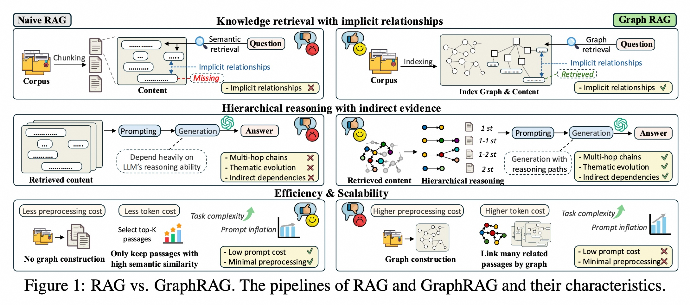
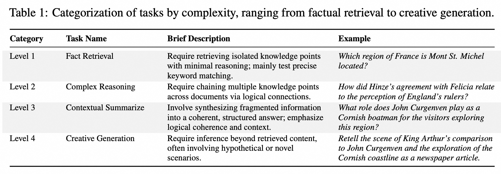
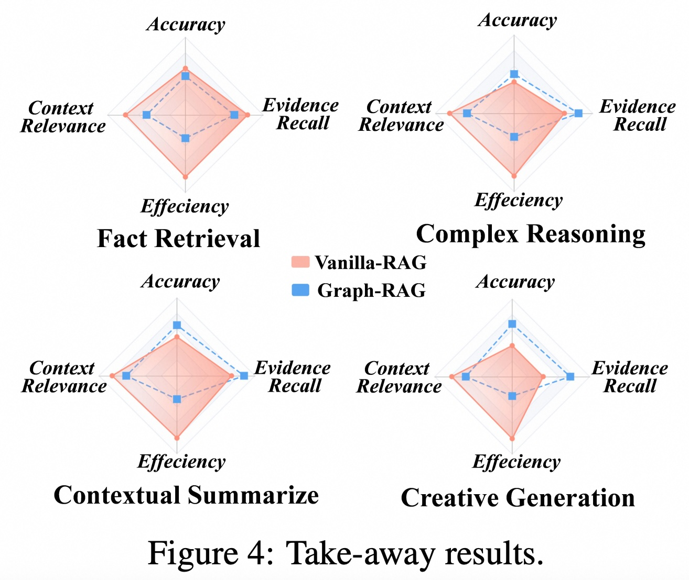

## AI论文解读 | When to use Graphs in RAG: A Comprehensive Analysis for Graph Retrieval-Augmented Generation
        
### 作者        
digoal        
        
### 日期        
2025-09-04       
        
### 标签        
PostgreSQL , PolarDB , DuckDB , AI , 论文解读        
        
----        
        
## 背景  
      
https://arxiv.org/pdf/2506.05690        
  
提示:          
```          
读懂《When to use Graphs in RAG: A Comprehensive Analysis for Graph Retrieval-Augmented Generation》这篇论文需要提前掌握哪些基础知识, 请使用中文通熟易懂的讲解这些基础知识, 可以引用论文中的图、表或使用Markdown支持的图形(text,mermaid等)增加解释性. 
  
使用中文通熟易懂的解读《When to use Graphs in RAG: A Comprehensive Analysis for Graph Retrieval-Augmented Generation》这篇论文, 其中的关键内容请着重讲解, 可以引用论文中的图、表或使用Markdown支持的图形(text,mermaid等)增加解释性. 
  
提取《When to use Graphs in RAG: A Comprehensive Analysis for Graph Retrieval-Augmented Generation》这篇论文中的重要术语, 使用中文对这些术语进行通熟易懂的讲解, 可以引用论文中的图、表或使用Markdown支持的图形(text,mermaid等)增加解释性. 
```     
  
## 1 前置知识 
  
要读懂《When to use Graphs in RAG: A Comprehensive Analysis for Graph Retrieval-Augmented Generation》这篇论文，您需要提前掌握以下几个核心基础知识。这篇论文的核心在于比较和分析 **RAG** 和 **GraphRAG** 两种技术，并提出了一种新的评估基准。

-----

### 1\. 大型语言模型 (LLMs)

首先，您需要了解**大型语言模型（Large Language Models，LLMs）是什么，比如 GPT 和 Claude 系列模型 。LLMs 在语言理解和内容生成方面表现出色 ，但它们有局限性，特别是在处理知识密集型任务时，可能出现“幻觉”**（hallucination），即生成听起来合理但事实错误的信息 。

### 2\. 检索增强生成 (RAG)

**检索增强生成（Retrieval-Augmented Generation，RAG）** 是为了解决 LLMs 幻觉问题而提出的一种方法 。它的基本思路是：

1.  **检索（Retrieval）**：在生成答案之前，先从外部知识库（比如一堆文档）中检索出与用户问题相关的**上下文（context）**。
2.  **增强生成（Augmented Generation）**：然后将检索到的上下文和用户问题一起输入给 LLM，让它基于这些外部知识来生成答案 。

但是，传统的 RAG 系统也面临挑战 。当知识库规模庞大且非结构化时，RAG 往往将文档分割成小块（chunking）进行索引 。这样做会破坏重要的上下文信息和概念间的层次关系 。

### 3\. 图检索增强生成 (GraphRAG)

**图检索增强生成（GraphRAG）** 正是为了解决传统 RAG 的上述局限性而出现的 。它的核心思想是利用 **图（Graph）** 结构来组织外部知识。

  * **图的组成**：图由 **节点（nodes）** 和 **边（edges）** 组成 。在 GraphRAG 中：

      * **节点**：代表实体、事件或主题，例如“公司”、“产品”等 。
      * **边**：定义了节点之间的逻辑、因果或关联关系，比如“创始人”关系、“生产”关系 。

  * **GraphRAG vs. RAG**：GraphRAG 的优势在于它超越了简单的语义相似性检索 。如下图所示，它能够通过 **图遍历（traversal）** 来捕捉相互关联的子图，从而发现潜在的模式，例如主题演变、间接依赖或多步骤推理链 。这使得它特别擅长处理需要深度上下文分析和复杂逻辑推理的任务 。

-----

#### RAG 与 GraphRAG 的对比流程图

  * **知识检索**：传统 RAG 通过语义检索（Semantic retrieval）来匹配文档块（chunks），但会忽略隐式关系 。而 GraphRAG 通过图检索（Graph retrieval），能够捕捉和利用这些隐式关系 。
  * **层次推理**：传统 RAG 的生成过程严重依赖 LLM 自身的推理能力 。而 GraphRAG 能够通过图结构提供推理路径（reasoning paths），从而更好地处理多跳链（multi-hop-chains）和间接依赖关系 。
  * **效率与可扩展性**：传统 RAG 的预处理成本较低，令牌（token）成本也较低 。但 GraphRAG 在构建图时预处理成本更高，并可能引入更高的令牌成本 。

-----

### 4\. 论文中涉及的关键概念

  * **多跳推理 (Multi-hop Reasoning)**：这是论文反复强调的概念 。它指的是需要连接多个离散事实或概念才能得出答案的复杂问题 。
  * **基准测试 (Benchmark)**：论文提出了一种名为 **GraphRAG-Bench** 的新基准 。它旨在公正地评估 GraphRAG 模型在**分层知识检索**和**深度上下文推理**方面的表现 。
  * **评估指标 (Evaluation Metrics)**：论文还提出了多阶段评估框架 。除了传统的答案准确性（Answer Accuracy）外，还引入了专门的指标来衡量图的质量和检索性能 ：
      * **图质量 (Graph Quality)**：衡量所构建图的结构，包括节点数、边数、平均度数和平均聚类系数 。
      * **检索性能 (Retrieval Performance)**：评估检索内容的质量，包括**上下文相关性（Context Relevance）**（检索内容与问题的相关性）和**证据召回率（Evidence Recall）**（是否捕获了回答问题所需的所有关键信息）。
  
## 2 解读论文 
  
好的，我们来用一种通俗易懂的方式，深入解读一下《When to use Graphs in RAG: A Comprehensive Analysis for Graph Retrieval-Augmented Generation》这篇非常重要的论文。

### 论文核心一句话总结

这篇论文的核心目的，并非要证明 **图增强检索生成（GraphRAG）** 比传统的 **检索增强生成（RAG）** 更好，而是系统性地研究并回答一个更关键的问题：**我们应该在什么时候、以及为什么样的场景下使用GraphRAG才能真正发挥其优势？** 

-----

### 1\. 问题背景：为什么传统RAG不够用了？

在我们深入了解GraphRAG之前，先快速回顾一下**传统RAG (Vanilla RAG)** 是如何工作的，以及它的痛点在哪里。

想象一下，你有一个庞大的知识库（比如一堆公司的财报、法律文件或医学书籍）。当用户提问时，RAG系统会经历以下步骤：

1.  **切块 (Chunking):** 把所有长文档切成一个个小段落（chunks）。
2.  **检索 (Retrieval):** 根据用户问题的关键词或语义，在这些小段落中找出最相关的几个。
3.  **生成 (Generation):** 把用户问题和检索到的段落一起“喂”给大语言模型（LLM），让它生成最终答案。

这个方法很直接，但在处理复杂问题时会遇到瓶颈。论文指出了几个关键问题：

  * **上下文丢失**：暴力切块会硬生生地切断段落之间、乃至句子之间的逻辑关系 。比如，一份财报里，不同章节的数据可能是相互关联的，但一旦被切开，这些“隐性”的联系就消失了。
  * **难以处理复杂推理**：对于需要“拐弯抹角”才能回答的问题（例如，“A公司的市场策略失误与B法规的出台有什么关联？”），传统RAG很难将分散在不同文档、不同段落的信息点有效串联起来 。它更擅长直接的事实查找。
  * **信息冗余**：基于相似度的检索方法常常会召回大量相关但不必要的冗余信息，这不仅增加了LLM处理的负担，也可能干扰其判断 。

### 2\. 解决方案：GraphRAG如何“编织”知识网络

为了解决上述问题，GraphRAG应运而生。它的核心思想是：**不再将知识视为一盘散沙（零散的文本块），而是构建一张相互连接的知识图谱（Knowledge Graph）** 。

在这张图里：

  * **节点 (Nodes)** 代表关键实体，比如人物、公司、疾病、药物等。
  * **边 (Edges)** 代表这些实体之间的关系，比如“A公司收购了B公司”、“药物X用于治疗疾病Y”。

通过这种方式，知识库的内在结构和层次关系被清晰地保留了下来 。

我们可以借助论文中的**图1 (Figure 1)** 来直观地对比两者的区别：   

| 特性 | 传统 RAG (Naive RAG) | 图增强 RAG (GraphRAG) |
| :--- | :--- | :--- |
| **知识组织** | 将文档切成独立的文本块 (Chunking)  | 将知识构建成实体和关系组成的图 (Graph construction)  |
| **知识检索** | 基于语义相似度查找文本块，容易丢失隐性关系  | 在图上进行检索，能发现实体间的间接联系和多步路径  |
| **推理能力** | 严重依赖LLM自身的推理能力，难以进行多跳（multi-hop）推理  | 通过图的结构辅助推理，可以沿着“推理路径”生成答案，逻辑更清晰  |
| **效率** | 预处理成本低，但可能因为信息冗余导致Token成本上升  | 预处理（建图）成本高，但检索更精准，可能减少不必要的上下文  |

简单来说，传统RAG像是在图书馆里大海捞针地找几本书的某一页，而GraphRAG则是拿到了一张详细的图书馆地图，不仅知道书在哪里，还知道哪些书之间有关联。

### 3\. 评测方法：一把更精准的“尺子”——GraphRAG-Bench

论文作者发现，之前的评测基准（比如HotpotQA）并不足以衡量GraphRAG的真正实力 。这些老旧的评测集存在几个问题：

  * **任务复杂度单一**：绝大多数问题都是简单的事实问答，很少涉及需要深度推理和综合分析的复杂任务 。
  * **语料信息密度低**：大多基于维基百科等通用语料，缺乏特定领域内紧密的逻辑和层次结构，无法体现GraphRAG处理专业知识的优势 。

为了公正、全面地评估GraphRAG，作者们构建了一个全新的评测基准——**GraphRAG-Bench** 。这个基准有两大亮点：

**亮点一：精心设计的混合语料库** 

  * **结构松散的语料**：选取了20世纪前的非热门小说，模拟真实世界中信息组织不规范、关系隐晦的场景 。
  * **结构紧密的语料**：采用了NCCN（美国国家综合癌症网络）的医学指南，这些指南包含大量标准化的、有明确层次结构（如诊断标准、治疗方案）的专业知识 。

这种设计能够同时考验模型处理非结构化信息和专业领域知识的能力。

**亮点二：从易到难的任务层级**
作者将任务按难度分为了四个等级，确保能从不同维度考察模型的能力 。

**表1：任务难度等级划分** 

| 等级 | 任务类型 | 描述 | 例子 |
| :--- | :--- | :--- | :--- |
| **Level 1** | **事实检索 (Fact Retrieval)** | 只需找到孤立的知识点，推理要求极低。 | “圣米歇尔山位于法国哪个地区？” |
| **Level 2** | **复杂推理 (Complex Reasoning)** | 需要跨文档、跨段落连接多个知识点。 | “Hinze与Felicia的协议如何影响了人们对英格兰统治者的看法？” |
| **Level 3** | **上下文总结 (Contextual Summarize)** | 需要将碎片化信息整合成一个连贯、结构化的答案。 | “John Curgenven作为一名船夫，为探索该地区的游客扮演了什么角色？” |
| **Level 4** | **创造性生成 (Creative Generation)** | 需要在检索到的内容基础上进行推断和再创作。 | “请以新闻文章的形式，复述亚瑟王与John Curgenven的比较以及对康沃尔海岸线的探索场景。” |

  

通过这个新的“尺子”，我们终于可以清晰地看到GraphRAG和传统RAG在不同场景下的表现差异。

### 4\. 核心发现：什么时候该用GraphRAG？

这篇论文通过在GraphRAG-Bench上的大量实验，得出了几个非常关键且具有指导意义的结论。

#### **发现一：简单任务，传统RAG足矣，甚至更好！**

对于 **Level 1（事实检索）** 这类简单任务，实验结果显示，传统RAG的表现与GraphRAG相当，甚至有时会更优 。这是因为：

  * **足够有效**：简单问题通常在一个文本块内就能找到答案，传统RAG的直接检索方式已经足够。
  * **避免噪音**：GraphRAG为了构建图，会引入许多逻辑上相关但对回答当前简单问题无用的信息，这些信息反而可能成为“噪音”，干扰LLM的判断 。

**结论：** 如果你的应用场景主要是处理简单的、可以直接找到答案的查询，那么使用传统的RAG方法会更直接、高效。

#### **发现二：复杂任务，GraphRAG优势尽显！**

当任务变得复杂，需要推理、总结和创造时，GraphRAG的优势就体现出来了。

  * **复杂推理与总结 (Level 2 & 3)**：GraphRAG能够显著优于传统RAG 。因为它能通过图的结构，将分散在各处的信息点有效连接起来，形成完整的逻辑链条，从而进行深入的多跳推理和全面的信息整合 。
  * **创造性生成 (Level 4)**：在需要保证事实准确性的创造性任务中，GraphRAG也表现更佳。例如，RAPTOR模型（一种GraphRAG）在事实忠实度（Faithfulness）上得分最高，因为它检索到的信息虽然可能不全面，但更精准可靠 。

**结论：** 当你的应用需要处理涉及多方面信息的复杂问题，例如金融分析、法律案例研究、医疗诊断辅助、科学文献综述等，GraphRAG是明显更好的选择。

我们可以通过下图（简化自论文中的Figure 4）来理解这个核心差异：   
  
```
                  | 推理/综合能力
                  |
                  |      Q1: 复杂推理
                  |          GraphRAG优势明显
                  |     GraphRAG ●    
                  |     (0.8,0.8) 
-----------------------------------------> 简单任务 → 复杂任务
 Q3: 简单事实检索   |
     传统RAG效率高  |        
   传统RAG ●       |        
     (0.3,0.7)    |
                  | 效率/直接性
```
  
*（这是一个示意图，旨在形象化论文的核心结论）*

#### **发现三：效率与成本的权衡**

天下没有免费的午餐。GraphRAG强大的能力背后是更高的成本。

  * **预处理成本**：构建知识图谱本身就需要大量的计算资源和时间。
  * **Token成本**：实验显示，GraphRAG生成的提示（Prompt）长度远超传统RAG 。特别是某些复杂的GraphRAG模型，其Prompt大小可达数万甚至数十万tokens 。这不仅意味着更高的API调用成本，也对LLM处理长上下文的能力提出了挑战。

**结论：** 在选择是否使用GraphRAG时，必须将性能优势与计算成本、响应延迟等因素进行综合考量。对于追求极致效率和低成本的应用，需要谨慎评估。

### 总结与启示

总的来说，这篇论文为我们提供了一个清晰的框架来理解和应用GraphRAG。它告诉我们，技术选型不应盲目追新，而应基于具体的应用场景。

  * **如果你的需求是构建一个快速响应的FAQ机器人或进行简单的信息查询，坚持使用传统RAG。**
  * **如果你正在构建一个需要深度分析、连接海量分散信息才能得出结论的专业级AI助手（如智能投研、法律顾问、医疗辅助诊断），那么GraphRAG将是你的不二之选。**

这篇论文最大的贡献在于，它通过构建一个更科学的评测基准，系统性地划定了不同技术的适用边界，为后续的研究和工业界的应用提供了宝贵的实践指南 。
  
## 3 术语 
  
好的，我已经仔细阅读了您提供的论文《When to use Graphs in RAG: A Comprehensive Analysis for Graph Retrieval-Augmented Generation》。下面我将提取其中的重要术语，并用通俗易懂的中文进行解释。

---

### **核心概念与术语**

#### **1. GraphRAG（图检索增强生成）**
这是论文的核心概念。它是一种增强大型语言模型（LLMs）能力的方法，通过使用**外部结构化图（graphs）**来组织知识，从而实现更连贯、更有效的知识检索和更准确的推理 。

* **图的构成**：图由**节点（nodes）**和**边（edges）**组成 。
    * **节点**：代表实体、事件或主题 ，比如“公司”、“产品”、“人物”等。
    * **边**：定义了节点之间的逻辑、因果或关联关系 ，比如“创始人”、“生产”、“位于”等。

GraphRAG 的优势在于，当它处理一个问题时，它不仅能检索到直接相关的节点，还能通过**遍历图（traversal）**来捕捉相互连接的子图，从而发现潜在的模式，比如主题演变、间接依赖或多步骤的推理链 。

#### **2. Multi-hop Reasoning（多跳推理）**
多跳推理是论文中反复强调的一个重要能力。它指的是需要连接多个离散事实或概念才能得出答案的复杂问题 。

* **GraphRAG 在多跳推理中的优势**：论文指出，传统的 RAG 模型通常将多跳问题简化为顺序的事实检索，无法捕捉复杂的相互依赖关系 。而 GraphRAG 的强项恰恰在于它能够通过图遍历来映射这些**相互依赖关系**，从而更好地解决这类问题 。例如，解释一家公司失败的原因，GraphRAG 可以通过图结构来揭示“市场进入时间 → 供应链中断 → 监管罚款 → 品牌侵蚀”这样的因果链 。

#### **3. GraphRAG-Bench（图RAG基准）**
这是论文提出的一个全新的、综合性的基准测试。它的设计目的就是为了公平、定量地评估 GraphRAG 模型在**分层知识检索**和**深度上下文推理**方面的表现 。

这个基准包含：
* **多任务难度**：从简单的事实检索到复杂的推理、上下文摘要和创造性生成任务，难度递增 。
* **全面评估**：它不仅评估最终答案的准确性，还系统地评估整个流程，包括图的构建、知识检索和最终生成 。

---

### **论文中的评估指标**

为了全面评估 GraphRAG，论文提出了一个多阶段的评估框架，包含三个主要方面：

#### **1. Graph Quality（图质量）**
这些指标用于评估图的结构，衡量所构建的图在组织知识方面的有效性 。
* **节点数（Node Count）**：衡量知识图谱中提取的实体数量 。数值越高，意味着对领域知识的覆盖越广 。
* **边数（Edge Count）**：衡量实体之间的关系数量 。数值越高，表明语义连接更密集，有利于处理多跳推理 。
* **平均度数（Average Degree）**：衡量每个节点的平均连接边数 。高平均度数表示更紧密的知识连接 。
* **平均聚类系数（Average Clustering Coefficient）**：评估局部邻域的连接性 。高聚类系数表示存在**连贯的子图**，这对于局部推理非常有帮助 。

#### **2. Retrieval Performance（检索性能）**
这些指标用于评估从图结构中检索到的内容的质量 。
* **上下文相关性（Context Relevance）**：衡量检索到的内容与用户问题的契合度 。数值越高，说明检索到的信息越专注、越相关 。
* **证据召回率（Evidence Recall）**：衡量是否捕获了正确回答问题所需的所有关键信息 。数值越高，说明证据收集得越全面 。

#### **3. Generation Accuracy（生成准确性）**
这些指标用于评估 LLM 最终生成答案的质量 。
* **忠实度（Faithfulness）**：评估生成的答案中的相关知识点是否忠实于给定的上下文 。
* **证据覆盖率（Evidence Coverage）**：衡量生成的答案是否充分覆盖了与问题相关的所有知识 。

这些术语和概念是理解这篇论文如何系统地分析 GraphRAG 优势和局限性的关键。通过这些指标，论文能够更精确地回答“GraphRAG 究竟在什么情况下有效”这一核心问题。
  
## 参考        
         
https://arxiv.org/pdf/2506.05690    
        
<b> 以上内容基于DeepSeek、Qwen、Gemini及诸多AI生成, 轻微人工调整, 感谢杭州深度求索人工智能、阿里云、Google等公司. </b>        
        
<b> AI 生成的内容请自行辨别正确性, 当然也多了些许踩坑的乐趣, 毕竟冒险是每个男人的天性.  </b>        
    
#### [期望 PostgreSQL|开源PolarDB 增加什么功能?](https://github.com/digoal/blog/issues/76 "269ac3d1c492e938c0191101c7238216")
  
  
#### [PolarDB 开源数据库](https://openpolardb.com/home "57258f76c37864c6e6d23383d05714ea")
  
  
#### [PolarDB 学习图谱](https://www.aliyun.com/database/openpolardb/activity "8642f60e04ed0c814bf9cb9677976bd4")
  
  
#### [PostgreSQL 解决方案集合](../201706/20170601_02.md "40cff096e9ed7122c512b35d8561d9c8")
  
  
#### [德哥 / digoal's Github - 公益是一辈子的事.](https://github.com/digoal/blog/blob/master/README.md "22709685feb7cab07d30f30387f0a9ae")
  
  
#### [About 德哥](https://github.com/digoal/blog/blob/master/me/readme.md "a37735981e7704886ffd590565582dd0")
  
  

  
